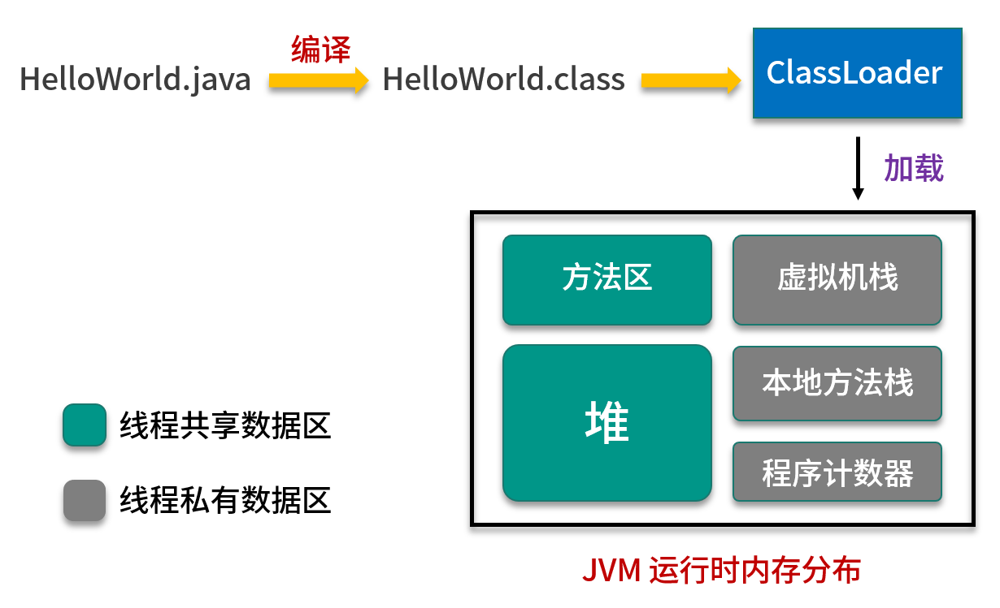
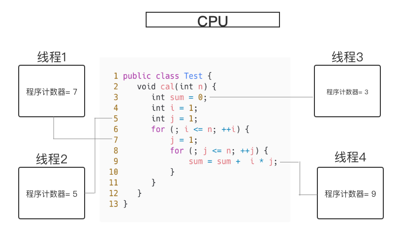
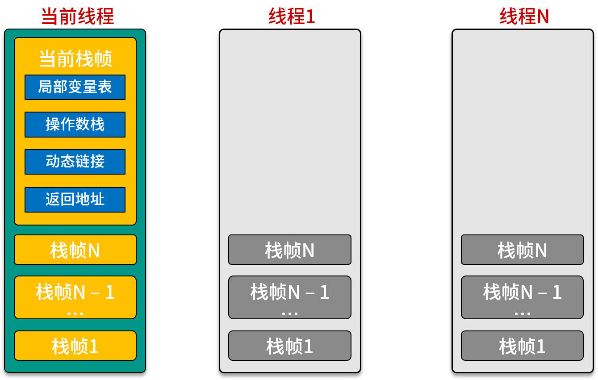
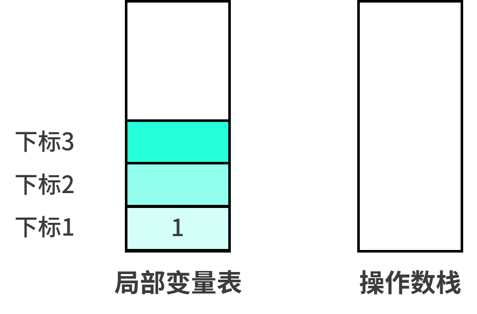
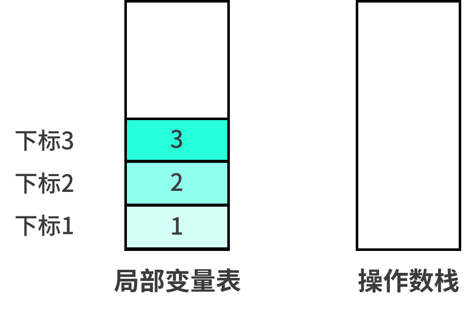
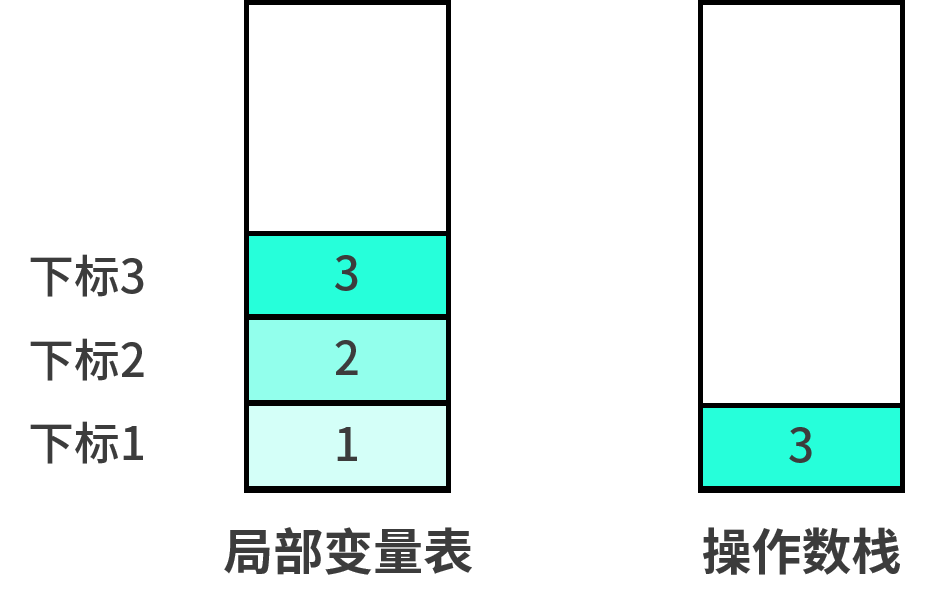
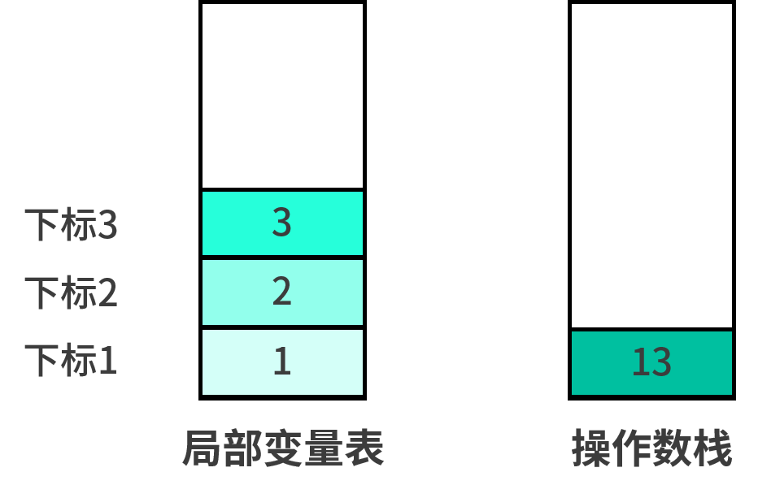
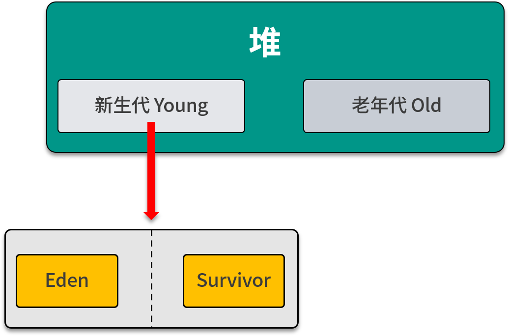
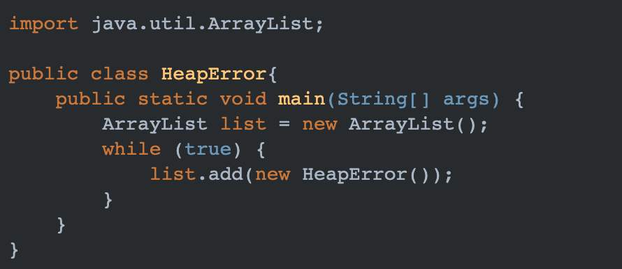
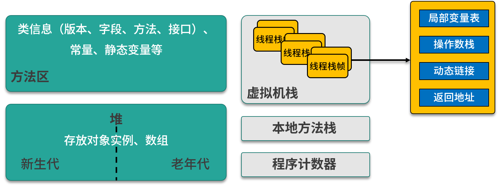

> version：2021/10/27
>
> review：2024/7/11-


# JVM工作流程

Java 虚拟机在执行 Java 程序的过程中，会把它所管理的内存划分为不同的数据区域。下面这张图描述了**一个 HelloWorld.java 文件被 JVM 加载到内存中**的过程：



1. HelloWorld.java 文件首先经过编译器编译，生成 HelloWorld.class 字节码文件。
2. Java 程序中访问HelloWorld这个类时，需要通过 ClassLoader(类加载器)将HelloWorld.class 加载到 JVM 的内存中。
3. JVM 中的内存可以划分为若干个不同的数据区域（Runtime Data Area），主要分为：**虚拟机栈、本地方法栈、程序计数器、方法区、堆**。

# 运行时数据区

## 程序计数器（Program Counter Register）

Java 程序是多线程的，CPU 可以在多个线程中分配执行时间片段。当某一个线程被 CPU 挂起时，需要记录代码已经执行到的位置，方便 CPU 重新执行此线程时，知道从哪行指令开始执行。这就是**程序计数器**的作用。（每个线程都有一个程序计数器）

“程序计数器”是虚拟机中一块较小的内存空间，**主要用于记录当前线程执行到的位置（指令地址）**。

如下图所示：每个线程都会记录一个当前方法执行到的位置，当 CPU 切换回某一个线程上时，则根据程序计数器记录的数字，继续向下执行指令。



实际上除了上图演示的**恢复线程操作**之外，其它一些我们熟悉的**分支操作、循环操作、跳转、异常处理等也都需要依赖这个计数器来完成**。

关于程序计数器还有几点需要格外注意：

1. 在 Java 虚拟机规范中，对程序计数器这一区域没有规定任何 OutOfMemoryError 情况（或许是感觉没有必要吧）。

2. 线程私有的，每条线程内部都有一个私有程序计数器。它的生命周期随着线程的创建而创建，随着线程的结束而死亡。

3. 当一个线程正在执行一个 Java 方法的时候，这个计数器记录的是**正在执行的虚拟机字节码指令的地址**。如果正在执行的是 Native 方法，这个计数器值则为空（Undefined）。

## 虚拟机栈

虚拟机栈也是**线程私有**的，与线程的生命周期同步。在 Java 虚拟机规范中，对这个区域规定了两种异常状况：

1. **StackOverflowError**：当线程请求栈深度超出虚拟机栈所允许的深度时抛出。
2. **OutOfMemoryError**：当 Java 虚拟机动态扩展到无法申请足够内存时抛出。

在我们学习 Java 虚拟机的的过程当中，经常会看到一句话：

JVM 是基于栈的解释器执行的，DVM 是基于寄存器解释器执行的。

上面这句话里的“基于栈”指的就是**虚拟机栈**。虚拟机栈的初衷是用来描述 <u>Java 方法执行的内存模型</u>，<u>每个方法被执行的时候，JVM 都会在虚拟机栈中创建一个**栈帧**</u>，接下来看下这个栈帧是什么。

#### 栈帧

栈帧（Stack Frame）是用于支持虚拟机进行方法调用和方法执行的数据结构，每一个线程在执行某个方法时，都会为这个方法创建一个栈帧。

我们可以这样理解：一个线程包含多个栈帧，而每个栈帧内部包含**局部变量表**、**操作数栈**、**动态链接**、**返回地址**等。如下图所示：



#### 局部变量表

局部变量表是变量值的存储空间，我们**调用方法时传递的参数**，以及在**方法内部创建的局部变量**都保存在局部变量表中。在 Java 编译成 class 文件的时候，就会在方法的 **Code 属性表**中的 max_locals 数据项中，确定该方法需要分配的最大局部变量表的容量。如下代码所示：

```
public static int add(int k) {
	int i = 1;
	int j = 2;
	return i + j + k;
}
```

使用 javap -v 反编译之后，得到如下字节码指令：

```
public static int add(int);
  descriptor: (I)I
  flags: ACC_PUBLIC, ACC_STATIC
  Code:
    stack=2, locals=3, args_size=1
      0: iconst_1
      1: istore_1
      2: iconst_2
      3: istore_2
      4: iload_1
      5: iload_2
      6: iadd
      7: iload_0
      8: iadd
      9: ireturn
```

上面的 **locals=3** 就是代表局部变量表长度是 3，也就是说经过编译之后，局部变量表的长度已经确定为3，分别保存：参数 k 和局部变量 i、j。

> **注意**：系统**不会为局部变量赋予初始值**（实例变量和类变量都会被赋予初始值），也就是说不存在类变量那样的准备阶段。这一点会在后续的 Class 初始化文章详细介绍。

#### 操作数栈

操作数栈（Operand Stack）也常称为操作栈，它是一个后入先出栈（LIFO）。

<u>同局部变量表一样，操作数栈的最大深度也在编译的时候写入方法的Code属性表中的max_stacks数据项中。</u>栈中的元素可以是任意Java数据类型，包括long和double。

当一个方法刚刚开始执行的时候，这个方法的操作数栈是空的。在方法执行的过程中，会有各种字节码指令被压入和弹出操作数栈（比如：iadd指令就是将操作数栈中栈顶的两个元素弹出，执行加法运算，并将结果重新压回到操作数栈中）。

#### 动态链接

动态链接的主要目的是为了支持方法调用过程中的动态连接（Dynamic Linking）。

在一个 class 文件中，<u>一个方法要调用其他方法，需要将这些方法的符号引用转化为其所在内存地址中的直接引用</u>，而符号引用存在于**方法区**中。

Java 虚拟机栈中，<u>每个栈帧都包含一个指向运行时常量池中该栈所属方法的符号引用</u>，持有这个引用的目的就是为了支持方法调用过程中的动态连接（Dynamic Linking）。具体过程会在后续的字节码执行一文中介绍。

#### 返回地址

当一个方法开始执行后，只有两种方式可以退出这个方法：

- **正常退出**：指方法中的代码正常完成，或者遇到任意一个方法返回的字节码指令（如return）并退出，没有抛出任何异常。
- **异常退出**：指方法执行过程中遇到异常，并且这个异常在方法体内部没有得到处理，导致方法退出。

无论当前方法采用何种方式退出，在方法退出后都需要返回到**方法被调用的位置**，程序才能继续执行。而栈帧中的“返回地址”就是用来帮助当前方法恢复它的上层方法执行状态。

一般来说，方法正常退出时，调用者的 <u>PC 计数值</u>可以作为返回地址，栈帧中可能保存此计数值。而方法异常退出时，返回地址是通过<u>异常处理器表</u>确定的，栈帧中一般不会保存此部分信息。

#### 实例讲解

用一个简单的 **add()** 方法来演示, 代码如下：

```
public int add() {
  int i = 1;
  int j = 2;
  int result = i + j;
  return result + 10;
}
```

可以用 javap 命令来查看某个类的字节码指令，比如 add() 方法的代码，经过 javap 之后的字节码指令如下：

```
0: iconst_1    （把常量 1 压入操作数栈栈顶）
1: istore_1    （把操作数栈栈顶的出栈放入局部变量表索引为 1 的位置）
2: iconst_2    （把常量 2 压入操作数栈栈顶）
3: istore_2    （把操作数栈栈顶的出栈放入局部变量表索引为 2 的位置）
4: iload_1     （把局部变量表索引为 1 的值放入操作数栈栈顶）
5: iload_2     （把局部变量表索引为 2 的值放入操作数栈栈顶）
6: iadd        （将操作数栈栈顶的和栈顶下面的一个进行加法运算后放入栈顶）
7: istore_3    （把操作数栈栈顶的出栈放入局部变量表索引为 3 的位置）
8: iload_3     （把局部变量表索引为 3 的值放入操作数栈栈顶）
9: bipush 10   （把常量 10 压入操作数栈栈顶）
11: iadd       （将操作数栈栈顶的和栈顶下面的一个进行加法运算后放入栈顶）
12: ireturn    （结束）
```

从上面字节码指令也可以看到，其实局部变量表和操作数栈在代码执行期间是协同合作来达到某一运算效果的。接下来通过图示来看下这几行代码执行期间，虚拟机栈的实际情况。

首先说一下各个指令代表什么意思：

- **iconst 和 bipush**，这两个指令都是将常量压入操作数栈顶，区别就是：当 int 取值 -1~5 采用 iconst 指令，取值 -128~127 采用 bipush 指令。
- **istore** 将操作数栈顶的元素放入局部变量表的某索引位置，比如 istore_5 代表将操作数栈顶元素放入局部变量表下标为 5 的位置。
- **iload** 将局部变量表中某下标上的值加载到操作数栈顶中，比如 iload_2 代表将局部变量表索引为 2 上的值压入操作数栈顶。
- **iadd** 代表加法运算，具体是将操作数栈最上方的两个元素进行相加操作，然后将结果重新压入栈顶。

首先在 Add.java 被编译成 Add.class 的时候，**栈帧中需要多大的局部变量表，多深的操作数栈都已经完全确定了，并且写入到了方法表的 Code 属性中**。因此这会局部变量表的大小是确定的，add() 方法中有 3 个局部变量，因此局部变量表的大小为 3，但是操作数栈此时为空。

所以代码刚执行到 add 方法时，局部变量表和操作数栈的情况如下：


icons_1  把常量 1 压入操作数栈顶，结果如下：


istore_1 把操作数栈顶的元素出栈并放入局部变量表下标为 1 的位置，结果如下：



**可以看出此时操作数栈重新变为空，并将出栈的元素 1 保存在局部变量表中。**

iconst_2 把常量 2 压入操作数栈顶，结果如下：


istore_2 把操作数栈顶的元素出栈并放入局部变量表下标为 2 的位置，结果如下：


接下来是两步 iload 操作，分别是 iload_1 和 iload_2。分别代表的是将局部变量表中下标为 1 和下标为 2 的元素重新压入操作数栈中，结果如下：


接下来进行 iadd 操作，这个操作会将栈顶最上方的两个元素（也就是 1、2）进行加法操作，然后将结果重新压入到栈顶，执行完之后的结果如下：


istore_3 将操作数栈顶的元素出栈，并保存在局部变量表下标为 3 的位置。结果如下：



iload_3 将局部变量表中下标为 3 的元素重新压入到操作数栈顶，结果如下：


bipush 10 将常量 10 压入到操作数栈中，结果如下：


再次执行 iadd 操作，注意此时栈顶最上方的两个元素为 3 和 10，所以执行完结果如下：


最后执行 return 指令，将操作数栈顶的元素 13 返回给上层方法。至此 add() 方法执行完毕。局部变量表和操作数栈也会相继被销毁。

## 本地方法栈

本地方法栈和上面介绍的虚拟栈基本相同，只不过是针对本地（native）方法。在开发中如果涉及 JNI 可能接触本地方法栈多一些，在有些虚拟机的实现中已经将两个合二为一了（比如HotSpot）。

## 堆

Java 堆（Heap）是 JVM 所管理的内存中最大的一块，**堆用来存放对象实例**，几乎所有对象的实例都在堆里面分配，因此它也是 Java 垃圾收集器（GC）管理的主要区域，有时候也叫作“GC 堆”（**关于堆的 GC 回收机制将会在后续文章中做详细介绍**）。同时它也是所有**线程共享**的内存区域，<u>因此被分配在此区域的对象如果被多个线程访问的话，需要考虑线程安全问题。</u>

按照对象存储时间的不同，堆中的内存可以划分为**新生代**（Young）和**老年代**（Old），其中新生代又被划分为 Eden 和 Survivor 区。具体如下图所示：



图中**不同的区域存放具有不同生命周期的对象。这样可以根据不同的区域使用不同的垃圾回收算法，从而更具有针对性，进而提高垃圾回收效率。**

## 方法区

方法区（Method Area）也是 JVM 规范里规定的一块运行时数据区。方法区主要是存储已经被 JVM 加载的**类信息（版本、字段、方法、接口）、常量、静态变量、即时编译器编译后的代码和数据**。该区域同堆一样，也是被各个**线程共享**的内存区域。

**注意：关于方法区，很多开发者会将其跟“永久区”混淆**。所以我在这里对这两个概念进行一下对比：

- 方法区是 JVM 规范中规定的一块区域，但是并不是实际实现，切忌将规范跟实现混为一谈，不同的 JVM 厂商可以有不同版本的“方法区”的实现。
- HotSpot 在 JDK 1.7 以前使用“永久区”（或者叫 Perm 区）来实现**方法区**，在 JDK 1.8 之后“永久区”就已经被移除了，取而代之的是一个叫作“元空间（metaspace）”的实现方式。

**总结一下就是**：

- 方法区是规范层面的东西，规定了这一个区域要存放哪些数据。
- 永久区或者是 metaspace 是对方法区的不同实现，是实现层面的东西。

## 异常再现

### StackOverflowError 栈溢出异常

**递归**调用是造成StackOverflowError的一个常见场景，比如以下代码：


在method方法中，递归调用了自身，并且没有设置递归结束条件。运行上述代码时，则会产生StackOverflowError。


原因就是每调用一次method方法时，都会在虚拟机栈中创建出一个栈帧。因为是递归调用，method方法并不会退出，也不会将栈帧销毁，所以必然会导致StackOverflowError。因此当需要使用递归时，需要格外谨慎。

### OutOfMemoryError 内存溢出异常

理论上，虚拟机栈、堆、方法区都有发生OutOfMemoryError的可能。但是实际项目中，大多发生于堆当中。比如以下代码：



在一个无限循环中，动态的向ArrayList中添加新的HeapError对象。这会不断的占用堆中的内存，当堆内存不够时，必然会产生OutOfMemoryError，也就是内存溢出异常。

# 总结

对于 JVM 运行时内存布局，我们需要始终记住一点：上面介绍的**这 5 块内容都是在 Java 虚拟机规范中定义的规则**，这些规则只是描述了各个区域是负责做什么事情、存储什么样的数据、如何处理异常、是否允许线程间共享等。千万不要将它们理解为虚拟机的“**具体实现**”，虚拟机的具体实现有很多，比如 Sun 公司的 HotSpot、JRocket、IBM J9、以及我们非常熟悉的 Android Dalvik 和 ART 等。这些具体实现在符合上面 5 种运行时数据区的前提下，又各自有不同的实现方式。

最后我们借助一张图来概括一下本课时所介绍的内容：



总结来说，JVM 的运行时内存结构中一共有两个“栈”和一个“堆”，分别是：Java 虚拟机栈和本地方法栈，以及“GC堆”和方法区。除此之外还有一个程序计数器，但是我们开发者几乎不会用到这一部分，所以并不是重点学习内容。 JVM 内存中只有堆和方法区是线程共享的数据区域，其它区域都是线程私有的。并且程序计数器是唯一一个在 Java 虚拟机规范中没有规定任何 OutOfMemoryError 情况的区域。


# 附录

## 附录一：JVM架构图


注：探测器（事件检查器）


# 问题

<font color='orange'>Q：java的内存结构</font>


<font color='orange'>Q：Java可以自动管理内存，为什么会有OOM</font>

首先每个进程分配到的内存是有限的，然后java管理内存时，只会通过GC清除无用的对象，如果使用的都是必须的或者说是强引用，那么就不会被清除的，这样内存就会被消耗掉，当在往堆中申请使用内存时，如果不够了，就会抛出OOM。

<font color='orange'>Q：Java内存管理</font>

内存结构+GC。

<font color='orange'>Q：StackOverFlow与OOM的区别？分别发生在什么时候，JVM栈中存储的是什么，堆存储的是什么？（美团）</font>

栈溢出发生在虚拟机栈中，当方法一直递归调用或者其他方式导致方法数量达到规定的上限，就会抛出栈溢出。

OOM在方法区、堆、虚拟机栈中都会发生，是因为内存不够用了。

栈中存放栈帧，每调用一个方法，就会在栈中创建一个栈帧。

<font color='orange'>Q：请描述new一个对象的流程。</font>

在Java中，使用`new`关键字创建一个对象的流程大致可以分为以下几个步骤，这个流程涉及Java虚拟机（JVM）的类加载机制和对象创建机制：

1. 类加载检查

- **确认类元信息是否存在**：当JVM接收到`new`指令时，首先会检查需要创建的类的信息是否存在。这一步是确保类已经被JVM加载到内存中。
- **类加载过程**：如果类元信息不存在，JVM会通过类加载器（ClassLoader）加载类。加载过程包括加载、验证、准备、解析和初始化五个阶段。

2. 分配内存

- **计算对象大小**
- **内存分配**：JVM在堆（Heap）中分配一块连续的内存空间给新对象。

3. 初始化

- **设置默认值**：为新对象的所有实例变量设置默认值。基本数据类型的实例变量会被初始化为对应类型的零值（如整型为0，布尔型为false），而引用类型的实例变量会被初始化为null。
- **设置对象头**：设置新对象的对象头信息，包括哈希码（HashCode）、GC信息（垃圾收集器相关信息）、锁信息（如锁的状态）、对象所属的类元信息等。

4. 执行构造函数

- **调用构造函数**：最后，JVM会调用对象的构造函数来初始化对象。构造函数会根据定义的参数列表执行一系列操作，如初始化实例变量、执行其他方法等。构造函数执行完毕后，对象的创建过程完成。

<font color='orange'>Q：Java对象会不会分配到栈中？</font>

对象会被分配到堆中。

<font color='orange'>Q：JVM内存区域，开线程影响哪块区域内存？</font>

虚拟机栈、本地方法栈、程序计数器，这三个区域是随着线程生成而产生，线程销毁而销毁。

> 实际应该都会影响到。因为每个线程一般都会创建对象，因此涉及到堆，又因为对象的创建又依赖于Class，所以也会涉及到方法区。

<font color='orange'>Q：共享内存了解吗，共享内存分配的内存在哪个区域</font>

在JVM的上下文中讨论“共享内存”的类似概念，那么可以认为JVM中的堆（Heap）和方法区（Method Area，在JDK 8之后被元空间Metaspace取代）是线程共享的内存区域，它们可以被视为JVM内部的“共享内存”。但请注意，这里的“共享内存”与操作系统层面上的共享内存机制（如POSIX共享内存、Windows共享内存等）是不同的概念。

关于操作系统层面的共享内存与JVM内存区域的直接对应关系，需要明确的是：

- JVM内存区域（如堆、方法区）是JVM为了执行Java程序而划分的逻辑区域，它们与操作系统层面的内存管理机制（如物理内存、虚拟内存、共享内存等）是不同层面的概念。
- 如果Java程序需要通过JNI（Java Native Interface）或其他机制访问操作系统层面的共享内存，那么这部分内存将不会直接体现在JVM的内存区域划分中，而是需要通过特定的API或系统调用来进行访问和管理。

<font color='orange'>Q：虚拟机栈中为啥会有局部变量表？它的设计初衷是什么？</font>

局部变量表是在方法执行时，用来**存储局部变量和传入的参数**。会和操作数栈配合使用。

局部变量表是建立在线程的栈上，是线程的私有数据，不存在数据安全问题。

设计初衷之一是提高访问局部变量的效率。

局部变量表在编译期就能确定其大小，因此可以采用数组等数据结构来实现，从而优化内存的使用。


# 参考

