> version：2021/10/27
>
> review：2024/7/12


不同于C语言，在 Java 中，不需要手动释放对象的内存，JVM 中的垃圾回收器（Garbage Collector）会为我们自动回收。但是这种幸福是有代价的：一旦这种自动化机制出错，我们又不得不去深入理解 GC 回收机制，甚至需要对这些“自动化”的技术实施必要的监控和调节。

 Java 内存运行时区域的各个部分，其中程序计数器、虚拟机栈、本地方法栈 3 个区域随线程而生，随线程而灭；栈中的栈帧随着方法的进入和退出而有条不紊地执行着出栈和入栈操作，这几个区域内不需要过多考虑回收的问题。

而**堆和方法区**则不一样，一个接口中的多个实现类需要的内存可能不一样，一个方法中的多个分支需要的内存也可能不一样，我们只有在程序处于运行期间时才能知道会创建哪些对象，这部分内存的分配和回收都是动态的，垃圾收集器所关注的就是这部分内存。

# 什么是垃圾

垃圾就是内存中已经没有用的对象。 既然是”垃圾回收"，那就必须知道哪些对象是垃圾。

# 对象存活判断

1. **引用计数**
2. Java 虚拟机中使用一种叫作"**可达性分析”**的算法来确定对象是否可以被回收。

## 引用计数

每个对象有一个引用计数属性，当对象被引用，计数器加1，当引用释放，计数器减1。当计数器为0时， 表示引用失效，也就是"死对象"，可以被垃圾回收机制回收。

缺陷：无法解决循环依赖的问题。有两个对象A、B。当A引用B，B引用A时，那么此时A、B对象都不为0，垃圾回收机制无法被回收。

## 可达性分析

可达性分析算法是从离散数学中的图论引入的，JVM 把内存中所有的对象之间的引用关系看作一张图，通过一组名为”GC Root"的对象作为起始点，从这些节点开始向下搜索，搜索所走过的路径称为引用链，最后通过判断对象的引用链是否可达来决定对象是否可以被回收。如下图所示：


比如上图中，对象A/B/C/D/E 与 GC Root 之间都存在一条直接或者间接的引用链，这也代表它们与 GC Root 之间是可达的，因此它们是不能被 GC 回收掉的。而对象M和K虽然被对象 J 引用到，但是并不存在一条引用链连接它们与 GC Root，所以当 GC 进行垃圾回收时，只要遍历到 J/K/M 这 3 个对象，就会将它们回收。

> 注意：上图中圆形图标虽然标记的是对象，但实际上代表的是此对象在内存中的引用。包括 GC Root 也是一组引用而并非对象。

## GC Root 对象

在 Java 中，有以下几种对象可以作为 GC Root：

1. Java 虚拟机栈（局部变量表）中的引用的对象。
2. 方法区中常量(静态)、静态属性引用的对象。
3. 仍处于存活状态中的线程对象。
4. Native 方法中 JNI 引用的对象。

# 1.2 什么时候回收

不同的虚拟机实现有着不同的 GC 实现机制，但是一般情况下每一种 GC 实现都会在以下两种情况下触发垃圾回收。

1. Allocation Failure：在堆内存中分配时，如果因为可用剩余空间不足导致对象内存分配失败，这时系统会触发一次 GC。
2. System.gc()：在应用层，可以主动调用此 API 来请求一次 GC。

# 1.3 代码验证 GC Root 的几种情况

了解了 Java 中的 GC Root，以及何时触发 GC，接下来就通过几个案例来验证 GC Root 的情况。在看具体代码之前，我们先了解一个执行 Java 命令时的参数。

> -Xms 初始分配 JVM 运行时的内存大小，如果不指定默认为物理内存的 1/64。

比如我们运行如下命令执行 HelloWorld 程序，从物理内存中分配出 200M 空间给 JVM 内存。

```
java -Xms200m HelloWorld
```

#### 1.3.1 验证虚拟机栈（栈帧中的局部变量）中引用的对象作为 GC Root

运行如下代码：

```java
public class GCRootLocalVariable {
    private int _10MB = 10 * 1024 * 1024;
    private byte[] memory = new byte[8 * _10MB];

    public static void main(String[] args) {
        System.out.println("开始时:");
        printMemory();
        method();
        System.gc();
        System.out.println("第二次GC完成");
        printMemory();
    }

    private static void method() {
        GCRootLocalVariable g = new GCRootLocalVariable();
        System.gc();
        System.out.println("第一次GC完成");
        printMemory();
    }

    /**
     * 打印出当前 JVM 剩余空间和总的空间大小
     */
    private static void printMemory() {
        System.out.println("free is " + Runtime.getRuntime().freeMemory() / 1024 / 1024 + " M");
        System.out.println("total is " + Runtime.getRuntime().totalMemory() / 1024 / 1024 + " M");
    }
}
```

> 注：如果出现中文乱码，可以在命令中加入：-Dfile.encoding=utf-8
>
> java -Xms200m -Dfile.encoding=utf-8 xxx.java

打印日志：

```
开始时
free is 175 M
total is 200 M
第一次GC完成
free is 112 M
total is 200 M
第二次GC完成
free is 196 M
total is 200 M
```

可以看出：

- 当第一次 GC 时，g 作为局部变量，引用了 new 出的对象（80M），并且它作为 GC Roots，在 GC 后并不会被 GC 回收。
- 当第二次 GC：method() 方法执行完后，局部变量 g 跟随方法消失，不再有引用类型指向该 80M 对象，所以第二次 GC 后此 80M 也会被回收。

> **注意**：上面日志包括后面的实例中，因为有中间变量，所以会一定的误差，但不影响我们分析 GC 过程。

#### 1.3.2 验证方法区中的静态变量引用的对象作为 GC Root

运行如下代码：

```java
public class GCRootStaticVariable {
    private static int _10MB = 10 * 1024 * 1024;
    private byte[] memory;
    private static GCRootStaticVariable staticVariable;

    public GCRootStaticVariable(int size) {
        memory = new byte[size];
    }

    public static void main(String[] args) {
        System.out.println("程序开始:");
        printMemory();
        GCRootStaticVariable g = new GCRootStaticVariable(4 * _10MB);
        g.staticVariable = new GCRootStaticVariable(8 * _10MB);
        // 将g置为null，调用GC时可以回收此对象内存
        g = null;
        System.gc();
        System.out.println("GC完成");
        printMemory();
    }

    /**
     * JVM
     */
    public static void printMemory() {
        System.out.print("free is " + Runtime.getRuntime().freeMemory() / 1024 / 1024 + " M,");
        System.out.println("total is " + Runtime.getRuntime().totalMemory() / 1024 / 1024 + " M");
    }
}
```

打印日志：

```
程序开始:
free is 190 M,total is 200 M
GC完成
free is 110 M,total is 200 M
```

可以看出：

程序刚开始运行时内存为 190M，分别创建了 g 对象（40M），以及初始化 g 对象内部的静态变量 staticVariable 对象（80M）。

当调用 GC 时，只有 g 对象的 40M 被 GC 回收掉，而静态变量 staticVariable 作为 GC Root，它引用的 80M 并不会被回收。

#### 1.3.3 验证活跃线程作为 GC Root

运行如下代码：

```java
public class GCRootThread {
    private int _10MB = 10 * 1024 * 1024;
    private byte[] memory = new byte[8 * _10MB];

    public static void main(String[] args) throws Exception {
        System.out.println("开始前内存情况:");
        printMemory();
        AsyncTask at = new AsyncTask(new GCRootThread());
        Thread thread = new Thread(at);
        thread.start();
        System.gc();
        System.out.println("main方法执行完毕，完成GC");
        printMemory();
        thread.join();
        at = null;
        System.gc();
        System.out.println("线程代码执行完毕，完成GC");
        printMemory();
    }

    /**
     * 打印出当前JVM剩余空间和总的空间大小
     */
    public static void printMemory() {
        System.out.print("free  is  " + Runtime.getRuntime().freeMemory() / 1024 / 1024 + "  M,  ");
        System.out.println("total  is  " + Runtime.getRuntime().totalMemory() / 1024 / 1024 + "  M,  ");
    }

    private static class AsyncTask implements Runnable {
        private GCRootThread gcRootThread;

        public AsyncTask(GCRootThread gcRootThread) {
            this.gcRootThread = gcRootThread;
        }

        @Override
        public void run() {
            try {
                Thread.sleep(500L);
            } catch (Exception e) {
            }
        }
    }
}
```

```
开始前内存情况:
free  is  190 Mtotal  is  200 M
main方法执行完毕，完成GC
free  is  110 Mtotal  is  200 M
线程代码执行完毕，完成GC
free  is  194 Mtotal  is  200 M
```

程序刚开始时是 190M 内存，当调用第一次 GC 时线程并没有执行结束，并且它作为 GC Root，所以它所引用的 80M 内存并不会被 GC 回收掉。 **thread.join() 保证线程结束再调用后续代码**，所以当调用第二次 GC 时，线程已经执行完毕并被置为 null，这时线程已经被销毁，所以之前它所引用的 80M 此时会被 GC 回收掉。

#### 1.3.4 测试成员变量是否可作为 GC Root

运行如下代码：

```java
public class GCRootClassVariable {
    private static int _10MB = 10 * 1024 * 1024;
    private byte[] memory;
    private GCRootClassVariable classVariable;

    public GCRootClassVariable(int size) {
        memory = new byte[size];
    }

    public static void main(String[] args) {
        System.out.println("程序开始:");
        printMemory();
        GCRootClassVariable g = new GCRootClassVariable(4 * _10MB);
        g.classVariable = new GCRootClassVariable(8 * _10MB);
        g = null;
        System.gc();
        System.out.println("GC完成");
        printMemory();
    }

    /**
     * 打印出当前JVM剩余空间和总的空间大小
     */
    public static void printMemory() {
        System.out.print("free is " + Runtime.getRuntime().freeMemory() / 1024 / 1024 + " M");
        System.out.println("total is " + Runtime.getRuntime().totalMemory() / 1024 / 1024 + " M");
    }
}
```

打印日志：

```
程序开始:
free is 190 Mtotal is 200 M
GC完成
free is 194 Mtotal is 200 M
```

从上面日志中可以看出当调用 GC 时，因为 g 已经置为 null，因此 g 中的全局变量 classVariable 此时也不再被 GC Root 所引用。所以最后 g(40M) 和 classVariable(80M) 都会被回收掉。**这也表明成员变量同静态变量不同，它不会被当作 GC Root**。

> 上面演示的这几种情况往往也是内存泄漏发生的场景，设想一下我们将各个 Test 类换成 Android 中的 Activity 的话将导致 Activity 无法被系统回收，而一个 Activity 中的数据往往是较大的，因此内存泄漏导致 Activity 无法回收还是比较致命的。

# 3、如何回收垃圾

垃圾收集算法的实现涉及大量的程序细节，各家虚拟机厂商对其实现细节各不相同，因此本文并不过多的讨论算法的实现，只是介绍几种算法的思想以及优缺点。

#### 3.1 标记清除算法（Mark and Sweep GC）

从”GC Roots”集合开始，将内存整个遍历一次，保留所有可以被 GC Roots 直接或间接引用到的对象，而剩下的对象都当作垃圾对待并回收，过程分两步。

1. **Mark 标记阶段**：找到内存中的所有 GC Root 对象，只要是和 GC Root 对象直接或者间接相连则标记为灰色（也就是存活对象），否则标记为黑色（也就是垃圾对象）。
2. **Sweep 清除阶段**：当遍历完所有的 GC Root 之后，则将标记为垃圾的对象直接清除。

如下图所示：

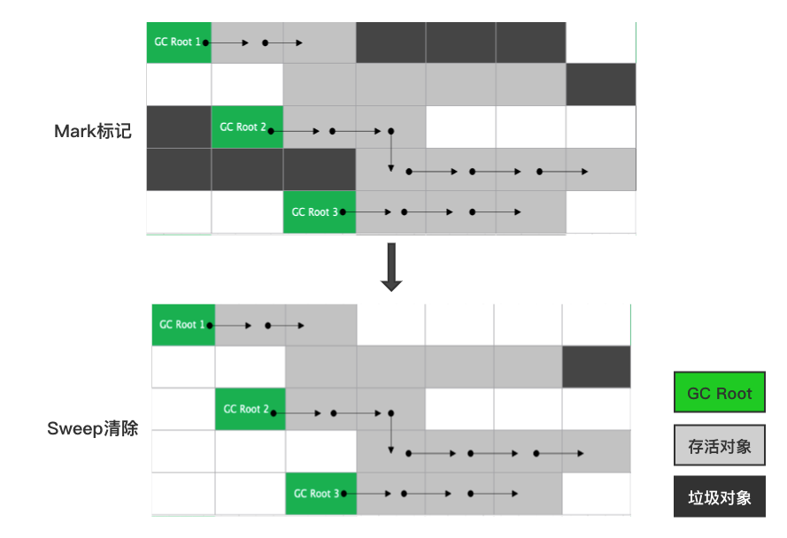

- **优点**：实现简单，不需要将对象进行移动。
- **缺点**：这个算法需要中断进程内其他组件的执行（stop the world），并且可能产生内存碎片，提高了垃圾回收的频率。（详细：效率问题，标记和清楚效率都不高；空间问题，标记清除后产生大量不连续的内存碎片，空间碎片太多可能会导致，当程序以后需要分配较大对象而没有足够连续空间时，就不得不提前触发另一次GC）

> 标记清楚是最基础的收集算法，因为后续的收集算法都是基于这种思路并对其缺点进行改进而得到的。

#### 3.2 复制算法（Copying）

将现有的内存空间分为两快，每次只使用其中一块，在垃圾回收时将正在使用的内存中的存活对象复制到未被使用的内存块中。之后，清除正在使用的内存块中的所有对象，交换两个内存的角色，完成垃圾回收。

1. 复制算法之前，内存分为 A/B 两块，并且当前只使用内存 A，内存的状况如下图所示：

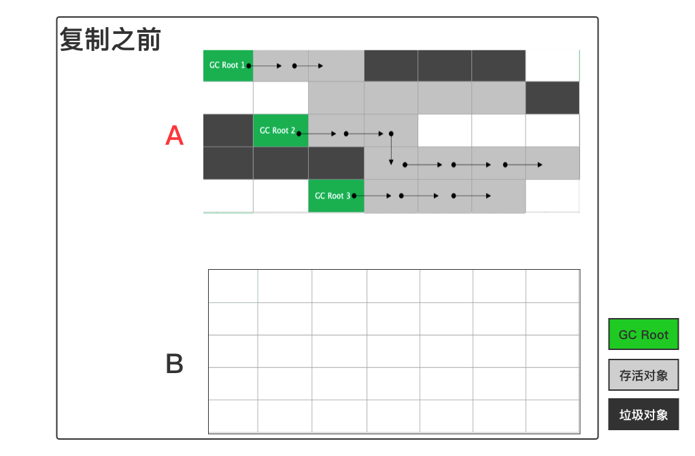

2. 标记完之后，所有可达对象都被按次序复制到内存 B 中，并设置 B 为当前使用中的内存（只要移动堆指针即可A->B）。内存状况如下图所示：

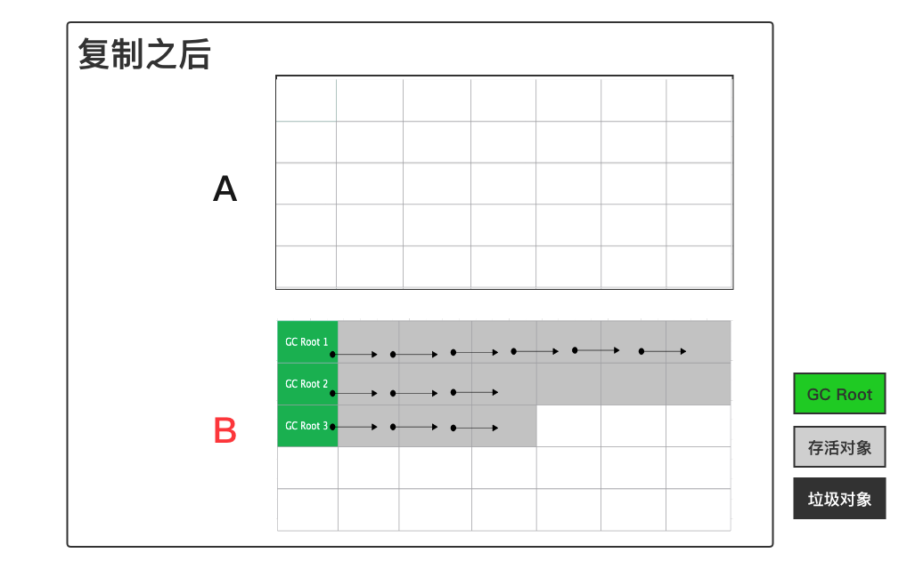

- **优点**：按顺序分配内存即可，实现简单、运行高效，不用考虑内存碎片。
- **缺点**：可用的内存大小缩小为原来的一半，对象存活率高时会频繁进行复制。导致效率降低。

> 复制算法在对象存活率较高时，效率会变低。为了不浪费50%的空间，还要额外空间进行分配担保，以应对内存中100%存活的极端情况，所以在老年代一般不能直接选用这种算法。

#### 3.3 标记-压缩(整理)算法 (Mark-Compact)

需要先从根节点开始对所有可达对象做一次标记，之后，它并不简单地清理未标记的对象，而是将所有的存活对象压缩到内存的一端。最后，清理边界外所有的空间。因此标记压缩也分两步完成：

1. **Mark 标记阶段**：找到内存中的所有 GC Root 对象，只要是和 GC Root 对象直接或者间接相连则标记为灰色（也就是存活对象），否则标记为黑色（也就是垃圾对象）。
2. **Compact 压缩阶段**：将剩余存活对象按顺序压缩到内存的某一端。

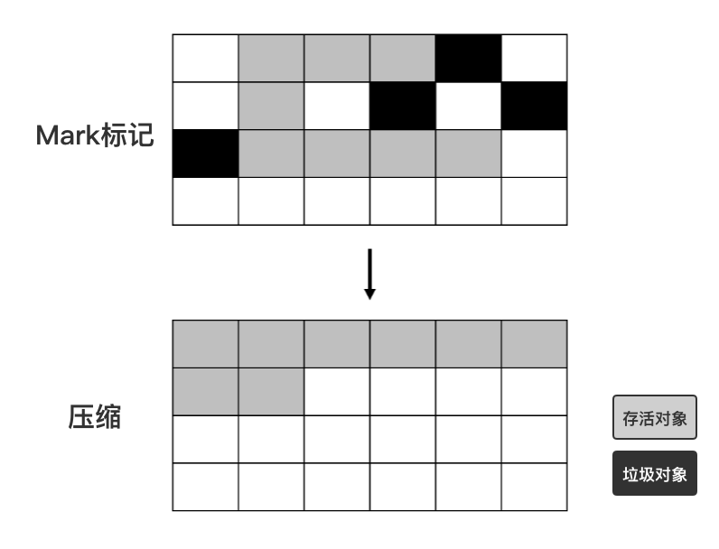

- **优点**：这种方法既避免了碎片的产生，又不需要两块相同的内存空间，因此，其性价比比较高。
- **缺点**：所谓压缩操作，仍需要进行局部对象移动，所以一定程度上还是降低了效率。

#### 3.4 分代收集算法

GC分代的基本假设：绝大部分对象的生命周期都非常短暂，存活时间短。

“分代收集（Generational Collection）”算法，把Java堆分为新生代和老年代，这样就可以根据各个年代的特点采用最适当的收集算法。在新生代中，每次垃圾收集时都发现有大批对象死去，只有少量存活，就选复制算法，只要付出少量存活对象的复制成本就可以完成收集。而老年代中因为对象存活率高、没有额外空间对它进行分配担保，就必须使用“标记清理”或“标记整理”来回收。

# 4 JVM分代回收策略

Java 虚拟机根据对象存活的周期不同，把堆内存划分为几块，一般分为**新生代**、**老年代**，这就是 JVM 的内存分代策略。**注意: 在 HotSpot 中除了新生代和老年代，还有永久代**

分代回收的中心思想就是：对于新创建的对象会在新生代中分配内存，此区域的对象生命周期一般较短。如果经过多次回收仍然存活下来，则将它们转移到老年代中。

#### 4.1 新生代（Young Generation）

新生成的对象优先存放在新生代中，新生代对象朝生夕死，存活率很低，在新生代中，常规应用进行一次垃圾收集一般可以回收 70%~95% 的空间，回收效率很高。新生代中因为要进行一些复制操作，所以一般采用的 GC 回收算法是复制算法。

新生代又可以继续细分为 3 部分：Eden、Survivor0（简称 S0或from）、Survivor1（简称S1或to）。这 3 部分按照 8:1:1 的比例来划分新生代。这 3 块区域的内存分配过程如下：

绝大多数刚刚被创建的对象会存放在 **Eden** 区。如图所示：

当 **Eden** 区第一次满的时候，会进行垃圾回收。首先将 **Eden**区的垃圾对象回收清除，并将存活的对象复制到 **S0**，此时 **S1**是空的。如图所示：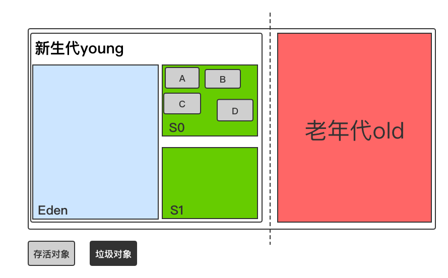

下一次 **Eden** 区满时，再执行一次垃圾回收。此次会将 **Eden**和 **S0**区中所有垃圾对象清除，并将存活对象复制到 **S1**，此时 **S0**变为空。如图所示：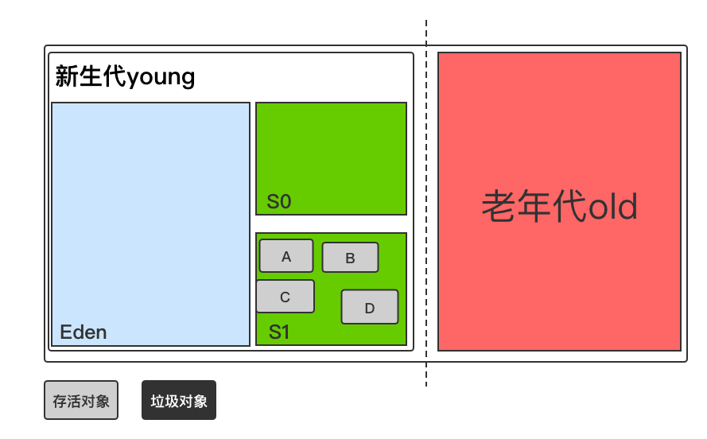

如此反复在 **S0** 和 **S1**之间切换几次（默认 15 次）之后，如果还有存活对象。说明这些对象的生命周期较长，则将它们转移到老年代中。如图所示：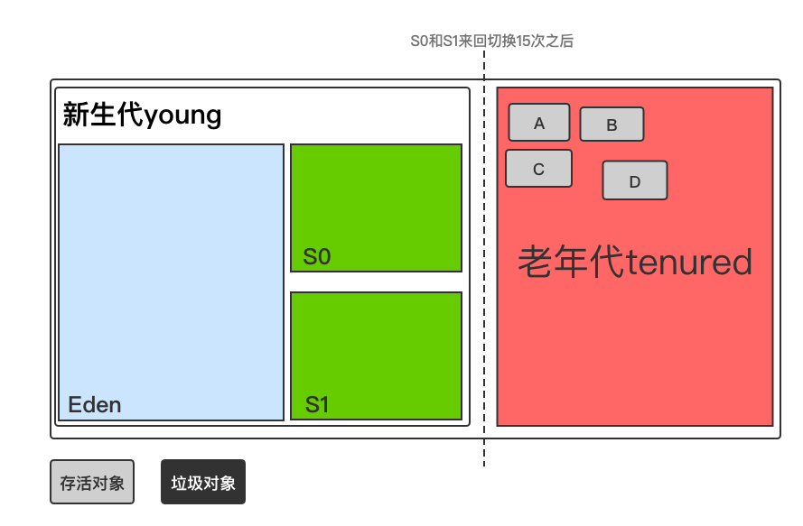


#### 4.3 老年代（Old Generation）

一个对象如果在新生代存活了足够长的时间而没有被清理掉，则会被复制到老年代。老年代的内存大小一般比新生代大，能存放更多的对象。如果对象比较大（比如长字符串或者大数组），并且新生代的剩余空间不足，则这个大对象会直接被分配到老年代上。

我们可以使用 -XX:PretenureSizeThreshold 来控制直接升入老年代的对象大小，大于这个值的对象会直接分配在老年代上。老年代因为对象的生命周期较长，不需要过多的复制操作，所以一般采用标记压缩的回收算法。

> **注意**：对于老年代可能存在这么一种情况，老年代中的对象有时候会引用到新生代对象。这时如果要执行新生代 GC，则可能需要查询整个老年代上可能存在引用新生代的情况，这显然是低效的。所以，老年代中维护了一个 512 byte 的 card table，所有老年代对象引用新生代对象的信息都记录在这里。每当新生代发生 GC 时，只需要检查这个 card table 即可，大大提高了性能。

# 5 垃圾收集器

#### 5.1 CMS收集器

#### 5.2 G1收集器

# 6、GC Log 分析

为了让上层应用开发人员更加方便的调试 Java 程序，JVM 提供了相应的 GC 日志。在 GC 执行垃圾回收事件的过程中，会有各种相应的 log 被打印出来。其中新生代和老年代所打印的日志是有区别的。

- 新生代 GC：这一区域的 GC 叫作 Minor GC。因为 Java 对象大多都具备朝生夕灭的特性，所以 Minor GC 非常频繁，一般回收速度也比较快。
- 老年代 GC：发生在这一区域的 GC 也叫作 Major GC 或者 Full GC。当出现了 Major GC，经常会伴随至少一次的 Minor GC。

> 注意：在有些虚拟机实现中，Major GC 和 Full GC 还是有一些区别的。Major GC 只是代表回收老年代的内存，而 Full GC 则代表回收整个堆中的内存，也就是新生代 + 老年代。

接下来就通过几个案例来分析如何查看 GC Log，分析这些 GC Log 的过程中也能再加深对 JVM 分代策略的理解。

首先我们需要理解几个 Java 命令的参数：

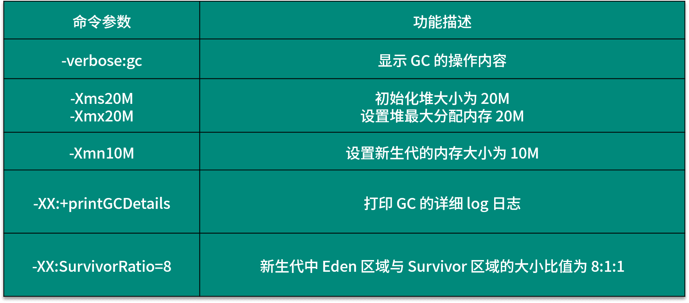

使用如下代码，在内存中创建 4 个 byte 类型数组来演示内存分配与 GC 的详细过程。代码如下：

```java
/**
* VM agrs: -Xms20M -Xmx20M -Xmn10M -XX:+PrintGCDetails
* -XX:SurvivorRatio=8
*/
public class MinorGCTest {
    private static final int _1MB = 1024 * 1024;
    public static void testAllocation() {
        byte[] a1, a2, a3, a4;
        a1 = new byte[2 * _1MB];
        a2 = new byte[2 * _1MB];
        a3 = new byte[2 * _1MB];
    }
    public static void main(String[] agrs) {
        testAllocation();
    }
}
```

通过上面的参数，可以看出堆内存总大小为 20M，其中新生代占 10M，剩下的 10M 会自动分配给老年代。执行上述代码打印日志如下：

执行命令：

```
java -Xms20M -Xmx20M -Xmn10M -XX:+PrintGCDetails -XX:SurvivorRatio=8 MinorGCTest
```

结果：

```
Heap
 PSYoungGen      total 9216K, used 7456K [0x00000000ff600000, 0x0000000100000000, 0x0000000100000000)
  eden space 8192K, 91% used [0x00000000ff600000,0x00000000ffd48048,0x00000000ffe00000)
  from space 1024K, 0% used [0x00000000fff00000,0x00000000fff00000,0x0000000100000000)
  to   space 1024K, 0% used [0x00000000ffe00000,0x00000000ffe00000,0x00000000fff00000)
 ParOldGen       total 10240K, used 0K [0x00000000fec00000, 0x00000000ff600000, 0x00000000ff600000)
  object space 10240K, 0% used [0x00000000fec00000,0x00000000fec00000,0x00000000ff600000)
 Metaspace       used 2579K, capacity 4486K, committed 4864K, reserved 1056768K
  class space    used 282K, capacity 386K, committed 512K, reserved 1048576K
```

日志中的各字段代表意义如下：

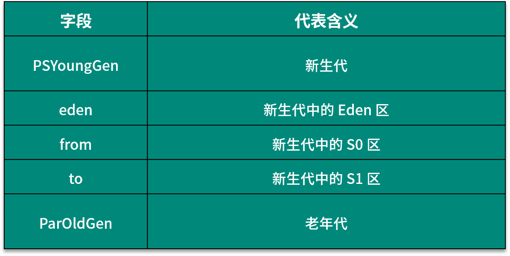

从日志中可以看出：程序执行完之后，a1、a2、a3 三个对象都被分配在了新生代的 Eden 区。

如果我们将测试代码中的 a4 初始化改为 a4 = new byte[2 * _1MB] 则打印日志如下：

```
[GC (Allocation Failure) [PSYoungGen: 7291K->888K(9216K)] 7291K->7040K(19456K), 0.0027103 secs] [Times: user=0.00 sys=0.00, real=0.00 secs]
[Full GC (Ergonomics) [PSYoungGen: 888K->0K(9216K)] [ParOldGen: 6152K->6771K(10240K)] 7040K->6771K(19456K), [Metaspace: 2573K->2573K(1056768K)], 0.0041544 secs] [Ti
mes: user=0.00 sys=0.00, real=0.00 secs]
Heap
 PSYoungGen      total 9216K, used 2130K [0x00000000ff600000, 0x0000000100000000, 0x0000000100000000)
  eden space 8192K, 26% used [0x00000000ff600000,0x00000000ff814930,0x00000000ffe00000)
  from space 1024K, 0% used [0x00000000ffe00000,0x00000000ffe00000,0x00000000fff00000)
  to   space 1024K, 0% used [0x00000000fff00000,0x00000000fff00000,0x0000000100000000)
 ParOldGen       total 10240K, used 6771K [0x00000000fec00000, 0x00000000ff600000, 0x00000000ff600000)
  object space 10240K, 66% used [0x00000000fec00000,0x00000000ff29cf90,0x00000000ff600000)
 Metaspace       used 2579K, capacity 4486K, committed 4864K, reserved 1056768K
  class space    used 282K, capacity 386K, committed 512K, reserved 1048576K
```

这是因为在给 a4 分配内存之前，Eden 区已经被占用 6M。已经无法再分配出 2M 来存储 a4 对象。因此会执行一次 Minor GC。并尝试将存活的 a1、a2、a3 复制到 S1 区。但是 S1 区只有 1M 空间，所以没有办法存储 a1、a2、a3 任意一个对象。在这种情况下 a1、a2、a3 将被转移到老年代，最后将 a4 保存在 Eden 区。**所以最终结果就是：Eden 区占用 2M（a4），老年代占用 6M（a1、a2、a3）。**

> 通过这个测试案例，我们也间接验证了 JVM 的内存分配和分代回收策略。建议多尝试使用各种命令参数，给堆的新生代和老年代设置不同的大小来验证不同的结果。

# 7、再谈引用

上文中已经介绍过，判断对象是否存活我们是通过GC Roots的引用可达性来判断的。但是JVM中的引用关系并不止一种，而是有四种，根据引用强度的由强到弱，他们分别是:**强引用**(Strong Reference)、**软引用**(Soft Reference)、**弱引用**(Weak Reference)、**虚引用**(Phantom Reference)。

四种引用做简单对比如下：

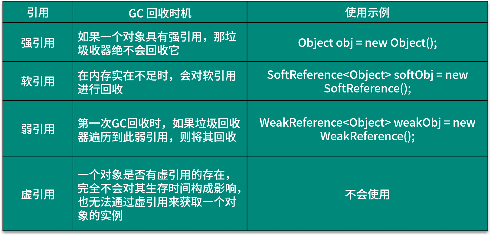

平时项目中，尤其是Android项目，因为有大量的图像(Bitmap)对象，使用软引用的场景较多。所以重点看下软引用SoftReference的使用，不当的使用软引用有时也会导致系统异常。

#### 软引用常规使用

常规使用代码如下：

```java
public class SoftReferenceNormal {
    static class SoftObject {
        byte[] data = new byte[120 * 1024 * 1024];
    }

    public static void main(String[] args) {
        // cache data
        SoftReference<SoftObject> cacheRef = new SoftReference<>(new SoftObject());
        System.out.println("before the first GC, softReference: " + cacheRef.get());
        // gc
        System.gc();
        System.out.println("after the first GC, softReference: " + cacheRef.get());
        // 创建一个120M的强引用
        SoftObject newSo = new SoftObject();
        System.out.println("then allocated 120M object, softReference: " + cacheRef.get());
    }
}
```

执行上述代码，打印日志如下：

```kotlin
before the first GC, softReference: com.lizw.core_apis.java.gc.SoftReferenceNormal$SoftObject@544fe44c
after the first GC, softReference: com.lizw.core_apis.java.gc.SoftReferenceNormal$SoftObject@544fe44c
then allocated 120M object, softReference: null
```

首先通过-Xmx将堆最大内存设置为200M。从日志中可以看出，当第一次GC时，内存中还有剩余可用内存，所以软引用并不会被GC回收。但是当我们再次创建一个120M的强引用时，JVM可用内存已经不够，所以会尝试将软引用给回收掉。

#### 软引用隐藏问题

需要注意的是，被软引用对象关联的对象会自动被垃圾回收器回收，但是软引用对象本身也是一个对象，这些创建的软引用并不会自动被垃圾回收器回收掉。比如如下代码：

```kotlin
public class SoftReferenceTest {
    public static class SoftObject {
        // 1KB
        byte[] data = new byte[1024];
    }

    // 100M
    public static int CACHE_INITIAL_CAPACITY = 100 * 1024;
    // 静态集合保存软引用，会导致这些软引用对象本身无法被垃圾回收器回收
    public static Set<SoftReference<SoftObject>> cache = new HashSet<>(CACHE_INITIAL_CAPACITY);

    public static void main(String[] args) {
        for (int i = 0; i < CACHE_INITIAL_CAPACITY; i++) {
            SoftObject object = new SoftObject();
            cache.add(new SoftReference<>(object));
            if (i % 10000 == 0) {
                System.out.println("size of cache: " + cache.size());
            }
        }
        System.out.println("end");
    }
}

```

> 注释：我在实际测试时，4M程序运行不起来；调大到10M后，运行报错OOM。
>

上述代码，虽然每一个SoftObject都被一个软引用所引用，在内存紧张时，GC会将SoftObject所占用的1KB回收。但是每一个SoftReference又都被Set所引用(强引用)。执行上述代码结果如下：


-Xmx4m限制堆内存大小为4M，最终程序崩溃，但是异常的原因并不是普通的堆内存溢出，而是"GC overhead"。之所以会抛出这个错误，是由于虚拟机一直在不断回收软引用，回收进行的速度过快，占用的cpu过大(超过98%)，并且每次回收掉的内存过小(小于2%)，导致最终抛出了这个错误。

这里需要做优化，合适的处理方式是注册一个引用队列，每次循环之后将引用队列中出现的软引用对象从cache中移除。如下所示：

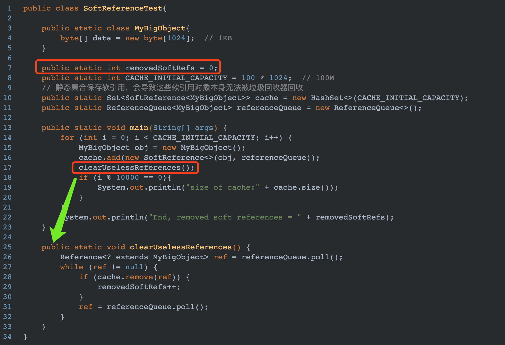

再次运行修改后的代码，结果如下：

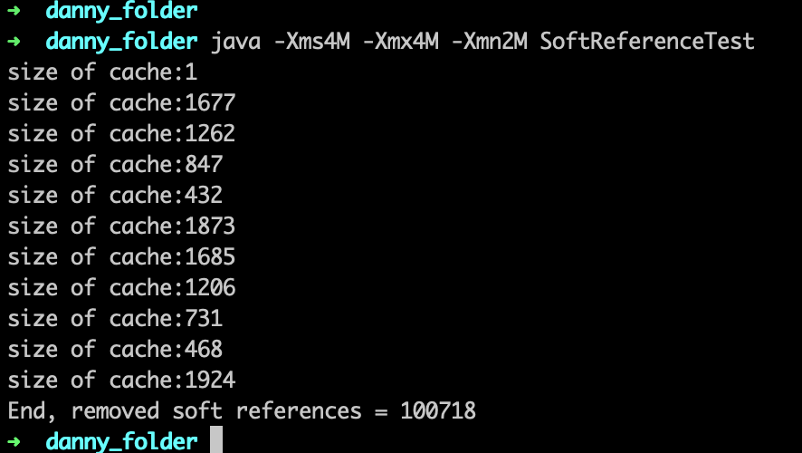

可以看出优化后，程序可以正常执行完。并且在执行过程中会动态的将集合中的软引用删除。

更多详细 SoftReference 的介绍，可以参考 ：

[Java虚拟机究竟是如何处理SoftReference的](https://mp.weixin.qq.com/s/XRCq3IDdGJt3Nq9Mu23U5g) 。

# 8、对可达性分析的补充以及finalize()

- **可达性分析 仅仅只是判断对象是否可达，但还不足以判断对象是否存活 / 死亡**
- 当在 可达性分析 中判断不可达的对象，只是“被判刑” = 还没真正死亡

> 不可达对象会被放在”即将回收“的集合里。

- 要判断一个对象真正死亡，还需要经历两个阶段：
  1. 第一次标记 & 筛选
  2. 第二次标记 & 筛选

### 8.1 第一次标记 & 筛选

- 对象 在 可达性分析中 被判断为不可达后，会被第一次标记 & 准备被筛选

> a. 不筛选：继续留在 ”即将回收“的集合里，等待回收；
> b. 筛选：从 ”即将回收“的集合取出

- 筛选的标准：该对象是否有必要执行 finalize()方法

1. 若有必要执行（人为设置），则筛选出来，进入下一阶段（第二次标记 & 筛选）；
2. 若没必要执行，判断该对象死亡，不筛选并等待回收

当对象无 finalize()方法 或 finalize()已被虚拟机调用过，则视为“没必要执行”

### 8.2 第二次标记 & 筛选

当对象经过了第一次的标记 & 筛选，会被进行**第二次标记 & 准备被进行 筛选**

a. 方式描述

该对象会被放到一个 `F-Queue` 队列中，并由虚拟机自动建立、优先级低的`Finalizer` 线程去执行队列中该对象的`finalize()`

> 1. `finalize()`只会被执行一次
> 2. 但并不承诺等待`finalize()`运行结束。这是为了防止 `finalize()`执行缓慢 / 停止 使得 `F-Queue`队列其他对象永久等待。

b. 筛选标准

在执行`finalize()`过程中，**若对象依然没与引用链上的`GC Roots` 直接关联 或 间接关联（即关联上与`GC Roots` 关联的对象）**，那么该对象将被判断死亡，不筛选（留在”即将回收“集合里） 并 等待回收

### 8.3 总结

1、是否有GC Roots引用链。若没有，放到“即将回收”集合中。

2、是否有必要执行finalize() （有且还未执行，就视为有必要）。若有必要，就放到F-Queue队列，等待执行finalize()。若不执行则判断死亡。

3、是否从F-Queue取出。如果对象与GC Roots再次关联，就取出，判断存活。否则判断死亡。

##### 流程图：


##### 示例：

```java
/**

 * 此代码演示了两点

 * 1、对象可以在被GC时自我拯救

 * 2、这种自救的机会只有一次，因为一个对象的finalize()方法最多只能被系统自动调用一次。
   */
public class FinalizeEscapeGC {
    public static FinalizeEscapeGC SAVE_HOOK = null;

    public void isAlive() {
        System.out.println("yes, I am still alive");
    }

    protected void finalize() throws Throwable {
        super.finalize();
        System.out.println("finalize method executed!");
        FinalizeEscapeGC.SAVE_HOOK = this;
    }

    public static void main(String[] args) throws InterruptedException {
        SAVE_HOOK = new FinalizeEscapeGC();
        //对象第一次成功拯救自己
        SAVE_HOOK = null;
        System.gc();

        //因为finalize方法优先级很低，所有暂停0.5秒以等待它
        Thread.sleep(500L);
        if (SAVE_HOOK != null) {
            SAVE_HOOK.isAlive();
        } else {
            System.out.println("no ,I am dead QAQ!");
        }

        //-----------------------
        // 以上代码与上面的完全相同,但这次自救却失败了！！！
        // 因为此对象的finalize()方法已经执行过一次了
        SAVE_HOOK = null;
        System.gc();

        //因为finalize方法优先级很低，所有暂停0.5秒以等待它
        Thread.sleep(1L);
        if (SAVE_HOOK != null) {
            SAVE_HOOK.isAlive();
        } else {
            System.out.println("no ,I am dead QAQ!");
        }
    }
}
```

Finalize()方法是对象脱逃死亡命运的最后一次机会，稍后GC将对F-Queue中的对象进行第二次小规模标记，如果对象要在finalize()中成功拯救自己----只要重新与引用链上的任何的一个对象建立关联即可，譬如把自己赋值给某个类变量或对象的成员变量，那在第二次标记时它将移除出“即将回收”的集合。如果对象这时候还没逃脱，那基本上它就真的被回收了。

> 可以尝试改变Thread的睡眠时间去观察finalize()的执行情况。

## 9、总结：

本文学习总结了 JVM 中有关垃圾回收的相关知识点，其中有使用可达性分析来判断对象是否可以被回收，以及 3 种垃圾回收算法。最后通过分析 GC Log 验证了 Java 虚拟机中内存分配及分代策略的一些细节。

虚拟机垃圾回收机制很多时候都是影响系统性能、并发能力的主要因素之一。尤其是对于从事 Android 开发的工程师来说，有时候垃圾回收会很大程度上影响 UI 线程，并造成界面卡顿现象。因此理解垃圾回收机制并学会分析 GC Log 也是一项必不可少的技能。在后面的 DVM 文章中，将总结 Android 虚拟机中对垃圾回收所做的优化。


# 问题

<font color='orange'>Q：垃圾回收机制</font>

垃圾回收是指 JVM 会回收不再使用的对象。整个过程包括触发GC、标记不再使用的对象、清除垃圾对象。

触发的时机是 JVM 在分配内存时，发现内存不够了，以及应用层主动调用System.gc()。

触发 GC 后，会基于可达性分析算法找出不再使用的对象。可达性分析是用来判断一个对象是否被 GCRoot 对象所引用，没有被 GCRoot 对象直接或间接持有的对象被视为垃圾对象，会被标记需要清除。

GCRoot 对象是指当前正在使用、一定不会被回收的对象，包括方法中的局部变量、常量、静态变量引用的对象、以及正在运行的线程等。

完成垃圾对象的标记后，会开始进行垃圾回收。常见的回收策略有标记清除算法、复制算法、标记整理算法和分代收集算法。

标记清除算法：直接清除垃圾对象，不作内存整理。优点是快速，缺点是会产生大量的不连续内存。

复制算法是将内存分为两块，每次只使用其中一块，当触发 GC 时，将存活的对象移动到另外一块内存中，并清除之前正在使用的内存块。优点是不会产生内存碎片，缺点是当存活的对象很多时，效率低，因为需要经常复制。

标记整理算法：会将存活的对象整理到内存块的一端，然后清除掉边界以外的垃圾对象。优点是不产生内存碎片、以及不用给内存进行分块，缺点是需要移动很多对象。

最后一种是分代回收策略，它将内存划分为新生代和老年代，新生代中又包括Eden、Survivor0、Survivor1几块。划分的依据是对象的生命周期不一样，有长有短。然后针对每一个内存块，可以采用不同的回收算法，以发挥出前面几种算法的优势、规避缺点。工作流程是，在内存中产生一个对象时，首先会放到新生代的Eden区域，当发生 GC 时，会将 Eden 中的存活的对象移到 S0，再发生 GC 时，又将所有存活的对象移到 S1，这样累计操作几次后，如果对象还存活，就会移动到老年代中。老年代的内存大小一般比新生代大，能存放更多的对象。

其他情况有，如果对象占用内存很大，也会直接放入老年代。

新生代一般采用复制算法，老年代采用标记整理算法。

<font color='orange'>Q：JVM中一次完整的GC流程是怎样的？</font>

整个过程包括触发GC、标记不再使用的对象、清除垃圾对象、整理内存，并且在对象正在回收前，会判断对象是否实现了 finalize() 方法，如果实现了，在回收前会执行一次。

<font color='orange'>Q：GC原理时机以及GC对象</font>

触发的时机是 JVM 在分配内存时，发现内存不够了，以及应用层主动调用System.gc()。

GC对象：不再使用的对象，不被 GCRoot 直接或间接持有的对象。

<font color='orange'>Q：Java内存回收的搜索算法</font>

引用计数和根搜索算法

<font color='orange'>Q：哪些情况下的对象会被垃圾回收机制处理掉？</font>

不被 GCRoot 直接或间接引用的对象。

<font color='orange'>Q：可以作为GCRoot根的对象有哪些</font>

局部变量、常量、静态变量引用的对象、以及正在运行的线程等、本地方法栈中的对象

<font color='orange'>Q：GC如何标记要回收的内存？</font>

可达性分析。可达性分析是用来判断一个对象是否被 GCRoot 对象所引用，没有被 GCRoot 对象直接或间接持有的对象被视为垃圾对象，会被标记需要清除。

<font color='orange'>Q：如何判断一个对象是否要被回收</font>

做可达性分析。

## 回收算法（策略）

<font color='orange'>Q：垃圾回收（GC/收集）算法（策略）有哪些？它们的特点是什么？ </font>

标记清除算法：直接清除垃圾对象，不作内存整理。优点是快速，缺点是会产生大量的不连续内存。

复制算法是将内存分为两块，每次只使用其中一块，当触发 GC 时，将存活的对象移动到另外一块内存中，并清除之前正在使用的内存块。优点是不会产生内存碎片，缺点是当存活的对象很多时，效率低，因为需要经常复制。

标记整理算法：会将存活的对象整理到内存块的一端，然后清除掉边界以外的垃圾对象。优点是不产生内存碎片、以及不用给内存进行分块，缺点是需要移动很多对象。

最后一种是分代回收策略，它将内存划分为新生代和老年代，新生代中又包括Eden、Survivor0、Survivor1几块。划分的依据是对象的生命周期不一样，有长有短。然后针对每一个内存块，可以采用不同的回收算法，以发挥出前面几种算法的优势、规避缺点。工作流程是，在内存中产生一个对象时，首先会放到新生代的Eden区域，当发生 GC 时，会将 Eden 中的存活的对象移到 S0，再发生 GC 时，又将所有存活的对象移到 S1，这样累计操作几次后，如果对象还存活，就会移动到老年代中。老年代的内存大小一般比新生代大，能存放更多的对象。

<font color='orange'>Q：进行标记整理时容易出现什么问题？</font>

标记整理算法分为标记和整理两个阶段。在标记阶段，需要遍历堆中的所有对象，标记出存活的对象。在整理阶段，需要将存活的对象移动到堆的一端，并清除边界以外的对象。这两个阶段都需要消耗大量的CPU时间，尤其是在堆内存较大或存活对象较多时。

**内存移动开销**：整理阶段需要移动存活的对象，这会导致额外的内存写操作。当存活对象较多时，内存移动的开销会显著增加。此外，移动对象还需要更新所有指向这些对象的引用，这也会增加额外的开销。

**长停顿**：与标记清除算法相比，标记整理算法在整理阶段需要移动对象，这通常会导致更长的停顿时间。在GC（垃圾回收）过程中，应用程序的线程会被暂停，直到GC完成。因此，长停顿会影响应用程序的响应性。

<font color='orange'>Q：G1算法？ 实际虚拟机使用最多的是什么GC算法？</font>

G1（Garbage-First）垃圾回收机制是JVM中一种面向服务器的垃圾收集器，主要针对具有大内存和多处理器的机器设计。

G1采用**分代收集**和**区域化内存布局**，通过维护一个优先级列表来优先回收价值最大的Region（内存区域），从而在满足GC停顿时间要求的同时实现高吞吐量。

它在满足垃圾收集（GC）暂停时间目标的同时，实现高吞吐量。有以下特点：

1. 分代收集
   - G1虽然不像传统的垃圾收集器那样有物理上的分代隔离（如Eden、Survivor、Old区），但逻辑上仍然保留了新生代和老年代的概念。
   - G1通过Region的方式实现逻辑上的分代，Region是内存分配和回收的基本单位。
2. 区域化内存布局
   - G1将堆内存划分为多个大小相等的Region，每个Region可以是Eden区、Survivor区或Old区。
   - Region的大小和数量可以根据堆的大小和JVM参数进行调整，默认情况下，Region的大小可以是1MB到32MB之间，堆中最多可以有2048个Region。
3. 并行与并发
   - G1利用多核处理器的优势，通过并行处理来加快标记和复制阶段的速度。
   - 同时，G1也支持并发执行，可以在GC过程中与应用程序线程并发运行，减少停顿时间。
4. 垃圾优先策略
   - G1采用Garbage-First策略，根据堆中各个Region的垃圾回收价值（回收所获得的空间大小以及回收所需时间的经验值）来维护一个优先级列表。
   - 在每次GC过程中，G1会优先回收价值最大的Region，从而避免在整个堆中进行全区域垃圾回收。
5. 可预测的停顿时间
   - G1提供了一个停顿预测模型，允许用户通过参数`-XX:MaxGCPauseMillis`来设置期望的最大停顿时间。
   - G1会尽可能地在这个时间内完成垃圾收集，从而提供可预测的停顿时间。

Java中，G1现在用的比较多。

Android中，默认的CMS（并发标记清除）方案，以及其他移动垃圾回收器（如同构空间压缩和半空间压缩）

### 分代回收

<font color='orange'>Q：分代回收策略，有什么代，用什么策略</font>

分代回收策略，它将内存划分为新生代和老年代，新生代中又包括Eden、Survivor0、Survivor1几块。划分的依据是对象的生命周期不一样，有长有短。然后针对每一个内存块，可以采用不同的回收算法，以发挥出前面几种算法的优势、规避缺点。工作流程是，在内存中产生一个对象时，首先会放到新生代的Eden区域，当发生 GC 时，会将 Eden 中的存活的对象移到 S0，再发生 GC 时，又将所有存活的对象移到 S1，这样累计操作几次后，如果对象还存活，就会移动到老年代中。老年代的内存大小一般比新生代大，能存放更多的对象。

新生代一般采用复制算法，老年代采用标记整理算法。

<font color='orange'>Q：新生代和老年代的比例？</font>

一般来说，新生代和老年代的比例默认是1:2，即新生代占整个堆空间的1/3，老年代占2/3。但这个比例是可以根据应用的需求进行调整的。

- 调整方式
  - 使用JVM参数`-XX:NewRatio=<n>`来调整新生代和老年代的比例，其中`<n>`表示老年代与新生代的比例。例如，设置`-XX:NewRatio=2`意味着老年代是新生代的两倍，即新生代占1/3，老年代占2/3。
  - 新生代内部又被细分为一个Eden区和两个Survivor区（From和To），它们之间的默认比例是8:1:1，这个比例也可以通过`-XX:SurvivorRatio=<n>`参数来调整，其中`<n>`表示Eden区与一个Survivor区的比例。

- 调整比例的场景

  - **创建大量短暂存活对象**：如果应用中创建了大量生命周期较短的对象，可以考虑增大新生代的空间，以减少这些对象晋升到老年代的机会，从而提高垃圾回收的效率。

  - **创建大量长久存活对象**：相反，如果应用中创建了大量生命周期较长的对象，可能需要增大老年代的空间，以避免频繁的Full GC（全堆垃圾回收）。

<font color='orange'>Q：新生代里怎么划分？好处？</font>

新生代中包括Eden、From Survivor（S0）、To Survivor（S1）几块。默认比例通常是8:1:1，但这个比例可以通过JVM参数进行调整。

- **Eden区**：新创建的对象首先被分配到Eden区。由于大部分对象的生命周期都很短，Eden区很快就会被填满。
- **Survivor区**：Survivor区被分为两个大小相等的区域，即From Survivor区和To Survivor区。这两个区域在垃圾回收过程中会互换角色。当Eden区满时，JVM会执行Minor GC（年轻代垃圾回收），将Eden区和From Survivor区中仍然存活的对象复制到To Survivor区，并清空Eden区和From Survivor区。

可以筛选出生命周期较长的对象，并适合用复制算法快速清除内存，避免产生内存碎片。

<font color='orange'>Q：新生对象是怎么从年轻代到老年代的</font>

在新生代的Eden和S0、S1内存块中，累计存活多次后，会移到老年代。

或者一个大的对象，新生代内存不够了，也会直接放入老年代。

## 其他

<font color='orange'>Q：gc都系统做了，为什么还有finalize这个方法</font>

因为 Java GC 用于回收不再使用的对象，但是对于其他一些**非内存资源**，GC回收不掉，如文件句柄、数据库连接、套接字等。以及**本地对象**：对于通过Java本地接口（JNI）创建的本地对象，GC无法直接管理它们的生命周期。这时，`finalize`方法可以作为 GC 的一个补充，以确保在对象被销毁时释放这些资源。

在 Android 系统层中，很多操作资源的类，比如ContextImpl、AssetManager以及操作数据库的光标Cursor等，都会实现这个方法来释放资源。.


但是 finalize 方法 有一些缺陷：

不确定性：无法保证 finalize 方法何时被调用，因为它完全取决于垃圾回收器的实现和内存的需求。
性能问题：使用 finalize 方法可能会影响应用程序的性能，因为垃圾回收器需要额外的资源来调用这些方法。
安全性问题：如果 finalize 方法中包含了不安全的操作，比如再次使对象复活（通过将其赋值给某个活跃部分的引用），那么这可能会导致内存泄漏。


finalize只会执行一次。当一个对象变为不可达（即没有任何引用指向它）后，垃圾回收器可能会在某个时间点决定回收该对象的内存。在回收之前，如果对象所属的类重写了 `finalize` 方法，那么垃圾回收器会调用这个对象的 `finalize` 方法。这是对象逃脱死亡的最后机会，因为如果在 `finalize` 方法中对象重新变得可达（例如，通过将其引用赋值给某个活跃对象的字段），那么垃圾回收器将不会回收它。

然而，一旦 `finalize` 方法被调用过，无论对象是否因为 `finalize` 方法中的操作重新变得可达，在后续的垃圾回收过程中，即使对象再次变为不可达，`finalize` 方法也不会被再次调用。这是因为垃圾回收器已经给了对象一次执行清理工作的机会，并且假设对象已经完成了必要的清理。

<font color='orange'>Q：频繁GC原因以及会出现的问题</font>

- **内存分配过多**：内存占用过多，堆内存快速用满，会触发频繁的垃圾回收。
- **对象生命周期过短**：如果对象的生命周期非常短暂，它们将很快被分配和丢弃，导致频繁的垃圾回收。这可能需要考虑使用对象池或优化对象重用。

- **不合理的对象创建**：创建大量临时对象或字符串，特别是在循环中，可能导致频繁的垃圾回收。可以使用StringBuilder等工具来减少字符串创建的开销。

出现的问题：

- 占用系统资源，影响性能，可能会产生卡顿

解决：

减少内存占用；采用缓存、对象池等方式避免创建大量对象

<font color='orange'>Q：Class会不会回收？用不到的Class怎么回收？</font>

Class在满足特定条件时，会被回收。要用到的Class被回收，必须同时满足以下三个条件：

1. 该类的所有实例都已经被回收
2. 加载该类的类加载器已经被回收
3. 该类对应的`java.lang.Class`对象没有在任何地方被引用，且无法在任何地方通过反射访问该类的方法

<font color='orange'>Q：垃圾回收机制和调用System.gc()的区别？</font>

垃圾回收机制是Java中的内存管理机制，用来跟踪正在使用的对象，发现并回收不再被引用的对象，以释放其占用的内存空间。

`System.gc()` 用于建议JVM执行垃圾回收操作。并不保证JVM会立即执行垃圾回收，因为垃圾回收的执行时机仍然由JVM决定。

<font color='orange'>Q：GC内存回收机制在Android和Java中有什么区别？</font>

GC（垃圾回收）内存回收机制在Android和Java中的核心原理是相似的，它们基于JVM或其变种（如Dalvik VM和ART运行时环境）来实现自动内存管理。差异主要体现在以下几个方面：

Android在 JVM 内存回收机制的基础上，拓展了更多内存回收的方式，比如通过Low Memory Killer（LMK）机制在内存不足时杀死后台进程来释放内存；另外，还会根据应用程序的优先级（如前台、可见、服务等）和内存使用情况来动态调整GC的触发频率和执行策略。


# 参考

