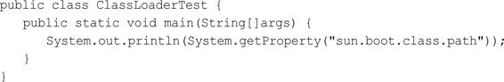
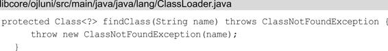
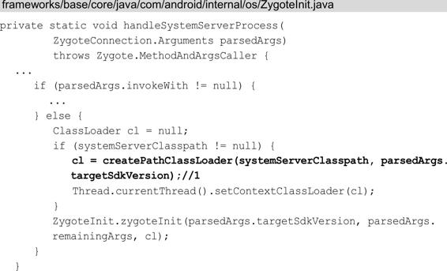

# 关键词

类加载器 ClassLoader、Class文件、dex文件、DVM和ART、JVM、


# 概述

之前学了 Java 字节码文件（.class）的格式。一个完整的 Java 程序是由多个 .class 文件组成的，在程序运行过程中，需要将这些 .class 文件加载到 JVM 中才可以使用。而负责加载这些 .class 文件的就是类加载器（ClassLoader）。

ClassLoader是热修复和插件化的基础。`DVM和ART`加载的是`dex文件`，而`JVM`加载的是`Class文件`，因此Java中的ClassLoader和Android中的ClassLoader是有区别的。

本文会介绍Java中的ClassLoader和Android中的ClassLoader。

# Java 中的类何时被加载器加载

在 Java 程序启动的时候，<u>并不会一次性加载程序中所有的 .class 文件，而是在程序的运行过程中，动态地加载相应的类到内存中</u>。

通常情况下，Java 程序中的 .class 文件会在以下 2 种情况下被 ClassLoader 主动加载到内存中：

1. 调用类构造器

2. 调用类中的静态（static）变量或者静态方法

# Java 中的 ClassLoader

类加载系统，它的主要作用就是通过多种类加载器（ClassLoader）来查找和加载Class文件到Java虚拟机中。

## ClassLoader的类型

Java中的类加载器主要有两种类型，即系统类加载器和自定义类加载器。

JVM 中自带 3 个类加载器（系统类加载器）：

1. 启动类加载器 BootstrapClassLoader

2. 扩展类加载器 ExtClassLoader （JDK 1.9 之后，改名为 PlatformClassLoader）

3. 系统加载器 APPClassLoader

以上 3 者在 JVM 中有各自分工，但是又互相有依赖。

| 类加载器             | 说明                                                         |
| -------------------- | ------------------------------------------------------------ |
| BootstrapClassLoader | Bootstrap类加载器负责加载 rt.jar 中的 JDK 类文件，它是所有类加载器的父加载器。Bootstrap类加载器没有任何父类加载器。它被称为初始类加载器。 |
| ExtClassLoader       | Extension 会将加载类的请求先委托给它的父加载器，即Bootstrap。若没有成功加载，再从 jre/lib/ext 目录下或者 java.ext.dirs 系统属性定义的目录下加载类。Extension加载器由sun.misc.Launcher$ExtClassLoader 实现。 |
| APPClassLoader       | Application 类加载器（又叫 System 类加载器）。它负责从 classpath 环境变量中加载某些应用相关的类，classpath 环境变量通常由 -classpath 或 -cp 命令行选项来定义，或者是 JAR 中的 Manifest 的classpath 属性。APPClassLoader 是 ExtClassLoader 的子类。 |

### APPClassLoader 系统类加载器

AppClassLoader 又可以称作 SystemClassLoader（系统类加载器），这是因为AppClassLoader可以通过ClassLoader的getSystemClassLoader方法获取到。它用来加载以下目录中的类库：

- 当前程序的Classpath目录。
- 系统属性java.class.path指定的目录，也就是环境变量 CLASS_PATH 配置的路径。

因此 AppClassLoader 是面向用户的类加载器，我们自己编写的代码以及使用的第三方 jar 包通常都是由它来加载的。

部分源码如下：


### ExtClassLoader 扩展类加载器

ExtClassLoader 用于加载Java的拓展类，提供除了系统类之外的额外功能。ExtClassLoader用来加载以下目录中的类库：

- 加载$JAVA_HOME/jre/lib/ext目录。
- 系统属性java.ext.dir所指定的目录。

部分源码如下：


可以看出，ExtClassLoader 加载系统属性“java.ext.dirs”配置下类文件，可以打印出这个属性来查看ExtensionsClassLoader的加载目录：


打印结果为：


### BootstrapClassLoader 启动类加载器

BootstrapClassLoader（启动或引导类加载器） 用于加载指定的 JDK 的核心类库，比如java.lang.、java.util 等这些系统类。它用来加载以下目录中的类库：

- $JAVA_HOME/jre/lib目录。
- -Xbootclasspath参数指定的目录。

Java虚拟机的启动就是通过BootstrapClassLoader创建一个初始类来完成的。

同上面的两种 ClassLoader 不太一样，它并不是使用 Java 代码实现的，而是由 C/C++ 语言编写的，它本身属于虚拟机的一部分。因此我们无法在 Java 代码中访问到（不能直接获取到它的引用）。如果尝试在 Java 层获取 BootstrapClassLoader 的引用，系统会返回 null。

**BootstrapClassLoader所加载的目录**

BootstrapClassLoader 加载系统属性“sun.boot.class.path”配置下的类文件，可以打印出这个属性来查看BootstrapClassLoader所加载的目录：



结果如下：


可以看到，这些全是 JRE 目录下的 jar 包或者 .class 文件，包括rt.jar、resources.jar和charsets.jar等。

### CustomClassLoader（自定义类加载器）

除了系统提供的类加载器，还可以自定义类加载器，自定义类加载器通过继承java.lang.ClassLoader类的方式来实现自己的类加载器，ExtClassLoader 和AppClassLoader也继承了java.lang.ClassLoader类。关于自定义类加载器后面会进行介绍。

## ClassLoader的继承关系

运行一个Java程序需要用到几种类型的类加载器呢？如下所示。


我们得到当前类ClassLoaderTest的类加载器，并在注释1处打印出来，紧接着打印出当前类的类加载器的父加载器，直到没有父加载器时就终止循环，打印结果如下所示：


第1行说明加载ClassLoaderTest的类加载器是AppClassLoader，第2行说明AppClassLoader的父加载器为ExtClassLoader。至于为何没有打印出ExtClassLoader的父加载器BootstrapClassLoader，这是因为BootstrapClassLoader是由C/C++编写的，并不是一个Java类，因此我们无法在Java代码中获取它的引用。系统所提供的类加载器有3种类型，但是系统提供的ClassLoader却不只有3个。另外，AppClassLoader的父类加载器为ExtClassLoader，并不代表AppClassLoader继承自ExtClassLoader，ClassLoader的继承关系如图12.1所示。


图12-1ClassLoader的继承关系

可以看到图12-1中共有5个ClassLoader相关类，下面简单对它们进行介绍。·ClassLoader是一个抽象类，其中定义了ClassLoader的主要功能。

- SecureClassLoader继承了抽象类ClassLoader，但SecureClassLoader并不是ClassLoader的实现类，而是拓展了ClassLoader类加入了权限方面的功能，加强了ClassLoader的安全性。
- URLClassLoader继承自SecureClassLoader，可以通过URL路径从jar文件和文件夹中加载类和资源。
- ExtClassLoader和AppClassLoader都继承自URLClassLoader，它们都是Launcher的内部类，Launcher是Java虚拟机的入口应用，ExtClassLoader和AppClassLoader都是在Launcher中进行初始化的。

## 双亲委派模式（Parents Delegation Model）

既然 JVM 中已经有了这 3 种 ClassLoader，那么 JVM 又是如何知道该使用哪一个类加载器去加载相应的类呢？答案就是：双亲委派模式。

### 双亲委派模式

类加载器查找Class默认采用是双亲委托模式，所谓双亲委派模式就是，**当类加载器收到加载类或资源的请求时，通常都是先委托给父类加载器加载，也就是说，只有当父类加载器找不到指定类或资源时，自身才会执行实际的类加载过程**。

其具体实现代码是在 ClassLoader.java 中的 loadClass 方法中，如下所示：


解释说明：

1. 判断该 Class 是否已加载，如果已加载，则直接将该 Class 返回。

2. 如果该 Class 没有被加载过，则判断 parent 是否为空，如果不为空则将加载的任务委托给parent。

3. 如果 parent == null，则直接调用 BootstrapClassLoader 加载该类。

4. 如果 parent 或者 BootstrapClassLoader 都没有加载成功，则调用当前 ClassLoader 的 findClass 方法继续尝试加载。


那这个 parent 是什么呢？ 我们可以看下 ClassLoader 的构造器，如下：


可以看出，在每一个 ClassLoader 中都有一个 CLassLoader 类型的 parent 引用，并且在构造器中传入值。如果我们继续查看源码，可以看到 AppClassLoader 传入的 parent 就是 ExtClassLoader，而 ExtClassLoader 并没有传入任何 parent，也就是 null。

#### 工作原理

|  工作原理  | 说明                                                         |
| :--------: | :----------------------------------------------------------- |
|  委托机制  | 加载任务委托给父类加载器，如果加载失败就向下传递，由其子类加载器加载，保证 Java 核心库的安全性。 |
| 可见性机制 | 子类加载器可以看到父类加载器加载的类，反之则不行。比如APPClassLoader加载器加载的A.class，使用ExtClassLoader会报错ClassNotFoundException（毕竟已经定义好了Ext的加载路径）。 |
| 单一性机制 | 父加载器加载过的类不能被子加载器加载第二次                   |

#### 小结

- 注意：结合前面讲的ClassLoader的继承关系，可以得出**ClassLoader的父子关系并不是使用继承来实现的**，而是使用组合来实现代码复用的。
- 首先判断该Class是否已经加载，如果没有则首先委托给父加载器进行查找，这样依次进行递归，直到委托到最顶层的BootstrapClassLoader，如果BootstrapClassLoader找到了该Class，就会直接返回，如果没找到，则继续依次向下查找，如果还没找到则最后会交由自身去查找。示意图：


### 举例说明

比如执行以下代码：

```
Test test = new Test();
```

默认情况下，JVM 首先使用 AppClassLoader 去加载 Test 类。

1. AppClassLoader 将加载的任务委派给它的父类加载器（parent）—ExtClassLoader。

2. ExtClassLoader 的 parent 为 null，所以直接将加载任务委派给 BootstrapClassLoader。

3. BootstrapClassLoader 在 jdk/lib 目录下无法找到 Test 类，因此返回的 Class 为 null。

4. 因为 parent 和 BootstrapClassLoader 都没有成功加载 Test 类，所以AppClassLoader会调用自身的 findClass 方法来加载 Test。

最终 Test 类就是被 AppClassLoader 加载到内存中，可以通过如下代码印证此结果：


打印结果为：


可以看出，Test 的 ClassLoader 为 AppClassLoader 类型，而 AppClassLoader 的 parent 为 ExtClassLoader 类型。ExtClassLoader 的 parent 为 null。

> 注意：“双亲委派”机制只是 Java 推荐的机制，并不是强制的机制。我们可以继承 java.lang.ClassLoader 类，实现自己的类加载器。如果想保持双亲委派模型，就应该重写 findClass(name) 方法；如果想破坏双亲委派模型，可以重写 loadClass(name) 方法。

### 为什么默认使用双亲委派模式

采取双亲委托模式主要有如下两点好处。

- 避免重复加载，如果已经加载过一次Class，就不需要再次加载，而是直接读取已经加载的Class。
- 更加安全，如果不使用双亲委托模式，就可以自定义一个String类来替代系统的String类，这显然会造成安全隐患，采用双亲委托模式会使得系统的String类在Java虚拟机启动时就被加载，也就无法自定义String类来替代系统的String类，除非我们修改类加载器搜索类的默认算法。还有一点，只有两个类名一致并且被同一个类加载器加载的类，Java虚拟机才会认为它们是同一个类，想要骗过Java虚拟机显然不会那么容易。

## 自定义 ClassLoader

JVM 中预置的 3 种 ClassLoader 只能加载特定目录下的jar包或者 .class 文件，如果我们想加载其他特殊位置下的 jar 包或类时（比如，我要加载网络或者磁盘上的一个 .class 文件），默认的 ClassLoader 就不能满足我们的需求了，所以需要定义自己的 Classloader 来加载特定目录下的 .class 文件。

### 自定义 ClassLoader 步骤

1. 自定义一个类继承抽象类 ClassLoader。

2. 重写 findClass 方法。

3. 可选：重写 loadClass 可自定义加载默认，默认是双亲委派模式。

4. 在 findClass 中，调用 defineClass 方法将字节码转换成 Class 对象，并返回。

用一段伪代码来描述这段过程如下：


### 自定义 ClassLoader 实践1

首先在本地电脑上创建一个测试类 Secret.java，代码如下：


然后将其放到如下磁盘路径：


并且把.java文件编译为.class文件。

接下来，创建 DiskClassLoader 继承 ClassLoader，重写 findClass 方法，并在其中调用 defineClass 创建 Class，代码如下：


最后，写一个测试自定义 DiskClassLoader 的测试类，用来验证我们自定义的 DiskClassLoader 是否能正常 work。


解释说明：

① 代表需要动态加载的 class 的路径。

② 代表需要动态加载的类名。

③ 代表需要动态调用的方法名称。

最后执行上述 testClassLoader 方法，并打印如下结果，说明我们自定义的 DiskClassLoader 可以正常工作。


> 注意：上述动态加载 .class 文件的思路，经常被用作热修复和插件化开发的框架中，包括 QQ 空间热修复方案、微信 Tink 等原理都是由此而来。客户端只要从服务端下载一个加密的 .class 文件，然后在本地通过事先定义好的加密方式进行解密，最后再使用自定义 ClassLoader 动态加载解密后的 .class 文件，并动态调用相应的方法。

### 自定义 ClassLoader 实践2

**步骤1：定义测试类**

下面自定义一个ClassLoader用来加载位于D：\lib的Class文件。首先编写测试类并生成Class文件，如下所示：


将这个Jobs.java放入到D：\lib中，使用cmd命令进入D：\lib目录中，执行`Javac Jobs.java`对该java文件进行编译，这时会在D：\lib中生成Jobs.class。

**步骤2：创建自定义ClassLoader**

在AS中创建一个JavaLibrary，编写自定义ClassLoader，如下所示：


1. 注释1处的loadClassData方法会获得class文件的字节码数组
2. 注释2处调用defineClass方法将class文件的字节码数组转为Class类的实例。
3. 在loadClassData方法中需要对流进行操作，关闭流的操作要放在finally语句块中，并且要对in和out分别使用try语句，如果in和out共同在一个try语句中，假设in.close（）发生异常的话，就无法执行out.close（）。

**步骤3：验证DiskClassLoader是否可用**

代码如下所示：


1. 注释1处创建DiskClassLoader并传入要加载类的路径
2. 注释2处加载Class文件
3. 注释3处通过反射来调用Jobs的say方法，打印结果如下：


使用了DiskClassLoader来加载Class文件，say方法也正确执行，我们的目的就达到了。

> 需要注意的是，不要在项目工程中存在名为com.example.Jobs的Java文件，否则就不会使用DiskClassLoader来加载，而是使用AppClassLoader来负责加载，这样我们定义的DiskClassLoader就没用了。
>
> 这是因为默认的双亲委派机制会去自己去加载，然后在其负责的目录下找到了项目中的 com.example.Jobs 文件，我们自定义的 DiskClassLoader 也就不生效了。

# Android 中的 ClassLoader

> Android中的ClassLoader和Java中的ClassLoader有何不同？
>
> Java中的ClassLoader可以加载jar文件和Class文件（本质是加载Class文件），Android中加载的不再是Class文件，而是dex文件。

本质上，Android 和传统的 JVM 是一样的，也需要通过 ClassLoader 将目标类加载到内存，类加载器之间也符合双亲委派模型。

但是在 Android 中， ClassLoader 的加载细节有略微的差别。在 Android 虚拟机（无论是DVM还是ART）里是无法直接运行 .class 文件的，Android 会将所有的 .class 文件转换成一个 .dex 文件，加载 .dex 文件的实现封装在 BaseDexClassLoader 中。

## ClassLoader的类型

Android中的ClassLoader类型和Java中的ClassLoader类型类似，也分为两种类型，分别是系统类加载器和自定义加载器。其中系统类加载器主要包括3种，分别是BootClassLoader、PathClassLoader和DexClassLoader。我们一般只使用BaseDexClassLoader的两个子类：PathClassLoader 和 DexClassLoader。

### BootClassLoader

Android系统启动时会使用BootClassLoader来预加载常用类，与SDK中的BootstrapClassLoader不同，它并不是由C/C++代码实现的，而是由Java实现的，BootClassLoader的代码如下所示：


BootClassLoader是ClassLoader的内部类，并继承自ClassLoader。BootClassLoader是一个单例类，需要注意的是BootClassLoader的访问修饰符是默认的，只有在同一个包中才可以访问，因此我们在应用程序中是无法直接调用的。

### PathClassLoader

Android系统使用 PathClassLoader 来加载系统类和应用程序的类。包括系统 apk 和被安装到手机中的 apk 内的 dex 文件。它的 2 个构造函数如下：


参数说明：

- dexPath：dex 文件路径，或者包含 dex 文件的 jar 包路径；

- librarySearchPath：C/C++ native 库的路径。

PathClassLoader 里面除了这 2 个构造方法以外就没有其他的代码了，具体的实现都是在 BaseDexClassLoader 里面。

在PathClassLoader的构造方法中没有参数optimizedDirectory，这是因为PathClassLoader已经默认了参数optimizedDirectory的值为/data/dalvik-cache。所以PathClassLoader无法定义解压的dex文件存储路径，因此 **PathClassLoader通常用来加载已经安装的apk的dex文件**（安装的apk的dex文件会存储在/data/dalvik-cache中）。

当一个 App 被安装到手机后，apk 里面的 class.dex 中的 class 均是通过 PathClassLoader 来加载的，可以通过如下代码验证：


印结果如下：


### DexClassLoader

对比 PathClassLoader 只能加载已经安装应用的 dex 或 apk 文件，DexClassLoader 则没有此限制，可以从 SD 卡上加载包含 class.dex 的 .jar 和 .apk 文件，这也是插件化和热修复的基础，在不需要安装应用的情况下，完成需要使用的 dex 的加载。

DexClassLoader可以加载dex文件以及包含dex的压缩文件（apk和jar文件，不管加载哪种文件，最终都要加载dex文件）。

DexClassLoader 的源码里面只有一个构造方法，代码如下：


DexClassLoader的构造方法有如下4个参数：

- dexPath：dex相关文件路径，即包含 class.dex 的 apk、jar 文件路径 ，多个路径用文件分隔符（默认是“:”）分隔。

- optimizedDirectory：解压后的dex文件存储路径，即用保存从 apk 或 jar 文件中提取出来的 dex 文件的路径。这个路径不可以为空&有读写权限，必须是一个内部存储路径，在一般情况下，使用当前应用程序的私有路径：/data/data/＜PackageName＞/...。

- libraryPath：包含C/C++库的路径集合，多个路径用文件分隔符分隔，可以为null。
- parent：父加载器。

DexClassLoader继承自BaseDexClassLoader，方法都在BaseDexClassLoader中实现。

## ClassLoader的继承关系

运行一个应用程序需要用到几种类型的类加载器呢？如下所示：


首先我们得到MainActivity的类加载器，并在注释1处通过Log打印出来，接着通过循环打印出当前类的类加载器的父加载器，直到没有父加载器终止循环，打印结果如下所示：


可以看到有两种类加载器，一种是PathClassLoader，另一种则是BootClassLoader。DexPathList中包含了很多apk的路径，其中/data/app/com.example.liuwangshu.moonclassloader-2/base.apk就是示例应用安装在手机上的位置。DexPathList是在BaseDexClassLoader的构造方法中创建的，里面存储了dex相关文件的路径，在ClassLoader执行双亲委托模式的查找流程时会从DexPathList中进行查找。

除了上面所讲的3种主要的类加载器外，Android还提供了其他的类加载器和ClassLoader相关类，ClassLoader的继承关系如图12-3所示。


图12-3Android8.0中ClassLoader的继承关系

可以看到图12-3中一共有8个ClassLoader相关类，其中有一些和Java中的ClassLoader相关类十分类似，下面简单对它们进行介绍：

- ClassLoader是一个抽象类，其中定义了ClassLoader的主要功能。BootClassLoader是它的内部类。
- SecureClassLoader类和JDK8中的SecureClassLoader类的代码是一样的，它继承了抽象类ClassLoader。SecureClassLoader并不是ClassLoader的实现类，而是拓展了ClassLoader类加入了权限方面的功能，加强了ClassLoader的安全性。
- URLClassLoader类和JDK8中的URLClassLoader类的代码是一样的，它继承自SecureClassLoader，用来通过URL路径从jar文件和文件夹中加载类和资源。
- InMemoryDexClassLoader是Android8.0新增的类加载器，继承自BaseDexClassLoader，用于加载内存中的dex文件。
- BaseDexClassLoader继承自ClassLoader，是抽象类ClassLoader的具体实现类，PathClassLoader、DexClassLoader和InMemoryDexClassLoader都继承自它。

## ClassLoader的加载过程

Android的ClassLoader同样遵循了双亲委托模式，ClassLoader的加载方法为loadClass方法，这个方法被定义在抽象类ClassLoader中，如下所示：


ClassLoader的loadClass方法和JDK中ClassLoader的loadClass方法类似。

在注释1处用来检查传入的类是否已经加载，如果已经加载就返回该类，如果没有加载就在注释2处判断父加载器是否存在，存在就调用父加载器的loadClass方法，如果不存在就调用注释3处的findBootstrapClassOrNull方法，这个方法会直接返回null。如果注释4处的代码成立，说明向上委托流程没有检查出类已经被加载，就会执行注释5处的findClass方法来进行查找流程，findClass方法如下所示：



在findClass方法中直接抛出了异常，这说明findClass方法需要子类来实现，BaseDexClassLoader的代码如下所示：


在BaseDexClassLoader的构造方法中创建了DexPathList，在注释1处调用了DexPathList的findClass方法：


在注释1处遍历Element数组dexElements，在注释2处调用Element的findClass方法，Element是DexPathList的静态内部类：


从Element的构造方法可以看出，其内部封装了DexFile，它用于加载dex。在注释1处如果DexFile不为null就调用DexFile的loadClassBinaryName方法：


在loadClassBinaryName方法中调用了defineClass方法：


在注释1处调用了defineClassNative方法来加载dex相关文件，这个方法是Native方法，这里就不再进行分析。ClassLoader的加载过程就是遵循着双亲委托模式，如果委托流程没有检查到此前加载过传入的类，就调用ClassLoader的findClass方法，Java层最终会调用DexFile的defineClassNative方法来执行查找流程，如图12-4所示。


图12-4ClassLoader查找流程

## BootClassLoader的创建

BootClassLoader是在何时被创建的呢？这得先从Zygote进程开始说起，ZygoteInit的main方法如下所示：


main方法是ZygoteInit的入口方法，其中调用了ZygoteInit的preload方法，在preload方法中又调用了ZygoteInit的preloadClasses方法，如下所示：


preloadClasses方法用于Zygote进程初始化时预加载常用类。

在注释1处PRELOADED_CLASSES的值为将/system/etc/preloadedclasses文件封装成FileInputStream，preloaded-classes文件中存有预加载类的目录，这个文件在系统源码中的路径为frameworks/base/preloaded-classes，这里列举一些preloadedclasses文件中的预加载类名称，如下所示：


可以看到preloaded-classes文件中的预加载类的名称有很多都是我们非常熟知的。预加载属于拿空间换时间的策略，Zygote环境配置得越健全越通用，应用程序进程需要单独做的事情也就越少，预加载除了预加载类，还有预加载资源和预加载共享库，因为不是本节的重点，这里就不再延伸讲下去了。回到preloadClasses方法的注释2处，将FileInputStream封装为BufferedReader，并在注释3处遍历BufferedReader，读出所有预加载类的名称，每读出一个预加载类的名称就调用注释4处的代码加载该类，Class的forName方法如下所示：


在注释1处创建了BootClassLoader，并将BootClassLoader实例传入到了注释2处的classForName方法中，classForName方法是Native方法，它的实现由C/C++代码来完成，如下所示：


Native方法这里就不再分析了，我们知道了BootClassLoader是在Zygote进程的Zygote入口方法中被创建的，用于加载preloadedclasses文件中存有的预加载类。

## PathClassLoader的创建

PathClassLoader的创建也得从Zygote进程开始说起，Zygote进程启动SystemServer进程时会调用ZygoteInit的startSystemServer方法，如下所示：


在注释1处，Zygote进程通过forkSystemServer方法fork自身创建子进程（SystemServer进程）。在注释2处如果forkSystemServer方法返回的pid等于0，说明当前代码是在新创建的SystemServer进程中执行的，接着就会执行注释3处的handleSystemServerProcess方法：



在注释1处调用了createPathClassLoader方法，如下所示：


在createPathClassLoader方法中又调用了PathClassLoaderFactory的createClassLoader方法，看来

PathClassLoader是用工厂来进行创建的：


在PathClassLoaderFactory的createClassLoader方法中会创建PathClassLoader。讲到这里可以得出结论，PathClassLoader是在SystemServer进程中采用工厂模式创建的。

## 示例：使用 DexClassLoader 实现热修复

理论知识都是为实践作基础，接下来使用 DexClassLoader 来模拟热修复功能的实现。

### 创建 Android 项目 DexClassLoaderHotFix

在这个项目中，模拟实际场景出现问题。后续通过热修复来解决。

1. 项目结构如下：

   

2. 定义 ISay.java 接口

   ```kotlin
   interface ISay {
       fun saySomething(): String
   }
   ```

3. 定义 SayException.java 类，实现 ISay 接口。在 saySomething 方法中，返回 “something wrong” 来模拟一个线上的 bug。

   ```kotlin
   class SayException : ISay {
       override fun saySomething(): String {
           return "something wrong"
       }
   }
   ```

4. 在 Activity 中使用。当点击 Button 的时候，将 saySomething 返回的内容通过 Toast 显示在屏幕上。

   ```kotlin
   class DexClassLoaderHotfixActivity : AppCompatActivity() {
       companion object {
           private const val TAG = "DexClassLoaderHotfixAct"
       }
   
       override fun onCreate(savedInstanceState: Bundle?) {
           super.onCreate(savedInstanceState)
           val binding = ActivityDexClassLoaderHotfixBinding.inflate(layoutInflater)
           setContentView(binding.root)
           
           val sayException: ISay = SayException()
           binding.btnSay.setOnClickListener {
               Log.i(TAG, sayException.saySomething())
               Toast.makeText(this, sayException.saySomething(), Toast.LENGTH_LONG).show()
           }
       }
   }
   ```

最后运行效果如下：


### 创建 HotFix patch 包

> dx 相关笔记在【dx工具使用.md】中。
>
> 注：在Kotlin项目中，遇到了一些问题，还没有成功过；在一个纯Java项目中成功过。

新建 Java 项目（创建一个Java Library Module也可以），项目结构如下：


然后创建两个文件 ISay.java 和 SayHotFix.java，可以在之前的项目写好后，再复制过来。

```kotlin
interface ISay {
    fun saySomething(): String
}
```


```kotlin
package com.lizw.core_apis.android.hotfix
class SayHotFix : ISay {
    override fun saySomething(): String {
        return "everything is right"
    }
}
```


ISay 接口的包名和类名必须和 Android 项目中保持一致。SayHotFix 实现 ISay 接口，并在 saySomething 中返回了新的结果，用来模拟 bug 修复后的结果。

build打包成jar


将 ISay.java 和 SayHotFix.java 打包成 say_something.jar，然后通过 dx 工具将生成的 say_something.jar 包中的 class 文件优化为 dex 文件。

```kotlin
dx --dex --output=say_something_hotfix.jar say_something.jar
```

上述 say_something_hotfix.jar 就是我们最终需要用作 hotfix 的 jar 包。

**将 HotFix patch 包拷贝到 SD 卡主目录，并使用 DexClassLoader 加载 SD 卡中的 ISay 接口**

首先将 HotFix patch 保存到本地目录下。一般在真实项目中，我们可以通过向后端发送请求的方式，将最新的 HotFix patch 下载到本地中。这里为了演示，我直接使用 adb 命令将 say_somethig_hotfix.jar 包 push 到 SD 卡的主目录下：

```kotlin
adb push say_something_hotfix.jar /storage/self/primary/ 
```

接下来，修改 MainActivity 中的逻辑，使用 DexClassLoader 加载 HotFix patch 中的 SayHotFix 类，如下：


注意：因为需要访问 SD 卡中的文件，所以需要在 AndroidManifest.xml 中申请权限。

最后运行效果如下：


### 问题记录

问题1

```kotlin
'compileJava' task (current target is 1.7) and 'compileKotlin' task (current target is 17) jvm target compatibility should be set to the same Java version.
```

解决：

在mudule的build.gradle中：

```kotlin
plugins {
    id 'java-library'
    alias(libs.plugins.org.jetbrains.kotlin.jvm)
}

java {
    // build 报错时的配置
    // targetCompatibility = JavaVersion.VERSION_1_7
    // targetCompatibility = JavaVersion.VERSION_1_7
    
    // 修改为如下，应该是compileJava 和 compileKotlin 要保持一致
    sourceCompatibility = JavaVersion.VERSION_17
    targetCompatibility = JavaVersion.VERSION_17
}
```

问题2

```kotlin
执行命令报错：
dx --dex --output=SayHotFix.jar say_something.jar
dx : 无法将“dx”项识别为 cmdlet、函数、脚本文件或可运行程序的名称。请检查名称的拼写，如果包括路径，请确保路径正确，然后再试一次。
所在位置 行:1 字符: 1

+ dx --dex --output=SayHotFix.jar say_something.jar
```


# 总结

ClassLoader 就是用来加载 class 文件的，不管是 jar 中还是 dex 中的 class。

Java 中的 ClassLoader 通过双亲委托来加载各自指定路径下的 class 文件。

可以自定义 ClassLoader，一般覆盖 findClass() 方法，不建议重写 loadClass 方法。

Android 中常用的两种 ClassLoader 分别为：PathClassLoader 和 DexClassLoader。

分别对Java和Android的ClassLoader进行解析，通过Java和Android的ClassLoader的类型和ClassLoader的继承关系，就可以很清楚地看出它们的差异，主要有以下几点：

- Java的引导类加载器是由C++编写的，Android中的引导类加载器则是用Java编写的。
- Android的继承关系要比Java继承关系复杂一些，提供的功能也多。
- 由于Android中加载的不再是Class文件，因此Android中没有ExtClassLoader和AppClassLoader，替代它们的是PathClassLoader和DexClassLoader。


# 问题

<font color='orange'>Q：ClassLoader（类加载）机制（过程）</font>

类加载机制是用来把 class 文件，在 Android 中是 dex 文件，加载到虚拟机中。

核心的类是 ClassLoader，其中实现了类加载的基本方式，即双亲委派机制。双亲委派是指在 ClassLoader 加载类时，首先把加载任务从下往上依次传给父 ClassLoader 去执行，如果父ClassLoader没有加载成功，孩子 ClassLoader 自己才会去加载。

父子关系是在创建 ClassLoader 的时候通过构造方法参数传入 父ClassLoader 而建立的。

<font color='orange'>Q：PathClassLoader与DexClassLoader的区别是什么？</font>

PathClassLoader 只能加载已经安装好的 apk 中的 dex文件。

DexClassLoader 则能加载任意可访问目录下的 dex文件（在jar或apk中）。

<font color='orange'>Q：ClassLoader双亲委派实现原理</font>

双亲委派是指在 ClassLoader 加载类时，首先把加载任务从下往上依次传给父 ClassLoader 去执行，如果父ClassLoader没有加载成功，孩子 ClassLoader 自己才会去加载。

<font color='orange'>Q：为什么要用双亲委派机制</font>

1. 可以**避免类的重复加载**。
2. **保护核心类库**：通过双亲委派机制，Java核心类库（如`java.lang.Object`等）只能由启动类加载器（BootStrap ClassLoader）加载，其他类加载器无法加载这些核心类库中的类。这保证了Java核心类库的安全性和一致性，防止了用户自定义的类替换核心类库中的类。

<font color='orange'>Q：如何打破双亲委派机制</font>

双亲委派的实现代码在 ClassLoader#loadClass 方法中，可以实现一个 ClassLoader 的子类，并重写 loadClass() 改变双亲委派机制。

> 如果用同一个类加载器加载一个已经存在于JVM中的类，那么JVM会忽略这个加载请求，并返回已经加载的类的`Class`对象。
>
> 如果用不同的类加载器加载一个已经存在于JVM中的类，由于每个类加载器都有自己的命名空间，所以不同的类加载器可以加载同一个全限定名的类，但是这些类在JVM中会被视为不同的类型。


# 参考

《Android进阶解密》