# Dalvik和ART

关联章节： 第10章 Java虚拟机

第10章我们学习了Java虚拟机，这一章我们顺势来学习Dalvik和ART，关于这两个虚拟机的知识体系也是十分庞大的，对于 Android应用开发来说，掌握它们的基本原理并且会看它们的Log就可以了，因此本章只介绍Dalvik和ART的基础。

# 11.1 Dalvik虚拟机

Dalvik虚拟机（Dalvik Virtual Machine），简称Dalvik VM或者DVM。它是由Dan Bornstein编写的，名字源于他的祖先居住过的名为Dalvik的小渔村。DVM是Google专门为Android平台开发的虚拟机，它运行在Android运行时库中。需要注意的是DVM并不是一个Java虚拟机（以下简称JVM），至于为什么，下文会给你答案。

## 11.1.1 DVM与JVM的区别

DVM 之所以不是一个 JVM，主要原因是 DVM 并没有遵循 JVM 规范来实现，DVM与JVM主要有以下区别。

1.基于的架构不同

JVM基于栈则意味着需要去栈中读写数据，所需的指令会更多，这样会导致速度变慢，对于性能有限的移动设备，显然不是很适合的。DVM是基于寄存器的，它没有基于栈的虚拟机在复制数据时而使用的大量的出入栈指令，同时指令更紧凑、更简洁。但是由于显式指定了操作数，所以基于寄存器的指令会比基于栈的指令要大，但是由于指令数量的减少，总的代码数不会增加多少。

2.执行的字节码不同

在Java SE程序中，Java类被编译成一个或多个.class文件，并打包成jar文件，而后JVM 会通过相应的.class 文件和 jar 文件获取相应的字节码。执行顺序为.java 文件→.class文件→.jar文件，而DVM会用dx工具将所有的.class文件转换为一个.dex文件，然后DVM会从该.dex文件读取指令和数据。执行顺序为.java文件→.class文件→.dex文件。

如图11-1所示，.jar文件里面包含多个.class文件，每个.class文件里面包含了该类的常量池、类信息、属性等。当JVM加载该.jar文件的时候，会加载里面的所有的.class文件，JVM的这种加载方式很慢，对于内存有限的移动设备并不合适。而在.apk文件中只包含了一个.dex文件，这个.dex文件将所有的.class里面所包含的信息全部整合在一起了，这样再加载就加快了速度。.class文件存在很多的冗余信息，dex工具会去除冗余信息，并把所有的.class文件整合到.dex文件中，减少了I/O操作，加快了类的查找速度。

图11-1 执行的字节码不同

3.DVM允许在有限的内存中同时运行多个进程

DVM经过优化，允许在有限的内存中同时运行多个进程。在Android中的每一个应用都运行在一个 DVM 实例中，每一个 DVM 实例都运行在一个独立的进程空间中，独立的进程可以防止在虚拟机崩溃的时候所有程序都被关闭。

4.DVM由Zygote创建和初始化

我们在第 2 章学习过 Zygote，它是一个 DVM 进程，同时也用来创建和初始化 DVM实例。每当系统需要创建一个应用程序时，Zygote就会fock自身，快速地创建和初始化一个 DVM 实例，用于应用程序的运行。对于一些只读的系统库，所有的 DVM 实例都会和Zygote共享一块内存区域，节省了内存开销。

5.DVM有共享机制

DVM拥有预加载—共享的机制，不同应用之间在运行时可以共享相同的类，拥有更高的效率。而JVM机制不存在这种共享机制，不同的程序，打包以后的程序都是彼此独立的，即便它们在包里使用了同样的类，运行时也都是单独加载和运行的，无法进行共享。

6.DVM早期没有使用JIT编译器

JVM使用了JIT编译器（Just In Time Compiler，即时编译器），而DVM早期没有使用JIT编译器。早期的DVM每次执行代码，都需要通过解释器将dex代码编译成机器码，然后交给系统处理，效率不是很高。为了解决这一问题，从Android 2.2版本开始DVM使用了 JIT 编译器，它会对多次运行的代码（热点代码）进行编译，生成相当精简的本地机器码（Native Code），这样在下次执行到相同逻辑的时候，直接使用编译之后的本地机器码，而不是每次都需要编译。需要注意的是，应用程序每一次重新运行的时候，都要重做这个编译工作，因此每次重新打开应用程序，都需要JIT编译。

## 11.1.2 DVM架构

DVM的源码位于dalvik/目录下，Android 8.0中的DVM源码的部分目录说明如表11-1所示。

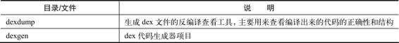

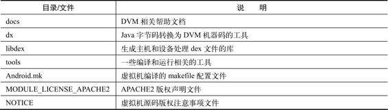

表11-1 D VM的源码目录续表其中，dalvik/libdex 会被编译成libdex.a 静态库，作为dex 工具使用；dalvik/dexdump是.dex文件的反编译工具，DVM架构如图11-2所示。

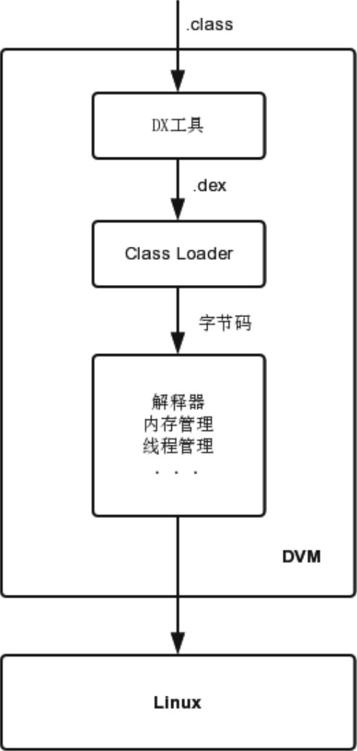

图11-2 DVM架构

从图 11-2 可以看出，首先 Java 编译器编译的.class 文件经过DX 工具转换为.dex 文件，.dex文件由类加载器处理，接着解释器根据指令集对Dalvik字节码进行解释、执行，最后交于Linux处理。

## 11.1.3 DVM的运行时堆

DVM的运行时堆使用标记—清除（Mark-Sweep）算法进行GC，它由两个Space以及多个辅助数据结构组成，两个Space分别是ZygoteSpace （ Zygote Heap ） 和 Allocation Space （ Active Heap ） 。Zygote Space用来管理Zygote进程在启动过程中预加载和创建的各种对象，Zygote Space中不会触发GC，在Zygote进程和应用程序进程之间会共享Zygote Space。在Zygote进程fork第一个子进程之前，会把Zygote Space分为两个部分，原来的已经被使用的那部分堆仍旧叫Zygote Space，而未使用的那部分堆就叫Allocation Space，以后的对象都会在Allocation Space上进行分配和释放。Allocation Space不是进程间共享的，在每个进程中都独立拥有一份。除了这两个Space，还包含以下数据结构。

· Card Table：用于DVM Concurrent GC，当第一次进行垃圾标记后，记录垃圾信息。

· Heap Bitmap：有两个Heap Bitmap，一个用来记录上次GC存活的对象，另一个用来记录这次GC存活的对象。

· Mark Stack：DVM的运行时堆使用标记—清除（Mark-Sweep）算法进行GC，Mark Stack就是在GC的标记阶段使用的，它用来遍历存活的对象。

## 11.1.4 DVM的GC日志

在10.6.2节中提到了Java虚拟机的GC日志。DVM和ART的GC日志与Java虚拟机的日志有较大的区别。在DVM中每次垃圾收集都会将GC 日志打印到logcat中，具体的格式为：

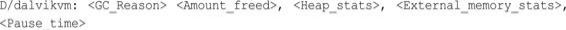

可以看到DVM的日志共有5个信息，其中GC Reason有很多种，这里将它单独拿出来进行介绍。

### 1.引起GC的原因

GC Reason就是引起GC的原因，有以下几种。

· GC_CONCURRENT：当堆开始填充时，并发GC可以释放内存。

· GC_FOR_MALLOC：当堆内存已满时，App尝试分配内存而引起的GC，系统必须停止App并回收内存。· GC_HPROF_DUMP_HEAP：当你请求创建HPROF文件来分析堆内存时出现的GC。

· GC_EXPLICIT：显式的 GC，例如调用 System.gc（）（应该避免调用显式的 GC，信任GC会在需要时运行）。

· GC_EXTERNAL_ALLOC：仅适用于API级别小于等于10，且用于外部分配内存的GC。

### 2.其他的信息

除了引起GC的原因，其他的信息如下。

· Amount_freed：本次GC释放内存的大小。

· Heap_stats：堆的空闲内存百分比（已用内存）/（堆的总内存）。

· External_memory_stats：API小于等于级别10的内存分配（已分配的内存）/（引起GC的阈值）。

· Pause time：暂停时间，更大的堆会有更长的暂停时间。并发暂停时间会显示两个暂停时间，即一个出现在垃圾收集开始时，另一个出现在垃圾收集快要完成时。

### 3.实例分析

为了让大家更好地理解DVM的GC日志，举一个具体的GC日志实例，如下所示：

这个GC日志的含义为：引起GC的原因是GC_CONCURRENT；本次GC释放的内存为2012KB；堆的空闲内存百分比为63%，已用内存为3213KB，堆的总内存为9291KB；暂停的总时长为4ms。

# 11.2 ART虚拟机

ART（Android Runtime）虚拟机是Android 4.4发布的，用来替换Dalvik虚拟机，Android 4.4默认采用的还是DVM，系统会提供一个选项来开启ART。在Android 5.0版本中默认采用了ART，DVM从此退出历史舞台。

## 11.2.1 ART与DVM的区别

ART和DVM的区别主要有如下4点。

（1）从11.1节我们知道，DVM中的应用每次运行时，字节码都需要通过JIT编译器编译为机器码，这会使得应用程序的运行效率降低。而在ART中，系统在安装应用程序时会进行一次AOT（ahead of timecompilation，预编译），将字节码预先编译成机器码并存储在本地，这样应用程序每次运行时就不需要执行编译了，运行效率会大大提升，设备的耗电量也会降低。这就好比我们在线阅读漫画，DVM 是我们阅读到哪就加载哪，ART 则是直接加载一章的漫画，虽然一开始加载速度有些慢，但是后续的阅读体验会很流畅。采用AOT也会有缺点，主要有两个：第一个是AOT会使得应用程序的安装时间变长，尤其是一些复杂的应用；第二个是字节码预先编译成机器码，机器码需要的存储空间会多一些。为了解决上面的缺点，Android 7.0版本中的ART加入了即时编译器JIT，作为AOT的一个补充，在应用程序安装时并不会将字节码全部编译成机器码，而是在运行中将热点代码编译成机器码，从而缩短应用程序的安装时间并节省了存储空间。

（2）DVM是为32位CPU设计的，而ART支持64位并兼容32位CPU，这也是DVM被淘汰的主要原因之一。

（3）ART对垃圾回收机制进行了改进，比如更频繁地执行并行垃圾收集，将GC暂停由2次减少为1次等。

（4）ART的运行时堆空间划分和DVM不同。

## 11.2.2 ART的运行时堆

与DVM的GC不同的是，ART采用了多种垃圾收集方案，每个方案会运行不同的垃圾收集器，默认是采用了CMS（Concurrent MarkSweep）方案，该方案主要使用了sticky-CMS和partial-CMS。根据不同的CMS方案，ART的运行时堆的空间也会有不同的划分，默认是由4个Space和多个辅助数据结构组成的，4个Space分别是Zygote Space、Allocation Space 、 Image Space 和 Large Object Space 。 ZygoteSpace、Allocation Space和DVM中的作用是一样的，Image Space用来存放一些预加载类，Large Object Space用来分配一些大对象（默认大小为12KB），其中Zygote Space和Image Space是进程间共享的。采用标记—清除算法的运行时堆空间划分如图11-3所示。

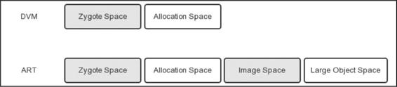

图11-3 采用标记—清除算法的运行时堆空间划分

除了这四个Space，ART的Java堆中还包括两个Mod Union Table，一个Card Table，两个Heap Bitmap，两个Object Map，以及三个Object Stack。

## 11.2.3 ART的GC日志A

RT的GC日志与DVM不同，ART会为那些主动请求的垃圾收集事件或者认为GC速度慢时才会打印GC日志。GC速度慢指的是GC暂停超过5ms或者GC持续时间超过100ms。如果App未处于可察觉的暂停进程状态，那么它的GC不会被认为是慢速的。ART的GC日志具体的格式为：

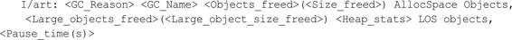

下面对GC日志的组成部分进行介绍。

### 1.引起GC原因

ART的引起GC原因（GC_Reason）要比DVM多一些，有以下几种。

· Concurrent：并发GC，不会使App的线程暂停，该GC是在后台线程运行的，并不会阻止内存分配。

· Alloc：当堆内存已满时，App尝试分配内存而引起的GC，这个GC会发生在正在分配内存的线程中。

· Explicit：App显示的请求垃圾收集，例如调用System.gc（）。与DVM一样，最佳做法是应该信任GC并避免显式地请求GC，显式地请求GC会阻止分配线程并不必要地浪费CPU周期。如果显式地请求GC导致其他线程被抢占，那么有可能会导致jank （App同一帧画了多次）。

· NativeAlloc ： Native 内 存 分 配 时 ， 比 如 为 Bitmaps 或 者RenderScript分配对象，这会导致Native内存压力，从而触发GC。

· CollectorTransition：由堆转换引起的回收，这是运行时切换 GC 而引起的。收集器转换包括将所有对象从空闲列表空间复制到碰撞指针空间（反之亦然）。当前，收集器转换仅在以下情况下出现：在内存较小的设备上，App将进程状态从可察觉的暂停状态变更为可察觉的非暂停状态（反之亦然）。

· HomogeneousSpaceCompact：齐性空间压缩是指空闲列表到压缩的空闲列表空间，通常发生在当App已经移动到可察觉的暂停进程状态时。这样做的主要原因是减少了内存使用并对堆内存进行碎片整理。

· DisableMovingGc：不是真正触发 GC 的原因，发生并发堆压缩时，由于使用了GetPrimitiveArrayCritical，收集会被阻塞。在一般情况下，强烈建议不要使用GetPrimitiveArrayCritical，因为它在移动收集器方面具有限制。

· HeapTrim：不是触发GC的原因，但是请注意，收集会一直被阻塞，直到堆内存整理完毕。

### 2.垃圾收集器名称

GC_Name指的是垃圾收集器名称，有以下几种。

· Concurrent Mark Sweep（CMS）：CMS收集器是一种以获取最短收集暂停时间为目标的收集器，采用了标记—清除算法实现。它是完整的堆垃圾收集器，能释放除了Image Space外的所有的空间。

· Concurrent Partial Mark Sweep：部分完整的堆垃圾收集器，能释放除了Image Space和Zygote Space外的所有空间。

· Concurrent Sticky Mark Sweep：粘性收集器，基于分代的垃圾收集思想，它只能释放自上次GC 以来分配的对象。这个垃圾收集器比一个完整的或部分完整的垃圾收集器扫描得更频繁，因为它更快并且有更短的暂停时间。

· Marksweep+Semispace：非并发的GC，复制GC用于堆转换以及齐性空间压缩（堆碎片整理）。

### 3.其他信息

· Objects freed：本次GC从非Large Object Space中回收的对象的数量。

· Size_freed：本次GC从非Large Object Space中回收的字节数。· Large objects freed：本次GC从Large Object Space中回收的对象的数量。

· Large object size freed：本次GC从Large Object Space中回收的字节数。

· Heap stats：堆的空闲内存百分比，即（已用内存）/（堆的总内存）。

· Pause times：暂停时间，暂停时间与在GC运行时修改的对象引用的数量成比例。目前，ART的CMS收集器仅有一次暂停，它出现在GC的结尾附近。移动的垃圾收集器暂停时间会很长，会在大部分垃圾回收期间持续出现。

### 4.实例分析

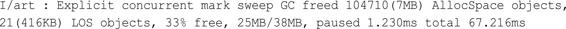

这个GC日志的含义为引起GC原因是Explicit；垃圾收集器为CMS收集器；释放对象的数量为104710个，释放字节数为7MB；释放大对象的数量为21个，释放大对象字节数为416KB；堆的空闲内存百分比为33%，已用内存为25MB，堆的总内存为38MB；GC暂停时长为1.230ms，GC总时长为67.216ms。

# 11.3 DVM和ART的诞生

虽然DVM和ART的知识体系非常庞大，但是我们仍旧有必要了解DVM是怎么来的。在2.1.5节中讲过init启动Zygote时会调用app_main.cpp的main函数，如下所示：

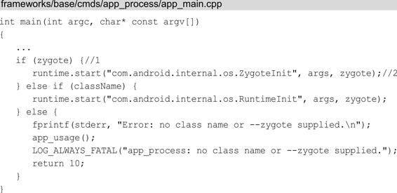

在注释 1 处如果为 ture，就说明当前程序运行在 Zygote 进程中，在注释 2 处调用AppRuntime的start函数，start函数具体在AppRuntime的父类AndroidRuntime中实现，如下所示：

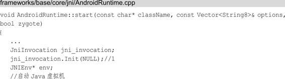

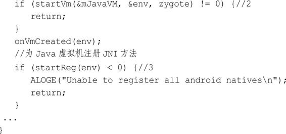

在注释2处调用startVm函数来创建Java虚拟机，在注释3处调用startReg函数来为Java虚拟机注册JNI方法。在注释1处调用了jni_invocation的Init函数：

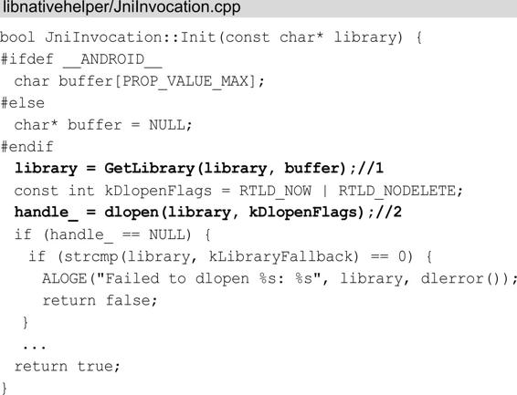

在注释1处调用了GetLibrary函数：

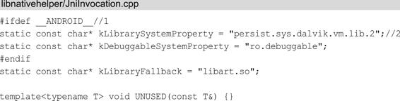

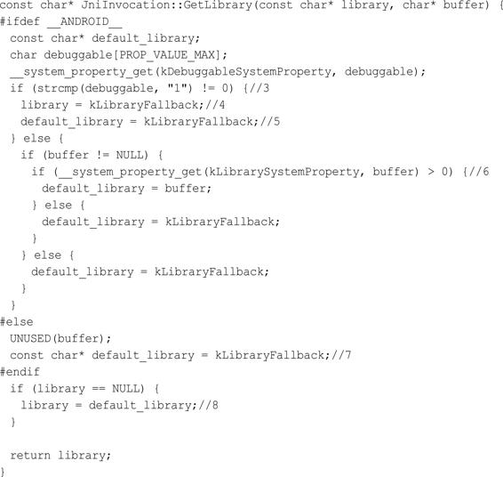

注 释 1 处 代 表 在 Android 平 台 ， 注 释 2 处 的persist.sys.dalvik.vm.lib.2是一个系统属性，它的取值可以为libdvm.so或者libart.so，值为libdvm.so说明当前用的是DVM，值为libart.so说明当前用的是ART。在注释3处如果debuggable不等于"1"，说明当前不是Debug模式构建的，是不允许动态更改虚拟机动态 库 的 。 在 注 释 4 和 注 释 5 处 将 libart.so 赋 值 给 library 和default_library 。 如 果 是 Debug 模 式 构 建 会 在 注 释 6 处 读 取persist.sys.dalvik.vm.lib.2配置中是否有传入的参数 buffer，如果 有 就 将 default_library 赋 值 为 buffer ， 如 果 没 有 将default_library 赋值为libart.so。在注释7处如果不是在Android平台，default_library的值为libart.so。在注释8处如果library为NULL就将default_library赋值给library并返回该library。这里我们知 道 Android 8.0 如 果 不 是 Debug 模 式 构 建 ， 只 能 返 回libart.so。回到JniInvocation的Init函数，注释1处的GetLibrary函数会返回libart.so或者libdvm.so，接着在注释2处调用dlopen函数来加载libart.so或者libdvm.so。因此我们知道JniInvocation的Init函数的主要作用是初始化ART或者DVM的环境，初始化完毕后会调用startVm函数来启动相应的虚拟机。讲到这里我们应该知道 DVM 和ART 是如何诞生的了，没错，是在Zygote进程中诞生的，这样Zygote进程就持有了DVM或者ART的实例，此后Zygote进程fork自身创建应用程序进程时，应用程序进程也得到了DVM或者ART的实例，这样就不需要每次启动应用程序进程都要创建DVM或者ART，从而加快了应用程序进程的启动速度。

# 11.4 本章小结

本章介绍了DVM和ART的基本原理、如何阅读它们的log和DVM，以及ART的诞生。阅读本章前请阅读第2章、第3章和第10章会有利于对本章的理解。DVM和ART的知识体系完全可以写一本书，如果想要更多地了解它们请阅读专业的书籍和博客，博客推荐老罗（罗升阳）的博客，里面有一系列文章专门介绍DVM和ART，虽然文章基于的Android版本有些老，但仍具有参考价值。

# 参考

《Android进阶解密》