# Java虚拟机

关联章节： 第11章 Dalvik和ART；第12章 理解ClassLoader；第16章 绘制优化

有的读者会有疑问，介绍Java虚拟机的书很多啊！为何要在本书加入这一章呢？主要有两方面原因：

· 虽然有专门讲Java虚拟机的书，但是对于Android开发并不算友好，会看得比较吃力，作为Android开发并不需要了解那么多的知识点，因此这一章告诉你作为Android开发了解本章的内容基本就足够了，如果要深入了解则需要看专门讲Java虚拟机的书籍。

· 如果不理解Java虚拟机，就不利于这些章节的知识吸收。

# 10.1 概述

我们常说的JDK（Java Development Kit）包含了Java语言、Java虚拟机和Java API类库这三部分，是Java程序开发的最小环境。而JRE（Java Runtime Environment）包含了Java API中的Java SE API子集和Java虚拟机这两部分，是Java程序运行的标准环境。那么可以看出Java虚拟机的重要性，它是整个Java平台的基石，是Java语言编译代码的运行平台。你可以把Java虚拟机看作一个抽象的计算机，它有各种指令集和各种运行时数据区域。虽然叫Java虚拟机，但其实在它之上运行的语言可不仅仅是Java，还包括Kotlin、Groovy、Scala、Jython等。因此对于Android开发来说，不管你开发用的是Java还是Kotlin，你都需要去理解Java虚拟机。

## 10.1.1 Java虚拟机家族

有些读者可能认为Java虚拟机就是“一个”虚拟机而已，它还有家族？或者认为Java虚拟机指的就是Oracle 的HotSpot 虚拟机，这里来简单介绍Java虚拟机家族，自从1996年Sun公司发布的JDK1.0中包含的Sun Classic VM到今天，出现和消亡了很多种虚拟机，我们这里只简单介绍目前存活的相对主流Java虚拟机。

1.HotSpot VM

Oracle JDK和OpenJDK中自带的虚拟机，是最主流的和使用范围最广的Java虚拟机。介绍Java虚拟机的技术文章，如果不做特殊说明，大部分都是介绍HotSpot VM的。HotSpot VM并非是Sun公司开发的，而是由Longview Technologies这家小公司设计的，它在1997年被Sun公司收购，Sun公司又在2009年被Oracle收购。

2.J9 VM

J9 VM是IBM开发的虚拟机，目前是其主力发展的Java虚拟机。J9VM的市场定位和HotSpot VM接近，它是一款设计上从服务器端到桌面应用再到嵌入式都考虑到的多用途虚拟机，目前J9 VM的性能水平大致与HotSpot VM是一个档次的。

3.Zing VM

以Oracle的HotSpot VM为基础，改进了许多影响延迟的细节。最大的3个卖点如下：

· 低延迟，“无暂停”的C4 GC，GC带来的暂停可以控制在10ms以下的级别，支持的Java堆大小可以达到1TB。

· 启动后快速预热功能。

· 可管理性：零开销、可在生产环境全时开启、整合在JVM内的监控工具Zing Vision。

需要注意的是，Android中的Dalvik和ART虚拟机并不属于Java虚拟机，因此这里没有列出它们，关于Dalvik和ART虚拟机将在第11章进行介绍。

## 10.1.2 Java虚拟机执行流程

当我们执行一个Java程序时，它的执行流程如图10-1所示。

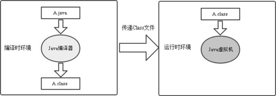

图10-1 Java虚拟机执行流程

从图10-1中可以发现Java虚拟机执行流程分为两大部分，分别是编译时环境和运行时环境，当一个Java文件经过Java编译器编译后会生成Class文件，这个Class文件会由Java虚拟机来进行处理。Java虚拟机与Java语言没有什么必然的联系，它只与特定的二进制文件：Class文件有关。因此无论任何语言只要能编译成Class文件，就可以被Java虚拟机识别并执行，如图10-2所示。

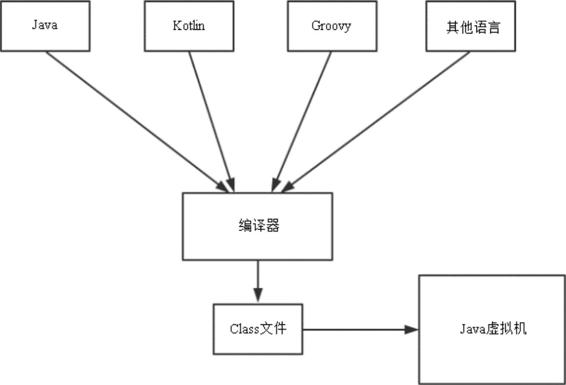

图10-2 语言与Java虚拟机

# 10.2 Java虚拟机结构

这里所讲的体系结构，指的是Java虚拟机的抽象行为，而不是具体的比如HotSpot VM的实现。按照Java虚拟机规范，抽象的Java虚拟机如图10-3所示。

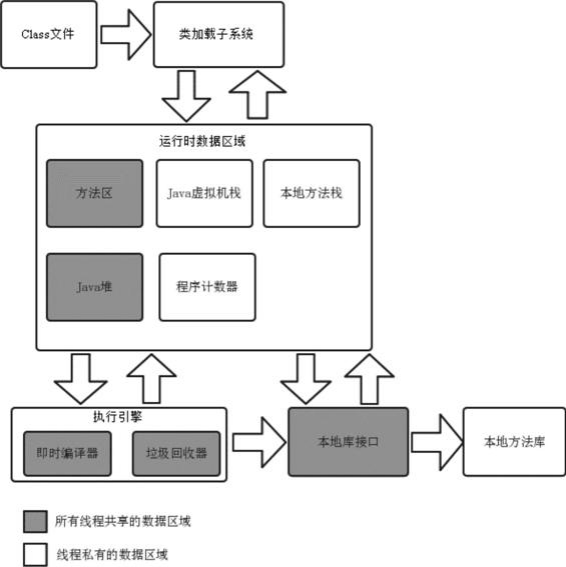

图10-3 Java虚拟机结构

从图10-3可以看出Java虚拟机结构包括运行时数据区域、执行引擎、本地库接口和本地方法库，其中类加载子系统并不属于Java虚拟机的内部结构。图10-3中标出了线程共享和线程私有的区域，比如方法区和Java堆就是所有线程共享的数据区域。下面针对图10-3来介绍Android开发需要掌握的Class文件格式和运行时数据区域。

## 10.2.1 Class文件格式

Java 文件被编译后生成了 Class 文件，这种二进制格式文件不依赖于特定的硬件和操作系统。每一个 Class 文件中都对应着唯一的类或者接口的定义信息，但是类或者接口并不一定定义在文件中，比如类和接口可以通过类加载器来直接生成。10.1.2 节中我们知道无论任何语言只要能编译成Class文件，就可以被Java虚拟机识别并执行，可见Class文件的重要性，了解它对于我们学习那些基于Java虚拟机的语言会有很大帮助。下面我们来学习 Class文件格式，如下所示：

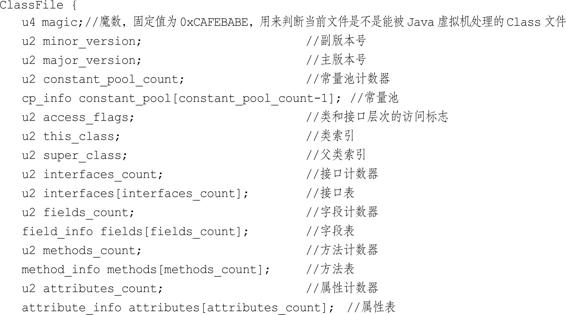

可以看到 ClassFile 具有很强的描述能力，包含了很多关键的信息，其中 u4、u2 表示“基本数据类型”，class文件的基本数据类型如下所示。

· u1：1字节，无符号类型。

· u2：2字节，无符号类型。

· u4：4字节，无符号类型。· u8：8字节，无符号类型。

## 10.2.2 类的生命周期

一个 Java 文件被加载到 Java 虚拟机内存中到从内存中卸载的过程被称为类的生命周期。类的生命周期包括的阶段分别是：加载、链接、初始化、使用和卸载，其中链接包括了三个阶段：验证、准备和解析，因此类的生命周期包括了7个阶段。广义上来说类的加载包括了类的生命周期的5个阶段，分别是加载、链接（验证、准备和解析）、初始化。如图10-4所示。接下来大概介绍类的加载各个阶段所做的工作，如下所示。

（1）加载：查找并加载Class文件。

（2）链接：包括验证、准备和解析。

· 验证：确保被导入类型的正确性。

· 准备：为类的静态字段分配字段，并用默认值初始化这些字段。

· 解析：虚拟机将常量池内的符号引用替换为直接引用。

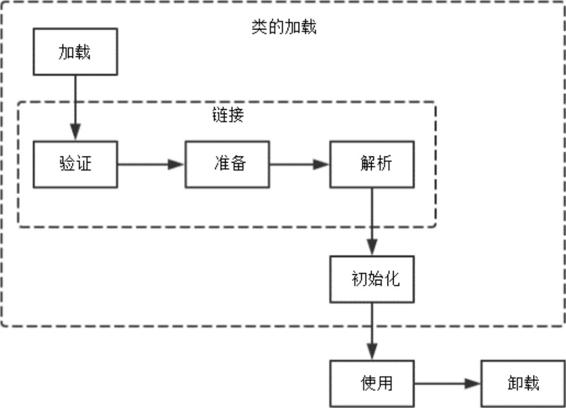

图10-4 类的生命周期

（3）初始化：将类变量初始化为正确初始值。

根据《深入理解Java虚拟机》的描述，加载阶段（不是类的加载）主要做了3件事情：

· 根据特定名称查找类或接口类型的二进制字节流。

· 将这个二进制字节流所代表的静态存储结构转化为方法区的运行时数据结构。

· 在内存中生成一个代表这个类的 java.lang.Class 对象，作为方法区这个类的各种数据的访问入口。

其中第一件事情就是由Java虚拟机外部的类加载子系统来完成的，下面我们来学习类加载子系统。

## 10.2.3 类加载子系统类

加载子系统通过多种类加载器来查找和加载Class文件到Java虚拟机中，Java虚拟机有两种类加载器：系统加载器和自定义加载器。其中系统加载器包括以下三种。

1.Bootstrap ClassLoader（引导类加载器）

用C/C++代码实现的加载器，用于加载指定的JDK的核心类库，比如java.lang.、java.uti.等这些系统类。它用来加载以下目录中的类库：

· $JAVA_HOME/jre/lib目录。

·-Xbootclasspath参数指定的目录。

Java 虚拟机的启动就是通过引导类加载器创建一个初始类来完成的。由于类加载器是使用平台相关的底层C/C++语言实现的，所以该加载器不能被Java代码访问到，但是我们可以查询某个类是否被引导类加载器加载过。

2.Extensions ClassLoader（拓展类加载器）

用于加载Java的拓展类，提供除了系统类之外的额外功能。它用来加载以下目录中的类库：

· 加载$JAVA_HOME/jre/lib/ext目录。

· 系统属性java.ext.dir所指定的目录。

3.Application ClassLoader（应用程序类加载器）

又称作 System ClassLoader （系统类加载器），这是因为这个类加载器可以通过ClassLoader的getSystemClassLoader方法获取到。它用来加载以下目录中的类库：

· 当前应用程序Classpath目录。

· 系统属性java.class.path指定的目录。

除 了 系 统 加 载 器 还 有 自 定 义 加 载 器 ， 它 是 通 过 继 承java.lang.ClassLoader类的方式来实现自己的类加载器的。关于类加载器这里只是简单介绍，在12章会进行详细介绍。

## 10.2.4 运行时数据区域

很多人将Java的内存分为堆内存（Heap）和栈内存（Stack），这种分法不够准确，Java的内存区域划分实际上远比这要复杂。Java虚拟机在执行Java程序的过程中会把它所管理的内存划分为不同的数据区域，根据《Java虚拟机规范（Java SE7版）》的规定，这些数据区域分别为程序计数器、Java虚拟机栈、本地方法栈、Java堆和方法区，下面一一对它们进行介绍。

### 1.程序计数器

为了保证程序能够连续地执行下去，处理器必须具有某些手段来确定下一条指令的地址，而程序计数器正是起到这种作用。程序计数器（Program Counter Register）也叫作PC寄存器，是一块较小的内存空间。在虚拟机概念模型中，字节码解释器工作时就是通过改变程序计数器来选取下一条需要执行的字节码指令的，Java 虚拟机的多线程是通过轮流切换并分配处理器执行时间的方式来实现的，在一个确定的时刻只有一个处理器执行一条线程中的指令，为了在线程切换后能恢复到正确的执行位置，每个线程都会有一个独立的程序计数器，因此，程序计数器是线程私有的。如果线程执行的方法不是Native方法，则程序计数器保存正在执行的字节码指令地址，如果是 Native方法则程序计数器的值为空（Undefined）。程序计数器是Java虚拟机规范中唯一没有规定任何OutOfMemoryError情况的数据区域。

### 2.Java虚拟机栈

每一条 Java 虚拟机线程都有一个线程私有的 Java 虚拟机栈（Java Virtual Machine Stacks）。它的生命周期与线程相同，与线程是同时创建的。Java虚拟机栈存储线程中Java方法调用的状态，包括局部变量、参数、返回值以及运算的中间结果等。一个Java虚拟机栈包含了多个栈帧，一个栈帧用来存储局部变量表、操作数栈、动态链接、方法出口等信息。当线程调用一个Java方法时，虚拟机压入一个新的栈帧到该线程的Java虚拟机栈中，在该方法执行完成后，这个栈帧就从Java虚拟机栈中弹出。我们平常所说的栈内存（Stack）指的就是Java虚拟机栈。Java虚拟机规范中定义了两种异常情况。

· 如果线程请求分配的栈容量超过Java虚拟机所允许的最大容量，Java虚拟机会抛出StackOverflowError。

· 如果Java虚拟机栈可以动态扩展（大部分Java虚拟机都可以动态扩展），但是扩展时无法申请到足够的内存，或者在创建新的线程时 没 有 足 够 的 内 存 去 创 建 对 应 的 Java 虚 拟 机 栈 ， 则 会 抛 出OutOfMemoryError异常。

### 3.本地方法栈

Java虚拟机实现可能要用到C Stacks来支持Native语言，这个CStacks就是本地方法栈（Native Method Stack）。它与Java虚拟机栈类似，只不过本地方法栈是用来支持Native方法的。如果Java虚拟机不支持Native方法，并且也不依赖于C Stacks，可以无须支持本地方法栈。在Java虚拟机规范中对本地方法栈的语言和数据结构等没有强制规定，因此具体的Java虚拟机可以自由实现它，比如HotSpot VM将本地方法栈和Java虚拟机栈合二为一。与Java虚拟机栈类似，本地方法栈也会抛出StackOverflowError和OutOfMemoryError异常。

### 4.Java堆

Java堆（Java Heap）是被所有线程共享的运行时内存区域。Java堆用来存放对象实例，几乎所有的对象实例都在这里分配内存。Java堆存储的对象被垃圾收集器管理，这些受管理的对象无法显式地销毁。从内存回收的角度来分，Java 堆可以粗略地分为新生代和老年代，从内存分配的角度Java堆中可能划分出多个线程私有的分配缓冲区。不管如何划分，Java堆存储的内容是不变的，进行划分是为了能更快地回收或者分配内存。Java堆的容量可以是固定的，也可以动态扩展。Java 堆所使用的内存在物理上不需要连续，逻辑上连续即可。Java 虚拟机规范中定义了一种异常情况：如果在堆中没有足够的内存来 完 成 实 例 分 配 ， 并 且 堆 也 无 法 进 行 扩 展 时 ， 则 会 抛 出OutOfMemoryError异常。

### 5.方法区

方法区（Method Area）是被所有线程共享的运行时内存区域，用来存储已经被 Java虚拟机加载的类的结构信息，包括运行时常量池、字段和方法信息、静态变量等数据。方法区是Java堆的逻辑组成部分，它一样在物理上不需要连续，并且可以选择在方法区中不实现垃圾收集。方法区并不等同于永久代，只是因为 HotSpot VM 使用永久代来实现方法区，对于其他的Java虚拟机，比如J9和JRockit等，并不存在永久代概念。在Java虚拟机规范中定义了一种异常情况：如果方法区的内存空间不满足内存分配需求时，Java虚拟机会抛出OutOfMemoryError异常。

### 6.运行时常量池

运行时常量池（Runtime Constant Pool）并不是运行时数据区域的其中一份子，而是方法区的一部分。在10.2.1节中我们得知，Class文件不仅包含类的版本、接口、字段和方法等信息，还包含常量池，它用来存放编译时期生成的字面量和符号引用，这些内容会在类加载后存放在方法区的运行时常量池中。运行时常量池可以理解为是类或接口的常量池的运行时表现形式。

在Java虚拟机规范中定义了一种异常情况：当创建类或接口时，如果构造运行时常量池所需的内存超过了方法区所能提供的最大值，Java虚拟机会抛出OutOfMemoryError异常。

# 10.3 对象的创建

对象的创建是我们经常要做的事，通常是通过new指令来完成一个对象的创建的，当虚拟机接收到一个new指令时，它会做如下的操作。

1.判断对象对应的类是否加载、链接和初始化

虚拟机接收到一条new指令时，首先会去检查这个指定的参数是否能在常量池中定位到一个类的符号引用，并且检查这个符号引用代表的类是否已被类加载器加载、链接和初始化过。

2.为对象分配内存

类加载完成后，接着会在Java堆中划分一块内存分配给对象。内存分配根据Java堆是否规整，有两种方式。

· 指针碰撞：如果Java堆的内存是规整的，即所有用过的内存放在一边，而空闲的内在放在另一边。分配内存时将位于中间的指针指示器向空闲的内存移动一段与对象大小相等的距离，这样便完成分配内存工作。

· 空闲列表：如果Java堆的内存不是规整的，则需要由虚拟机维护一个列表来记录哪些内存是可用的，这样在分配的时候可以从列表中查询到足够大的内存分配给对象，并在分配后更新列表记录。Java堆的内存是否规整根据所采用的垃圾收集器是否带有压缩整理功能有关。

3.处理并发安全问题

创建对象是一个非常频繁的操作，所以需要解决并发的问题，有两种方式：

· 对分配内存空间的动作进行同步处理，比如在虚拟机采用CAS算法并配上失败重试的方式保证更新操作的原子性。

· 每个线程在Java堆中预先分配一小块内存，这块内存称为本地线程分配缓冲（Thread Local Allocation Buffer，TLAB），线程需要分配内存时，就在对应线程的TLAB上分配内存，当线程中的TLAB用完并且被分配到了新的TLAB时，这时候才需要同步锁定。通过-XX：+/-UserTLAB参数来设定虚拟机是否使用TLAB。

4.初始化分配到的内存空间将分配到的内存，除了对象头外都初始化为零值。

5.设置对象的对象头将对象的所属类、对象的HashCode和对象的GC分代年龄等数据存储在对象的对象头中。关于对象头，10.4节中会进行介绍。

6.执行init方法进行初始化执行 init 方法，初始化对象的成员变量、调用类的构造方法，这样一个对象就被创建了出来。

# 10.4 对象的堆内存布局

对象创建完毕，并且已经在Java堆中分配了内存，那么对象在堆内存是如何进行布局的呢？以HotSpot虚拟机为例，对象在堆内存的布局分为三个区域，分别是对象头（Header）、实例数据（InstanceData）、对齐填充（Padding）。下面分别来对这三个区域进行简单介绍。

· 对象头：对象头包括两部分信息，分别是 Mark World 和元数据指针，Mark World用于存储对象运行时的数据，比如HashCode、锁状态标志、GC分代年龄、线程持有的锁等。而元数据指针用于指向方法区中的目标类的元数据，通过元数据可以确定对象的具体类型，具体是如何实现的请看10.5节。

· 实例数据：用于存储对象中的各种类型的字段信息（包括从父类继承来的）。

· 对齐填充：对齐填充不一定存在，起到了占位符的作用，没有特别的含义。

Mark Word在HotSpot中的实现类为markOop.hpp，markOop被设计成一个非固定的数据结构，这是为了在极小的空间中存储尽量多的数据，32位虚拟机的markOop格式如下所示：

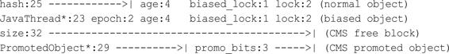

其中部分数据类型解释如下。

· hash：对象的哈希码。

· age：对象的分代年龄。

· biased_lock：偏向锁标识位。

· lock：锁状态标识位。

· JavaThread*：持有偏向锁的线程ID。

· epoch：偏向时间戳。

对象的堆内存布局如图10-5所示。

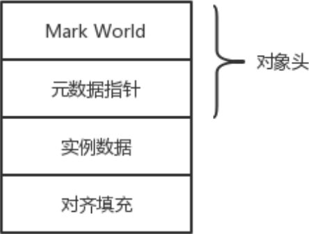

图10-5 对象的堆内存布局

# 10.5 oop-klass模型

oop-klass模型是用来描述Java对象实例的一种模型，它分为两个部分，OOP（Ordinary Object Pointer）指的是普通对象指针，用来表示对象的实例信息。klass用来描述元数据。

在HotSpot中就采用了oop-klass模型，oop实际是一个家族，Java虚拟机内部会定义很多oop类型，如下所示：

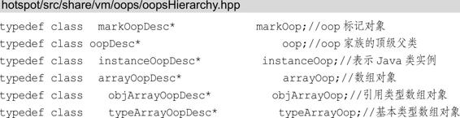

其 中 oopDesc 是 所 有 oop 的 顶 级 父 类 ， arrayOopDesc 是objArrayOopDesc 和typeArrayOopDesc的父类。instanceOopDesc和arrayOopDesc 都可以用来描述对象头。

在oopsHierarchy.hpp中还定义了klass家族：

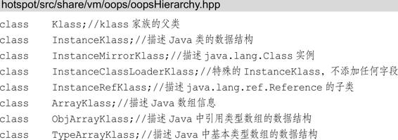

其 中 Klass 是 klass 家 族 的 父 类 （ 不 是 顶 级 父 类 ） ，ArrayKlass 是 ObjArrayKlass 和TypeArrayKlass的父类，可以发现oop 家 族 的 成 员 和 klass 家 族 的 成 员 有 着 对 应 的 关 系 ， 比 如instanceOopDesc 对 应 InstanceKlass ， objArrayOopDesc 对 应ObjArrayKlass。这里我们拿instanceOopDesc 和 InstanceKlass 的对应关系来举例，其他的对应关系也是类似的。instanceOopDesc的定义如下所示：

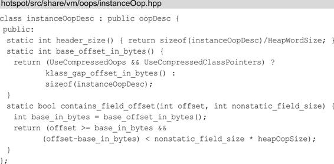

可以看出instanceOopDesc 继承了oopDesc：

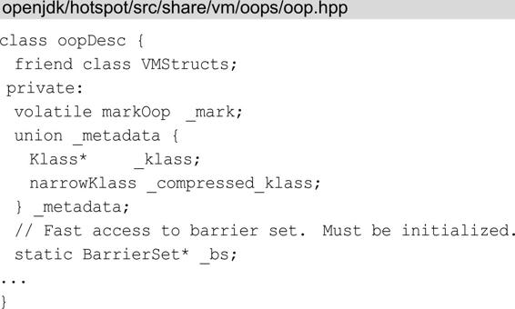

oopDesc中包含两个数据成员：mark和_metadata。其中markOop类型的mark对象指的是前面讲到的Mark World。metadata是一个共用体，其中klass是普通指针，_compressed_klass是压缩类指针，它们就是 10.4 节讲到的元数据指针，这两个指针根据对应关系都会指向instanceKlass，instanceKlass可以用来描述元数据，我们接着往下看，instanceKlass的代码如下所示：

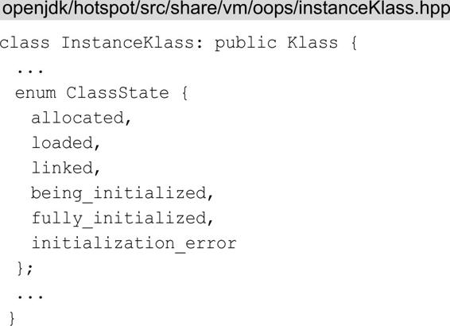

instanceKlass继承自klass，枚举ClassState用来标识对象的加载进度，klass中定义的部分字段如下所示：

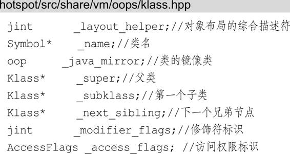

可以看到klass描述了元数据，具体来说就是Java类在Java虚拟机中对等的C++类型描述，这样继承自klass的instanceKlass同样可以用来描述元数据。了解了opp-klass模型，我们就可以分析 Java 虚拟机是如何通过栈帧中的对象引用找到对应的对象实例的，如图10-6所示。

从图 10-6 中可以看出，Java 虚拟机通过栈帧中的对象引用找到Java 堆中的instanceOopDesc，这样就可以访问到Java对象的实例信息，当需要访问对象的具体类型等信息时，可以通过instanceOopDesc中的元数据指针来找到方法区中对应的instanceKlass。

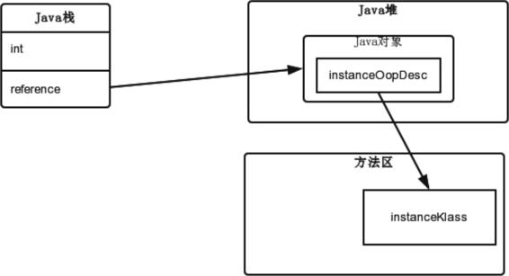

图10-6 确定对象具体类型

# 10.6 垃圾标记算法

垃圾收集器（Garbage Collection），通常被称作 GC。提到GC，很多人认为它是伴随Java而出现的，其实GC出现的时间要比Java早太多了，它是1960年诞生于MIT的Lisp。GC主要做了两个工作，一个是内存的划分和分配，另一个是对垃圾进行回收。关于内存的划分和分配，目前Java虚拟机内存的划分是依赖于GC设计的，比如现在GC都是采用了分代收集算法来回收垃圾的，Java堆作为GC主要管理的区域，被细分为新生代和老年代，再细致一点新生代又可以划分为Eden空间、From Survivor空间、To Survivor空间等，这样划分是为了更快地进行内存分配和回收。空间划分后，GC就可以为新对象分配内存空间。关于对垃圾进行回收，被引用的对象是存活的对象，而不被引用的对象是死亡的对象（也就是垃圾），GC要区分出存活的对象和死亡的对象（也就是垃圾标记），并对垃圾进行回收。在对垃圾进行回收前，GC要先标记出垃圾，那么如何标记呢？目前有两种垃圾标记算法，分别是引用计数算法和根搜索算法，这两个算法都和引用有些关联，因此讲垃圾标记算法前，我们先回顾一下引用的知识点。

## 10.6.1 Java中的引用

在JDK1.2之后，Java将引用分为强引用、软引用、弱引用和虚引用。

1.强引用当我们新建一个对象时就创建了一个具有强引用的对象，如果一个对象具有强引用，垃圾收集器就绝不会回收它。Java虚拟机宁愿抛出OutOfMemoryError异常，使程序异常终止，也不会回收具有强引用的对象来解决内存不足的问题。

2.软引用

如果一个对象只具有软引用，当内存不够时，会回收这些对象的内存，回收后如果还是没有足够的内存，就会抛出OutOfMemoryError异常。Java提供了SoftReference类来实现软引用。

3.弱引用

弱引用比起软引用具有更短的生命周期，垃圾收集器一旦发现了只具有弱引用的对象，不管当前内存是否足够，都会回收它的内存。Java提供了WeakReference类来实现弱引用。

4.虚引用

虚引用并不会决定对象的生命周期，如果一个对象仅持有虚引用，这就和没有任何引用一样，在任何时候都可能被垃圾收集器回收。一个只具有虚引用的对象，被垃圾收集器回收时会收到一个系统通知，这也是虚引用的主要作用。Java提供了PhantomReference类来实现虚引用。

## 10.6.2 引用计数算法

引用计数算法的基本思想就是每个对象都有一个引用计数器，当对象在某处被引用的时候，它的引用计数器就加1，引用失效时就减1。当引用计数器中的值变为0，则该对象就不能被使用，变成了垃圾。

目前主流的Java虚拟机没有选择引用计数算法来为垃圾标记，主要原因是引用计数算法没有解决对象之间相互循环引用的问题。

举个例子，在下面代码的注释1和注释2处，d1和d2相互引用，除此之外这两个对象无任何其他引用，实际上这两个对象已经死亡，应该作为垃圾被回收，但是由于这两个对象互相引用，引用计数就不会为0，如果Java虚拟机采用了引用计数算法，垃圾收集器就无法回收它们。

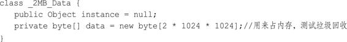

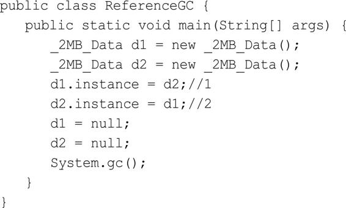

如果你使用Android Studio，就在Edit Configurations中的VMoptions加入如下语句来输出详细的GC日志：

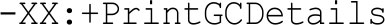

运行程序，GC日志为：

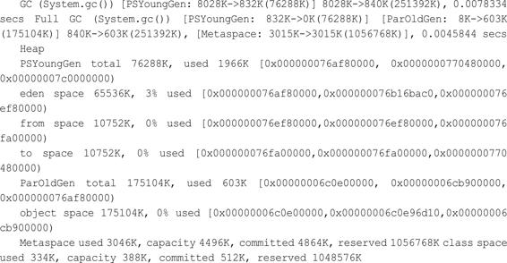

查看此GC日志前我们先来简单了解一下各参数的含义，[GC（System.gc（））和[Full GC （System.gc（））说明了这次垃圾收集的停顿类型，而不是来区分新生代GC和老年代GC的。[Full GC（System.gc（））说明这次GC发生了STW，STW也就是Stop the World机制，意思是说在执行垃圾收集算法时，只有GC 线程在运行，其他的线程则会全部暂停，等待GC 线程执行完毕后才能再次运行。

PSYoungGen代表新生代，ParOldGen代表老年代，Metaspace代表元空间（JDK 8中用来替代永久代PermGen）。

我 们 来 看 日 志 的 [GC （ System.gc （ ） ） ， 内 存 变 化 为 ：8028K→840K（251392K），8028K 代表回收前的内存大小，840K代表回收后的内存大小，251392K代表内存总大小。因此可以得知内存回收大小为（8028-840）KB。这就说明JDK 8的HotSpot虚拟机并没有引用计数算法来标记内存，它对上述代码中的两个死亡对象的引用进行了回收。

## 10.6.3 根搜索算法

这个算法的基本思想就是选定一些对象作为GC Roots，并组成根对象集合，然后以这些GC Roots的对象作为起始点，向下搜索，如果目标对象到GC Roots是连接着的，我们则称该目标对象是可达的，如果目标对象不可达则说明目标对象是可以被回收的对象，如图10-7所示。

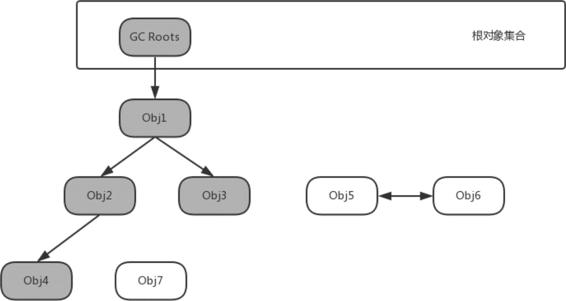

图10-7 根对象集合

从图10-7可以看出，Obj5、Obj6和Obj7都是不可达的对象，其中Obj5和Obj6虽然互相引用，但是因为它们到GC Roots是不可达的，所以它们仍旧被判定为可回收的对象，这样根搜索算法就解决了引用计数算法无法解决的问题：已经死亡的对象因为相互引用而不能被回收。在Java中，可以作为GC Roots的对象主要有以下几种：

· Java栈中引用的对象。

· 本地方法栈中JNI引用的对象。

· 方法区中运行时常量池引用的对象。

· 方法区中静态属性引用的对象。

· 运行中的线程。

· 由引导类加载器加载的对象。

· GC控制的对象。

还有一个问题是被标记为不可达的对象会立即被垃圾收集器回收吗？要回答这个问题我们首先要了解Java对象在虚拟机中的生命周期。

# 10.7 Java对象在虚拟机中的生命周期

在Java对象被类加载器加载到虚拟机中后，Java对象在Java虚拟机中有7个阶段。

1.创建阶段（Created）

创建阶段的具体步骤为：

（1）为对象分配存储空间。

（2）构造对象。

（3）从超类到子类对static成员进行初始化。

（4）递归调用超类的构造方法。

（5）调用子类的构造方法。

2.应用阶段（In Use）

当对象被创建，并分配给变量赋值时，状态就切换到了应用阶段。这一阶段的对象至少要具有一个强引用，或者显式地使用软引用、弱引用或者虚引用。

3.不可见阶段（Invisible）

在程序中找不到对象的任何强引用，比如程序的执行已经超出了该对象的作用域。在不可见阶段，对象仍可能被特殊的强引用GCRoots持有着，比如对象被本地方法栈中JNI引用或被运行中的线程引用等。

4.不可达阶段（Unreachable）

在程序中找不到对象的任何强引用，并且垃圾收集器发现对象不可达。

5.收集阶段（Collected）

垃圾收集器已经发现对象不可达，并且垃圾收集器已经准备好要对该对象的内存空间重新进行分配，这个时候如果该对象重写了finalize方法，则会调用该方法。

6.终结阶段（Finalized）

在对象执行完finalize方法后仍然处于不可达状态时，或者对象没有重写finalize方法，则该对象进入终结阶段，并等待垃圾收集器回收该对象空间。

7.对象空间重新分配阶段（Deallocated）

当垃圾收集器对对象的内存空间进行回收或者再分配时，这个对象就会彻底消失。

好了，我们已经了解了Java对象在虚拟机中的生命周期，再来回想10.6.3节说的问题：被标记为不可达的对象会立即被垃圾收集器回收吗？很显然是不会的，被标记为不可达的对象会进入收集阶段，这时会执行该对象重写的finalize方法，如果没有重写finalize方法或者finalize方法中没有重新与一个可达的对象进行关联才会进入终结阶段，并最终被回收。

# 10.8 垃圾收集算法

在10.6 节中我们学习了垃圾标记算法，垃圾被标记后，GC 就会对垃圾进行收集，垃圾收集有很多种算法，这一节就来介绍常用的垃圾收集算法的思想。

## 10.8.1 标记—清除算法

标记—清除算法（Mark-Sweep）是一种常见的基础垃圾收集算法，它将垃圾收集分为两个阶段。

· 标记阶段：标记出可以回收的对象。

· 清除阶段：回收被标记的对象所占用的空间。

标记—清除算法之所以是基础的，是因为后面讲到的垃圾收集算法都是在此算法的基础上进行改进的。标记—清除算法的执行过程如图10-8所示。

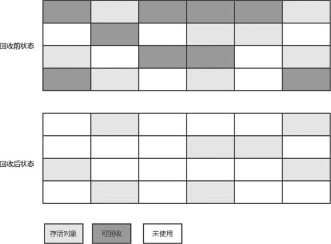

图10-8 标记—清除算法的执行过程

标记—清除算法主要有两个缺点，一个是标记和清除的效率都不高，另一个从图10-8就可以看出来，就是容易产生大量不连续的内存碎片，碎片太多可能会导致后续没有足够的连续内存分配给较大的对象，从而提前触发新的一次垃圾收集动作。

## 10.8.2 复制算法

为了解决标记—清除算法的效率不高的问题，产生了复制算法。它把内存空间划为两个相等的区域，每次只使用其中一个区域。在垃圾收集时，遍历当前使用的区域，把存活对象复制到另外一个区域中，最后将当前使用的区域的可回收的对象进行回收。复制算法的执行过程如图10-9所示。

这种算法每次都对整个半区进行内存回收，不需要考虑内存碎片的问题，代价就是使用内存为原来的一半。复制算法的效率与存活对象的数目多少有很大的关系，如果存活对象很少，复制算法的效率就会很高。由于绝大多数对象的生命周期很短，并且这些生命周期很短的对象都存于新生代中，所以复制算法被广泛应用于新生代中，关于新生代中复制算法的应用，会在后面的分代收集算法中详细介绍。

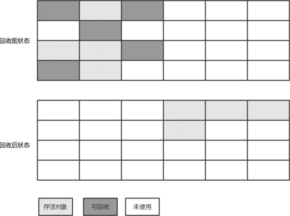

图10-9 复制算法的执行过程

## 10.8.3 标记—压缩算法

在新生代中可以使用复制算法，但是在老年代就不能选择复制算法了，因为老年代的对象存活率会较高，这样会有较多的复制操作，导致效率变低。标记—清除算法可以应用在老年代中，但是它效率不高，在内存回收后容易产生大量内存碎片。因此就出现了一种标记—压缩（Mark-Compact）算法，与标记—清除算法不同的是，在标记可回收的对象后将所有存活的对象压缩到内存的一端，使它们紧凑地排列在一起，然后对边界以外的内存进行回收，回收后，已用和未用的内存都各自一边，标记—压缩算法的执行过程如图10-10所示。

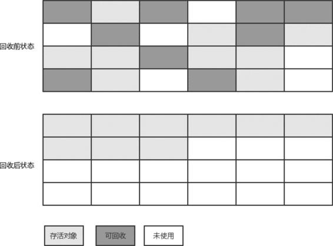

图10-10 标记—压缩算法的执行过程

标记—压缩算法解决了标记—清除算法效率低和容易产生大量内存碎片的问题，它被广泛应用于老年代中。

## 10.8.4 分代收集算法

分代收集算法会结合不同的收集算法来处理不同的空间，因此在学习分代收集算法之前我们首先要了解Java堆区的空间划分。Java堆区的空间划分在Java虚拟机中，各种对象的生命周期会有着较大的差别，大部分对象生命周期很短暂，少部分对象生命周期很长，有的甚至与应用程序以及Java虚拟机的运行周期一样长。因此，应该对不同生命周期的对象采取不同的收集策略，根据生命周期长短将它们分别放到不同的区域，并在不同的区域采用不同的收集算法，这就是分代的概念。现在主流的Java虚拟机的垃圾收集器都采用分代收集算法（Generational Collection）。Java 堆区基于分代的概念，分为新生代（Young Generation）和老年代（Tenured Generation），其中新生代再细分为Eden空间、From Survivor空间和To Survivor空间。因为Eden空间中的大多数对象生命周期很短，所以新生代的空间划分并不是均分的，HotSpot虚拟机默认Eden空间和两个Survivor空间的所占的比例为8：1。

### 1.分代收集

根据Java堆区的空间划分，垃圾收集的类型分为两种，它们分别如下。

· Minor Collection：新生代垃圾收集。

· Full Collection：对老年代进行收集，又可以称作Major Collection，Full Collection通常情况下会伴随至少一次的MinorCollection，它的收集频率较低，耗时较长。

当执行一次Minor Collection时，Eden空间的存活对象会被复制到To Survivor空间，并且之前经过一次Minor Collection并在FromSurvivor空间存活的仍年轻的对象也会复制到To Survivor空间。有两种情况Eden空间和From Survivor空间存活的对象不会复制到ToSurvivor 空间，而是晋升到老年代。一种是存活的对象的分代年龄超过-XX：MaxTenuringThreshold（用于控制对象经历多少次Minor GC才晋升到老年代）所指定的阈值。另一种是To Survivor空间容量达到阈值。当所有存活的对象被复制到To Survivor空间，或者晋升到老年代，也就意味着Eden空间和From Survivor空间剩下的都是可回收对象，如图10-11所示。

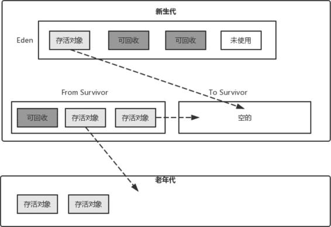

图10-11 复制算法在新生代中的应用

这个时候GC执行Minor Collection，Eden空间和From Survivor空间都会被清空，新生代中存活的对象都存放在To Survivor空间。接下来将From Survivor空间和To Survivor空间互换位置，也就是此前的From Survivor 空间成为了现在的 To Survivor 空间，每次Survivor空间互换都要保证To Survivor空间是空的，这就是复制算法在新生代中的应用。在老年代则会采用标记—压缩算法或者标记—清除算法。

# 10.9 本章小结

Java虚拟机是一个很庞大的知识体系，本章也只是介绍了Java虚拟机知识中的非常少的一部分，包括Java虚拟机结构、oop-klass模型、垃圾标记算法和垃圾收集算法等。对于Android开发者来说，了解这些知识点对普通的Android开发工作完全够用，如果想要更深入地了解Java虚拟机则需要阅读专业介绍Java虚拟机的书籍。

# 参考

《Android进阶解密》
