本文用于记录：如何编译插桩操纵字节码。

之前学了 Java 字节码文件的格式，并通过一个 demo 手动模拟了 JVM 解析 class 文件的过程。所有的理论知识都是为了在项目中实践做准备。本文学习下，class 文件的其他用法。


如果有下面一个需求：

> 记录每一个页面的打开和关闭事件，并通过各种 DataTracking 的框架上传到服务器，用来日后做数据分析。

一般都会想到，在每一个 Activity 的 onCreate 和 onDestroy 方法中，分别添加页面打开和页面关闭的逻辑。常见的做法有以下两种：

- 修改项目中现有的每一个 Activity，这样显然不太合适，如果项目以后需要添加新的页面，这套逻辑需要重新拷贝一遍，非常容易遗漏。

- 将项目中所有的 Activity 继承自 BaseActivity，将页面打开和关闭的逻辑添加在 BaseActivity中，这种方案看起来比第 1 种方案靠谱得多，并且后续项目中有新的 Activity，直接继承 BaseActivity 即可。但是这种方案对第三方依赖库中的界面则无能为力，因为我们没有第三方依赖库的源码。


在这种环境下，一种更加优雅更加完整的方案应运而生：**编译插桩**。

### 编译插桩是什么

顾名思义，所谓编译插桩就是在代码编译期间修改已有的代码或者生成新代码。实际上，我们项目中经常用到的 Dagger、ButterKnife 甚至是 Kotlin 语言，它们都用到了编译插桩的技术。

理解编译插桩之前，需要先回顾一下 Android 项目中 .java 文件的编译过程：

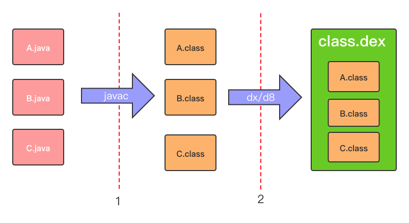

从上图可以看出，我们可以在 1、2 两处对代码进行改造。

- 在 .java 文件编译成 .class 文件时，APT、AndroidAnnotation 等就是在此处触发代码生成。

- 在 .class 文件进一步优化成 .dex 文件时，也就是直接操作字节码文件，也是本文介绍的内容。这种方式功能更加强大，应用场景也更多。但是门槛比较高，需要对字节码有一定的理解。


本文主要学习第 2 种实现方式，用一张图来描述如下过程，其中红色虚框包含了本文要讲的所有内容。

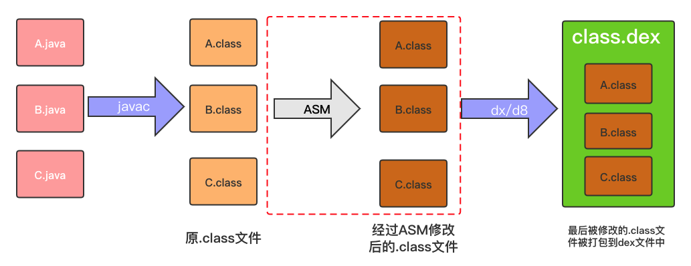

一般情况下，我们经常会使用编译插桩实现如下几种功能：

- 日志埋点；

- 性能监控；

- 动态权限控制；

- 业务逻辑跳转时，校验是否已经登录；

- 甚至是代码调试等。


### 插桩工具介绍

目前市面上主要流行两种实现编译插桩的方式：

#### AspectJ

AspectJ 是老牌 AOP（Aspect-Oriented Programming）框架，如果你做过 J2EE 开发可能对这个框架更加熟悉，经常会拿这个框架跟 Spring AOP 进行比较。其主要优势是成熟稳定，使用者也不需要对字节码文件有深入的理解。

#### ASM

目前另一种编译插桩的方式 ASM 越来越受到广大工程师的喜爱。通过 ASM 可以修改现有的字节码文件，也可以动态生成字节码文件，并且它是一款完全以字节码层面来操纵字节码并分析字节码的框架。

举个例子，在 Java 中如果实现两个数相加操作，可以如下实现：

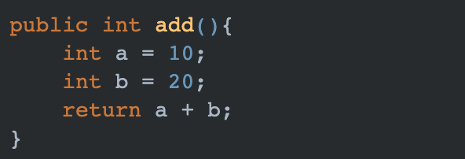

但是如果使用 ASM 直接编写字节码指令，则有可能是如下几个字节码指令：

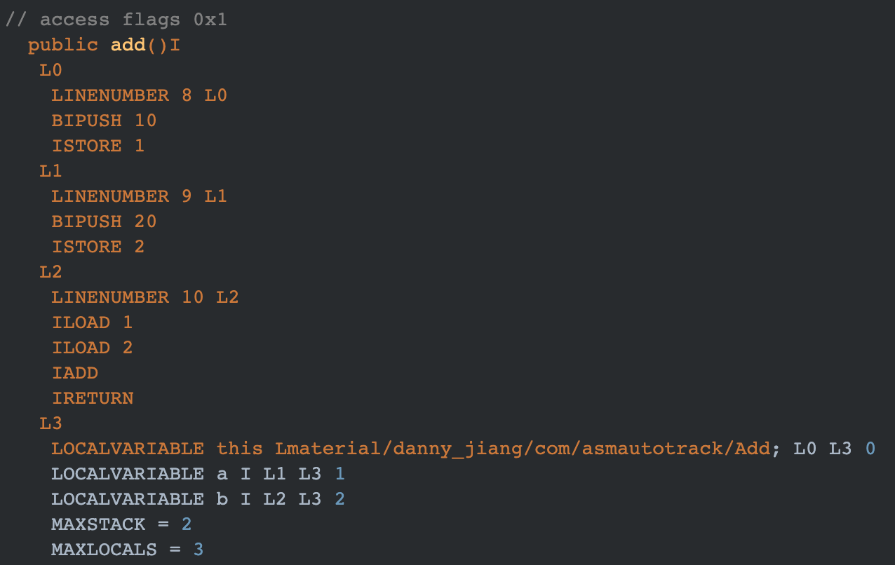

虽然上面的代码看起来很恐怖，但是没必要太过担心，因为有各种工具帮我们生成这些字节码指令。

本文就使用 ASM 来实现简单的编译插桩效果，通过插桩实现文本开始讲的需求，在每一个 Activity 打开时输出相应的 log 日志。

### 实现思路

过程主要包含两步：

1. **遍历项目中所有的 .class 文件**

如何找到项目中编译生成的所有 .class 文件，是我们需要解决的第一个问题。众所周知，Android Studio 使用 Gradle 编译项目中的 .java 文件，并且从 Gradle1.5.0 之后，我们可以自己定义 Transform，来获取所有 .class 文件引用。但是 Transform 的使用需要依赖 Gradle Plugin。因此我们**第一步需要创建一个单独的 Gradle Plugin，并在 Gradle Plugin 中使用自定义 Transform 找出所有的 .class 文件**。

2. **遍历到目标 .class 文件 （Activity）之后，通过 ASM 动态注入需要被插入的字节码**

如果第一步进行顺利，我们可以找出所有的 .class 文件。接下来就需要**过滤出目标 Activity 文件，并在目标 Activity 文件的 onCreate 方法中，通过 ASM 插入相应的 log 日志字节码**。

### 具体实现

#### 创建 ASMLifeCycleDemo 项目

创建主项目 ASMLifeCycleDemo，当前项目中只有一个 MainActivity，如下：

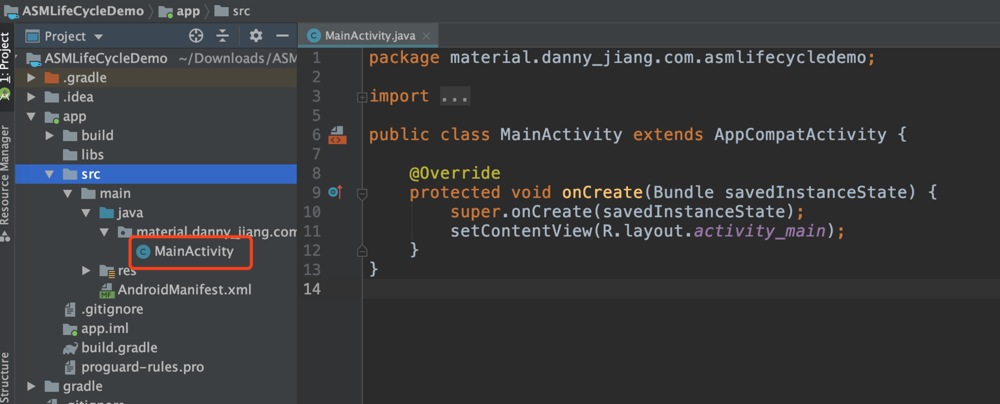

#### 创建自定义 Gradle 插件

首先在 ASMLifeCycleDemo 项目中创建一个新的 module，并选择 Android Library 类型，命名为 asm_lifecycle_plugin。

将 asm_lifecycle_plugin module 中除了 build.gradle 和 main 文件夹之外的所有内容都删除。然后在 main 目录下分别创建 groovy 和 java 目录，结构如下：

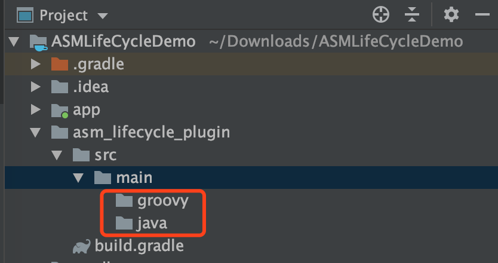

groovy文件中的内容和resources会在后面创建。

因为 Gradle 插件是使用 groovy 语言编写的，所以需要新建一个 groovy 目录，用来存放插件相关的.groovy类。 但 ASM 是 java 层面的框架，所以在 java 目录里存放 ASM 相关的类。

然后，在 groovy 中创建目录 plugin，并在此目录中创建类 LifeCyclePlugin.groovy 文件。在 LifeCyclePlugin 中重写 apply 方法，实现插件逻辑，因为是 demo 演示，所以我只是简单的打印 log 日志。

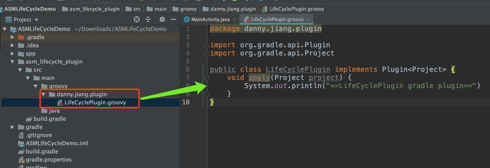

可以看出 LifeCyclePlugin 实现了 gradle api 中的 Plugin 接口。当我们在 app module 的 build.gradle 文件中使用此插件时，其 LifeCyclePlugin 的 apply 方法将会被自动调用。

接下来，将 asm_lifecycle_plugin module 的 build.gradle 中的内容全部删掉，改为如下内容：

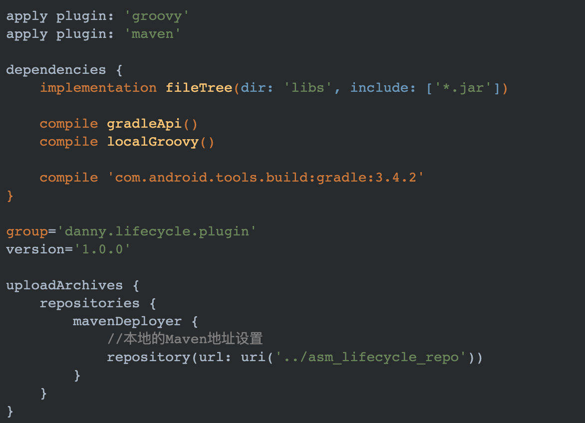

```
apply plugin: 'groovy'
apply plugin: 'maven'

dependencies {
    implementation fileTree(dir: 'libs', include: ['*.jar'])
    implementation gradleApi()
    implementation localGroovy()

    implementation 'com.android.tools.build:gradle:4.0.2'
}

group = 'plugin'
version = '1.0.0'

uploadArchives {
    repositories {
        mavenDeployer {
            //
            repository(url: uri('../asm_lifecycle_repo'))
        }
    }
}
```

group 和 version 都需要在 app module 引用此插件时使用。

所有的插件都需要被部署到 maven 库中，我们可以选择部署到远程或者本地。这里只是演示，所以只是将插件部署到本地目录中。具体地址通过 repository 属性配置，在上面我将其配置在项目根目录下的 asm_lifecycle_repo 目录下。

最后一步，创建 properties 文件。

在 plugin/src/main 目录下新建目录 resources/META-INF/gradle-plugins，然后在此目录下新建一个文件：asm.lifecycle.properties，其中文件名 asm.lifecycle 就是我们自定义插件的名称，稍后我们在 app module 中会使用到此名称。

在 .properties 文件中，需要指定我们自定义的插件类名 LifeCyclePlugin，如下所示：

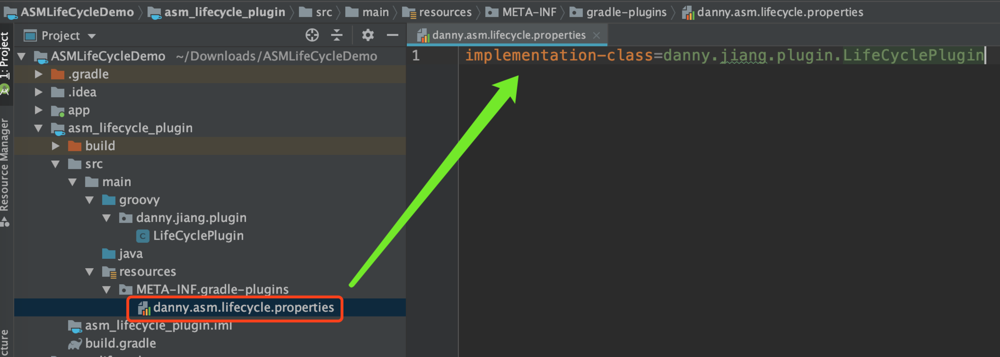

至此，自定义 Gradle 插件就已经写完，现在可以在 Android Studio 的右边栏找到 Gradle 中点击 uploadArchives，执行 plugin 的部署任务：

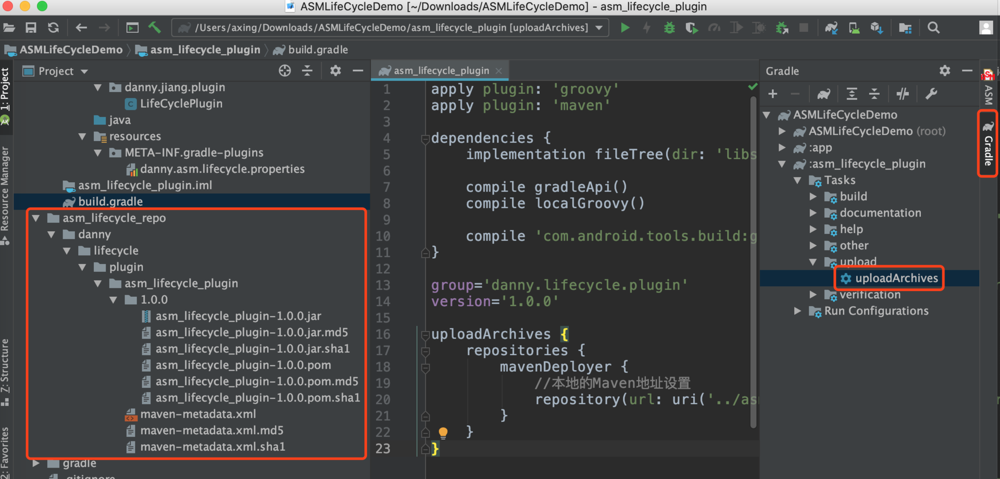

可以看到，构建成功之后，在 Project 的根目录下将会出现一个 repo 目录，里面存放的就是我们的插件目标文件。

#### 测试 asm_lifecycle_plugin

为了测试自定义的 Gradle 插件是否可用，可以在 app module 中的 build.gradle 中引用此插件。

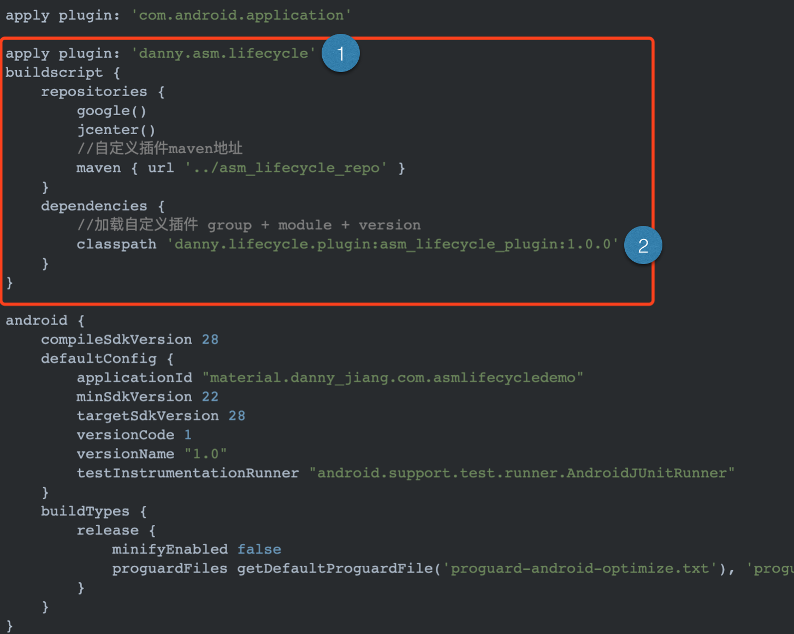

图中 **apply plugin: 'asm.lifecycle'** 就是在自定义 Gradle 插件中 properties 的文件名 （danny.asm.lifecycle）。

图中 **classpath 'plugin:asm_lifecycle_plugin:1.0.0'** ： dependencies 中的 classpath 是 group 值 + module 名 + version。

然后执行构建命令，如果打印出我们自定义插件里的 log，则说明自定义 Gradle 插件可以使用：


> 其实现在已经有了一些比较成熟的三方 Gradle 插件，比如 hiBeaver。如果不喜欢从头创建 Gradle 插件，可以考虑尝试使用。

#### 自定义 Transform，实现遍历 .class 文件

自定义 Gradle 插件已经写好，接下来就需要实现遍历所有 .class 的逻辑。这部分功能主要依赖 Transform API。

#### 什么是 Transform ？

Transform 可以被看作是 Gradle 在编译项目时的一个 task，在 .class 文件转换成 .dex 的流程中会执行这些 task，对所有的 .class 文件（可包括第三方库的 .class）进行转换，转换的逻辑定义在 Transform 的 transform 方法中。实际上平时我们在 build.gradle 中常用的功能都是通过 Transform 实现的，比如混淆（proguard）、分包（multi-dex）、jar 包合并（jarMerge）。

#### 自定义 Transform

在 plugin 目录中，新建 LifeCycleTransform.groovy，并继承 Transform 类。

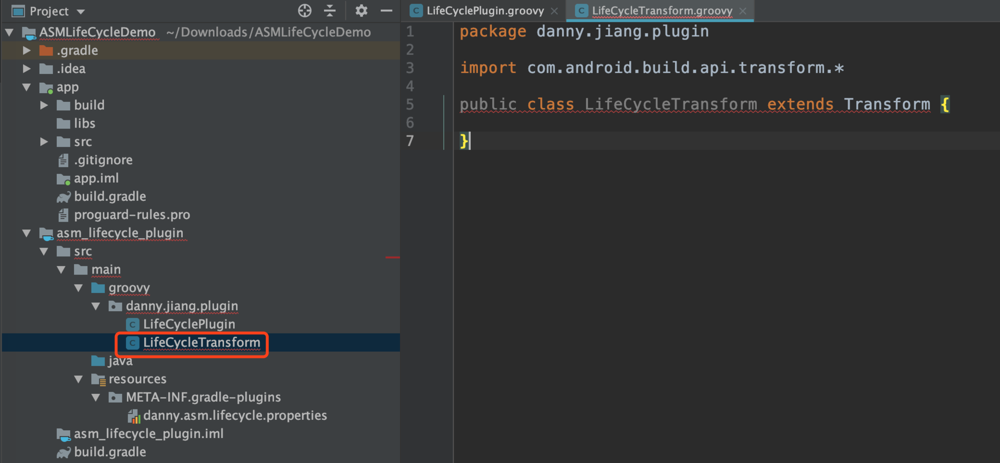

可以看到，LifeCycleTransform 需要实现抽象类 Transform 中的抽象方法，具体有如下几个方法需要实现：

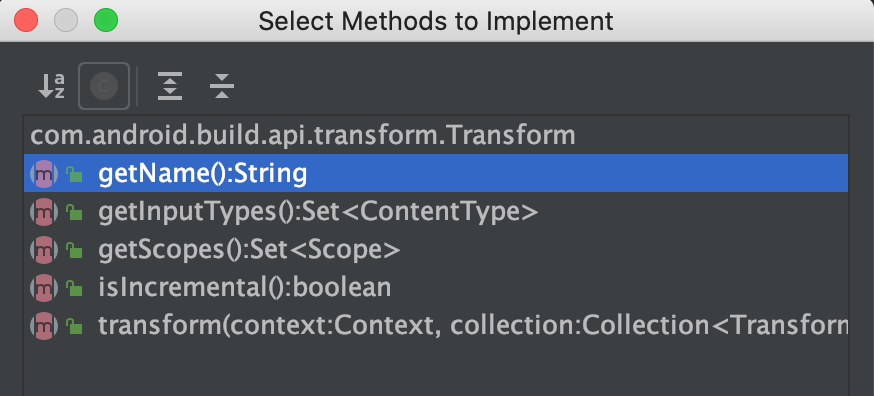

解释说明：Transform 主要作用是检索项目编译过程中的所有文件。通过这几个方法，我们可以对自定义 Transform 设置一些遍历规则，具体如下：

**getName：**

设置我们自定义的 Transform 对应的 Task 名称。Gradle 在编译的时候，会将这个名称显示在控制台上。比如：Task :app:transformClassesWithXXXForDebug。

**getInputType：**

在项目中会有各种各样格式的文件，通过 getInputType 可以设置 LifeCycleTransform 接收的文件类型，此方法返回的类型是 Set<QualifiedContent.ContentType> 集合。

ContentType 有以下 2 种取值。


1. CLASSES：代表只检索 .class 文件；

2. RESOURCES：代表检索 java 标准资源文件。

**getScopes()**

这个方法规定自定义 Transform 检索的范围，具体有以下几种取值：


**isIncremental()** 

表示当前 Transform 是否支持增量编译，我们不需要增量编译，所以直接返回 false 即可。

**transform()**

在 自定义Transform 中最重要的方法就是 transform()。在这个方法中，可以获取到两个数据的流向。

- inputs：inputs 中是传过来的输入流，其中有两种格式，一种是 jar 包格式，一种是 directory（目录格式）。

- outputProvider：outputProvider 获取到输出目录，最后将修改的文件复制到输出目录，这一步必须做，否则编译会报错。


我们可以实现一个简易 LifeCycleTransform，功能是打印出所有 .class 文件。代码如下：

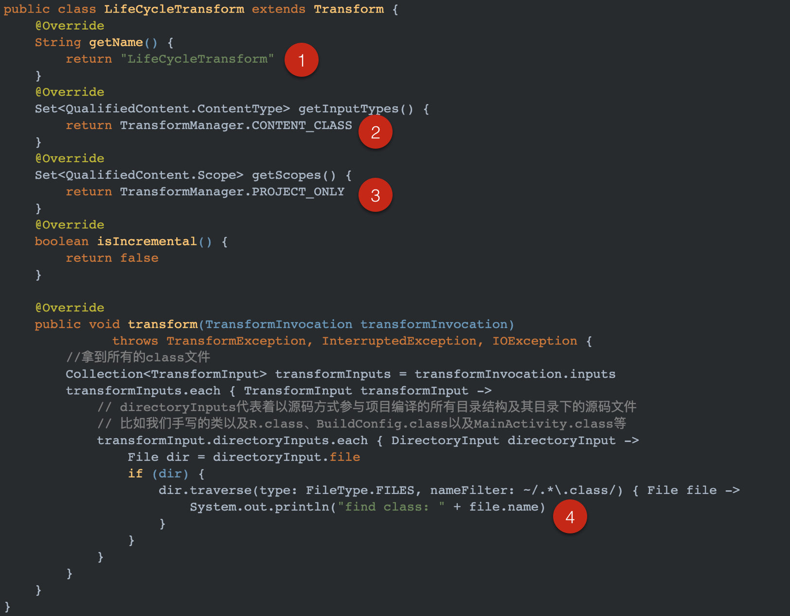

**注：nameFilter: 后面是~,而不是-。**

解释说明：

1. 自定义的 Transform 名称为 LifeCycleTransform；

2. 检索项目中 .class 类型的目录或者文件；

3. 设置当前 Transform 检索范围为当前项目；

4. 设置过滤文件为 .class 文件（去除文件夹类型），并打印文件名称。

#### 将自定义的 LifeCycleTransform 注册到 Gradle 插件中

在 LifeCyclePlugin 中添加如下代码：


再次在命令行中执行 build 命令，可以看到 LifeCycleTransform 检索出的所有 .class 文件。

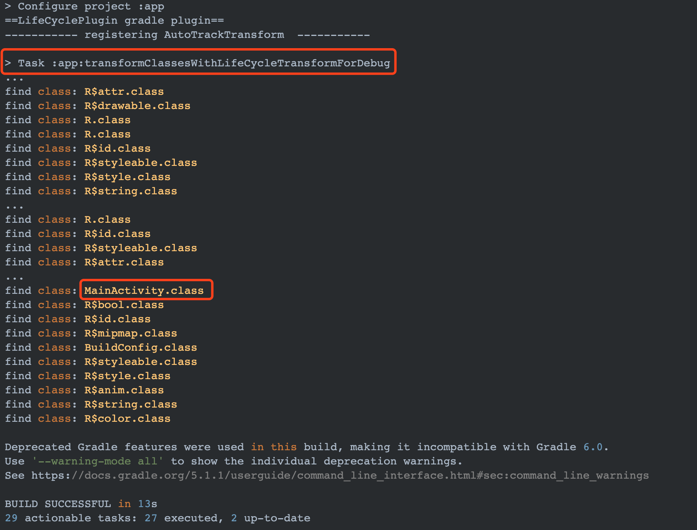

从图中可以看出，Gradle 编译时多了一个我们自定义的 LifeCycleTransform 类型的任务，并且将所有 .class 文件名打印出来，其中包含了我们需要的目标文件 MainActivity.class。

**注：这一步需要Run的时候看效果**

**特别说明：在每次改动了Plugin插件后，尽量rebuild下项目，然后再进行相关操作，避免出现一些奇怪的问题**

### 使用 ASM，插入字节码到 Activity 文件

ASM 是一套开源框架，其中几个常用的 API 如下：

- ClassReader：负责解析 .class 文件中的字节码，并将所有字节码传递给 ClassWriter。

- ClassVisitor：负责访问 .class 文件中各个元素，之前学习了 .class 的文件结构，ClassVisitor 就是用来解析这些文件结构的，当解析到某些特定结构时（比如类变量、方法），它会自动调用内部相应的 FieldVisitor 或者 MethodVisitor 的方法，进一步解析或者修改 .class 文件内容。

- ClassWriter：继承自 ClassVisitor，它是生成字节码的工具类，负责将修改后的字节码输出为 byte 数组。


#### 添加 ASM 依赖

在 asm_lifecycle_plugin 的 build.gradle 中，添加对 ASM 的依赖，如下：

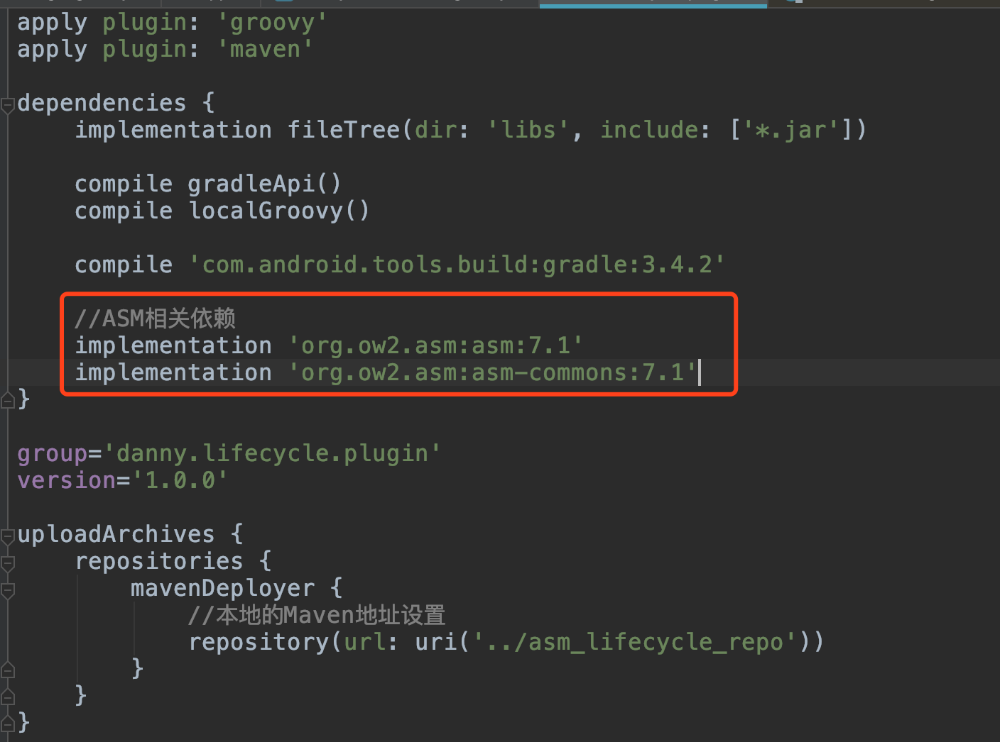

#### 创建自定义 ASM Visitor 类

在 asm_lifecycle_plugin module 中的 src/main/java 目录下创建包 asm，并分别创建 LifecycleClassVisitor.java 和 LifecycleMethodVisitor.java。代码如下：

#### LifecycleClassVisitor.java

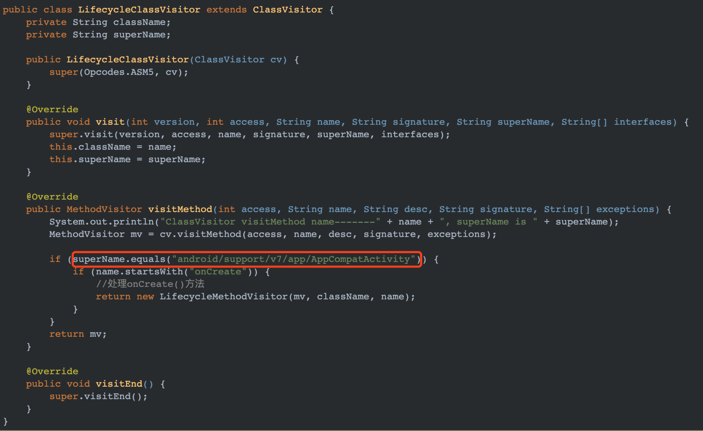

红框中，在 visitMethod 方法中，过滤出继承自 AppCompatActivity 的文件，并在 LifeCycleMethodVisitor.java 中对 onCreate 进行改造。

这里需要注意，如果使用的androidx中的AppCompatActivity，那AppCompatActivity的包名就变了，因此在ClassVisitor中，判断条件也要更改，如下：

...

#### LifeCycleMethodVisitor.java

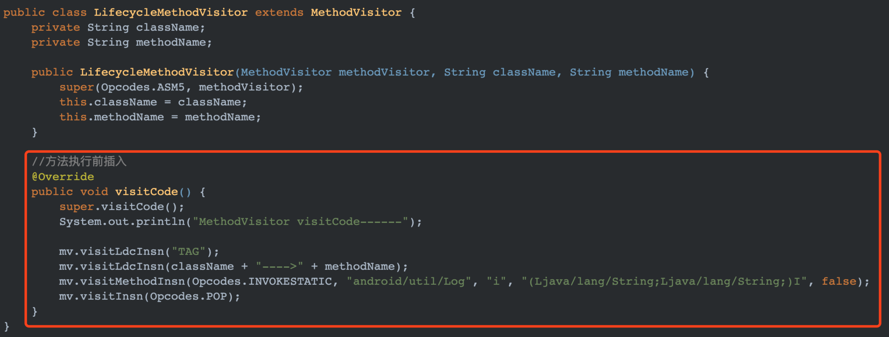

图中红框内是真正执行插入字节码的逻辑。可以看出 ASM 都是直接以字节码指令的方式进行操作的，所以如果想使用 ASM，需要程序员对字节码有一定的理解。如果对字节码不是很了解，也可以借助三方工具 ASM Bytecode Outline 来生成想要的字节码。

#### 修改 LifeCycleTransform 的 transform 方法，使用 ASM

各种 Visitor 都定义好之后，我们就可以修改 LifeCycleTransform 的 transform 方法，并将需要插桩的字节码插入到 MainActivity.class 文件中：

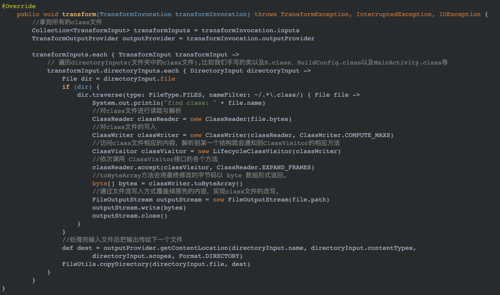

**注（这种情况复习的时候可以先不看，有空再深究，只是在此提示一下）**：这里如果使用了3.6.0以上的Gradle，可能会出现ClassNotFound的问题(gradle 3.6.0以上R类不会转为.class文件而会转成jar，因此在Transform实现中需要单独拷贝，`TransformInvocation.inputs.jarInputs`)。下面记录两种解决方案（但我试了一下，没有解决掉，现在使用的是Gradle3.4.2）：

```
 transformInput.jarInputs.forEach {
            it.file.copyTo(
                info.outputProvider.getContentLocation(it.name, inputTypes, scopes, Format.JAR),
                overwrite = true
            )
        }
```

或者：

```
transformInput.jarInputs.each { JarInput jarInput ->
                File file = jarInput.file
                System.out.println("find jar input: " + file.name)
                def dest = outputProvider.getContentLocation(jarInput.name,
                        jarInput.contentTypes,
                        jarInput.scopes, Format.JAR)
                FileUtils.copyFile(file, dest)
            }
```

#### 重新部署自定义 Gradle 插件，并运行主项目

上面几步如果一切执行顺利，那接下来就可以在点击 uploadArchives 重新部署 LifeCyclePlugin。

> 注意：重新部署时，需要先在 app module 的 build.gradle 中将插件依赖注释，否则报错。

部署成功之后，重新在 app 中依赖自定义插件并运行主项目，当 MainActivity 被打开时，会在 logcat 中看到如下日志：


后续如果我们有新的 Activity，比如新建一个 MainActivity2.java 如下：


然后在 MainActivity 中设置点击事件跳转到 MainActivity2中：


那么 Logcat 中的日志如下：


虽然我们在 MainActivity 和 MainActivity2中并没有添加任何 log 日志逻辑，但是在编译期间，自定义的 LifeCyclePlugin 会自动为每一个 Activity 的 onCreate 方法中添加 log 日志逻辑。

> 如果在项目中打开了混淆，那注入的字节码还会正常 work 吗？ 无需担心，因为混淆其实也是一个 Transform，叫作 ProguardTransform，它是在自定义的 Transform 之后执行。

### 总结

本文主要通过一个 Demo，学习了编译插桩的流程。期间涉及了几个知识点：

- Android APK 打包编译过程；

- 自定义 Gradle 插件；

- Transform API 的使用；

- ASM 的使用。


本文是对编译插桩的一个入门，上面的知识点还没有做深入分析。并且使用也不熟练，还需要多巩固，然后加深对原理的掌握程度。

最后，放一句姜新星老师的话，所言极是：

> **对技术的追求不能仅仅停留在会用 API，会写基本功能上，要想在技术上有更高的造诣，就需要深入到原理层面去认识代码运行的机制。**