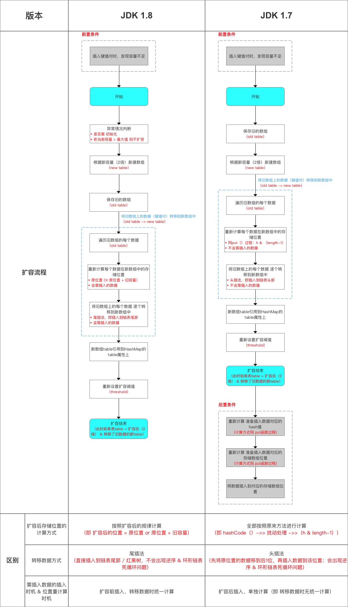
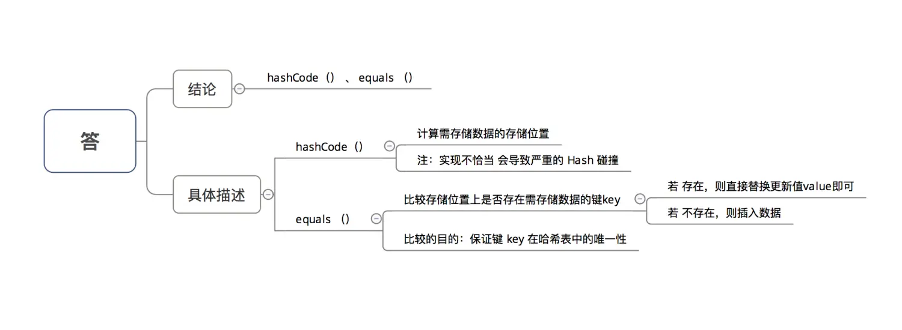
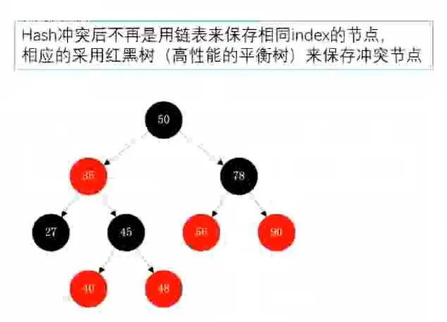

# 目录


## 数组、顺序表、链表简单介绍

1.1、首先得了解一下
[数组的优缺点](https://blog.csdn.net/qq_29224201/article/details/103130896)

1.2、为了实现数组的动态添加与删除，出现了顺序表


1.3、为了避免数组添加、删除效率低等缺点，出现了链表


1.4、数组、顺序表、链表的发展


1.5、顺序表与链表的对比


1.6、Hash表的出现


# 1. HashMap简介

- 类定义

```java
public class HashMap<K,V>
         extends AbstractMap<K,V> 
         implements Map<K,V>, Cloneable, Serializable
```

- 主要简介


## Hash结构/原理图简介

Java 7：


# 2. 数据结构：引入了 红黑树

### 2.1 主要介绍


> 关于 红黑树 的简介


> 更加具体的了解，请：[点击阅读文章](https://links.jianshu.com/go?to=http%3A%2F%2Fblog.csdn.net%2Fv_july_v%2Farticle%2Fdetails%2F6105630)

### 2.2 存储流程

> 注：为了让大家有个感性的认识，只是简单的画出存储流程，更加详细 & 具体的存储流程会在下面源码分析中给出


### 2.3 数组元素 & 链表节点的 实现类

- `HashMap`中的数组元素 & 链表节点  采用 `Node`类 实现

> 与 `JDK 1.7` 的对比（`Entry`类），仅仅只是换了名字

- 该类的源码分析如下

```java
/** 
  * Node  = HashMap的内部类，实现了Map.Entry接口，本质是 = 一个映射(键值对)
  * 实现了getKey()、getValue()、equals(Object o)和hashCode()等方法
  **/
  static class Node<K,V> implements Map.Entry<K,V> {

        final int hash; // 哈希值，HashMap根据该值确定记录的位置
        final K key; // key
        V value; // value
        Node<K,V> next;// 链表下一个节点

        // 构造方法
        Node(int hash, K key, V value, Node<K,V> next) {
            this.hash = hash;
            this.key = key;
            this.value = value;
            this.next = next;
        }
        
        public final K getKey()        { return key; }   // 返回 与 此项 对应的键
        public final V getValue()      { return value; } // 返回 与 此项 对应的值
        public final String toString() { return key + "=" + value; }

        public final V setValue(V newValue) {
            V oldValue = value;
            value = newValue;
            return oldValue;
        }

      /** 
        * hashCode（） 
        */
        public final int hashCode() {
            return Objects.hashCode(key) ^ Objects.hashCode(value);
        }

      /** 
        * equals（）
        * 作用：判断2个Entry是否相等，必须key和value都相等，才返回true  
        */
        public final boolean equals(Object o) {
            if (o == this)
                return true;
            if (o instanceof Map.Entry) {
                Map.Entry<?,?> e = (Map.Entry<?,?>)o;
                if (Objects.equals(key, e.getKey()) &&
                    Objects.equals(value, e.getValue()))
                    return true;
            }
            return false;
        }
    }
```

### 2.4 红黑树节点 实现类

- `HashMap`中的红黑树节点 采用 `TreeNode` 类 实现

```java
 /**
  * 红黑树节点 实现类：继承自LinkedHashMap.Entry<K,V>类
  */
  static final class TreeNode<K,V> extends LinkedHashMap.Entry<K,V> {  

    // 属性 = 父节点、左子树、右子树、删除辅助节点 + 颜色
    TreeNode<K,V> parent;  
    TreeNode<K,V> left;   
    TreeNode<K,V> right;
    TreeNode<K,V> prev;   
    boolean red;   

    // 构造函数
    TreeNode(int hash, K key, V val, Node<K,V> next) {  
        super(hash, key, val, next);  
    }

    // 返回当前节点的根节点  
    final TreeNode<K,V> root() {  
        for (TreeNode<K,V> r = this, p;;) {  
            if ((p = r.parent) == null)  
                return r;  
            r = p;
        }  
    }
```

# 3. 具体使用

### 3.1 主要使用API（方法、函数）

> 与 `JDK 1.7` 基本相同

```java
V get(Object key); // 获得指定键的值
V put(K key, V value);  // 添加键值对
void putAll(Map<? extends K, ? extends V> m);  // 将指定Map中的键值对 复制到 此Map中
V remove(Object key);  // 删除该键值对

boolean containsKey(Object key); // 判断是否存在该键的键值对；是 则返回true
boolean containsValue(Object value);  // 判断是否存在该值的键值对；是 则返回true
 
Set<K> keySet();  // 单独抽取key序列，将所有key生成一个Set
Collection<V> values();  // 单独value序列，将所有value生成一个Collection

void clear(); // 清除哈希表中的所有键值对
int size();  // 返回哈希表中所有 键值对的数量 = 数组中的键值对 + 链表中的键值对
boolean isEmpty(); // 判断HashMap是否为空；size == 0时 表示为 空 
```

### 3.2 使用流程

> 与 `JDK 1.7` 基本相同

- 在具体使用时，主要流程是：

1. 声明1个 `HashMap`的对象
2. 向 `HashMap` 添加数据（成对 放入 键 - 值对）
3. 获取 `HashMap` 的某个数据
4. 获取 `HashMap` 的全部数据：遍历`HashMap`

- 示例代码

```dart
import java.util.Collection;
import java.util.HashMap;
import java.util.Iterator;
import java.util.Map;
import java.util.Set;

public class HashMapTest {

    public static void main(String[] args) {
      /**
        * 1. 声明1个 HashMap的对象
        */
        Map<String, Integer> map = new HashMap<String, Integer>();

      /**
        * 2. 向HashMap添加数据（成对 放入 键 - 值对）
        */
        map.put("Android", 1);
        map.put("Java", 2);
        map.put("iOS", 3);
        map.put("数据挖掘", 4);
        map.put("产品经理", 5);

       /**
        * 3. 获取 HashMap 的某个数据
        */
        System.out.println("key = 产品经理时的值为：" + map.get("产品经理"));

      /**
        * 4. 获取 HashMap 的全部数据：遍历HashMap
        * 核心思想：
        * 步骤1：获得key-value对（Entry） 或 key 或 value的Set集合
        * 步骤2：遍历上述Set集合(使用for循环 、 迭代器（Iterator）均可)
        * 方法共有3种：分别针对 key-value对（Entry） 或 key 或 value
        */

        // 方法1：获得key-value的Set集合 再遍历
        System.out.println("方法1");
        // 1. 获得key-value对（Entry）的Set集合
        Set<Map.Entry<String, Integer>> entrySet = map.entrySet();

        // 2. 遍历Set集合，从而获取key-value
        // 2.1 通过for循环
        for(Map.Entry<String, Integer> entry : entrySet){
            System.out.print(entry.getKey());
            System.out.println(entry.getValue());
        }
        System.out.println("----------");
        // 2.2 通过迭代器：先获得key-value对（Entry）的Iterator，再循环遍历
        Iterator iter1 = entrySet.iterator();
        while (iter1.hasNext()) {
            // 遍历时，需先获取entry，再分别获取key、value
            Map.Entry entry = (Map.Entry) iter1.next();
            System.out.print((String) entry.getKey());
            System.out.println((Integer) entry.getValue());
        }


        // 方法2：获得key的Set集合 再遍历
        System.out.println("方法2");

        // 1. 获得key的Set集合
        Set<String> keySet = map.keySet();

        // 2. 遍历Set集合，从而获取key，再获取value
        // 2.1 通过for循环
        for(String key : keySet){
            System.out.print(key);
            System.out.println(map.get(key));
        }

        System.out.println("----------");

        // 2.2 通过迭代器：先获得key的Iterator，再循环遍历
        Iterator iter2 = keySet.iterator();
        String key = null;
        while (iter2.hasNext()) {
            key = (String)iter2.next();
            System.out.print(key);
            System.out.println(map.get(key));
        }


        // 方法3：获得value的Set集合 再遍历
        System.out.println("方法3");

        // 1. 获得value的Set集合
        Collection valueSet = map.values();

        // 2. 遍历Set集合，从而获取value
        // 2.1 获得values 的Iterator
        Iterator iter3 = valueSet.iterator();
        // 2.2 通过遍历，直接获取value
        while (iter3.hasNext()) {
            System.out.println(iter3.next());
        }

    }
}

// 注：对于遍历方式，推荐使用针对 key-value对（Entry）的方式：效率高
// 原因：
   // 1. 对于 遍历keySet 、valueSet，实质上 = 遍历了2次：1 = 转为 iterator 迭代器遍历、2 = 从 HashMap 中取出 key 的 value 操作（通过 key 值 hashCode 和 equals 索引）
   // 2. 对于 遍历 entrySet ，实质 = 遍历了1次 = 获取存储实体Entry（存储了key 和 value ）
```

- 运行结果

```undefined
方法1
Java2
iOS3
数据挖掘4
Android1
产品经理5
----------
Java2
iOS3
数据挖掘4
Android1
产品经理5
方法2
Java2
iOS3
数据挖掘4
Android1
产品经理5
----------
Java2
iOS3
数据挖掘4
Android1
产品经理5
方法3
2
3
4
1
5
```

下面，我们按照上述的使用过程，对一个个步骤进行源码解析

# 4. 基础知识：HashMap中的重要参数（变量）

- 在进行真正的源码分析前，先讲解`HashMap`中的重要参数（变量）
- `HashMap`中的主要参数 同  `JDK 1.7` ，即：容量、加载因子、扩容阈值
- 但由于数据结构中引入了 红黑树，故加入了 **与红黑树相关的参数**。具体介绍如下：

```java
 /** 
   * 主要参数 同  JDK 1.7 
   * 即：容量、加载因子、扩容阈值（要求、范围均相同）
   */

  // 1. 容量（capacity）： 必须是2的幂 & <最大容量（2的30次方）
  static final int DEFAULT_INITIAL_CAPACITY = 1 << 4; // 默认容量 = 16 = 1<<4 = 00001中的1向左移4位 = 10000 = 十进制的2^4=16
  static final int MAXIMUM_CAPACITY = 1 << 30; // 最大容量 =  2的30次方（若传入的容量过大，将被最大值替换）

  // 2. 加载因子(Load factor)：HashMap在其容量自动增加前可达到多满的一种尺度 
  final float loadFactor; // 实际加载因子
  static final float DEFAULT_LOAD_FACTOR = 0.75f; // 默认加载因子 = 0.75

  // 3. 扩容阈值（threshold）：当哈希表的大小 ≥ 扩容阈值时，就会扩容哈希表（即扩充HashMap的容量） 
  // a. 扩容 = 对哈希表进行resize操作（即重建内部数据结构），从而哈希表将具有大约两倍的桶数
  // b. 扩容阈值 = 容量 x 加载因子
  int threshold;

  // 4. 其他
  transient Node<K,V>[] table;  // 存储数据的Node类型 数组，长度 = 2的幂；数组的每个元素 = 1个单链表
  transient int size;// HashMap的大小，即 HashMap中存储的键值对的数量
 

  /** 
   * 与红黑树相关的参数
   */
   // 1. 桶的树化阈值：即 链表转成红黑树的阈值，在存储数据时，当链表长度 > 该值时，则将链表转换成红黑树
   static final int TREEIFY_THRESHOLD = 8; 
   // 2. 桶的链表还原阈值：即 红黑树转为链表的阈值，当在扩容（resize（））时（此时HashMap的数据存储位置会重新计算），在重新计算存储位置后，当原有的红黑树内数量 < 6时，则将 红黑树转换成链表
   static final int UNTREEIFY_THRESHOLD = 6;
   // 3. 最小树形化容量阈值：即 当哈希表中的容量 > 该值时，才允许树形化链表 （即 将链表 转换成红黑树）
   // 否则，若桶内元素太多时，则直接扩容，而不是树形化
   // 为了避免进行扩容、树形化选择的冲突，这个值不能小于 4 * TREEIFY_THRESHOLD
   static final int MIN_TREEIFY_CAPACITY = 64;
  
```

- 此处 再次详细说明 加载因子

> 同 `JDK 1.7`，但由于其重要性，故此处再次说明


- 总结 数据结构 & 参数方面与 `JDK 1.7`的区别


# 5. 源码分析

- 本次的源码分析主要是根据 **使用步骤** 进行相关函数的详细分析
- 主要分析内容如下：


- 下面，我将对每个步骤内容的主要方法进行详细分析

### 步骤1：声明1个 HashMap的对象

> 此处主要分析的构造函数 类似 `JDK 1.7`

```dart
/**
  * 函数使用原型
  */
  Map<String,Integer> map = new HashMap<String,Integer>();

 /**
   * 源码分析：主要是HashMap的构造函数 = 4个
   * 仅贴出关于HashMap构造函数的源码
   */

public class HashMap<K,V>
    extends AbstractMap<K,V>
    implements Map<K,V>, Cloneable, Serializable{

    // 省略上节阐述的参数
    
  /**
     * 构造函数1：默认构造函数（无参）
     * 加载因子 & 容量 = 默认 = 0.75、16
     */
    public HashMap() {
        this.loadFactor = DEFAULT_LOAD_FACTOR;
    }

    /**
     * 构造函数2：指定“容量大小”的构造函数
     * 加载因子 = 默认 = 0.75 、容量 = 指定大小
     */
    public HashMap(int initialCapacity) {
        // 实际上是调用指定“容量大小”和“加载因子”的构造函数
        // 只是在传入的加载因子参数 = 默认加载因子
        this(initialCapacity, DEFAULT_LOAD_FACTOR);
    }

    /**
     * 构造函数3：指定“容量大小”和“加载因子”的构造函数
     * 加载因子 & 容量 = 自己指定
     */
    public HashMap(int initialCapacity, float loadFactor) {

        // 指定初始容量必须非负，否则报错  
         if (initialCapacity < 0)  
           throw new IllegalArgumentException("Illegal initial capacity: " +  
                                           initialCapacity); 

        // HashMap的最大容量只能是MAXIMUM_CAPACITY，哪怕传入的 > 最大容量
        if (initialCapacity > MAXIMUM_CAPACITY)
            initialCapacity = MAXIMUM_CAPACITY;

        // 加载因子 必须为正  
        if (loadFactor <= 0 || Float.isNaN(loadFactor))  
            throw new IllegalArgumentException("Illegal load factor: " +  
                                           loadFactor);  
        // 设置 加载因子
        this.loadFactor = loadFactor;

        // 设置 扩容阈值
        // 注：此处不是真正的阈值，仅仅只是将传入的容量大小转化为：>传入容量大小的最小的2的幂，该阈值后面会重新计算
        // 下面会详细讲解 ->> 分析1
        this.threshold = tableSizeFor(initialCapacity); 

    }

    /**
     * 构造函数4：包含“子Map”的构造函数
     * 即 构造出来的HashMap包含传入Map的映射关系
     * 加载因子 & 容量 = 默认
     */
    public HashMap(Map<? extends K, ? extends V> m) {

        // 设置容量大小 & 加载因子 = 默认
        this.loadFactor = DEFAULT_LOAD_FACTOR; 

        // 将传入的子Map中的全部元素逐个添加到HashMap中
        putMapEntries(m, false); 
    }
}

   /**
     * 分析1：tableSizeFor(initialCapacity)
     * 作用：将传入的容量大小转化为：>传入容量大小的最小的2的幂
     * 与JDK 1.7对比：类似于JDK 1.7 中 inflateTable()里的 roundUpToPowerOf2(toSize)
     */
    static final int tableSizeFor(int cap) {
     int n = cap - 1;
     n |= n >>> 1;
     n |= n >>> 2;
     n |= n >>> 4;
     n |= n >>> 8;
     n |= n >>> 16;
     return (n < 0) ? 1 : (n >= MAXIMUM_CAPACITY) ? MAXIMUM_CAPACITY : n + 1;
}
```

- 注：（同JDK 1.7类似）

  1. 此处仅用于接收初始容量大小（`capacity`）、加载因子(`Load factor`)，但仍无真正初始化哈希表，即初始化存储数组`table`
  2. 此处先给出结论：**真正初始化哈希表（初始化存储数组`table`）是在第1次添加键值对时，即第1次调用`put（）`时。下面会详细说明**

### 步骤2：向HashMap添加数据（成对 放入 键 - 值对）

- 在该步骤中，与`JDK 1.7`的差别较大：


> 下面会对上述区别进行详细讲解

- 添加数据的流程如下

> 注：为了让大家有个感性的认识，只是简单的画出存储流程，更加详细 & 具体的存储流程会在下面源码分析中给出


- 源码分析

```cpp
 /**
   * 函数使用原型
   */
   map.put("Android", 1);
        map.put("Java", 2);
        map.put("iOS", 3);
        map.put("数据挖掘", 4);
        map.put("产品经理", 5);

   /**
     * 源码分析：主要分析HashMap的put函数
     */
    public V put(K key, V value) {
        // 1. 对传入数组的键Key计算Hash值 ->>分析1
        // 2. 再调用putVal（）添加数据进去 ->>分析2
        return putVal(hash(key), key, value, false, true);
    }
```

下面，将详细讲解 上面的2个主要分析点

#### 分析1：hash（key）

```dart
   /**
     * 分析1：hash(key)
     * 作用：计算传入数据的哈希码（哈希值、Hash值）
     * 该函数在JDK 1.7 和 1.8 中的实现不同，但原理一样 = 扰动函数 = 使得根据key生成的哈希码（hash值）分布更加均匀、更具备随机性，避免出现hash值冲突（即指不同key但生成同1个hash值）
     * JDK 1.7 做了9次扰动处理 = 4次位运算 + 5次异或运算
     * JDK 1.8 简化了扰动函数 = 只做了2次扰动 = 1次位运算 + 1次异或运算
     */

      // JDK 1.7实现：将 键key 转换成 哈希码（hash值）操作  = 使用hashCode() + 4次位运算 + 5次异或运算（9次扰动）
      static final int hash(int h) {
        h ^= k.hashCode(); 
        h ^= (h >>> 20) ^ (h >>> 12);
        return h ^ (h >>> 7) ^ (h >>> 4);
     }

      // JDK 1.8实现：将 键key 转换成 哈希码（hash值）操作 = 使用hashCode() + 1次位运算 + 1次异或运算（2次扰动）
      // 1. 取hashCode值： h = key.hashCode() 
      // 2. 高位参与低位的运算：h ^ (h >>> 16)  
      static final int hash(Object key) {
           int h;
            return (key == null) ? 0 : (h = key.hashCode()) ^ (h >>> 16);
            // a. 当key = null时，hash值 = 0，所以HashMap的key 可为null      
            // 注：对比HashTable，HashTable对key直接hashCode（），若key为null时，会抛出异常，所以HashTable的key不可为null
            // b. 当key ≠ null时，则通过先计算出 key的 hashCode()（记为h），然后 对哈希码进行 扰动处理： 按位 异或（^） 哈希码自身右移16位后的二进制
     }

   /**
     * 计算存储位置的函数分析：indexFor(hash, table.length)
     * 注：该函数仅存在于JDK 1.7 ，JDK 1.8中实际上无该函数（直接用1条语句判断写出），但原理相同
     * 为了方便讲解，故提前到此讲解
     */
     static int indexFor(int h, int length) {  
          return h & (length-1); 
          // 将对哈希码扰动处理后的结果 与运算(&) （数组长度-1），最终得到存储在数组table的位置（即数组下标、索引）
          }
```

- 总结 计算存放在数组 table 中的位置（即数组下标、索引）的过程

> 1. 此处与 `JDK 1.7`的区别在于：`hash`值的求解过程中 哈希码的二次处理方式（扰动处理）
> 2. 步骤1、2 =  `hash`值的求解过程


- 计算示意图


在了解 如何计算存放数组`table` 中的位置 后，所谓 **知其然 而 需知其所以然**，下面我将讲解为什么要这样计算，即主要解答以下3个问题：

1. 为什么不直接采用经过`hashCode（）`处理的哈希码 作为 存储数组`table`的下标位置？
2. 为什么采用 哈希码 **与运算(&)** （数组长度-1） 计算数组下标？
3. 为什么在计算数组下标前，需对哈希码进行二次处理：扰动处理？

在回答这3个问题前，请大家记住一个核心思想：

> **所有处理的根本目的，都是为了提高 存储`key-value`的数组下标位置 的随机性 & 分布均匀性，尽量避免出现hash值冲突**。即：对于不同`key`，存储的数组下标位置要尽可能不一样

##### 问题1：为什么不直接采用经过hashCode（）处理的哈希码 作为 存储数组table的下标位置？

- 结论：容易出现 哈希码 与 数组大小范围不匹配的情况，即 计算出来的哈希码可能 不在数组大小范围内，从而导致无法匹配存储位置
- 原因描述


- 为了解决 “哈希码与数组大小范围不匹配” 的问题，`HashMap`给出了解决方案：**哈希码 与运算（&） （数组长度-1）**，即问题2

##### 问题2：为什么采用 哈希码 与运算(&) （数组长度-1） 计算数组下标？

- 结论：根据HashMap的容量大小（数组长度），按需取 哈希码一定数量的低位 作为存储的数组下标位置，从而 解决 “哈希码与数组大小范围不匹配” 的问题
- 具体解决方案描述


##### 问题3：为什么在计算数组下标前，需对哈希码进行二次处理：扰动处理？

- 结论：加大哈希码低位的随机性，使得分布更均匀，从而提高对应数组存储下标位置的随机性 & 均匀性，最终减少Hash冲突
- 具体描述


至此，关于怎么计算 `key-value` 值存储在`HashMap`数组位置 & 为什么要这么计算，讲解完毕。

#### 分析2：putVal(hash(key), key, value, false, true);

此处有2个主要讲解点：

- 计算完存储位置后，具体该如何 存放数据 到哈希表中
- 具体如何扩容，即 **扩容机制**

##### 主要讲解点1：计算完存储位置后，具体该如何存放数据到哈希表中

由于数据结构中加入了红黑树，所以在存放数据到哈希表中时，需进行多次数据结构的判断：**数组、红黑树、链表**

> 与 `JDK 1.7`的区别： `JDK 1.7`只需判断 数组 & 链表


```csharp
   /**
     * 分析2：putVal(hash(key), key, value, false, true)
     */
     final V putVal(int hash, K key, V value, boolean onlyIfAbsent,
               boolean evict) {

            Node<K,V>[] tab; Node<K,V> p; int n, i;

        // 1. 若哈希表的数组tab为空，则 通过resize() 创建
        // 所以，初始化哈希表的时机 = 第1次调用put函数时，即调用resize() 初始化创建
        // 关于resize（）的源码分析将在下面讲解扩容时详细分析，此处先跳过
        if ((tab = table) == null || (n = tab.length) == 0)
        n = (tab = resize()).length;

        // 2. 计算插入存储的数组索引i：根据键值key计算的hash值 得到
        // 此处的数组下标计算方式 = i = (n - 1) & hash，同JDK 1.7中的indexFor（），上面已详细描述

        // 3. 插入时，需判断是否存在Hash冲突：
        // 若不存在（即当前table[i] == null），则直接在该数组位置新建节点，插入完毕
        // 否则，代表存在Hash冲突，即当前存储位置已存在节点，则依次往下判断：a. 当前位置的key是否与需插入的key相同、b. 判断需插入的数据结构是否为红黑树 or 链表
        if ((p = tab[i = (n - 1) & hash]) == null)
        tab[i] = newNode(hash, key, value, null);  // newNode(hash, key, value, null)的源码 = new Node<>(hash, key, value, next)

    else {
        Node<K,V> e; K k;

        // a. 判断 table[i]的元素的key是否与 需插入的key一样，若相同则 直接用新value 覆盖 旧value
        // 判断原则：equals（）
        if (p.hash == hash &&
            ((k = p.key) == key || (key != null && key.equals(k))))
            e = p;

        // b. 继续判断：需插入的数据结构是否为红黑树 or 链表
        // 若是红黑树，则直接在树中插入 or 更新键值对
        else if (p instanceof TreeNode)
            e = ((TreeNode<K,V>)p).putTreeVal(this, tab, hash, key, value); ->>分析3

        // 若是链表,则在链表中插入 or 更新键值对
        // i.  遍历table[i]，判断Key是否已存在：采用equals（） 对比当前遍历节点的key 与 需插入数据的key：若已存在，则直接用新value 覆盖 旧value
        // ii. 遍历完毕后仍无发现上述情况，则直接在链表尾部插入数据
        // 注：新增节点后，需判断链表长度是否>8（8 = 桶的树化阈值）：若是，则把链表转换为红黑树
        
        else {
            for (int binCount = 0; ; ++binCount) {
                // 对于ii：若数组的下1个位置，表示已到表尾也没有找到key值相同节点，则新建节点 = 插入节点
                // 注：此处是从链表尾插入，与JDK 1.7不同（从链表头插入，即永远都是添加到数组的位置，原来数组位置的数据则往后移）
                if ((e = p.next) == null) {
                    p.next = newNode(hash, key, value, null);

                    // 插入节点后，若链表节点>数阈值，则将链表转换为红黑树
                    if (binCount >= TREEIFY_THRESHOLD - 1) 
                        treeifyBin(tab, hash); // 树化操作
                    break;
                }

                // 对于i
                if (e.hash == hash &&
                    ((k = e.key) == key || (key != null && key.equals(k))))
                    break;

                // 更新p指向下一个节点，继续遍历
                p = e;
            }
        }

        // 对i情况的后续操作：发现key已存在，直接用新value 覆盖 旧value & 返回旧value
        if (e != null) { 
            V oldValue = e.value;
            if (!onlyIfAbsent || oldValue == null)
                e.value = value;
            afterNodeAccess(e); // 替换旧值时会调用的方法（默认实现为空）
            return oldValue;
        }
    }

    ++modCount;

    // 插入成功后，判断实际存在的键值对数量size > 最大容量threshold
    // 若 > ，则进行扩容 ->>分析4（但单独讲解，请直接跳出该代码块）
    if (++size > threshold)
        resize();

    afterNodeInsertion(evict);// 插入成功时会调用的方法（默认实现为空）
    return null;

}

    /**
     * 分析3：putTreeVal(this, tab, hash, key, value)
     * 作用：向红黑树插入 or 更新数据（键值对）
     * 过程：遍历红黑树判断该节点的key是否与需插入的key 相同：
     *      a. 若相同，则新value覆盖旧value
     *      b. 若不相同，则插入
     */

     final TreeNode<K,V> putTreeVal(HashMap<K,V> map, Node<K,V>[] tab,
                                       int h, K k, V v) {
            Class<?> kc = null;
            boolean searched = false;
            TreeNode<K,V> root = (parent != null) ? root() : this;
            for (TreeNode<K,V> p = root;;) {
                int dir, ph; K pk;
                if ((ph = p.hash) > h)
                    dir = -1;
                else if (ph < h)
                    dir = 1;
                else if ((pk = p.key) == k || (k != null && k.equals(pk)))
                    return p;
                else if ((kc == null &&
                          (kc = comparableClassFor(k)) == null) ||
                         (dir = compareComparables(kc, k, pk)) == 0) {
                    if (!searched) {
                        TreeNode<K,V> q, ch;
                        searched = true;
                        if (((ch = p.left) != null &&
                             (q = ch.find(h, k, kc)) != null) ||
                            ((ch = p.right) != null &&
                             (q = ch.find(h, k, kc)) != null))
                            return q;
                    }
                    dir = tieBreakOrder(k, pk);
                }

                TreeNode<K,V> xp = p;
                if ((p = (dir <= 0) ? p.left : p.right) == null) {
                    Node<K,V> xpn = xp.next;
                    TreeNode<K,V> x = map.newTreeNode(h, k, v, xpn);
                    if (dir <= 0)
                        xp.left = x;
                    else
                        xp.right = x;
                    xp.next = x;
                    x.parent = x.prev = xp;
                    if (xpn != null)
                        ((TreeNode<K,V>)xpn).prev = x;
                    moveRootToFront(tab, balanceInsertion(root, x));
                    return null;
                }
            }
        }
```

- 总结


##### 主要讲解点2：扩容机制（即 resize（）函数方法）

- 扩容流程如下


- 源码分析

```java
   /**
     * 分析4：resize（）
     * 该函数有2种使用情况：1.初始化哈希表 2.当前数组容量过小，需扩容
     */
   final Node<K,V>[] resize() {
    Node<K,V>[] oldTab = table; // 扩容前的数组（当前数组）
    int oldCap = (oldTab == null) ? 0 : oldTab.length; // 扩容前的数组的容量 = 长度
    int oldThr = threshold;// 扩容前的数组的阈值
    int newCap, newThr = 0;

    // 针对情况2：若扩容前的数组容量超过最大值，则不再扩充
    if (oldCap > 0) {
        if (oldCap >= MAXIMUM_CAPACITY) {
            threshold = Integer.MAX_VALUE;
            return oldTab;
        }

        // 针对情况2：若无超过最大值，就扩充为原来的2倍
        else if ((newCap = oldCap << 1) < MAXIMUM_CAPACITY &&
                 oldCap >= DEFAULT_INITIAL_CAPACITY)
            newThr = oldThr << 1; // 通过右移扩充2倍
    }

    // 针对情况1：初始化哈希表（采用指定 or 默认值）
    else if (oldThr > 0) // initial capacity was placed in threshold
        newCap = oldThr;

    else {               // zero initial threshold signifies using defaults
        newCap = DEFAULT_INITIAL_CAPACITY;
        newThr = (int)(DEFAULT_LOAD_FACTOR * DEFAULT_INITIAL_CAPACITY);
    }

    // 计算新的resize上限
    if (newThr == 0) {
        float ft = (float)newCap * loadFactor;
        newThr = (newCap < MAXIMUM_CAPACITY && ft < (float)MAXIMUM_CAPACITY ?
                  (int)ft : Integer.MAX_VALUE);
    }

    threshold = newThr;
    @SuppressWarnings({"rawtypes","unchecked"})
        Node<K,V>[] newTab = (Node<K,V>[])new Node[newCap];
    table = newTab;

    if (oldTab != null) {
        // 把每个bucket都移动到新的buckets中
        for (int j = 0; j < oldCap; ++j) {
            Node<K,V> e;
            if ((e = oldTab[j]) != null) {
                oldTab[j] = null;

                if (e.next == null)
                    newTab[e.hash & (newCap - 1)] = e;
                else if (e instanceof TreeNode)
                    ((TreeNode<K,V>)e).split(this, newTab, j, oldCap);

                else { // 链表优化重hash的代码块
                    Node<K,V> loHead = null, loTail = null;
                    Node<K,V> hiHead = null, hiTail = null;
                    Node<K,V> next;
                    do {
                        next = e.next;
                        // 原索引
                        if ((e.hash & oldCap) == 0) {
                            if (loTail == null)
                                loHead = e;
                            else
                                loTail.next = e;
                            loTail = e;
                        }
                        // 原索引 + oldCap
                        else {
                            if (hiTail == null)
                                hiHead = e;
                            else
                                hiTail.next = e;
                            hiTail = e;
                        }
                    } while ((e = next) != null);
                    // 原索引放到bucket里
                    if (loTail != null) {
                        loTail.next = null;
                        newTab[j] = loHead;
                    }
                    // 原索引+oldCap放到bucket里
                    if (hiTail != null) {
                        hiTail.next = null;
                        newTab[j + oldCap] = hiHead;
                    }
                }
            }
        }
    }
    return newTab;
}
```

- 扩容流程（含 与 `JDK 1.7` 的对比）



##### 此处主要讲解： `JDK 1.8`扩容时，数据存储位置重新计算的方式

- 计算结论 & 原因解析


- 结论示意图


- 数组位置转换的示意图


- `JDK 1.8`根据此结论作出的新元素存储位置计算规则 非常简单，提高了扩容效率，具体如下图

> 这与 `JDK 1.7`在计算新元素的存储位置有很大区别：`JDK 1.7`在扩容后，都需按照原来方法重新计算，即
>  `hashCode（）`->> 扰动处理 ->>`（h & length-1）`）

##### 总结

- 添加数据的流程


- 与 `JDK 1.7`的区别


至此，关于 `HashMap`的添加数据源码分析 分析完毕。

------

### 步骤3：从HashMap中获取数据

- 假如理解了上述`put（）`函数的原理，那么`get（）`函数非常好理解，因为二者的过程原理几乎相同
- `get（）`函数的流程如下：


- 源码分析

```csharp
/**
   * 函数原型
   * 作用：根据键key，向HashMap获取对应的值
   */ 
   map.get(key)；


 /**
   * 源码分析
   */ 
   public V get(Object key) {
    Node<K,V> e;
    // 1. 计算需获取数据的hash值
    // 2. 通过getNode（）获取所查询的数据 ->>分析1
    // 3. 获取后，判断数据是否为空
    return (e = getNode(hash(key), key)) == null ? null : e.value;
}

/**
   * 分析1：getNode(hash(key), key))
   */ 
final Node<K,V> getNode(int hash, Object key) {
    Node<K,V>[] tab; Node<K,V> first, e; int n; K k;

    // 1. 计算存放在数组table中的位置
    if ((tab = table) != null && (n = tab.length) > 0 &&
        (first = tab[(n - 1) & hash]) != null) {

        // 4. 通过该函数，依次在数组、红黑树、链表中查找（通过equals（）判断）
        // a. 先在数组中找，若存在，则直接返回
        if (first.hash == hash && // always check first node
            ((k = first.key) == key || (key != null && key.equals(k))))
            return first;

        // b. 若数组中没有，则到红黑树中寻找
        if ((e = first.next) != null) {
            // 在树中get
            if (first instanceof TreeNode)
                return ((TreeNode<K,V>)first).getTreeNode(hash, key);

            // c. 若红黑树中也没有，则通过遍历，到链表中寻找
            do {
                if (e.hash == hash &&
                    ((k = e.key) == key || (key != null && key.equals(k))))
                    return e;
            } while ((e = e.next) != null);
        }
    }
    return null;
}
```

### 步骤4：对HashMap的其他操作

- `HashMap`除了核心的`put（）`、`get（）`函数，还有以下主要使用的函数方法

```java
void clear(); // 清除哈希表中的所有键值对
int size();  // 返回哈希表中所有 键值对的数量 = 数组中的键值对 + 链表中的键值对
boolean isEmpty(); // 判断HashMap是否为空；size == 0时 表示为 空 

void putAll(Map<? extends K, ? extends V> m);  // 将指定Map中的键值对 复制到 此Map中
V remove(Object key);  // 删除该键值对

boolean containsKey(Object key); // 判断是否存在该键的键值对；是 则返回true
boolean containsValue(Object value);  // 判断是否存在该值的键值对；是 则返回true
 
```

上述方法的源码的原理 同 `JDK 1.7`。

# 6. 源码总结

下面，用3个图总结整个源码内容：

> 总结内容 = 数据结构、主要参数、添加 & 查询数据流程、扩容机制

- 数据结构 & 主要参数


- 添加 & 查询数据流程


- 扩容机制


# 7. 与 `JDK 1.7` 的区别

`HashMap` 的实现在 `JDK 1.7` 和 `JDK 1.8` 差别较大，具体区别如下

> 1. `JDK 1.8` 的优化目的主要是：减少 `Hash`冲突 & 提高哈希表的存、取效率

### 7.1 数据结构


### 7.2 获取数据时（获取数据 类似）


### 7.3 扩容机制


# 问题


### 为什么HashMap具备下述特点：键-值（key-value）都允许为空、线程不安全、不保证有序、存储位置随时间变化

- 具体解答如下


- 下面主要讲解 `HashMap` 线程不安全的其中一个重要原因：多线程下容易出现`resize（）`死循环
   **本质 = 并发 执行 `put（）`操作导致触发 扩容行为，从而导致 环形链表，使得在获取数据遍历链表时形成死循环，即`Infinite Loop`**
- 先看扩容的源码分析`resize（）`

> 关于 resize() 的源码分析已在上文详细分析，此处仅作重点分析：transfer（）

```dart
/**
   * 源码分析：resize(2 * table.length)
   * 作用：当容量不足时（容量 > 阈值），则扩容（扩到2倍）
   */ 
   void resize(int newCapacity) {  
    
    // 1. 保存旧数组（old table） 
    Entry[] oldTable = table;  

    // 2. 保存旧容量（old capacity ），即数组长度
    int oldCapacity = oldTable.length; 

    // 3. 若旧容量已经是系统默认最大容量了，那么将阈值设置成整型的最大值，退出    
    if (oldCapacity == MAXIMUM_CAPACITY) {  
        threshold = Integer.MAX_VALUE;  
        return;  
    }  
  
    // 4. 根据新容量（2倍容量）新建1个数组，即新table  
    Entry[] newTable = new Entry[newCapacity];  

    // 5. （重点分析）将旧数组上的数据（键值对）转移到新table中，从而完成扩容 ->>分析1.1 
    transfer(newTable); 

    // 6. 新数组table引用到HashMap的table属性上
    table = newTable;  

    // 7. 重新设置阈值  
    threshold = (int)(newCapacity * loadFactor); 
} 

 /**
   * 分析1.1：transfer(newTable); 
   * 作用：将旧数组上的数据（键值对）转移到新table中，从而完成扩容
   * 过程：按旧链表的正序遍历链表、在新链表的头部依次插入
   */ 
void transfer(Entry[] newTable) {
      // 1. src引用了旧数组
      Entry[] src = table; 

      // 2. 获取新数组的大小 = 获取新容量大小                 
      int newCapacity = newTable.length;

      // 3. 通过遍历 旧数组，将旧数组上的数据（键值对）转移到新数组中
      for (int j = 0; j < src.length; j++) { 
          // 3.1 取得旧数组的每个元素  
          Entry<K,V> e = src[j];           
          if (e != null) {
              // 3.2 释放旧数组的对象引用（for循环后，旧数组不再引用任何对象）
              src[j] = null; 

              do { 
                  // 3.3 遍历 以该数组元素为首 的链表
                  // 注：转移链表时，因是单链表，故要保存下1个结点，否则转移后链表会断开
                  Entry<K,V> next = e.next; 
                 // 3.3 重新计算每个元素的存储位置
                 int i = indexFor(e.hash, newCapacity); 
                 // 3.4 将元素放在数组上：采用单链表的头插入方式 = 在链表头上存放数据 = 将数组位置的原有数据放在后1个指针、将需放入的数据放到数组位置中
                 // 即 扩容后，可能出现逆序：按旧链表的正序遍历链表、在新链表的头部依次插入
                 e.next = newTable[i]; 
                 newTable[i] = e;  
                 // 访问下1个Entry链上的元素，如此不断循环，直到遍历完该链表上的所有节点
                 e = next;             
             } while (e != null);
             // 如此不断循环，直到遍历完数组上的所有数据元素
         }
     }
 }
```

从上面可看出：在扩容`resize（）`过程中，在将旧数组上的数据 转移到 新数组上时，**转移数据操作 = 按旧链表的正序遍历链表、在新链表的头部依次插入**，即在转移数据、扩容后，容易出现**链表逆序的情况**

> 设重新计算存储位置后不变，即扩容前 = 1->2->3，扩容后 = 3->2->1

- 此时若（多线程）并发执行 `put（）`操作，一旦出现扩容情况，则 **容易出现 环形链表**，从而在获取数据、遍历链表时 形成死循环（`Infinite Loop`），即 死锁的状态。详细内容看下面的问题：链表环是怎么形成的？

注：由于 `JDK 1.8` 转移数据操作 = **按旧链表的正序遍历链表、在新链表的尾部依次插入**，所以不会出现链表 **逆序、倒置**的情况，故不容易出现环形链表的情况。

> 但 `JDK 1.8` 还是线程不安全，因为 无加同步锁保护

### 为什么 HashMap 中 String、Integer 这样的包装类适合作为 key 键


因为String是不可变的（final），而且已经重写了equals()和hashCode()方法。其他的wrapper类也有这个特点。不可变性是必要的，因为为了要计算hashCode()，就要防止键值改变，如果键值在放入时和获取时返回不同的hashcode的话，那么就不能从HashMap中找到你想要的对象。不可变性还有其他的优点，比如线程安全。如果你可以仅仅通过将某个field声明成final就能保证hashCode是不变的话，那么请这么做吧。因为获取对象的时候要用到equals()和hashCode()方法，那么键对象正确的重写这两个方法是非常重要的。如果两个不相等的对象返回不同的hashcode的话，那么碰撞的几率就会小一些，这样就能提高HashMap的性能。

### HashMap 中的 `key`若 `Object`类型， 则需实现哪些方法？



## 实现原理

<font color='orange'>Q：HashMap的原理？</font>

hash算法、扩容、链表+红黑树、无序，线程不安全。

默认初始容量是16（2的4次方），loadFactory负载因子是0.75。

<font color='orange'>Q：遍历HashMap的原理?</font>

HashMap提供了多种遍历方式，包括但不限于以下几种：

1. **使用keySet遍历**：通过调用HashMap的keySet()方法获取所有键的集合，然后遍历这个集合。在遍历过程中，可以通过键来访问对应的值。
2. **使用values遍历**：通过调用HashMap的values()方法获取所有值的集合，然后遍历这个集合。但需要注意的是，这种方式无法直接访问键。
3. **使用entrySet遍历**：通过调用HashMap的entrySet()方法获取包含所有键值对的集合，然后遍历这个集合。这种方式可以同时访问键和值。
4. **使用Iterator遍历**：无论是keySet、values还是entrySet，都可以获取一个Iterator对象，然后使用Iterator的hasNext()和next()方法来遍历集合中的元素。
5. **使用Java 8的forEach和Stream API**：Java 8引入了Lambda表达式和Stream API，使得遍历HashMap变得更加简洁和灵活。可以直接使用HashMap的forEach方法，或者将entrySet转换为Stream进行更复杂的操作。

<font color='orange'>Q：HashMap中put是如何实现的？</font>

初始化、首次新建数组、计算存放位置、开始插入、hash冲突、判断Key是否是同一个、是同一个就更新数据，否则插入到链表、链表长度到达8以上时，转换成红黑树，插入完成后，检测当前容量，如果超过阈值，进行扩容。

<font color='orange'>Q：为什么HashMap数组长度是2的幂次方(2^n)</font>

HashMap 的长度设计为 2 的幂次方的原因主要有以下几个：

- 高效索引计算：

  在 HashMap 中，当插入一个键值对时，需要根据 key 的哈希码计算出该元素在数组中的存储位置。计算方式是使用 (n - 1) & hash 来获取对应的数组下标，其中 n 是数组的长度，hash 是经过哈希函数计算后的结果。如果数组长度 n 是 2 的幂次方，那么 n-1 的二进制表示中所有低位都是 1，与操作（&）会自动完成取模运算，且效率极高，因为位运算比 % 运算更快。

- 均匀分布：

  当哈希函数能够将键值均匀地映射到数组的不同区域时，通过上述方法计算出的索引可以更均匀地分布在数组中，从而减少哈希冲突的概率。即使存在冲突，也更容易通过链表或红黑树结构来处理。

- 扩容机制简化：

  HashMap 在容量不足时会进行动态扩容，扩容策略通常是新容量翻倍。若数组长度总是 2 的幂次方，则扩容后的新容量始终可以整除旧容量，这样在重新分配元素位置时，只需要检查扩容前后索引值高位的变化，而低位保持不变，大大简化了数据迁移过程。

综上所述，将 HashMap 的长度设置为 2 的幂次方既能确保高效的查找、插入和删除操作，又能提高空间利用率并简化扩容算法。

##### Hash表添加（put）元素的过程


在进行添加元素时，首先会对key进行hash(k)运算，得到一个int类型的hash值。然后再使用这个值求得一个index，这个index就是数组的下标。最后把元素添加到index下标对应的链表中，完成添加。

index计算方法：
hash & (n - 1) 等同于 ：
hash % n（n 为 数组.length）

## 线程安全

<font color='orange'>Q：HashMap是线程安全的吗？HashMap怎么实现线程安全？</font>

不是。HashMap不适合用在多线程场景。

方法一：通过Collections.synchronizedMap() 返回一个新的Map，这个新的map就是线程安全的。

方法二：重新改写了HashMap，具体的可以查看java.util.concurrent.ConcurrentHashMap.这个方法比方法一有了很大的改进。

方法三：对 HashMap 的方法封装后使用，封装后的方法使用`synchronized`关键字或者锁（Lock）或读写锁（ReadWriteLock）加锁确保同步。

<font color='orange'>Q：怎样设计实现一个高效的线程安全的HashMap。</font>

参照ConcurrentHashMap。

<font color='orange'>Q：链表环是怎么形成的？</font>

```java
void resize(int newCapacity) {
    Entry[] oldTable = table;
    int oldCapacity = oldTable.length;
    if (oldCapacity == MAXIMUM_CAPACITY) {
        threshold = Integer.MAX_VALUE;
        return;
    }
Entry[] newTable = new Entry[newCapacity];
transfer(newTable);
table = newTable;
threshold = (int)(newCapacity * loadFactor);
}

/**
 * Transfers all entries from current table to newTable.
   */
   void transfer(Entry[] newTable) {
   Entry[] src = table;
   int newCapacity = newTable.length;
   for (int j = 0; j < src.length; j++) {
       Entry<K,V> e = src[j];
       if (e != null) {
           src[j] = null;
           do {
               Entry<K,V> next = e.next;
               int i = indexFor(e.hash, newCapacity);
               e.next = newTable[i];
               newTable[i] = e;
               e = next;
           } while (e != null);
       }
   }
}
```
从上面代码可以看到，当扩容时，会创建一个新的数组，然后再移动每个桶的元素，移动的时候会发生链表的反转，且移动过程为头插法，原理在此不再赘述。
在1.8版本，已经改变为尾插法。

问题：单线程操作时，怎么都不会出现问题，当多线程操作时，涉及扩容操作就会出现环形链表。

过程剖析
当有两个线程，同时进行扩容操作。为保证逻辑从简，扩容过程中不涉及各元素桶位的变化。

下图为一个桶中的链表结构，链表中为3个元素，箭头代表next的方向。


有两个线程T1、T2同时进行扩容操作
a、当T1执行到如下环节时，cpu时间片耗尽，hang住。即执行完Entry<K,V> next = e.next;


b、T2获得时间片，执行完该桶的扩容操作。这个桶的扩容操作，会影响A、B、C该链表的顺序，完成如下。


c、此时T1获得时间片，但是A、B、C之间next的关系已经发生了变化，继续向下推演代码执行，以下为第一个元素


d、执行下一个do代码块


e、再次执行do代码块
到这步的时候，链表已经成环。 A.next = B; B.next = A


至此，最终形成链表关系如下


当最终保留的扩容结果，并更新至原来的数组时，就会生成成环的链表。
最终在执行**get(A)、get(B)**的时候，就会出现死循环，最终导致CPU 100%，很多现场hang在那里

## Hash冲突

##### Hash碰撞

不同的对象的 hash 值是相同的，产生碰撞、进而导致 index 是相同的。

##### jdk1.7-Hash碰撞解决


#####  jdk1.8-Hash碰撞解决



节点查找优先级由O(n)提高到O(log(n))。

> **时间复杂度理解还不透彻。还不太懂红黑树**

<font color='orange'>Q：哈希表如何解决Hash冲突</font>


<font color='orange'>Q：HashMap的哈希散列实现？hash算法</font>

```kotlin
    static final int hash(Object key) {
        int h;
        return (key == null) ? 0 : (h = key.hashCode()) ^ (h >>> 16);
    }
```

> 异或运算：相同为0，不同为1。
>
> a = 3;b = 5;
>
> a^b = 0011 ^ 0101 = 0110

<font color='orange'>Q：什么是哈希碰撞（或hash冲突）？解决hash冲突的方案有哪几种？</font>

同一个 Key 生成相同的 hash 值。在 Map 中，hash 值会被用来生成 键值对 所需要存储位置的 index，hash值冲突，算出的 index 也会一样。如果 hash 冲突验证，那么 index 的发布也会不平均，链表变长，这样就导致数据增加、删除、查询效率变低。

<font color='orange'>Q：如果HashMap，key不一样，但是hashcode一样会怎么样?</font>

如果两个键不一样但哈希码一样，它们会被存储在同一个哈希表数组的索引位置上。如果 hashcode一样，那就会产生hash冲突，此时插入数据，会判断 key 是不是同一个，如果不是继续判断 equals 是否为 true，如果 key 相同，则更新数据；如果Key不相同，则插入新数据。

<font color='orange'>Q：hash值的作用</font>

用来计算index值，决定键值对保存在哪？

通过数组的length，hash值来计算。

```java
n = tab.length
tab[(n - 1) & hash]
```

length 的 取值永远是 2 的n次方。

index的取值就是，0 — length -1。

(n - 1) 的范围就是 0 — length -1，并且二进制有效位永远全是 1，因为n是2的n次方。高位都是0。

所以使用(n - 1) & hash就可以得到 hash值 对应的 index 值。

**hash算法中，hash值右移16位是为何？h >>> 16**

```java
    static final int hash(Object key) {
        int h;
        return (key == null) ? 0 : (h = key.hashCode()) ^ (h >>> 16);
    }
```

h >>> 16 的作用是将高16位，引入hash值的计算，从而降低冲突的几率。

为啥要引入高16位，是因为hash值，会被用来计算index（hash &（length-1）运算），而 length 大多数情况下，都是小于2^16次方的，所以如果不引入高16位，那参与计算的总是低16位，这样的计算结果没有高16位也参与运算的结果更加散列（平均），结果 hash 碰撞的几率就增大了。越平均，碰撞几率越小。

**为什么用^（亦或）而不用 & 和 |** 

因为&和|都会使得结果偏向0或者1，并不是均匀的概念，所以用^。

二进制位计算，a 只可能为0,1，b只可能为0,1。a中0出现几率为1/2，1也是1/2，b同理。

位运算符有三种：或（|），与（&），亦或（^）。a、b进行位运算，有4种可能 00，01，10，11。

1. a或b计算：结果为1的几率为3/4，0的几率为1/4；
2. a与b计算：结果为0的几率为3/4，1的几率为1/4；
3. a亦或b计算：结果为1的几率为1/2，0的几率为1/2。

所以，进行亦或计算，得到的结果肯定更为平均，不会偏向0或者偏向1，更为散列。

<font color='orange'>Q：hashCode() 是什么？有什么用？</font>

hashcode可以在Map中用来计算hash值，hash值可以用来计算 index，目的是提高 Map 操作的性能。

先来看一个例子：现在有 100 个学生，每个学生有姓名（和其他特征），此时想要找到某个学生时，需要按照名称一个个去匹配。

有没有更快的办法呢？

当然，给每个学生一个 id 吧，然后按照 id 去给学生分组，当要找某个学生的时候，根据他的 id 先找到他所在的组，再找到他，这样显然更快。

在 Java 中，这个 id 就是 hashCode，下面看看 Java 中对 hashCode 是怎么定义的，我们在生成 hashCode 时应该遵循这些规则：

遵循这些约定是确保Java对象在哈希表等数据结构中正确工作的关键。如果你重写了 `equals()` 方法，那么通常也需要重写 `hashCode()` 方法，以确保这两个方法的行为是一致的。

> hashCode的一般约定是：
>
> 1、每当在Java应用程序的执行过程中对同一对象多次调用hashCode时，只要不修改对象上的equals比较中使用的信息，hashCode方法就必须始终返回相同的整数。从一个应用程序的一次执行到同一应用程序的另一次执行，该整数不需要保持一致。
>
> 2、如果根据equals（Object）方法，两个对象相等，那么对这两个对象中的每一个调用hashCode方法**必须产生相同的整数结果**。
>
> 3、如果根据equals（Object）方法，两个对象不相等，**并不要求**这两个对象中的每一个调用hashCode方法必须产生不同的整数结果。然而，程序员应该意识到，为不相等的对象生成不同的整数结果可能会提高哈希表的性能。
>
> Object#hashCode() 方法注释

所以，在遵循此预定的情况下，equals 和 hashCode 的关系如下：

**equals 相等时或者一次运行时同一个对象的多次调用，hashCode 必须相等**；

equals 不相等时，hashCode 可以相等，也可以不同，当然不同最好。

hashCode 相同时，两个对象可能不一样，当出现这种情况时，就称为 hash 碰撞——两个不同对象，有相同 hashCode。哈希碰撞是不可避免的，因为哈希码的取值范围是有限的，而对象的数量可能是无限的。

**hashCode 不同，equals 一定不相等。**

作用：**hashCode 是为了 Map 可以查询的更快；equals 是用来判断对象是否相等的**。

（2）为什么有 setValue，怎么没有 setKey 呢

对于每个 Entry，其 Key 只有一个，并且都是通过构造方法传入，所以不需要 setKey 方法。

（3）和 Key 一样，每个 Entry 的 hashCode 也是只有一个，并且通过构造方法传入。

<font color='orange'>Q：为什么不直接使用 key 的 hashCode() 方法返回的值作为 hash 值。</font>

```kotlin
    static final int hash(Object key) {
        int h;
        return (key == null) ? 0 : (h = key.hashCode()) ^ (h >>> 16);
    }
```

使用 hashCode() 重新生成一个更加散列的 hash 值，为了使 hash 值分布的更加平均，以减少 hash 冲突。

## 扩容

<font color='orange'>Q：HashMap中什么时候需要进行扩容（扩容的条件）？ 扩容resize()是如何实现的？（位运算过程）</font>

扩容机制是用来确保尽可能使用最少的内存、同时保证效率的情况下，来实现 HashMap 的功能。

所以默认情况下，HashMap 的容量是一定的，都不会很大。这样当数据增多时，容量可能就不够了，就需要进行扩容。

HashMap 会根据参数负载因子和阈值来决定何时进行扩容。

扩容实现：当达到扩容阈值时，会新建一个2倍容量的数组，然后将旧数组中的元素移到新数组中。完成后，会根据当前数组的容量计算出一个新的扩容阈值。

<font color='orange'>Q：如果 HashMap 的大小超过了负载因子（load factor）定义的容量，怎么办？</font>

默认的负载因子大小为0.75，也就是说，当一个map填满了75%的数组index后，和其他集合类（如ArrayList等）一样，将会创建原来HashMap大小的两倍的index数组（也叫bucket数组），来重新调整map的大小，并将原来的对象放入新的bucket数组中。这个过程叫做rehasing，因为它调用了hash()方法找到新的bucket（index）位置。

## 红黑树

<font color='orange'>Q：HashMap红黑树的时间效率为什么是logn，怎么算出来的？</font>

基于红黑树的定义，它会确保了树的高度大致保持在logn，其中n是树中节点的数量。这种高度保证是红黑树时间效率为logn的基础。

红黑树定理：**一棵含有n个节点的红黑树的高度至多为2log(n+1)**。

<font color='orange'>Q：HashMap为什么要链表转红黑树，为什么不一开始就用红黑树</font>

在数据量较小时，链表的性能比低于红黑树，因为红黑树需要做一些额外的计算来确保树的平衡。

链表相比红黑树，更内存开销更小（每个节点只需要存储数据和指向下一个节点的指针）。

## 对比

<font color='orange'>Q：HashMap在1.7和1.8中的区别是啥？</font>

| 区别/不同版本HashMap | 1.7                      | 1.8                               |
| -------------------- | ------------------------ | --------------------------------- |
| 数据结构             | 数组+链表                | 数组+链表+红黑树                  |
| hash算法             | 4次位运算，5次异或运算   | (h = key.hashCode()) ^ (h >>> 16) |
| bug                  | 多线程下，存在链表环问题 | 不存在链表环问题                  |
| 数据转移方式         | 头插入                   | 尾插入                            |


# 参考

[Carson带你学Java：深入源码解析HashMap 1.8](https://www.jianshu.com/p/8324a34577a0)

[HashMap中hash(Object key)原理，为什么(hashcode ＞＞＞ 16)。](https://blog.csdn.net/qq_42034205/article/details/90384772?spm=1001.2101.3001.6661.1&utm_medium=distribute.pc_relevant_t0.none-task-blog-2%7Edefault%7ECTRLIST%7Edefault-1-90384772-blog-105092989.pc_relevant_multi_platform_whitelistv1&depth_1-utm_source=distribute.pc_relevant_t0.none-task-blog-2%7Edefault%7ECTRLIST%7Edefault-1-90384772-blog-105092989.pc_relevant_multi_platform_whitelistv1&utm_relevant_index=1)

[jdk7 HashMap线程不安全之链表成环](https://blog.csdn.net/weixin_43635316/article/details/139246080)