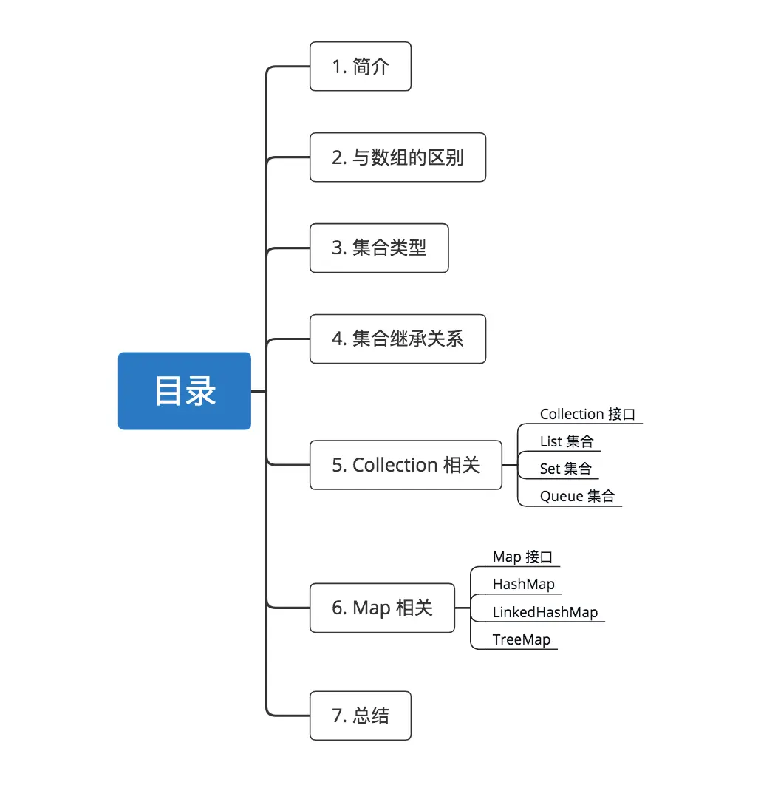
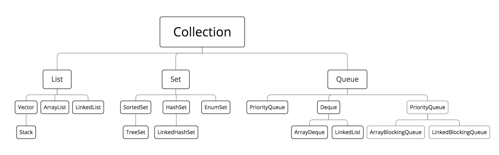
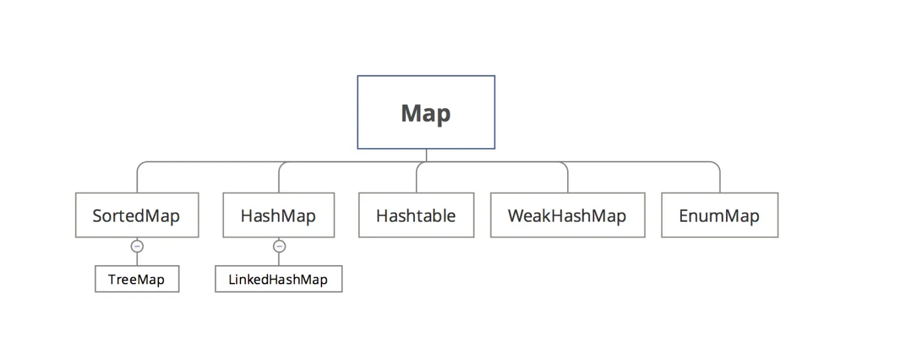
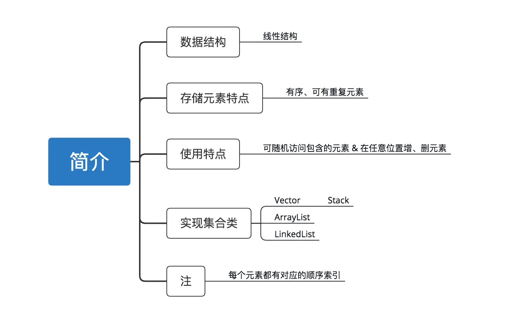
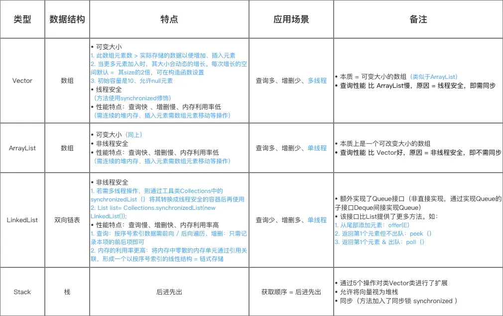
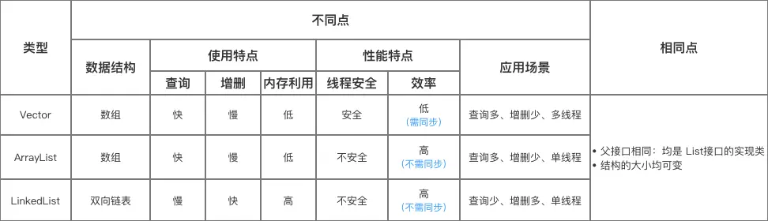
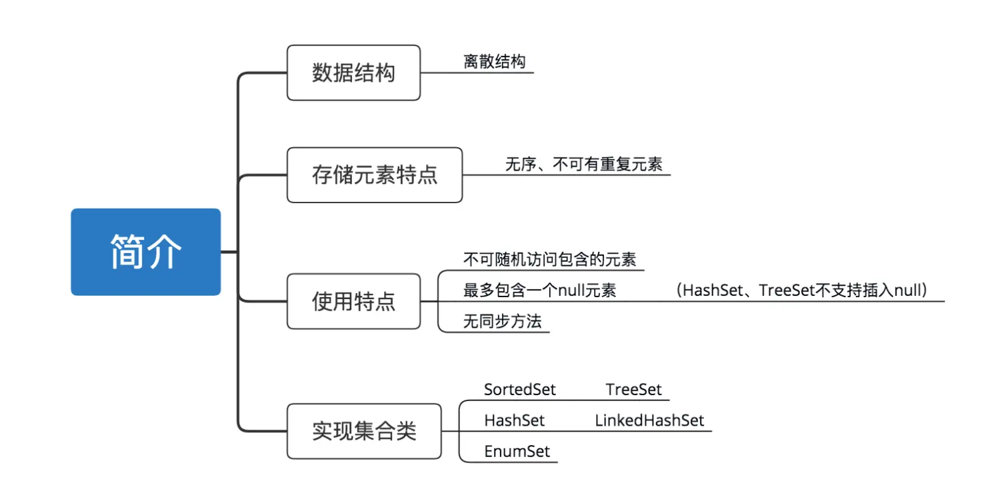
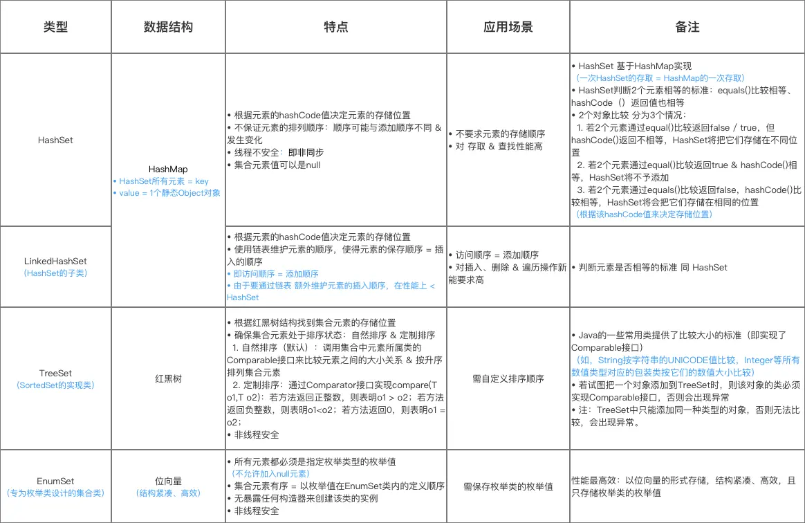

# 目录



# 1. 简介

定义：同一类型实例对象的集合

作用：存放多个系统类型的实例对象

> 就像一种容器，可把多个对象（实际上是对象的引用）放进该容器中
>
> Java 5 增加泛型后，Java 集合可记住容器中对象的数据类型，使得编码更加简洁、健壮。

# 2. 与数组的区别

`Java` 集合 与 常用数组的区别如下：

| 类型 | 长度                   | 存储的数据类型                                               |
| ---- | ---------------------- | ------------------------------------------------------------ |
| 集合 | 不固定长度，会自动扩容 | 对象（实际是保存对象的引用变量）。基本数据类型的变量需要转成包装类才能放到集合中。 |
| 数组 | 固定长度，初始化时指定 | 基本数据类型的值、对象                                       |

# 3. 集合类型

`Java`集合的类型可分为`List`、`Set`、`Queue` 、`Map` 4种

| 类型  | 数据结构   | 存储元素特点         |
| ----- | ---------- | -------------------- |
| List  | 线性结构   | 有序，可有重复元素   |
| Set   | 离散结构   | 无序，不可有重复元素 |
| Queue | 队列       | 先进、先出           |
| Map   | 键值对映射 | 键值对（Key-Value）  |

# 4. 集合继承关系

`Java`集合的根接口  =  `Collection `接口    +  `Map` 接口，即 `Java` 的集合类都实现上述2个接口。

- `List`、`Set`、`Queue `实现了 `Collection`接口。继承关系如下：



- `Map` 实现了 `Map` 接口 。继承关系如下：



# 5. Collection相关

在本节中，会先介绍`Collection`接口，再介绍其具体集合实现类（`List`、`Set`、`Queue`类）

集合的操作方法可分为四类：增加、删除、修改、查找。

## 5.1 Collection 接口

定义：一个接口，是集合`List`、`Set`、`Queue`容器的顶层父接口

- 包结构


- 接口中定义的方法
   主要用于 添加元素、删除元素 等等

```jsx
Boolean add(Object o)； // 向集合中添加一个对象的引用

Boolean remove(Object o)； // 从集合中删除一个对象的引用
Void clear()；// 删除集合中的所有对象，即不再持有这些对象的引用

Boolean contains(Object o)；// 判断在集合中是否持有特定对象
Object[] toArray()；// 返回1个数组，该数组包含集合中的所有元素

Iterator iterator()； // 返回1个Iterator对象：用于遍历集合中的元素

Boolean isEmpty()；// 判断集合是否为空
Int size()；// 返回集合中元素的数目

Boolean equals(Object o)； // 对象比较
Int hashCode() ；// 返回hash码 
```

- 与`Collections`的区别

  | 类型        | 定义   | 作用                                                         |
  | ----------- | ------ | ------------------------------------------------------------ |
  | Collection  | 接口   | 是集合List、Set、Queue容器的顶层父接口                       |
  | Collections | 工具类 | 提供了一系列的静态方法来辅助容器操作，如对容器的搜索、排序、线程安全化等。<br />该类不能被实例化。 |

### Collections

#### Collections的使用

```dart
// 主要功能有：搜索元素、获取最大最小值、排序集合、对象线程安全化、将1个List所有元素复制到另1个 等
// 1. 获取最大最小值
static T max(Collection<? extends T> coll, Comparator<? super T> comp); 
static T min(Collection<? extends T> coll, Comparator<? super T> comp); 

// 2. 排序 
static void sort(List<T> list, Comparator<? super T> c); 

// 3. 将线程不安全的Collection转为线程安全的Collection 
static Collection<T> synchronizedCollection(Collection<T> c); 
static List<T> synchronizedList(List<T> list); 
static Map<K,V> synchronizedMap(Map<K,V> m); 
static Set<T> synchronizedSet(Set<T> s);

// 交换指定位置的两个元素 
static void swap(List<?> list, int i, int j) 

// 主要操作对象 = 集合类 = `Collection`接口的实现类
List list = new ArrayList(); 
list.add(XXX); 
//··· 
list.add(XXX); 
Collectoions.sort(list);
```

- `Collections` 与 `Arrays` 的区别

  | 实现类      | 定义                       | 面向操作对象                                       | 作用                                       | 主要功能                                                     |
  | ----------- | -------------------------- | :------------------------------------------------- | ------------------------------------------ | ------------------------------------------------------------ |
  | Collections | 一个工具类（不能被实例化） | 集合类 / 容器<br />（Collection、Map接口的实现类） | 提供了一系列的静态方法，辅助 集合容器 操作 | 1、搜索元素（二分搜索）<br />2、获取最大、最小值<br />3、排序集合<br />4、对象线程安全化（将线程不安全的Map、Set转为线程安全的对象）<br />5、将一个List所有元素复制到另一个 |
  | Arrays      | 一个工具类（不能被实例化） | 数组                                               | 提供了一系列的静态方法，辅助 数组 操作     | 搜索元素<br />将数据转List对象<br />复制数组指定范围的元素为一个新的数组<br />给数组指定范围的每个元素赋一个值<br />排序 |

## 5.2 List 集合

- 简介



- 使用方法

```dart
增加
void add(int index, Object element)； // 将元素elment插入在集合list的index处
boolean addAll(Collection<? extends E> c);  // 将集合c 中的所有元素都插入到列表中的指定位置index处
删除
Object remove(int index)；// 删除集合index索引处的元素
void clear();  // 清空集合
修改
E set(int index, E element); // 将集合中index索引处的元素替换成element
查找
Object get(int index)； // 返回List集合index索引处的元素
Int indexOf(Object o) ；// 返回集合中元素o的index索引
int lastIndexOf(Object o)； // 返回集合中最后一个元素的索引
int size();  // 获得集合长度
boolean isEmpty(); // 判断集合是否为空
List subList(int fromIndex,int toIndex)；// 返回集合中从索引fromIndex到toIndex索引处的元素集合
```

- 集合实现类
   `List`的集合实现类主要包括：`Vector`、`ArrayList`、`LinkedList`、`Stack`。具体介绍如下



- `Vector`、`ArrayList`、`LinkedList`之间的区别



## 5.3 Set 集合

- 简介



- 使用方法

```java
boolean add(E e);  // 添加元素
boolean addAll(Collection<? extends E> c); // 插入集合c 中的所有元素到集合中

boolean remove(Object o);  // 删除元素
boolean removeAll(Collection<?> c);  // 移除原集合中的集合c中的元素
void clear();  // 清空集合

boolean contains(Object o);  // 判断是否包含该元素
boolean containsAll(Collection<?> c);  // 判断是否包含该集合中的元素

Object[] toArray();  // 返回1个数组，该数组包含集合中的所有元素

int size();  // 获得集合长度
boolean isEmpty(); // 判断集合是否为空
```

- 集合实现类
   `Set`的集合实现类主要包括：`TreeSet`、`HashSet`（`LinkedHashSet`）、`EnumSet`。具体介绍如下



## 5.4 Queue 集合

- 简介


- 使用方法

```java
//插入新元素到队列：插入成功则返回true； 若队列已满，抛出IllegalStateException异常 
boolean add(E e); 
 
//插入新元素到队列，若插入成功则返回true ；若队列已满，返回false，但不抛出异常 
boolean offer(E e); 
 
E remove();  // 返回第1个元素 & 从队列中删除；若队列为空，抛出异常 
E poll();  // 返回第1个元素 & 从队列中删除 ；若队列为空，返回null，但不抛出异常 
E element();  //返回的第1个元素 & 不从队列中删除；若队列为空，则抛异常 
E peek(); // 返回第1元素 & 不从队列中删除；若队列为空，则返回null

// 时间复杂度分析
// 1. 插入方法：offer()、poll()、remove() 、add ()= O(log(n)) 
// 2. 删除方法：remove() 、 contains()  = O(n) 
// 3. 检索方法：peek()、element() 、size() = O(1)


// 使用建议
// 1. 遍历时，若使用但不需删除元素，使用element()、peek()（时间效率高）
// 2. 使用offer（）加入元素、poll（）取出元素
    // a. 避免使用Collection的add() 、remove()
    // b. 原因 = 通过返回值可判断成功与否，但add()、remove()在失败时会抛出异常
```

- 集合实现类
   `Queue`的集合实现类主要包括：`PriorityQueue`、`Dueue`（`ArrayDeque`、`LinkedList`）、`PriorityQueue`（`ArrayBlockingQueue`、`LinkedBlockingQueue`）。具体介绍如下


至此，关于`Collection`接口、其具体集合实现类（`List`、`Set`、`Queue`类）讲解完毕。总结如下


# 6. Map 相关

在本节中，会先介绍`Map`接口，再介绍其具体集合实现类中最常见的`HashMap`、`LinkedHashMap`、`TreeMap`

### 6.1 Map 接口

- 简介


> 注：`Map`接口 与 `Collection` 接口无关

- 包结构


```java
// 为了更好理解各类的关系，下面附上：各类的定义图
// HashMap 
public class HashMap<K,V> 
    extends AbstractMap<K,V> 
    implements Map<K,V>, Cloneable, Serializable{} 
 
// LinkedHashMap 
public class LinkedHashMap<K,V> 
    extends HashMap<K,V> 
    implements Map<K,V>{}

// TreeMap 
public class TreeMap<K,V> 
    extends AbstractMap<K,V> 
    implements NavigableMap<K,V>, Cloneable, java.io.Serializable{} 

// Hashtable 
public class Hashtable<K,V> 
    extends Dictionary<K,V> 
    implements Map<K,V>, Cloneable, java.io.Serializable {} 

// ConcurrentHashMap 
public class ConcurrentHashMap<K, V> extends AbstractMap<K, V> 
        implements ConcurrentMap<K, V>, Serializable {} 
```

- 接口中定义的方法

```csharp
Set<K> keySet();  // 单独抽取key序列，将所有key生成一个Set
Collection<V> values();  // 单独value序列，将所有value生成一个Collection
 
V remove(Object key);  // 删除该映射关系
V get(Object key); // 获得指定键的值
V put(K key, V value);  // 添加键值关系
void putAll(Map<? extends K, ? extends V> m);  // 将指定Map中的映射关系 复制到 此Map中

boolean containsKey(Object key); // 若存在该键的映射关系，则返回true
boolean containsValue(Object value);  // 若存在该值的映射关系，则返回true
 
void clear(); // 清除所有映射关系
int size();  // 返回键值关系的数量
boolean isEmpty(); // 若未包含键值关系，则返回true


// Map中还包括1个内部类：Entry
// 该类封装了一个key-value对
// Entry类包含如下方法：
boolean equals（Object o ）；// 比较指定对象 与 此项 的相等性

K getKey（）；// 返回 与 此项 对应的键
V getValue（）；// 返回 与 此项 对应的值

int hashCode（）；// 返回此映射项的哈希值
V setValue（V value） ；// 使用指定值替换 与 此项对应的值
```

- 与`Set`集合、`List`集合的关系


下面，我将介绍其具体集合实现类中最常见的`HashMap`、`LinkedHashMap`、`TreeMap`

### 6.2 HashMap

- 类定义

```java
public class HashMap<K,V>
         extends AbstractMap<K,V> 
         implements Map<K,V>, Cloneable, Serializable
```

- 主要介绍


### 6.3 LinkedHashMap

- 类定义

```java
public class LinkedHashMap<K,V> 
    extends HashMap<K,V> 
    implements Map<K,V>{}
```

- 简介


### 6.4 TreeMap

- 类定义

```java
public class TreeMap<K,V> 
    extends AbstractMap<K,V> 
    implements NavigableMap<K,V>, Cloneable, java.io.Serializable{} 
```

- 简介


- 关于排序方式 & 判断相等的标准


### 6.5 相关子类比较

- `HashMap` 、`LinkedHashMap`、`TreeMap`的区别

  

- `HashMap` 、 `Hashtable` 的区别


- `HashMap` 、 `ConcurrentHashMap` 的区别


至此，关于`Java`集合的相关内容（`Colletcion` 、`Map`接口 & 其相关实现子类）讲解完毕。

# 7. 总结

本文主要讲解了`Java`集合的相关内容，包括`Colletcion` 接口、`Map`接口 & 其相关实现子类），具体总结如下：


# 参考

[Carson带你学Java：那些关于集合的内容都汇总在这里了！](https://www.jianshu.com/p/4f455f2095e7)