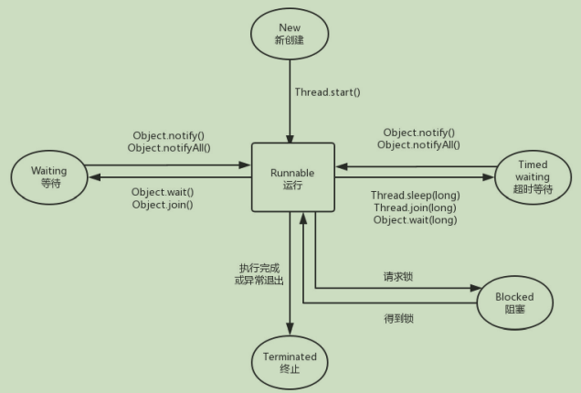
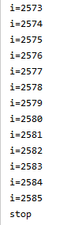
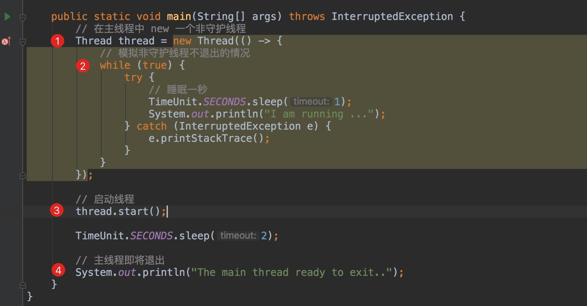
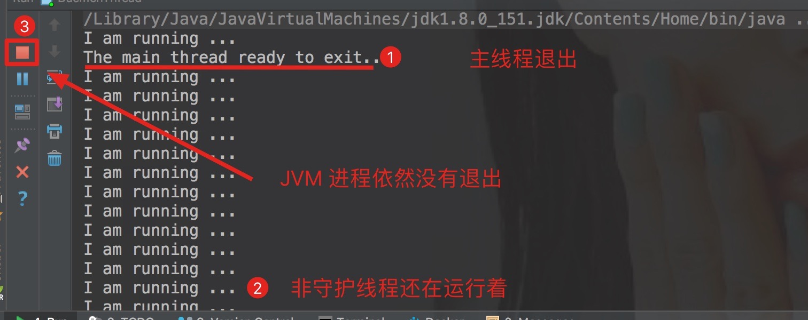
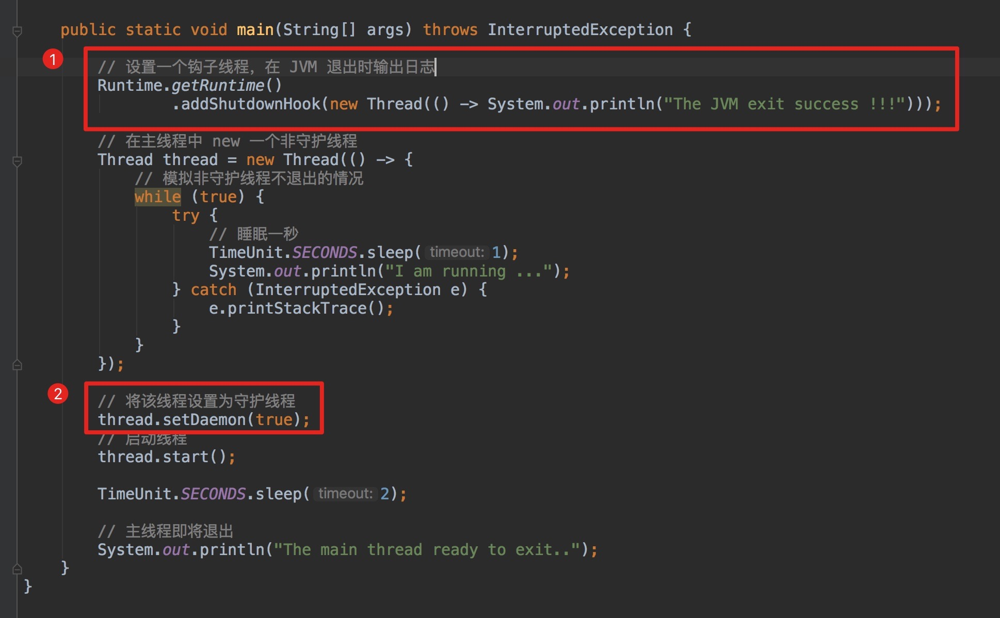
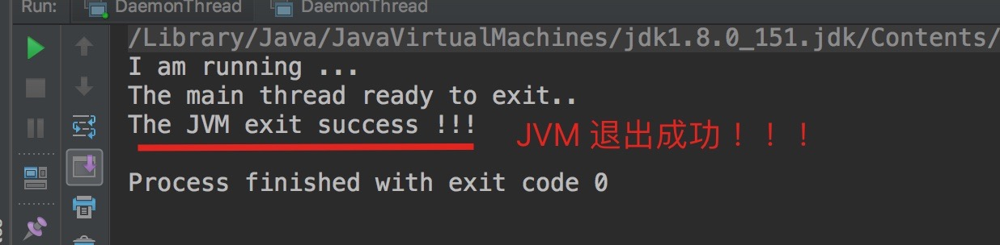

> version：2021/4/26
>
> review：2021/4/26


目录

[TOC]


Android 沿用了 Java 的线程模型，一个 Android 应用在创建时会开启一个线程，称为主线程或者 UI 线程。如果我们想要访问网络或者数据库等耗时的操作时，都会开启子线程去处理（不然可能会ANR）， 从 Android 3.0 开始，系统要求网络访问必须在子线程中进行，否则会抛出异常。多线程可以提高CPU的利用率，使得程序的运行效率得到提高，响应速度更快。

# 一、线程基础

线程和进程的区别、线程的创建、线程的状态等知识点。

## 1、进程与线程

1. 什么是进程

   进程是正在运行的程序，程序一旦运行就是进程，进程是程序的实体，也是线程的容器。进程是系统进行资源分配和调度的基本单位。进程拥有独立的地址空间，由进程控制块、程序段、数据段三部分组成。

   在Android中，可以使用Process等类去获取进程相关的信息，也可以使用一些adb命令去查看。

   > 进程相关的类有哪些需要补充学习。
   >
   > adb方面的知识也得补一下。

2. 什么是线程

   进程是分配资源的基本单位，而线程是 CPU 独立运行和独立调度的基本单位。由于线程比进程更小，并且基本不拥有系统资源，因此对它的调度开销要更少，能提高多程序间并发执行的效率。同一进程中的线程可以共享进程中的资源。

   在Android中，使用Thread类来执行线程相关的操作。

3. 为何要使用多线程

   1. 多线程可以把耗时任务放到后台处理。在Android中，多线程的使用可以避免主线程（UI线程）的阻塞；
   2. 现在的处理器基本都是多核，多线程可以发挥多核优势，并发执行让系统执行更快、更流畅；
   3. 与进程相比，线程创建和切换开销更小，同时多线程在数据共享方面效率非常高。
   4. 多线程主要是用来并行运算，提高程序效率。
   5. 可以简化程序结构，便于理解和维护。

## 2、线程

#### 2.1、线程的属性

- id

  线程标识。只读属性，不能修改。

- name

  线程名称。默认值 Thread-(id)。

- daemon

  分为守护线程和用户线程。可以通过 setDaemon(true) 设置为守护线程。守护线程通常执行不重要的任务，比如监控其他线程的运行情况，GC 线程就是守护线程。setDaemon() 要在线程启动前设置，否则 JVM 会抛出非法线程状态异常。可被继承。

- priority

  线程调度器会根据这个值来决定优先运行哪个线程（不保证），优先级的取值范围为 1~10，默认值是 5，可被继承。Thread 中定义了三个优先级常量：

  - 最低优先级：MIN_PRIORITY = 1
  - 默认优先级：NORM_PRIORITY = 5
  - 最高优先级：MAX_PRIORITY = 10

#### 2.2、线程的6种状态

线程在运行时可能处于 6 种不同的状态，分别如下：

- New：新创建状态。线程被创建，但还没有调用 start() 方法。
- Runnable：可运行状态。调用 start() 方法后，线程处于 Runnable 状态。Runnable 又可分为 Ready 和 Running 两个状态。调用 start() 方法后，进入 Ready 状态，该状态的线程位于可运行线程池中，等待被线程调度选中——获取 CPU 使用权，Ready 状态获得 CPU 时间片后变为 Running 状态。Running 状态失去 CPU 时间片或者 调用 yield() 方法后，变为 Ready 状态。
- Blocked：阻塞状态。线程因为某种原因放弃了 CPU 的使用权（等待锁），暂时停止运行。当线程调用到同步方法时，如果线程没有获得锁则进入阻塞状态，当阻塞状态的线程获取到锁时则重新回到运行状态。
- Waiting：等待状态。等待状态不运行任何代码，消耗最少的资源，直到线程调度器重新激活它。可以通过以下方法进入 Waiting 状态：
  - Object#wait()
  - Thread#join()
  - LockSupport#park()
- Timed Waiting：超时等待状态。和 Waiting 不同，它可以在指定的时间自行返回。
- Terminated：终止状态。表示该线程已经执行完毕。导致线程终止的情况有：
  - run() 方法执行完毕正常退出；
  - 因为没有捕获异常而终止 run() 方法。

**线程的状态切换如图所示**：



线程创建后，调用 Thread 的 start 方法，开始进入运行状态，当线程执行wait 方法后， 线程进入等待状态，进入等待状态的线程需要其他线程通知才能返回运行状态。超时等待相当于在等待状 态加上了时间限制，如果超过时间限制，则线程返回运行状态。当线程调用到同步方法时，如果线程没有获得锁则进入阻塞状态，当阻塞状态的线程获取到锁时则重新回到运行状态。当线程执行完毕或者遇到意外异常终止时，都会进入终止状态。

> 当线程死亡以后，不能再次调用start()方法来启动该线程，调用会返回IllegalThreadStateException异常。程序只能对处于新建状态的线程调用start()方法，而对处于新建状态的线程两次调用start()方法也是错误的，这都会引发IllegalThreadStateException异常。

#### 2.3、状态控制

##### 1、Thread.yield()

让当前线程从 **运行状态** 转为 **就绪状态**，以允许具有相同优先级的其他线程获得运行机会。（yield本意有**让步**的意思。）

但是，yield() 无法保证达到让步目的，因为执行让步的线程还有可能被线程调度程序再次选中。

它让掉当前线程 CPU 的时间片，使正在运行中的线程重新变成就绪状态，并重新竞争 CPU 的调度权。它可能会获取到，也有可能被其他线程获取到。

关于yield() 和 优先级的关系：

有优先权的线程也不一定就会先执行，只是说概率大一些。

> 通常，高优先级的跟容易竞争胜出，至少不太会排到最后。所以，通过yield()来实现让优先级更高的线程先执行，是可行的，但不必然。我在javaapidemo-thread中，关于优先级的例子，可以佐证。

示例：

在下面这个例子中，高优先级的，通常不会最后结束。


**使用场景：**

高并发场景下，非紧急任务让步与紧急任务。


##### 2、sleep()

可能会抛出InterruptedException()异常。

##### 3、join()

```kotlin
class SleeperThread(name: String, private val sleepTime: Long) : Thread(name) {

    override fun run() {
        try {
            sleep(sleepTime)
        } catch (e: InterruptedException) {
            Log.i("joinTest", "$name is interrupted, isInterrupted=$isInterrupted")
        }
        Log.i("joinTest", "$name is finished")
    }
}

class JoinerThread(name: String, private val thread: Thread) : Thread(name) {

    override fun run() {
        try {
            thread.join()
        } catch (e: InterruptedException) {
            Log.i("joinTest", "$name is interrupted, isInterrupted=$isInterrupted")
        }
        Log.i("joinTest", "$name is finished")
    }
}


	// 测试方法
    fun testJoin() {
        val s1 = SleeperThread("S1", 2000)
        s1.start()
        val s2 = SleeperThread("S2", 2000)
        s2.start()
        JoinerThread("J1", s1).start()
        JoinerThread("J2", s2).start()
    }
```

结果：


S1总是在J1之前结束。

##### 4、中断

在上面的例子中，如果执行：

```kotlin
fun interruptedS1() {
    s1.interrupt()
}
```

那么sleep()方法将中断，并且会 catch InterruptedException。需要注意：isInterrupted()方法在catch{}中，总是false，因为在异常被捕获时会被置为false。所以如果我们想通过`while(!isInterrupted())`来终止线程，那么在catch{}应该再次设置一下标志位，即：

```kotlin
		try {
            sleep(sleepTime)
        } catch (e: InterruptedException) {
            Thread.currentThread().interrupt()； 
        }
```


## 3、创建线程的3种方法

多线程的实现一般有三种方法，最常用的是第二种。需要注意的是线程调用 start()方法后并不会立即执行多线程的代码，而是使该线程变为可运行态，什么时候运行多线程代码是由操作系统决定的。

#### 3.1、继承 Thread 类，重写 run() 方法

Thread 类实现了 Runnable 接口。

```java
public class TestThread extends Thread{ 
 public void run() {
 System.out.println(＂Hello World＂)；
 } 
 public static void main(String[] args) {
 Thread mThread = new TestThread()；
 mThread.start()； 
 } 
}
```

#### 3.2、实现 Runnable 接口，并实现该接口的 run() 方法

```java
public class TestRunnable implements Runnable {
 public void run() { 
 System.out.println(＂Hello World＂)；
 } 
}

public class TestRunnable {
 public static void main(String[] args) {
 TestRunnable mTestRunnable = new TestRunnable()； 
 Thread mThread = new Thread(mTestRunnable)；
 mThread.start()； 
 } 
}
```

#### 3.3、实现 Callable 接口，重写 call() 方法

Callable 接口是属于 Executor 框架中的功能类，Callable 接口与 Runnable 接口的功能类似，但提供了比 Runnable 更强大的功能，主要表现为以下 3 点：

（1）Callable 可以在任务接受后提供一个返回值，Runnable 无法提供这个功能。

（2）Callable 中的 call()方法可以抛出异常，而 Runnable 的 run()方法不能抛出异常。

（3）运行 Callable 可以拿到一个 Future 对象，Future 对象表示异步计算的结果，它提供了检查计算是否完成的方法。由于线程属于异步计算模型，因此无法从别的线程中得到函数的返回值，在这种情况下就可以使用 Future 来监视目标线程调用 call()方法的情况。但调用 Future的 get()方法以获取结果时，当前线程就会阻塞，直到 call()方法返回结果。

```java
public class TestCallable { 
 //创建线程类
 public static class MyTestCallable implements Callable { 
 public String call() throws Exception { 
 retun ＂Hello World＂；
 } 
 } 
public static void main(String[] args) { 
 MyTestCallable mMyTestCallable= new MyTestCallable()； 
 ExecutorService mExecutorService = Executors.newSingleThreadPool()； 
 Future mfuture = mExecutorService.submit(mMyTestCallable)； 
 try { 
 //等待线程结束，并返回结果
 System.out.println(mfuture.get())； 
 } catch (Exception e) { 
 e.printStackTrace()；
 } 
 } 
}
```

在这 3 种方式中，一般推荐用实现 Runnable 接口的方式，其原因是，一个类应该在其需要加强或者修改时才会被继承。因此如果没有必要重写 Thread 类的其他方法，那么在这种情况下最好用实现 Runnable 接口的方式。


## 4、从任务中产生返回值

通过Callable接口。示例：

```kotlin
class TaskWithResultCallable(private val id: Int) : Callable<String> {
    override fun call(): String {
        Thread.sleep(4000L)
        return "id = $id"
    }
}
```

```kotlin
private fun runMoreTaskByExecutorWithResult() {
    val results = arrayListOf<Future<String>>()
    val executorService = Executors.newCachedThreadPool()
    for (i in 1..5) {
        results.add(executorService.submit(TaskWithResultCallable(i)))
    }
    results.forEach {
            try {
                Log.i("result", it.get())
            } catch (e: InterruptedException) {
                e.printStackTrace()
            } catch (e: ExecutionException) {
                e.printStackTrace()
            } finally {
                executorService.shutdown()
            }
        }
}
```

这里要注意一个点，future.get()是会阻塞当前线程的，比如上面我们执行了TaskWithResultCallable()任务，sleep了4s模拟耗时，会导致main线程阻塞。

> 因此，在Android中，在主线程中调用future.get是不合适的。目前来看，更好的做法，还是通过Handler来发送结果好一点。


## 5、理解中断

​		在 Java 早期版本中有一个 stop 方法，其他线程可以调用它终止线程，但是这个方法现在已经被弃用了。`interrupt()` 方法可以用来请求中断线程。当一个线程调用 interrupt 方法时，线程的中断标识位将被置为 true，线程会不时地检测这个中断标识位，以判断线程是否应该被中断。要想知道线程是否被置位，可以调用 `Thread.currentThread().isInterrupted()`，如下所示：

```java
while(!Thread.currentThread().isInterrupted()){
 //do something
}
```

还可以调用 `Thread.interrupted()`来对中断标识位进行复位。但是如果一个线程被阻塞，就无法检测中断状态。如果一个线程处于阻塞状态，线程在检查中断标识位时如果发现中断标识位为 true，则会在阻塞方法调用处抛出  InterruptedException 异常，并且在抛出异常前将线程的中断标识位复位，即重新设置为 false。 需要注意的是被中断的线程不一定会终止，中断线程是为了引起线程的注意，被中断的线程可以决定如何去响应中断。如果是比较重要的线程则不会理会中断，而大部分情况则是线程会将中断作为一个终止的请求。 另外，不要在底层代码里捕获 InterruptedException 异常后不做处理，如下所示：

```java
void myTask(){
...
 try{
 sleep(50)
 }catch(InterruptedException e){
 }
 ...
}
```

下面介绍两种合理的处理方式：

1. 在 catch 子句中，调用 Thread.currentThread.interrupt()来设置中断状态（因为**抛出异常后中断标识位会复位**），让外界通过判断 Thread.currentThread().isInterrupted()来决定是否终止线程还是继续下去，应该这样做：

   ```java
   void myTask(){
   ...
    try{
    sleep(50)
    }catch(InterruptedException e){
    Thread.currentThread().interrupt()； 
    }
     ...
   }
   ```

2. 更好的做法就是，不使用 try 来捕获这样的异常，让方法直接抛出，这样调用者可以捕获这个异常，如下所示：

   ```java
   void myTask()throw InterruptedException{
    sleep(50)
   }
   ```

> 关于中断，理解还不是很到位。需要再做学习。


## 6、安全地终止线程

​		前面我们讲到了中断，那么首先就用中断来终止线程，代码如下：

```java
public class StopThread {
    public static void main(String[] args) throws InterruptedException {
        MoonRunner runnable = new MoonRunner();
        Thread thread = new Thread(runnable,"MoonThread");
        thread.start();
        // 1、
        TimeUnit.MILLISECONDS.sleep(10);
        thread.interrupt();
    }

    public static class MoonRunner implements Runnable {
        private long i;

        @Override
        public void run() {
            while (!Thread.currentThread().isInterrupted()) {
                i++;
                System.out.println("i =" + i);
            }
            System.out.println("stop");
        }
    }
}
```

​		注释 1 处调用了 sleep 方法使得 main 线程睡眠 10ms，这是为了留给 MoonThread 线程时间来感知中断从而结束。除了中断，还可以采用 boolean 变量来控制是否需要停止线程，代码如下：

```java
public class StopThread {
    public static void main(String[] args) throws InterruptedException {
        MoonRunner runnable = new MoonRunner();
        Thread thread = new Thread(runnable, "MoonThread");
        thread.start();
        TimeUnit.MILLISECONDS.sleep(10);
        runnable.cancel();
    }

    public static class MoonRunner implements Runnable {
        private long i;
        // 1、
        private volatile boolean on = true;

        @Override
        public void run() {
            while (on) {
                i++;
                System.out.println("i=" + i);
            }
            System.out.println("stop");
        }

        public void cancel() {
            on = false;
        }
    }
}
```

​		注释 1 处用到了 volatile 关键字，当涉及多个线程对这个变量的访问，在设置 volatile boolean on 的时候，当有其他线程改变其值时，所有的线程都会感知到它的变化。这两种方式输出的结果类似，如下所示，这里只打出了部分信息，i 的值由 1 一直打印到 2585（输出的结果是变化的）。最后打印 stop，说明执行到了 run 方法的末尾，线程即将终止。




# 二、守护线程

## 1、什么是守护线程

守护线程，又称后台线程、daemon线程。

守护线程相对于正常线程来说，是比较特殊的一类线程，那么它特殊在哪里呢？在了解它之前，我们需要知道一个问题，那就是：

**JVM 程序在什么情况下能够正常退出？**

> The Java Virtual Machine exits when the only threads running are all daemon threads.

上面这句话来自 JDK 官方文档，意思是：

**当 JVM 中不存在任何一个正在运行的非守护线程时，则 JVM 进程即会退出。**

理解起来有点拗口，看完下面的代码你就懂了 。



- **①：**创建一个非守护线程；
- **②：**模拟非守护线程不退出的情况；
- **③：**启动线程;
- **④：**主线程即将退出;

运行这段代码，猜猜看，JVM 进程是否能够正常退出呢？



可以看到因为有一个非守护线程一直在后台运行着，JVM 无法正常退出。那么，如果说正在运行的是个守护线程，结果又会怎么样呢？



- **①：**添加一个钩子（Hook）线程, 用来监听 JVM 退出，并输出日志；

> 关于 Hook (钩子) 线程可以看：[《Java 多线程之 Hook (钩子) 线程》](https://www.exception.site/java-concurrency/java-concurrency-hook-thread)

- **②：**通过 `setDaemon(true)`将该线程为守护线程；

再次运行代码，瞅瞅效果：



可以看到，当主线程退出时，JVM 会随之退出运行，守护线程同时也会被回收，即使你里面是个死循环也不碍事。

## 2、守护线程的作用及应用场景

通过上面的示例代码，相信你已经了解了守护线程和普通线程之间的区别，那么，我们来讨论一下为什么需要守护线程，以及何时使用，它的应用场景是什么？

上面，我们已经知道了，如果 JVM 中没有一个正在运行的非守护线程，这个时候，JVM 会退出。换句话说，**守护线程拥有自动结束自己生命周期的特性，而非守护线程不具备这个特点**。

JVM 中的垃圾回收线程就是典型的守护线程，如果说不具备该特性，会发生什么呢？

当 JVM 要退出时，由于垃圾回收线程还在运行着，导致程序无法退出，这就很尴尬了！！！由此可见，守护线程的重要性了。

通常来说，守护线程经常被用来执行一些后台任务，比如在后台记录、上报当前进程的一些状态。但是呢，你又希望在程序退出时，或者说 JVM 退出时，线程能够自动关闭，此时，守护线程是你的首选。

一大特点：程序结束时会自动退出。

## 3、其他

1、在守护线程中创建的线程，默认也是守护线程。可以通过isDaemon()查看。

2、deamon线程的finally，是不会执行的。当非daemon线程都退出后，JVM会立即关闭所有daemon线程。


# 相关问题

## 一、概念

<font color='orange'>Q：是否熟悉多线程，如果熟悉，介绍下线程。</font>

<font color='orange'>Q：对Thread的理解？</font>


<font color='orange'>Q：并发和并行分别是什么意思，多线程是并发还是并行</font>

并行指的是在CPU层面，两个线程在同一时间是一起执行的。

并发在宏观层面用来描述多个线程同时执行，但是在CPU层面，线程可能是顺序执行的也可能是并行执行的。线程在运行的时候会由操作系统进行调度，并做资源和CPU时间片的分配，如果多个线程运行在同一个CPU中，它们是顺序执行的，同一时间只会有一个线程在运行，其他的会挂起；如果运行在多不同的CPU中，那就是并行执行。

<font color='orange'>Q：什么是线程安全？（多线程安全问题）</font>

多线程在并发执行的时候，由于线程的执行顺序是由系统控制的，因此多线程对数据的操作可能和我们预期的不一致，这就是线程安全问题。在Java中，线程安全问题通过同步机制来进行保障。

同步机制是指，采用一定的方式来保证同一时间只有一个线程能访问共享资源。

<font color='orange'>Q：JVM堆和栈的作用，进程和线程的作用，堆栈和线程进程的对应关系</font>


<font color='orange'>Q：是否了解Java的atomic</font>


<font color='orange'>Q：阻塞队列有哪些，多线程实现生产消费者模型，IO模型</font>


<font color='orange'>Q：什么是守护线程？</font>

守护线程不会影响程序的结束，可以用来执行一些后台任务，然后程序结束的时候，它会自动停止。比如GC线程，就是一个守护线程，用来在运行的时候清理不再使用的对象，像这种辅助线的任务就可以放到守护线程中运行。我们可以使用setDeamon(true)将线程设置为守护线程。

<font color='orange'>Q：线程各个状态说一下？画图说明</font>

见上文。

<font color='orange'>Q：线程生命周期。</font>

线程启动后，会经过线程的状态切换，最终在代码执行完或者抛出异常是停止运行。

如果是守护线程，JVM进程会在中只有守护线程时退出，从而退出了守护线程。

这题要把中间的状态切换讲出来，这里省略了。

<font color='orange'>Q：假如只有一个cpu，单核，多线程还有用吗？（美团）</font>

有用。多线程用来并发执行任务。CPU负责程序的运行，在线程进行IO操作的时候，就可以切换到其他线程进行执行。

> https://blog.csdn.net/xueyijin/article/details/114272164?utm_medium=distribute.pc_relevant.none-task-blog-2~default~baidujs_title~default-0.no_search_link&spm=1001.2101.3001.4242


<font color='orange'>Q：yield() 是否释放 synchronized 锁</font>

不会释放。

> https://blog.csdn.net/qq_37781649/article/details/109430175


## 二、对比

<font color='orange'>Q：说说线程和进程</font>

见上文。

<font color='orange'>Q：wait()和sleep()的区别，为什么wait是object方法不是thread的方法。</font>

sleep(long mills)

该方法是一个静态方法，直接用Thread调用，作用是让调用该方法的线程睡眠指定的时间（单位：毫秒），参数中需要指定一个睡眠时间，过了该睡眠时间线程自然醒来，线程醒来是就绪状态，因此会和其它线程抢夺cpu执行时间
在线程睡眠期间，**会释放当前线程的cpu使用权给其它线程 但是 不会释放锁**
该方法会抛出 InterruptedException异常

wait(long timeout)

wait(long timeout)、notify()、notifyAll() 三个方法均是Object类提供的final修饰的普通方法，wait(long timeout)方法也可以让线程进入睡眠，该方法既可以指定睡眠时间，也可以不指定
如果为该方法指定了一个睡眠时间，那么当线程醒来没有获得cpu时间片段就会报错。因此我们常常不对该方法指定睡眠时间，如果不指定睡眠时间则需要调用notify()、notifyAll() 方法来唤醒线程
wait(long timeout)方法在线程睡眠时，**会释放当前线程的cpu使用权给其它线程 并且 会释放锁**
wait(long timeout) 方法会抛出 InterruptedException 异常

> 为什么wait是object方法不是thread的方法？

<font color='orange'>Q：sleep,wait,yield在多线程应用中的区别</font>

<font color='orange'>Q：sleep、wait、yield的区别，wait的线程如何唤醒它？（东方头条、字节跳动）</font>

sleep()

方法sleep()的作用是在指定的毫秒数内让当前“正在执行的线程”休眠（暂停执行）。这个“正在执行的线程”是指this.currentThread()返回的线程。
sleep方法有两个重载版本：

sleep(long millis)   //参数为毫秒

sleep(long millis,int nanoseconds)  //第一参数为毫秒，第二个参数为纳秒

sleep相当于让线程睡眠，交出CPU，让CPU去执行其他的任务。

但是有一点要非常注意，sleep方法不会释放锁，也就是说如果当前线程持有对某个对象的锁，则即使调用sleep方法，其他线程也无法访问这个对象。

注意，如果调用了sleep方法，必须捕获InterruptedException异常或者将该异常向上层抛出。当线程睡眠时间满后，不一定会立即得到执行，因为此时可能CPU正在执行其他的任务。所以说调用sleep方法相当于让线程进入阻塞状态。

wait()

wait()是Object类的方法，调用对象的wait()方法导致当前线程放弃对象的锁（线程暂停执行），进入对象的等待池（wait pool），OS会将执行时间分配给其它线程，同样也是进入阻塞态。只有调用对象的notify()方法（或notifyAll()方法）时才能唤醒等待池中的线程进入等锁池（lock pool），如果线程重新获得对象的锁就可以进入就绪状态。

notify()：唤醒一个处于等待状态的线程，在调用此方法的时候，并不能确切的唤醒某一个等待状态的线程，而是由JVM确定唤醒哪个线程，而且与优先级无关；
notityAll()：唤醒所有处于等待状态的线程，该方法并不是将对象的锁给所有线程，而是让它们竞争，只有获得锁的线程才能进入就绪状态；

> sleep()比wait()少了竞争锁的过程。

yield()

调用yield方法会让当前线程交出CPU权限，让CPU去执行其他的线程。它跟sleep方法类似，同样不会释放锁。但是yield不能控制具体的交出CPU的时间，另外，yield方法只能让拥有相同优先级的线程有获取CPU执行时间的机会。而且，调用yield方法并不会让线程进入阻塞状态，而是让线程重回就绪状态，它只需要等待重新获取CPU执行时间，这一点是和sleep方法不一样的。

<font color='orange'>Q：ThreadRun和Start的底层调用区别（是否中断陷入）</font>

run()方法可以用来插入我们自己的逻辑。实现Runnable接口将其赋值给Thread的target变量，在调用Thread.run方法时会执行。

用start方法来启动线程，将其移到Runable状态，这时无需等待run方法体代码执行完毕而直接继续执行下面的代码。通过调用Thread类的start()方法来启动一个线程，这时此线程处于就绪（可运行）状态，并没有运行， 然后通过此Thread类调用方法run()来完成其运行操作的， 这里方法run()称为线程体，它包含了要执行的这个线程的内容， Run方法运行结束， 此线程终止。然后CPU再调度其它线程。 一旦得到cpu时间片，就开始执行run()方法，这里方法 run()称为线程体，它包含了要执行的这个线程的内容，Run方法运行结束，此线程随即终止

> 底层调用可以是要看native的代码，这里先简单了解一下Java层的。

<font color='orange'>Q：阻塞和运行状态区别？</font>

阻塞状态：在进入synchronized方法之前因为抢不到锁对象而进入阻塞状态，进入阻塞队列。或者调用sleep、wait方法也会进入到阻塞状态。

等待状态：进入到synchronized方法后由于调用了wait()方法而进入等待状态，此时进入等待队列，等待其它线程调用它的notify()方法将他唤醒。

运行状态：运行状态分为Ready和Running两部分，Ready状态的线程等待CPU调度执行会进入到Running状态，Running状态是真正在执行run()方法时候的状态。

<font color='orange'>Q：sleep是可中断的么？（小米）</font>

sleep和wait都可以中断。

> 参考：https://www.cnblogs.com/shuimuzhushui/p/12705743.html

## 三、使用

<font color='orange'>Q：线程创建的方法？</font>

见上文。

<font color='orange'>Q：你是如何退出一个线程的？</font>

1、执行完任务后，让GC自动回收释放线程。因为Thread也是一个对象嘛。

2、使用标志位退出线程

3、使用interrupt方法中断线程(推荐使用)

当然，我们也可以使用interrupt方法来中断线程，说到底这其实也是一个标志位的存在，跟上面的原理一样，只不过是Thread类内部提供的罢了。其他线程通过调用某个线程的interrupt()方法对其进行中断操作，被中断的线程则是通过线程的isInterrupted()来进行判断是否被中断。

> interrupt()方法只是改变中断状态，不会中断一个正在运行的线程。4、使用线程池，让线程池去管理线程的创建与销毁。需要用户自己去监视线程的状态为并做处理。

<font color='orange'>Q：线程结束的方法：Interrupt之后需要做什么</font>

调用Interrupt，或者线程阻塞时会抛出InterruptedException异常，我们可以在catch决定是否停止线程的运行。如果在while中，可以使用break退出循环；或者使用while(！isInterrupted())进行退出。

> 参考：https://www.cnblogs.com/myseries/p/10918819.html

**同步相关**

<font color='orange'>Q：怎么实现线程的同步（线程同步的方法有哪些）。</font>

1、使用同步方法

2、使用synchronized代码块

3、使用对象锁

4、使用特殊域变量(volatile)实现线程同步

5、通过ThreadLocal类，使用局部变量实现线程同步

<font color='orange'>Q：两个线程分别调用同一个类的实例函数和类函数</font>

<font color='orange'>Q：public synchronized void test(){}和public static synchronized void test(){}有啥区别，这俩方法在多线程下会不会抢占资源</font>

静态方法使用的是类锁，这种情况不同的实例也能同步。

非静态方法使用的是对象锁，不同实例是不能同步的。 

<font color='orange'>Q：两个线程用不同的对象，怎么样？（字节跳动）</font>

如果对象属于同一个类，可以使用静态方法或者synchronized(A.class)进行同步。

如果用的是实例方法，并且没有通过类锁来同步，就会存在同步安全问题。

<font color='orange'>Q：线程同步问题，自增是原子操作吗？如果要做到线程安全的自增要做怎么做？</font>

自增不是原子操作，它包含一次读操作和一次写操作。

安全自增：使用Java提供的原子类或者使用synchronized同步方法。

> [线程安全之如何实现多线程下的自增安全](https://blog.csdn.net/sidongxue2/article/details/72601903?locationNum=7&fps=1)

<font color='orange'>Q：两个线程同时对一个变量0进行++操作,最终结果如何</font>

不可预期。因为++（自增）不是原子操作（要么不执行，执行就会一次执行完）。

<font color='orange'>Q：三个线程，如何顺序打印ABC</font>

1、使用AtomicInteger 类，无锁模式

[ABC三个线程顺序执行（简单实现）](https://blog.csdn.net/qq_39611310/article/details/118221725?utm_medium=distribute.pc_relevant.none-task-blog-2~default~baidujs_title~default-0.no_search_link&spm=1001.2101.3001.4242)

2、

<font color='orange'>Q：有三个线程T1，T2，T3，怎么确保它们按顺序执行？</font>

1、使用join

> [如何保证T1，T2，T3三个线程顺序执行](https://blog.csdn.net/s751167520/article/details/107512281?utm_medium=distribute.pc_relevant.none-task-blog-2%7Edefault%7ECTRLIST%7Edefault-1.no_search_link&depth_1-utm_source=distribute.pc_relevant.none-task-blog-2%7Edefault%7ECTRLIST%7Edefault-1.no_search_link)

2、

<font color='orange'>Q：假设有A，B，C三个线程，在A线程的执行过程中去执行B线程，并且等待B线程的执行结果，然后去执行C线程，然后当C线程执行完成后，返回结果给A线程。不阻塞线程，如何实现？</font>

使用join。

# 总结

通过这一节的学习，至少要弄懂以下问题：

1. 进程和线程的区别

1、从概念阐述，什么是进程、什么是线程，它们之间的关系是什么？

2、说明它们之间的差异性，代码层面不同，使用方式、适用场景不同（可从Android方面阐述），性能开销不同

3、它们各自又能牵扯出很多相关知识点

1. 线程的状态和状态控制（切换）
2. 创建线程的 3 种方法
3. 线程中断和安全地终止

## 【精益求精】我还能做（补充）些什么？

1、


# 参考

1、《Android进阶之光 第一版》

2、《Android核心知识点笔记V2020.03.30》

3、[什么是守护线程](https://www.cnblogs.com/quanxiaoha/p/10731361.html)

4、[理解yield()](https://blog.csdn.net/weixin_38553453/article/details/72921797)

5、[Thread.yield()详解](https://blog.csdn.net/y532798113/article/details/103997066)