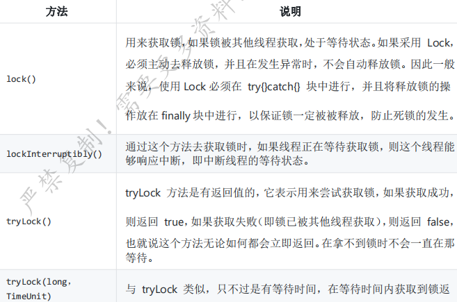
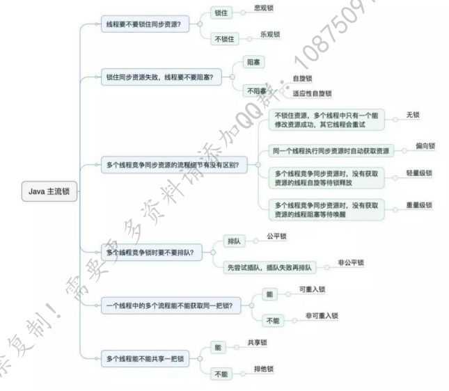
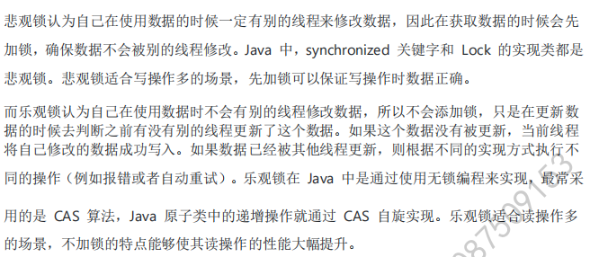
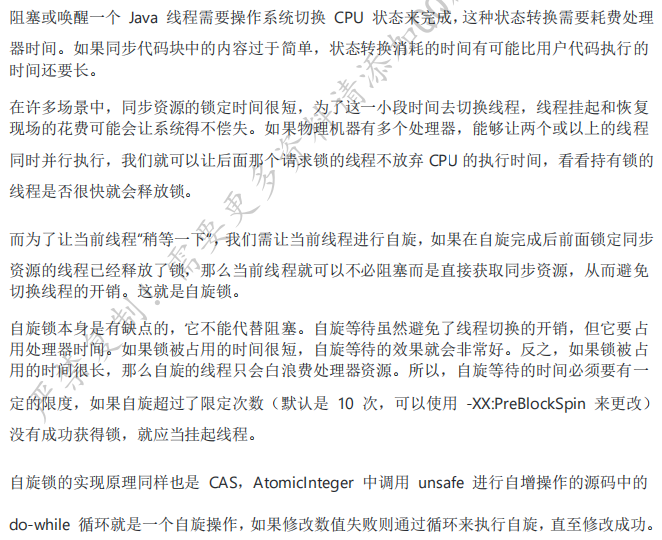

> version：2021/4/7
>
> review：2021/4/7

### 二、Lock

```java
public interface Lock {
    void lock();

    void lockInterruptibly() throws InterruptedException;

    boolean tryLock();

    boolean tryLock(long var1, TimeUnit var3) throws InterruptedException;

    void unlock();

    Condition newCondition();
}
```

- lock()

  

  

- lockInterruptibly()

  

- tryLock()

  

- tryLock(long var1, TimeUnit var3)

  

#### 2.1 锁的分类



#### 2.2 悲观锁、乐观锁



#### 2.3 自旋锁、适应性自旋锁



#### 2.4 死锁


# 参考

《Android核心知识点笔记V2020.03.30》