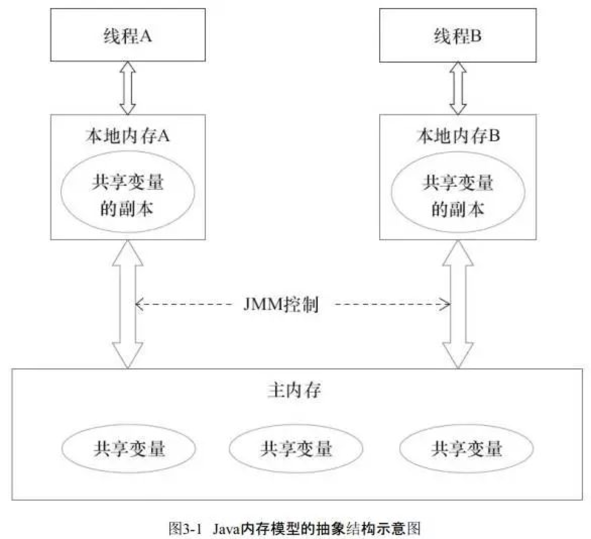

> version：2022/07/
>
> review：

# 简介

 `volatile` 是 `Java` 中的1个关键字 / 修饰符

作用：用来保证被修饰的共享变量的 **可见性 & 有序性**，但不保证原子性

# 具体描述

`volatile`是如何保证 “共享变量” 的**可见性 & 有序性**，但不保证原子性”的具体原理

### 储备知识：原子性、可见性 & 有序性


### 3.1 保证可见性

- 具体描述
   `volatile`修饰的属性保证每次读取都能读到最新的值

> 但不会 & 无法更新已经读了的值

- 原理
   线程A在工作内存中修改的**共享属性值会立即刷新到主存**，线程B/C/D每次通过读写栅栏来达到类似于直接从主存中读取属性值

> 1. 只是类似，网上有些说volatile修饰的变量读写直接在主存中操作，这种说法是不对的，只是表现出类似的行为
> 2. 读写栅栏是一条CPU指令；插入一个读写栅栏 = 告诉CPU & 编译器先于这个命令的必须先执行，后于这个命令的必须后执行（有序性）
> 3. 读写栅栏另一个作用是强制更新一次不同CPU的缓存。例如，一个写栅栏会把这个栅栏前写入的数据刷新到缓存，以此保证可见性

#### 可见性问题示例

```kotlin
class Test {
    var flag = true

    fun spin() {
        while (flag) {
        }
    }
}

    @Test
    fun test() {
        val test = com.lizw.javaapidemos.Test()
        Thread {
            Thread.sleep(1000L)
            test.flag = false
            println("t-" + test.flag)
        }.start()
        test.spin()
        println("end?")
    }
```

这个程序不会停止运行。因为



所以在另一个线程中，去修改flag的值，并不会影响到while循环，在mian线程中，flag始终是true。解决方式就是给flag加上volatile关键字。

### 3.2 保证有序性

- 具体描述
   当对volatile修饰的属性进行读/写操作时，其前面的代码必须已执行完成 & 结果对后续的操作可见
- 原理
   重排序时，以`volatile`修饰属性的读/写操作代码行为**分界线**，读/写操作前面的代码不许排序到后面，后面同理不许排序到前面。由此保证有序性

### 3.3 不保证原子性

- 具体描述
   `volatile`修饰的属性若在修改前已读取了值，那么修改后，无法改变已经复制到工作内存的值

> 即无法阻止并发的情况

- 原理

```php
// 变量a 被volatile修饰 
volatile static int a=0;
a++;
// 包含了2步操作：1 = 读取a、2= 执行a+1 & 将a+1结果赋值给a
// 设：线程A、B同时执行以下语句，线程A执行完第1步后被挂起、线程B执行了a++，那么主存中a的值为1
// 但线程A的工作内存中还是0，由于线程A之前已读取了a的值 = 0，执行a++后再次将a的值刷新到主存 = 1
// 即 a++执行了2次，但2次都是从0变为1，故a的值最终为1
```

# 4. 应用场景

由于`volatile`保证可见性和有序性，被`volatile`修饰的共享属性一般并发读/写没有问题，可看做是一种轻量级的`synchronized`实现

# 5. 总结

本文主要讲解了`Java`中`volatile`关键字，其作用为 **保证 “共享变量” 的可见性 & 有序性**，具体总结如下：


# 相关问题

<font color='orange'>Q：volatile的作用？</font>

# 参考

[Carson带你学Java：鲜为人知的关键字volatile](https://www.jianshu.com/p/31e5ab16935f)
