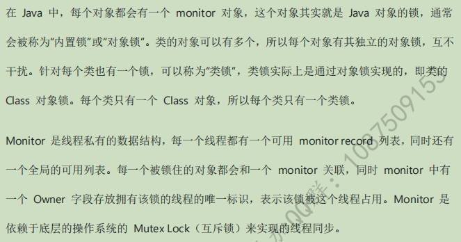

> version：2021/10/
>
> review：

可选：[原文地址](https://developer.android.google.cn/guide/fragments/create)

目录

[TOC]


我们首先来看一个例子：
【demo1】

```java
public class SynchronizedTest3 implements Runnable {
    public static int count = 0;

    @Override
    public void run() {
        for (int i = 0; i < 100000; i++) {
            count++;
        }
    }
}

public class MainActivityTest {

    @Test
    public void synchronizedTest3(){
        for (int i = 0 ; i < 10 ; i++){
            Thread thread = new Thread(new SynchronizedTest3());
            thread.start();
        }

        try {
            Thread.sleep(1000);
        } catch (InterruptedException e) {
            e.printStackTrace();
        }
        System.out.println("result: " + SynchronizedTest3.count);
    }
}
```

这个例子的结果result是：


每次都不一样。
在此例中，我们开启了10个线程，每个线程都累加100000次，预期结果是10*100000=1000000。可运行多次都不是这个数，并且每次结果都是随机的。这是为什么呢？有什么解决方案？下面就来介绍。

# 一、synchronized介绍

## 1、synchronized是什么？有什么用？

synchronized是Java中用于解决并发问题的一种最常用、最简单的方法，它可以确保线程互斥的访问同步代码。

## 2、为什么要使用synchronized?

在并发编程中存在线程安全问题，主要原因有：
1）存在共享数据
2）多线程共同操作共享数据。
关键字synchronized可以保证**在同一时刻，只有一个线程可以执行某个方法或者某个代码块**，同时synchronized可以保证一个线程的变化可见（可见性），即可以代替volatile。

疑问：什么是线程的可见性，volatile是什么？

## 3、实现原理

> 关于原理可以看另外一篇笔记：synchronized和ReentrantLock.md

synchronized可以保证方法或者代码块在运行时，同一时刻只有一个方法可以进入到临界区，同时它还可以保证共享变量的内存可见性。



原理：

同步代码块：使用monitorenter和monitorexit指令实现

同步方法：使用方法修饰符 ACC_SYNCHRONIZED实现

疑问：临界区、共享变量、内存可见性、互斥锁

## 4、synchronized的三种应用方式

Java中每个对象都可以作为锁，这是synchronized实现同步的基础。
1）普通同步方法（实例方法），锁是当前的实例对象，进入同步代码前要获得当前实例的锁。
2）静态同步方法，锁是当前的class对象，进入同步代码前要获得当前类对象的锁
3）同步方法块，锁是括号里面的对象，对给定对象加锁，进入同步代码块前要获得给定对象的锁

# 二、代码示例

下面对synchronized的三种应用写几个示例：

## 1、synchronized作用于代码块

#### 1）多个线程访问同一个对象的synchronized代码块

【demo2】

```java
public class SynchronizedTest implements Runnable {
    //共享资源
    public static int i = 0;

    @Override
    public void run() {
        synchronized (this){
            for (int j = 0; j < 10; j++) {
                i++;
                System.out.println(Thread.currentThread().getName() + i);
            }
        }
    }
}

public class MainActivityTest {

    @Test
    public void onCreate() throws InterruptedException {
        SynchronizedTest synchronizedTest = new SynchronizedTest();

        Thread t1 = new Thread(synchronizedTest);
        Thread t2 = new Thread(synchronizedTest);

        t1.start();
        t2.start();

        Thread.sleep(1000);
        System.out.println(i);
    }

}
```

结果：


分析：

当两个并发线程（t1 和t2）同时访问同一个对象（synchronizedTest）中的synchronized代码块时，在同一时刻只能由一个线程得到执行，另一个线程受阻塞，必须等待当前线程执行完这个代码块以后才能执行此代码块。t1和t2是互斥的，因为在执行synchronized代码块时会锁定当前的对象，只有执行完该代码块才能释放该对象锁，下一个线程才能执行并锁定该对象。

如果我们把 synchronizedTest 的调用改一下：

```java
public class MainActivityTest {

    @Test
    public void onCreate() throws InterruptedException {

        Thread t1 = new Thread(new SynchronizedTest() , "synchronized-1 : ");
        Thread t2 = new Thread(new SynchronizedTest(), "synchronized-2 : ");

        t1.start();
        t2.start();

        Thread.sleep(1000);
        System.out.println(i);
    }

}
```

结果：


分析：

前面说了，一个线程执行synchronized代码块的时候，其他线程会受阻塞。但是，上面的例子显示t1和t2在同时执行。这是因为synchronized只锁定对象，每个对象只有一个锁（lock）与之关联。
在此例中，我们创建了两个SynchronizedTest对象，此时两个线程执行的是两个不同对象的synchronized代码块，这两个对象是被两把锁分别锁定的，而这两把锁是互不干扰的，并不互斥，所以两个线程可以同时执行。

#### 2）当一个线程访问对象的一个synchronized(this)同步代码块时，另一个线程仍然可以访问该对象中的非synchronized(this)同步代码块。

【demo3】

```java
class SynchronizedTest implements Runnable {
    private int count;

    public SynchronizedTest() {
        count = 0;
    }

    public void countAdd() {
        synchronized (this) {
            for (int i = 0; i < 5000; i++) {
                System.out.println(Thread.currentThread().getName() + ":" + (count++));
            }
        }
    }

    //非synchronized代码块，未对count进行读写操作，所以可以不用synchronized
    public void printCount() {
        for (int i = 0; i < 5; i++) {
            System.out.println(Thread.currentThread().getName() + " count:" + count);
        }
    }

    @Override
    public void run() {
        String threadName = Thread.currentThread().getName();
        if (threadName.equals("A")) {
            countAdd();
        } else if (threadName.equals("B")) {
            printCount();
        }
    }
}
```

结果：


分析：上面代码中countAdd是一个synchronized的，printCount是非synchronized的。从上面的结果中可以看出一个线程访问一个对象的synchronized代码块时，别的线程可以访问该对象的非synchronized代码块而不受阻塞。

## 2、指定给某个对象加锁

【demo4】

```java
/**
 * 银行账户类
 */
class Account {
    String name;
    float amount;

    public Account(String name, float amount) {
        this.name = name;
        this.amount = amount;
    }
    //存钱
    public void deposit(float amt) {
        amount += amt;
        try {
            Thread.sleep(100);
        } catch (InterruptedException e) {
            e.printStackTrace();
        }
    }
    //取钱
    public void withdraw(float amt) {
        amount -= amt;
        try {
            Thread.sleep(100);
        } catch (InterruptedException e) {
            e.printStackTrace();
        }
    }

    public float getBalance() {
        return amount;
    }
}

/**
 * 账户操作类
 */
class AccountOperator implements Runnable {
    private Account account;
    public AccountOperator(Account account) {
        this.account = account;
    }

    @Override
    public void run() {
        synchronized (account) {
            account.deposit(500);
            account.withdraw(500);
            Log.d("account " , Thread.currentThread().getName() + ":" + account.getBalance());
        }
    }
}

调用：
Account account = new Account("zhang san", 10000.0f);
        AccountOperator accountOperator = new AccountOperator(account);

        final int THREAD_NUM = 5;
        Thread threads[] = new Thread[THREAD_NUM];
        for (int i = 0; i < THREAD_NUM; i ++) {
            threads[i] = new Thread(accountOperator, "Thread" + i);
            threads[i].start();
        }
```


分析：在AccountOperator 类中的run方法里，我们用synchronized 给account对象加了锁。这时，当一个线程访问account对象时，其他试图访问account对象的线程将会阻塞，直到该线程访问account对象结束。也就是说谁拿到那个锁谁就可以运行它所控制的那段代码。
**当有一个明确的对象作为锁时，就可以用类似下面这样的方式写程序。**

```java
public void method3(SomeObject obj) {
//obj 锁定的对象
    synchronized(obj) {
// todo
    }
}
```

当没有明确的对象作为锁时，只是想让一段代码同步时，可以创建一个特殊的对象来充当锁：

```java
class Test implements Runnable {
        private byte[] lock = new byte[0]; // 特殊的instance变量
        public void method() {
            synchronized(lock) {
// todo 同步代码块
            }
        }

        public void run() {

        }
}
```

分析：零长度的byte数组对象创建起来将比任何对象都经济――查看编译后的字节码：生成零长度的byte[]对象只需3条操作码，而Object lock = new Object()则需要7行操作码。

## 3、修饰一个方法(非静态)

要修饰一个方法，只需在方法前面加上synchronized即可。synchronized修饰方法和修饰代码块类似，只是作用范围不同，修饰代码块是大括号括起来的范围，而修饰方法范围是整个函数。
【demo5】:
下面这两种所实现的效果是一样的：
1）synchronized修饰代码块：

```java
@Override
    public void run() {
        synchronized (this){
            for (int j = 0; j < 10; j++) {
                i++;
                System.out.println(Thread.currentThread().getName() + i);
            }
        }
    }
```

2）synchronized修饰一个方法

```java
@Override
    public synchronized void run() {
            for (int j = 0; j < 10; j++) {
                i++;
                System.out.println(Thread.currentThread().getName() + i);
            }
    }
```

## 4、synchronized修饰静态方法

【demo6】

```java
/**
 * 同步线程
 */
class SyncThread implements Runnable {
    private static int count;

    public SyncThread() {
        count = 0;
    }

    public synchronized static void method() {
        for (int i = 0; i < 5; i ++) {
            try {
                Log.d("thread1",Thread.currentThread().getName() + ":" + (count++));
                Thread.sleep(100);
            } catch (InterruptedException e) {
                e.printStackTrace();
            }
        }
    }

    @Override
    public synchronized void run() {
        method();
    }
}

调用：

SyncThread syncThread1 = new SyncThread();
        SyncThread syncThread2 = new SyncThread();
        Thread thread1 = new Thread(syncThread1, "SyncThread1");
        Thread thread2 = new Thread(syncThread2, "SyncThread2");
        thread1.start();
        thread2.start();
```

结果：


分析：syncThread1和syncThread2是SyncThread的两个对象，但在thread1和thread2并发执行时却保持了线程同步。这是因为run中调用了静态方法method，而静态方法是属于类的，所以syncThread1和syncThread2相当于用了同一把锁。

## 5、修饰一个类

```java
class ClassName {
        public void method() {
            synchronized(ClassName.class) {
// todo
            }
        }
}
```

把【demo6】修改如下，效果是一样的：
【demo7】

```java
/**
 * 同步线程
 */
class SyncThread implements Runnable {
    private static int count;

    public SyncThread() {
        count = 0;
    }

    public static void method() {
        synchronized (SyncThread.class){
            for (int i = 0; i < 5; i ++) {
                try {
                    Log.d("thread1",Thread.currentThread().getName() + ":" + (count++));
                    Thread.sleep(100);
                } catch (InterruptedException e) {
                    e.printStackTrace();
                }
            }
        }
    }

    @Override
    public synchronized void run() {
        method();
    }
}
```

分析：synchronized作用于一个类时，是给这个类加锁，对此类的所有对象用的是同一把锁。


# 相关问题

## 1、使用

<font color='orange'>Q：synchronized的工作原理</font>


<font color='orange'>Q：synchronized放在普通（实例）方法和静态方法上有什么区别</font>

修饰实例方法时，锁是当前调用方法的对象，不同实例之间不能同步；

修饰静态方法时，锁是类锁，不同实例之间可以同步。

<font color='orange'>Q：sychronized修饰在不同的地方有什么区别？</font>

修饰实例方法时，锁是当前调用方法的对象，不同实例之间不能同步；

修饰静态方法时，锁是类锁，不同实例之间可以同步。

修饰代码块时，需要看括号中使用的是什么锁，如果是类锁或者是静态实例的锁，那就可以实现同步；如果使用的是当前对象或者非静态实例的锁，那就不能同步。

<font color='orange'>Q：synchronized static与非static锁的区别和范围（小米）</font>

修饰实例方法时，锁是当前调用方法的对象，不同实例之间不能同步，作用范围是整个方法，作用对象     是调用该方法的对象；

修饰静态方法时，锁是类锁，不同实例之间可以同步，作用范围是整个静态方法，作用的对象是这个类的所有对象。

## 2、原理

<font color='orange'>Q：synchronized的锁实际是保存在哪里的</font>

对象头中。

在HotSpot虚拟机中，对象在内存中存储的布局可以分为三块区域：对象头（Header）、实例数据（Instance Data）和对齐填充（Padding）。对象头(Object Header)包括两部分信息，第一部分用于存储对象自身的运行时数据， 如哈希码（HashCode）、GC分代年龄、锁状态标志、线程持有的锁、偏向线程ID、偏向时间戳等等，这部分数据的长度在32位和64位的虚拟机（暂不考虑开启压缩指针的场景）中分别为32个和64个Bits，官方称它为“Mark Word”。

对象要存储的运行时数据很多，已经超出了32/64位bitmap结构所能记录的极限了，但是对象头是与对象自身定义的数据无关的额外存储，考虑到虚拟机的空间效率，Mark Word被设计成一个非固定的数据结构以便在极小的空间内存储尽量多的信息，它会根据对象的状态复用自己的存储空间。例如在32位的HotSpot虚拟机中对象未被锁定的状态下，Mark Word的32个Bits空间中的25Bits用于存储对象哈希码（HashCode），4Bits用于存储对象分代年龄，2Bits用于存储锁标志 位，1Bit固定为0。

<font color='orange'>Q：sychronized是如何体现公平锁和非公平锁的（CAS、锁自旋）？</font>


## 3、对比

<font color='orange'>Q：synchronized在JDK1.8之后做了哪些优化（京东）</font>


<font color='orange'>Q：synchronize用法，volatile用法，两者的区别和场景</font>

volatile用来修饰一个变量，确保变量更新后立刻通知到其他线程，也就是保证可见性。它没有使用锁。

synchronized可以用来修饰方法、代码块，确保线程同步访问一段代码。

> 还需要深入。

<font color='orange'>Q：synchronized与ReentrantLock的区别。（360）</font>


<font color='orange'>Q：synchronized和volatile、ReentrantLock、CAS的区别</font>


<font color='orange'>Q：Synchonized和AtomicInteger的区别？</font>


<font color='orange'>Q：  lock和syncrognized原理区别，适合什么场景。</font>


# 总结

A. 无论synchronized关键字加在方法上还是对象上，如果它作用的对象是非静态的，则它取得的锁是对象；如果synchronized作用的对象是一个静态方法或一个类，则它取得的锁是对类，该类所有的对象同一把锁。
B. 每个对象只有一个锁（lock）与之相关联，谁拿到这个锁谁就可以运行它所控制的那段代码。
C. 实现同步是要很大的系统开销作为代价的，甚至可能造成死锁，所以尽量避免无谓的同步控制。

**目前只是对synchronized有了基本的认识和了解了一些基本的使用，要深入理解，还需多多思考，在Android源码中有很多地方用到了synchronized，看源码的时候再结合今天写的笔记多做反思与总结。**

然后就是很多博客都提到了一本书：《Java编程思想》，一定要找机会拜读一下。


## 【精益求精】我还能做（补充）些什么？

1、


# 参考

1、[Java中Synchronized的用法](https://www.cnblogs.com/fnlingnzb-learner/p/10335662.html)

2、《Android核心知识点笔记V2020.03.30》

建议有时间看看这篇（我还没看）：
[https://www.jianshu.com/p/d53bf830fa09](https://www.jianshu.com/p/d53bf830fa09)