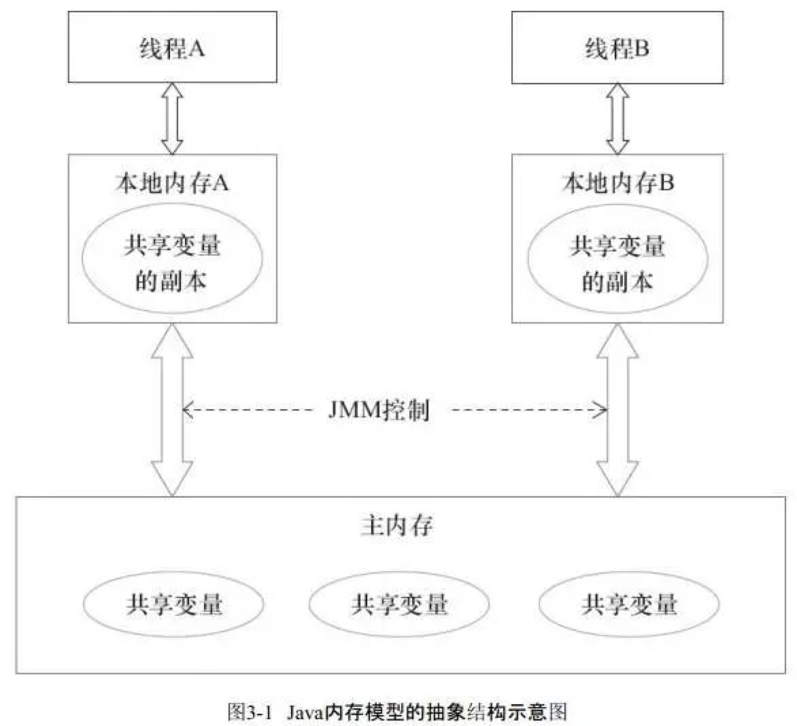

> version：2022/07/
>
> review：


目录

[TOC]


# 关键词


# 一、前置知识

不论什么样的库，或者项目，都是有不同的基础知识点组织起来的，因此先掌握基础是很有必要的。

基础知识这块可以不写。

# 一、概述


二、可见性问题

先看如下示例：

```kotlin
class Test {
    var flag = true

    fun spin() {
        while (flag) {
        }
    }
}

    @Test
    fun test() {
        val test = com.lizw.javaapidemos.Test()
        Thread {
            Thread.sleep(1000L)
            test.flag = false
            println("t-" + test.flag)
        }.start()
        test.spin()
        println("end?")
    }
```

这个程序不会停止运行。

因为



所以在另一个线程中，去修改flag的值，并不会影响到while循环，在mian线程中，flag始终是true。解决方式就是给flag加上volatile关键字。


# 相关问题

<font color='orange'>Q：volatile的作用？</font>


<font color='orange'>Q：</font>


<font color='orange'>Q：</font>


<font color='orange'>Q：</font>


<font color='orange'>Q：</font>


<font color='orange'>Q：</font>


<font color='orange'>Q：</font>


# 总结

1、

## 【精益求精】我还能做（补充）些什么？

1、


# 脑图


# 参考

