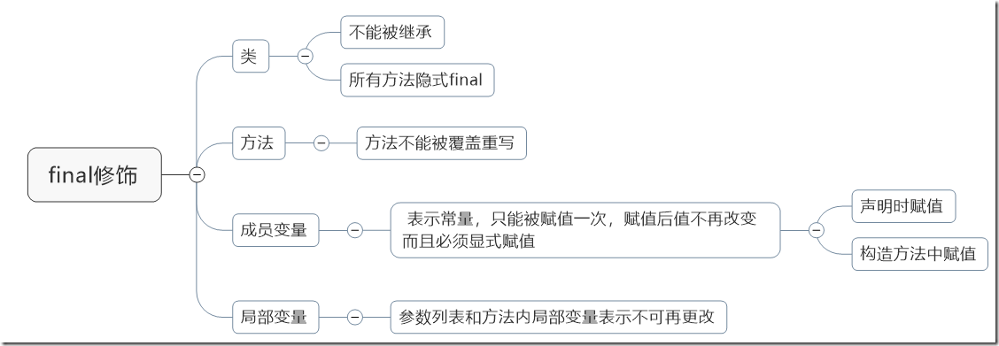

> version：2021/10/
>
> review：

原文地址:[ final 关键字与安全发布 多线程中篇（十三）](https://www.cnblogs.com/noteless/p/10416678.html)

目录

[TOC]

# final的通常理解

在Java中，final关键字可以用来修饰类、方法和变量（包括成员变量和局部变量）

大家应该都知道final表示最终的、最后的含义，也就是不能在继续

修饰类表示不能继承，修饰方法表示不能重写，修饰变量表示不能修改

当用final修饰一个类时，表明这个类不能被继承。也就是说，如果一个类你永远不会让他被继承，就可以用final进行修饰

注意：final类中的所有成员方法都会被隐式地指定为final方法（也可以认为不能够继承就是因为所有的方法你都不能继承，所以全部方法隐式final)

当final修饰方法时，表示此方法不能被重写，也就是不能被子类覆盖（但是毫不影响多个重载的final方法，重载和重写不是一个概念）

**注意：**

**如果是final并且private的方法，子类是看不到private的，所以如果子类新写了一个看似“重写”的方法，其实是属于子类的新方法，这并不是重写了final方法**

当final修饰变量时，相当于一个只读变量，只能进行读取，而不能进行设置，如果是成员变量那么需要在赋值时或者构造方法中对他进行设置。

局部变量必须是定义时，参数列表中的就是参数传递时，其他时候不能再进行更改了

综上，final的通常认知就是这些，表示最终的、最后的、不可变得，可以用于定义类、方法、变量

其实final还有另外的作用，那就是安全发布对象的一种方法

什么是安全发布？

### 安全发布

两个关键字“发布”“安全”

所谓发布通俗一点的理解就是创建一个对象，使这个对象能被当前范围之外的代码所使用

比如Object o = new Object();

然后接下来使用对象o

但是对于普通变量的创建，之前分析过，大致分为三个步骤：

- 分配内存空间
- 将o指向分配的内存空间
- 调用构造函数来初始化对象

这三个步骤不是原子的，如果执行到第二步，还没有进行初始化，此时对象已经不是null了，如果被其他代码访问，这将收获一个错误的结果。

**或者说对象尚未完全创建就被使用了，其他线程看到的结果可能是不一致的**

这就是**不安全的发布**

根本原因就是JVM创建对象的过程涉及到分配空间、指针设置、数据初始化等步骤，并不是同步的，涉及到主存与缓存、处理器与寄存器等，可见性没办法得到保障

 

所以说，什么是安全发布，简单理解就是对象的创建能够保障在被别人使用前，已经完成了数据的构造设置，或者说一个对象在使用时，已经完成了初始化。

不幸的是，Java对此并没有进行保障，你需要自己进行保障，比如synchronized关键字，原子性、排他性就可以做到这一点

**怎么保障安全发布？有几种方法：**

一种是刚才提到的锁机制，通过加锁可以保障中间状态不会被读取

另外还有：

- 借助于volatile或者AtomicReference声明对象
- 借助于final关键字
- 在静态初始化块中，进行初始化（JVM会保障）

很显然，对于锁机制，那些线程安全的容器比如ConcurrentMap，也是满足这条的，所以也是安全发布 

### final与安全发布

**对于final，当你创建一个对象时，使用final关键字能够使得另一个线程不会访问到处于“部分创建”的对象**

因为：当构造函数退出时，final字段的值保证对访问构造对象的其他线程可见

如果某个成员是final的，JVM规范做出如下明确的保证：

**一旦对象引用对其他线程可见，则其final成员也必须正确的赋值**

**所以说借助于final，就如同你对对象的创建访问加锁了一般，天然的就保障了对象的安全发布。**

如果你不希望后续被继承、重写、更改，你应该尽可能的将他们声明为final

一篇很不错的文章：

https://www.javamex.com/tutorials/synchronization_final.shtml

对于普通的变量，对象的内存空间分配、指针设置、数据初始化，和将这个变量的引用赋值给另一个引用，之间是可能发生重排序的，所以也就导致了其他线程可能读取到不一致的中间状态

**但是对于final修饰的变量，JVM会保障顺序**

**不会在对final变量的写操作完成之前，与将变量引用赋值给其他变量之间进行重排序，也就是final变量的设置完成始终会在被读取之前** 

（1）被final关键字修饰的基本数据类型，则其数值一旦在初始化之后便不能更改;
（2）如果是引用类型的变量，则在对其初始化之后便不能再让其指向另一个对象,但该引用所指向的对象的内容是可以发生变化的。原因为：引用数据类型存储的引用对象在堆内存中的地址，final修饰引用类型之后，要求该引用指向的堆内存空间（或者说该引用存储的堆内存地址）不能改变。

当用final修饰类的静态成员变量时，静态成员变量的初始化方式也有两种：
（5）在声明时进行初始化
（6）在静态初始化块中进行初始化
当用final修饰接口的静态变量时，其初始化方式只有一种：

（7）在声明时进行初始化

**final修饰参数**

修饰基本数据类型：在方法内，不能修改其值。

修饰引用类型：该引用不能指向其他对象或赋值为null，但可以修改引用对象的内容。

final用于修饰参数的目的并非防止在调用的方法内部对参数的操作改变方法外部对应变量的值，只是防止在该方法内对该参数进行重新赋值操作，影响该参数传递时的初始值。

### 总结

final除了不可变的定义之外，还与线程安全发布息息相关

借助于final，可以达到对象安全发布的保障，只需要借助于final，不在需要任何额外的付出，他能够保障在多线程环境下，总是能够读取到正确的初始化的值

所以，如果你不希望变量后续被修改，你应该总是使用final关键字

而且，很显然在某些场景下，final也可以解决一定的安全问题

# 相关问题

Q：

Q：

Q：

Q：

Q：

Q：

Q：

# 总结

1、

## 【精益求精】我还能做（补充）些什么？

1、

# 参考

