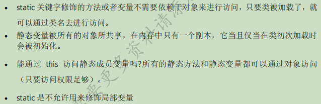

> version：2021/10/
>
> review：

可选：[原文地址](https://developer.android.google.cn/guide/fragments/create)

目录

[TOC]

# 一、static

1、static修饰的方法或者变量不需要依赖于对象来进行访问，只要类被加载了，就可以通过类名去进行访问。

2、静态变量被所有的对象共享，在内存中只有一个副本，它当且仅当类初次加载时会被初始化。

3、能通过 this 访问静态成员吗？所有的静态方法和静态变量都可以通过对象访问。（访问权限要够）

4、static不能用来修饰局部变量

# 相关问题

## 一、static

Q：static编译时有啥不同,static语句块,static变量,static方法,构造初始化顺序(静态绑定)

Q：static方法可以被覆盖吗？为什么？

Q：  private和static修饰的方法可以重写吗；

private 和 static 方法是和其他类没有任何关系，是可以重写的。

# 参考

