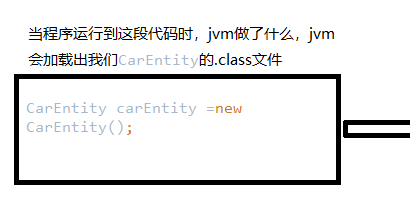
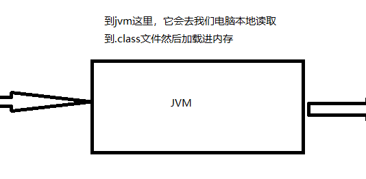
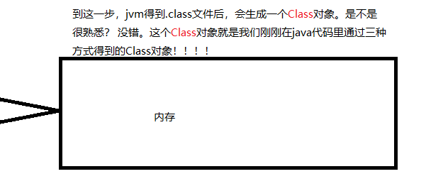

> version：2021/10/
>
> review：

可选：[原文地址](https://developer.android.google.cn/guide/fragments/create)

目录

[TOC]

# 一、什么是反射

反射是框架的灵魂。

JAVA反射机制是在运行状态中，对于任意一个类，都能够知道这个类的所有属性和方法；对于任意一个对象，都能够调用它的任意一个方法和属性；这种动态获取的信息以及动态调用对象的方法的功能称为java语言的反射机制。

要想解剖一个类,必须先要获取到该类的字节码文件对象。而解剖使用的就是Class类中的方法.所以先要获取到每一个字节码文件对应的Class类型的对象.

在java中获取字节文件的方式有三种
1.Object ——> getClass();
2 .任何数据类型（包括基本数据类型）都有一个“静态”的class属性
3 .通过Class类的静态方法：forName（String className）(常用)

```java
 		//方法一
        Class<CarEntity> carEntityClass0 = CarEntity.class;

        //方法二
        CarEntity carEntity =new CarEntity();
        Class carEntityClass1 =carEntity.getClass();

        //方法三
        Class carEntityClass2 = Class.forName("com.example.demo3.Entity.CarEntity");

        //判断获取到同一个类的Class对象是否是同一个
        System.out.println(carEntityClass0 == carEntityClass1);
        System.out.println(carEntityClass1 == carEntityClass2);
        System.out.println(carEntityClass0 == carEntityClass2);

```

上面的例子得到的结果，是三个true，由此我们得到了第一个定理：
**在运行期间，一个类，只有一个Class对象产生**

三种方式常用第三种，第一种对象都有了还要反射干什么。第二种需要导入类的包，依赖太强，不导包就抛编译错误。一般都第三种，一个字符串可以传入也可写在配置文件中等多种方法（框架中都是用的第三种）。

好，现在我们得到了Class对象了，又有什么用呢，Class对象是什么呢，能做什么呢？

在此之前我们先了解一下正常情况下我们new一个对象的时候，jvm底层做了什么事情。

首先要搞明白一件事情，jvm能读懂我们的java代码吗？不能！
那jvm是靠读取什么东西来运行程序的呢？.class文件！







也就是说，我们现在可以不通过JVM的编译直接获取到jvm运行时需要的Class对象！
也就是说！我们是不是可以通过对Class对象进行修改而改变CarEntity这个类原本在jvm里运行的逻辑！从而达到一系列不可告人的目的呢！?

没错，我们可以，这就像同桌张三把作业给我让我帮忙交给老师，然后我直接把他的作业全部撕了然后告诉老师（JVM）：张三这个崽种没做作业！（这是后面要讲的代理模式）。在当前的反射篇章我们可以理解为，我可以得到张三的作业的所有答案，然后我拿着自己用！

好，例子来了，顺便我们熟悉一下Class对象的常用API，

先看看我们的实体类是什么样子的

```java
	//一个public 属性
    public String name;

	//一个private 属性
    private String price;

	//一个public 构造方法
    public CarEntity(String name, String price) {
        this.name = name;
        this.price = price;
    }
    
	//一个private 构造方法
    private CarEntity(String name){
        this.name = name;
    }


	//以下全都是public 的GET，SET方法
    public String getName() {
        return name;
    }

    public void setName(String name) {
        this.name = name;
    }

    public String getPrice() {
        return price;
    }

    public void setPrice(String price) {
        this.price = price;
    }
```

**开始测试！**

```java
    public static void main(String[] args) throws Exception {
        //获取CarEntity的Class对象
        Class carEntityClass = Class.forName("com.example.demo3.Entity.CarEntity");

        System.out.println("获取所有的Public的成员变量");
        Field[] field = carEntityClass.getFields();
        for (Field field1 : field) {
            System.out.println(field1.getName());
        }
        System.out.println("获取所有的的成员变量，不管你是Public,Private,Protected还是Default ");
        Field[] field01 = carEntityClass.getDeclaredFields();
        for (Field field1 : field01) {
            System.out.println(field1.getName());
        }
    }
```

看看结果是什么

```java
获取所有的Public的成员变量
name
获取所有的的成员变量，不管你是Public,Private,Protected还是Default 
name
price
```

**好，再来一个**

```java
        System.out.println("获取所有的Public的构造方法");
        Constructor[] constructors = carEntityClass.getConstructors();
        for (Constructor constructor1 : constructors) {
            System.out.println(constructor1);
        }
        System.out.println("获取所有的的构造方法，不管你是Public,Private,Protected还是Default ");
        Constructor[] constructors01 = carEntityClass.getDeclaredConstructors();
        for (Constructor constructor1 : constructors01) {
            System.out.println(constructor1);
        }
```

结果：

```java
获取所有的Public的构造方法
public com.example.demo3.Entity.CarEntity(java.lang.String,java.lang.String)
获取所有的的构造方法，不管你是Public,Private,Protected还是Default 
public com.example.demo3.Entity.CarEntity(java.lang.String,java.lang.String)
private com.example.demo3.Entity.CarEntity(java.lang.String)
```

**发现了没？我们现在只需要一个类的全路径，我们就可以掌握这个类的所有情况！**

上面的例子我们也发现了Class对象的APi的规律，只要加了Declared的Get方法，我们就能够“非法”地获取到这个类的编写者本来不愿意公布出来的属性！

当然我们还可以获取到这个类的所有普通方法：

```java
        System.out.println("获取所有的方法");
        Method[] methods = carEntityClass.getMethods();
        for (Method method : methods) {
            System.out.println(method.getName());
        }
```

```Java
获取所有的方法
getName
setName
getPrice
setPrice
wait
wait
wait
equals
toString
hashCode
getClass
notify
notifyAll
```

**我们再继续深入一点点！大家耐心看！**

我们先给我们的Car类补上刚刚忘掉的无参构造方法

```Java
public CarEntity() {

    }
```

然后开始我们的测试！**（是干嘛呢？通过反射调用目标类的方法！）**

```java
 //获取CarEntity的Class对象
        Class<?> carEntityClass = Class.forName("com.example.demo3.Entity.CarEntity");
        //通过Class对象获取到具体的CarEntity实例（需要无参构造方法！！！！）
        CarEntity carEntity = (CarEntity)carEntityClass.newInstance();

        System.out.println("获取SetName方法");
        //第一个参数：方法名称，第二个参数：方法形参的类型
        Method method = carEntityClass.getDeclaredMethod("setName",String.class);
        //第一个参数，对象类型carEntity，第二个参数是我这里调用方法时传的参数
        method.invoke(carEntity,"张三");

        System.out.println("获取getName方法");
        Method method2 = carEntityClass.getDeclaredMethod("getName",null);
        String name = (String) method2.invoke(carEntity,null);
        System.out.println(name);
```

```java
获取SetName方法
获取getName方法
张三
```

**就问你可不可怕？？**

**大家可能还没意识到发生了什么。我们现在居然只通过一个类的路径，获取到了这个类的所有信息，并且还能调用他的所有方法！！！我现在感觉我在犯法。但不可否的是他的强大！**

现在是不是大概明白了，为什么一开始说反射是框架的灵魂。举个最简单的例子，Spring的注解式事务是怎么实现的？？ 现在我们大概可以猜猜了：

1.通过注解，我们在项目启动的时候可以获取所有打了注解的类或方法
2.通过反射，我们可以获取类的所有信息或方法的所有信息
3.通过反射，我们可以在方法的前后加上事务回滚相关的代码，然后通过上面例子中的invoke方法调用目标方法
4.这个过程我不需要知道你这些类或方法是干嘛的，你的一切与我无关

框架就是这样诞生的，关于静态代理和动态代理。


# 相关问题

<font color='orange'>Q：了解反射吗？为什么要使用反射？</font>

反射可以在运行时动态的加载一个类，并获取它的属性和方法，在框架中是非常常用的。

> 为什么要使用反射还不是很理解。

<font color='orange'>Q：反射如何实现</font>

反射是通过类名来获取Class对象，进而可以创建对象已经调用类中的方法。

<font color='orange'>Q：说说反射的应用场景，哪些框架，原理是什么？</font>


<font color='orange'>Q：为什么说反射的性能不好</font>

java反射需要将内存中的对象进行解析，涉及到与底层c语言的交互，速度会比较慢。
java反射得到的每一个Method都有一个root，不暴漏给外部，而是每次copy一个Method。具体的反射调用逻辑是委托给MethodAccessor的，而accessor对象会在第一次invoke的时候才创建，是一种lazy init方式。而且默认Class类会cache method对象。目前MethodAccessor的实现有两种，通过设置inflation，一个native方式，一种生成java bytecode方式。native方式启动快，但运行时间长了不如java方式，个人感觉应该是java方式运行长了,jit compiler可以进行优化。所以JDK6的实现，在native方式中，有一个计数器，当调用次数达到阀值，就会转为使用java方式。默认值是15。java方式的实现，基本和非反射方式相同。

[反射的性能差在哪里？](https://www.jianshu.com/p/93898afeb358)

1. Method#invoke 方法会对参数做封装和解封操作
2. 需要检查方法可见性
3. 需要校验参数
4. 反射方法难以内联
5. JIT 无法优化


# 前言

- 在 `Java`中，反射机制（`Reflection`）非常重要，但对于很多开发者来说，这并不容易理解，甚至觉得有点神秘
- 今天，我将献上一份 **`Java`反射机制的介绍 & 实战攻略**，希望你们会喜欢。

# 目录


# 1. 简介

- 定义：`Java`语言中 一种 **动态（运行时）**访问、检测 & 修改它本身的能力
- 作用：动态（运行时）获取**类的完整结构信息   & 调用对象的方法**

> 1. 类的结构信息包括：变量、方法等
> 2. 正常情况下，`Java`类在编译前，就已经被加载到`JVM`中；而反射机制使得程序运行时还可以动态地去操作类的变量、方法等信息

# 2. 特点

### 2.1 优点

灵活性高。因为**反射属于动态编译**，即只有到运行时才动态创建 &获取对象实例。

> 编译方式说明：
>
> 1. 静态编译：在编译时确定类型 & 绑定对象。如常见的使用`new`关键字创建对象
> 2. 动态编译：运行时确定类型 & 绑定对象。动态编译体现了`Java`的灵活性、多态特性 & 降低类之间的藕合性

### 2.2 缺点

- 执行效率低
   因为反射的操作 主要通过`JVM`执行，所以时间成本会 **高于** 直接执行相同操作

> 1. 因为接口的通用性，Java的invoke方法是传object和object[]数组的。基本类型参数需要装箱和拆箱，产生大量额外的对象和内存开销，频繁促发GC。
> 2. 编译器难以对动态调用的代码提前做优化，比如方法内联。
> 3. 反射需要按名检索类和方法，有一定的时间开销。

- 容易破坏类结构
   因为反射操作饶过了源码，容易干扰类原有的内部逻辑

# 3. 应用场景

- 动态获取 **类文件结构信息（如变量、方法等） & 调用对象的方法**
- 常用的需求场景有：动态代理、工厂模式优化、`Java JDBC`数据库操作等

> 下文会用实际例子详细讲解

# 4. 具体使用

### 4.1 `Java`反射机制提供的功能


### 4.2 实现手段

- 反射机制的实现 主要通过 **操作`java.lang.Class`类**
- 下面将主要讲解 `java.lang.Class` 类

##### 4.2.1 java.lang.Class 类

- 定义：`java.lang.Class`类是反射机制的基础
- 作用：存放着对应类型对象的 **运行时信息**

> 1. 在`Java`程序运行时，`Java`虚拟机为所有类型维护一个`java.lang.Class`对象
> 2. 该`Class`对象存放着所有关于该对象的 **运行时信息**
> 3. 泛型形式为`Class<T>`

- 每种类型的`Class`对象只有1个 = 地址只有1个

```csharp
// 对于2个String类型对象，它们的Class对象相同
Class c1 = "Carson".getClass();
Class c2 =  Class.forName("java.lang.String");
// 用==运算符实现两个类对象地址的比较
System.out.println(c1 ==c2);
// 输出结果：true
```

- `Java`反射机制的实现除了依靠`Java.lang.Class`类，还需要依靠：`Constructor`类、`Field`类、`Method`类，分别作用于类的各个组成部分：


### 4.3 使用步骤

在使用`Java`反射机制时，主要步骤包括：

1. 获取 目标类型的`Class`对象
2. 通过 `Class` 对象分别获取`Constructor`类对象、`Method`类对象 & `Field` 类对象
3. 通过 `Constructor`类对象、`Method`类对象 & `Field`类对象分别获取类的构造函数、方法&属性的具体信息，并进行后续操作

下面，我将详细讲解每个步骤中的使用方法。

**步骤1：获取 目标类型的`Class`对象**

```kotlin
// 获取 目标类型的`Class`对象的方式主要有4种

<-- 方式1：Object.getClass() -->
    // Object类中的getClass()返回一个Class类型的实例 
    Boolean carson = true; 
    Class<?> classType = carson.getClass(); 
    System.out.println(classType);
    // 输出结果：class java.lang.Boolean  

<-- 方式2：T.class 语法    -->
    // T = 任意Java类型
    Class<?> classType = Boolean.class; 
    System.out.println(classType);
    // 输出结果：class java.lang.Boolean  
    // 注：Class对象表示的是一个类型，而这个类型未必一定是类
    // 如，int不是类，但int.class是一个Class类型的对象

<-- 方式3：static method Class.forName   -->
    Class<?> classType = Class.forName("java.lang.Boolean"); 
    // 使用时应提供异常处理器
    System.out.println(classType);
    // 输出结果：class java.lang.Boolean  

<-- 方式4：TYPE语法  -->

    Class<?> classType = Boolean.TYPE; 
    System.out.println(classType);
    // 输出结果：boolean  
```

此处额外讲一下`java.lang.reflect.Type`类

- `java.lang.reflect.Type`是 `Java`中所有类型的父接口
- 这些类型包括:


- 之间的关系如下


**步骤2：通过 `Class` 对象分别获取`Constructor`类对象、`Method`类对象 & `Field` 类对象**

```rust
// 即以下方法都属于`Class` 类的方法。

<-- 1. 获取类的构造函数（传入构造函数的参数类型）->>
  // a. 获取指定的构造函数 （公共 / 继承）
  Constructor<T> getConstructor(Class<?>... parameterTypes)
  // b. 获取所有的构造函数（公共 / 继承） 
  Constructor<?>[] getConstructors(); 
  // c. 获取指定的构造函数 （ 不包括继承）
  Constructor<T> getDeclaredConstructor(Class<?>... parameterTypes) 
  // d. 获取所有的构造函数（ 不包括继承）
  Constructor<?>[] getDeclaredConstructors(); 
// 最终都是获得一个Constructor类对象

// 特别注意：
  // 1. 不带 "Declared"的方法支持取出包括继承、公有（Public） & 不包括有（Private）的构造函数
  // 2. 带 "Declared"的方法是支持取出包括公共（Public）、保护（Protected）、默认（包）访问和私有（Private）的构造方法，但不包括继承的构造函数
  // 下面同理

<--  2. 获取类的属性（传入属性名） -->
  // a. 获取指定的属性（公共 / 继承）
   Field getField(String name) ;
  // b. 获取所有的属性（公共 / 继承）
   Field[] getFields() ;
  // c. 获取指定的所有属性 （不包括继承）
   Field getDeclaredField(String name) ；
  // d. 获取所有的所有属性 （不包括继承）
   Field[] getDeclaredFields() ；
// 最终都是获得一个Field类对象

<-- 3. 获取类的方法（传入方法名 & 参数类型）-->
  // a. 获取指定的方法（公共 / 继承）
    Method getMethod(String name, Class<?>... parameterTypes) ；
  // b. 获取所有的方法（公共 / 继承）
   Method[] getMethods() ；
  // c. 获取指定的方法 （ 不包括继承）
   Method getDeclaredMethod(String name, Class<?>... parameterTypes) ；
  // d. 获取所有的方法（ 不包括继承）
   Method[] getDeclaredMethods() ；
// 最终都是获得一个Method类对象

<-- 4. Class类的其他常用方法 -->
getSuperclass(); 
// 返回父类

String getName(); 
// 作用：返回完整的类名（含包名，如java.lang.String ） 
 
Object newInstance(); 
// 作用：快速地创建一个类的实例
// 具体过程：调用默认构造器（若该类无默认构造器，则抛出异常 
// 注：若需要为构造器提供参数需使用java.lang.reflect.Constructor中的newInstance（）
```

**步骤3：通过 `Constructor`类对象、`Method`类对象 & `Field`类对象分别获取类的构造函数、方法 & 属性的具体信息 & 进行操作**

```dart
// 即以下方法都分别属于`Constructor`类、`Method`类 & `Field`类的方法。

<-- 1. 通过Constructor 类对象获取类构造函数信息 -->
  String getName()；// 获取构造器名
  Class getDeclaringClass()；// 获取一个用于描述类中定义的构造器的Class对象
  int getModifiers()；// 返回整型数值，用不同的位开关描述访问修饰符的使用状况
  Class[] getExceptionTypes()；// 获取描述方法抛出的异常类型的Class对象数组
  Class[] getParameterTypes()；// 获取一个用于描述参数类型的Class对象数组

<-- 2. 通过Field类对象获取类属性信息 -->
  String getName()；// 返回属性的名称
  Class getDeclaringClass()； // 获取属性类型的Class类型对象
  Class getType()；// 获取属性类型的Class类型对象
  int getModifiers()； // 返回整型数值，用不同的位开关描述访问修饰符的使用状况
  Object get(Object obj) ；// 返回指定对象上 此属性的值
  void set(Object obj, Object value) // 设置 指定对象上此属性的值为value
 
<-- 3. 通过Method 类对象获取类方法信息 -->
  String getName()；// 获取方法名
  Class getDeclaringClass()；// 获取方法的Class对象 
  int getModifiers()；// 返回整型数值，用不同的位开关描述访问修饰符的使用状况
  Class[] getExceptionTypes()；// 获取用于描述方法抛出的异常类型的Class对象数组
  Class[] getParameterTypes()；// 获取一个用于描述参数类型的Class对象数组

<--额外：java.lang.reflect.Modifier类 -->
// 作用：获取访问修饰符

static String toString(int modifiers)   
// 获取对应modifiers位设置的修饰符的字符串表示

static boolean isXXX(int modifiers) 
// 检测方法名中对应的修饰符在modifiers中的值
```

至此，关于`Java`反射机制的步骤说明已经讲解完毕。

### 4.4 特别注意：访问权限问题

- 背景
   反射机制的默认行为受限于`Java`的访问控制

> 如，无法访问（ `private` ）私有的方法、字段

- 冲突
   Java安全机制只允许查看任意对象有哪些域，而不允许读它们的值

> 若强制读取，将抛出异常

- 解决方案
   脱离`Java`程序中安全管理器的控制、屏蔽Java语言的访问检查，从而脱离访问控制
- 具体实现手段：使用`Field类`、`Method类` & `Constructor`类对象的`setAccessible()`

```java
void setAccessible(boolean flag)    
// 作用：为反射对象设置可访问标志
// 规则：flag = true时 ，表示已屏蔽Java语言的访问检查，使得可以访问 & 修改对象的私有属性

boolean isAccessible()  
// 返回反射对象的可访问标志的值

static void setAccessible(AccessibleObject[] array, boolean flag)   
// 设置对象数组可访问标志
```

# 5. 实例应用讲解

### 5.1 基础应用讲解

##### 实例1：利用反射获取类的属性 & 赋值

```csharp
<-- 测试类定义-->
public class Student {

    public Student() {
        System.out.println("创建了一个Student实例");
    }
    private String name;
}

<-- 利用反射获取属性 & 赋值 -->
        // 1. 获取Student类的Class对象
        Class studentClass = Student.class;

        // 2. 通过Class对象创建Student类的对象
        Object mStudent = studentClass.newInstance();
   
        // 3. 通过Class对象获取Student类的name属性
        Field f = studentClass.getDeclaredField("name");
 
        // 4. 设置私有访问权限
        f.setAccessible(true);

        // 5. 对新创建的Student对象设置name值
        f.set(mStudent, "Carson_Ho");

        // 6. 获取新创建Student对象的的name属性 & 输出
        System.out.println(f.get(mStudent));
```

- 测试结果


image.png

- Demo地址
   [Carson_Ho的Github地址：Reflect_Demo1](https://links.jianshu.com/go?to=https%3A%2F%2Fgithub.com%2FCarson-Ho%2FReflect_Demo)

##### 实例2：利用反射调用类的构造函数

```kotlin
<-- 测试类定义-->

public class Student {

    // 无参构造函数
    public Student() {
        System.out.println("调用了无参构造函数");
    }

    // 有参构造函数
    public Student(String str) {
        System.out.println("调用了有参构造函数");
    }

    private String name;
}

<-- 利用反射调用构造函数 -->
        // 1. 获取Student类的Class对象
        Class studentClass studentClass = Student.class;

        // 2.1 通过Class对象获取Constructor类对象，从而调用无参构造方法
        // 注：构造函数的调用实际上是在newInstance()，而不是在getConstructor()中调用
        Object mObj1 = studentClass.getConstructor().newInstance();
      
        // 2.2 通过Class对象获取Constructor类对象（传入参数类型），从而调用有参构造方法
        Object mObj2 = studentClass.getConstructor(String.class).newInstance("Carson");
        
```

- 测试结果


Demo地址
[Carson_Ho的Github地址：Reflect_Demo2](https://links.jianshu.com/go?to=https%3A%2F%2Fgithub.com%2FCarson-Ho%2FReflect_Demo)

##### 实例3：利用反射调用类对象的方法

```java
<-- 测试类定义-->
public class Student {

    public Student() {
        System.out.println("创建了一个Student实例");
    }

    // 无参数方法
    public void setName1 (){
        System.out.println("调用了无参方法：setName1（）");
    }

    // 有参数方法
    public void setName2 (String str){
        System.out.println("调用了有参方法setName2（String str）:" + str);
    }
}

<-- 利用反射调用方法 -->
        // 1. 获取Student类的Class对象
        Class studentClass = Student.class;

        // 2. 通过Class对象创建Student类的对象
        Object  mStudent = studentClass.newInstance();

        // 3.1 通过Class对象获取方法setName1（）的Method对象:需传入方法名
        // 因为该方法 = 无参，所以不需要传入参数
        Method  msetName1 = studentClass.getMethod("setName1");

        // 通过Method对象调用setName1（）：需传入创建的实例
        msetName1.invoke(mStudent);

        // 3.2 通过Class对象获取方法setName2（）的Method对象:需传入方法名 & 参数类型
        Method msetName2 = studentClass.getMethod("setName2",String.class);

       // 通过Method对象调用setName2（）：需传入创建的实例 & 参数值
        msetName2.invoke(mStudent,"Carson_Ho");
    
```

- 测试结果


- Demo地址
   [Carson_Ho的Github地址：Reflect_Demo3](https://links.jianshu.com/go?to=https%3A%2F%2Fgithub.com%2FCarson-Ho%2FReflect_Demo)

### 5.2 常见需求场景讲解

### 实例1：工厂模式优化

- 背景
   采用简单工厂模式
- 冲突
  1. 操作成本高：每增加一个接口的子类，必须修改工厂类的逻辑
  2. 系统复杂性提高：每增加一个接口的子类，都必须向工厂类添加逻辑

关于 简单工厂模式的介绍 & 使用 请看文章：[简单工厂模式（SimpleFactoryPattern）- 最易懂的设计模式解析](https://www.jianshu.com/p/e55fbddc071c)

- 解决方案
   采用反射机制： **通过 传入子类名称 & 动态创建子类实例，从而使得在增加产品接口子类的情况下，也不需要修改工厂类的逻辑**

- 实例演示

**步骤1. 创建抽象产品类的公共接口**

*Product.java*

```csharp
abstract class Product{
    public abstract void show();
}
```

**步骤2. 创建具体产品类（继承抽象产品类），定义生产的具体产品**

```java
<-- 具体产品类A：ProductA.java -->
public class  ProductA extends  Product{

    @Override
    public void show() {
        System.out.println("生产出了产品A");
    }
}

<-- 具体产品类B：ProductB.java -->
public class  ProductB extends  Product{

    @Override
    public void show() {
        System.out.println("生产出了产品B");
    }
}
```

**步骤3. 创建工厂类**

*Factory.java*

```csharp
public class Factory {

    // 定义方法：通过反射动态创建产品类实例
    public static Product getInstance(String ClassName) {

        Product concreteProduct = null;

        try {
            
            // 1. 根据 传入的产品类名 获取 产品类类型的Class对象
            Class product_Class = Class.forName(ClassName);
            // 2. 通过Class对象动态创建该产品类的实例
            concreteProduct = (Product) product_Class.newInstance();

        } catch (Exception e) {
            e.printStackTrace();
        }
        
        // 3. 返回该产品类实例
        return concreteProduct;
    }
    
}
```

**步骤4：外界通过调用工厂类的静态方法（反射原理），传入不同参数从而创建不同具体产品类的实例**

*TestReflect.java*

```java
public class TestReflect {
    public static void main(String[] args) throws Exception {

       // 1. 通过调用工厂类的静态方法（反射原理），从而动态创建产品类实例
        // 需传入完整的类名 & 包名
        Product concreteProduct = Factory.getInstance("scut.carson_ho.reflection_factory.ProductA");

        // 2. 调用该产品类对象的方法，从而生产产品
        concreteProduct.show();
    }
}
```

- 展示结果


- Demo地址
   [Carson_Ho的Github地址：Reflection_Factory1](https://links.jianshu.com/go?to=https%3A%2F%2Fgithub.com%2FCarson-Ho%2FReflection_Factory)

如此一来，**通过采用反射机制（通过 传入子类名称 & 动态创建子类实例）**，从而使得在增加产品接口子类的情况下，也不需要修改工厂类的逻辑 & 增加系统复杂度

### 实例2：应用了反射机制的工厂模式再次优化

- 背景
   在上述方案中，通过调用工厂类的静态方法（反射原理），从而动态创建产品类实例（该过程中：需传入完整的类名 & 包名）
- 冲突
   开发者 **无法提前预知** 接口中的子类类型 & 完整类名
- 解决方案
   通过 **属性文件的形式（ `Properties`）** 配置所要的子类信息，在使用时直接读取属性配置文件从而获取子类信息（完整类名）
- 具体实现

**步骤1：创建抽象产品类的公共接口**

*Product.java*

```csharp
abstract class Product{
    public abstract void show();
}
```

**步骤2. 创建具体产品类（继承抽象产品类），定义生产的具体产品**

```java
<-- 具体产品类A：ProductA.java -->
public class  ProductA extends  Product{

    @Override
    public void show() {
        System.out.println("生产出了产品A");
    }
}

<-- 具体产品类B：ProductB.java -->
public class  ProductB extends  Product{

    @Override
    public void show() {
        System.out.println("生产出了产品B");
    }
}
```

**步骤3. 创建工厂类**

*Factory.java*

```csharp
public class Factory {

    // 定义方法：通过反射动态创建产品类实例
    public static Product getInstance(String ClassName) {

        Product concreteProduct = null;

        try {
            
            // 1. 根据 传入的产品类名 获取 产品类类型的Class对象
            Class product_Class = Class.forName(ClassName);
            // 2. 通过Class对象动态创建该产品类的实例
            concreteProduct = (Product) product_Class.newInstance();

        } catch (Exception e) {
            e.printStackTrace();
        }
        
        // 3. 返回该产品类实例
        return concreteProduct;
    }
    
}
```

**步骤4：创建属性配置文件**
 *Product.properties*

```cpp
// 写入抽象产品接口类的子类信息（完整类名）
ProductA = scut.carson_ho.reflection_factory.ProductA
ProductB = scut.carson_ho.reflection_factory.ProductB
```

**步骤5：将属性配置文件 放到`src/main/assets`文件夹中**

> 若没`assets`文件夹，则自行创建

**步骤6：在动态创建产品类对象时，动态读取属性配置文件从而获取子类完整类名**
 *TestReflect.java*

```java
public class TestReflect {
    public static void main(String[] args) throws Exception {

        // 1. 读取属性配置文件
        Properties pro = new Properties() ;
        pro.load(this.getAssets().open("Product.properties"));
            
        // 2. 获取属性配置文件中的产品类名
        String Classname = pro.getProperty("ProductA");
        
        // 3. 动态生成产品类实例
        Product concreteProduct = Factory.getInstance(Classname);

        // 4. 调用该产品类对象的方法，从而生产产品
        concreteProduct.show();

}
```

- 测试结果


- Demo地址
   [Carson_Ho的Github地址：Reflection_Factory2](https://links.jianshu.com/go?to=https%3A%2F%2Fgithub.com%2FCarson-Ho%2FReflection_Factory)

### 实例3：动态代理

通过反射机制实现动态代理，具体请看文章：[Carson带你学设计模式：动态代理模式（Proxy Pattern）](https://www.jianshu.com/p/5dc416ea58a2)

# 6. 总结

本文全面讲解了`Java`反射机制（`Reflection`）的相关知识，相信您对`Java`反射机制已经非常了解


# 反射真的慢吗？

> 一直以来都在说反射慢，但是根本没有具体测试过，也没感受过

参考：https://www.jianshu.com/p/4e2b49fa8ba1

> 是的，很慢！

下图是一亿次循环的耗时：

- 直接调用 100000000 times using 36 ms
- 原生反射(只invoke) 100000000 times using 325 ms
- 原生反射(只getMethod) 100000000 times using 11986 ms
- 原生反射(缓存Method) 100000000 times using 319 ms
- 原生反射(没有缓存Method) 100000000 times using 12169 ms
- reflectAsm反射优化(缓存Method) 100000000 times using 43 ms
- reflectAsm反射优化(没有缓存Method)  100000000 times using 131788 ms

> 没有一个可以比 **直接调用** 更快的。

- **原生反射(没有缓存Method)** 大概比 **直接调用** 慢了 **340倍**
- **原生反射(缓存Method)** 大概比 **直接调用** 慢了 **9倍**

# 怎么优化速度？

反射的速度差异只在大量连续使用才能明显看出来，理论上100万次才会说反射很慢，对于一个单进单出的请求来说，反射与否根本差不了多少。

> 这样就没必要优化了吗，并不是。

事实上各大框架注解，甚至业务系统中都在使用反射，不能因为慢就不用了。
在后台Controller中序列化请求响应信息大量使用注解，高并发就意味着连续百万级别调用反射成为可能，各大MVC框架都会着手解决这个问题，优化反射。

反射核心的是getMethod和invoke了，分析下两者的耗时差距，在一亿次循环下的耗时。

```java
Method getName = SimpleBean.class.getMethod("getName");
getName.invoke(bean);

原生反射(只invoke) 100000000 times using 221 ms
原生反射(只getMethod) 100000000 times using 12849 ms
```

##### 优化思路1：缓存Method，不重复调用getMethod

证明getMethod很耗时，所以说我们要优先优化getMethod，看看为什么卡？

```java
Method getName = SimpleBean.class.getMethod("getName");
//查看源码
Method res =  privateGetMethodRecursive(name, parameterTypes, includeStaticMethods, interfaceCandidates);
//再看下去
private native Field[]       getDeclaredFields0(boolean publicOnly);
private native Method[]      getDeclaredMethods0(boolean publicOnly);
private native Constructor<T>[] getDeclaredConstructors0(boolean publicOnly);
private native Class<?>[]   getDeclaredClasses0();
```

getMethod最后直接调用native方法，无解了。想复写优化getMethod是不可能的了，官方没毛病。
 但是我们可以不需要每次都getMethod啊，我们可以缓存到redis，或者放到Spring容器中，就不需要每次都拿了。

```java
//通过Java Class类自带的反射获得Method测试，仅进行一次method获取
    @Test
    public void javaReflectGetOnly() throws IllegalAccessException, NoSuchMethodException, InvocationTargetException {
        Method getName = SimpleBean.class.getMethod("getName");
        Stopwatch watch = Stopwatch.createStarted();
        for (long i = 0; i < times; i++) {
            getName.invoke(bean);
        }
        watch.stop();
        String result = String.format(formatter, "原生反射+缓存Method", times, watch.elapsed(TimeUnit.MILLISECONDS));
        System.out.println(result);
    }
```

- 原生反射(缓存Method) 100000000 times using 319 ms
- 原生反射(没有缓存Method) 100000000 times using 12169 ms

> 缓存Method大概快了38倍，离原生调用还差个9倍，所以我们继续优化invoke。

##### 优化思路2：使用reflectAsm，让invoke变成直接调用

我们看下invoke的源码：

```java
getName.invoke(bean);
//查看源码
private static native Object invoke0(Method var0, Object var1, Object[] var2);
```

尴尬，最后还是native方法，依然没毛病。
 invoke不像getMethod可以缓存起来重复用，没法优化。

所以这里需要引入ASM，并做了个工具库reflectAsm：
 参考：https://blog.csdn.net/zhuoxiuwu/article/details/78619645，https://github.com/EsotericSoftware/reflectasm

> “ASM 是一个 Java 字节码操控框架。它能被用来动态生成类或者增强既有类的功能。ASM 可以直接产生二进制 class 文件，也可以在类被加载入 Java 虚拟机之前动态改变类行为。Java class 被存储在严格格式定义的 .class 文件里，这些类文件拥有足够的元数据来解析类中的所有元素：类名称、方法、属性以及 Java 字节码（指令）。ASM 从类文件中读入信息后，能够改变类行为，分析类信息，甚至能够根据用户要求生成新类。”

使用如下：

```java
MethodAccess methodAccess = MethodAccess.get(SimpleBean.class);
methodAccess.invoke(bean, "getName");

//看看MethodAccess.get(SimpleBean.class)源码，使用了反射的getMethod】
Method[] declaredMethods = type.getDeclaredMethods();
```

参考：https://blog.csdn.net/z69183787/article/details/51657771
 invoke是没办法优化的，也没办法做到像直接调用那么快。所以大佬们脑洞大开，不用反射的invoke了。原理如下：

> - 借反射的getDeclaredMethods获取SimpleBean.class的所有方法，然后动态生成一个继承于MethodAccess 的子类SimpleBeanMethodAccess，动态生成一个Class文件并load到JVM中。
> - SimpleBeanMethodAccess中所有方法名建立index索引，index跟方法名是映射的，根据方法名获得index，SimpleBeanMethodAccess内部建立的switch直接分发执行相应的代码，这样methodAccess.invoke的时候，实际上是直接调用。

实际上reflectAsm是有个致命漏洞的，因为要生成文件，还得load进JVM，所以reflectAsm的getMethod特别慢：

- reflectAsm反射优化(没有缓存Method)  100000000 times using 131788 ms

虽然getMethod很慢，但是invoke的速度是到达了直接调用的速度了。

> 如果能够缓存method，那么reflectAsm的速度跟直接调用一样，而且能够使用反射！

- 直接调用 100000000 times using 36 ms
- reflectAsm反射优化(缓存Method) 100000000 times using 43 ms
- 这其中差的7ms，是reflectAsm生成一次Class文件的损耗。

下面是反射优化的测试样例：

```java
//通过高性能的ReflectAsm库进行测试，仅进行一次methodAccess获取
    @Test
    public void reflectAsmGetOnly() {
        MethodAccess methodAccess = MethodAccess.get(SimpleBean.class);
        Stopwatch watch = Stopwatch.createStarted();
        for (long i = 0; i < times; i++) {
            methodAccess.invoke(bean, "getName");
        }
        watch.stop();
        String result = String.format(formatter, "reflectAsm反射优化+缓存Method", times, watch.elapsed(TimeUnit.MILLISECONDS));
        System.out.println(result);
    }
```


# 参考

[java中的反射原理，为什么要使用反射以及反射使用场景](https://blog.csdn.net/J169YBZ/article/details/118755447?utm_medium=distribute.pc_relevant.none-task-blog-2~default~baidujs_title~default-1.no_search_link&spm=1001.2101.3001.4242.1)

[Carson带你学Java：这是一份全面&详细的Java反射学习指南](https://www.jianshu.com/p/356e1d7a9d11)
