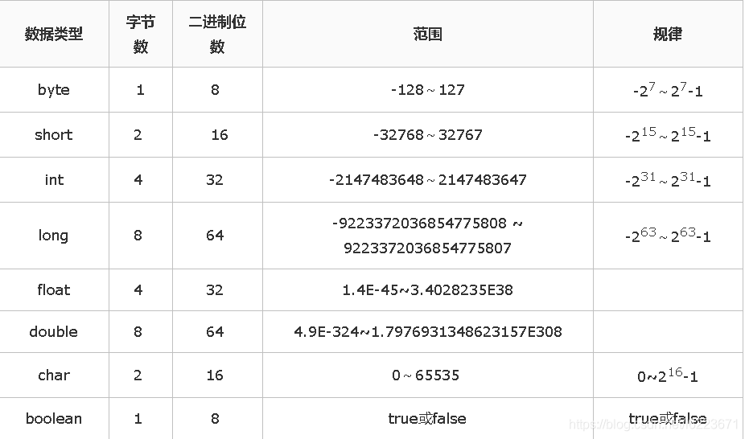

> version：2021/9/12
>
> review：


# 前言

- 在`Java`中，数据类型的使用通常会被很多开发者忽略
- 本文全面 & 详细解析 `Java`的数据类型，含基本数据类型、枚举类型 & 引用类型，希望您们会喜欢

------

# 目录


示意图

------

# 1. 分类

`Java`的数据类型主要分为：基本数据类型、枚举类型 & 引用数据类型

> 下面，我将详细介绍上述3种数据类型

------

# 2. 基本数据类型

`Java`的基本数据类型总共有8种：

- 整数类型：`byte`、`short`、`int`、`long`
- 浮点类型：`float`、`double`
- 字符类型：`char`
- 布尔类型：`boolean`

### 2.1 具体介绍


示意图

### 2.2 包装类

- `Java` = 面向对象编程语言
- 为了将基本数据类型当成对象操作，`Java`为每个基本数据类型都引入了对应的包装类型

> 从`Java 5`开始，引入了自动装箱/拆箱机制，使得二者可相互转换。

此处特别讲解： `int` 与 `Integer`的区别。具体描述如下：


示意图

- 使用比较时的区别


示意图

- 测试代码


```csharp
public static void main(String[] args) { 

    int a0=128;

    Integer a1=1; 
    Integer a2=1; 
 
    Integer b1=200; 
    Integer b2=200; 
 
    Integer c1=new Integer(1); 
    Integer c2=new Integer(1); 
 
    Integer d1=new Integer(200); 
    Integer d2=new Integer(200); 
    
    System.out.println("a1==a2?"+(a1==a2)); 
    System.out.println("b1==b2?"+(b1==b2)); 
    System.out.println("c1==c2?"+(c1==c2)); 
    System.out.println("d1==d2?"+(d1==d2)); 
    
    System.out.println("a0==a1?"+(a0==a1)); 
}

// 测试结果
a1==a2? true 
b1==b2? false 
c1==c2? false 
d1==d2? false
a0==a1? true

// 结果解析
对于第1组：均在[-128,127]中，故直接从缓存池中获取，即相等
对于第2组：均不在[-128,127]中，故直接通过new（）创建，即不相等
对于第3、4组：由于是直接通过new（）创建，即不相等
对于第5组：int和integer（无论是否通过new（）创建)比，都为true
```

### 2.3 相关操作方法


示意图

------

# 3. 枚举类型（enum）

### 3.1 定义

一组具名的值的有限集合

### 3.2 类型特点


示意图

、

------

# 4. 引用类型（reference）

### 4.1 定义

除了基本数据类型 & 枚举类型 外的所有类型

> 如类、接口、`String`类型等

### 4.2 类型特点

1. 引用类型变量 由类的构造函数创建
2. 作用：访问所引用的对象
3. 引用类型变量的引用类型一旦声明后，类型就不能被改变

> 这些变量在声明时，被指定为1个特定的类型

1. 引用类型的默认值 = `null`
2. 基本数据类型只能按值传递，而封装类按引用传递

至此，关于 `Java`的数据类型 讲解完毕。

------

# 5. 总结

本文全面 & 详细解析 `Java`的数据类型，含基本数据类型、枚举类型 & 引用类型。


<font color='orange'>Q1、基本的数据类型有哪些？</font>

byte、short、int、long，float，double、boolean、char

<font color='orange'>Q2、int与Integer的区别？</font>

int属于基本数据类型，可以直接使用，默认值为0（会直接存储数据的值）；

Integer是int的包装类，必须实例化才能使用，默认值为null（new一个Integer时，会生成一个指向此对象的引用，对象存放在堆中）。

Integer还可以直接赋值，比如Integer b1 = 127，会在java编译时转换成Integer b1 = Integer.valueOf(127)，对于-128到127之间的Integer值，用的是基本数据类型int，会在内存里重用，这之间的Integer值进行==比较时，是对int原生数据类型的数值进行比较。而超出-128〜127的范围，进行==比较时是进行地址（及数值）比较。

<font color='orange'>Q3、int的存储大小和范围？</font>

int类型占4个字节，共32位，因此最多表达2^32种int类型数据。又因为首位是符号位，所以int的取值范围是-2^31—2^31-1。

> 为什么要有符号位？

<font color='orange'>Q、java的数据类型，对应的包装类，自动装箱与拆箱？</font>

基本数据类型：byte、short、int、long，float，double、boolean、char

（包装类：  Byle、Short、Integer、Long、Float、Double、Boolean、Character）

引用数据类型：类、接口、数组、（枚举、注解）。

自动装箱和自动拆箱：

自动装箱是指，java会自动将基本数据类型转换成对应的包装类型。

自动拆箱是指，java会自动将包装类型转换成对应的基本数据类型。

以int和Integer为例，装箱的过程实际是调用了Integer.valueOf(99)方法。

拆箱调用的是Integer.intValue()方法。

（在实现上，可以分为两类：

Integer派别：Byte、Short、Integer、Long、Character，这几个类的valueOf方法的实现是类似的。在一定范围内复用。
Double派别：Double、Float的valueOf方法的实现是类似的。每次都返回不同的对象。）

<font color='orange'>Q、为什么使用包装类？</font>

 1.包装类是对基本数据的封装，其中提供了一些很实用的方法和常量。

比如，转换方法（string转int，int转string）。。。

以及一些常量，比如各种类型对应的取值范围（最大值、最小值）等。（Byte.MIN_VALUE是Byte类中的一个常量，存放了byte类型数据的最小值。）

  2.在使用集合的时候，通过包装类来制定元素的类型。

<font color='orange'>Q、char能否定义一个中文？</font>

可以。多个不行。

在Java中，默认使用Unicode编码，即每个字符占两个字节，每个中文也需要两个字节，因此可以用来存储中文。但是不能存储多个中文。

（String是由char所组成的，但是它采用了一种更加灵活的方式来存储，即英文占用一个字符，中文占用两个字符，采用这种存储方式的一个重要作用就是可以减少所需的存储空间，提高存储效率。）


### Java的8种基本数据类型及其所占空间大小




未入库题目：

Q：int、char、long各占多少字节数

byte/boolean占用1个字节，short\char占用2个字节，int\float占用4个字节，long\double占用8个字节。

基本数据类型存放在栈里，包装类栈里存放的是对象的引用，即值的地址，而值存放在堆里。

Q：string 转换成 integer的方式及原理

1）parseInt(String s)内部调用parseInt(s, 10)默认为10进制 。

2）正常判断null\进制范围，length等。

3）判断第一个字符是否是符号位。

4）循环遍历确定每个字符的十进制值。

5）通过*=和-=进行计算拼接。

6）判断是否为负值返回结果。


# 参考

[Carson带你学Java：关于数据类型的那些必知必会](https://www.jianshu.com/p/9e31d5214666)
