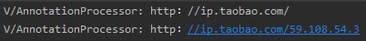
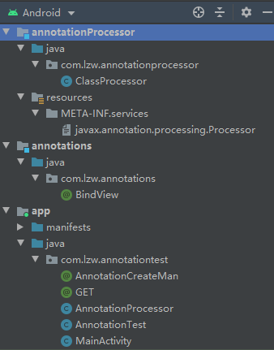
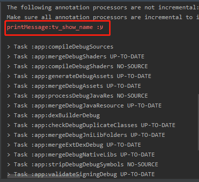

> 知识路径：Android > Java > 集合
>
> version：2020/12/22
>
> review：2020/12/22---
>
> 掌握程度：了解

## 一、注解

从JDK 5 开始，Java 新增注解，注解是代码里的特殊标记，这些标记可以在编译、类加载、运行时被读取，并执行相应的处理。

通过使用注解，开发人员可以在不改变原有逻辑的情况下，在源文件中嵌入一些补充的信息。代码分析工具、开发工具和部署工具可以通过这些补充信息进行验证、处理或者进行部署。

##1.1 注解分类
注解分为标准注解和元注解。

###1.1.1 标准注解
标准注解有以下 4 种。
 • @Override：对覆盖超类中的方法进行标记，如果被标记的方法并没有实际覆盖超类中的方法，则编译器会发出错误警告。
• @Deprecated：对不鼓励使用或者已过时的方法添加注解，当编程人员使用这些方法时，将会在编译时显示提示信息。
• @SuppressWarnings：选择性地取消特定代码段中的警告。
• @SafeVarargs：JDK 7 新增，用来声明使用了可变长度参数的方法，其在与泛型类一起使用时不会出现类型安全问题。

###1.1.2. 元注解
元注解用来注解其他注解，从而创建新的注解。元注解有以下几种。

• @Targe：注解所修饰的对象范围。
• @Inherited：表示注解可以被继承。
• @Documented：表示这个注解应该被 JavaDoc 工具记录。
• @Retention：用来声明注解的保留策略。
• @Repeatable：JDK 8 新增，允许一个注解在同一声明类型（类、属性或方法）上多次使用。

其中@Targe 注解取值是一个 ElementType 类型的数组，其中有以下几种取值，对应不同的对象范围。 
• ElementType.TYPE：能修饰类、接口或枚举类型。
• ElementType.FIELD：能修饰成员变量。
• ElementType.METHOD：能修饰方法。
• ElementType.PARAMETER：能修饰参数。
• ElementType.CONSTRUCTOR：能修饰构造方法。 
• ElementType.LOCAL_VARIABLE：能修饰局部变量。
• ElementType.ANNOTATION_TYPE：能修饰注解。
• ElementType.PACKAGE：能修饰包。
• ElementType.TYPE_PARAMETER：类型参数声明。
• ElementType.TYPE_USE：使用类型。

其中@Retention 注解有 3 种类型，分别表示不同级别的保留策略。 默认为CLASS。
• RetentionPolicy.SOURCE：源码级注解。注解信息只会保留在.java 源码中，源码在编译后，注解信息被丢弃，不会保留在.class 中。
• RetentionPolicy.CLASS：编译时注解。注解信息会保留在.java 源码以及.class 中。当运行 Java 程序时，JVM 会丢弃该注解信息，不会保留在 JVM 中。
• RetentionPolicy.RUNTIME：运行时注解。当运行 Java 程序时，JVM 也会保留该注解信息，可以通过反射获取该注解信息。

##1.2 定义注解
###1.2.1 基本定义
定义新的注解类型使用@interface 关键字，这与定义一个接口很像，如下所示：

```
public @interface AnnotationCreateMan {

}
```
定义完注解后，就可以在程序中使用该注解：
```
@AnnotationCreateMan
public class AnnotationTest {
}
```

###1.2.2 定义成员变量
注解只有成员变量，没有方法。注解的成员变量在注解定义中以“无形参的方法”形式来声明，其“方法名”定义了该成员变量的名字，其返回值定义了该成员变量的类型：

```
public @interface AnnotationCreateMan {
    String name();

    int age();
}
```
上面的代码定义了两个成员变量，这两个成员变量以方法的形式来定义。定义了成员变量后，使用该注解时就应该为该注解的成员变量指定值：
```
@AnnotationCreateMan(name = "Tom", age = 35)
public class AnnotationTest {
    @AnnotationCreateMan(name = "Jim", age = 22)
    public void fighting() {

    }
}
```
也可以在定义注解的成员变量时，使用 default 关键字为其指定默认值，如下所示：
```
public @interface AnnotationCreateMan {
    String name() default "Jack";

    int age() default 25;
}
```
因为注解定义了默认值，所以使用时可以不为这些成员变量指定值，而是直接使用默认值：
```
@AnnotationCreateMan(name = "Tom", age = 35)
public class AnnotationTest {
    @AnnotationCreateMan
    public void fight() {

    }
}
```

###1.2.3 定义运行时注解
可以用@Retention 来设定注解的保留策略，这 3 个策略的生命周期长度为 SOURCE ＜ CLASS ＜ RUNTIME 。生命周期短的能起作用的地方，生命周期长的一定也能起作用。一般如果需要在运行时去动态获取注解信息，那只能用 RetentionPolicy.RUNTIME；如果要在编译时进行一些预处理操作，比如生成一些辅助代码，就用 RetentionPolicy.CLASS；如果只是做一些检查性的操作，比如 @Override 和 @SuppressWarnings，则可选用 RetentionPolicy.SOURCE。当
设定为 RetentionPolicy.RUNTIME 时，这个注解就是运行时注解，如下所示： 
```
@Retention(RetentionPolicy.RUNTIME)
public @interface AnnotationCreateMan {
    String name() default "Jack";

    int age() default 25;
}
```
###1.2.4 定义编译时注解
同样地，如果将@Retention 的保留策略设定为 RetentionPolicy.CLASS，这个注解就是编译时注解，如下所示： 
```
@Retention(RetentionPolicy.CLASS)
public @interface AnnotationCreateMan {
    String name() default "Jack";

    int age() default 25;
}
```

##1.3 注解处理器
如果没有处理注解的工具，那么注解也不会有什么大的作用。对于不同的注解有不同的注解处理器。虽然注解处理器的编写会千变万化，但是其也有处理标准，比如：针对运行时注解会采用反射机制处理，针对编译时注解会采用 AbstractProcessor 来处理。
###1.3.1 运行时注解处理器
处理运行时注解需要用到反射机制。首先我们要定义运行时注解，如下所示： 
```
@Documented
@Target(METHOD)
@Retention(RUNTIME)
public @interface GET {
    String value() default ＂＂；
}
```

上面的代码是 Retrofit 中定义的@GET 注解。其定义了@Target(METHOD)，这等效于@Target(ElementType.METHOD)，意味着 GET 注解应用于方法。接下来应用该注解，如下所示：
```
public class AnnotationTest {
    @GET(value = "http：//ip.taobao.com/59.108.54.3")
    public String getIpMsg() {
        return "";
    }

    @GET(value = "http：//ip.taobao.com/")
    public String getIp() {
        return "";
    }
}
```
上面的代码为@GET 的成员变量赋值。接下来写一个简单的注解处理器，如下所示：
```
public class AnnotationProcessor {
    private static final String TAG = "AnnotationProcessor";

    public static void initAnnotation() {
        Method[] methods = AnnotationTest.class.getDeclaredMethods();
        for (Method m : methods) {
            GET get = m.getAnnotation(GET.class);
            Log.v(TAG, get.value());
        }
    }
}
```
上面的代码用到了两个反射方法：getDeclaredMethods 和 getAnnotation，它们都属于AnnotatedElement 接口，Class、Method 和 Filed 等类都实现了该接口。调用 getAnnotation 方法返回指定类型的注解对象，也就是 GET。最后调用 GET 的 value 方法返回从 GET 对象中提取元素的值。

调用注解处理器：
```
public class MainActivity extends AppCompatActivity {

    private static final String TAG = "MainActivity";

    @Override
    protected void onCreate(Bundle savedInstanceState) {
        super.onCreate(savedInstanceState);
        setContentView(R.layout.activity_main);
        
        AnnotationProcessor.initAnnotation();
    }
}
```
输出结果为：




###1.3.2 编译时注解处理器
处理编译时注解的步骤稍微有点多，首先要定义注解。
**（1）定义注解**
这里首先在项目中新建一个 Java Library 来专门存放注解，这个 Library 名为 annotations。接下来定义注解，如下所示：

```
@Retention(RetentionPolicy.CLASS)
@Target(ElementType.FIELD)
public @interface BindView {
    int value() default 1;
}
```
上面代码中定义的注解类似于 ButterKnife 的@BindView 注解。
**（2）编写注解处理器**
我们在项目中再新建一个 Java Library 来存放注解处理器，这个 Library 名为 processor。我们来配置 processor 库的 build.gradle：
```
apply plugin： 'java'
dependencies {
 compile fileTree(include： ['＊.jar'], dir： 'libs')
 compile project('：annotations')
}
sourceCompatibility = ＂1.7＂
targetCompatibility = ＂1.7＂
```
接下来编写注解处理器 ClassProcessor，它继承 AbstractProcessor，如下所示：
```
public class ClassProcessor extends AbstractProcessor {

    @Override
    public synchronized void init(ProcessingEnvironment processingEnvironment) {
        super.init(processingEnvironment);
    }

    @Override
    public boolean process(Set<? extends TypeElement> set, RoundEnvironment roundEnvironment) {
        //TODO 处理注解
        return false;
    }

    @Override
    public Set<String> getSupportedAnnotationTypes() {
        Set<String> annotations = new LinkedHashSet<String>();
        annotations.add(BindView.class.getCanonicalName());
        return annotations;
    }

    @Override
    public SourceVersion getSupportedSourceVersion() {
        return SourceVersion.latestSupported();
    }
}

```
process 方法的实现会在后文讲到，这里首先分别介绍这 4 个方法的作用。 
• init：被注解处理工具调用，并输入 ProcessingEnviroment 参数。ProcessingEnviroment提供很多有用的工具类，比如 Elements、TypesFiler 和 Messager 等。
• process：相当于每个处理器的主函数 main()，在这里写你的扫描、评估和处理注解的代码，以及生成 Java 文件。输入参数RoundEnviroment，可以让你查询出包含特定注解的被注解元素。
• getSupportedAnnotationTypes：这是必须指定的方法，指定这个注解处理器是注册给哪个注解的。注意，它的返回值是一个字符串的集合，包含本处理器想要处理的注解类型的合法全称。
• getSupportedSourceVersion ：用来指定你使用的 Java 版本，通常这里返回SourceVersion.latestSupported()。 在Java 7 以后，也可以使用注解来代替getSupportedAnnotationTypes 方法getSupportedSourceVersion方法，如下所示：
```
@SupportedSourceVersion(SourceVersion.RELEASE_8)
@SupportedAnnotationTypes("com.lzw.annotations.BindView")
public class ClassProcessor extends AbstractProcessor {

    @Override
    public synchronized void init(ProcessingEnvironment processingEnvironment) {
        super.init(processingEnvironment);
    }

    @Override
    public boolean process(Set<? extends TypeElement> set, RoundEnvironment roundEnvironment) {
        return false;
    }
}
```

但是考虑到 Android 兼容性的问题，这里不建议采用这种注解的方式。接下来编写还未实现的 process 方法，如下所示：
```
    public boolean process(Set<? extends TypeElement> set, RoundEnvironment roundEnvironment) {
        Messager messager = processingEnv.getMessager();
        for (Element element : roundEnvironment.getElementsAnnotatedWith(BindView.class)) {
            if (element.getKind() == ElementKind.FIELD) {
                messager.printMessage(Diagnostic.Kind.NOTE, "printMessage:"
                        + element.toString());
            }
        }
        return true;
    }
```
这里用到 Messager 的 printMessage 方法来打印出注解修饰的成员变量的名称，这个名称会在 Android Studio 的 Gradle Console 窗口中打印出来。


**（3）注册注解处理器**
为了能使用注解处理器，需要用一个服务文件来注册它。现在我们就来创建这个服务文件。
* 首先在 processor 库的 main 目录下新建 resources 资源文件夹
* 接下来在 resources 中再建立META-INF/services 目录文件夹。
* 最后在 META-INF/services 中创建 javax.annotation.processing.Processor 文件，这个文件中的内容是注解处理器的名称。
这里我们的 javax.annotation.processing.Processor 文件的内容为 com.lzw.annotationprocessor.ClassProcessor。

整个项目的目录结构如图 9-1 所示


如果你觉得前面创建服务文件的步骤比较麻烦，也可以使用 Google 开源的 AutoService，它用来自动生成 METAINF/services/javax.annotation.processing.Processor 文件。首先我们添加该开源库，可以在 File→Project Structure 搜索“auto-service”查找该库并添加，如下图所示。也可以在 processor 的 build.gradle 中直接添加如下代码：
```
dependencies {
    implementation fileTree(dir: 'libs', include: ['*.jar'])
    implementation project(":annotations")
    annotationProcessor 'com.google.auto.service:auto-service:1.0-rc6'
    compileOnly 'com.google.auto.service:auto-service:1.0-rc6'
}
```
最后在注解处理器 ClassProcessor 中添加@AutoService(Processor.class)就可以了：
```
@AutoService(Processor.class)
public class ClassProcessor extends AbstractProcessor {
...
}
```

**（4）应用注解**
接下来在我们的主工程项目（app）中引用注解。首先要在主工程项目的 build.graldle 中引用 annotations 和 processor 这两个库：
```
dependencies {
...
    implementation project(':annotations')
    annotationProcessor project(':annotationProcessor')
}
```
接下来在 MainActivity 中应用注解，如下所示：
```
public class MainActivity extends AppCompatActivity {

    //编译时注解
    @BindView(value = 111)
    TextView tv_show_name;

    @Override
    protected void onCreate(Bundle savedInstanceState) {
        super.onCreate(savedInstanceState);
        setContentView(R.layout.activity_main);

        //运行时注解
        AnnotationProcessor.initAnnotation();
    }
}
```
最后，我们先 Clean Project 再 Make Project，在 Gradle Console 窗口中打印的结果如图所示：




可以发现编译时会打印出@BindView 注解修饰的成员变量名：tv_show_name。 

**（5）使用 android-apt 插件**（这个问题目前还未解决）
我们的主工程项目（app）中引用了 processor 库，但注解处理器只在编译处理期间需要用到，编译处理完后就没有实际作用了，而主工程项目添加了这个库会引入很多不必要的文件。为了处理这个问题我们需要引入插件 android-apt。它主要有两个作用：
• 仅仅在编译时期去依赖注解处理器所在的函数库并进行工作，但不会打包到 APK 中。
• 为注解处理器生成的代码设置好路径，以便 Android Studio 能够找到它。
接下来介绍如何使用它。首先需要在整个工程（Progect）的 build.gradle 中添加如下语句：

```
buildscript {
 ...
 dependencies {
 ...
 classpath 'com.neenbedankt.gradle.plugins：android-apt：1.8'
 } }
```
接下来在主工程项目（app）的 build.gradle 中以 apt 的方式引入注解处理器 processor，如下所示：
```
...
apply plugin： 'com.neenbedankt.android-apt'
...
dependencies {
...
 //compile project('：processor')
 apt project('：processor')
}
```


# 前言

- 在 `Java`中，注解（Annotation）非常重要，但对于很多开发者来说，这并不容易理解，甚至觉得有点神秘
- 今天，我将献上一份 **`Java`注解的介绍 & 实战攻略**，希望你们会喜欢。

------

# 目录


示意图

------

# 1. 简介

- 定义：一种标识 / 标签

> 1. 注解属于 `Java`中的一种类型，同 类`class` 和 接口`interface`  一样
> 2. 在 `Java SE 5.0`开始引入

- 基础作用：标识 / 解释 `Java` 代码

------

# 2. 应用场景

- 面向 **编译器 /  `APT` 使用**

> 1. `APT（Annotation Processing Tool）`：提取 & 处理 `Annotation` 的代码
> 2. 因为当开发者使用`Annotation` 修饰类、方法、方法 等成员后，这些 `Annotation` 不会自己生效，必须由开发者提供相应的代码来提取并处理 `Annotation` 信息。这些处理提取和处理 `Annotation` 的代码统称为 `APT`

- 所以说，注解除了最基本的解释 & 说明代码，**注解的应用场景还取决于你想如何利用它**
- 下面我举几个典型的应用场景：

### 场景1：测试代码

如出名的测试框架`JUnit`  = 采用注解进行代码测试


```java
public class ExampleUnitTest {
    @Test
    public void Method() throws Exception {
          ...
    }
}
// @Test 标记了要进行测试的方法Method() 
```

### 场景2：简化使用 & 降低代码量

如 `Http`网络请求库 `Retrofit`  & `IOC` 框架`ButterKnife`


```java
<-- Http网络请求库 Retrofit -->

// 采用 注解 描述 网络请求参数
public interface GetRequest_Interface {

 @GET("ajax.php?a=fy&f=auto&t=auto&w=hello%20world")
    Call<Translation> getCall();

 }

<-- IOC 框架ButterKnife -->
public class MainActivity extends AppCompatActivity {

// 通过注解设置资源
@BindView(R.id.test)
    TextView mTv;
    @Override
    protected void onCreate(Bundle savedInstanceState) {
        super.onCreate(savedInstanceState);
        setContentView(R.layout.activity_main);

        ButterKnife.bind(this);
    }
}
```

------

# 3. 注解的类型

注解的类型包括：元注解 、 `Java`内置注解 & 自定义注解。

### 3.1  元注解

##### 3.1.1 简介

- 定义：一种标识 / 标签

> 是一种基本注解 =  `Android`系统内置的注解

- 作用：标识 / 解释 开发者自定义的注解

##### 3.1.2 注解、元注解 & Java代码的关系

- 元注解作用于注解 & 解释注解


```csharp
// 元注解 作用于注解 & 解释注解
// 元注解在注解定义时进行定义
@元注解
public @interface Carson_Annotation {

}
```

- 注解作用于`Java`代码 & 解释`Java`代码


```java
// 注解作用于Java代码 & 解释Java代码
@Carson_Annotation
public class Carson {
}
```

##### 3.1.3 元注解类型介绍

- 元注解共有5种，包括：


示意图

- 下面我将一一介绍

### @Retention

- 定义：保留注解
- 作用：解释 / 说明了注解的生命周期
- 具体使用


```kotlin
// 元注解@Retention(RetentionPolicy.RUNTIME)的作用：说明 注解Carson_Annotation的生命周期 = 保留到程序运行时 & 被加载到 JVM 中
@Retention(RetentionPolicy.RUNTIME)
public @interface Carson_Annotation {
}

<-- 元注解@Retention参数说明 -->
// RetentionPolicy.RUNTIME：注解保留到程序运行时 & 会被加载进入到 JVM 中，所以在程序运行时可以获取到它们
// RetentionPolicy.CLASS：注解只被保留到编译进行时 & 不会被加载到 JVM 
// RetentionPolicy.SOURCE：注解只在源码阶段保留 & 在编译器进行编译时将被丢弃忽视。
```

### @Documented

- 定义：`Java`文档注解
- 作用：将注解中的元素包含到 `Javadoc`文档中
- 具体使用


```csharp
// 元注解@Documented作用：说明 注解Carson_Annotation的元素包含到 Javadoc 文档中
@Documented
public @interface Carson_Annotation {
}
```

### @Target

- 定义：目标注解
- 作用：限定了注解作用的目标范围，包括类、方法等等
- 具体使用


```kotlin
// 元注解@Target作用：限定了注解Carson_Annotation作用的目标范围 = 方法
// 即注解Carson_Annotation只能用于解释说明 某个方法
@Target(ElementType.METHOD)
public @interface Carson_Annotation {
}

<-- @Target取值参数说明 -->
// ElementType.PACKAGE：可以给一个包进行注解
// ElementType.ANNOTATION_TYPE：可以给一个注解进行注解
// ElementType.TYPE：可以给一个类型进行注解，如类、接口、枚举
// ElementType.CONSTRUCTOR：可以给构造方法进行注解
// ElementType.METHOD：可以给方法进行注解
// ElementType.PARAMETER 可以给一个方法内的参数进行注解
// ElementType.FIELD：可以给属性进行注解
// ElementType.LOCAL_VARIABLE：可以给局部变量进行注解
```

### @Inherited

- 定义：继承注解
- 作用：使得一个 **被@Inherited注解的注解** 作用的类的子类可以继承该类的注解

> 1. 前提：子类没有被任何注解应用
> 2. 如，注解`@Carson_Annotation`（被元注解`@Inherited` 注解）作用于A类，那么A类的子类则继承了A类的注解

- 具体使用


```php
// 元注解@Inherited 作用于 注解Carson_Annotation
@Inherited
public @interface Carson_Annotation {
}


// 注解Carson_Annotation 作用于A类
@Carson_Annotation
public class A {
  }

// B类继承了A类，即B类 = A类的子类，且B类没被任何注解应用
// 那么B类继承了A类的注解 Carson_Annotation
public class B extends A {}
```

### @Repeatable

- 定义：可重复注解

> `Java` 1.8后引进

- 作用：使得作用的注解可以取多个值
- 具体使用


```kotlin
// 1. 定义 容器注解 @ 职业
public @interface Job {
    Person[]  value();
}
<-- 容器注解介绍 -->
// 定义：本身也是一个注解
// 作用：存放其它注解
// 具体使用：必须有一个 value 属性；类型 = 被 @Repeatable 注解的注解数组
// 如本例中，被 @Repeatable 作用 = @Person ，所以value属性 = Person []数组

// 2. 定义@Person 
// 3. 使用@Repeatable 注解 @Person
// 注：@Repeatable 括号中的类 = 容器注解
@Repeatable（Job.class）
public @interface Person{
    String role default "";
}

// 在使用@Person（被@Repeatable 注解 ）时，可以取多个值来解释Java代码
// 下面注解表示：Carson类即是产品经理，又是程序猿
@Person(role="coder")
@Person(role="PM")
public class Carson{

}
```

注：一个注解可以被多个元注解作用


```kotlin
@Inherited
@Target(ElementType.TYPE)
@Retention(RetentionPolicy.RUNTIME)
public @interface Carson_Annotation {
}
```

##### 3.1.4 元注解类型总结


示意图

------

### 3.2 Java内置的注解

- 定义：即Java内部已经实现好的注解

- 类型：`Java`中 内置的注解有5类，具体包括：

  

  示意图

  

- 下面我将对这5类内置注解进行讲解

### @Deprecated

- 定义：过时注解
- 作用：标记已过时 & 被抛弃的元素（类、方法等）
- 具体使用


```csharp
// 用 注解@Deprecated 标记类中已过时的 方法Hello()
public class Buyer2   {

    @Deprecated
    public void Hello(){
        System.out.println("Hello 2015!");
    }
}
```

使用该类中被 `@Deprecated` 作用的方法时，`IDE`会提示该方法已过时 / 抛弃


示意图

### @Override

- 定义：复写注解
- 作用：标记该方法需要被子类复写
- 具体使用：该方法大家很熟悉了，此处不作过多描述

### @SuppressWarnings

- 定义：阻止警告注解
- 作用：标记的元素会阻止编译器发出警告提醒

> 主要应用于开发者需要忽略警告时

- 具体使用


```java
// 在括号内传入需要忽略警告的属性
@SuppressWarnings("deprecation")
public void test(){
    Buyer2 mBuyer2 = new Buyer2();
    mBuyer2.hello（）；
    // IDE将不会发出警告（即不会在hello（）出现划线）
}
```

### @SafeVarargs

- 定义：参数安全类型注解

> `Java` 1.7 后引入

- 作用：提醒开发者不要用参数做不安全的操作 & 阻止编译器产生 `unchecked`警告
- 具体使用


```dart
// 以下是官方例子
// 虽然编译阶段不报错，但运行时会抛出 ClassCastException 异常
// 所以该注解只是作提示作用，但是实际上还是要开发者自己处理问题
@SafeVarargs // Not actually safe!
    static void m(List<String>... stringLists) {
    Object[] array = stringLists;
    List<Integer> tmpList = Arrays.asList(42);
    array[0] = tmpList; // Semantically invalid, but compiles without warnings
    String s = stringLists[0].get(0); // Oh no, ClassCastException at runtime!
}
```

### @FunctionalInterface

- 定义：函数式接口注解

> `Java` 1.8 后引入的新特性

- 作用：表示该接口 = 函数式接口

> 函数式接口 (Functional Interface)  = 1个具有1个方法的普通接口

- 具体使用


```java
// 多线程开发中常用的 Runnable 就是一个典型的函数式接口（被 @FunctionalInterface 注解）
@FunctionalInterface
public interface Runnable {
   
    public abstract void run();
}

<--额外：为什么要用函数式接口标记 -->
// 原因：函数式接口很容易转换为 Lambda 表达式
// 这是另外一个很大话题，此处不作过多讲解，感兴趣的同学可自行了解
```

### Java内置注解类型总结


示意图

------

### 3.3 自定义注解

- 定义：开发者自定义注解
- 具体使用：下面第4节将这种介绍。

------

# 4. 使用介绍

注解的基础使用包括定义、属性 & 具体使用

### 4.1 注解的定义


```csharp
// 通过 @interface 关键字进行定义
// 形式类似于接口，区别在于多了一个 @ 符号

public @interface Carson_Annotation {

}

// 上面的代码创建了一个名为 Carson_Annotaion 的注解
```

### 4.2 注解的属性


```java
<-- 1. 定义 注解的属性 -->
// 注解的属性 在定义该注解本身时 进行定义
public @interface Carson_Annotation {
// 注解的属性 = 成员变量
// 注解只有成员变量，没有方法

    // 注解@Carson_Annotation中有2个属性：id 和 msg  
    int id();
    String msg() default "Hi" ;

    // 说明：
      // 注解的属性以 “无形参的方法” 形式来声明
      // 方法名 = 属性名
      // 方法返回值 = 属性类型 = 8 种基本数据类型 + 类、接口、注解及对应数组类型
      // 用 default 关键值指定 属性的默认值，如上面的msg的默认值 = ”Hi“
}

<-- 2. 赋值 注解的属性 -->
// 注解的属性在使用时进行赋值
// 注解属性的赋值方式 = 注解括号内以 “value=”xx” “ 形式；用 ”，“隔开多个属性

// 注解Carson_Annotation 作用于A类
// 在作用 / 使用时对注解属性进行赋值
@Carson_Annotation(id=1,msg="hello,i am Carson")
public class A {
  }

// 特别说明：若注解只有一个属性，则赋值时”value“可以省略

// 假设注解@Carson_Annotation只有1个msg属性
// 赋值时直接赋值即可
@Carson_Annotation("hello,i am Carson")
public class A {
  }
```

### 4.3 注解的应用


```java
// 在类 / 成员变量 / 方法 定义前 加上 “@注解名” 就可以使用该注解
@Carson_Annotation
public class Carson {

    @Carson_Annotation
    int a;
    
    @Carson_Annotation
    public void bMethod(){}

}

// 即注解@Carson_Annotation 用于标识解释 Carson类 / a变量 / b方法
```

### 4.4 获取注解

- 定义：即获取某个对象上的所有注解。
- 实现手段：`Java` 反射技术

> 由于反射需要较高时间成本，所以注解使用时要谨慎考虑时间成本

- 具体使用


```php
<-- 步骤1：判断该类是否应用了某个注解 -->
// 手段：采用 Class.isAnnotationPresent() 
public boolean isAnnotationPresent(Class<? extends Annotation> annotationClass) {}

<-- 步骤2：获取 注解对象（Annotation）-->
  // 手段1：采用getAnnotation()  ；返回指定类型的注解
public <A extends Annotation> A getAnnotation(Class<A> annotationClass) {}
  // 手段2：采用getAnnotations() ；返回该元素上的所有注解
public Annotation[] getAnnotations() {}
```

- 使用实例
   下面我将用一个例子展示如何获取一个类、方法 & 成员变量上的注解类型

**步骤1：自定义2个注解**

*Carson_Annotation.java*


```csharp
// 因为注解@Carson_Annotation需要在程序运行时使用
// 所以必须采用元注解Retention(RetentionPolicy.RUNTIME)
@Retention(RetentionPolicy.RUNTIME)
public @interface Carson_Annotation {

    // 注解@Carson_Annotation中有2个属性：id 和 msg
    int id();
    String msg() default "Hi";
}
```

*Carson_Annotation2.java*


```csharp
// 因为注解@Carson_Annotation2需要在程序运行时使用
// 所以必须采用元注解Retention(RetentionPolicy.RUNTIME)
@Retention(RetentionPolicy.RUNTIME)
public @interface Carson_Annotation2 {

    // 注解@Carson_Annotation2中有2个属性：id 和 msg
    int id();
    String msg() default "Hi";
}
```

**步骤2：定义1个被注解的类**

*Test.java*


```kotlin
// 1个注解作用于Test类
@Carson_Annotation(id = 1,msg="我是类Test")
public class Test {

    // 1个注解 作用于Test类成员变量a
    @Carson_Annotation(id = 2,msg="我是变量a")
    int a;
  
    // 2个注解 作用于Test类方法
    @Carson_Annotation(id = 3,msg="我是方法b")
    @Carson_Annotation2(id = 4,msg="我是方法bb（来自第2个注解）")
    public void bMethod(){}

    }
```

**步骤3：分别获取一个类、方法 & 成员变量上的注解**


```kotlin
    private static final String TAG = "Annotation";

        /**
         * 讲解1：获取类上的注解
         */

        // 1. 判断Test类是否应用了注解@Carson_Annotation
        boolean hasAnnotation = Test.class.isAnnotationPresent(Carson_Annotation.class);

        // 2. 如果应用了注解 = hasAnnotation = true
        //    则获取类上的注解对象
        if ( hasAnnotation ) {
            Carson_Annotation classAnnotation = Test.class.getAnnotation(Carson_Annotation.class);

            // 3. 获取注解对象的值
            Log.d(TAG, "我是Test类上的注解");
            Log.d(TAG, "id:" + classAnnotation.id());
            Log.d(TAG, "msg:" + classAnnotation.msg());
        }

        /**
         * 讲解2：获取类成员变量a上的注解
         */
        try {
            // 1. 获取类上的成员变量a
            Field a = Test.class.getDeclaredField("a");
            a.setAccessible(true);
            
            // 2. 获取成员变量a上的注解@Carson_Annotation
            Carson_Annotation variableAnnotation = a.getAnnotation(Carson_Annotation.class);

            // 3. 若成员变量应用了注解 = hasAnnotation = true
            //    则获取注解对象上的值 = id & msg
            if ( variableAnnotation != null ) {
                Log.d(TAG, "我是类成员变量a上的注解");
                Log.d(TAG, "id:" + variableAnnotation.id());
                Log.d(TAG, "msg:" + variableAnnotation.msg());

            }

            /**
             * 讲解3：获取类方法bMethod上的注解
             */

            // 1. 获取类方法bMethod
            Method testMethod = Test.class.getDeclaredMethod("bMethod");


            // 2. 获取方法上的注解
            if ( testMethod != null ) {
                // 因为方法上有2个注解，所以采用getAnnotations()获得所有类型的注解
                Annotation[] ans = testMethod.getAnnotations();

                Log.d(TAG, "我是类方法bMethod的注解");

                // 3. 获取注解的值（通过循环）
                for( int i = 0;i < ans.length  ;i++) {


                    Log.d(TAG, "类方法bMethod的" + "注解"+ i+ ans[i].annotationType().getSimpleName());
                }
            }
        } catch (NoSuchFieldException e) {
            // TODO Auto-generated catch block
            e.printStackTrace();
            System.out.println(e.getMessage());
        } catch (SecurityException e) {
            // TODO Auto-generated catch block
            e.printStackTrace();
            System.out.println(e.getMessage());
        } catch (NoSuchMethodException e) {
            // TODO Auto-generated catch block
            e.printStackTrace();
            System.out.println(e.getMessage());
        }
    }
```

- 测试结果


示意图

- Demo地址

[Carson的Github地址：Java_Annotation](https://links.jianshu.com/go?to=https%3A%2F%2Fgithub.com%2FCarson-Ho%2FJava_Annotation)

------

# 5. 实例演练

下面，我将通过注解实现一个最常见的应用场景：测试代码

### 5.1 实例说明

通过注解，检查一个类中的方法是否存在异常

### 5.2 具体步骤

- 步骤1：自定义测试注解

*Carson_Test.java*


```kotlin
// 因为注解@Carson_Test需要在程序运行时使用
// 所以必须采用元注解Retention(RetentionPolicy.RUNTIME)
@Retention(RetentionPolicy.RUNTIME)
public @interface Carson_Test {

}
```

- 步骤2：定义需要测试的类

*Test.java*


```csharp
public class Test {

    @Carson_Test
    public void method1(){
        System.out.println("method1正常运行 = " + (1+1));
    }
    @Carson_Test
    public void method2(){
        System.out.println("method2正常运行 = " + (2*3));
    }

    @Carson_Test
    public void method3(){
        System.out.println("method3正常运行 = " + (2/0));
    }
    
}
```

- 步骤3：采用注解 测试 类的方法 是否存在 `Bug`

*MainActivity.java*


```java
public class MainActivity extends AppCompatActivity {

    @Override
    protected void onCreate(Bundle savedInstanceState) {
        super.onCreate(savedInstanceState);
        setContentView(R.layout.activity_main);

        // 1. 获取测试类Test对象
        Test mTest = new Test();
        Class mTest_Class = mTest.getClass();

        // 2. 获取测试类Test的所有方法（通过数组存放）
        Method[] method = mTest_Class.getDeclaredMethods();
        
        // 3. 通过注解@Carson_Test 测试类中的方法
        
        // a. 遍历类中所有方法
        for ( Method m: method ) {
            // b. 只有被 @Carson_Test 标注过的方法才允许进行测试
            if ( m.isAnnotationPresent( Carson_Test.class )) {
                try {
                    m.setAccessible(true);
                    // c. 通过反射调用测试类中的方法
                    m.invoke(mTest);
                    // d. 捕捉方法出现的异常 & 输出异常信息
                } catch (Exception e) {
                    System.out.println( "Test类出现Bug了！！！");
                    System.out.println( "出现Bug的方法：" + m.getName());
                    System.out.println( "Bug类型：" + e.getCause().getClass().getSimpleName());
                    System.out.println( "Bug信息：" + e.getCause().getMessage());
                }
            }
        }
}
```

### 5.3 测试结果


image.png

### 5.4 Demo地址

[Carson_Ho的Github地址：Annation_Debug](https://links.jianshu.com/go?to=https%3A%2F%2Fgithub.com%2FCarson-Ho%2FAnnation_Debug)

------

# 6. 总结

本文全面讲解了`Java`注解（`Annotation`）的相关知识，相信您对`Java`注解已经了解深刻。


# 参考

[Carson带你学Java：带你一步步探索神秘的注解（Annotation）](https://www.jianshu.com/p/9f29fb37c840)


