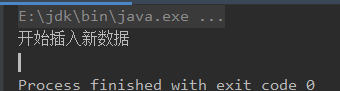
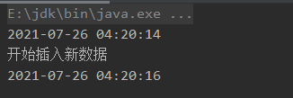
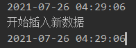

> version：2021/10/
>
> review：

可选：[原文地址](https://developer.android.google.cn/guide/fragments/create)

目录

[TOC]

> 基础知识: 反射.md
>


代理(Proxy)是一种设计模式，提供了对目标对象另外的访问方式，即通过代理对象访问目标对象。这样做的好处是：可以在目标对象实现的基础上,增强额外的功能操作,即扩展目标对象的功能.
这里使用到编程中的一个思想:不要随意去修改别人已经写好的代码或者方法,如果需改修改,可以通过代理的方式来扩展该方法。

**代理模式是java23种设计模式之一， 那什么是代理呢，大白话解释一下就是：李四现在要买车，张三跑过来说我可以帮你买（代理对象张三），张三把李四想买的车的信息都掌握了，然后去帮李四买车去了，买车的过程李四啥都不知道，张三就可以做一些不可描述的事情，比如加价、吃回扣等等。**


**大体了解了什么是代理，我们看看java中的代理模式是什么样的，怎么用的，用在哪儿的。**

在java中，代理模式分3种

1. 静态代理
2. 动态代理
3. cgLib代理

# 静态代理

静态代理是指代理类在程序运行前就已经存在，这种情况下的代理类通常都是我们在Java代码中定义的。

模拟一个接口

```java
public interface ITest {

    public void addNewData();
}
```

编写一个实现类实现此接口

```java
public class TestImpl implements ITest {
    @Override
    public void addNewData() {
        System.out.println("开始插入新数据");
    }
}
```

测试：

```java
    public static void main(String[] args) {
        ITest iTest = new TestImpl();
        iTest.addNewData();
    }
```

结果：



好！上面的代码是很正常的，大家应该都很熟悉对吧。
**好！现在我加一个需求，在不改变上面任何代码的情况下，给我输出任务的执行时间起和执行时间止。例如：**



**怎么办？不能改原始代码诶。假如在工作中发现这种类似的需求，但是不能改原来的祖传代码，怕改了会出错，怎么办呢？**

好，问题抛出来了，我们开始静态代理。
新建一个代理类实现ITest接口，里面的代码我一行一行的解释

```java
public class staticProxyImpl implements ITest {
    
	1.成员变量，类型是ITest类型，通过构造函数赋值。
    private ITest iTest;

	2.构造函数，调用处把ITest 的实现类对象创造出来后通过构造方法传进来
    public staticProxyImpl(ITest iTest){
        this.iTest = iTest;
    }

	3.重写目标方法，开始编写自己的代理业务核心
    @Override
    public void addNewData() {
		4.输出开始时间
        System.out.println(new SimpleDateFormat("yyyy-MM-dd hh:mm:ss").format(new Date()));
		5.调用目标方法！！！！！！！！！！！！！！！！！！！！！！！！！！！
        this.iTest.addNewData();
		6.输出结束时间
        System.out.println(new SimpleDateFormat("yyyy-MM-dd hh:mm:ss").format(new Date()));
    }
}
```

上面的代码可能有些同鞋还没看懂，那么我们现在看看怎么调用的：

```java
    public static void main(String[] args) {
    	1.实例化TestImpl对象
        ITest iTest = new TestImpl();
    	2.调用有参构造传入TestImpl对象创建代理对象，并调用所重写的方法
        new staticProxyImpl(iTest).addNewData();
    }
```

结果：



**在上述代码中，针对客户看到的是ITest 接口提供了功能，而功能又是由staticProxyImpl提供的。我们可以在staticProxyImpl中修改或新增一些内容，而不影响被代理类TestImpl。**

***静态代理的缺点：***

1. 当需要代理多个类时，代理对象要实现与目标对象一致的接口。要么，只维护一个代理类来实现多个接口，但这样会导致代理类过于庞大。要么，新建多个代理类，但这样会产生过多的代理类。
2. 当接口需要增加、删除、修改方法时，目标对象与代理类都要同时修改，不易维护。


# 动态代理

与静态代理不同，之前我们讲的静态代理是什么？是不是在编码阶段完成的？ 那么局限性就出来了，一切在编码阶段定死的东西维护性都怎么样？是不是都很差啊？ 好！动态代理请求出战！
动态代理是指代理类在程序运行时进行创建的代理方式。这种情况下，代理类并不是在Java代码中定义的，而是在运行时根据Java代码中的“指示”动态生成的。
相比于静态代理，动态代理的优势在于可以很方便的对代理类的函数进行统一的处理，而不用修改每个代理类的函数。

**所以，动态代理就是想办法，根据接口或目标对象，计算出代理类的字节码，然后再加载到JVM中使用。**

JDK动态代理主要涉及两个类：java.lang.reflect.Proxy 和 java.lang.reflect.InvocationHandler，我们仍然通过案例来学习

继续我们上面的例子：

模拟一个接口

```java
public interface ITest {

    public void addNewData();
}
```

编写一个实现类实现此接口

```java
public class TestImpl implements ITest {
    @Override
    public void addNewData() {
        System.out.println("开始插入新数据");
    }
}
```

我们现在要通过动态代理实现之前的需求：在不改变上面任何代码的情况下，给我输出任务的执行时间起和执行时间止。例如：


好！到这一步我们要开始想办法实现动态的代理。也就是在程序运行期间，我们要处理两个问题！

1. **我们要怎么样拿到我们的被代理类对象TestImpl 的实例，并创建代理类？？？？**
2. **我们怎样通过代理类，去动态地调用被代理类中的同名方法？？？？**

编写一个类，实现java.lang.reflect.InvocationHandler接口：

```java
public class jdkProxyImpl implements InvocationHandler {

1.包含一个被代理对象的实例，这里用顶级父类Object 
    private Object object;
    
2.构造方法，通过此构造方法初始化被代理对象实例。
    public jdkProxyImpl(Object object){
        this.object = object;
    }
3.重写的InvocationHandler 中的invoke方法，这个方法是什么？ 
  先一句话概括一下：在程序运行期间，
  我们拿到代理类的对象的时候（后面会说怎么拿），
  调用xxx方法例如上面例子中的addNewData（）方法的时候，
  程序会自动地调用到当前的invoke（）方法，而真实的addNewData（）方法的调用，
  将会在我们当前的invoke（）中手动的写出来！！！
  也就是说，我们可以在调用真实的目标方法的前、后，加上我们新增的逻辑，起到了代理的效果！
    @Override
    public Object invoke(Object proxy, Method method, Object[] args) throws Throwable {
	5.打印起始时间
        System.out.println(new SimpleDateFormat("yyyy-MM-dd hh:mm:ss").format(new Date()));
	6.调用目标方法
        method.invoke(object,args);
	7.打印结束时间
        System.out.println(new SimpleDateFormat("yyyy-MM-dd hh:mm:ss").format(new Date()));
        return null;
    }
}
```

invoke方法有三个参数

1. proxy：代理类的对象

2. method：代理类所调用的具体哪个方法，这里是通过反射，通过方法名拿到具体的方法，我们就可以通过invoke方法调用了。但我们知道，反射中的invoke方法需要两个参数，这里解释一下：
   参数一：当前方法所属的类的对象，这里就是被代理类的对象，也就是构造方法初始化的object对 象，也就是我们的被代理类TestImpl
   参数二：方法的参数
3. args：所包含的参数

调用：

```java
    public static void main(String[] args) {
1.实例化被代理类
        ITest iTest = new TestImpl();
        
2.实例化jdkProxyImpl类，并将代理类对象初始化给它
        InvocationHandler invocationHandler = new jdkProxyImpl(iTest);
        
3.重点来了！！！Proxy是jdk提供的一个类，Proxy.newProxyInstance方法会返回一个代理类！那么怎么
  创造我们想要的代理类呢？

        ITest proxy = (ITest) Proxy.newProxyInstance(iTest.getClass().getClassLoader(),iTest.getClass().getInterfaces(),invocationHandler);

4.代理类调用目标方法（最终会走到jdkProxyImpl中的invoke方法）
        proxy.addNewData();

    }
```

Proxy.newProxyInstance(iTest.getClass().getClassLoader(),iTest.getClass().getInterfaces(),invocationHandler)，三个参数，一一解释！

1. 被代理类的类加载器
2. 被代理类所实现的接口
3. 实现了invocationHandler接口的类的对象

看不懂对吧？我大白话解释一下。
newProxyInstance方法就是创造一个类，这个类就是代理类，那是谁的代理类呢？第一个参数就跳出来了：是我TestImpl的代理类，我把我的类加载器给你，你可以反射。好！第二个参数，获取到被代理类所实现的接口，然后代理类实现所有获取到的接口，重写所有的方法，所有的方法体全部调用第三个参数中的invoke方法！

最后在上面代码中的第四部，通过代理类调用addNewData方法，这个addNewData方法我们给它取个名字，叫假小子，因为它的方法体和真正的addNewData没有一点关系，方法体直接调用到了invocationHandler中的invoke方法。然后在invoke方法中，我们通过反射拿到了真正的addNewData方法调用！

这里有一个面试题：为什么JDK原生的动态代理，要求被代理类必须实现接口?
答案：因为在生成代理对象的底层源码中，我们发现代理对象是继承自Proxy父类的，而java中，类只能单继承，所以要实现被代理类的所有方法，只能实现接口。

其实这里我有一个疑问，既然我们已经拿到了被代理类的Class对象，按理来说就可以通过反射获取到他所有的方法，没有必要去实现接口了啊。有知道的同鞋希望评论区留言 讨论。。。。。

# CgLib动态代理

一道面试题：cglib和jdk动态代理区别？
答案：
jdk动态代理是利用反射机制生成一个实现代理接口的匿名类，在调用具体方法前调用InvokeHandler来处理。
而cglib动态代理是利用asm开源包，对代理对象类的class文件加载进来，通过修改其字节码生成子类来处理。
cglib代理不需要被代理类实现接口，而jdk动态代理必须要求被代理类实现接口。

在sping的AOP中，就是使用的Cglib动态代理。在jdk1.8以后，cglib的动态代理效率要低于jdk的动态代理


# 相关问题

<font color='orange'>Q：动态代理是什么？如何实现？</font>


<font color='orange'>Q：动态代理的方法怎么初始化的？（字节跳动）</font>


<font color='orange'>Q：CGLIB动态代理（字节跳动）</font>


<font color='orange'>Q：静态代理和动态代理的区别，什么场景使用？</font>


<font color='orange'>Q：</font>


<font color='orange'>Q：</font>


<font color='orange'>Q：</font>


# 总结

1、

## 【精益求精】我还能做（补充）些什么？

1、还应该看看源码，再梳理梳理。


# 参考

1、[java中的静态、动态代理模式以及Spring中的CgLib动态代理解读](https://blog.csdn.net/J169YBZ/article/details/119059519?spm=1001.2014.3001.5501)