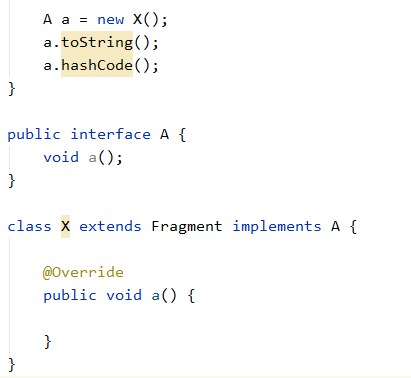
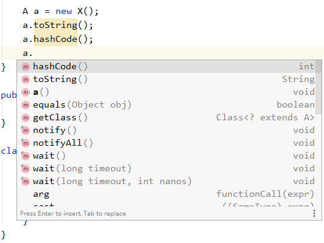
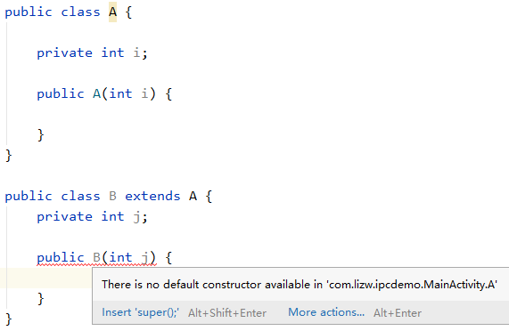
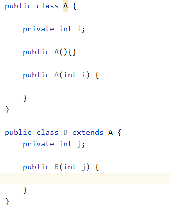
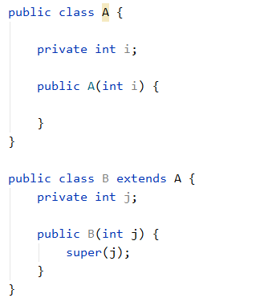
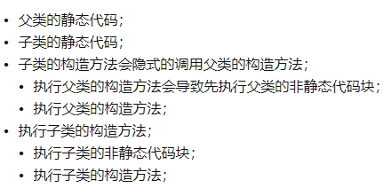

> version：2021/10/
>
> review：

目录

[TOC]

# 抽象类和接口区别

抽象类在类前面须用abstract关键字修饰，一般至少包含一个抽象方法，抽象方法指只有声明，用关键字abstract修饰，没有具体的实现的方法。因抽象类中含有无具体实现的方法，固不能用抽象类创建对象。当然如果只是用abstract修饰类而无具体实现，也是抽象类。抽象类也可以有成员变量和普通的成员方法。抽象方法必须为public或protected（若为private，不能被子类继承，子类无法实现该方法）。若一个类继承一个抽象类，则必须实现父类中所有的抽象方法，若子类没有实现父类的抽象方法，则也应该定义为抽象类。

接口用关键字interface修饰，接口也可以含有变量和方法，接口中的变量会被隐式指定为public static final变量。方法会被隐式的指定为public abstract，接口中的所有方法均不能有具体的实现，即接口中的方法都必须为抽象方法，java1.8开始，可以提供默认方法实现。若一个非抽象类实现某个接口，必须实现该接口中所有的方法。

区别：

1）抽象类可以提供成员方法实现的细节，而接口只能存在抽象方法；

2）抽象类的成员变量可以是各种类型，而接口中成员变量只能是public static final类型；

3）接口中不能含有静态方法及静态代码块，而抽象类可以有静态方法和静态代码块；

4）一个类只能继承一个抽象类，用extends来继承，却可以实现多个接口，用implements来实现接口。

抽象类与接口的应用场景

抽象类的应用场景：

1）规范了一组公共的方法，与状态无关，可以共享的，无需子类分别实现；而另一些方法却需要各个子类根据自己特定状态来实现特定功能；

2）定义一组接口，但不强迫每个实现类都必须实现所有的方法，可用抽象类定义一组方法体可以是空方法体，由子类选择自己感兴趣的方法来覆盖；

抽象类是否可以没有方法和属性？

可以

抽象类的意义

抽象类是用来提供子类的通用性，用来创建继承层级里子类的模板，减少代码编写，有利于代码规范化。

接口的意义

1）有利于代码的规范，对于大型项目，对一些接口进行定义，可以给开发人员一个清晰的指示，防止开发人员随意命名和代码混乱，影响开发效率。

2）有利于代码维护和扩展，当前类不能满足要求时，不需要重新设计类，只需要重新写了个类实现对应的方法。

3）解耦作用，全局变量的定义，当发生需求变化时，只需改变接口中的值即可。

4）直接看接口，就可以清楚知道具体实现类间的关系，代码交给别人看，别人也能立马明白。

#### 父类的静态方法能否被子类重写？静态属性和静态方法是否可以被继承？

父类的静态方法和属性不能被子类重写，但子类可以继承父类静态方法和属性，如父类和子类都有同名同参同返回值的静态方法show()，声明的实例Father father = new Son(); (Son extends Father)，会调用father对象的静态方法。静态是指在编译时就会分配内存且一直存在，跟对象实例无关。

# 相关问题

## 一、多态

Q：谈谈对java多态的理解

同一个方法可以对象的不同而不同，在执行期间判断所引用的对象的实际类型，根据其实际的类型调用其相应的方法。

作用：消除类型之间的耦合关系。实现多态的必要条件：继承、重写（因为必须调用父类中存在的方法）、父类引用指向子类对象。

Q：简述封装,继承,多态。Java的几个特性（面向对象的三大特性），他们之间的关系？

（1）封装

> 讲封装需要先将抽象。

封装就是把抽象的数据和对数据进行的操作的方法封装在一起，数据被保存在内部，根据需要进行访问控制，程序的其他部分只有通过被授权的操作（成员方法）才能对数据进行操作。

（2）继承：继承是指将多个相同的属性和方法提取出来，放到一个父类中，可以**提高代码的复用**。Java中一个类只能继承一个父类，且只能继承访问权限非private的属性和方法。子类可以重写父类中的方法，命名与父类中同名的属性。

（3）多态

同一个引用会根据真正调用方法的对象来执行不同的方法。多态可以通过继承或者接口以及方法重载来实现。多态可以提高代码的灵活性，也可以让代码更加简洁。

Q：讲解下你对抽象，多态的理解；

我对抽象的理解是，当我们要把一个事物或者一个业务功能转化为Java代码的时候，我们需要根据事物或者业务功能的特征，来定义一个类或者是一个接口，然后把事物的特征以及功能转换成对应的属性或者方法，供后面的开发使用，我把这个过程理解为抽象。

举例：我举一个我负责过的模块，语音交互功能，这个功能要求页面能够响应语音输入，但不是所有的都需要，这样就可以定义一个接口，把这个业务所需要的功能提取出来，比如需要响应，那就对应一个onTalk方法，需要添加能够响应的控件，就定义一个addTalkableViews方法，这样实现这个接口的类，就必须实现这组方法，也就具备的了这样的能力，这个过程就是把业务功能抽象为Java代码的过程。

我对多态的理解是，同一个引用会根据真正调用方法的对象来执行不同的方法。多态可以通过继承或者接口来实现。

Q：多态和重载区别；

多态是指，同一个引用会根据不同的对象调用不同的方法，是在类和接口之间形成的。

重载是指方法重载，就是一个类同一个功能的不同实现。通过方法的参数来进行控制，包括参数类型、个数、顺序任一项。

> 注意：方法名要相同。
>
> 返回类型不同、修饰符不同，不能构成重载。

Q：多态概念（父类引用子类参数）

Q：重载（overload）和重写（override）的区别（京东）overloaded的方法是否可以改变返回值的类型?

重载是指，在一个类中，同一个方法，有不同的参数。

重写是指，子类继承父类，可以重写父类的方法，或者说是覆盖，可以直接调用或者在多态中发挥作用。

重载不能改变返回值类型。

## 二、抽象类和接口

Q：抽象类和接口的区别。

相同点：

抽象类和接口都可以定义抽象方法。接口中的方法默认使用public abstract修饰。

不同点：

抽象类通过abstract class定义，接口通过interface定义。

抽象类可以中的变量与普通类一样使用，接口中的变量默认使用public static final修饰。

接口中不能含有静态代码块以及静态方法，而抽象类可以有静态代码块和静态方法；

抽象类可以提供非抽象方法，接口从java1.8开始，可以通过default关键字提供方法实现。

Q：抽象类的变量可以被继承和修改么？

只要不是private修饰的就可以继承。抽象类和普遍类相比可以多定义抽象方法，变量的使用不受抽象类的影响。

> static修饰的方法不能被重写可以被继承

Q：一个类实现一个接口，接口引用指向这个类对象，可以不可以调用它的toString方法?

可以的，实际上任何一个类都可以调用Object的方法。但是如果这个对象继承了其他类，那这种情况不能调用那个类中的方法。

Q：接口类的非方法能不能被修改？

不能，接口类里非方法的类型都是用final修饰的，所以必须初始化并且不能被修改。

> 接口中的变量都是：public static final 修饰的。

## 三、继承

Q：一个类的能不能多继承，能不能实现多个接口

只能继承一个类，可以实现多个接口。

Q：可不可以调用abstract父类的super方法

可以。

最典型的例子是继承ViewGroup，需要重写其构造方法，然后调用super()。

Q：类A私有变量i，类B继承A私有变量j，构造方法带各自的变量，哪个编译成功；

类A编译成功。

类B报错如下：

在继承一个类后，B会自动调用A的默认构造方法，但是如果A中只有有参构造方法，那B类就报错。

解决方法有2种：

1、父类提供一个无参构造方法

2、B类通过super调用父类的有参构造方法

Q：继承和接口，优先使用级

继承适用于父类跟子类的关系为is-a的情况，最典型的就是自定义View，我们得通过继承来获取父类中提供的属性和方法。

类与接口的关系是：has-a，接口是组合。更强调给一个类做功能增强，比如通过实现Serializable接口来表示一个类可以序列化。

接口更强调有什么样的能力。继承强调是什么。

如果能用接口完成的事情，尽量不要使用继承，除非要向上转型，也就是要使用父类提供的方法。

接口具有更好的拓展性与灵活性，甚至是可插拔的。但是继承的结构就更加的复杂一些。如果是要抽象业务功能的话，更推荐使用接口来完成。

Q：子类继承父类执行顺序
。

类中的执行顺序是：

静态代码块-非静态代码块-构造方法-一般方法。

先父类，后子类。

执行静态代码块前，会对static变量进行初始化。

执行非静态代码块前或构造方法前，会对非static变量进行初始化。

[java子类继承父类执行顺序](https://www.cnblogs.com/hxl77/p/8981789.html)

Q：

Q：

# 总结

1、

## 【精益求精】我还能做（补充）些什么？

1、

# 参考

