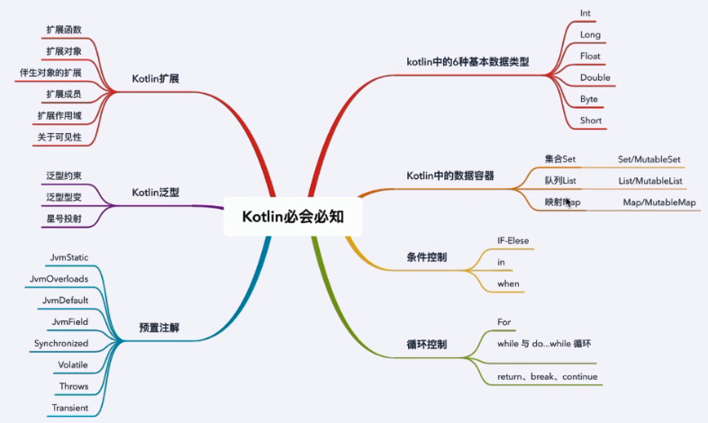

> version：2021/10/
>
> review：

目录

[TOC]

# 一、特点

1、高效简洁，同样功能可以使用更少代码，少写样板代码。

2、更安全，可避免null指针异常错误。

3、可互操作，可以和Java代码互相调用。

4、结构化并发，协程让异步代码更易使用，简化后台任务管理。

# 二、涉及内容

# 相关问题

Q：

Q：

Q：

Q：

Q：

Q：

Q：

# 总结

1、

## 【精益求精】我还能做（补充）些什么？

1、

# 脑图

# 参考

