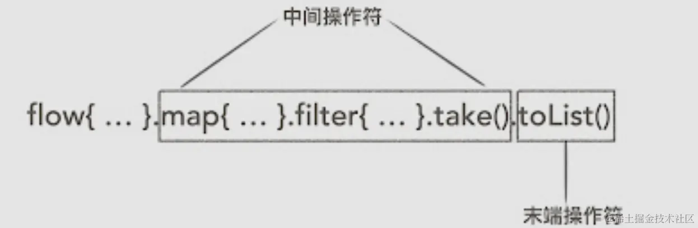

`Kotlin Flow` 基本上可以替代RxJava，其提供了诸多操作符来处理数据。本文分下类，整理基本用法。

# 前置

- 冷流 🥶

> 冷指的是 无消费者时 则不会生产数据

- 热流 🥵

> 热指的是 无观察者时 也会生产数据

## Flow分类

Flow官方文档：https://kotlinlang.org/api/kotlinx.coroutines/kotlinx-coroutines-core/kotlinx.coroutines.flow/

- ### 一般 Flow

> 一般的`Fowl` , 仅有一个观察者 。冷流 。

```kotlin
val testFlow = flow<String>{
    emit("hello")
    emit("flow")
}

//接收
coroutineScope.launch{
  testFlow.collect{ value->
     println(value)
  }
}

//打印
hello
flow
```

- ### `StateFlow`

> **有状态**的`Flow` ，可以有多个观察者，热流
> 构造时需要传入初始值 : initialState
> 常用作与UI相关的数据观察，类比`LiveData`

```kotlin
//创建
val uiState=MutableStateFlow(Result.Loading)

//监听
coroutineScope.launch{
    uiState.collect{ value->
         println(value)
    }
}

//赋值
uiState.value=Result.Sucess 

//打印结果
Result.Loading
Result.Sucess
```

- ### `SharedFlow`

> 可定制化的`StateFlow`，可以有多个观察者，热流. 无需初始值，有三个可选参数：
> `replay` - **重播**给新订阅者的值的数量（不能为负，默认为零）。
> `extraBufferCapacity` - 除了replay之外**缓冲**的值的数量。 当有剩余缓冲区空间时， emit不会挂起（可选，不能为负，默认为零）。
> `onBufferOverflow` - 配置缓冲区**溢出**的操作（可选，默认为暂停尝试发出值）
> 使用`SharedFlow` 你可以写个 [FlowEventBus](https://juejin.cn/post/6985093305470025764)

```kotlin
//创建
val signEvent=MutableSharedFlow <String> ()

//监听
coroutineScope.launch{
    signEvent.collect{ value->
         println(value)
    }    
}
//赋值
signEvent.tryEmit("hello")
signEvent.tryEmit("shared flow")

//打印结果
hello
shared flow
```

### MutableSharedFlow和MutableStateFlow

MutableSharedFlow和MutableStateFlow是Kotlin协程库中用于处理流式数据的两个重要类，它们在功能和使用场景上存在一些区别。以下是它们之间主要区别的详细分析：

1. 初始值要求

- **MutableStateFlow**：需要有一个初始值。这个初始值在创建MutableStateFlow对象时就必须指定，代表了状态的初始状态。
- **MutableSharedFlow**：不需要初始值。它可以在没有初始数据的情况下被创建，更适合于那些不需要初始数据或者初始数据不重要的场景。

2. 缓存和重放行为

- **MutableStateFlow**：虽然它主要用于状态管理，但其行为在某些方面类似于replay参数为1的MutableSharedFlow。即，新的订阅者可以立即接收到当前最新的状态值，但不会接收到之前的状态变化历史。
- **MutableSharedFlow**：通过replay参数控制缓存和重放行为。replay参数指定了在订阅者订阅之后，流可以缓存并重新发送给订阅者的元素数量。例如，replay=1时，新的订阅者将接收到流中最后一个发送的元素，类似于LiveData的行为。

3. 背压处理

- **MutableStateFlow**：主要用于状态管理，其设计并不直接关注背压问题（即生产者发送数据的速度超过消费者处理数据的速度时的处理）。它更侧重于状态的更新和通知。
- **MutableSharedFlow**：提供了更灵活的背压处理机制。通过extraBufferCapacity和onBufferOverflow参数，可以控制当缓存满时的行为，如暂停发送、丢弃旧数据或抛出异常等。

4. 使用场景

- **MutableStateFlow**：适用于需要管理应用程序状态并通知状态变化的场景。它提供了一种简单的方式来观察和更新状态，并与协程一起使用以实现异步、非阻塞的数据处理。
- **MutableSharedFlow**：适用于需要在多个地方同时观察和发送数据的场景。它支持多个观察者，并且可以通过replay参数实现数据的缓存和重放，从而满足更复杂的数据传输需求。

5. 性能考虑

- 在选择使用MutableStateFlow还是MutableSharedFlow时，还需要考虑性能因素。由于MutableStateFlow通常用于状态管理，并且其设计更侧重于状态的简单更新和通知，因此在性能方面可能更加高效。而MutableSharedFlow由于支持多个观察者和缓存机制，可能在处理大量数据和复杂场景时会有更高的性能开销。

综上所述，MutableSharedFlow和MutableStateFlow在初始值要求、缓存和重放行为、背压处理、使用场景以及性能考虑等方面存在明显的区别。在选择使用哪个类时，需要根据具体的应用场景和需求进行权衡和选择。

# 冷流与热流

在Kotlin协程中，Flow是一种用于处理异步数据流的重要概念。Flow可以分为冷流（Cold Flow）和热流（Hot Flow）两种类型，它们在数据流的处理方式上有着本质的区别。

## 冷流（Cold Flow）

**定义与特性**：

- 冷流指的是在数据被使用方订阅后（即调用collect方法之后），提供方才开始执行发送数据流的代码。这种机制下，数据的生产和消费是同步的，即不消费，不生产；多次消费才会多次生产。使用方和提供方之间是一对一的关系。
- 在Flow构建器（如flow{}）中的代码，只有在调用collect方法时才会执行。这意味着，如果没有调用collect方法，Flow中的代码将不会被执行，数据也不会被生产。

**示例**：

```kotlin
flow {  
    println("Flow 异步流开始执行") // 这行代码在调用collect之前不会执行  
    for (i in 0..2) {  
        delay(500) // 异步挂起500ms  
        println("发射元素$i")  
        emit(i) // 发射元素  
    }  
}.collect { // 调用collect方法后，Flow构建器中的代码才会执行  
    println("收集到元素$it")  
}
```

## 热流（Hot Flow）

**定义与特性**：

- 热流则是指无论有无使用方订阅，提供方都可以执行发送数据流的操作。热流的数据生产是独立于消费的，即不管有无消费，都可生产。提供方和使用方之间是一对多的关系，即一个热流可以被多个使用方订阅。
- SharedFlow是热流的一种实现，任何流也可以通过stateIn、shareIn等操作转化为热流，或者通过produceIn操作将流转化为一个热通道。

**示例**（假设SharedFlow作为热流示例）：

```kotlin
val sharedFlow = MutableSharedFlow<Int>()  
  
// 在某个协程中发射数据  
lifecycleScope.launch {  
    sharedFlow.emit(1) // 无需等待订阅即可发射数据  
    sharedFlow.emit(2)  
}  

// 在另一个地方订阅数据流  
lifecycleScope.launch {  
    sharedFlow.collect {  
        println("收集到热流数据: $it")  
    }  
}
```

## 总结

热流实现了FlowCollector接口，有 emit() 方法，可以直接发射数据。

冷流没有实现FlowCollector接口。

冷流和热流的主要区别在于数据的生产和消费是否同步，以及提供方是否独立于使用方存在。冷流在数据被消费时才生产，而热流则可以在没有消费者的情况下独立生产数据。这种区别使得冷流和热流在不同的应用场景下有着不同的优势和适用性。在选择使用冷流还是热流时，需要根据具体的需求和场景来决定。

# 背压机制

背压是一种机制，允许消费者根据自己的处理能力来控制生产者的生产速度，以防止数据积压或丢失。 

**MutableSharedFlow中的背压处理是指当数据流的生产速率超过消费速率时，系统如何处理这种压力的情况**。在Kotlin协程中，MutableSharedFlow作为一个用于在多个订阅者之间共享数据流的类，其背压处理机制是确保数据流稳定传输的关键。以下是对MutableSharedFlow中背压处理的详细解释：

## 背压的概念

背压（Backpressure）是一个在异步数据流处理中常见的概念，它指的是当生产者（数据源）产生数据的速度超过消费者（数据处理者）处理数据的速度时，系统需要采取的一种策略来应对这种压力。如果不妥善处理背压，可能会导致数据丢失、内存溢出或系统崩溃等问题。

## MutableSharedFlow的背压处理策略

MutableSharedFlow通过几个参数和机制来支持背压处理，主要包括：

1. replay和extraBufferCapacity参数
   - **replay**：决定了新的订阅者能够收到多少历史数据。如果replay设置为0，则新的订阅者不会收到任何历史数据；如果设置为1或更大值，则新的订阅者可以收到最新的一个或多个数据项。
   - **extraBufferCapacity**：为MutableSharedFlow提供了一个额外的缓冲区容量，用于在数据生产速率高于消费速率时缓存数据。这个参数与replay参数共同决定了缓存的总容量。
2. onBufferOverflow参数
   - 这个参数指定了当缓冲区满时（即达到replay+extraBufferCapacity的容量限制）应该采取的策略。可用的策略包括：
     - **BufferOverflow.SUSPEND**：当缓冲区满时，新的emit操作将被挂起，直到缓冲区中有空间可用。这是默认策略。
     - **BufferOverflow.DROP_OLDEST**：当缓冲区满时，将丢弃最旧的数据项，以便为新数据腾出空间。
     - **BufferOverflow.DROP_LATEST**：当缓冲区满时，将丢弃最新的（即最近尝试添加的）数据项。

## 背压处理的实际应用

在实际应用中，根据数据流的特性和消费者的处理能力，可以选择合适的背压处理策略。例如，如果数据流是实时性要求很高的，可能需要选择BufferOverflow.DROP_OLDEST或BufferOverflow.DROP_LATEST策略，以确保新数据能够尽快被处理。而如果数据流的实时性要求不是那么高，但数据的完整性很重要，那么可以选择BufferOverflow.SUSPEND策略，并在必要时增加extraBufferCapacity的值来扩大缓冲区容量。

## 注意事项

- **合理设置参数**：根据实际需求合理设置replay、extraBufferCapacity和onBufferOverflow参数，以确保数据流处理的稳定性和效率。
- **避免长时间挂起**：如果选择了BufferOverflow.SUSPEND策略，并且数据流的生产速率长期高于消费速率，可能会导致emit操作的协程长时间挂起，影响系统性能。因此，需要合理设计数据流的生产和消费逻辑，避免长时间挂起的情况发生。
- **监控和日志**：在生产环境中，建议对MutableSharedFlow的背压情况进行监控，并记录相关日志。这有助于及时发现和处理潜在的背压问题。

# 操作符

- 中间操作符
  - 一般来说是用来执行一些操作，不会立即执行，返回值还是个`Flow`
- 末端操作符
  - 会触发流的执行，返回值不是`Flow`



## 创建Flow

### flow

> 创建Flow的基本方法.
> 使用 **emit** 发射单个值
> 使用 **emitAll** 发射一个流 ，类似 `list.addAll(anotherList)`

```kotlin
flow<Int>{
    emit(1)
    emit(2)
    emitAll(flowOf(1,2,3))
}
```

### flowOf

> 快速创建 `flow` ,类比 `listOf()`

```kotlin
val testFLow = flowOf(1,2,3)
launch{
    testFLow.collect{ value->
        print(value)
    }
}

//打印结果
1
2
3
```

### asFlow

> **将其他数据转换成 普通的**`flow` **，一般是\**\*\*集合\*\**\*向**`Flow`**的转换**

```kotlin
listOf(1,2,3).asFlow()
```

### callbackFlow

> 将回调方法改造成`flow` ,类似`suspendCoroutine`

```kotlin
/**
 * 模拟网络请求
 */
fun requestApi(block: (String) -> Unit) {
    thread {
        Log.d("requestApi - ", "网络请求")
        Thread.sleep(3000)
        block("网络请求结果：xxx")
    }
}
callbackFlow {
    
    //模拟网络请求回调
    requestApi { result ->
        //发送数据
        trySend(result)
    }
    
    awaitClose {
        //当数据接收者所在的协程被关闭的时候会调用。
        //作用是：用来释放资源，取消网络请求等操作
        Log.i("callbackFlow_awaitClose", "")
    }
}.collect {
    //接收结果
    Log.i("callbackFlow_collect", it)
}
```

### emptyFlow

> 返回一个空流 .

```kotlin
emptyFlow<Int>()
```

### channelFlow 不懂

缺示例。还不太理解，好像其他Flow也可以切换线程？

特性&作用：

热流；异步任务协调；

> 在一般的`flow`在构造代码块中不允许切换线程，`ChannelFlow`则允许内部切换线程

```kotlin
//构建
val channelFlow = channelFlow<String> {
 send("hello")
    withContext(Dispatchers.IO) {
     send("channel flow")
    }
 }

//监听
coroutineScope.launch{
    signEvent.collect{ value->
         println(value)
    }
}
```


## 末端操作符

### collect

> 触发flow的运行 。 通常的监听方式

```kotlin
launch{
    flowOf(1,2,3).collect{ value->
        print(value)
    }
}

// 1 2 3
```

### collectIndexed

> 带下标的 收集操作

```kotlin
launch{
    flowOf(1,2,3).collectIndexed{ value->
        print(value)
    }
}

// 1 2 3
```

- **[collectLatest](https://link.juejin.cn/?target=https%3A%2F%2Fkotlin.github.io%2Fkotlinx.coroutines%2Fkotlinx-coroutines-core%2Fkotlinx.coroutines.flow%2Fcollect-latest.html)**

> 与 `collect`的区别是 ，有新值发出时，如果此时上个收集尚未完成，则会**取消**掉上个值的收集操作

```kotlin
flow {
 emit(1)
    delay(50)
    emit(2)
 } .collectLatest { value ->

 println("Collecting $value")
    delay(100) // Emulate work
    println("$value collected")

 }

//输出
Collecting 1
Collecting 2
2 collected
```

只想要最新的数据，中间值可以丢弃时可以使用此方式

- **[toCollection](https://link.juejin.cn/?target=https%3A%2F%2Fkotlin.github.io%2Fkotlinx.coroutines%2Fkotlinx-coroutines-core%2Fkotlinx.coroutines.flow%2Fto-collection.html)**

> 将结果添加到集合

```scss
scss
复制代码val array = arrayListOf(0)
launch {
  flow {
     emit(1)
     emit(2)
    } .toCollection(array)
 }

array.forEach { value->
  print(value)
 }

//打印结果 

0 1 2
```

- **[toList](https://link.juejin.cn/?target=https%3A%2F%2Fkotlin.github.io%2Fkotlinx.coroutines%2Fkotlinx-coroutines-core%2Fkotlinx.coroutines.flow%2Fto-list.html)**

> 将结果转换为`List`

```scss
scss
复制代码flow {
   emit(1)
   emit(2)
} .toList().forEach{value->
    print(value)
}
// 1 2
```

- **[toSet](https://link.juejin.cn/?target=https%3A%2F%2Fkotlin.github.io%2Fkotlinx.coroutines%2Fkotlinx-coroutines-core%2Fkotlinx.coroutines.flow%2Fto-set.html)**

> 将结果转换为`Set`

```scss
scss
复制代码flow {
   emit(1)
   emit(1)
} .toSet().forEach{value->
    print(value)
}
// 1
```

- **[launchIn](https://link.juejin.cn/?target=https%3A%2F%2Fkotlin.github.io%2Fkotlinx.coroutines%2Fkotlinx-coroutines-core%2Fkotlinx.coroutines.flow%2Flaunch-in.html)**

> 直接触发流的执行，不设置`action`,入参为`coroutineScope` 一般不会直接调用，会搭配别的操作符一起使用，如`onEach`,`onCompletion` 。返回值是`Job`

```scss
scss
复制代码flow {
   emit(1)
   emit(2)
 }.launchIn ( lifecycleScope )
```

- **[last](https://link.juejin.cn/?target=https%3A%2F%2Fkotlin.github.io%2Fkotlinx.coroutines%2Fkotlinx-coroutines-core%2Fkotlinx.coroutines.flow%2Flast.html)**

> 返回流 发出 的**最后一个值** **,如果为空会抛异常**

```scss
scss
复制代码val myFlow= flow {
   emit(1)
   emit(2)
 }

launch{
    print(myFlow.last())
}

// 2
```

- **[lastOrNull](https://link.juejin.cn/?target=https%3A%2F%2Fkotlin.github.io%2Fkotlinx.coroutines%2Fkotlinx-coroutines-core%2Fkotlinx.coroutines.flow%2Flast-or-null.html)**

> 返回流 发出 的**最后一个值** **,可以为空**

```scss
scss
复制代码val myFlow= emptyFlow<Int>()
launch{
    print(myFlow.lastOrNull())
}

// null
```

- **[first](https://link.juejin.cn/?target=https%3A%2F%2Fkotlin.github.io%2Fkotlinx.coroutines%2Fkotlinx-coroutines-core%2Fkotlinx.coroutines.flow%2Ffirst.html)**

> 返回流 发出 的**第一个值** **,如果为空会抛异常**

```scss
scss
复制代码val myFlow= flow {
   emit(1)
   emit(2)
 }
launch{
    print(myFlow.first())
}

// 1
```

- **[firstOrNull](https://link.juejin.cn/?target=https%3A%2F%2Fkotlin.github.io%2Fkotlinx.coroutines%2Fkotlinx-coroutines-core%2Fkotlinx.coroutines.flow%2Ffirst-or-null.html)**

> 返回流 发出 的**第一个值** **,可以为空**

```scss
scss
复制代码val myFlow= emptyFlow<Int>()
launch{
    print(myFlow.firstOrNull())
}
// null
```

- **[single](https://link.juejin.cn/?target=https%3A%2F%2Fkotlin.github.io%2Fkotlinx.coroutines%2Fkotlinx-coroutines-core%2Fkotlinx.coroutines.flow%2Fsingle.html)**

> 接收流发送的第一个值 ，区别于`first()`,如果**为空**或者发了**不止一个**值，则都会报错

```scss
scss
复制代码val myFlow= flow {
     emit(1)
}

launch {
     print(myFlow.single()) // 1
}

val myFlow1= flow {
   emit(1)
   emit(2)
 }

launch {
   print(myFlow 1 . single ()) // error
}
```

- **[singleOrNull](https://link.juejin.cn/?target=https%3A%2F%2Fkotlin.github.io%2Fkotlinx.coroutines%2Fkotlinx-coroutines-core%2Fkotlinx.coroutines.flow%2Fsingle-or-null.html)**

> 接收流发送的第一个值 ，可以为空 ,发出多值的话除第一个，后面均被置为null

```scss
scss
复制代码val myFlow= flow {
 emit(1)
}

launch  {
 print(myFlow. singleOrNull ()) // 1
}
```

- **[count](https://link.juejin.cn/?target=https%3A%2F%2Fkotlin.github.io%2Fkotlinx.coroutines%2Fkotlinx-coroutines-core%2Fkotlinx.coroutines.flow%2Fcount.html)**

> 返回流发送值的个数。 类似 `list.size()` ，注：`sharedFlow`无效(无意义）

```scss
scss
复制代码val myFlow= flow {
   emit(1)
   emit(2)
}
launch{
    print(myFlow.count())
}
//2
```

- **[fold](https://link.juejin.cn/?target=https%3A%2F%2Fkotlin.github.io%2Fkotlinx.coroutines%2Fkotlinx-coroutines-core%2Fkotlinx.coroutines.flow%2Ffold.html)**

> 从初始值开始 执行遍历,并将结果作为下个执行的 参数。

```ini
ini
复制代码val sum= flowOf(2, 3, 4)
            .fold(1, { result, value ->
                 result + value
            })
// sum = 10， 相当于 1 + 2 + 3 + 4
```

- **[reduce](https://link.juejin.cn/?target=https%3A%2F%2Fkotlin.github.io%2Fkotlinx.coroutines%2Fkotlinx-coroutines-core%2Fkotlinx.coroutines.flow%2Freduce.html)**

> 和`fold` 差不多。 无初始值

```ini
val result= flowOf(1, 2, 3)
                .reduce { acc, value ->
                     acc + value
                }
 //result = 6   1 + 2  +3 
```


## 回调操作符

### onStart

> 在上游流开始之前被调用。 可以发出额外元素,也可以处理其他事情，比如发埋点

```scss
flow<Result>{
   emit(Result.Success)
}.onStart{
   emit(Result.Loading)
}
```

### onCompletion

> 在流**取消或者结束**时调用。可以执行发送元素，发埋点等操作

```kotlin
flow<Result>{
   emit(Result.Success)
}.onCompletion{
   emit(Result.End)
}
```

### onEach

> 在上游向下游发出元素之前调用

```kotlin
flow<Int>{
   emit(1)
   emit(2)
   emit(3)
}.onEach{ value->
   println(value)
}.launchIn(lifecycleScope)

// 打印结果
1
2
3
```

### onEmpty

> 当流完成却没有发出任何元素时回调。 可以用来兜底.。

```scss
emptyFlow<String>().onEmpty {
   emit("兜底数据")
 } .launchIn(lifecycleScope)
```

### onSubscription

> `SharedFlow` **专属**操作符 （`StateFlow`是`SharedFlow` 的一种特殊实现）
> 在**建立订阅之后** 回调。 和 `onStart` 有些区别 ，`SharedFlow` 是热流，因此如果在`onStart`里发送值，则下游可能接收不到。

```scss
val state = MutableSharedFlow<String>().onSubscription {
     emit("onSubscription")
 }

launch{
    state.collect { value->
        println(value)
    }
}


//打印结果

onSubscription
```


## 变换操作符

- **[map](https://link.juejin.cn/?target=https%3A%2F%2Fkotlin.github.io%2Fkotlinx.coroutines%2Fkotlinx-coroutines-core%2Fkotlinx.coroutines.flow%2Fmap.html)**

> 将发出的值 进行变换 ，`lambda`的返回值为最终发送的值

```scss
scss
复制代码flow {
    emit(1)
    emit(2)
 } .map { value ->
    value * 2
 } .collect {
    println(value)
}

//打印结果
2
4
```

- **[mapLatest](https://link.juejin.cn/?target=https%3A%2F%2Fkotlin.github.io%2Fkotlinx.coroutines%2Fkotlinx-coroutines-core%2Fkotlinx.coroutines.flow%2Fmap-latest.html)**

> 类比 `collectLatest` **,当有新值发送时如果上个变换还没结束，会先取消掉**

```scss
scss
复制代码flow {
    emit("a")
    delay(100)
    emit("b")
}.mapLatest { value ->
    println("Started computing $value")
    delay(200)
    "Computed $value"
}.collect {value->
 print(value)
}

// 打印结果
Started computing a
Started computing b
Computed b
```

- **[mapNotNull](https://link.juejin.cn/?target=https%3A%2F%2Fkotlin.github.io%2Fkotlinx.coroutines%2Fkotlinx-coroutines-core%2Fkotlinx.coroutines.flow%2Fmap-not-null.html)**

> 仅发送 `map`后不为空的值

```scss
scss
复制代码flow {
    emit("a")
    emit("b")
 } .mapNotNull { value ->
  if (value != "a") {
        value
    } else {
        null
 }
 }.collect { value ->
    print(value)
}
// 结果

b
```

- **[transform](https://link.juejin.cn/?target=https%3A%2F%2Fkotlin.github.io%2Fkotlinx.coroutines%2Fkotlinx-coroutines-core%2Fkotlinx.coroutines.flow%2Ftransform.html)**

> 对发出的值 进行变换 。区别于`map`， `transform`的接收者是`FlowCollector` ，因此它非常灵活，可以变换、跳过它或多次发送。

```scss
scss
复制代码flow {
    emit(1)
    emit(2)
 } .transform { value ->
  if (value == 1) {
        emit("value :$value*2")
    }
    emit("transform :$value")
 }.collect { value->
  println(value)
}

// 打印结果

value : 1*2
transform :1
transform :2
```

- **[transformLatest](https://link.juejin.cn/?target=https%3A%2F%2Fkotlin.github.io%2Fkotlinx.coroutines%2Fkotlinx-coroutines-core%2Fkotlinx.coroutines.flow%2Ftransform-latest.html)**

> 类比 **[mapLatest](https://link.juejin.cn/?target=https%3A%2F%2Fkotlin.github.io%2Fkotlinx.coroutines%2Fkotlinx-coroutines-core%2Fkotlinx.coroutines.flow%2Fmap-latest.html)** **,当有新值发送时如果上个变换还没结束，会先取消掉**

```scss
scss
复制代码flow {
  emit("a")
  delay(100)
  emit("b")
 }.transformLatest { value ->
  emit(value)
  delay(200)
  emit(value + "_last")
 }.collect {value->
  println(value)
}


// 打印结果
a
b
b_last
```

- **[transformWhile](https://link.juejin.cn/?target=https%3A%2F%2Fkotlin.github.io%2Fkotlinx.coroutines%2Fkotlinx-coroutines-core%2Fkotlinx.coroutines.flow%2Ftransform-while.html)**

> 这个变化的`lambda` 的返回值是 `Boolean` ,如果为 `False`则不再进行后续变换, 为 `True`则继续执行

```scss
scss
复制代码flow {
    emit("a")
    emit("b")
 } .transformWhile { value ->
    emit(value)
    true
 } .collect { value->
  println(value)
}


//结果
a
b

--------------------

flow {
    emit("a")
    emit("b")
 }.transformWhile { value ->
    emit(value)
    false
 }.collect { value->
    println(value)
}

//结果
a
```

- **[asStateFlow](https://link.juejin.cn/?target=https%3A%2F%2Fkotlin.github.io%2Fkotlinx.coroutines%2Fkotlinx-coroutines-core%2Fkotlinx.coroutines.flow%2Fas-state-flow.html)**

> 将 `MutableStateFlow` 转换为 `StateFlow` ，就是变成不可变的。常用在对外暴露属性时使用

```ini
ini
复制代码private val _uiState = MutableStateFlow<UIState>(Loading)

val uiState = _uiState.asStateFlow()
```

- **[asSharedFlow](https://link.juejin.cn/?target=https%3A%2F%2Fkotlin.github.io%2Fkotlinx.coroutines%2Fkotlinx-coroutines-core%2Fkotlinx.coroutines.flow%2Fas-shared-flow.html)**

> 将 `MutableSharedFlow` 转换为 `SharedFlow` ，就是变成不可变的。常用在对外暴露属性时使用

```ini
ini
复制代码private val _uiState = MutableStateFlow<UIState>(Loading)

val uiState = _uiState.asStateFlow()
```

- **[receiveAsFlow](https://link.juejin.cn/?target=https%3A%2F%2Fkotlin.github.io%2Fkotlinx.coroutines%2Fkotlinx-coroutines-core%2Fkotlinx.coroutines.flow%2Freceive-as-flow.html)**

> 将`Channel` 转换为`Flow` ,可以有多个观察者，但不是多播，可能会轮流收到值。

```ini
ini
复制代码private val _event = Channel<Event>()

val event= _event.receiveAsFlow() 
```

- **[consumeAsFlow](https://link.juejin.cn/?target=https%3A%2F%2Fkotlin.github.io%2Fkotlinx.coroutines%2Fkotlinx-coroutines-core%2Fkotlinx.coroutines.flow%2Fconsume-as-flow.html)**

> 将`Channel` 转换为`Flow` ,但**不能多个观察者**（会crash）!

```ini
ini
复制代码private val _event = Channel<Event>()

val event= _event.consumeAsFlow () 
```

- **[withIndex](https://link.juejin.cn/?target=https%3A%2F%2Fkotlin.github.io%2Fkotlinx.coroutines%2Fkotlinx-coroutines-core%2Fkotlinx.coroutines.flow%2Fwith-index.html)**

> 将结果包装成`IndexedValue` 类型

```scss
scss
复制代码flow {
    emit("a")
    emit("b")
 } .withIndex().collect {
  print(it.index + ": " + it.value)
}


//结果
0 : a
1 : b
```

- **[scan](https://link.juejin.cn/?target=https%3A%2F%2Fkotlin.github.io%2Fkotlinx.coroutines%2Fkotlinx-coroutines-core%2Fkotlinx.coroutines.flow%2Fscan.html)**

> 和 `fold` 相似，区别是`fold` 返回的是最终结果，`scan`返回的是个`flow` ，会把初始值和每一步的操作结果发送出去。

```ini
ini
复制代码flowOf(1, 2, 3).scan(0) { acc, value ->
    acc + value 
 }.collect {
  print(it)
}

// 0 1 3 6
acc 是上一步操作的结果， value 是发射的值

0 是 初始值 
1 是 0 + 1 = 1
3 是 1 + 2 = 3
6 是 3 + 3 = 6
```

- **[produceIn](https://link.juejin.cn/?target=https%3A%2F%2Fkotlin.github.io%2Fkotlinx.coroutines%2Fkotlinx-coroutines-core%2Fkotlinx.coroutines.flow%2Fproduce-in.html)**

> 转换为 `ReceiveChannel` , 不常用。
> 注： `Channel` 内部有 `ReceiveChannel` 和 `SendChannel`之分,看名字就是一个发送，一个接收。

```scss
scss
复制代码flowOf(1, 2, 3).produceIn(this)
               .consumeEach { value->
                    print(value)
               }
               
//1 2 3
```

- **[runningFold](https://link.juejin.cn/?target=https%3A%2F%2Fkotlin.github.io%2Fkotlinx.coroutines%2Fkotlinx-coroutines-core%2Fkotlinx.coroutines.flow%2Frunning-fold.html)**

> 区别于 `fold` ，就是返回一个新流，将每步的结果发射出去。

```scss
scss
复制代码flowOf(1, 2, 3).runningFold(1){ acc, value ->
     acc + value
 } .collect { value->
     print(value)
 }
 // 1 2 4 7
```

- **[runningReduce](https://link.juejin.cn/?target=https%3A%2F%2Fkotlin.github.io%2Fkotlinx.coroutines%2Fkotlinx-coroutines-core%2Fkotlinx.coroutines.flow%2Frunning-reduce.html)**

> 区别于 `reduce` ，就是返回一个新流，将每步的结果发射出去。

```scss
scss
复制代码flowOf(1, 2, 3).runningReduce { acc, value ->
     acc + value
 } .collect { value->
     print(value)
 }
 // 1 3 6
```

- **[shareIn](https://link.juejin.cn/?target=https%3A%2F%2Fkotlin.github.io%2Fkotlinx.coroutines%2Fkotlinx-coroutines-core%2Fkotlinx.coroutines.flow%2Fshare-in.html)**

> 将普通`flow` 转化为 `SharedFlow` , 其有三个参数
> `scope`: `CoroutineScope` *开始共享的协程范围* `started`: `SharingStarted` *控制何时开始和停止共享的策略*
> `replay: Int = 0` 发给 新的订阅者 的旧值数量

> 其中 `started` 有一些可选项:
> `Eagerly` : 共享立即开始，永不停止
> `Lazily` : 当第一个订阅者出现时,永不停止
> `WhileSubscribed` : 在第一个订阅者出现时开始共享，在最后一个订阅者消失时立即停止（默认情况下），永久保留重播缓存（默认情况下）
> `WhileSubscribed` 具有以下可选参数：
> `stopTimeoutMillis` — 配置最后一个订阅者消失到协程停止共享之间的延迟（以毫秒为单位）。 默认为零（立即停止）。
> `replayExpirationMillis` - 共享的协程从停止到重新激活，这期间缓存的时效

```scss
scss
复制代码val share = flowOf(1,2,3).shareIn(this,SharingStarted.Eagerly)

//可以有多个观察者
state.collect{value->
  print(value)
}
```

- **[stateIn](https://link.juejin.cn/?target=https%3A%2F%2Fkotlin.github.io%2Fkotlinx.coroutines%2Fkotlinx-coroutines-core%2Fkotlinx.coroutines.flow%2Fstate-in.html)**

> 将普通`flow` 转化为 `StateFlow` 。 其有三个参数：
> `scope` - 开始共享的协程范围
> `started` - 控制何时开始和停止共享的策略
> `initialValue` - 状态流的初始值

```scss
scss
复制代码val  state = flowOf(Success).stateIn(lifecycleScope,SharingStarted.Eagerly,Loading)


state.collect{value->
  print(value)
}
// Loading  Success
```

`stateIn`和`sharedIn` 通常用在其他来源的`flow`的改造监听，不会像上面那样使用。


## 过滤操作符

### filter

> 筛选出符合条件的值

```scss
flow {
    emit("a")
    emit("b")
}.filter { value ->
    value == "a"
}.collect { value->
    print(value)
}


//结果
a
```

### filterInstance

> 筛选对应类型的值

```scss
flow {
    emit("a")
    emit("b")
    emit(1)
 }.filterIsInstance<String>().collect { value->
    print(value)
 }

//结果

a
b
```

### filterNot

> 筛选不符合条件相反的值,相当于`filter`取反

```scss
flow {
    emit("a")
    emit("b")
 }.filterNot { it == "a" } .collect { value ->
   print(value)
}


//结果
b
```

### filterNotNull

> 筛选不为空的值

```scss
flow {
    emit("a")
    emit(null)
    emit("b")
 }.filterNotNull().collect { value->
  print(value)
}


//结果
a
b
```

### drop

> 入参`count`为`int`类型 ,作用是 丢弃掉前 n 个的值

```scss
flow {
    emit(1)
    emit(2)
    emit(3)
 }.drop(2).collect { value ->
  print(value)
}


//结果
3
```

### dropWhile

> 这个操作符有点特别，和`filter` 不同！ 它是找到第一个**不满足条件的**，返回其和其之后的值。
> 如果首项就不满足条件，则是全部返回。

```scss
flow {
 emit(3)
 emit(1) //从此项开始不满足条件
 emit(2)
 emit(4)
}. dropWhile { it == 3  } .collect { value ->
  print(value)
}


//结果 
1 2 4


flow {
 emit(1) //从首项开始就不满足条件
 emit(2)
 emit(3)
 emit(4)
}. dropWhile { it == 3  } .collect { value ->
 print(value)
}

//结果

1 2 3 4
```

### take

> 返回前 n个 元素

```scss
flow {
    emit(1)
    emit(2)
    emit(3)
 } .take(2) .collect { value ->
    print(value)
}

//结果
1
2
```

### takeWhile

> 也是找第一个不满足条件的项，但是取其之前的值 ，和`dropWhile` **相反。**

> 如果第一项就不满足，则为**空流**

```scss
flow {
    emit(1)
    emit(2)
    emit(3) //从此项开始不满足条件
    emit(4)
 } .takeWhile { it <3  } .collect { value ->
    print(value)
}

//结果
1 2 


flow {
    emit(3)  //从此项开始不满足条件
    emit(1)
    emit(2)
    emit(4)
 } .takeWhile { it <3  } .onEmpty {
  print( "empty")
 }.collect { value ->
  print(value)
}

//结果
empty
```

### debounce

> 防抖节流 ，指定时间内的值只接收最新的一个，其他的过滤掉。搜索联想场景适用
>
> 当emit一个数据后，如果指定时间内又 emit 了一个数据，则上一个数据会被过滤掉，从最新的 emit 再次计时。
>
> 最后一个emit 的数据总是会发出。

```kotlin
flow {
    emit(1)
    delay(90)
    emit(2)
    delay(90)
    emit(3)
    delay(1010)
    emit(4)
    delay(1010)
    emit(5)
}.debounce(1000)

 // 3 4 5
```

### sample

> 采样 。给定一个时间周期，仅获取周期内最新发出的值

```scss
flow {
    repeat(10) {
        emit(it)
        delay(110)
    }
}.sample(200)


// 1 3 5 7 9

//图示

       【1】

|-----------|

1          200  

               2    【3】

           |------------|

          200           400
```

### distinctUntilChangedBy

> 去重操作符，判断连续的两个值是否重复，可以选择是否丢弃重复值。

> ```
> keySelector: (T) -> Any?` 指定用来判断是否需要比较的 `key
> ```

> 有点类似Recyclerview的DiffUtil机制。

```ini
flowOf(
    Funny(name = "Tom", age = 8),
    Funny(name = "Tom", age = 12),
    Funny(name = "Tom", age = 12)
).distinctUntilChangedBy { it.name } .collect { value ->
     print(value.toString())
}

// Funny(name=Tom, age=8)
```

### distinctUntilChanged

> 过滤用，`distinctUntilChangedBy` **的简化调用 。连续两个值一样，则跳过发送**

```scss
flowOf(1, 1, 3,1).distinctUntilChanged()
                .collect { value ->
                   print(value)
                }

// 1 3 1
```


## 组合操作符

- **[combine](https://link.juejin.cn/?target=https%3A%2F%2Fkotlin.github.io%2Fkotlinx.coroutines%2Fkotlinx-coroutines-core%2Fkotlinx.coroutines.flow%2Fcombine.html)**

> 组合每个流**最新**发出的值。

```scss
scss
复制代码val flow = flowOf(1, 2).onEach { delay(10) }
val flow2 = flowOf("a", "b", "c").onEach { delay(15) }
flow.combine(flow2) { i, s -> i.toString() + s } .collect {
  println(it) // Will print "1a 2a 2b 2c"
}
```

- **[combineTransform](https://link.juejin.cn/?target=https%3A%2F%2Fkotlin.github.io%2Fkotlinx.coroutines%2Fkotlinx-coroutines-core%2Fkotlinx.coroutines.flow%2Fcombine-transform.html)**

> 顾名思义 **[combine](https://link.juejin.cn/?target=https%3A%2F%2Fkotlin.github.io%2Fkotlinx.coroutines%2Fkotlinx-coroutines-core%2Fkotlinx.coroutines.flow%2Fcombine.html)** + **[transform](https://link.juejin.cn/?target=https%3A%2F%2Fkotlin.github.io%2Fkotlinx.coroutines%2Fkotlinx-coroutines-core%2Fkotlinx.coroutines.flow%2Ftransform.html)******

```scss
scss
复制代码val numberFlow = flowOf(1, 2).onEach { delay(10) }
val stringFlow = flowOf("a", "b", "c").onEach { delay(15) }

numberFlow.combineTransform(stringFlow) { number, string ->
     emit("$number :$string")
 }.collect { value ->
     println( value )
 }


//结果
1 :a
2 :a
2 :b
2 :c
```

- **[merge](https://link.juejin.cn/?target=https%3A%2F%2Fkotlin.github.io%2Fkotlinx.coroutines%2Fkotlinx-coroutines-core%2Fkotlinx.coroutines.flow%2Fmerge.html)**

> 合并多个流成 一个流。 可以用在 多级缓存加载上

```scss
scss
复制代码val numberFlow = flowOf(1, 2).onEach { delay(10) }
val stringFlow = flowOf("a", "b", "c").onEach { delay(15) }

listOf(numberFlow,stringFlow).merge()
                             .collect { value ->
                                 print(value)
                             }


// 1 a 2 b c
```

- **[flattenConcat](https://link.juejin.cn/?target=https%3A%2F%2Fkotlin.github.io%2Fkotlinx.coroutines%2Fkotlinx-coroutines-core%2Fkotlinx.coroutines.flow%2Fflatten-concat.html)**

> 以顺序方式将给定的流展开为单个流 ，是`Flow<Flow<T>>`的扩展函数

```scss
scss
复制代码flow {
    emit(flowOf(1, 2, 3))
    emit(flowOf(4, 5, 6))
 } .flattenConcat().collect { value->
     print(value)
 }

// 1 2 3 4 5 6
```

- **[flattenMerge](https://link.juejin.cn/?target=https%3A%2F%2Fkotlin.github.io%2Fkotlinx.coroutines%2Fkotlinx-coroutines-core%2Fkotlinx.coroutines.flow%2Fflatten-merge.html)**

> 作用和 `flattenConcat` **一样**，但是可以设置并发收集流的数量。

> 有个入参：`concurrency: Int` ,当其 == 1时，效果和 `flattenConcat` **一样，大于 1 时，则是并发收集。**

```scss
flow {
    emit(flowOf(1, 2, 3).flowOn(Dispatchers.IO))
    emit(flowOf(4, 5, 6).flowOn(Dispatchers.IO))
    emit(flowOf(7, 8, 9).flowOn(Dispatchers.IO))
 }.flattenMerge(3).collect { value->
     print(value)
 }


//1 2 3 7 8 9 4 5 6 (顺序并不固定)
```

### flatMapContact

> 这是一个组合操作符，相当于 **[map](https://link.juejin.cn/?target=https%3A%2F%2Fkotlin.github.io%2Fkotlinx.coroutines%2Fkotlinx-coroutines-core%2Fkotlinx.coroutines.flow%2Fmap.html)** + **[flattenConcat](https://link.juejin.cn/?target=https%3A%2F%2Fkotlin.github.io%2Fkotlinx.coroutines%2Fkotlinx-coroutines-core%2Fkotlinx.coroutines.flow%2Fflatten-concat.html)** **, 通过 map 转成一个流，在通过 flattenConcat** 展开合并成一个流

```kotlin
flowOf(1, 2, 3).flatMapConcat {
     flowOf(it.toString() + " map")
 } .collect { value ->
     println (value)
 }

// 1 map 
// 2 map
// 3 map


flowOf(1, 2, 3).flatMapConcat {
    flowOf("$it map1","$it map2")
}.collect { value ->
    println(value)
}

1 map1
1 map2
2 map1
2 map2
3 map1
3 map2
```

### flatMapLatest

> 和其他 带 **Latest**的操作符 一样，如果下个值来了，上变换还没结束，就取消掉。相当于 **[transformLatest](https://link.juejin.cn/?target=https%3A%2F%2Fkotlin.github.io%2Fkotlinx.coroutines%2Fkotlinx-coroutines-core%2Fkotlinx.coroutines.flow%2Ftransform-latest.html)** **+ emitAll**

```scss
flow {
     emit("a")
     delay(100)
     emit("b")
 }.flatMapLatest { value ->
     flow {
         emit(value)
         delay(200)
         emit(value + "_last")
     }
 }.collect { value ->
     print(value)
 }

 // a b b_last
```

- **[flatMapMerge](https://link.juejin.cn/?target=https%3A%2F%2Fkotlin.github.io%2Fkotlinx.coroutines%2Fkotlinx-coroutines-core%2Fkotlinx.coroutines.flow%2Fflat-map-merge.html)**

> 也是组合操作符，简化使用。 **[map](https://link.juejin.cn/?target=https%3A%2F%2Fkotlin.github.io%2Fkotlinx.coroutines%2Fkotlinx-coroutines-core%2Fkotlinx.coroutines.flow%2Fmap.html)** + **[flattenMerge](https://link.juejin.cn/?target=https%3A%2F%2Fkotlin.github.io%2Fkotlinx.coroutines%2Fkotlinx-coroutines-core%2Fkotlinx.coroutines.flow%2Fflatten-merge.html)** **。 因此也是有** `concurrency: Int` **这样一个参数，来限制并发数。**

```scss
scss
复制代码flowOf("a","b","c","d","e","f").flatMapMerge(3) { value ->
     flow {
         emit(value)
     } .flowOn(Dispatchers.IO)
 }.collect { value ->
     print(value)
 }

// b a c d e f
```

- **[zip](https://link.juejin.cn/?target=https%3A%2F%2Fkotlin.github.io%2Fkotlinx.coroutines%2Fkotlinx-coroutines-core%2Fkotlinx.coroutines.flow%2Fzip.html)**

> 对两个流进行组合，分别从二者取值，一旦一个流结束了，那整个过程就结束了。

```scss
scss
复制代码val flow = flowOf(1, 2, 3).onEach { delay(10) }

val flow2 = flowOf("a", "b", "c", "d").onEach { delay(15) }

flow.zip(flow2) { i, s -> i.toString() + s }.collect {
    println(it) 
}

 // Will print "1a 2b 3c"
```


## 功能性操作符

- **[cancellable](https://link.juejin.cn/?target=https%3A%2F%2Fkotlin.github.io%2Fkotlinx.coroutines%2Fkotlinx-coroutines-core%2Fkotlinx.coroutines.flow%2Fcancellable.html)**

> 接收的的时候判断 协程是否被取消 ，如果已取消，则抛出异常

```scss
scss
复制代码val job= flowOf(1,3,5,7).cancellable().onEach { value->
     print(value)
 } .launchIn(lifecycleScope)
 
 //取消
 job.cancel()
```

- **[catch](https://link.juejin.cn/?target=https%3A%2F%2Fkotlin.github.io%2Fkotlinx.coroutines%2Fkotlinx-coroutines-core%2Fkotlinx.coroutines.flow%2Fcatch.html)**

> 对**上游**异常进行捕获 ，对下游无影响

> **上游** 指的是 此操作符之前的流

> **下游** 指的是此操作符之后的流

```kotlin
kotlin
复制代码flow<Int> {
  throw IOException("")     
 } .catch { e ->
  if(e is IOException){
        //...
 }
}
```

- **[retryWhen](https://link.juejin.cn/?target=https%3A%2F%2Fkotlin.github.io%2Fkotlinx.coroutines%2Fkotlinx-coroutines-core%2Fkotlinx.coroutines.flow%2Fretry-when.html)**

> 有条件的进行重试 ，`lambda` 中有两个参数: 一个是 异常原因，一个是当前重试的 `index` (从0开始).

> `lambda` 的返回值 为 `Boolean` ，`true`则继续重试 ,`false` 则结束重试

```kotlin
kotlin
复制代码flow<Int> {
    print("doing")
    throw IOException("")
 } .retryWhen { cause,attempt->
     if(attempt > 4){
        return@retryWhen false
     }
    cause is IOException
 }
```

- **[retry](https://link.juejin.cn/?target=https%3A%2F%2Fkotlin.github.io%2Fkotlinx.coroutines%2Fkotlinx-coroutines-core%2Fkotlinx.coroutines.flow%2Fretry.html)**

> 重试机制 ，当流发生异常时可以重新执行。`retryWhen` **的简化版。**

> `retries: ``Long`` = Long.MAX_VALUE` 指定重试次数，以及控制是否继续重试.(默认为true)

```kotlin
kotlin
复制代码flow<Int> {
  throw IOException("")     
 }. retry (3){ e->
  if(e is IOException){
      true
  }else {
      false
  }
}


flow<Int> {
  throw IOException("")     
 }.retry(3)
```

- **[buffer](https://link.juejin.cn/?target=https%3A%2F%2Fkotlin.github.io%2Fkotlinx.coroutines%2Fkotlinx-coroutines-core%2Fkotlinx.coroutines.flow%2Fbuffer.html)**

> **如果操作符的代码需要相当\**\**长时间来执行** **，可使用**`buffer`**操作符在执行期间为其创建一个单独的协程**

> `capacity: Int = BUFFERED` 缓冲区的容量

> `onBufferOverflow: BufferOverflow = BufferOverflow.``SUSPEND` **溢出的话执行的操作

> 有三个选择 ： *SUSPEND 挂起， DROP_OLDEST 丢掉旧的，DROP_LATEST 丢掉新的*

```less
less
复制代码flowOf("A", "B", "C")
    .onEach  { println("1$it") }
    .collect { println("2$it") }

    
Q : -->-- [1A] -- [2A] -- [1B] -- [2B] -- [1C] -- [2C] -->--


flowOf("A", "B", "C")
 .onEach  { println("1$it") }
 .buffer()  // <--------------- buffer between onEach and collect
 .collect { println("2$it") }


P : -->-- [1A] -- [1B] -- [1C] ---------->--  // flowOf(...).onEach { ... }

                      |
                      | channel               // buffer()
                      V

Q : -->---------- [2A] -- [2B] -- [2C] -->--  // collect
```

- **[conflate](https://link.juejin.cn/?target=https%3A%2F%2Fkotlin.github.io%2Fkotlinx.coroutines%2Fkotlinx-coroutines-core%2Fkotlinx.coroutines.flow%2Fconflate.html)**

> 仅保留最新值, 内部就是 `buffer``(``CONFLATED``)`

```scss
flow {
      repeat(30) {
      delay(100)
      emit(it)
    }
 }.conflate().onEach { delay(1000) } .collect { value ->
     print(value)
 }

// 0 7 15 22 29  (结果不固定)
```

- **[flowOn](https://link.juejin.cn/?target=https%3A%2F%2Fkotlin.github.io%2Fkotlinx.coroutines%2Fkotlinx-coroutines-core%2Fkotlinx.coroutines.flow%2Fflow-on.html)**

> 指定上游操作的执行线程 。 想要切换执行线程 就用它！

```scss
flow.map { ... } // Will be executed in IO
 . flowOn (Dispatchers.IO) // This one takes precedence
 . collect{ ... }
```

# 总结

以上就是`Kotlin Flow`所有操作符的基本用法，在实际场景中按需使用。比如上面说的：搜索场景使用`debounce`防抖，网络请求使用`retry`,组件通信使用`SharedFlow`, 数据合并使用`combine`等操作符。提升开发效率啦噜


## 异步流

通过对协程的学习我们知道，挂起函数可以异步的返回单个结果值。比如:

```kotlin
fun test(){
    GlobalScope.launch {
        val withStr = withContext(Dispatchers.Default){
            "a"
        }
        val awaitStr = async {
            "b"
        }
        val list = simple()
        Log.d("test","withStr :$withStr")
        Log.d("test","awaitStr :${awaitStr.await()}")
        Log.d("test","list :$list  ")

    }
}

D/test: withStr :a
D/test: awaitStr :b
D/test: list :[1, 2, 3]  
```

即使我们在函数中使用`List`返回一个集合结果，这样也只能认为是返回一个结果，只不过返回的结果类型是`List`类型。

那么如果我们想在协程中和使用RxJava一样，通过响应式编程方式如何异步返回多个计算好的值呢。可能有人想到使用序列`Sequence`进行操作。

```kotlin
public fun <T> sequence(@BuilderInference block: suspend SequenceScope<T>.() -> Unit): Sequence<T> = Sequence { iterator(block) }
```

使用序列`Sequence`确实是可以实现，因为`sequence`本身接接受的也是一个`suspend`的挂起函数：

```kotlin
private fun simple(): Sequence<Int> = sequence {
    for (i in 1..3) {
        Thread.sleep(100)
        yield(i)
    }
}

fun test() {
    simple().forEach { value ->
        Log.d(TAG, "value :${value}")
    }
}

D/carman: value :1
D/carman: value :2
D/carman: value :3
```

但是这里我我们是不可使用`delay`挂起函数来做延时的，只能使用`Thread.sleep`。这是因为`sequence`接收的是一个`SequenceScope`的扩展函数，而在`SequenceScope`类上使用了`RestrictsSuspension`注解。此注解标记的类和接口在用作扩展挂起函数的接收器时受到限制。这些挂起扩展只能调用这个特定接收器上的其他成员或扩展挂起函数，并且不能调用任意的挂起函数。

```kotlin
@RestrictsSuspension
public abstract class SequenceScope<in T> internal constructor() {
    //....
}
```

如果没有这限制的话，可能就会出现在使用下一个元素的时候，还会有切换线程的副作用。同理，如果我们想通过指定调度器，来指定序列创建所在的线程，同样是不可以的，甚至都不可能设置协程上下文。

既然序列`Sequence`有这么多限制，那么就必须创造有个新的东西来实现，这个时候`Flow`就应运而生。

## Flow与RxJava区别

对于熟悉响应式流（[Reactive Streams](https://link.juejin.cn/?target=https%3A%2F%2Fwww.reactive-streams.org%2F)）或`RxJava`这样的响应式框架的人来说。`Flow`的设计也许看起来会非常熟悉，尤其是各种操作符看起来都近乎一样。

`Flow`的设计灵感也来源于响应式流以及其各种实现。但是 `Flow` 的主要目标是拥有尽可能简单的设计，以及对`kotlin`协程更友好的支持。有兴趣可以看看 [Reactive Streams and Kotlin Flows](https://link.juejin.cn/?target=https%3A%2F%2Fmedium.com%2F@elizarov%2Freactive-streams-and-kotlin-flows-bfd12772cda4) 这篇文章了解`Flow`的故事。

虽然有所不同，但从概念上讲，`Flow` 依然是响应式流。和`RxJava`一样，依然有冷热流之分。相比于`RxJava`的切换线程，`Flow`也会更加简单。

官方在 `kotlinx.coroutines`中提供的相关响应式模块（如：`kotlinx-coroutines-reactive` 用于 `Reactive Streams`， `kotlinx-coroutines-rx2`/`kotlinx-coroutines-rx3` 用于 `RxJava2/RxJava3`等）。 这些模块可以让`Flow`与其他实现之间进行转换。

`Flow`本身是一个接口，在这个接口里面定义了一个挂起函数`collect`，它接收的是一个`FlowCollector`对象。`FlowCollector`接口中有一个挂起函数`emit`。那它们又是如何实现响应式流的呢。

```kotlin
public interface Flow<out T> {
    @InternalCoroutinesApi
    public suspend fun collect(collector: FlowCollector<T>)
}

public interface FlowCollector<in T> {
    public suspend fun emit(value: T)
}
```

## 创建冷数据流`Flow`

老规矩，现在我们`Flow`来替换之前的使用序列`Sequence`的实现：

### 通过`flow {...}`函数创建

```kotlin
fun test() {
    lifecycleScope.launch {
        flow {
            for (i in 1..3) {
                delay(100)
                emit(i)
            }
        }.collect { value -> Log.d(TAG, "value :${value}") }
    }
}
```

注意使用`Flow`的代码与先前示例的区别。这里使用的是`flow {...}` 函数创建了一个**冷数据流**`Flow`，通过`emit`来发射数据，然后通过`collect`函数来收集这些数据。但是因为`collect`是挂起函数，挂起函数的调用又必须在另一个挂起函数或者协程作用域中。此时就需要我们使用协程来执行。

我们继续来看看它们具体是如何实现的，上源码：

```kotlin
public fun <T> flow(@BuilderInference block: suspend FlowCollector<T>.() -> Unit): Flow<T> = SafeFlow(block)
```

虽然我们使用的是`flow {...}` 函数，但是实际是通过`SafeFlow`类创建的`Flow`对象。`SafeFlow`继承自`AbstractFlow`。而`AbstractFlow`同时继承了`Flow`和`CancellableFlow`两个接口。这也就意味着我们创建的**冷数据流**`Flow`是可以取消的。

```kotlin
private class SafeFlow<T>(private val block: suspend FlowCollector<T>.() -> Unit) : AbstractFlow<T>() {
    override suspend fun collectSafely(collector: FlowCollector<T>) {
        collector.block()
    }
}

@FlowPreview
public abstract class AbstractFlow<T> : Flow<T>, CancellableFlow<T> {

    public final override suspend fun collect(collector: FlowCollector<T>) {
        val safeCollector = SafeCollector(collector, coroutineContext)
        try {
            collectSafely(safeCollector)
        } finally {
            safeCollector.releaseIntercepted()
        }
    }

    public abstract suspend fun collectSafely(collector: FlowCollector<T>)
}
```

这里可以看到虽然我们调用的是`collect`函数，但是实际是通过`collectSafely`函数执行。调用`SafeCollector`执行`collect`的`block`高阶函数参数。只不过是在**出现异常**的时候它会执行`SafeCollector`的`releaseIntercepted`函数。我们继续往下看`SafeCollector`的实现。

```kotlin
internal actual class SafeCollector<T> actual constructor(
    @JvmField internal actual val collector: FlowCollector<T>,
    @JvmField internal actual val collectContext: CoroutineContext
) : FlowCollector<T>, ContinuationImpl(NoOpContinuation, EmptyCoroutineContext), CoroutineStackFrame {
    //...
    override val context: CoroutineContext
        get() = completion?.context ?: EmptyCoroutineContext
    
    override fun invokeSuspend(result: Result<Any?>): Any {
        result.onFailure { lastEmissionContext = DownstreamExceptionElement(it) }
        completion?.resumeWith(result as Result<Unit>)
        return COROUTINE_SUSPENDED
    }
    
    public actual override fun releaseIntercepted() {
        super.releaseIntercepted()
    }
    
    override suspend fun emit(value: T) {
        return suspendCoroutineUninterceptedOrReturn sc@{ uCont ->
            try {
                emit(uCont, value)
            } catch (e: Throwable) {
                lastEmissionContext = DownstreamExceptionElement(e)
                throw e
            }
        }
    }
    
    private fun emit(uCont: Continuation<Unit>, value: T): Any? {
        //...
        return emitFun(collector as FlowCollector<Any?>, value, this as Continuation<Unit>)
    }
}
```

到这里看过[协程原理篇](https://juejin.cn/post/7020676824984190989)的小伙伴应该很熟悉了，这不就协程的执行、调度、恢复过程嘛。这里就不再重复讲解了。如果有需要的可以自己单独去看看。[传送门->协程原理1](https://juejin.cn/post/7020676824984190989) [传送门->协程原理2](https://juejin.cn/post/7020677411465347103)。


### 通过扩展函数`asFlow`创建

`Flow`的创建除了使用`flow {...}` 函数以外，我们还可以使用`asFlow`进行创建，如下：

```kotlin
fun test() {
    lifecycleScope.launch {
        (1..3).asFlow().collect { value -> Log.d(TAG, "value :${value}") }
    }
}
```

其实`asFlow`最终调用的还是`flow {...}`，`asFlow`的扩展函数有很多种，我们这里只是举例：

```kotlin
public fun <T> Array<T>.asFlow(): Flow<T> = flow {
    forEach { value ->
        emit(value)
    }
}
//....
public fun IntRange.asFlow(): Flow<Int> = flow {
    forEach { value ->
        emit(value)
    }
}
```

### 通过`flowOf`函数创建

`flowOf`只支持单个值或者可变值。同样的最终调用的还是`flow {...}`。

```kotlin
public fun <T> flowOf(vararg elements: T): Flow<T> = flow {
    for (element in elements) {
        emit(element)
    }
}
public fun <T> flowOf(value: T): Flow<T> = flow {
    emit(value)
}
```

例如：

```kotlin
fun test() {
    lifecycleScope.launch {
        flowOf(1, 2, 2, 3).collect { value ->
            Log.d(TAG, "collect :${value}")
        }
    }
}
```

上面提到通过`Flow` 是可以取消的，但是Flow好像没有提供取消操作，那么我们该如何取消`Flow`的执行呢。

其实很简单，我们知道`Flow`的执行是依赖于`collect`的，而它又必须在协程当中调用，因此取消`Flow`的主要依赖于`collect`所在的协程的状态。所以取消`Flow`只需要取消它所在的协程即可。

```KOTLIN
fun test() {
    val job = lifecycleScope.launch {
        flow {
            for (i in 1..3) {
                delay(100)
                emit(i)
            }
        }.collect { value -> Log.d(TAG, "value :${value}") }
    }
    job.cancel()
}
```

是不是突然感觉`Flow`也没有想象中的那么难搞。不过是在协程的基础上进一步封装。重点来了。为了保证`flow`上下文的一致性，禁止在`flow`代码块中出现线程调度的情况的。

```kotlin
fun test() {
     lifecycleScope.launch {
        flow {
            for (i in 1..3) {
                delay(100)
                if (i ==2 ){
                    withContext(Dispatchers.IO){
                        //骚操作
                        emit(i)
                    }
                }else{
                    emit(i)
                }
            }
        }.collect { value -> Log.d(TAG, "value :${value}") }
    }
}
```

上面的代码在编译的时候编译期是不会提示你调用错误的，但是在执行的时候会抛出一个`java.lang.IllegalStateException: Flow invariant is violated`异常。那么在执行的时候如果想切换线程又该怎么办呢


## `Flow`的线程切换

在使用`Flow`的时候如果想切换线程，我们就需要使用`Flow`的扩展函数`flowOn`。

```kotlin
public fun <T> Flow<T>.flowOn(context: CoroutineContext): Flow<T> {
    checkFlowContext(context)
    return when {
        context == EmptyCoroutineContext -> this
        this is FusibleFlow -> fuse(context = context)
        else -> ChannelFlowOperatorImpl(this, context = context)
    }
}
```

`flowOn`将执行此流的上下文更改为指定上下文。该操作符是可组合的。需要注意的是`flowOn`只影响前面没有自己上下文的操作符。这个要怎么理解能呢。我们先看默认状态flow是都执行在哪些线程上的：

```kotlin
fun test() {
    lifecycleScope.launch {
        flow {
            for (i in 1..3) {
                Log.d(TAG, "flow :${ currentCoroutineContext()}")
                delay(100)
                emit(i)
            }
        }.collect { value ->
                Log.d(TAG, "collect:${ currentCoroutineContext()} value :${value}")
            }
    }
}
```

通过前面的学习我们知道，`lifecycleScope`的`launch`默认是主线程执行的，那么按照协程的执行原理，我们可以确定上面例子中所有的执行操作都是在主线程上：

```kotlin
D/carman: flow :[StandaloneCoroutine{Active}@78b0fe4, Dispatchers.Main.immediate]
D/carman: collect:[StandaloneCoroutine{Active}@78b0fe4, Dispatchers.Main.immediate] value :1
D/carman: flow :[StandaloneCoroutine{Active}@78b0fe4, Dispatchers.Main.immediate]
D/carman: collect:[StandaloneCoroutine{Active}@78b0fe4, Dispatchers.Main.immediate] value :2
D/carman: flow :[StandaloneCoroutine{Active}@78b0fe4, Dispatchers.Main.immediate]
D/carman: collect:[StandaloneCoroutine{Active}@78b0fe4, Dispatchers.Main.immediate] value :3
```

这个时候我们使用`flowOn`切换一下线程再看看，会产生有何不一样的变化。

```kotlin
kotlin
复制代码fun test() {
    lifecycleScope.launch {
        flow {
            for (i in 1..3) {
                Log.d(TAG, "flow :${ currentCoroutineContext()}")
                delay(100)
                emit(i)
            }
        }.flowOn(Dispatchers.IO)
            .collect { value ->
                Log.d(TAG, "collect:${ currentCoroutineContext()} value :${value}")
            }
    }
}

D/carman: flow :[ProducerCoroutine{Active}@78b0fe4, Dispatchers.IO]
D/carman: flow :[ProducerCoroutine{Active}@78b0fe4, Dispatchers.IO]
D/carman: collect:[ScopeCoroutine{Active}@1e865fe, Dispatchers.Main.immediate] value :1
D/carman: flow :[ProducerCoroutine{Active}@78b0fe4, Dispatchers.IO]
D/carman: collect:[ScopeCoroutine{Active}@1e865fe, Dispatchers.Main.immediate] value :2
D/carman: collect:[ScopeCoroutine{Active}@1e865fe, Dispatchers.Main.immediate] value :3
```

可以看到`flow`代码块中的执行已经切换到另外一个线程执行。但是`collect`中的代码依然执行在主线程上。那如果我们再增加一个又会是什么结果呢？

```kotlin
fun test() {
    lifecycleScope.launch {
        flow {
            for (i in 1..3) {
                Log.d(TAG, "flow :${ currentCoroutineContext()}")
                delay(100)
                emit(i)
            }
        }.flowOn(Dispatchers.IO)
            .map {
                Log.d(TAG, "map :${ currentCoroutineContext()}")
                it
            }.flowOn(Dispatchers.Default)
            .collect { value ->
                Log.d(TAG, "collect:${ currentCoroutineContext()} value :${value}")
            }
    }
}

D/carman: flow :[ProducerCoroutine{Active}@78b0fe4, Dispatchers.IO]
D/carman: flow :[ProducerCoroutine{Active}@78b0fe4, Dispatchers.IO]
D/carman: map :[ScopeCoroutine{Active}@cc43a14, Dispatchers.Default]
D/carman: collect:[ScopeCoroutine{Active}@8b702bd, Dispatchers.Main.immediate] value :1
D/carman: flow :[ProducerCoroutine{Active}@78b0fe4, Dispatchers.IO]
D/carman: map :[ScopeCoroutine{Active}@cc43a14, Dispatchers.Default]
D/carman: collect:[ScopeCoroutine{Active}@8b702bd, Dispatchers.Main.immediate] value :2
D/carman: map :[ScopeCoroutine{Active}@cc43a14, Dispatchers.Default]
D/carman: collect:[ScopeCoroutine{Active}@8b702bd, Dispatchers.Main.immediate] value :3
```

这里我们先跳过`map`操作符，只看我们本次关注的地方。可以看到在`flowOn(Dispatchers.IO)`前的`flow{...}`中的代码是执行在`IO`线程上的，而在调用`flowOn(Dispatchers.Default)`并没有改变`flow{...}`的执行线程，只是改变了没有上下文的`map`执行线程，使`map`中的代码块执行在`Default`线程中。而`collect`中的代码依然执行在主线程上。

如果这里时候我们把`flowOn(Dispatchers.IO)`去掉，我们就会发现`flow{...}`和`map`中的代码块都将执行在`Default`线程中。

```kotlin
D/carman: flow :[ProducerCoroutine{Active}@3656c4d, Dispatchers.Default]
D/carman: map :[ProducerCoroutine{Active}@3656c4d, Dispatchers.Default]
D/carman: flow :[ProducerCoroutine{Active}@3656c4d, Dispatchers.Default]
D/carman: collect:[ScopeCoroutine{Active}@840cc75, Dispatchers.Main.immediate] value :1
D/carman: map :[ProducerCoroutine{Active}@3656c4d, Dispatchers.Default]
D/carman: flow :[ProducerCoroutine{Active}@3656c4d, Dispatchers.Default]
D/carman: collect:[ScopeCoroutine{Active}@840cc75, Dispatchers.Main.immediate] value :2
D/carman: map :[ProducerCoroutine{Active}@3656c4d, Dispatchers.Default]
D/carman: collect:[ScopeCoroutine{Active}@840cc75, Dispatchers.Main.immediate] value :3
```

通过四次日志的对比，我们可以做一些总结：

- `flowOn`可以将执行此流的上下文更改为指定的上下文。
- `flowOn`可以进行组合使用。
- `flowOn`只影响前面没有自己上下文的操作符。已经有上下文的操作符不受后面`flowOn`影响。
- 不管`flowOn`如何切换线程,`collect`始终是运行在调用它的协程调度器上。


## `Flow`的常用操作符

上面提到`Flow`的操作符`map`,实际上`collect`也是一个操作符。只是他们的责任不一样。根据官方的说法，再结合自身使用感觉，笔者把`Flow`的操作符主要分为五种（**非官方**）：

- **过度操作符**：又或者叫做**流程操作符**，用来区分流程执行到某一个阶段。比如：`onStart`/`onEach`/`onCompletion`。过渡操作符应用于上游流，并返回下游流。这些操作符也是冷操作符，就像流一样。这类操作符本身不是挂起函数。它运行的速度很快，返回新的转换流的定义。
- **异常操作符**：用来捕获处理流的异常。比如：`catch`,`onErrorCollect`(已废弃，建议用`catch`)。
- **转换操作符**：主要做一些数据转换操作。比如：`transform`/`map`/`filter`/`flatMapConcat`等
- **限制操作符**：流触及相应限制的时候会将它的执行取消。比如：`drop`/`take`等
- **末端操作符**：是在流上用于启动流收集挂起函数。`collect` 是最基础的末端操作符，但是还有另外一些更方便使用的末端操作符。例如：`toList`、`toSet`、`first`、`single`、`reduce`、`fold`等等

### 流程操作符

- `onStart`：在上游流启动之前被调用。
- `onEach`：在上游流的每个值被下游发出之前调用。
- `onCompletion`：在流程完成或取消后调用，并将取消异常或失败作为操作的原因参数传递。

需要注意的是，`onStart`在`SharedFlow(热数据流)`一起使用时，并不能保证发生在`onStart`操作内部或立即发生在`onStart`操作之后的上游流排放将被收集。这个问题我们在后面文章的`热数据流`时讲解。

```kotlin
fun test() {
    lifecycleScope.launch {
        flow {
            Log.d(TAG, "flow")
            emit(1)
        }.onStart {
            Log.d(TAG, "onStart ")
        }.onEach {
            Log.d(TAG, "onEach :${it}")
        }.onCompletion {
            Log.d(TAG, "onCompletion")
        }.collect { value ->
            Log.d(TAG, "collect :${value}")
        }
    }
}

D/carman: onStart 
D/carman: flow
D/carman: onEach :1
D/carman: collect :1
D/carman: onCompletion
```

可以看到整个执行流程依次是`onStart`->`flow{ ...}`->`onEach`->`collect`->`onCompletion`。

### 异常操作符

上面提到了`Flow`执行的时候可能会出现异常。我们先修改下代码，在`onEach`中抛出一个异常信息。再看看代码出现异常后会输出怎样的日志信息：

```kotlin
fun test() {
    lifecycleScope.launch {
        flow {
            Log.d(TAG, "flow")
            emit(1)
        }.onStart {
            Log.d(TAG, "onStart ")
        }.onEach {
            Log.d(TAG, "onEach :${it}")
            throw NullPointerException("空指针")
        }.onCompletion { cause ->
            Log.d(TAG, "onCompletion catch $cause")
        }.collect { value ->
            Log.d(TAG, "collect :${value}")
        }
    }
}

D/carman: onStart 
 D/carman: flow
 D/carman: onEach 1
 D/carman: onCompletion catch java.lang.NullPointerException: 空指针
 Process: com.example.myapplication, PID: 31145
    java.lang.NullPointerException: 空指针
    ...
    ...
```

可以看到在`onEach`中抛出一个异常后，因为异常导致协程退出，所以`collect`没有执行，但是执行了`onCompletion`。这又是怎么回事呢。

`onCompletion`不应该是在`collect`后执行吗？为什么没有执行`collect`，反而执行了`onCompletion`。这个时候我们需要看下源码：

```kotlin
public fun <T> Flow<T>.onCompletion(
    action: suspend FlowCollector<T>.(cause: Throwable?) -> Unit
): Flow<T> = unsafeFlow {
    try {
        collect(this)
    } catch (e: Throwable) {
        ThrowingCollector(e).invokeSafely(action, e)
        throw e
    }
    val sc = SafeCollector(this, currentCoroutineContext())
    try {
        sc.action(null)
    } finally {
        sc.releaseIntercepted()
    }
}
```

可以看到在`onCompletion`中，通过`try/catch` 块来捕获了`collect`方法，然后在`catch`分支里。通过`invokeSafely`执行了`onCompletion`中的代码，然后重新抛出异常。既然`onCompletion`又重新抛出了异常，那我们又该通过什么方式合理的处理这个异常呢？

在协程基础篇文章中，我们提到通过使用`try/catch` 块来处理异常。那么看下如何使用`try/catch` 进行捕获异常。

```kotlin
kotlin
复制代码fun test() {
    lifecycleScope.launch {
        try {
            flow {
                Log.d(TAG, "flow")
                emit(1)
                throw NullPointerException("空指针")
            }.onStart {
                Log.d(TAG, "onStart ")
            }.onEach {
                Log.d(TAG, "onEach ")
            }.onCompletion {
                Log.d(TAG, "onCompletion")
            }.collect { value ->
                Log.d(TAG, "collect :${value}")
            }
        } catch (e: Exception) {
            Log.d(TAG, "Exception : $e ")
        }
    }
}
```

虽然我们同样的可以使用`try/catch`来处理异常，但是这种写法是不是看上去没有那么优雅。而且出现异常后，无法再继续往下执行。即使我们在`flow {...}` 构建器内部使用 `try/catch`，然后再通过`emit`中发射，这也是不合理的。因为它是违反异常透明性的。

这个时候我们需要使用`catch`操作符来保留此异常的透明性，并允许封装它的异常处理。`catch`操作符的代码块可以分析异常并根据捕获到的异常以不同的方式对其做出反应：

- 可以使用 `throw` 重新抛出异常。
- 可以在`catch`代码块中通过`emit`将异常转换为新的值发射出去。
- 可以将异常忽略，或用日志打印，或使用一些其他代码处理它。

现在我们修改一下代码，去掉`try/catch`块。然后通过`catch`操作符来捕获异常后，最后通过`emit`中发射一个新的值出去。

```kotlin
fun test() {
    lifecycleScope.launch {
        flow {
            Log.d(TAG, "flow")
            emit(1)
            throw NullPointerException("空指针")
        }.onStart {
            Log.d(TAG, "onStart ")
        }.onEach {
            Log.d(TAG, "onEach ")
        }.catch { cause ->
            Log.d(TAG, "catch $cause")
            emit(2)
        }.onCompletion { cause ->
            Log.d(TAG, "onCompletion catch $cause")
        }.collect { value ->
            Log.d(TAG, "collect :${value}")
        }
    }
}

D/carman: onStart 
D/carman: flow
D/carman: onEach 1
D/carman: catch java.lang.NullPointerException: 空指针
D/carman: collect :2
D/carman: onCompletion catch null
```

可以看到我们通过`catch`操作符捕获异常后，`collect`能够只能收集到上游发射的值。通过我们在`catch`操作符中通过`emit`发射的值`2`也正常被收集。而且我们在`onCompletion`也不会收集到异常信息。

这个时候我们如果再修改一下代码，在`catch`操作符后面再加一个`map`操作符，通过它再抛出一个新的异常又会是什么情况呢。

```kotlin
fun test() {
    lifecycleScope.launch {
        flow {
            Log.d(TAG, "flow")
            emit(1)
        }.onStart {
            Log.d(TAG, "onStart ")
        }.onEach {
            Log.d(TAG, "onEach $it")
            throw NullPointerException("空指针")
        }.catch { cause ->
            Log.d(TAG, "catch $cause")
            emit(2)
        }.map {
            Log.d(TAG, "map")
            throw NullPointerException("新的异常")
            it
        }.onCompletion { cause ->
            Log.d(TAG, "onCompletion2 catch $cause")
        }.collect { value ->
            Log.d(TAG, "collect :${value}")
        }
    }
}

D/carman: onStart 
D/carman: flow
D/carman: onEach 1
D/carman: catch java.lang.NullPointerException: 空指针
D/carman: map
D/carman: onCompletion2 catch java.lang.NullPointerException: 新的异常
Process: com.example.myapplication, PID: 32168
java.lang.NullPointerException: 新的异常
...
...
```

程序直接崩溃了。这又是什么情况。这是因为每个操作符只是针对它上游的流，如果下游的流中出现异常，我们需要再次添加一个`catch`操作符才能正常捕获。

但是如果我们的异常是在`collect`末端操作符中出现，这个时候我们就只能通过`try/catch`整个`Flow`数据流或来处理，或者通过协程上下文中的`CoroutineExceptionHandler`来处理（*这里可以自己动手试试*）。


### 转换操作符

在流转换操作符中，最通用的一种称为`transform`。它可以用来模仿简单的转换。还有像`map`、`fliter`、`zip`、`Combine`、`flatMapConcat`、`flatMapMerge`、`flatMapLatest`等等

#### transform操作符

`transform`操作符任意值任意次，其他转换操作符都是基于`transform`进行扩展的。比如：可以在执行长时间运行的异步请求之前，发射一个字符串并跟踪这个响应。

```kotlin
fun test() {
    lifecycleScope.launch {
        (1..3).asFlow().transform {
            emit(it)
            emit("transform $it")
        }.collect { value ->
            Log.d(TAG, "collect :${value}")
        }
    }
}

D/carman: collect :1
D/carman: collect :transform 1
D/carman: collect :2
D/carman: collect :transform 2
D/carman: collect :3
D/carman: collect :transform 3
```

#### map操作符

学过`RxJava`的同学就比较熟悉，我们同通过`map`操作符进行数据转换操作，包括转换发射出去的数据的类型：

```kotlin
fun test() {
    lifecycleScope.launch {
        flow {
            emit(1)
        }.map {
            Log.d(TAG, "第一次转换")
            it * 5
        }.map {
            Log.d(TAG, "第一次转换后的值 :$it")
            "map $it"
        }.collect { value ->
            Log.d(TAG, "最终转换后的值 :${value}")
        }
    }
}

D/carman: 第一次转换
D/carman: 第一次转换后的值 :5
D/carman: 最终转换后的值 :map 5
```

可以看到我们在第一个`map`操作符中进行乘运算，第二`map`操作符中进行类型转换。最终接收到我们经过多次转换处理后的数据。这样做的好处就是，能够保证我们在每一个流的过程中单一职责，一次转换只执行一种操作，而不是把所有过程集中到一起处理完成以后再下发。

`map`还有同类型操作符`mapNotNull`，它会过滤掉空值，只发射不为空的值。

```kotlin
fun test() {
    val flow = flowOf("one", "two", "three",null, "four")
    lifecycleScope.launch {
        flow.mapNotNull {
            it
        }.collect { value ->
            Log.d(TAG, "collect :${value}")
        }
    }
}

D/carman: collect :one
D/carman: collect :two
D/carman: collect :three
D/carman: collect :four
```

#### `fliter`操作符

顾名思义`fliter`操作符主要是对数据进行一个过滤，返回仅包含与给定匹配的原始流的值的流。

```kotlin
kotlin
复制代码fun test() {
    lifecycleScope.launch {
        (1..3).asFlow().filter {
            it < 2
        }.collect { value ->
            Log.d(TAG, "collect :${value}")
        }
    }
}

D/carman: collect :1
```

`fliter`还有很多同类型操作符，如：`filterNot`/`filterIsInstance`/`filterNotNull`。

`filterNot`效果恰恰与`fliter`想法，它取得是与判断条件相反的值。

```kotlin
fun test() {
    lifecycleScope.launch {
        (1..3).asFlow().filterNot { it < 2 }.collect { value ->
            Log.d(TAG, "collect :${value}")
        }
    }
}

D/carman: collect :2
D/carman: collect :3
```

#### `zip`操作符

`zip`操作符用于组合两个流中的相关值，与`RxJava`中的`zip`功能一样：

```kotlin
kotlin
复制代码fun test() {
    val flow1 = (1..3).asFlow()
    val flow2 = flowOf("one", "two", "three")
    lifecycleScope.launch {
        flow2.zip(flow1) { value1, value2 ->
            "$value1 :$value2"
        }.collect { value ->
            Log.d(TAG, "collect :${value}")
        }
    }
}

D/carman: collect :1 :one
D/carman: collect :2 :two
D/carman: collect :3 :three
```

### 限制操作符

#### `take`操作符

`take`操作符返回包含第一个计数元素的流。当发射次数大于等于`count`的值时，通过抛出异常来取消执行。

```kotlin
public fun <T> Flow<T>.take(count: Int): Flow<T> {
    require(count > 0) { "Requested element count $count should be positive" }
    return flow {
        var consumed = 0
        try {
            collect { value ->
                if (++consumed < count) {
                    return@collect emit(value)
                } else {
                    return@collect emitAbort(value)
                }
            }
        } catch (e: AbortFlowException) {
            e.checkOwnership(owner = this)
        }
    }
}
private suspend fun <T> FlowCollector<T>.emitAbort(value: T) {
    emit(value)
    throw AbortFlowException(this)
}
```

我们通过例子来看一下：

```kotlin
fun test() {
    lifecycleScope.launch {
        (1..3).asFlow().take(2)
            .collect { value ->
            Log.d(TAG, "collect :${value}")
        }
    }
}
D/carman: collect :1
D/carman: collect :2
```

#### `takeWhile`操作符

`takeWhile`操作符与`filter`类似，不过它是当遇到条件判断为`false`的时候，将会中断后续的操作。

```kotlin
fun test() {
    lifecycleScope.launch {
       flowOf(1,1,1,2,3,4,4,5,1,2,2,3,3).map {
           delay(100)
           it
       }.takeWhile {
            it  == 1
        }.collect { value ->
            Log.d(TAG, "collect :${value}")
        }
    }
}

D/carman: collect :1
D/carman: collect :1
D/carman: collect :1
```

可以看到虽然我们在设置的之中有四个`1`，但是因为在第四个`1`之前遇到了`false`的判断，所以取消了后续流的执行。

#### `drop`操作符

`drop`操作符与`take`恰恰相反，它是丢弃掉指定的`count`数量后执行后续的流。

```kotlin
fun test() {
   lifecycleScope.launch {
       (1..3).asFlow().drop(2)
           .collect { value ->
           Log.d(TAG, "collect :${value}")
       }
   }
}

D/carman: collect :3
```


### 末端流操作符

`collect`是最基础的末端操作符，基本上每一个例子当中我们都是使用`collect`。接下来我们讲解一下其他的末端操作符。

#### `toList`操作符

`toList`操作符是讲我们的流转换成一个`List`集合

```kotlin
fun test() {
    lifecycleScope.launch {
       val list = (1..5).asFlow().toList()
        Log.d(TAG, "toList :${list}")
    }
}

D/carman: toList :[1, 2, 3, 4, 5]
```

到这里我们对于`Flow`的使用以及在什么情况下，对应的使用哪些操作符已经非常清楚。不过我们还需要补充一点。就是我们在执行流的时候，因为每一次发射都上下游都需要时间去处理，这就会导致我们整个`flow`的处理时间变成长，那我们应该如何缩短这个时间呢。


## `Flow`的的缓冲

例如：当我们上游的流的发射很慢，每花费`100`毫秒才产生一个元素而下游的收集器也非常慢，需要花费`300`毫秒来处理元素。让我们看看从该流收集三个数字要花费多长时间：

```kotlin
fun test() {
    lifecycleScope.launch {
        val time = measureTimeMillis {
            flow {
                for (i in 1..3) {
                    delay(100)
                    emit(i)
                }
            }.collect { value ->
                delay(300)
                Log.d(TAG, "collect :${value}")
            }
        }
        Log.d(TAG, "Collected in $time ms")
    }
}

D/carman: collect :1
D/carman: collect :2
D/carman: collect :3
D/carman: Collected in 1273 ms
```

它会整个收集过程大约需要`1300`多毫秒(个人设备不一样会有偏差)，这是因为这三个数字，他们每个花费`400`毫秒。这个时候我们就需要通过`buffer`操作符来压缩转增时间。

```kotlin
fun test() {
    lifecycleScope.launch {
        val time = measureTimeMillis {
            flow {
                for (i in 1..3) {
                    delay(100)
                    emit(i)
                }
            }.buffer().collect { value ->
                delay(300)
                Log.d(TAG, "collect :${value}")
            }
        }
        Log.d(TAG, "Collected in $time ms")
    }
}

D/carman: collect :1
D/carman: collect :2
D/carman: collect :3
D/carman: Collected in 1039 ms
```

虽然他们的运行结果是一样的，但是过`buffer`操作符来执行时候变得更快了。因为`buffer`高效地创建了处理流，仅仅需要等待第一个数字产生的 100 毫秒以及处理每个数字各需花费的 300 毫秒。这种方式大约花费了 1000 毫秒来运行。


# Demo 地址


# 参考

1、[Kotlin协程之Flow使用](https://juejin.cn/post/7034381227025465375)

2、[【Kotlin Flow】 一眼看全——Flow操作符大全](https://juejin.cn/post/6989536876096913439)

