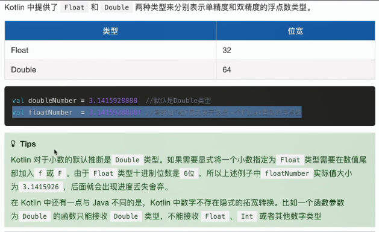

# 变量与数据类型

## 变量 & 常量

在 Java 中，大部分的变量是可变的（非 final 的），意味着任何可以访问到这个变量的代码都可以去修改它。而在 kotlin 中，变量可以分为 **可变变量(var)** 和 **不可变变量(val)** 两类

声明变量的关键字有两个：

- val（value /  varible+final）——不可变引用。使用 val 声明的变量不能在初始化之后再次赋值，对应的是 Java 中的 final 变量
- var（variable）——可变引用。var 变量的值可以被改变，对应的是 Java 中的非 final 变量

不可变变量在赋值之后就不能再去改变它的状态了，因此不可变变量可以说是线程安全的，因为它们无法改变，所有线程访问到的对象都是同一个，因此也不需要去做访问控制。开发者应当尽可能地使用不可变变量，这样可以让代码更加接近函数式编程风格

编程领域也推崇一种开发原则：尽可能使用 val，不可变对象及纯函数来设计程序。这样可以尽量避免副作用带来的影响

### 变量var

```kotlin
// 模板： var 变量名：数据类型 = 具体赋值数值
// 规则：
//      1. 采用 “var” 标识
//      2. 变量名跟在var后；数据类型在最后
//      3. 变量名与数据类型采用冒号 ":" 隔开
// 示例：
        var a: Int = 1 
        var a: Int 
        a = 2
```

### 常量（不可变量val）

```kotlin
// 模板： val 常量名：数据类型 = 具体赋值数值
// 规则：
//      1. 采用 “val” 标识
//      2. 常量名跟在val后；数据类型在最后
//      3. 常量名与数据类型采用冒号 ":" 隔开
// 示例：
        val a: Int // 声明一个不初始化的变量，必须显式指定类型
        a = 2 // 常量值不能再次更改
        val b: Int = 1 // 声明并显示指定数值

// 自动类型判断。在声明变量时我们通常不需要显式指明变量的类型，这可以由编译器根据上下文自动推导出来。
    val intValue = 1002222222222
    val doubleValue = 100.0
    val longValue = 100L

    // 如果只读变量在声明时没有初始值，则必须指明变量类型，且在使用前必须确保在各个分支条件下变量可以被初始化，否则编译器就会报异常
    val intValue2: Int
    if (false) {
        intValue2 = 10
    }
    println(intValue2) //error， Variable 'intValue2' must be initialized

// 判断数据类型：运算符is
n is Int // 判断n是不是整型类型
```

## 数据类型

### 1、基本数据类型


## Float、Double浮点类型



位运算


在 kotlin 中一切都是对象，包括数据类型，因此可以在任何变量上调用其成员函数和属性。

| 类型   | 位宽度（Bit） | 说明                                                         | 取值范围        |
| ------ | ------------- | ------------------------------------------------------------ | --------------- |
| Byte   | 8             |                                                              | -128 ~ 127      |
| Short  | 16            |                                                              | -32768 ~ 32767  |
| Int    | 32            | 初始值未超过 Int 最⼤值时是 Int 类型；如果初始值超过了最⼤值，则会推断为 Long 类型 | -2^31 ~ 2 ^31-1 |
| Long   | 64            | 加 L 后缀显式指定 Long 类型                                  | -2^64 ~ 2^63-1  |
| Float  | 32            |                                                              |                 |
| Double | 64            |                                                              |                 |

- 每种数据类型都支持类型转换

```kotlin
toByte()：Byte
toShort()：Short
toInt()：Int
toLong()：Long
toFloat()： Float
toDouble()：Double
toChar()：Char
```

```kotlin
// 在 kotlin 中，int、long、float 等类型仍然存在，但是是作为对象存在的

val intIndex: Int = 100
//等价于，编译器会自动进行类型推导
val intIndex = 100

//数字类型不会自动转型，必须要进行明确的类型转换
val doubleIndex: Double = intIndex.toDouble()
//以下代码会提示错误，需要进行明确的类型转换
//val doubleIndex: Double = intIndex

val intValue: Int = 1
val longValue: Long = 1
//以下代码会提示错误，因为两者的数据类型不一致，需要转换为同一类型后才能进行比较
//println(intValue == longValue)

//Char 不能直接作为数字来处理，需要主动转换
val ch: Char = 'c'
val charValue: Int = ch.toInt()
//以下代码会提示错误
//val charValue: Int = ch

//二进制
val value1 = 0b00101
//十六进制
val value2 = 0x123
```

此外，kotlin 的可空类型不能用 Java 的基本数据类型表示，因为 null 只能被存储在 Java 的引用类型的变量中，这意味着只要使用了基本数据类型的可空版本，它就会被编译成对应的包装类型

```kotlin
//基本数据类型
val intValue_1: Int = 200
//包装类
val intValue_2: Int? = intValue_1
val intValue_3: Int? = intValue_1
//== 比较的是数值相等性，因此结果是 true
println(intValue_2 == intValue_3)
//=== 比较的是引用是否相等，因此结果是 false
println(intValue_2 === intValue_3)
```

> 如果 intValue_1 的值是100，就会发现 intValue_2 === intValue_3 的比较结果是 true，这就涉及到 Java 对包装类对象的复用问题了

### 2、字符串

kotlin 使用 String  类型来表示字符串，字符串是不可变的。

可以使用索引运算符访问`[]` 来访问包含的单个字符；可以用  for  循环来迭代字符串；可以用 + 来连接字符串

```kotlin
val str = "leavesCZY"
println(str[1])
for (c in str) {
    println(c)
}
val str1 = str + " hello"

// 可使用三个引号 """拼接多行字符串
fun main(args: Array<String>) {
    val text = """
    字符串1
    字符串2
    """
    println(text)   // 输出存在一些前置空格
}

// 注：可通过 trimMargin()删除多余空白
fun strSample() {
    val text = """
    | str1
    |str2
    |多行字符串
    |bbbbbb
    """.trimMargin()
    println(text)    // 删除了前置空格
}


// 字符串模版（String Templates）
val intValue = 100
//可以直接包含变量
println("intValue value is $intValue") //intValue value is 100
//也可以包含表达式，使用${}
println("(intValue + 100) value is ${intValue + 100}")   //(intValue + 100) value is 200
// 在原始字符串中表示字面值（$）字符（它不支持反斜杠转义）
val price = "${'$'}100.99"
println(price)  //$100.99
```

### 3、数组

- 实现方式：使用Array类
- 使用方法：size 属性、get方法和set 方法。注：使用 [] 重载了 get 和 set 方法，可通过下标获取 / 设置数组值。
- 创建方式：方式1 = 函数arrayOf()；方式2 = 工厂函数

```kotlin
// 方式1：使用arrayOf创建1个数组：[1,2,3]
val a = arrayOf(1, 2, 3)

//初始元素均为 null ，大小为 10 的字符数组
val array2 = arrayOfNulls<String>(10)

// 方式2：使用工厂函数创建1个数组[0,2,4]
val b = Array(3, { i -> (i * 2) })
// 工厂函数源码分析
// 参数1 = 数组长度，花括号内是一个初始化值的代码块，给出数组下标 & 初始化值
public inline constructor(size: Int, init: (Int) -> T)

// 读取数组内容
println(a[0])    // 输出结果：1
println(b[1])    // 输出结果：2

// 特别注意：除了类Array，还有ByteArray, ShortArray, IntArray用来表示各个类型的数组
// 优点：省去了装箱操作，因此效率更高
// 具体使用：同Array
val x: IntArray = intArrayOf(1, 2, 3)
```

> 注： 区别于Java，Kotlin 不允许将Array赋值给Array，以防止可能的运行时失败

需要注意的是，数组类型的类型参数始终会变成对象类型，因此声明 **Array< Int >** 将是一个包含装箱类型（java.lang.Integer）的数组。如果想要创建没有装箱的基本数据类型的数组，必须使用一个基本数据类型数组的特殊类

为了表示基本数据类型的数组，kotlin 为每一种基本数据类型都提供了若干相应的类并做了特殊的优化。例如，有 **IntArray、ByteArray、BooleanArray** 等类型，这些类型都会被编译成普通的 Java 基本数据类型数组，比如 **int[]、byte[]、boolean[]** 等，这些数组中的值存储时没有进行装箱，而是使用了可能的最高效的方式。需要注意，IntArray 等并不是 Array 的子类

要创建一个基本数据类型的数组，有以下几种方式：

1. 向对应类型的类（如 IntArray）的构造函数传递数组大小，这将返回一个使用对应基本数据类型默认值初始化好的数组
2. 向对应类型的类（如 IntArray）的构造函数传递数组大小以及用来初始化每个元素的 lambda
3. 向工厂函数（如 charArrayOf）传递变长参数的值，从而得到指定元素值的数组

```kotlin
//指定数组大小，包含的元素将是对应基本数据类型的默认值(int 的默认值是 0)
val intArray = IntArray(5)
//指定数组大小以及用于初始化每个元素的 lambda
val doubleArray = DoubleArray(5) { Random().nextDouble() }
//接收变长参数的值来创建存储这些值的数组
val charArray = charArrayOf('H', 'e', 'l', 'l', 'o')
```

### 4、Any 和 Any?

Any 类型是 kotlin 所有非空类型的超类型，包括像 Int 这样的基本数据类型

如果把基本数据类型的值赋给 Any 类型的变量，则会自动装箱

```kotlin
val any: Any = 100
println(any.javaClass) //class java.lang.Integer
```

如果想要使变量可以存储包括 null 在内的所有可能的值，则需要使用 Any?

```kotlin
val any: Any? = null
```

### 5、Unit

kotlin 中的 Unit 类型类似于 Java 中的 void，可以用于函数没有返回值时的情况

```kotlin
fun check(): Unit {

}

//如果返回值为 Unit，则可以省略该声明
fun check() {

}
```

Unit 是一个完备的类型，可以作为类型参数，但 void 不行

```kotlin
interface Test<T> {
    fun test(): T
}

class NoResultClass : Test<Unit> {
    
    //返回 Unit，但可以省略类型说明，函数也不需要显式地 return 
    override fun test() {

    }

}
```

### 6、Nothing

Nothing 类型没有任何值，只有被当做函数返回值使用，或者被当做泛型函数返回值的类型参数使用时才会有意义，可以用 Nothing 来表示一个函数不会被正常终止，从而帮助编译器对代码进行诊断

编译器知道返回值为 Nothing 类型的函数从不会正常终止，所以编译器会把 name1 的类型推断为非空，因为 name1 在为 null 时的分支处理会始终抛出异常

```kotlin
data class User(val name: String?)

fun fail(message: String): Nothing {
    throw IllegalStateException(message)
}

fun main() {
    val user = User("leavesC")
    val name = user.name ?: fail("no name")
    println(name) //leavesC

    val user1 = User(null)
    val name1 = user1.name ?: fail("no name")
    println(name1.length) //IllegalStateException
}
```
