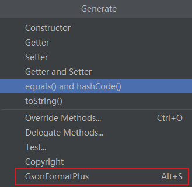
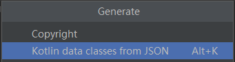

# 一、Java

1、AS安装插件GsonFormat （将json生成Bean类的）

2、新建好Bean类，在类中，alt+insert打开转化工具，粘贴jsonString生成Bean类。



3、引入 fastjson 库，用来解析json字符串

```
implementation 'com.alibaba:fastjson:1.1.72.android'
```


# 二 、kotlin

1、AS安装插件 JSON TO KOTLIN CALSS

2、新建好Bean类（data类）后，在类中，alt+insert打开转化工具，粘贴jsonString生成Bean类。



3、引入 fastjson 库，用来解析json字符串

```
implementation 'com.alibaba:fastjson:1.1.72.android'

注意还需要引入下面一个库：
// 这个库，fastjson中用到了kotlin的反射。如果有混淆，还要避免混淆，否则会影响编译通过。
// 在proguard.pro中加入混淆代码过滤，如下
//    -Keep class kotlin.jvm.** {*;}
//    -Keep class kotlin.reflect.jvm.** {*;}
implementation 'org.jetbrains.kotlin:kotlin-reflect:1.6.10'
```

