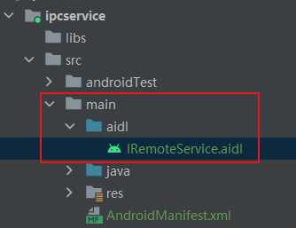
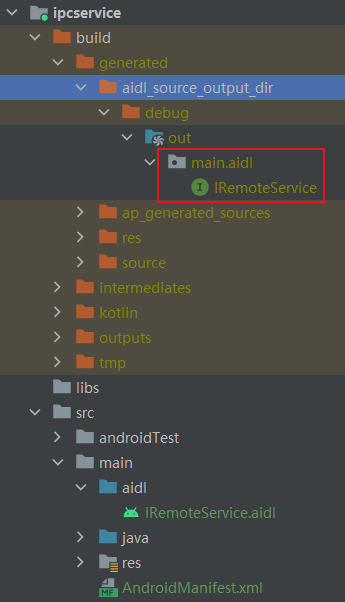
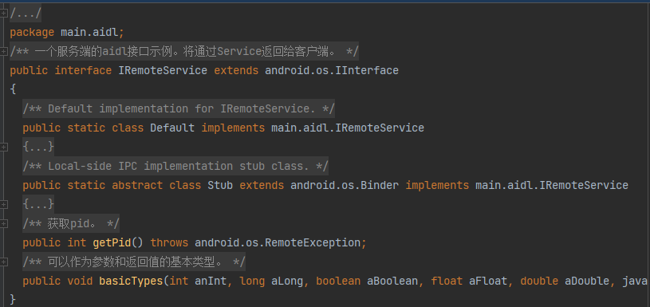
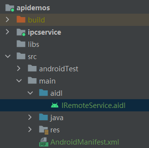
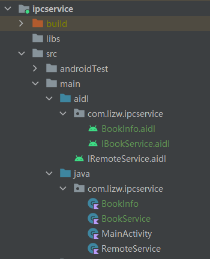
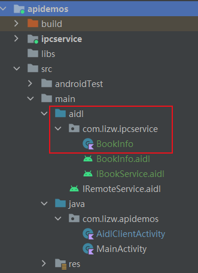
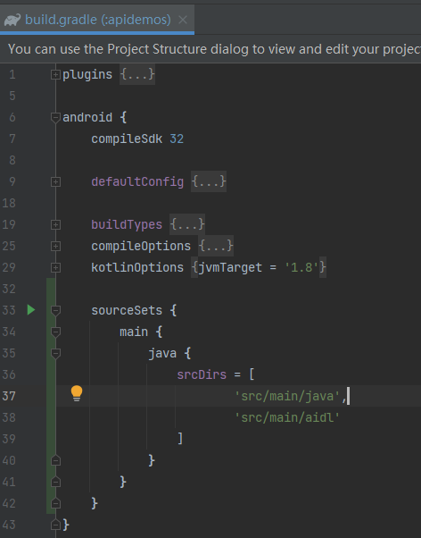

> version：2022/06/23
>
> review：


目录

[TOC]


# 一、概述

Android 接口定义语言 (AIDL) 可以定义客户端与服务端均认可的编程接口，以便二者使用进程间通信 (IPC) 进行相互通信。在 Android 中，一个进程通常无法访问另一个进程的内存。因此，为进行通信，进程需将其对象分解成可供操作系统理解的原语，并将其编组为可供您操作的对象。编写执行该编组操作的代码较为繁琐，因此 Android 会使用 AIDL 为您处理此问题。

> **注意：**只有在需要不同应用的客户端通过 IPC 方式访问服务，并且希望在服务中进行多线程处理时，才有必要使用 AIDL。如果无需跨不同应用执行并发 IPC，则应通过[实现 Binder](https://developer.android.google.cn/guide/components/bound-services#Binder) 来创建接口；或者，如果您想执行 IPC，但*不*需要处理多线程，请[使用 Messenger ](https://developer.android.google.cn/guide/components/bound-services#Messenger)来实现接口。无论如何，在实现 AIDL 之前，请务必理解[绑定服务](https://developer.android.google.cn/guide/components/bound-services)。

在开始设计 AIDL 接口之前，请注意，AIDL 接口的调用是直接函数调用。您无需对发生调用的线程做任何假设。实际情况的差异取决于调用是来自本地进程中的线程，还是远程进程中的线程。具体而言：

- 来自本地进程的调用在发起调用的同一线程内执行。如果该线程是您的主界面线程，则其将继续在 AIDL 接口中执行。如果该线程是其他线程，则其便是在服务中执行代码的线程。因此，只有在本地线程访问服务时，您才能完全控制哪些线程在服务中执行（但若出现此情况，您根本无需使用 AIDL，而应通过[实现 Binder 类](https://developer.android.google.cn/guide/components/bound-services#Binder)来创建接口）。
- 远程进程的调用分派自线程池，且平台会在您自己的进程内部维护该线程池。您必须为来自未知线程，且多次调用同时发生的传入调用做好准备。换言之，AIDL 接口的实现必须基于完全的线程安全。如果调用来自同一远程对象上的某个线程，则该调用将**依次**抵达接收器端。
- `oneway` 关键字用于修改远程调用的行为。使用此关键字后，远程调用不会阻塞（block），而只是发送事务数据并立即返回。最终接收该数据时，接口的实现会将其视为来自 `Binder` 线程池的常规调用（普通的远程调用）。如果 `oneway` 用于本地调用，则不会有任何影响，且调用仍为同步调用。


# 二、定义 AIDL 接口

您必须在 `.aidl` 文件中使用 Java 编程语言的语法定义 AIDL 接口，然后将其保存至应用的源代码（在 `src/` 目录中）内，这类应用会托管服务或与服务进行绑定。

在构建每个包含 `.aidl` 文件的应用时，Android SDK 工具会生成基于该 `.aidl` 文件的 `IBinder` 接口，并将其保存到项目的 `gen/` 目录中。服务必须视情况实现 `IBinder` 接口。然后，客户端应用便可绑定到该服务，并调用 `IBinder` 中的方法来执行 IPC。

如要使用 AIDL 创建绑定服务，请执行以下步骤：

1. 创建 .aidl 文件

   此文件定义带有方法签名的编程接口。

2. 实现接口

   Android SDK 工具会基于您的 `.aidl` 文件，使用 Java 编程语言生成接口。此接口拥有一个名为 `Stub` 的内部抽象类，用于扩展 `Binder` 类并实现 AIDL 接口中的方法。您必须扩展 `Stub` 类并实现这些方法。

3. 向客户端公开接口

   实现 `Service` 并重写 `onBind()`，从而返回 `Stub` 类的实现。

> **注意：**如果您在首次发布 AIDL 接口后对其进行更改，则每次更改必须保持向后兼容性，以免中断其他应用使用您的服务。换言之，由于只有在将您的 `.aidl` 文件复制到其他应用后，才能使其访问服务接口，因而您必须保留对原始接口的支持。


# 三.  .aidl 文件介绍

AIDL 使用一种简单语法，允许您通过一个或多个方法（可接收参数和返回值）来声明接口。参数和返回值可为任意类型，甚至是 AIDL 生成的其他接口。

您必须使用 Java 编程语言构建 `.aidl` 文件。每个 `.aidl` 文件均须定义单个接口，并且只需要接口声明和方法签名。

默认情况下，AIDL 支持下列数据类型：

- Java 编程语言中的所有原语类型（如 `int`、`long`、`char`、`boolean` 等）

- `String`

- `CharSequence`

- `List`

  `List` 中的所有元素必须是以上列表中支持的数据类型，或者您所声明的由 AIDL 生成的其他接口或 Parcelable 类型。您可选择将 `List` 用作“泛型”类（例如，`List<String>`）。尽管生成的方法旨在使用 `List` 接口，但另一方实际接收的具体类始终是 `ArrayList`。

- `Map`

  `Map` 中的所有元素必须是以上列表中支持的数据类型，或者您所声明的由 AIDL 生成的其他接口或 Parcelable 类型。不支持泛型 Map（如 `Map<String,Integer>` 形式的 Map）。尽管生成的方法旨在使用 `Map` 接口，但另一方实际接收的具体类始终是 `HashMap`。

即使您在与接口相同的包内定义上方未列出的附加类型，亦须为其各自加入一条 `import` 语句。

定义服务接口时，请注意：

- 方法可带零个或多个参数，返回值或空值。

- 所有非原语参数均需要指示数据走向的方向标记。这类标记可以是 `in`、`out` 或 `inout`（见下方示例）。

  原语默认为 `in`，不能是其他方向。

> **注意：**您应将方向限定为真正需要的方向，因为编组参数的开销较大。

- 生成的 `IBinder` 接口内包含 `.aidl` 文件中的所有代码注释（import 和 package 语句之前的注释除外）。
- 您可以在 ADL 接口中定义 String 常量和 int 字符串常量。例如：`const int VERSION = 1;`。
- 方法调用由 [transact() 代码](https://developer.android.google.cn/reference/android/os/IBinder#transact(int, android.os.Parcel, android.os.Parcel, int))分派，该代码通常基于接口中的方法索引。由于这会增加版本控制的难度，因此您可以向方法手动配置事务代码：`void method() = 10;`。
- 使用 `@nullable` 注释可空参数或返回类型。


### in、out、inout 定向标签

定向标签主要是为了节约系统编码转化的时间。提高执行效率。

- in 表示数据只能由客户端流向服务端

就是说，服务端将会接收到一个那个对象的完整数据，但是客户端的那个对象不会因为服务端对传参的修改而发生变动；

- out 表示数据只能由服务端流向客户端

即，服务端将会接收到那个对象的**空对象**，但是在服务端对接收到的空对象有任何修改之后客户端将会同步变动；

- inout 则表示数据可在服务端与客户端之间双向流通。

服务端将会接收到客户端传来对象的完整信息，并且客户端将会同步服务端对该对象的任何变动。

**哪些数据要制定标签呢？**

自定义的类，还有下面这些：

- list类型的参数，如`List<String>`
- 基本类型的数组，如byte[]
- Parcelable的实现类，如Bundle

当然，基本数据类型也是可以指定定向标签的。


# 四、基本示例

## 1、服务端定义接口（创建aidl文件并build）

1、首先在指定目录下创建一个文件：`IRemoteService.aidl`



2、然后定义接口内容，并指定package路径。

```java
// 指定包路径，就是这个aidl文件的路径。客户端需将这个aidl文件复制到相同路径。
// 然后build生成接口实现类，即可使用。
package main.aidl;

/**
 * 一个服务端的aidl接口示例。将通过Service返回给客户端。
 */
interface IRemoteService {
    /**
     * 获取pid。
     */
    int getPid();

    /**
     * 可以作为参数和返回值的基本类型。
     */
    void basicTypes(int anInt, long aLong, boolean aBoolean, float aFloat,
            double aDouble, String aString);
}
```

3、build

build后会生成如下 `IBinder` 接口文件。



生成的文件名称与 `.aidl` 文件的名称一样，区别在于其使用 `.java` 扩展名（例如，`IRemoteService.aidl` 生成的文件名是 `IRemoteService.java`）。

生成的文件内容如下：



4、服务端的aidl接口定义就完成了，接下来可以使用接口。


## 2. 服务端实现接口

当您构建应用时，Android SDK 工具会生成以 `.aidl` 文件命名的 `.java` 接口文件。生成的接口包含一个名为 `Stub` 的子类（例如，`YourInterface.Stub`），该子类是其父接口的抽象实现，并且会声明 `.aidl` 文件中的所有方法。

> **注意：**`Stub` 还会定义几个辅助方法，其中最值得注意的是 `asInterface()`，该方法会接收 `IBinder`（通常是传递给客户端 `onServiceConnected()` 回调方法的参数），并返回 Stub 接口的实例。如需了解如何进行此转换的更多详情，请参阅[调用 IPC 方法](https://developer.android.google.cn/guide/components/aidl#Calling)部分。

如要实现 `.aidl` 生成的接口，请扩展生成的 `Binder` 接口（例如，`YourInterface.Stub`），并实现继承自 `.aidl` 文件的方法。

下面是在一个Service中，返回接口实现的例子：

```kotlin
class RemoteService : Service() {
    // 一个service中，持有一个实现就可以了
    private val binder = RemoteService()

    override fun onBind(intent: Intent): IBinder {
        // 避免这样写，return RemoteService()，可能会导致binder泄漏。
        return binder
    }

    // 接口的实现就在这里，也就是客户端调用的代码，这里应该要考虑并发情况了。
    private class RemoteService : IRemoteService.Stub() {
        override fun getPid(): Int {
            return Process.myPid()
        }

        override fun basicTypes(
            anInt: Int,
            aLong: Long,
            aBoolean: Boolean,
            aFloat: Float,
            aDouble: Double,
            aString: String?
        ) {
            Log.i("basicTypes", "$anInt,$aLong,$aBoolean,$aFloat,$aDouble,$aString")
        }
    }
}
```

- 在实现 AIDL 接口时，您应注意遵守以下规则：
  - 由于无法保证在主线程上执行传入调用，因此您一开始便需做好多线程处理的准备，并对您的服务进行适当构建，使其达到线程安全的标准。
  - 默认情况下，RPC 调用是同步调用。如果您知道服务完成请求的时间不止几毫秒，则不应从 Activity 的主线程调用该服务，因为这可能会使应用挂起（Android 可能会显示“Application is Not Responding”对话框）— 通常，您应从客户端内的单独线程调用服务。
  - 您引发的任何异常都不会回传给调用方。

上面就是服务端的接口实现。

下一步就是提供service给客户端使用了，在这之前，要对service进行一下配置。

service配置

在客户端使用前，还需要对service进行以下配置：

```
<service
    android:name=".RemoteService"
    android:enabled="true"
    android:exported="true">
    <intent-filter>
        <action android:name="com.lizw.ipcservice.RemoteService.action" />
        <category android:name="android.intent.category.DEFAULT" />
    </intent-filter>
</service>
```

这个是为了不同的APP作为客户端时，能够bindService。因为其他APP是不能直接访问到RemoteService的，所以要通过action来匹配。

当然，如果是在同一个APP内进行serveice绑定，那可以不加action，如下：

```
<service
    android:name=".RemoteService"
    android:enabled="true"
    android:exported="true">
</service>
```


## 3. 客户端绑定（访问）服务端接口

服务端通过service的onBind()返回接口实现后，客户端端就可以来绑定了。

1、客户端首先要创建aidl接口，并build，如下图：



aidl 文件跟服务端保持一致。这样build后，就能使用IRemoteService接口了。

2、实现一个回调接口：

```kotlin
    private var remoteService: IRemoteService? = null

    private val mConnection: ServiceConnection = object : ServiceConnection {
        override fun onServiceConnected(name: ComponentName?, service: IBinder?) {
            remoteService = IRemoteService.Stub.asInterface(service)
            remoteService?.apply {
                Toast.makeText(this@AidlClientActivity, "$pid", Toast.LENGTH_LONG).show()
            }
        }

        override fun onServiceDisconnected(name: ComponentName?) {
            Log.e("ServiceConnection", "Service has unexpectedly disconnected")
            remoteService = null
        }
    }

```

现在，当客户端（如 Activity）调用 `bindService()` 以连接此服务时，客户端的 `onServiceConnected()` 回调会接收服务的 `onBind()` 方法所返回的 `binder` 实例。

当客户端在 `onServiceConnected()` 回调中收到 `IBinder` 时，它必须调用 `*YourServiceInterface*.Stub.asInterface(service)`，以将返回的参数转换成 `*YourServiceInterface*` 类型。

3、bindService

下面就可以开始绑定了。

不同APP绑定：

```kotlin
val intent = Intent().apply {
    `package` = "com.lizw.ipcservice"
    action = "com.lizw.ipcservice.RemoteService.action"
}

bindService(intent, mConnection, Context.BIND_AUTO_CREATE)
```

相同APP绑定：

```java
Intent intent = new Intent(Binding.this, RemoteService.class);
intent.setAction(IRemoteService.class.getName());
bindService(intent, mConnection, Context.BIND_AUTO_CREATE);
```

绑定时可能会遇到一种情况，客户端点击bind按钮，会一直没反应。

这个和targetSdk有关，如果低于`api30`，那是不会有问题了。否则，会没有反应，解决方法如下：

```
<manifest xmlns:android="http://schemas.android.com/apk/res/android"
    package="com.lizw.apidemos">

    <queries>
        <package android:name="com.lizw.ipcservice"/>
    </queries>
    
    <application
```

在AndroidManifest中，添加queries表情，指定服务端的packageName。这样可以bindService了。

下面是客户端绑定的示例：

```kotlin
class AidlClientActivity : AppCompatActivity() {

    private var remoteService: IRemoteService? = null

    private val mConnection: ServiceConnection = object : ServiceConnection {
        override fun onServiceConnected(name: ComponentName?, service: IBinder?) {
            remoteService = IRemoteService.Stub.asInterface(service)
            remoteService?.apply {
                Toast.makeText(this@AidlClientActivity, "$pid", Toast.LENGTH_LONG).show()
            }
        }

        override fun onServiceDisconnected(name: ComponentName?) {
            Log.e("ServiceConnection", "Service has unexpectedly disconnected")
            remoteService = null
        }
    }

    override fun onCreate(savedInstanceState: Bundle?) {
        super.onCreate(savedInstanceState)
        setContentView(R.layout.activity_aidl_client)

        findViewById<Button>(R.id.bind).setOnClickListener {
            val intent = Intent().apply {
                `package` = "com.lizw.ipcservice"
                action = "com.lizw.ipcservice.RemoteService.action"
            }

            bindService(intent, mConnection, Context.BIND_AUTO_CREATE)
        }
    }
}
```


# 五、通过 IPC 传递对象

可以通过 IPC 接口，将某个类从一个进程发送至另一个进程。不过，必须要确保 IPC 通道的另一端可使用该类的代码，并且该类必须支持 `Parcelable` 接口。支持 `Parcelable` 接口很重要，因为 Android 系统能通过该接口将对象分解成可编组至各进程的原语。

如要创建支持 `Parcelable` 协议的类，此类必须：

1. 实现 `Parcelable` 接口。

2. 实现 `writeToParcel`，它会获取对象的当前状态并将其写入 `Parcel`。

3. 添加 `CREATOR` 静态字段，该字段是实现 `Parcelable.Creator` 接口的对象。

4. 最后，创建声明 Parcelable 类的 `.aidl` 文件（遵照下文 `Rect.aidl` 文件所示步骤）。


AIDL 会在其生成的代码中使用这些方法和字段，以对您的对象进行编组和解编。

1、首先，创建一个实现 `Parcelable` 接口的类，如下：

```kotlin
class BookInfo() : Parcelable {
    var name: String = ""
    var type = 0
    var price = 0

    constructor(inParcel: Parcel) : this() {
        readFromParcel(inParcel)
    }

    override fun describeContents(): Int {
        return 0
    }

    override fun writeToParcel(outParcel: Parcel, flags: Int) {
        outParcel.writeString(name)
        outParcel.writeInt(type)
        outParcel.writeInt(price)
    }

    private fun readFromParcel(inParcel: Parcel) {
        name = inParcel.readString().toString()
        type = inParcel.readInt()
        price = inParcel.readInt()
    }

    companion object CREATOR : Parcelable.Creator<BookInfo> {
        override fun createFromParcel(parcel: Parcel): BookInfo {
            return BookInfo(parcel)
        }

        override fun newArray(size: Int): Array<BookInfo> {
            return Array(size) { BookInfo() }
        }
    }
}
```

> mynote：要再了解下 `Parcel` 的其他相关方法，知道可以向 Parcel 写入哪些其他类型的值。

> **警告：**请勿忘记从其他进程中接收数据的安全问题。在本例中，`BookInfo` 从 `Parcel` 读取2个int，一个String，但需确保：无论调用方目的为何，这些数字均在可接受的值范围内。如需详细了解如何防止应用受到恶意软件侵害、保证应用安全，请参阅[安全与权限](https://developer.android.google.cn/guide/topics/security/security)。

2、创建实现 Parcelable 接口的类的aidl文件

```java
// BookInfo.aidl
package com.lizw.ipcservice;

// 声明 BookInfo ，这样 AIDL 就可以找到它，并知道它实现了 parcelable 接口。
parcelable BookInfo;
```

3、在 aidl 文件中使用（定义接口）

```java
// IBookService.aidl
package com.lizw.ipcservice;

import com.lizw.ipcservice.BookInfo;

interface IBookService {
    // 获取图书信息
    BookInfo getBookInfo();
    
    // 查询某本图书是否存在
    boolean isExist(in BookInfo bookInfo);
}
```

这一步，下面就跟基本示例中的操作一样了：

1、服务端定义接口

2、服务端实现接口

3、服务端创建服务，返回接口实现

4、客户端复制过来aidl文件和BookInfo文件并build

5、绑定服务，调用服务端接口

这一步，除了可传输的类型拓展了，其他的操作和`基本示例`完全一致，就不贴代码了。

> 示例（在apidemos里）：

> 注意：上面的例子中，方法`boolean isExist(in BookInfo bookInfo);`中使用了一个 in 标签。这是因为，如果在aidl中使用了自定义的parcelable实现类，那在作为参数的时候，必须要使用in\out\inout标签之一。（不使用标签会build报错）
>
> 标记介绍见：第三节

项目结构：

服务端代码结构：



客户端代码结构：



问题记录：

1、客户端build会报错，并且当我们在Activity中调用BookInfo的时候会报错

这是因为gradle有默认的Java（kotlin）文件路径，我们复制过来的BookInfo放在了 `src/main/aidl` 路径下了。

解决：



```
sourceSets {
    main {
        java {
            srcDirs = [
                    'src/main/java',
                    'src/main/aidl'
            ]
        }
    }
}
```

这样就能正常访问到BookInfo了。


# 六、带Bundle参数（包含 Parcelable 类型）的方法

如果 AIDL 接口包含接收Bundle作为参数（预计包含 Parcelable 类型）的方法，则在尝试从Bundle读取之前，请务必通过调用 `Bundle.setClassLoader(ClassLoader)` 设置Bundle的类加载器。否则，即使您在应用中正确定义 Parcelable 类型，也会遇到 `ClassNotFoundException`。例如，

如果您有 `.aidl` 文件：

```java
// IRectInsideBundle.aidl
package com.example.android;

/** Example service interface */
interface IRectInsideBundle {
    /** Rect parcelable is stored in the bundle with key "rect" */
    void saveRect(in Bundle bundle);
}
```

如下方实现所示，在读取 `Rect` 之前，`ClassLoader` 已在 `Bundle` 中完成显式设置

```kotlin
private val binder = object : IRectInsideBundle.Stub() {
    override fun saveRect(bundle: Bundle) {
      bundle.classLoader = classLoader
      val rect = bundle.getParcelable<Rect>("rect")
      process(rect) // Do more with the parcelable
    }
}
```

> 这个我还没有实践过。


# 七、调用 IPC 方法

如要调用通过 AIDL 定义的远程接口，调用类必须执行以下步骤：

1. 在项目的 `src/` 目录中加入 `.aidl` 文件。
2. 声明一个 `IBinder` 接口实例（基于 AIDL 生成）。
3. 实现 `ServiceConnection`。
4. 调用 `Context.bindService()`，从而传入您的 `ServiceConnection` 实现。
5. 在 `onServiceConnected()` 实现中，您将收到一个 `IBinder` 实例（名为 `service`）。调用 `*YourInterfaceName*.Stub.asInterface((IBinder)*service*)`，以将返回的参数转换为 *YourInterface* 类型。
6. 调用您在接口上定义的方法。您应始终捕获 `DeadObjectException` 异常，系统会在连接中断时抛出此异常。您还应捕获 `SecurityException` 异常，当 IPC 方法调用中两个进程的 AIDL 定义发生冲突时，系统会抛出此异常。
7. 如要断开连接，请使用您的接口实例调用 `Context.unbindService()`。

有关调用 IPC 服务的几点说明：

- 对象是跨进程计数的引用。
- 您可以方法参数的形式发送匿名对象。

如需了解有关绑定服务的详细信息，请阅读[绑定服务](https://developer.android.google.cn/guide/components/bound-services#Binding)文档。

以下示例代码摘自 ApiDemos 项目的远程服务示例，展示如何调用 AIDL 创建的服务。

```kotlin
private const val BUMP_MSG = 1

class Binding : Activity() {

    /** The primary interface we will be calling on the service.  */
    private var mService: IRemoteService? = null

    /** Another interface we use on the service.  */
    internal var secondaryService: ISecondary? = null

    private lateinit var killButton: Button
    private lateinit var callbackText: TextView
    private lateinit var handler: InternalHandler

    private var isBound: Boolean = false

    /**
     * Class for interacting with the main interface of the service.
     */
    private val mConnection = object : ServiceConnection {

        override fun onServiceConnected(className: ComponentName, service: IBinder) {
            // This is called when the connection with the service has been
            // established, giving us the service object we can use to
            // interact with the service.  We are communicating with our
            // service through an IDL interface, so get a client-side
            // representation of that from the raw service object.
            mService = IRemoteService.Stub.asInterface(service)
            killButton.isEnabled = true
            callbackText.text = "Attached."

            // We want to monitor the service for as long as we are
            // connected to it.
            try {
                mService?.registerCallback(mCallback)
            } catch (e: RemoteException) {
                // In this case the service has crashed before we could even
                // do anything with it; we can count on soon being
                // disconnected (and then reconnected if it can be restarted)
                // so there is no need to do anything here.
            }

            // As part of the sample, tell the user what happened.
            Toast.makeText(
                    this@Binding,
                    R.string.remote_service_connected,
                    Toast.LENGTH_SHORT
            ).show()
        }

        override fun onServiceDisconnected(className: ComponentName) {
            // This is called when the connection with the service has been
            // unexpectedly disconnected -- that is, its process crashed.
            mService = null
            killButton.isEnabled = false
            callbackText.text = "Disconnected."

            // As part of the sample, tell the user what happened.
            Toast.makeText(
                    this@Binding,
                    R.string.remote_service_disconnected,
                    Toast.LENGTH_SHORT
            ).show()
        }
    }

    /**
     * Class for interacting with the secondary interface of the service.
     */
    private val secondaryConnection = object : ServiceConnection {

        override fun onServiceConnected(className: ComponentName, service: IBinder) {
            // Connecting to a secondary interface is the same as any
            // other interface.
            secondaryService = ISecondary.Stub.asInterface(service)
            killButton.isEnabled = true
        }

        override fun onServiceDisconnected(className: ComponentName) {
            secondaryService = null
            killButton.isEnabled = false
        }
    }

    private val mBindListener = View.OnClickListener {
        // Establish a couple connections with the service, binding
        // by interface names.  This allows other applications to be
        // installed that replace the remote service by implementing
        // the same interface.
        val intent = Intent(this@Binding, RemoteService::class.java)
        intent.action = IRemoteService::class.java.name
        bindService(intent, mConnection, Context.BIND_AUTO_CREATE)
        intent.action = ISecondary::class.java.name
        bindService(intent, secondaryConnection, Context.BIND_AUTO_CREATE)
        isBound = true
        callbackText.text = "Binding."
    }

    private val unbindListener = View.OnClickListener {
        if (isBound) {
            // If we have received the service, and hence registered with
            // it, then now is the time to unregister.
            try {
                mService?.unregisterCallback(mCallback)
            } catch (e: RemoteException) {
                // There is nothing special we need to do if the service
                // has crashed.
            }

            // Detach our existing connection.
            unbindService(mConnection)
            unbindService(secondaryConnection)
            killButton.isEnabled = false
            isBound = false
            callbackText.text = "Unbinding."
        }
    }

    private val killListener = View.OnClickListener {
        // To kill the process hosting our service, we need to know its
        // PID.  Conveniently our service has a call that will return
        // to us that information.
        try {
            secondaryService?.pid?.also { pid ->
                // Note that, though this API allows us to request to
                // kill any process based on its PID, the kernel will
                // still impose standard restrictions on which PIDs you
                // are actually able to kill.  Typically this means only
                // the process running your application and any additional
                // processes created by that app as shown here; packages
                // sharing a common UID will also be able to kill each
                // other's processes.
                Process.killProcess(pid)
                callbackText.text = "Killed service process."
            }
        } catch (ex: RemoteException) {
            // Recover gracefully from the process hosting the
            // server dying.
            // Just for purposes of the sample, put up a notification.
            Toast.makeText(this@Binding, R.string.remote_call_failed, Toast.LENGTH_SHORT).show()
        }
    }

    // ----------------------------------------------------------------------
    // Code showing how to deal with callbacks.
    // ----------------------------------------------------------------------

    /**
     * This implementation is used to receive callbacks from the remote
     * service.
     */
    private val mCallback = object : IRemoteServiceCallback.Stub() {
        /**
         * This is called by the remote service regularly to tell us about
         * new values.  Note that IPC calls are dispatched through a thread
         * pool running in each process, so the code executing here will
         * NOT be running in our main thread like most other things -- so,
         * to update the UI, we need to use a Handler to hop over there.
         */
        override fun valueChanged(value: Int) {
            handler.sendMessage(handler.obtainMessage(BUMP_MSG, value, 0))
        }
    }

    /**
     * Standard initialization of this activity.  Set up the UI, then wait
     * for the user to poke it before doing anything.
     */
    override fun onCreate(savedInstanceState: Bundle?) {
        super.onCreate(savedInstanceState)

        setContentView(R.layout.remote_service_binding)

        // Watch for button clicks.
        var button: Button = findViewById(R.id.bind)
        button.setOnClickListener(mBindListener)
        button = findViewById(R.id.unbind)
        button.setOnClickListener(unbindListener)
        killButton = findViewById(R.id.kill)
        killButton.setOnClickListener(killListener)
        killButton.isEnabled = false

        callbackText = findViewById(R.id.callback)
        callbackText.text = "Not attached."
        handler = InternalHandler(callbackText)
    }

    private class InternalHandler(
            textView: TextView,
            private val weakTextView: WeakReference<TextView> = WeakReference(textView)
    ) : Handler() {
        override fun handleMessage(msg: Message) {
            when (msg.what) {
                BUMP_MSG -> weakTextView.get()?.text = "Received from service: ${msg.arg1}"
                else -> super.handleMessage(msg)
            }
        }
    }
}
```


# 相关问题

<font color='orange'>Q：aidl和一般的bindService有什么区别？</font>


<font color='orange'>Q：</font>


<font color='orange'>Q：</font>


<font color='orange'>Q：</font>


<font color='orange'>Q：</font>


<font color='orange'>Q：</font>


<font color='orange'>Q：</font>


# 总结

1、

## 【精益求精】我还能做（补充）些什么？

1、


# 脑图


# 参考

1、[Android 接口定义语言 (AIDL)](https://developer.android.google.cn/guide/components/aidl)

2、[AIDL中的传参及in、out、inout](https://blog.csdn.net/chzphoenix/article/details/122706077)

3、[sourceSets——安卓gradle](https://blog.csdn.net/weixin_37625173/article/details/102616036)