> version：2021/10/
>
> review：

可选：[原文地址](https://developer.android.google.cn/guide/fragments/create)

目录

[TOC]


# 一、Service是什么

Service是用于在后台执行任务的组件。

1、它适合用来做什么？

 执行不需要和用户交互的任务。

执行要求长期运行的任务。

2、可以完成什么工作

访问网络，播放音乐，文件IO操作，大数据量的数据库操作等耗时后台任务。

3、注：

1. 服务并不是独立运行在一个进程中，而是依赖于创建服务时所在的应用程序进程。
2. 服务不会自动开启线程，默认运行在主线程。所以在使用服务时，要特别注意不能阻塞主线程。一般都会为服务内部创建子线程去执行任务。


# 二、Service的分类

1、分类

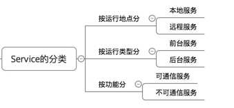 

2、特点

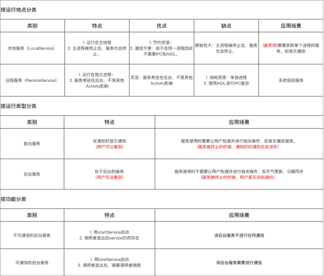 

　1、本地服务依附在主进程上而不是独立的进程，这样在一定程度上节约了资源，另外Local服务因为是在同一进程因此不需要IPC，也不需要AIDL。相应bindService会方便很多。主进程被Kill后，服务便会终止。

　2、远程服务为独立的进程，对应进程名格式为所在包名加上你指定的android:process字符串。由于是独立的进程，因此在Activity所在进程被Kill的时候，该服务依然在运行，不受其他进程影响，有利于为多个进程提供服务具有较高的灵活性。该服务是独立的进程，会占用一定资源，并且使用AIDL进行IPC稍微麻烦一点。

Service启动方式（主要是1,2两种）：

　　1、**startService 启动的服务**：主要用于启动一个服务执行后台任务，不进行通信。停止服务使用stopService；

　　2、**bindService 启动的服务**：该方法启动的服务可以进行通信。停止服务使用unbindService；

　　3、startService 同时也 bindService 启动的服务：停止服务应同时使用stepService与unbindService

# 三、本地Service的基本用法(Local Service)

## 1、 一般启动

1.1、启动服务

核心方法：startService(Intent intent); 例：在活动中，启动一个播放音频的服务

 

1.2、停止服务

停止服务分为两种：

1、 在活动中停止，核心方法：stopService(Intent intent);

例：当活动停止的时候，把服务停了

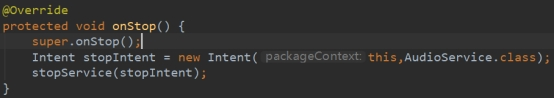 

2、 在服务内部停止，核心方法：soppSelf();

例：当任务执行完成后，就把服务停止。

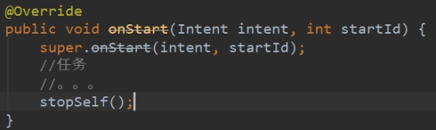 

具体使用什么方式、在什么地方停止，应结合实际情况而定。

## 2、绑定启动

1、 context.bindService(Intent intent,ServiceConnection connection,int flags);

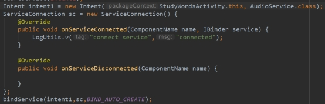 

绑定启动的时候，需要一个ServiceConnection对象作为参数，用于连接Activity和Service。

第三个参数，flags用于指定绑定的方式，参数由Context提供。

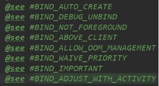 

onServiceConnected(ComponentName name,IBinder service)方法，会在onBind()之后回调。

service参数，来自于onBinder()的返回值。

2、context.unbindService(ServiceConnection connection);

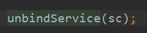 

3、其他

一个service可以跟多个activity进行绑定。

在绑定的情况下，如果Activity被销毁了，需要在销毁前把连接断开，即把ServiceConnection置空。

# 四、本地Service的生命周期

为了探究Service的生命周期，和Activity一样，也可以先定义一个基类(BaseService)用于观察。服务的生命周期图如下：

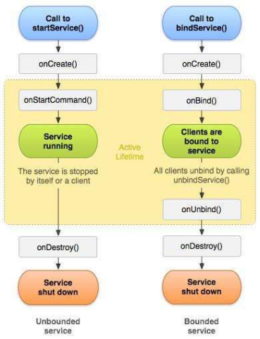 

## 1、一般启动的生命周期

startService(intent)

第一次调用：构造方法() -- onCreate() -- onStartCommand()

再调用：onStartCommand()

停止服务： onDestory()

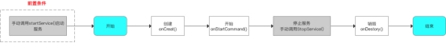 

**第一种方式**：**通过StartService启动Service（特点：不管启动多少次，只需要执行一次stopService即可关闭服务）**

通过startService启动后，service会一直无限期运行下去，只有外部调用了stopService()或stopSelf()方法时，该Service才会停止运行并销毁。

要创建一个这样的Service，你需要让该类继承Service类，然后重写以下方法：

- onCreate()
  1.如果service没被创建过，调用startService()后会执行onCreate()回调；
  2.如果service已处于运行中，调用startService()不会执行onCreate()方法。
  也就是说，onCreate()只会在第一次创建service时候调用，多次执行startService()不会重复调用onCreate()，此方法适合完成一些初始化工作。

- onStartCommand() ------》其中有四种int类型返回值的：
  　　START_STICKY： 当Service因内存不足而被系统kill后，一段时间后内存再次空闲时，系统将会尝试重新创建此Service，一旦创建成功后将回调onStartCommand方法，但其中的Intent将是null，除非有挂起的Intent，如pendingintent，这个状态下比较适用于不执行命令、但无限期运行并等待作业的媒体播放器或类似服务。
  　　START_NOT_STICKY：当Service因内存不足而被系统kill后，即使系统内存再次空闲时，系统也不会尝试重新创建此Service。除非程序中再次调用startService启动此Service，这是最安全的选项，可以避免在不必要时以及应用能够轻松重启所有未完成的作业时运行服务。
      START_REDELIVER_INTENT：当Service因内存不足而被系统kill后，则会重建服务，并通过传递给服务的最后一个 Intent 调用 onStartCommand()，任何挂起 Intent均依次传递。
      START_STICKY_COMPATIBILITY：START_STICKY的兼容版本，但不保证服务被kill后一定能重启。

  **如果多次执行了Context的startService()方法，那么Service的onStartCommand()方法也会相应的多次调用。**
  **onStartCommand()方法很重要，我们在该方法中根据传入的Intent参数进行实际的操作，比如会在此处创建一个线程用于下载数据或播放音乐等。**

- onBind()
  Service中的onBind()方法是抽象方法，Service类本身就是抽象类，所以onBind()方法是必须重写的，即使我们用不到。

- onDestory()
  在销毁的时候会执行Service该方法。

这几个方法都是Service的回调方法，且在主线程中执行。

用startService 方式启动Service的时候重写onStartCommand()的方法。每次用该方式启动Service的时候都会调用改方法。

## 2、绑定启动的生命周期

bindService(intent,serviceConnection)

调用：构造方法() -- onCreate() -- onBind() -- onServiceConnected()

unbindService(): (只有当前Activity与Service的一个连接时) -- onUnbind() -- onDestory()

如生命周期图所示，如果有多个Clients(Activity)与服务绑定，需要全部解绑后才会 onUnbind() -- onDestory()。

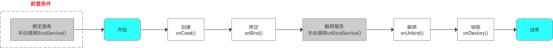 

**bindService启动服务特点：（和小程序一样，一次性的，进入页面的时候绑定service，退出的时候关闭service）**
1.bindService启动的服务和调用者之间是典型的client-server模式。调用者是client，service则是server端。service只有一个，但绑定到service上面的client可以有一个或很多个。这里所提到的client指的是组件，比如某个Activity。
2.client可以通过IBinder接口获取Service实例，从而实现在client端直接调用Service中的方法以实现灵活交互，这在通过startService方法启动中是无法实现的。
3.bindService启动服务的生命周期与其绑定的client息息相关。当client销毁时，client会自动与Service解除绑定。当然，client也可以明确调用Context的unbindService()方法与Service解除绑定。

**当没有任何client与Service绑定时，Service会自行销毁。**

#### bindService代码实例

#### ***1.创建一个FinnService继承Service（Server）***

```java
/**
 * Created by Finn on 2019-10-10.
 */
public class bindServiceA extends Service{
    //client 可以通过Binder获取Service实例
    public class MyBinder extends Binder {
        public bindService getService() {
            return bindServiceA .this;
        }
    }
 
    //通过binder实现调用者client与Service之间的通信 在onBind中返回该对象
    private MyBinder binder = new MyBinder();
 
    private final Random generator = new Random();
 
    @Override
    public void onCreate() {
        Log.i("Finn","bindServiceA - onCreate - Thread = " + Thread.currentThread().getName());
        super.onCreate();
    }
 
    @Override
    public int onStartCommand(Intent intent, int flags, int startId) {
        Log.i("Finn", "bindServiceA - onStartCommand - startId = " + startId + ", Thread = " + Thread.currentThread().getName());
        return START_NOT_STICKY;
    }
 
    @Nullable
    @Override
    public IBinder onBind(Intent intent) {
        Log.i("Finn", "bindServiceA - onBind - Thread = " + Thread.currentThread().getName());
        return binder;
    }
 
    @Override
    public boolean onUnbind(Intent intent) {
        Log.i("Finn", "bindService - onUnbind - from = " + intent.getStringExtra("from"));
        return false;
    }
 
    @Override
    public void onDestroy() {
        Log.i("Finn", "bindServiceA - onDestroy - Thread = " + Thread.currentThread().getName());
        super.onDestroy();
    }
 
    //getRandomNumber是Service暴露出去供client调用的公共方法
    public int getRandomNumber() {
        return generator.nextInt();
    }
```

2.创建ActivityA，可以通过bindService绑定服务（client）

```java
public class ActivityA extends Activity {
    private bindServiceA service = null;
    private boolean isBind = false;
 
    private ServiceConnection conn = new ServiceConnection() {
        @Override
        public void onServiceConnected(ComponentName name, IBinder binder) {
            isBind = true;
            bindService .MyBinder myBinder = (bindServiceA.MyBinder) binder;
            service = myBinder.getService();//通过ServiceConnection 中的IBinder获取 绑定的service对象
            Log.i("Finn", "ActivityA - onServiceConnected");
            int num = service.getRandomNumber();//通过service对象可对  bindServiceA中的函数进行操作
            Log.i("Kathy", "ActivityA - getRandomNumber = " + num);
        }
 
        @Override
        public void onServiceDisconnected(ComponentName name) {
            isBind = false;
            Log.i("Finn", "ActivityA - onServiceDisconnected");
        }
    };
 
    protected void onCreate(Bundle savedInstanceState) {
       super.onCreate(savedInstanceState);
       setContentView(R.layout.activity_a);
       Log.i("Finn", "ActivityA - onCreate - Thread = " + Thread.currentThread().getName());
 　　　 bindservice();
  　　　unbindservice();
    }

　　 private void bindservice(){
 　　　　　　 Intent intent = new Intent(this, bindServiceA.class);
            intent.putExtra("from", "ActivityA");      
            Log.i("Finn", "ActivityA 执行 bindServiceA");
            bindService(intent, conn, BIND_AUTO_CREATE);//通过该方法绑定服务（周期：onCreate（）------》onbind（））
　　 }
    private void unbindservice(){
    //单击了“unbindService”按钮
            if (isBind) {
                Log.i("Finn", "ActivityA 执行 unbindService");
                unbindService(conn);//通过该方法解除绑定服务  周期：----先执行  onunbind（）---》onDestroy（）

            }
 　　 }
 
    @Override
    protected void onDestroy() {
        super.onDestroy();
        Log.i("Finn", "ActivityA - onDestroy");
    }
}
```

bindServices创建如下：
要想让Service支持bindService调用方式，需要做以下事情：
1.在Service的onBind()方法中返回IBinder类型的实例。
2.onBInd()方法返回的IBinder的实例需要能够返回Service实例本身。通常，最简单的方法就是在service中创建binder的内部类，加入类似getService()的方法返回Service，这样绑定的client就可以通过getService()方法获得Service实例了。


## 3、同时使用两种方式

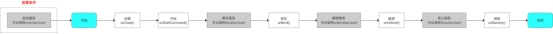 

# 五、远程Service(Remote Service)

>   见：【总结篇】AIDL基本使用.md
>


# 六、相关问题

## 1、定义

<font color='orange'>Q：Service存在的意义是什么</font>

执行耗时或后台任务。不需要与用户交互的。用来收集信息等。

<font color='orange'>Q：Service一般用来干什么，什么情况下用什么样的Service</font>

执行耗时或后台任务。

<font color='orange'>Q：Service种类及不同点</font>

本地服务，远程服务。

startService()：不需要交互的，执行后台任务。比如播放音乐，连接网络。

bindService()：需要向创建它的组件提供方法的时候用这个。

AIDL：远程服务，比如一些系统核心功能放到系统进程中，通过这种方式向三方应用提供功能。

> 注意：这个问题还需要深入。

<font color='orange'>Q：Service的类型和使用方式。</font>

startService()、bindService()，AIDL。

<font color='orange'>Q：Service的应用</font>

后台任务，播放音乐等。上文开篇介绍。

> 需要再深入了解应用场景。

## 2、使用

<font color='orange'>Q：Service生命周期</font>

见上文。

<font color='orange'>Q：startService和bindService的生命周期</font>

见上文。

<font color='orange'>Q：startService和bindService的区别</font>

见上文。

<font color='orange'>Q：startService和bindService分别适合应用在什么场景</font>

见上文。

<font color='orange'>Q：Service的两种启动方式？它们的适用情况是什么?</font>

见上文。

<font color='orange'>Q：Service可以执行耗时操作吗</font>

Service运行在主线程中。不能直接执行耗时操作，可以创建线程进行操作。

<font color='orange'>Q：当内存不足时Service被杀死了，如何重启这个Service</font>

START_STICKY

广播。

双进程。

<font color='orange'>Q：onStartCommand的返回值有什么作用</font>

见上文。

<font color='orange'>Q：怎么保证Service不被杀死／进程保活？</font>

（1）Service设置成START_STICKY（onStartCommand方法中），kill后会被重启（等待5秒左右），重传Intent，保持与重启前一样 

（2）通过startForeground将进程设置为前台进程，做前台服务，优先级和前台应用一个级别，除非在系统内存非常缺，否则此进程不会被kill。具体实现方式为在Service中创建一个notification，再调用voidAndroid.app.Service.startForeground(intid,Notificationnotification)方法运行在前台即可。 

（3）双进程Service：让2个进程互相保护，其中一个Service被清理后，另外没被清理的进程可以立即重启进程。 

（4）AlarmManager不断启动Service。该方式原理是通过定时警报来不断启动Service，这样就算Service被杀死，也能再启动。同时也可以监听网络切换、开锁屏等广播来启动Service。

<font color='orange'>Q：讲讲bindService的过程，你当初是怎么优化后台服务进程的？</font>


<font color='orange'>Q：  如何开机自动启动Service</font>

注册广播接收器，收到广播后创建Service。

<font color='orange'>Q：为什么应用退出后，startService启动的服务还在运行？运行在哪个进程？</font>


## 3、对比

<font color='orange'>Q：Service和Thread的区别？</font>

Thread 是程序执行的最小单元，它是分配CPU的基本单位。可以用 Thread 来执行一些异步的操作。

Service 是android的一种机制，当它运行的时候如果是Local Service，那么对应的 Service 是运行在主进程的 main 线程上的。如：onCreate，onStart 这些函数在被系统调用的时候都是在主进程的main 线程上运行的。如果是Remote Service，那么对应的 Service 则是运行在独立进程的 main 线程上。

Service的一大特点是后台运行，不需要交互。然后它可以重启。服务可以为其他组件提供方法。

Thread的一大特点是异步执行，可以用来执行耗时操作。线程的生命周期最多和进程一样。线程不能。

<font color='orange'>Q：Service和线程都可以用来执行后台任务，为什么选Service不选线程，明明线程用起来更简单</font>

Service具有重启的能力。并且一般也会在Service中使用线程。线程的主要功能是提供异步操作，降低对UI线程的阻塞。而Service的一大特点是后台执行任务，并且可以向其他组件提供方法调用。

<font color='orange'>Q：项目中后台网络请求为什么用Service不用线程</font>


<font color='orange'>Q：IntentService原理及作用是什么？</font>

IntentService的内部封装了一个handler和一个线程。适合用来做异步耗时任务。执行完成后会自动停止。

在onStart方法中创建message对象并sendMessage发送给handler，
在onHandleIntent方法来处理，是唯一需要实现的方法，最后调用stopSelf（）来结束服务。

1.IntenService是继承并处理异步请求的一个类
 2.内有一个工作线程来处理耗时操作
 3.IntenService内部则是通过消息的方式发送给HandlerThread的，然后由Handler中的Looper来处理消息

<font color='orange'>Q：IntentService能用bind方式启动吗？</font>

也可以，但这样就失去了它的意义了。不适合这么做。onBind返回null，除非又重写方法，这样的话为什么不直接使用Service呢？

<font color='orange'>Q：IntentService和Service的区别</font>

IntentService使用起来简单一些。适合做一些简单的任务。

## 4、原理

<font color='orange'>Q：问Service的启动过程？</font>

<font color='orange'>Q：ServiceManager进程是用来管理系统服务的</font>

<font color='orange'>Q：WindowMangerService中token到底是什么？有什么区别</font>

<font color='orange'>Q：各种SystemService怎么运行？</font>

> 原理还不懂。

# 总结

1、

## 【精益求精】我还能做（补充）些什么？

1、

