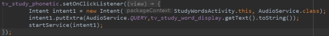

> version：2021/10/
>
> review：

可选：[原文地址](https://developer.android.google.cn/guide/fragments/create)

目录

[TOC]


# 一、Service是什么

Service是用于在后台执行任务的组件。

1、它适合用来做什么？

 执行不需要和用户交互的任务。

执行要求长期运行的任务。

2、可以完成什么工作

访问网络，播放音乐，文件IO操作，大数据量的数据库操作等耗时后台任务。

3、注：

1. 服务并不是独立运行在一个进程中，而是依赖于创建服务时所在的应用程序进程。
2. 服务不会自动开启线程，默认运行在主线程。所以在使用服务时，要特别注意不能阻塞主线程。一般都会为服务内部创建子线程去执行任务。


# 二、Service的分类

1、分类

 

2、特点

 

　1、本地服务依附在主进程上而不是独立的进程，这样在一定程度上节约了资源，另外Local服务因为是在同一进程因此不需要IPC，也不需要AIDL。相应bindService会方便很多。主进程被Kill后，服务便会终止。

　2、远程服务为独立的进程，对应进程名格式为所在包名加上你指定的android:process字符串。由于是独立的进程，因此在Activity所在进程被Kill的时候，该服务依然在运行，不受其他进程影响，有利于为多个进程提供服务具有较高的灵活性。该服务是独立的进程，会占用一定资源，并且使用AIDL进行IPC稍微麻烦一点。

Service启动方式（主要是1,2两种）：

　　1、**startService 启动的服务**：主要用于启动一个服务执行后台任务，不进行通信。停止服务使用stopService；

　　2、**bindService 启动的服务**：该方法启动的服务可以进行通信。停止服务使用unbindService；

　　3、startService 同时也 bindService 启动的服务：停止服务应同时使用stepService与unbindService

## 按运行分类　

### 前台服务

　　前台服务是指那些经常会被用户关注的服务，因此内存过低时它不会成为被杀的对象。 前台服务必须提供一个状态栏通知，并会置于“正在进行的”（“Ongoing”）组之下。这意味着只有在服务被终止或从前台移除之后，此通知才能被解除。
　　例如，用服务来播放音乐的播放器就应该运行在前台，因为用户会清楚地知晓它的运行情况。 状态栏通知可能会标明当前播放的歌曲，并允许用户启动一个activity来与播放器进行交互。

　　要把你的服务请求为前台运行，可以调用startForeground()方法。此方法有两个参数：唯一标识通知的整数值、状态栏通知Notification对象。例如：

```kotlin
Notification notification = new Notification(R.drawable.icon, getText(R.string.ticker_text),System.currentTimeMillis());

Intent notificationIntent = new Intent(this,ExampleActivity.class);

PendingIntent pendingIntent = PendingIntent.getActivity(this, 0, notificationIntent, 0);

notification.setLatestEventInfo(this, getText(R.string.notification_title),
        getText(R.string.notification_message), pendingIntent);
        
startForeground(ONGOING_NOTIFICATION, notification);
```

　　要从前台移除服务，请调用stopForeground()方法，这个方法接受个布尔参数，表示是否同时移除状态栏通知。此方法不会终止服务。不过，如果服务在前台运行时被你终止了，那么通知也会同时被移除。

### 后台服务

## 按使用分类　　

### 本地服务

　　用于应用程序内部，实现一些耗时任务，并不占用应用程序比如Activity所属线程，而是单开线程后台执行。
　　调用Context.startService()启动，调用Context.stopService()结束。在内部可以调用Service.stopSelf() 或 Service.stopSelfResult()来自己停止。

### 远程服务

　　用于Android系统内部的应用程序之间，可被其他应用程序复用，比如天气预报服务，其他应用程序不需要再写这样的服务，调用已有的即可。可以定义接口并把接口暴露出来，以便其他应用进行操作。客户端建立到服务对象的连接，并通过那个连接来调用服务。调用Context.bindService()方法建立连接，并启动，以调用 Context.unbindService()关闭连接。多个客户端可以绑定至同一个服务。如果服务此时还没有加载，bindService()会先加载它。

# 三、本地Service的基本用法(Local Service)

## 在manifest中声明服务

　　无论是什么类型的服务都必须在manifest中申明，格式如下：

```xml
<manifest ... >
  ...
  <application ... >
      <service android:name=".ExampleService" />
      ...
  </application>
</manifest>
```

Service 元素的属性有：

| 属性名称           | 属性作用                                                     |
| ------------------ | ------------------------------------------------------------ |
| android:name       | 服务类名，是唯一必需的属性。                                 |
| android:label      | 服务的名字，如果此项不设置，那么默认显示的服务名则为类名     |
| android:icon       | 服务的图标                                                   |
| android:permission | 申明此服务的权限，这意味着只有提供了该权限的应用才能控制或连接此服务 |
| android:process    | 表示该服务是否运行在另外一个进程，如果设置了此项，那么将会在包名后面加上这段字符串表示另一进程的名字 |
| android:enabled    | 如果此项设置为 true，那么 Service 将会默认被系统启动，不设置默认此项为 false |
| android:exported   | 表示该服务是否能够被其他应用程序所控制或连接，不设置默认此项为 false |

与activity一样，Service 可以定义intent过滤器，使得其它组件能用隐式intent来调用服务。如果想让服务只能内部使用（其它应用程序无法调用），那么就不必（也不应该）提供任何intent过滤器。此外，如果包含了android:exported属性并且设置为"false"， 就可以确保该服务是你应用程序的私有服务。即使服务提供了intent过滤器，本属性依然生效。　

## 1、 一般启动

1.1、启动服务

核心方法：startService(Intent intent); 例：在活动中，启动一个播放音频的服务

 

1.2、停止服务

停止服务分为两种：

1、 在活动中停止，核心方法：stopService(Intent intent);

例：当活动停止的时候，把服务停了

 

2、 在服务内部停止，核心方法：soppSelf();

例：当任务执行完成后，就把服务停止。

 

具体使用什么方式、在什么地方停止，应结合实际情况而定。

### startService 启动服务示例

从activity或其它应用程序组件中可以启动一个服务，调用startService()并传入一个Intent（指定所需启动的服务）即可。

```kotlin
	Intent intent = new Intent(this, MyService.class);
	startService(intent);
```

服务类：

```kotlin
public class MyService extends Service {

	  /**
     * onBind 是 Service 的虚方法，因此我们不得不实现它。
     * 返回 null，表示客服端不能建立到此服务的连接。
     */
	@Override
	public IBinder onBind(Intent intent) {
		// TODO Auto-generated method stub
		return null;
	}
    
	@Override
    public void onCreate() {
        super.onCreate();
    }
     
    @Override
 public int onStartCommand(Intent intent, int flags, int startId)  　　 {  
    //接受传递过来的intent的数据 
     return START_STICKY; 
    };
     
    @Override
    public void onDestroy() {
        super.onDestroy();
    }
	
}
```

一个started服务必须自行管理生命周期。也就是说，系统不会终止或销毁这类服务，除非必须恢复系统内存并且服务返回后一直维持运行。 因此，服务必须通过调用stopSelf()自行终止，或者其它组件可通过调用stopService()来终止它。

## 2、绑定启动

1、 context.bindService(Intent intent,ServiceConnection connection,int flags);

 

绑定启动的时候，需要一个ServiceConnection对象作为参数，用于连接Activity和Service。

第三个参数，flags用于指定绑定的方式，参数由Context提供。

 

onServiceConnected(ComponentName name,IBinder service)方法，会在onBind()之后回调。

service参数，来自于onBinder()的返回值。

2、context.unbindService(ServiceConnection connection);

 

3、其他

一个service可以跟多个activity进行绑定。

在绑定的情况下，如果Activity被销毁了，需要在销毁前把连接断开，即把ServiceConnection置空。

### bindService 启动服务示例　

当应用程序中的activity或其它组件需要与服务进行交互，或者应用程序的某些功能需要暴露给其它应用程序时，你应该创建一个bound服务，并通过进程间通信（IPC）来完成。方法如下：

```kotlin
 Intent intent=new Intent(this,BindService.class); 
 bindService(intent, ServiceConnection conn, int flags)  
```

> 注意bindService是Context中的方法，当没有Context时传入即可。

在进行服务绑定的时，其flags有：

| flags                       | 作用                                                         |
| --------------------------- | ------------------------------------------------------------ |
| Context.BIND_AUTO_CREATE    | 表示收到绑定请求的时候，如果服务尚未创建，则即刻创建，在系统内存不足需要先摧毁优先级组件来释放内存，且只有驻留该服务的进程成为被摧毁对象时，服务才被摧毁 |
| Context.BIND_DEBUG_UNBIND   | 通常用于调试场景中判断绑定的服务是否正确，但容易引起内存泄漏，因此非调试目的的时候不建议使用 |
| Context.BIND_NOT_FOREGROUND | 表示系统将阻止驻留该服务的进程具有前台优先级，仅在后台运行。 |

服务类：

```kotlin
public class BindService extends Service {

	 // 实例化MyBinder得到mybinder对象；
	private final MyBinder binder = new MyBinder();
	
	  /**
     * 返回Binder对象。
     */
	@Override
	public IBinder onBind(Intent intent) {
		// TODO Auto-generated method stub
		return binder;
	}
    
     /**
      * 新建内部类MyBinder，继承自Binder(Binder实现IBinder接口),
      * MyBinder提供方法返回BindService实例。
      */
　　public class MyBinder extends Binder{
        
        public BindService getService(){
            return BindService.this;
        }
    }
     

	@Override
	public boolean onUnbind(Intent intent) {
		// TODO Auto-generated method stub
		return super.onUnbind(intent);
	}
}
```

启动服务的activity代码：

```kotlin
public class MainActivity extends Activity {

	/** 是否绑定 */  
	boolean mIsBound = false; 
	BindService mBoundService;
	@Override
	protected void onCreate(Bundle savedInstanceState) {
		super.onCreate(savedInstanceState);
		setContentView(R.layout.activity_main);
		doBindService();
	}
	/**
	 * 实例化ServiceConnection接口的实现类,用于监听服务的状态
	 */
	private ServiceConnection conn = new ServiceConnection() {  
		  
	    @Override  
	    public void onServiceConnected(ComponentName name, IBinder service) {  
	        BindService mBoundService = ((BindService.MyBinder) service).getService();  
	        
	    }  
	  
	    @Override  
	    public void onServiceDisconnected(ComponentName name) {  
	        mBoundService = null;  
	     
	    }  
	}; 
	
	/** 绑定服务 */  
	public void doBindService() {  
	    bindService(new Intent(MainActivity.this, BindService.class), conn,Context.BIND_AUTO_CREATE);  
	    mIsBound = true;  
	}  
	
	/** 解除绑定服务 */  
	public void doUnbindService() {  
	    if (mIsBound) {  
	        // Detach our existing connection.  
	        unbindService(conn);  
	        mIsBound = false;  
	    }  
	} 
	
	@Override
	protected void onDestroy() {
		// TODO Auto-generated method stub
		super.onDestroy();
		
		doUnbindService();
	}
}
```

> 注意在AndroidMainfest.xml中对Service进行显式声明

## 3、其他

判断Service是否正在运行：

```kotlin
private boolean isServiceRunning() {
    ActivityManager manager = (ActivityManager) getSystemService(ACTIVITY_SERVICE);
    
 　{
        if ("com.example.demo.BindService".equals(service.service.getClassName())) 　　{
            return true;
        }
    }
    return false;
}
```


# 四、本地Service的生命周期

为了探究Service的生命周期，和Activity一样，也可以先定义一个基类(BaseService)用于观察。服务的生命周期图如下：

 

## 1、一般启动的生命周期

startService(intent)

第一次调用：构造方法() -- onCreate() -- onStartCommand()

再调用：onStartCommand()

停止服务： onDestory()

 

**第一种方式**：**通过StartService启动Service（特点：不管启动多少次，只需要执行一次stopService即可关闭服务）**

通过startService启动后，service会一直无限期运行下去，只有外部调用了stopService()或stopSelf()方法时，该Service才会停止运行并销毁。

要创建一个这样的Service，你需要让该类继承Service类，然后重写以下方法：

- onCreate()
  1.如果service没被创建过，调用startService()后会执行onCreate()回调；
  2.如果service已处于运行中，调用startService()不会执行onCreate()方法。
  也就是说，onCreate()只会在第一次创建service时候调用，多次执行startService()不会重复调用onCreate()，此方法适合完成一些初始化工作。

- onStartCommand() ------》其中有四种int类型返回值的：
  　　START_STICKY： 当Service因内存不足而被系统kill后，一段时间后内存再次空闲时，系统将会尝试重新创建此Service，一旦创建成功后将回调onStartCommand方法，但其中的Intent将是null，除非有挂起的Intent，如pendingintent，这个状态下比较适用于不执行命令、但无限期运行并等待作业的媒体播放器或类似服务。
    　　START_NOT_STICKY：当Service因内存不足而被系统kill后，即使系统内存再次空闲时，系统也不会尝试重新创建此Service。除非程序中再次调用startService启动此Service，这是最安全的选项，可以避免在不必要时以及应用能够轻松重启所有未完成的作业时运行服务。
      START_REDELIVER_INTENT：当Service因内存不足而被系统kill后，则会重建服务，并通过传递给服务的最后一个 Intent 调用 onStartCommand()，任何挂起 Intent均依次传递。
      START_STICKY_COMPATIBILITY：START_STICKY的兼容版本，但不保证服务被kill后一定能重启。

  **如果多次执行了Context的startService()方法，那么Service的onStartCommand()方法也会相应的多次调用。**
  **onStartCommand()方法很重要，我们在该方法中根据传入的Intent参数进行实际的操作，比如会在此处创建一个线程用于下载数据或播放音乐等。**

- onBind()
  Service中的onBind()方法是抽象方法，Service类本身就是抽象类，所以onBind()方法是必须重写的，即使我们用不到。

- onDestory()
  在销毁的时候会执行Service该方法。

这几个方法都是Service的回调方法，且在主线程中执行。

用startService 方式启动Service的时候重写onStartCommand()的方法。每次用该方式启动Service的时候都会调用改方法。

## 2、绑定启动的生命周期

bindService(intent,serviceConnection)

调用：构造方法() -- onCreate() -- onBind() -- onServiceConnected()

unbindService(): (只有当前Activity与Service的一个连接时) -- onUnbind() -- onDestory()

如生命周期图所示，如果有多个Clients(Activity)与服务绑定，需要全部解绑后才会 onUnbind() -- onDestory()。

 

**bindService启动服务特点：（和小程序一样，一次性的，进入页面的时候绑定service，退出的时候关闭service）**
1.bindService启动的服务和调用者之间是典型的client-server模式。调用者是client，service则是server端。service只有一个，但绑定到service上面的client可以有一个或很多个。这里所提到的client指的是组件，比如某个Activity。
2.client可以通过IBinder接口获取Service实例，从而实现在client端直接调用Service中的方法以实现灵活交互，这在通过startService方法启动中是无法实现的。
3.bindService启动服务的生命周期与其绑定的client息息相关。当client销毁时，client会自动与Service解除绑定。当然，client也可以明确调用Context的unbindService()方法与Service解除绑定。

**当没有任何client与Service绑定时，Service会自行销毁。**

#### bindService代码实例

#### ***1.创建一个FinnService继承Service（Server）***

```java
/**
 * Created by Finn on 2019-10-10.
 */
public class bindServiceA extends Service{
    //client 可以通过Binder获取Service实例
    public class MyBinder extends Binder {
        public bindService getService() {
            return bindServiceA .this;
        }
    }
 
    //通过binder实现调用者client与Service之间的通信 在onBind中返回该对象
    private MyBinder binder = new MyBinder();
 
    private final Random generator = new Random();
 
    @Override
    public void onCreate() {
        Log.i("Finn","bindServiceA - onCreate - Thread = " + Thread.currentThread().getName());
        super.onCreate();
    }
 
    @Override
    public int onStartCommand(Intent intent, int flags, int startId) {
        Log.i("Finn", "bindServiceA - onStartCommand - startId = " + startId + ", Thread = " + Thread.currentThread().getName());
        return START_NOT_STICKY;
    }
 
    @Nullable
    @Override
    public IBinder onBind(Intent intent) {
        Log.i("Finn", "bindServiceA - onBind - Thread = " + Thread.currentThread().getName());
        return binder;
    }
 
    @Override
    public boolean onUnbind(Intent intent) {
        Log.i("Finn", "bindService - onUnbind - from = " + intent.getStringExtra("from"));
        return false;
    }
 
    @Override
    public void onDestroy() {
        Log.i("Finn", "bindServiceA - onDestroy - Thread = " + Thread.currentThread().getName());
        super.onDestroy();
    }
 
    //getRandomNumber是Service暴露出去供client调用的公共方法
    public int getRandomNumber() {
        return generator.nextInt();
    }
```

2.创建ActivityA，可以通过bindService绑定服务（client）

```java
public class ActivityA extends Activity {
    private bindServiceA service = null;
    private boolean isBind = false;
 
    private ServiceConnection conn = new ServiceConnection() {
        @Override
        public void onServiceConnected(ComponentName name, IBinder binder) {
            isBind = true;
            bindService .MyBinder myBinder = (bindServiceA.MyBinder) binder;
            service = myBinder.getService();//通过ServiceConnection 中的IBinder获取 绑定的service对象
            Log.i("Finn", "ActivityA - onServiceConnected");
            int num = service.getRandomNumber();//通过service对象可对  bindServiceA中的函数进行操作
            Log.i("Kathy", "ActivityA - getRandomNumber = " + num);
        }
 
        @Override
        public void onServiceDisconnected(ComponentName name) {
            isBind = false;
            Log.i("Finn", "ActivityA - onServiceDisconnected");
        }
    };
 
    protected void onCreate(Bundle savedInstanceState) {
       super.onCreate(savedInstanceState);
       setContentView(R.layout.activity_a);
       Log.i("Finn", "ActivityA - onCreate - Thread = " + Thread.currentThread().getName());
 　　　 bindservice();
  　　　unbindservice();
    }

　　 private void bindservice(){
 　　　　　　 Intent intent = new Intent(this, bindServiceA.class);
            intent.putExtra("from", "ActivityA");      
            Log.i("Finn", "ActivityA 执行 bindServiceA");
            bindService(intent, conn, BIND_AUTO_CREATE);//通过该方法绑定服务（周期：onCreate（）------》onbind（））
　　 }
    private void unbindservice(){
    //单击了“unbindService”按钮
            if (isBind) {
                Log.i("Finn", "ActivityA 执行 unbindService");
                unbindService(conn);//通过该方法解除绑定服务  周期：----先执行  onunbind（）---》onDestroy（）

            }
 　　 }
 
    @Override
    protected void onDestroy() {
        super.onDestroy();
        Log.i("Finn", "ActivityA - onDestroy");
    }
}
```

bindServices创建如下：
要想让Service支持bindService调用方式，需要做以下事情：
1.在Service的onBind()方法中返回IBinder类型的实例。
2.onBInd()方法返回的IBinder的实例需要能够返回Service实例本身。通常，最简单的方法就是在service中创建binder的内部类，加入类似getService()的方法返回Service，这样绑定的client就可以通过getService()方法获得Service实例了。


## 3、同时使用两种方式

 


## Service生命周期

Service生命周期方法：

```java
public class ExampleService extends Service {
    int mStartMode;       // 标识服务被杀死后的处理方式
    IBinder mBinder;      // 用于客户端绑定的接口
    boolean mAllowRebind; // 标识是否使用onRebind

    @Override
    public void onCreate() {
        // 服务正被创建
    }
    @Override
    public int onStartCommand(Intent intent, int flags, int startId) {
        // 服务正在启动，由startService()调用引发
        return mStartMode;
    }
    @Override
    public IBinder onBind(Intent intent) {
        // 客户端用bindService()绑定服务
        return mBinder;
    }
    @Override
    public boolean onUnbind(Intent intent) {
        // 所有的客户端都用unbindService()解除了绑定
        return mAllowRebind;
    }
    @Override
    public void onRebind(Intent intent) {
        // 某客户端正用bindService()绑定到服务,
        // 而onUnbind()已经被调用过了
    }
    @Override
    public void onDestroy() {
        // 服务用不上了，将被销毁
    }
}
```

> 请注意onStartCommand()方法必须返回一个整数。这个整数是描述系统在杀死服务之后应该如何继续运行。onStartCommand()的返回值必须是以下常量之一：

>START_NOT_STICKY 　
>如果系统在onStartCommand()返回后杀死了服务，则不会重建服务了，除非还存在未发送的intent。 当服务不再是必需的，并且应用程序能够简单地重启那些未完成的工作时，这是避免服务运行的最安全的选项。　

>START_STICKY 
>如果系统在onStartCommand()返回后杀死了服务，则将重建服务并调用onStartCommand()，但不会再次送入上一个intent， 而是用null intent来调用onStartCommand() 。除非还有启动服务的intent未发送完，那么这些剩下的intent会继续发送。 这适用于媒体播放器（或类似服务），它们不执行命令，但需要一直运行并随时待命。　

>START_REDELIVER_INTENT 
>如果系统在onStartCommand()返回后杀死了服务，则将重建服务并用上一个已送过的intent调用onStartCommand()。任何未发送完的intent也都会依次送入。这适用于那些需要立即恢复工作的活跃服务，比如下载文件。

　　服务的生命周期与activity的非常类似。不过，更重要的是你需密切关注服务的创建和销毁环节，因为后台运行的服务是不会引起用户注意的。

　　服务的生命周期——从创建到销毁——可以有两种路径：

 - 一个started服务

　　这类服务由其它组件调用startService()来创建。然后保持运行，且必须通过调用stopSelf()自行终止。其它组件也可通过调用stopService() 终止这类服务。服务终止后，系统会把它销毁。

　　如果一个Service被startService 方法多次启动，那么onCreate方法只会调用一次，onStart将会被调用多次（对应调用startService的次数），并且系统只会创建Service的一个实例（因此你应该知道只需要一次stopService调用）。该Service将会一直在后台运行，而不管对应程序的Activity是否在运行，直到被调用stopService，或自身的stopSelf方法。当然如果系统资源不足，android系统也可能结束服务。

 - 　一个bound服务

　　服务由其它组件（客户端）调用bindService()来创建。然后客户端通过一个IBinder接口与服务进行通信。客户端可以通过调用unbindService()来关闭联接。多个客户端可以绑定到同一个服务上，当所有的客户端都解除绑定后，系统会销毁服务。（服务不需要自行终止。）

　　如果一个Service被某个Activity 调用 Context.bindService 方法绑定启动，不管调用 bindService 调用几次，onCreate方法都只会调用一次，同时onStart方法始终不会被调用。当连接建立之后，Service将会一直运行，除非调用Context.unbindService 断开连接或者之前调用bindService 的 Context 不存在了（如Activity被finish的时候），系统将会自动停止Service，对应onDestroy将被调用。

　　这两条路径并不是完全隔离的。也就是说，你可以绑定到一个已经用startService()启动的服务上。例如，一个后台音乐服务可以通过调用startService()来启动，传入一个指明所需播放音乐的 Intent。 之后，用户也许需要用播放器进行一些控制，或者需要查看当前歌曲的信息，这时一个activity可以通过调用bindService()与此服务绑定。在类似这种情况下，stopService()或stopSelf()不会真的终止服务，除非所有的客户端都解除了绑定。

> 　　　　当在旋转手机屏幕的时候，当手机屏幕在“横”“竖”变换时，此时如果你的 Activity 如果会自动旋转的话，旋转其实是 Activity 的重新创建，因此旋转之前的使用 bindService 建立的连接便会断开（Context 不存在了）。


# 五、远程Service(Remote Service)

>   见：【总结篇】AIDL基本使用.md
>


# 六、相关问题

## 1、定义

Q：什么是Service?

Service是一个应用程序组件，它能够在后台执行一些耗时较长的操作，并且不提供用户界面。服务能被其它应用程序的组件启动，即使用户切换到另外的应用时还能保持后台运行。此外，应用程序组件还能与服务绑定，并与服务进行交互，甚至能进行进程间通信（IPC）。 比如，服务可以处理网络传输、音乐播放、执行文件I/O、或者与content provider进行交互，所有这些都是后台进行的。说说Service的生命周期。

<font color='orange'>Q：Service存在的意义是什么</font>

执行耗时或后台任务。不需要与用户交互的。用来收集信息等。

<font color='orange'>Q：Service一般用来干什么，什么情况下用什么样的Service</font>

执行耗时或后台任务。

<font color='orange'>Q：Service种类及不同点</font>

本地服务，远程服务。

startService()：不需要交互的，执行后台任务。比如播放音乐，连接网络。

bindService()：需要向创建它的组件提供方法的时候用这个。

AIDL：远程服务，比如一些系统核心功能放到系统进程中，通过这种方式向三方应用提供功能。

> 注意：这个问题还需要深入。

<font color='orange'>Q：Service的类型和使用方式。</font>

startService()、bindService()，AIDL。

<font color='orange'>Q：Service的应用</font>

后台任务，播放音乐等。上文开篇介绍。

> 需要再深入了解应用场景。

## 2、使用

<font color='orange'>Q：Service生命周期</font>

见上文。

<font color='orange'>Q：startService和bindService的生命周期</font>

见上文。

<font color='orange'>Q：startService和bindService的区别</font>

见上文。

<font color='orange'>Q：startService和bindService分别适合应用在什么场景</font>

见上文。

<font color='orange'>Q：Service的两种启动方式？它们的适用情况是什么?</font>

见上文。

<font color='orange'>Q：Service可以执行耗时操作吗</font>

Service运行在主线程中。不能直接执行耗时操作，可以创建线程进行操作。

<font color='orange'>Q：当内存不足时Service被杀死了，如何重启这个Service</font>

START_STICKY

广播。

双进程。

<font color='orange'>Q：onStartCommand的返回值有什么作用</font>

见上文。

<font color='orange'>Q：怎么保证Service不被杀死／进程保活？</font>

（1）Service设置成START_STICKY（onStartCommand方法中），kill后会被重启（等待5秒左右），重传Intent，保持与重启前一样 

（2）通过startForeground将进程设置为前台进程，做前台服务，优先级和前台应用一个级别，除非在系统内存非常缺，否则此进程不会被kill。具体实现方式为在Service中创建一个notification，再调用voidAndroid.app.Service.startForeground(intid,Notificationnotification)方法运行在前台即可。 

（3）双进程Service：让2个进程互相保护，其中一个Service被清理后，另外没被清理的进程可以立即重启进程。 

（4）AlarmManager不断启动Service。该方式原理是通过定时警报来不断启动Service，这样就算Service被杀死，也能再启动。同时也可以监听网络切换、开锁屏等广播来启动Service。

<font color='orange'>Q：讲讲bindService的过程，你当初是怎么优化后台服务进程的？</font>


<font color='orange'>Q：  如何开机自动启动Service</font>

注册广播接收器，收到广播后创建Service。

<font color='orange'>Q：为什么应用退出后，startService启动的服务还在运行？运行在哪个进程？</font>


## 3、对比

<font color='orange'>Q：Service和Thread的区别？</font>

Thread 是程序执行的最小单元，它是分配CPU的基本单位。可以用 Thread 来执行一些异步的操作。

Service 是android的一种机制，当它运行的时候如果是Local Service，那么对应的 Service 是运行在主进程的 main 线程上的。如：onCreate，onStart 这些函数在被系统调用的时候都是在主进程的main 线程上运行的。如果是Remote Service，那么对应的 Service 则是运行在独立进程的 main 线程上。

Service的一大特点是后台运行，不需要交互。然后它可以重启。服务可以为其他组件提供方法。

Thread的一大特点是异步执行，可以用来执行耗时操作。线程的生命周期最多和进程一样。线程不能。

服务仅仅是一个组件，即使用户不再与你的应用程序发生交互，它仍然能在后台运行。因此，应该只在需要时才创建一个服务。

如果你需要在主线程之外执行一些工作，但仅当用户与你的应用程序交互时才会用到，那你应该创建一个新的线程而不是创建服务。 比如，如果你需要播放一些音乐，但只是当你的activity在运行时才需要播放，你可以在onCreate()中创建一个线程，在onStart()中开始运行，然后在onStop()中终止运行。还可以考虑使用AsyncTask或HandlerThread来取代传统的Thread类。

　　**由于无法在不同的 Activity 中对同一 Thread 进行控制**，这个时候就要考虑用服务实现。如果你使用了服务，它默认就运行于应用程序的主线程中。因此，如果服务执行密集计算或者阻塞操作，你仍然应该在服务中创建一个新的线程来完成（避免ANR）。

<font color='orange'>Q：Service和线程都可以用来执行后台任务，为什么选Service不选线程，明明线程用起来更简单</font>

Service具有重启的能力。并且一般也会在Service中使用线程。线程的主要功能是提供异步操作，降低对UI线程的阻塞。而Service的一大特点是后台执行任务，并且可以向其他组件提供方法调用。

<font color='orange'>Q：项目中后台网络请求为什么用Service不用线程</font>


<font color='orange'>Q：IntentService原理及作用是什么？</font>

IntentService的内部封装了一个handler和一个线程。适合用来做异步耗时任务。执行完成后会自动停止。

在onStart方法中创建message对象并sendMessage发送给handler，
在onHandleIntent方法来处理，是唯一需要实现的方法，最后调用stopSelf（）来结束服务。

1.IntenService是继承并处理异步请求的一个类
 2.内有一个工作线程来处理耗时操作
 3.IntenService内部则是通过消息的方式发送给HandlerThread的，然后由Handler中的Looper来处理消息

<font color='orange'>Q：IntentService能用bind方式启动吗？</font>

也可以，但这样就失去了它的意义了。不适合这么做。onBind返回null，除非又重写方法，这样的话为什么不直接使用Service呢？

<font color='orange'>Q：IntentService和Service的区别</font>

IntentService使用起来简单一些。适合做一些简单的任务。

## 4、原理

<font color='orange'>Q：问Service的启动过程？</font>

<font color='orange'>Q：ServiceManager进程是用来管理系统服务的</font>

<font color='orange'>Q：WindowMangerService中token到底是什么？有什么区别</font>

<font color='orange'>Q：各种SystemService怎么运行？</font>

> 原理还不懂。

## 5、其他

<font color='orange'>Q：Android 5.0以上的隐式启动问题及其解决方案。</font>

[点击查看答案](https://www.cnblogs.com/momoshengxiao/p/6442380.html)

Q：Service保活方案。

[点击查看答案](*https://www.cnblogs.com/blosaa/p/9530625.html*)

Q：IntentService是什么 & 原理 & 使用场景。

[点击查看答案](https://blog.csdn.net/ClAndEllen/article/details/79346624)

Q：创建一个独立进程的Service应该怎样做？

[点击查看答案](https://www.jianshu.com/p/4a83becd758e)

Q：Service和Activity之间如何通信？

[点击查看答案](*http://www.cnblogs.com/codingblock/p/4850299.html*)

Q：说说你了解的系统Service。

[点击查看答案](https://blog.csdn.net/geyunfei_/article/details/78851024)

Q：谈谈你对ActivityManagerService的理解。

[点击查看答案](https://www.cnblogs.com/xingchenkn/p/3637137.html)

Q：在Activtiy中创建一个Thread和在一个Service中创建一个Thread的区别？

这题实际是在考察前台和后台线程,Activity和Service的区别。毫无疑问Activtiy中的线程是前台线程，它的生命周期往往是随着Activity的,Activity销毁的时候，那个线程也应该被销毁，否则就会出现内存泄漏现象。而Service中开启的线程，它是工作在后台的，一般来讲，后台线程的生存期是比较长的。


# Carson带你学Android：Service生命周期 完全解析

# 前言

- `Service`作为 `Android`四大组件之一，应用非常广泛
- 本文将介绍 `Service`最基础的知识：生命周期

> 若 对`Service`还未了解，建议先阅读文章：[Android 四大组件：一份全面 & 简洁的 Service 知识讲解攻略](https://www.jianshu.com/p/d963c55c3ab9)

------

# 目录


目录

------

# 1. 生命周期 常用方法

- 官方说明图


示意图

在`Service`的生命周期里，常用的有：

- 4个手动调用的方法

| 手动调用方法    |   作用   |
| --------------- | :------: |
| startService()  | 启动服务 |
| stopService()   | 关闭服务 |
| bindService()   | 绑定服务 |
| unbindService() | 解绑服务 |

- 5个自动调用的方法

| 内部自动调用的方法 |   作用   |
| ------------------ | :------: |
| onCreat()          | 创建服务 |
| onStartCommand()   | 开始服务 |
| onDestroy()        | 销毁服务 |
| onBind()           | 绑定服务 |
| onUnbind()         | 解绑服务 |

------

# 2. 生命周期方法具体介绍

主要介绍内部调用方法 & 外部调用方法的关系。


示意图

------

# 3. 常见的生命周期使用


示意图

------

# 4. 总结

- 本文 全面解析了`Service`的生命周期


# 前言

- Service作为Android四大组件之一，应用非常广泛
- 本文将介绍Service最基础的知识：Service的生命周期

> 如果你对Service还未了解，建议先阅读我写的文章：
>  [Android四大组件：Service史上最全面解析](https://www.jianshu.com/p/d963c55c3ab9)

------

# 目录


目录

------

# 1. Service分类

### 1.1 Service的类型


分类

### 1.2  特点


Service类型的详细介绍

------

# 2.具体使用解析

### 2.1 本地Service

这是最普通、最常用的后台服务Service。

### 2.1.1 使用步骤

- 步骤1：新建子类继承Service类

> 需重写父类的onCreate()、onStartCommand()、onDestroy()和onBind()方法

- 步骤2：构建用于启动Service的Intent对象
- 步骤3：调用startService()启动Service、调用stopService()停止服务
- 步骤4：在AndroidManifest.xml里注册Service

### 2.1.2 实例Demo

接下来我将用一个实例Demo进行本地Service说明

> 建议先下载Demo再进行阅读：[（carson.ho的Github地址）Demo_for_Service](https://links.jianshu.com/go?to=https%3A%2F%2Fgithub.com%2FCarson-Ho%2FDemo_Service%2Ftree%2F5e2a70cf2d75c56bbfa1abc0ead16c5ad8cae83f)

- 步骤1：新建子类继承Service类

> 需重写父类的onCreate()、onStartCommand()、onDestroy()和onBind()

*MyService.java*


```java
public class MyService extends Service {


//启动Service之后，就可以在onCreate()或onStartCommand()方法里去执行一些具体的逻辑
//由于这里作Demo用，所以只打印一些语句
    @Override
    public void onCreate() {
        super.onCreate();
        System.out.println("执行了onCreat()");
    }

    @Override
    public int onStartCommand(Intent intent, int flags, int startId) {
        System.out.println("执行了onStartCommand()");
        return super.onStartCommand(intent, flags, startId);


    }

    @Override
    public void onDestroy() {
        super.onDestroy();
        System.out.println("执行了onDestory()");
    }

    @Nullable
    @Override
    public IBinder onBind(Intent intent) {
        return null;
    }
}
```

- 步骤2：在主布局文件设置两个Button分别用于启动和停止Service
   *activity_main.xml*


```xml
<?xml version="1.0" encoding="utf-8"?>
<RelativeLayout xmlns:android="http://schemas.android.com/apk/res/android"
    xmlns:tools="http://schemas.android.com/tools"
    android:layout_width="match_parent"
    android:layout_height="match_parent"
    android:paddingBottom="@dimen/activity_vertical_margin"
    android:paddingLeft="@dimen/activity_horizontal_margin"
    android:paddingRight="@dimen/activity_horizontal_margin"
    android:paddingTop="@dimen/activity_vertical_margin"
    tools:context="scut.carson_ho.demo_service.MainActivity">

    <Button
        android:layout_centerInParent="true"
        android:id="@+id/startService"
        android:layout_width="wrap_content"
        android:layout_height="wrap_content"
        android:text="启动服务" />

    <Button
        android:layout_centerInParent="true"
        android:layout_below="@+id/startService"
        android:id="@+id/stopService"
        android:layout_width="wrap_content"
        android:layout_height="wrap_content"
        android:text="停止服务" />
</RelativeLayout>
```

- 步骤3：构建Intent对象，并调用startService()启动Service、stopService停止服务

*MainActivity.java*


```java
public class MainActivity extends AppCompatActivity implements View.OnClickListener {

    private Button startService;
    private Button stopService;

    @Override
    protected void onCreate(Bundle savedInstanceState) {
        super.onCreate(savedInstanceState);
        setContentView(R.layout.activity_main);

        startService = (Button) findViewById(R.id.startService);
        stopService = (Button) findViewById(R.id.stopService);

        startService.setOnClickListener(this);
        startService.setOnClickListener(this);
    }

    @Override
    public void onClick(View v) {
        switch (v.getId()) {

            //点击启动Service Button
            case R.id.startService:
                //构建启动服务的Intent对象
                Intent startIntent = new Intent(this, MyService.class);
                //调用startService()方法-传入Intent对象,以此启动服务
                startService(startIntent);
                
            //点击停止Service Button
            case R.id.stopService:
                //构建停止服务的Intent对象
                Intent stopIntent = new Intent(this, MyService.class);
                //调用stopService()方法-传入Intent对象,以此停止服务
                stopService(stopIntent);
                
        }
    }
}
```

- 步骤4：在AndroidManifest.xml里注册Service
   *AndroidManifest.xml*


```xml
<?xml version="1.0" encoding="utf-8"?>
<manifest xmlns:android="http://schemas.android.com/apk/res/android"
    package="scut.carson_ho.demo_service">

    <application
        android:allowBackup="true"
        android:icon="@mipmap/ic_launcher"
        android:label="@string/app_name"
        android:supportsRtl="true"
        android:theme="@style/AppTheme">
        <activity android:name=".MainActivity">

            <intent-filter>
                <action android:name="android.intent.action.MAIN" />
                <category android:name="android.intent.category.LAUNCHER" />
            </intent-filter>

        </activity>

        //注册Service服务
        <service android:name=".MyService">
        </service>

    </application>

</manifest>
```

**Androidmanifest里Service的常见属性说明**

| 属性               |                    说明                     |                                                  备注 |
| ------------------ | :-----------------------------------------: | ----------------------------------------------------: |
| android:name       |                Service的类名                |                                                       |
| android:label      |                Service的名字                |                           若不设置，默认为Service类名 |
| android:icon       |                Service的图标                |                                                       |
| android:permission |             申明此Service的权限             |              有提供了该权限的应用才能控制或连接此服务 |
| android:process    | 表示该服务是否在另一个进程中运行（远程服务) |          不设置默认为本地服务；remote则设置成远程服务 |
| android:enabled    |                系统默认启动                 | true：Service 将会默认被系统启动；不设置则默认为false |
| android:exported   |  该服务是否能够被其他应用程序所控制或连接   |                                不设置默认此项为 false |

# 2.1.3 测试结果


测试结果.png

# 2.1.4 Demo地址

Carson.ho的Github地址：[Demo_for_Service](https://links.jianshu.com/go?to=https%3A%2F%2Fgithub.com%2FCarson-Ho%2FDemo_Service%2Ftree%2F5e2a70cf2d75c56bbfa1abc0ead16c5ad8cae83f)

# 2.2 可通信的服务Service

- 上面介绍的Service是最基础的，但只能单机使用，即无法与Activity通信
- 接下来将在上面的基础用法上，增设“与Activity通信”的功能，即使用绑定Service服务（Binder类、bindService()、onBind(）、unbindService()、onUnbind()）

### 2.2.1 实例Demo

接下来我将用一个实例Demo进行可通信的服务Service说明

> 建议先下载Demo再进行阅读：[（carson.ho的Github地址）Demo_for_Service](https://links.jianshu.com/go?to=https%3A%2F%2Fgithub.com%2FCarson-Ho%2FDemo_Service%2Ftree%2F719e3b9ffd5017c334cdfdaf45b6a72776a2066a)

- 步骤1：在新建子类继承Service类，并新建一个子类继承自Binder类、写入与Activity关联需要的方法、创建实例


```java
public class MyService extends Service {

    private MyBinder mBinder = new MyBinder();

    @Override
    public void onCreate() {
        super.onCreate();
        System.out.println("执行了onCreat()");
    }

    @Override
    public int onStartCommand(Intent intent, int flags, int startId) {
        System.out.println("执行了onStartCommand()");
        return super.onStartCommand(intent, flags, startId);


    }

    @Override
    public void onDestroy() {
        super.onDestroy();
        System.out.println("执行了onDestory()");
    }

    @Nullable
    @Override
    public IBinder onBind(Intent intent) {
        System.out.println("执行了onBind()");
        //返回实例
        return mBinder;
    }


    @Override
    public boolean onUnbind(Intent intent) {
        System.out.println("执行了onUnbind()");
        return super.onUnbind(intent);
    }

    //新建一个子类继承自Binder类
    class MyBinder extends Binder {

        public void service_connect_Activity() {
            System.out.println("Service关联了Activity,并在Activity执行了Service的方法");

        }
    }
}
```

- 步骤2：在主布局文件再设置两个Button分别用于绑定和解绑Service


```xml
<?xml version="1.0" encoding="utf-8"?>
<RelativeLayout xmlns:android="http://schemas.android.com/apk/res/android"
    xmlns:tools="http://schemas.android.com/tools"
    android:layout_width="match_parent"
    android:layout_height="match_parent"
    android:paddingBottom="@dimen/activity_vertical_margin"
    android:paddingLeft="@dimen/activity_horizontal_margin"
    android:paddingRight="@dimen/activity_horizontal_margin"
    android:paddingTop="@dimen/activity_vertical_margin"
    tools:context="scut.carson_ho.demo_service.MainActivity">

    <Button
        android:layout_centerInParent="true"
        android:id="@+id/startService"
        android:layout_width="wrap_content"
        android:layout_height="wrap_content"
        android:text="启动服务" />

    <Button
        android:layout_centerInParent="true"
        android:layout_below="@+id/startService"
        android:id="@+id/stopService"
        android:layout_width="wrap_content"
        android:layout_height="wrap_content"
        android:text="停止服务" />

    <Button
        android:layout_centerInParent="true"
        android:layout_below="@id/stopService"
        android:id="@+id/bindService"
        android:layout_width="wrap_content"
        android:layout_height="wrap_content"
        android:text="绑定服务" />

    <Button
        android:layout_centerInParent="true"
        android:layout_below="@id/bindService"
        android:id="@+id/unbindService"
        android:layout_width="wrap_content"
        android:layout_height="wrap_content"
        android:text="解绑服务"
        />
</RelativeLayout>
```

- 步骤3：在Activity通过调用MyBinder类中的public方法来实现Activity与Service的联系

> 即实现了Activity指挥Service干什么Service就去干什么的功能

*MainActivity.java*


```java
public class MainActivity extends AppCompatActivity implements View.OnClickListener {

    private Button startService;
    private Button stopService;
    private Button bindService;
    private Button unbindService;

    private MyService.MyBinder myBinder;


    //创建ServiceConnection的匿名类
    private ServiceConnection connection = new ServiceConnection() {

        //重写onServiceConnected()方法和onServiceDisconnected()方法
        //在Activity与Service建立关联和解除关联的时候调用
        @Override
        public void onServiceDisconnected(ComponentName name) {
        }

        //在Activity与Service解除关联的时候调用
        @Override
        public void onServiceConnected(ComponentName name, IBinder service) {
            //实例化Service的内部类myBinder
            //通过向下转型得到了MyBinder的实例
            myBinder = (MyService.MyBinder) service;
            //在Activity调用Service类的方法
            myBinder.service_connect_Activity();
        }
    };

    @Override
    protected void onCreate(Bundle savedInstanceState) {
        super.onCreate(savedInstanceState);
        setContentView(R.layout.activity_main);


        startService = (Button) findViewById(R.id.startService);
        stopService = (Button) findViewById(R.id.stopService);

        startService.setOnClickListener(this);
        stopService.setOnClickListener(this);

        bindService = (Button) findViewById(R.id.bindService);
        unbindService = (Button) findViewById(R.id.unbindService);

        bindService.setOnClickListener(this);
        unbindService.setOnClickListener(this);

    }

    @Override
    public void onClick(View v) {
        switch (v.getId()) {

            //点击启动Service
            case R.id.startService:
                //构建启动服务的Intent对象
                Intent startIntent = new Intent(this, MyService.class);
                //调用startService()方法-传入Intent对象,以此启动服务
                startService(startIntent);
                break;

            //点击停止Service
            case R.id.stopService:
                //构建停止服务的Intent对象
                Intent stopIntent = new Intent(this, MyService.class);
                //调用stopService()方法-传入Intent对象,以此停止服务
                stopService(stopIntent);
                break;

            //点击绑定Service
            case R.id.bindService:
                //构建绑定服务的Intent对象
                Intent bindIntent = new Intent(this, MyService.class);
                //调用bindService()方法,以此停止服务

                bindService(bindIntent,connection,BIND_AUTO_CREATE);
                //参数说明
                //第一个参数:Intent对象
                //第二个参数:上面创建的Serviceconnection实例
                //第三个参数:标志位
                //这里传入BIND_AUTO_CREATE表示在Activity和Service建立关联后自动创建Service
                //这会使得MyService中的onCreate()方法得到执行，但onStartCommand()方法不会执行
                break;

            //点击解绑Service
            case R.id.unbindService:
                //调用unbindService()解绑服务
                //参数是上面创建的Serviceconnection实例
                unbindService(connection);
                break;

                default:
                    break;

        }
    }
}
```

### 2.2.2 测试结果


测试结果11.png

### 2.2.3 Demo

carson.ho的Github地址：[Demo_for_Service](https://links.jianshu.com/go?to=https%3A%2F%2Fgithub.com%2FCarson-Ho%2FDemo_Service%2Ftree%2F719e3b9ffd5017c334cdfdaf45b6a72776a2066a)

# 2.3 前台Service

前台Service和后台Service（普通）最大的区别就在于：

- 前台Service在下拉通知栏有显示通知（如下图），但后台Service没有；


TT9$TN8IK1SAPDT%~0IRLS2.png

- 前台Service优先级较高，不会由于系统内存不足而被回收；后台Service优先级较低，当系统出现内存不足情况时，很有可能会被回收

# 2.3.1 具体使用

用法很简单，只需要在原有的Service类对onCreate()方法进行稍微修改即可，如下图：


```java
@Override
    public void onCreate() {
        super.onCreate();
        System.out.println("执行了onCreat()");

        //添加下列代码将后台Service变成前台Service
        //构建"点击通知后打开MainActivity"的Intent对象
        Intent notificationIntent = new Intent(this,MainActivity.class);
        PendingIntent pendingIntent = PendingIntent.getActivity(this,0,notificationIntent,0);

        //新建Builer对象
        Notification.Builder builer = new Notification.Builder(this);
        builer.setContentTitle("前台服务通知的标题");//设置通知的标题
        builer.setContentText("前台服务通知的内容");//设置通知的内容
        builer.setSmallIcon(R.mipmap.ic_launcher);//设置通知的图标
        builer.setContentIntent(pendingIntent);//设置点击通知后的操作

        Notification notification = builer.getNotification();//将Builder对象转变成普通的notification
        startForeground(1, notification);//让Service变成前台Service,并在系统的状态栏显示出来

    }
```

# 2.3.2 测试结果

运行后，当点击Start Service或Bind Service按钮，Service就会以前台Service的模式启动（通知栏上有通知），如下图


点击启动服务

# 2.4 远程Service

具体请看我写的另外一篇文章：[Android：远程服务Service（含AIDL & IPC讲解）](https://www.jianshu.com/p/34326751b2c6)

# 3. 使用场景

- 通过上述描述，你应该对Service类型及其使用非常了解；

- 那么，我们该什么时候用哪种类型的Service呢？

- 各种Service的使用场景请看下图：

  

  使用场景

# 4. 总结

- 本文对Service的使用进行了全面解析（本地、可通信、前台和远程Service）


# 前言

- Service作为Android四大组件之一，应用非常广泛
- 本文将介绍Service其中一种常见用法：远程Service

> 如果你对Service还未了解，建议先阅读我写的另外一篇文章：
>  [Android四大组件：Service史上最全面解析](https://www.jianshu.com/p/d963c55c3ab9)

------

# 目录


目录

------

# 1. 远程服务与本地服务的区别

- 远程服务与本地服务最大的区别是：远程Service与调用者不在同一个进程里（即远程Service是运行在另外一个进程）；而本地服务则是与调用者运行在同一个进程里
- 二者区别的详细区别如下图：


按运行地点分类

------

# 2. 使用场景

多个应用程序共享同一个后台服务（远程服务）

> 即一个远程Service与多个应用程序的组件（四大组件）进行跨进程通信


使用场景

------

# 3. 具体使用

- 为了让远程Service与多个应用程序的组件（四大组件）进行跨进程通信（IPC），需要使用AIDL

> 1. IPC：Inter-Process Communication，即跨进程通信
> 2. AIDL：Android Interface Definition Language，即Android接口定义语言；用于让某个Service与多个应用程序组件之间进行跨进程通信，从而可以实现多个应用程序共享同一个Service的功能。

- 在多进程通信中，存在两个进程角色（以最简单的为例）：服务器端和客户端

- 以下是两个进程角色的具体使用步骤：
   **服务器端（Service）**
   步骤1：新建定义AIDL文件，并声明该服务需要向客户端提供的接口
   步骤2：在Service子类中实现AIDL中定义的接口方法，并定义生命周期的方法（onCreat、onBind()、blabla）
   步骤3：在AndroidMainfest.xml中注册服务 & 声明为远程服务

  **客户端（Client）**
   步骤1：拷贝服务端的AIDL文件到目录下
   步骤2：使用Stub.asInterface接口获取服务器的Binder，根据需要调用服务提供的接口方法
   步骤3：通过Intent指定服务端的服务名称和所在包，绑定远程Service

接下来，我将用一个具体实例来介绍远程Service的使用

------

# 4. 具体实例

- 实例描述：客户端远程调用服务器端的远程Service
- 具体使用：

### 4.1 服务器端（Service）

新建一个服务器端的工程：Service - server

> 先下Demo再看，效果会更好：[Github_RemoteService_Server](https://links.jianshu.com/go?to=https%3A%2F%2Fgithub.com%2FCarson-Ho%2FService_Server)

步骤1. 新建一个AIDL文件


新建AIDL文件

步骤2. 在新建AIDL文件里定义Service需要与Activity进行通信的内容（方法），并进行编译（Make Project）


```java
// 在新建的AIDL_Service1.aidl里声明需要与Activity进行通信的方法
package scut.carson_ho.demo_service;

interface AIDL_Service1 {
    void AIDL_Service();
}
//AIDL中支持以下的数据类型
//1. 基本数据类型
//2. String 和CharSequence
//3. List 和 Map ,List和Map 对象的元素必须是AIDL支持的数据类型;
//4. AIDL自动生成的接口（需要导入-import）
//5. 实现android.os.Parcelable 接口的类（需要导入-import)
```


编译

步骤3：在Service子类中实现AIDL中定义的接口方法，并定义生命周期的方法（onCreat、onBind()、blabla）
 *MyService.java*


```java
public class MyService extends Service {
    
    // 实例化AIDL的Stub类(Binder的子类)
    AIDL_Service1.Stub mBinder = new AIDL_Service1.Stub() {

        //重写接口里定义的方法
        @Override
        public void AIDL_Service() throws RemoteException {
            System.out.println("客户端通过AIDL与远程后台成功通信");
        }
    };

//重写与Service生命周期的相关方法
    @Override
    public void onCreate() {
        super.onCreate();

        System.out.println("执行了onCreat()");

    }

    @Override
    public int onStartCommand(Intent intent, int flags, int startId) {
        System.out.println("执行了onStartCommand()");
        return super.onStartCommand(intent, flags, startId);
    }

    @Override
    public void onDestroy() {
        super.onDestroy();
        System.out.println("执行了onDestory()");
    }

    @Nullable
    @Override
    public IBinder onBind(Intent intent) {

        System.out.println("执行了onBind()");
    //在onBind()返回继承自Binder的Stub类型的Binder，非常重要
        return mBinder;
    }

    @Override
    public boolean onUnbind(Intent intent) {
        System.out.println("执行了onUnbind()");
        return super.onUnbind(intent);
    }

}
```

步骤4：在AndroidMainfest.xml中注册服务 & 声明为远程服务


```jsx
<service
            android:name=".MyService"
            android:process=":remote"  //将本地服务设置成远程服务
            android:exported="true"      //设置可被其他进程调用
            >
            //该Service可以响应带有scut.carson_ho.service_server.AIDL_Service1这个action的Intent。
            //此处Intent的action必须写成“服务器端包名.aidl文件名”
            <intent-filter>
                <action android:name="scut.carson_ho.service_server.AIDL_Service1"/>
            </intent-filter>

        </service>
```

至此，服务器端（远程Service）已经完成了。

## 4.2 客户端（Client）

新建一个客户端的工程：Service - Client

> 先下Demo再看，效果会更好：[Github_RemoteService_Client](https://links.jianshu.com/go?to=https%3A%2F%2Fgithub.com%2FCarson-Ho%2FService_Client)

步骤1：将服务端的AIDL文件所在的包复制到客户端目录下（Project/app/src/main），并进行编译

> 注：记得要原封不动地复制！！什么都不要改！


复制后的目录

步骤2：在主布局文件定义“绑定服务”的按钮
 *MainActivity.xml*


```xml
<?xml version="1.0" encoding="utf-8"?>
<RelativeLayout xmlns:android="http://schemas.android.com/apk/res/android"
    xmlns:tools="http://schemas.android.com/tools"
    android:layout_width="match_parent"
    android:layout_height="match_parent"
    android:paddingBottom="@dimen/activity_vertical_margin"
    android:paddingLeft="@dimen/activity_horizontal_margin"
    android:paddingRight="@dimen/activity_horizontal_margin"
    android:paddingTop="@dimen/activity_vertical_margin"
    tools:context="scut.carson_ho.service_client.MainActivity">

    <Button
        android:layout_centerInParent="true"
        android:id="@+id/bind_service"
        android:layout_width="match_parent"
        android:layout_height="wrap_content"
        android:text="绑定服务"
        />
</RelativeLayout>
```

步骤3：在MainActivity.java里

- 使用Stub.asInterface接口获取服务器的Binder；
- 通过Intent指定服务端的服务名称和所在包，进行Service绑定；
- 根据需要调用服务提供的接口方法。

*MainActivity.java*


```java
public class MainActivity extends AppCompatActivity {

        private Button bindService;

        //定义aidl接口变量
        private AIDL_Service1 mAIDL_Service;

        //创建ServiceConnection的匿名类
        private ServiceConnection connection = new ServiceConnection() {

            //重写onServiceConnected()方法和onServiceDisconnected()方法
            //在Activity与Service建立关联和解除关联的时候调用
            @Override
            public void onServiceDisconnected(ComponentName name) {
            }

            //在Activity与Service建立关联时调用
            @Override
            public void onServiceConnected(ComponentName name, IBinder service) {

                //使用AIDLService1.Stub.asInterface()方法获取服务器端返回的IBinder对象
                //将IBinder对象传换成了mAIDL_Service接口对象
                mAIDL_Service = AIDL_Service1.Stub.asInterface(service);

                try {

                    //通过该对象调用在MyAIDLService.aidl文件中定义的接口方法,从而实现跨进程通信
                    mAIDL_Service.AIDL_Service();

                } catch (RemoteException e) {
                    e.printStackTrace();
                }
            }
        };


        @Override
        protected void onCreate(Bundle savedInstanceState) {
            super.onCreate(savedInstanceState);
            setContentView(R.layout.activity_main);

            bindService = (Button) findViewById(R.id.bind_service);

            //设置绑定服务的按钮
            bindService.setOnClickListener(new View.OnClickListener() {
                @Override
                public void onClick(View v) {
                    
                    //通过Intent指定服务端的服务名称和所在包，与远程Service进行绑定
                    //参数与服务器端的action要一致,即"服务器包名.aidl接口文件名"
                    Intent intent = new Intent("scut.carson_ho.service_server.AIDL_Service1");
                    
                    //Android5.0后无法只通过隐式Intent绑定远程Service
                    //需要通过setPackage()方法指定包名
                    intent.setPackage("scut.carson_ho.service_server");
                    
                    //绑定服务,传入intent和ServiceConnection对象
                    bindService(intent, connection, Context.BIND_AUTO_CREATE);

                }
            });
        }

    }
```

## 4.3 测试结果


点击绑定服务按钮

从上面测试结果可以看出：

- 打印的语句分别运行在不同进程（看语句前面的包名）；
- 客户端调用了服务端Service的方法

即**客户端和服务端进行了跨进程通信**

# 4.4 Demo地址

- 客户端：[Github_RemoteService_Client](https://links.jianshu.com/go?to=https%3A%2F%2Fgithub.com%2FCarson-Ho%2FService_Client)
- 服务端：[Github_RemoteService_Server](https://links.jianshu.com/go?to=https%3A%2F%2Fgithub.com%2FCarson-Ho%2FService_Server)

------

# 5. 总结

- 本文对Android组件Service中的远程Service进行了全面介绍


# 前言

- `Service`作为 `Android`四大组件之一，应用非常广泛
- 本文将提供一份全面 & 简洁的 `Service`知识讲解攻略，希望你们会喜欢

------

# 目录


目录

------

# 1. 简介

- 定义：服务，是`Android`四大组件之一， 属于 **计算型组件**
- 作用：提供 需在后台长期运行的服务

> 如：复杂计算、音乐播放、下载等

- 特点：无用户界面、在后台运行、生命周期长

------

# 2. 生命周期

具体请文章：[Android：Service生命周期最全面解析](https://www.jianshu.com/p/8d0cde35eb10)

------

# 3. 类型

`Service`可按照运行地点、运行类型 & 功能进行分类，具体如下：

### 3.1 具体分类


示意图

### 3.2  详细介绍


示意图

------

# 4. 使用讲解

- 下面，我将介绍每种`Service`的具体使用
- 具体请看文章：[Android：（本地、可通信的、前台、远程）Service使用全面介绍](https://www.jianshu.com/p/e04c4239b07e)

------

# 5. 其他思考

### 5.1 Service 与 Thread的区别

- 结论：`Service` 与 `Thread` 无任何关系
- 之所以有不少人会把它们联系起来，主要因为`Service`的后台概念

> 后台：后台任务运行完全不依赖`UI`，即使Activity被销毁 / 程序被关闭，只要进程还在，后台任务就可继续运行

- 关于二者的异同，具体如下图：


示意图

- 注：一般会将 `Service` 和 `Thread`联合着用，即在`Service`中再创建一个子线程（工作线程）去处理耗时操作逻辑，如下代码：


```java
@Override  
public int onStartCommand(Intent intent, int flags, int startId) {  
//新建工作线程
    new Thread(new Runnable() {  
        @Override  
        public void run() {  
            // 开始执行后台任务  
        }  
    }).start();  
    return super.onStartCommand(intent, flags, startId);  
}  
  
class MyBinder extends Binder {  
    public void service_connect_Activity() {  
  //新建工作线程
        new Thread(new Runnable() {  
            @Override  
            public void run() {  
                // 执行具体的下载任务  
            }  
        }).start();  
    }  
  
}  
```

### 5.2 Service和IntentService的区别

具体请看文章：[Android多线程：IntentService用法&源码](https://www.jianshu.com/p/8a3c44a9173a)

------

# 6.总结

- 本文 全面解析了 `Service`的所有知识（含：基础认识、生命周期、使用 & 应用场景）


# 参考

[Carson带你学Android：Service生命周期 完全解析](https://www.jianshu.com/p/8d0cde35eb10)

[Carson带你学Android：Service使用教程(本地、可通信的、前台、远程)](https://www.jianshu.com/p/e04c4239b07e)

[Carson带你学Android：远程服务Service（含AIDL & IPC讲解）](https://www.jianshu.com/p/34326751b2c6)

[Carson带你学Android：一份全面 & 简洁的 Service 知识讲解攻略](https://www.jianshu.com/p/d963c55c3ab9)
