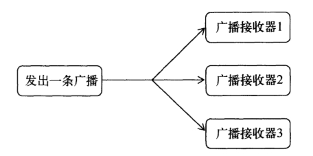
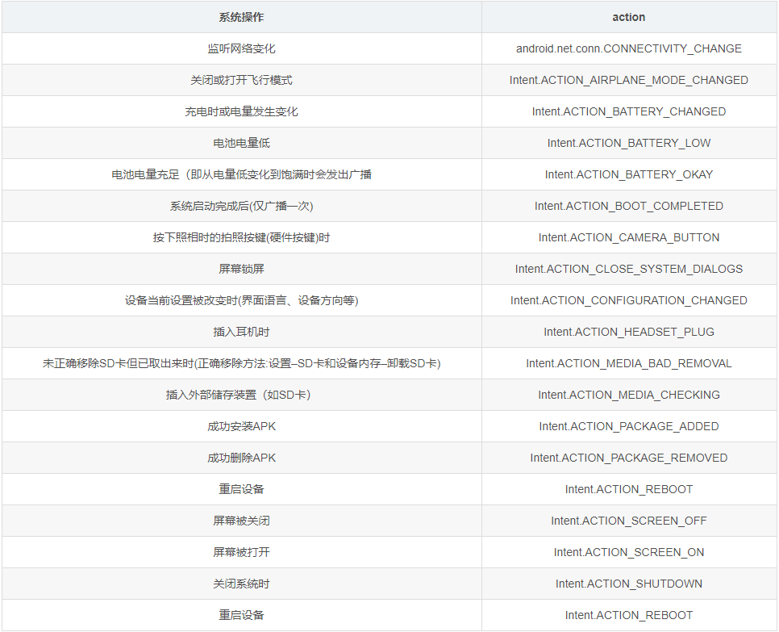
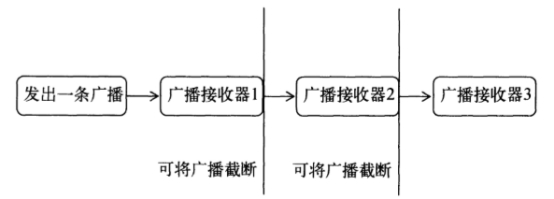
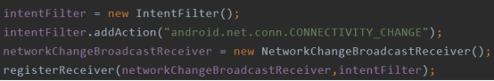
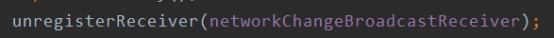
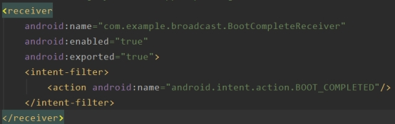
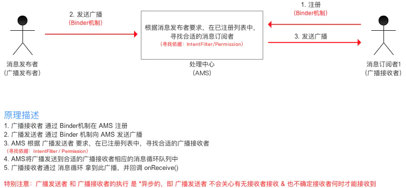

目录

[TOC]


# 一、Broadcast机制简介

`BroadcastReceiver`（广播接收器），属于 `Android` 四大组件之一，在 `Android` 开发中，`BroadcastReceiver` 的应用场景非常多，是为了便于进行系统级别的消息通知而引入的。程序可以对自己感兴趣的广播进行注册，这样该程序就会接收到自己所关心的广播内容。这些广播可能来自系统，也可以是其他程序。Android中有完整的API用于发送和接收广播。发送广播使用Intent，接收广播使用Broadcast Receiver(广播接收器)。

广播是一种广泛运用的在应用程序之间传输信息的机制，主要用来监听系统或者应用发出的广播信息，然后根据广播信息作为相应的逻辑处理，也可以用来传输少量、频率低的数据。

在实现开机启动服务和网络状态改变、电量变化、短信和来电时通过接收系统的广播让应用程序作出相应的处理。

BroadcastReceiver 自身并不实现图形用户界面，但是当它收到某个通知后， BroadcastReceiver 可以通过启动 Service 、启动 Activity 或是 NotificationMananger 提醒用户。

# 二、广播分类

`BroadcastReceiver`的所有广播类型，主要分为5类：

- 普通广播（Normal Broadcast）
- 系统广播（System Broadcast）
- 有序广播（Ordered Broadcast）
- 粘性广播（Sticky Broadcast）
- App应用内广播（Local Broadcast）

## 1、普通广播（Normal broadcasts）

普通广播是完全异步的，在广播发出后，所有广播接收器几乎都会在同一时刻接收到这条广播消息，因此它们之间没有任何先后顺序。这种广播效率比较高，同时无法被截断。工作流程如下：

 

这是开发者自己定义的广播，发送广播的方式如下：

```java
Intent intent = new Intent();
//对应BroadcastReceiver中intentFilter的action
intent.setAction(BROADCAST_ACTION);
//发送广播
sendBroadcast(intent);
```

- 若被注册了的广播接收者中注册时intentFilter的action与上述匹配，则会接收此广播（即进行回调onReceive()）。如下mBroadcastReceiver则会接收上述广播

```java
<receiver 
    //此广播接收者类是mBroadcastReceiver
    android:name=".mBroadcastReceiver" >
    //用于接收网络状态改变时发出的广播
    <intent-filter>
        <action android:name="BROADCAST_ACTION" />
    </intent-filter>
</receiver>
```

- 若发送广播有相应权限，那么广播接收者也需要相应权限


## 2、系统广播（System Broadcast）

- Android中内置了多个系统广播：只要涉及到手机的基本操作（如开机、网络状态变化、拍照等等），都会发出相应的广播
- 每个广播都有特定的Intent - Filter（包括具体的action），Android系统广播action如下：



注：当使用系统广播时，只需要在注册广播接收者时定义相关的action即可，并不需要手动发送广播，当系统有相关操作时会自动进行系统广播

## 3、有序广播（Ordered broadcasts）

同步执行的广播，在广播发出后，同一时刻只会有一个广播接收器能够收到这条广播消息，当这个广播接收器中的逻辑执行完毕后，广播才会继续传递。这种类型的广播接收器有先后顺序，优先级高的先接受广播消息，并可以截断广播。工作流程如下：

 

- 广播接收者接收广播的顺序规则（同时面向静态和动态注册的广播接受者）

1. 按照Priority属性值从大-小排序；
2. Priority属性相同者，动态注册的广播优先；

- 特点

1. 接收广播按顺序接收
2. 先接收的广播接收者可以对广播进行截断，即后接收的广播接收者不再接收到此广播；
3. 先接收的广播接收者可以对广播进行修改，那么后接收的广播接收者将接收到被修改后的广播

- 使用

  有序广播的使用过程与普通广播非常类似，差异仅在于广播的发送方式：

  ```java
  sendOrderedBroadcast(intent);
  ```


- 截断

  ```java
  abortBroadcast();
  ```

### 示例

应用在需要有特定拦截的场景下使用，如黑名单短信、电话拦截。　

使用方法：

```kotlin
// 发送有序广播
sendOrderedBroadcast(intent, receiverPermission);

// receiverPermission ：一个接收器必须持以接收您的广播。如果为 null ，不经许可的要求（一般都为null）。
sendOrderedBroadcast(intent, null);
```

在有序广播中，我们可以在前一个广播接收者将处理好的数据传送给后面的广播接收者，也可以调用abortBroadcast()来终结广播的传播。

```kotlin
public void onReceive(Context arg0, Intent intent) {
　　//获取上一个广播的bundle数据
　　Bundle bundle = getResultExtras(true);//true：前一个广播没有结果时创建新的Bundle；false：不创建Bundle
　　bundle.putString("key", "777");
　　//将bundle数据放入广播中传给下一个广播接收者
　　setResultExtras(bundle);　
　　
　　//终止广播传给下一个广播接收者
　　abortBroadcast();
}
```

高级别的广播收到该广播后，可以决定把该广播是否截断掉。同级别接收是先后是随机的，如果先接收到的把广播截断了，同级别的例外的接收者是无法收到该广播。


## 4、本地广播（Local Broadcast）

本地广播又叫局部广播。

Android中的广播可以跨App直接通信（exported对于有intent-filter情况下默认值为true），可能出现的以下问题：

- 其他App针对性发出与当前App intent-filter相匹配的广播，由此导致当前App不断接收广播并处理；
- 其他App注册与当前App一致的intent-filter用于接收广播，获取广播具体信息；
  即会出现安全性 & 效率性的问题。

- 解决方案
  使用App应用内广播（Local Broadcast）

> 1. App应用内广播可理解为一种局部广播，广播的发送者和接收者都同属于一个App。
> 2. 相比于全局广播（普通广播），App应用内广播优势体现在：安全性高 & 效率高

- 使用1 - 将全局广播设置成局部广播
  1. 注册广播时将exported属性设置为false，使得非本App内部发出的广播不被接收；
  2. 在广播发送和接收时，增设相应权限permission，用于权限验证；
  3. 发送广播时指定该广播接收器所在的包名，此广播将只会发送到此包中的App内与之相匹配的有效广播接收器中。

> 通过**intent.setPackage(packageName)**指定包名

- 使用2 - 使用封装好的LocalBroadcastManager类

  使用方式上与全局广播几乎相同，只是注册/取消注册广播接收器和发送广播时将参数的context变成了LocalBroadcastManager的单一实例

> 注：对于LocalBroadcastManager方式发送的应用内广播，只能通过LocalBroadcastManager动态注册，不能静态注册

```java
//注册应用内广播接收器
//步骤1：实例化BroadcastReceiver子类 & IntentFilter mBroadcastReceiver 
mBroadcastReceiver = new mBroadcastReceiver(); 
IntentFilter intentFilter = new IntentFilter(); 

//步骤2：实例化LocalBroadcastManager的实例
localBroadcastManager = LocalBroadcastManager.getInstance(this);

//步骤3：设置接收广播的类型 
intentFilter.addAction(android.net.conn.CONNECTIVITY_CHANGE);

//步骤4：调用LocalBroadcastManager单一实例的registerReceiver（）方法进行动态注册 
localBroadcastManager.registerReceiver(mBroadcastReceiver, intentFilter);

//取消注册应用内广播接收器
localBroadcastManager.unregisterReceiver(mBroadcastReceiver);

//发送应用内广播
Intent intent = new Intent();
intent.setAction(BROADCAST_ACTION);
localBroadcastManager.sendBroadcast(intent);
```

前面的广播都属于全局广播，广播中使用intent进行数据传递，为了保证数据的安全性，并避免接收到其他程序发送的无用广播，Android引入了本地广播机制。通过此机制发出广播只会在程序内部传递，并且广播接收器只会接收此程序发出的广播，安全问题就解决了。

本地广播核心：`LocalBroadcastManager`。它同样提供了发送广播和注册广播接收器的方法。使用方法和全局广播一样。本地广播不能通过静态注册的方式来接收。因为静态注册主要就是为了让程序在未启动的情况下也能收到广播，而发送本地广播时，程序已经启动。本地广播优势：

1. 广播只在程序内部传播，数据不会泄露。

2. 其他程序无法发送广播到程序内部，没有安全漏斗的隐患。

3. 发送本地广播比发送全局广播更高效。

## 5、粘性广播（Sticky Broadcast）

由于在Android5.0 & API 21中已经失效，所以不建议使用，在这里也不作过多的总结。

### 异步广播

使用方法：sendStickyBroadcast() ：

发出的Intent当接收Activity（动态注册）重新处于onResume状态之后就能重新接受到其Intent.（the Intent will be held to be re-broadcast to future receivers）。就是说sendStickyBroadcast发出的最后一个Intent会被保留，下次当Activity处于活跃的时候又会接受到它。

发这个广播需要权限：

```
<uses-permission android:name="android.permission.BROADCAST_STICKY" />
```

卸载该广播：

```
removeStickyBroadcast(intent);
```

在卸载之前该intent会保留，接收者在可接收状态都能获得。

### 异步有序广播

使用方法：

sendStickyOrderedBroadcast(intent, resultReceiver, scheduler, initialCode, initialData, initialExtras)：

这个方法具有有序广播的特性也有异步广播的特性，同时需要限权：

```
 <uses-permission android:name="android.permission.BROADCAST_STICKY" /> 
```

# 

# 三、接收广播消息（BroadcastReceiver的注册）

Android内置了很多系统级别的广播，比如手机开机完成、电量变化等情况，都会发出广播。可以在程序中接收这些广播。广播接收器通过注册来监听广播，有两种注册方式：动态注册和静态注册（推荐使用），广播接收者在注册后就开始监听系统或者应用之间发送的广播消息。

## 3.1 动态注册

核心方法：registerReceiver(BroadcastReceiver br,IntentFilter i),

IntentFilter指明要接收的广播BroadcastReceiver指定广播接收器，接收到广播后，在广播接收器的onReceive中进行逻辑处理。

 

广播使用后，需要解除注册。

 

动态注册的广播接收器可以自由地控制注册与注销，更加灵活，但它必须在程序启动后才能接收到广播。如果要在程序未启动的情况下接收广播，则需要静态注册。

完整示例：

```java
// 选择在Activity生命周期方法中的onResume()中注册
@Override
  protected void onResume(){
      super.onResume();

    // 1. 实例化BroadcastReceiver子类 &  IntentFilter
     mBroadcastReceiver mBroadcastReceiver = new mBroadcastReceiver();
     IntentFilter intentFilter = new IntentFilter();

    // 2. 设置接收广播的类型
    intentFilter.addAction(android.net.conn.CONNECTIVITY_CHANGE);

    // 3. 动态注册：调用Context的registerReceiver（）方法
     registerReceiver(mBroadcastReceiver, intentFilter);
 }

// 注册广播后，要在相应位置记得销毁广播
// 即在onPause() 中unregisterReceiver(mBroadcastReceiver)
// 当此Activity实例化时，会动态将MyBroadcastReceiver注册到系统中
// 当此Activity销毁时，动态注册的MyBroadcastReceiver将不再接收到相应的广播。
 @Override
 protected void onPause() {
     super.onPause();
      //销毁在onResume()方法中的广播
     unregisterReceiver(mBroadcastReceiver);
     }
}
```


## 3.2 静态注册

也是通过action来确定要接收的广播。

```java
<receiver 
    android:enabled=["true" | "false"]
//此broadcastReceiver能否接收其他App的发出的广播
//默认值是由receiver中有无intent-filter决定的：如果有intent-filter，默认值为true，否则为false
    android:exported=["true" | "false"]
    android:icon="drawable resource"
    android:label="string resource"
//继承BroadcastReceiver子类的类名
    android:name=".mBroadcastReceiver"
//具有相应权限的广播发送者发送的广播才能被此BroadcastReceiver所接收；
    android:permission="string"
//BroadcastReceiver运行所处的进程
//默认为app的进程，可以指定独立的进程
//注：Android四大基本组件都可以通过此属性指定自己的独立进程
    android:process="string" >

//用于指定此广播接收器将接收的广播类型
//本示例中给出的是用于接收网络状态改变时发出的广播
 <intent-filter>
<action android:name="android.net.conn.CONNECTIVITY_CHANGE" />
    </intent-filter>
</receiver>
```

示例：

 

## 接收短信广播示例

定义自己的BroadcastReceiver 类

```kotlin
public class MyBroadcastReceiver extends BroadcastReceiver {
 
// action 名称
String SMS_RECEIVED = "android.provider.Telephony.SMS_RECEIVED" ;
 
    public void onReceive(Context context, Intent intent) {
 
       if (intent.getAction().equals( SMS_RECEIVED )) {
           // 一个receiver可以接收多个action的，即可以有多个intent-filter，需要在onReceive里面对intent.getAction(action name)进行判断。
       }
    }
}
```

### 静态方式

在AndroidManifest.xml的application里面定义receiver并设置要接收的action。

```xml
< receiver android:name = ".MyBroadcastReceiver" > 

 < intent-filter android:priority = "777" >             
<action android:name = "android.provider.Telephony.SMS_RECEIVED" />
</ intent-filter > 

</ receiver >
```

这里的priority取值是　-1000到1000，值越大优先级越高，同时注意加上系统接收短信的权限。

``` xml
< uses-permission android:name ="android.permission.RECEIVE_SMS" />
```

静态注册的广播接收者是一个常驻在系统中的全局监听器，当你在应用中配置了一个静态的BroadcastReceiver，安装应用后无论应用是否处于运行状态，广播接收者都已经常驻在系统中了。同时应用里的所有receiver都在清单文件里面，方便查看。要销毁掉静态注册的广播接收者，可以通过调用PackageManager将Receiver禁用。

### 动态方式

在Activity中声明BroadcastReceiver的扩展对象，在onResume中注册，onPause中注销。　　

```kotlin
public class MainActivity extends Activity {
	MyBroadcastReceiver receiver;
	@Override
	 protected void onResume() {
		// 动态注册广播 (代码执行到这才会开始监听广播消息，并对广播消息作为相应的处理)
		receiver = new MyBroadcastReceiver();
		IntentFilter intentFilter = new IntentFilter( "android.provider.Telephony.SMS_RECEIVED" );
		registerReceiver( receiver , intentFilter);
		
		super.onResume();
	}
	@Override
	protected void onPause() {  
		// 撤销注册 (撤销注册后广播接收者将不会再监听系统的广播消息)
		unregisterReceiver(receiver);
		super.onPause();
	}
}
```

## 静态注册和动态注册的区别

1、静态注册的广播接收者一经安装就常驻在系统之中，不需要重新启动唤醒接收者；动态注册的广播接收者随着应用的生命周期，由registerReceiver开始监听，由unregisterReceiver撤销监听，如果应用退出后，没有撤销已经注册的接收者应用将会报错。

2、当广播接收者通过intent启动一个activity或者service时，如果intent中无法匹配到相应的组件，动态注册的广播接收者将会导致应用报错，而静态注册的广播接收者将不会有任何报错，因为自从应用安装完成后，广播接收者跟应用已经脱离了关系。

## 特别注意

对于不同注册方式的广播接收器回调OnReceive（Context context，Intent intent）中的context返回值是不一样的：

- 对于静态注册（全局+应用内广播），回调onReceive(context, intent)中的context返回值是：ReceiverRestrictedContext；
- 对于全局广播的动态注册，回调onReceive(context, intent)中的context返回值是：Activity Context；
- 对于应用内广播的动态注册（LocalBroadcastManager方式），回调onReceive(context, intent)中的context返回值是：Application Context。
- 对于应用内广播的动态注册（非LocalBroadcastManager方式），回调onReceive(context, intent)中的context返回值是：Activity Context；


# 四、其他

## BroadcastReceiver使用注意

当系统或应用发出广播时，将会扫描系统中的所有广播接收者，通过action匹配将广播发送给相应的接收者，接收者收到广播后将会产生一个广播接收者的实例，执行其中的 onReceiver() 方法；特别需要注意的是这个实例的生命周期只有10秒，如果10秒内没执行结束onReceiver()，系统将会报错。
在onReceiver()执行完毕之后，该实例将会被销毁，所以不要在onReceiver()中执行耗时操作，也不要在里面创建子线程处理业务（因为可能子线程没处理完，接收者就被回收了，那么子线程也会跟着被回收掉）；正确的处理方法是通过调用 activity 或者 service 处理业务。广播接收器更多的是扮演打开程序其他组件的角色，比如创建状态栏通知，或者启动一个服务等。

## 一些常用的系统广播的action 和 permission

 - 开机启动

```xml
<action android:name="android.intent.action.BOOT_COMPLETED"/> 
```

```xml
<uses-permission android:name="android.permission.RECEIVE_BOOT_COMPLETED" /> 
```

 - 网络状态

```xml
<action android:name="android.net.conn.CONNECTIVITY_CHANGE"/>  
```

```xml
<uses-permission android:name="android.permission.ACCESS_NETWORK_STATE"/> 
```

　　　网络是否可用的方法：

```kotlin
  public static boolean isNetworkAvailable(Context context) {  
        ConnectivityManager mgr = (ConnectivityManager) context.getSystemService(Context.CONNECTIVITY_SERVICE);  
        NetworkInfo[] info = mgr.getAllNetworkInfo();  
        if (info != null) {  
            for (int i = 0; i < info.length; i++) {  
      if (info[i].getState() == NetworkInfo.State.CONNECTED) {  
                    return true;  
                }  
            }  
        }  
        return false;  
    } 
```

 - 电量变化

```xml
<action android:name="android.intent.action.BATTERY_CHANGED"/>  
```

BroadcastReceiver 的onReceive方法：

```kotlin
public void onReceive(Context context, Intent intent) {  
        int currLevel = intent.getIntExtra(BatteryManager.EXTRA_LEVEL, 0);  //当前电量  　
        
        int total = intent.getIntExtra(BatteryManager.EXTRA_SCALE, 1);    //总电量  
        int percent = currLevel * 100 / total;  
        Log.i(TAG, "battery: " + percent + "%");  
    }  
```


# 总结

 - 静态广播接收的处理器是由PackageManagerService负责，当手机启动或者新安装了应用的时候，PackageManagerService会扫描手机中所有已安装的APP应用，将AndroidManifest.xml中有关注册广播的信息解析出来，存储至一个全局静态变量当中。

 - 动态广播接收的处理器是由ActivityManagerService负责，当APP的服务或者进程起来之后，执行了注册广播接收的代码逻辑，即进行加载，最后会存储在一个另外的全局静态变量中。需要注意的是：

　　 1、 这个并非是一成不变的，当程序被杀死之后，已注册的动态广播接收器也会被移出全局变量，直到下次程序启动，再进行动态广播的注册，当然这里面的顺序也已经变更了一次。

　　 2、这里也并没完整的进行广播的排序，只记录的注册的先后顺序，并未有结合优先级的处理。

 - 广播发出的时候，广播接收者接收的顺序如下：

　　１．当广播为**普通广播**时，有如下的接收顺序：

　　无视优先级
　　动态优先于静态
　　同优先级的动态广播接收器，**先注册的大于后注册的**
　　同优先级的静态广播接收器，**先扫描的大于后扫描的**　

　　２．如果广播为**有序广播**，那么会将动态广播处理器和静态广播处理器合并在一起处理广播的消息，最终确定广播接收的顺序：　
　　
　　优先级高的先接收　
　　同优先级的动静态广播接收器，**动态优先于静态**
　　同优先级的动态广播接收器，**先注册的大于后注册的**
　　同优先级的静态广播接收器，**先扫描的大于后扫描的**　


# 相关问题解答

<font color='orange'>Q：对广播，BroadcastReceiver的理解</font>

1. BroadcastReceiver 是 Android 四大组件之一，分为广播发送者、广播接收者。主要作用是监听 / 接收 应用 App 发出的广播消息，并做出响应，例如电话监听、网络监听等。

2. 广播使用了设计模式中的观察者模式：基于消息的发布 / 订阅事件模型

3. 使用：继承 BroadcastReceiver，重写 onReceive()方法。

4. 原理

   通过 Binder 机制向 ActivityManagerService 注册广播。
   通过 Binder 机制向 ActivityMangerService 发送广播

   ActivityManagerService 查找符合相应条件的广播（IntentFilter/Permission）的BroadcastReceiver，将广播发送到 BroadcastReceiver 所在的消息队列中。
   BroadcastReceiver 所在消息队列拿到此广播后，回调它的 onReceive()方法。


广播是什么？

广播的分类 & 特性 & 使用场景？

说说系统广播和本地广播的原理 & 区别 & 使用场景。

有两个应用注册了一样的广播，一个是静态，一个是动态，连优先级也一样，那么当广播从系统发出来后，哪个应用先接收到广播？


**使用**

<font color='orange'>Q：BroadCast的使用方法</font>

见上文。

<font color='orange'>Q：广播使用的方式和场景</font>

1、App全局监听，这种主要用于在AndroidManifest中静态注册的广播接收器，一般我们在收到该消息后，需要做一些相应的动作，而这些动作与当前App的组件，比如Activity或者Service的是否运行无关，比如我们在集成第三方Push SDK时，一般都会添加一个静态注册的BroadcastReceiver来监听Push消息，当有Push消息过来时，会在后台做一些网络请求或者发送通知等等。

2、组件局部监听，这种主要是在Activity或者Service中使用registerReceiver()动态注册的广播接收器，因为当我们收到一些特定的消息，比如网络连接发生变化时，我们可能需要在当前Activity页面给用户一些UI上的提示，或者将Service中的网络请求任务暂停。所以这种动态注册的广播接收器适合特定组件的特定消息处理。

> 详细请看：[Broadcast使用场景解读](https://www.jianshu.com/p/5a983578418e)

<font color='orange'>Q：注册的方式，以及不同注册方式的生命周期。</font>

1、静态注册
常驻，当应用程序关闭后如果有信息广播来，程序也会被系统调用，自己运行。
无需担忧广播接收器是否被关闭，只要设备是开启状态，广播接收器就是打开着的。
2、动态注册
不常驻，广播会跟随程序的生命周期。
在 Android 的广播机制中，动态注册优先级高于静态注册优先级，因此在必要情况下，是需要动态注册广播接收者的。当用来注册的 Activity 关掉后，广播也就失效了。

<font color='orange'>Q：在manifest和代码中如何注册和使用BroadcastReceiver?</font>

见上文——接受广播消息。

<font color='orange'>Q：静态广播和动态广播的区别（BroadcastReciver的静态注册与动态注册的区别）？</font>

（1）注册方式：静态是清单文件注册，动态是代码注册
（2）生命周期：即使应用不在了，仍能收到静态广播；多态广播必须在程序启动后才能接收到广播，对应Activity销毁，动态广播便不会收到了。

<font color='orange'>Q：广播是否可以请求网络？</font>

不可以，广播默认在主线程中。

当 onReceive()方法在 10 s 内没有执行完毕，Android 会认为该程序无响应，所以在BroadcastReceiver 里不能做一些比较耗时的操作，否侧会弹出 ANR 的对话框。

<font color='orange'>Q：可以在onReceive中开启线程么，会有什么问题？</font>

不可靠，Receiver只在onReceive方法执行时是激活状态，只要onReceive一返回，Receiver就不再是激活状态了。由于activity可能会被用户退出，Broadcast Receiver的生命周期本身就很短，可能出现的情况是: 在子线程还没有结束的情况下，Activity已经被用户退出了，或者BroadcastReceiver已经结束了。在Activity已经退出、BroadcastReceiver已经结束的情况下，此时它们所在的进程就变成了空进程(没有任何活动组件的进程)，系统需要内存时可能会优先终止该进程。如果宿主进程被终止，那么该进程内的所有子线程也会被中止，这样就可能导致子线程无法执行完成.。

当响应一个广播信息的处理十分耗时的时候，那么就应该把这个处理放在一个单独的线程里去执行，来保证主线程里的其他用户交互组件能够继续运行，而一旦这么做，当onReceive()唤起一个线程后就会马上返回，这时就会把Receiver进程放到被终止的境地。解决这个问题的方案是在onReceive()里开始一个Service，让这个Service去 做这件事情，那么系统就会认为这个进程里还有活动正在进行。推荐使用IntentService。

<font color='orange'>Q：广播引起anr的时间限制是多少？</font>

10s

<font color='orange'>Q：如何通过广播拦截和abort一条短信？</font>

1、首先添加接收短信的权限

```java
<uses-permission android:name="android.permission.RECEIVE_SMS"/>
```

2、在清单文件中注册广播接收器，设置该广播接收器优先级,尽量设高一点。
3、创建一个 BroadcastReceiver 来实现广播的处理，并设置拦截器 abortBroadcast()。


**分类**

<font color='orange'>Q：谈谈本地广播（应用内广播）</font>

<font color='orange'>Q：局部广播和全局广播的区别分别用什么实现的。</font>

<font color='orange'>Q：BroadcastReceiver，LocalBroadcastReceiver区别</font>

<font color='orange'>Q：本地广播和全局广播有什么差别？</font>

1. 应用场景

   BroadcastReceiver 用于应用之间的传递消息。

   LocalBroadcastManager 用于应用内部传递消息，比 BroadcastReceiver 更加高效。

2. 安全
   BroadcastReceiver 本质上它是跨应用的，所以在使用它时必须要考虑到不要被别的应用滥用。LocalBroadcastManager 不需要考虑安全问题，因为它只在应用内部有效。

3. 原理
   BroadcastReceiver 是以 Binder 通讯方式为底层实现。
   LocalBroadcastManager 的核心实现是 Handler，只是利用到了 IntentFilter 的 match 功能，至于 BroadcastReceiver 换成其他接口也无所谓，顺便利用了现成的类和概念而已，安全性更好，效率更高。

<font color='orange'>Q：有序广播和无序广播的区别？</font>

<font color='orange'>Q：什么是有序广播？</font>

通过`sendOrderedBroadcast(intent);`发送的广播是有序广播，有序广播会按照广播接收器的优先级进行传递，可以被拦截和添加信息再传递。

<font color='orange'>Q：广播的分类（广播有几种形式）?都有什么特点？</font>

1. 普通广播：开发者自定义 intent 广播。
2. 系统广播：系统内置广播，如开机、网络状态变化。
3. 有序广播：发送出去的广播被广播接收者按照先后顺序接收，先接收道广播接受者可对广播进行修改或者截断，使用 sendOrderedBroadcast(intent)。
4. 粘性广播：由于在 Android5.0 & API 21 中已经失效，所以不建议使用，在这里也不作过多的总结。
5. App 应用内广播：App 应用内广播可理解为一种局部广播，广播的发送者和接收者都同属于一个 App，（将 exported 属性设置为 false）


**原理**

<font color='orange'>Q：广播发送和接收的原理了解吗？（Binder机制、AMS）</font>

<font color='orange'>Q：广播的原理是什么</font>

全局广播：

通过 Binder 机制向 ActivityManagerService 注册广播。
通过 Binder 机制向 ActivityMangerService 发送广播

ActivityManagerService 查找符合相应条件的广播（IntentFilter/Permission）的BroadcastReceiver，将广播发送到 BroadcastReceiver 所在的消息队列中。
BroadcastReceiver 所在消息队列拿到此广播后，回调它的 onReceive()方法。



本地广播：

是用Handler实现的。

> 注意：对原理还没有深入的学习过，只是简单了解了一下。

<font color='orange'>Q：广播传输的数据是否有限制，是多少，为什么要限制?</font>

1、用 Intent 传递数据，实际上走的是跨进程通信（IPC），跨进程通信需要把数据从内核 copy 到进程中，每一个进程有一个接收内核数据的缓冲区**，**默认是 1 M。如果一次传递的数据超过限制，就会出现异常。不同厂商表现不一样有可能是厂商修改了此限制的大小，也可能同样的对象在不同的机器上大小不一样。

2、传递大数据，不应该用 Intent；考虑使用 ContentProvider 或者直接匿名共享内存。简单情况下可以考虑分段传输。

3、广播主要是用来发送通知消息的。


**对比**

<font color='orange'>Q：你了解广播吗？它与EventBus有什么区别？能互相实现吗？</font>


<font color='orange'>Q：广播是观察者模式?跨进城广播也是观察者模式吗?</font>


<font color='orange'>Q：两个应用同时注册一个广播,优先级都一样,哪个会先收到广播?(有序广播?)</font>


<font color='orange'>Q：跨进程通信，为什么选广播而不是别的跨进程通信方式</font>


<font color='orange'>Q：contenprovider已经是进程间通信,为什么还要引入broadcastreceiver?</font>


# 参考

[广播相关题目](https://link.csdn.net/?target=https%3A%2F%2Fwww.jianshu.com%2Fp%2Fca3d87a4cdf3)

[Carson带你学Android：BroadcastReceiver史上最全面解析](https://www.jianshu.com/p/ca3d87a4cdf3)

