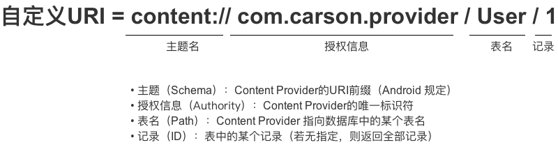
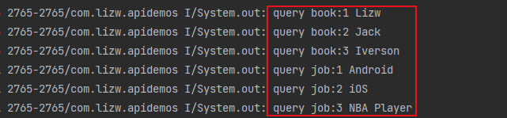
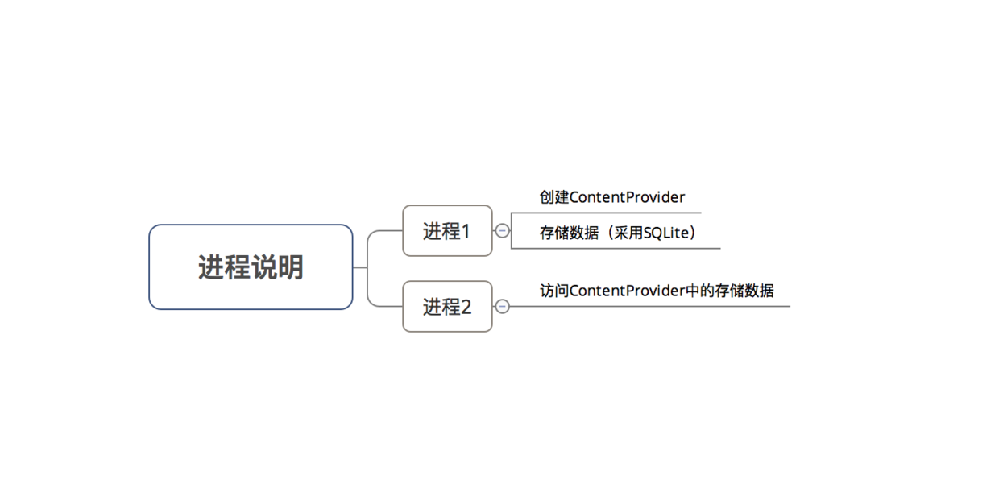
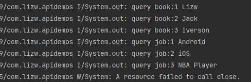
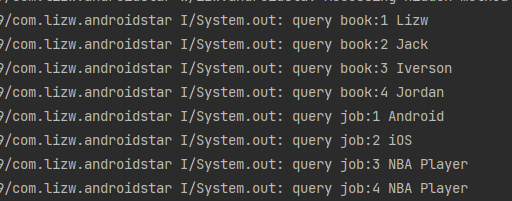
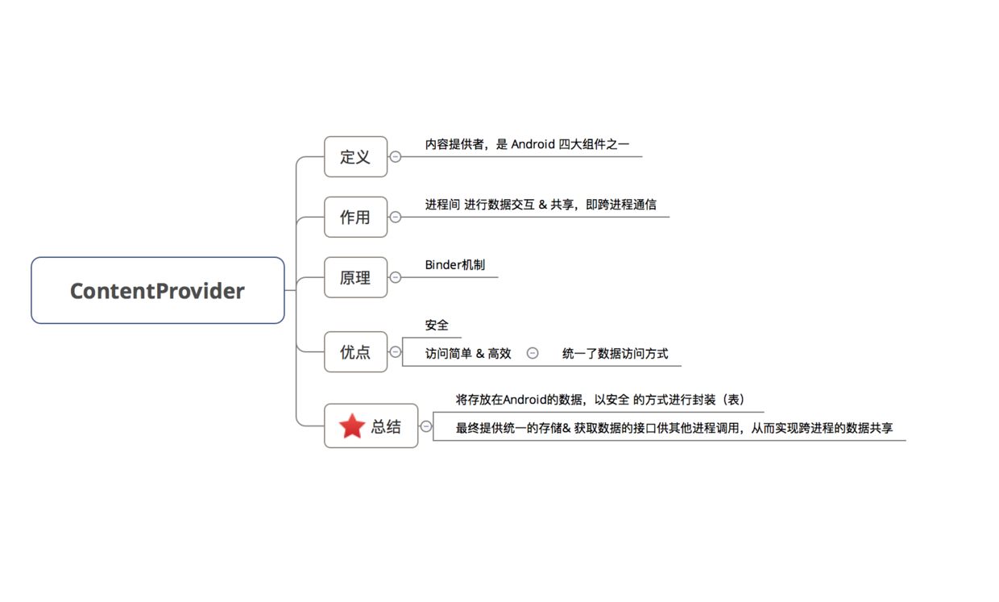

> version：2022/07/
>
> review：


目录

[TOC]


# 关键词


## 一、定义

ContentProvider，即内容提供者属于Android的四大组件之一。


## 二、 作用

进程间 进行**数据交互 & 共享**，即跨进程通信



## 三、 原理

`ContentProvider`的底层是采用 `Android`中的`Binder`机制


## 四、相关概念

### 4.1 统一资源标识符（URI）

- 定义：`Uniform Resource Identifier`，即统一资源标识符

- 作用：唯一标识 ContentProvider & 其中的数据

  > 外界进程通过 URI 找到对应的ContentProvider & 其中的数据，再进行数据操作

- 具体使用

  URI分为 系统预置 & 自定义，分别对应系统内置的数据（如通讯录、日程表等等）和自定义数据库


```Java
// 设置URI。
// 指向的资源是：名为 `com.example.provider`的`ContentProvider` 中表名 为`User` 中的 `id`为1的数据
Uri uri = Uri.parse("content://com.example.provider/User/1") 

// 特别注意：URI模式存在匹配通配符 * & ＃

// *：匹配任意长度的任何有效字符的字符串。以下的 URI 表示：匹配provider的任何内容
content://com.example.app.provider/* 

// ＃：匹配任意长度的数字字符的字符串。以下的URI表示：匹配provider中的table表的所有行
content://com.example.app.provider/table/#
```


### 4.2 MIME数据类型

- 解释：MIME：全称Multipurpose Internet Mail Extensions，多功能Internet 邮件扩充服务。它是一种多用途网际邮件扩充协议，在1992年最早应用于电子邮件系统，但后来也应用到浏览器。MIME类型就是设定某种扩展名的文件用一种应用程序来打开的方式类型，当该扩展名文件被访问的时候，浏览器会自动使用指定应用程序来打开。多用于指定一些客户端自定义的文件名，以及一些媒体文件打开方式。
- 作用：指定某个扩展名的文件用某种应用程序来打开，如指定`.html`文件采用`text`应用程序打开、指定`.pdf`文件采用`flash`应用程序打开

具体使用：

**4.2.1 ContentProvider根据 URI 返回MIME类型**

```java
ContentProvider.geType(uri) ；
```

**4.2.2 MIME类型组成** 

每种`MIME`类型 由2部分组成 = 类型 + 子类型

> MIME类型是 一个 包含2部分的字符串

```java
text / html
// 类型 = text、子类型 = html

text/css
text/xml
application/pdf
```

**4.2.3 MIME类型形式** 

`MIME`类型有2种形式：

```java
// 形式1：单条记录  
vnd.android.cursor.item/自定义
// 形式2：多条记录（集合）
vnd.android.cursor.dir/自定义 

// 注：
  // 1. vnd：表示父类型和子类型具有非标准的、特定的形式。
  // 2. 父类型已固定好（即不能更改），只能区别是单条还是多条记录
  // 3. 子类型可自定义
```

#### 实例说明

```java
<-- 单条记录 -->
  // 单个记录的MIME类型
  vnd.android.cursor.item/vnd.yourcompanyname.contenttype 

  // 若一个Uri如下
  content://com.example.transportationprovider/trains/122   
  // 则ContentProvider会通过ContentProvider.geType(url)返回以下MIME类型
  vnd.android.cursor.item/vnd.example.rail


<-- 多条记录 -->
  // 多个记录的MIME类型
  vnd.android.cursor.dir/vnd.yourcompanyname.contenttype 
  // 若一个Uri如下
  content://com.example.transportationprovider/trains 
  // 则ContentProvider会通过ContentProvider.geType(url)返回以下MIME类型
  vnd.android.cursor.dir/vnd.example.rail
```


### 4.3 ContentProvider类

**4.3.1 组织数据方式**

- ContentProvider主要以表格的形式组织数据

  > 同时也支持文件数据，只是表格形式用得比较多

- 每个表格中包含多张表，每张表包含行 & 列，分别对应记录 & 字段

  > 同数据库

**4.3.2 主要方法**

- **进程**间共享数据的本质是：添加、删除、获取 & 修改（更新）数据
- 所以`ContentProvider`的核心方法也主要是上述4个作用

```java
<-- 4个核心方法 -->
  // 外部进程向 ContentProvider 中添加数据
  public Uri insert(Uri uri, ContentValues values) 
  
  // 外部进程 删除 ContentProvider 中的数据
  public int delete(Uri uri, String selection, String[] selectionArgs) 
    
  // 外部进程更新 ContentProvider 中的数据
  public int update(Uri uri, ContentValues values, String selection, String[] selectionArgs)

  // 外部应用 获取 ContentProvider 中的数据
  public Cursor query(Uri uri, String[] projection, String selection, String[] selectionArgs,  String sortOrder)　 

// 注：
  // 1. 上述4个方法由外部进程回调，并运行在ContentProvider进程的Binder线程池中（不是主线程）
  // 2. 存在多线程并发访问，需要实现线程同步
  // a. 若ContentProvider的数据存储方式是使用SQLite & 一个，则不需要，因为SQLite内部实现好了线程同步，若是多个SQLite则需要，因为SQL对象之间无法进行线程同步
  // b. 若ContentProvider的数据存储方式是内存，则需要自己实现线程同步

<-- 2个其他方法 -->
	// ContentProvider创建后 或 打开系统后其它进程第一次访问该ContentProvider时 由系统进行调用
	// 注：运行在ContentProvider所在进程的主线程，故不能做耗时操作
	public boolean onCreate() 
    
	// 得到数据类型，即返回当前 Url 所代表数据的MIME类型
	public String getType(Uri uri)
```

- `Android`为常见的数据（如通讯录、日程表等）提供了内置默认的`ContentProvider`。但也可根据需求自定义ContentProvider，但上述6个方法必须重写

`ContentProvider`类并不会直接与外部进程交互，而是通过`ContentResolver` 类


### 4.4 ContentResolver类

**4.41 作用**

统一管理不同 `ContentProvider`间的操作

> 1. 通过 `URI` 即可操作 不同的`ContentProvider` 中的数据
> 2. 外部进程通过 `ContentResolver`类 从而与`ContentProvider`类进行交互

**4.2 为什么要使用通过`ContentResolver`类从而与`ContentProvider`类进行交互，而不直接访问`ContentProvider`类？**

- 一般来说，一款应用要使用多个`ContentProvider`，若需要了解每个`ContentProvider`的不同实现从而再完成数据交互，**操作成本高 & 难度大**
- 所以在`ContentProvider`类的基础上多加了一个 `ContentResolver`类来对所有的`ContentProvider`进行统一管理。

**4.3 具体使用**

`ContentResolver` 类提供了与`ContentProvider`类相同名字 & 作用的4个方法

```java
// 外部进程向 ContentProvider 中添加数据
public Uri insert(Uri uri, ContentValues values)　 

// 外部进程 删除 ContentProvider 中的数据
public int delete(Uri uri, String selection, String[] selectionArgs)

// 外部进程更新 ContentProvider 中的数据
public int update(Uri uri, ContentValues values, String selection, String[] selectionArgs)　 

// 外部应用 获取 ContentProvider 中的数据
public Cursor query(Uri uri, String[] projection, String selection, String[] selectionArgs, String sortOrder)
```

- 实例说明

```java
// 使用ContentResolver前，需要先获取ContentResolver
// 可通过在所有继承Context的类中 通过调用getContentResolver()来获得ContentResolver
ContentResolver resolver =  getContentResolver(); 

// 设置ContentProvider的URI
Uri uri = Uri.parse("content://cn.scu.myprovider/user"); 

// 根据URI 操作 ContentProvider中的数据
// 此处是获取ContentProvider中 user表的所有记录 
Cursor cursor = resolver.query(uri, null, null, null, "userid desc");
```


`Android` 还提供了3个用于辅助`ContentProvide`的工具类：

- `ContentUris`
- `UriMatcher`
- `ContentObserver`


### 4.5 ContentUris类

- 作用：操作 `URI`
- 具体使用 核心方法有两个：`withAppendedId（）` &`parseId（）`

```java
// withAppendedId（）作用：向URI追加一个id
Uri uri = Uri.parse("content://cn.scu.myprovider/user") 

// 最终生成后的Uri为：content://cn.scu.myprovider/user/7
Uri resultUri = ContentUris.withAppendedId(uri, 7);

Uri uri = Uri.parse("content://cn.scu.myprovider/user/7")
// parseId（）作用：从URL中获取ID。获取的结果为:7
long personid = ContentUris.parseId(uri); 
```


### 4.6 UriMatcher类

- 作用
  1. 在`ContentProvider` 中注册`URI`
  2. 根据 `URI` 匹配 `ContentProvider` 中对应的数据表
- 具体使用

```Java
// 步骤1：初始化UriMatcher对象
UriMatcher matcher = new UriMatcher(UriMatcher.NO_MATCH);
// 常量UriMatcher.NO_MATCH  = 不匹配任何路径的返回码
// 即初始化时不匹配任何东西

// 步骤2：在ContentProvider 中注册URI（addURI（））
int URI_CODE_a = 1；
int URI_CODE_b = 2；
matcher.addURI("cn.scu.myprovider", "user1", URI_CODE_a);
matcher.addURI("cn.scu.myprovider", "user2", URI_CODE_b);
// 若URI资源路径 = content://cn.scu.myprovider/user1 ，则返回注册码URI_CODE_a
// 若URI资源路径 = content://cn.scu.myprovider/user2 ，则返回注册码URI_CODE_b

// 步骤3：根据URI 匹配 URI_CODE，从而匹配ContentProvider中相应的资源（match（））

@Override
public String getType (Uri uri){
    Uri uri = Uri.parse(" content://cn.scu.myprovider/user1");

    switch (matcher.match(uri)) {
        // 根据URI匹配的返回码是URI_CODE_a
        // 即matcher.match(uri) == URI_CODE_a
        case URI_CODE_a:
            return tableNameUser1;
        // 如果根据URI匹配的返回码是URI_CODE_a，则返回ContentProvider中的名为tableNameUser1的表
        case URI_CODE_b:
            return tableNameUser2;
        // 如果根据URI匹配的返回码是URI_CODE_b，则返回ContentProvider中的名为tableNameUser2的表
    }
}
```


### 4.7 ContentObserver类

- 定义：内容观察者

- 作用：观察 Uri引起ContentProvider 中的数据变化 & 通知外界（即访问该数据访问者）

  > 当`ContentProvider` 中的数据发生变化（增、删 & 改）时，就会触发该 `ContentObserver`类

- 具体使用

```Java
// 步骤1：注册内容观察者ContentObserver
getContentResolver().registerContentObserver（uri）；
// 通过ContentResolver类进行注册，并指定需要观察的URI

// 步骤2：当该URI的ContentProvider数据发生变化时，通知外界（即访问该ContentProvider数据的访问者）
public class UserContentProvider extends ContentProvider {
    public Uri insert(Uri uri, ContentValues values) {
        db.insert("user", "userid", values);
        getContext().getContentResolver().notifyChange(uri, null);
        // 通知访问者
    }
}

// 步骤3：解除观察者
getContentResolver().unregisterContentObserver（uri）；
// 同样需要通过ContentResolver类进行解除
```

至此，关于`ContentProvider`的使用已经讲解完毕


## 五、 实例说明

`ContentProvider`不仅常用于进程间通信，同时也适用于进程内通信

实例包含两种：

1. 进程内通信
2. 进程间通信

采用的数据源是`Android`中的`SQLite`数据库

### 5.1 进程内通信

- 步骤说明：
  1. 创建数据库类
  2. 自定义 `ContentProvider` 类
  3. 注册 创建的 `ContentProvider`类
  4. 进程内访问 `ContentProvider`的数据
- 具体使用

**步骤1：创建数据库类** **DBHelper.java**

```java
class DBHelper(context: Context) :
    SQLiteOpenHelper(context, DATABASE_NAME, null, DATABASE_VERSION) {

    override fun onCreate(db: SQLiteDatabase) {

        // 创建两个表格:用户表 和 职业表
        db.execSQL("CREATE TABLE IF NOT EXISTS $USER_TABLE_NAME(_id INTEGER PRIMARY KEY AUTOINCREMENT, name TEXT)")
        db.execSQL("CREATE TABLE IF NOT EXISTS $JOB_TABLE_NAME(_id INTEGER PRIMARY KEY AUTOINCREMENT, job TEXT)")
    }

    override fun onUpgrade(db: SQLiteDatabase?, oldVersion: Int, newVersion: Int) {}

    companion object {
        // 数据库名
        private const val DATABASE_NAME = "finch.db"

        // 表名
        const val USER_TABLE_NAME = "user"
        const val JOB_TABLE_NAME = "job"

        //数据库版本号
        private const val DATABASE_VERSION = 1
    }
}
```

**步骤2：自定义 ContentProvider 类**

```java
class MyProvider : ContentProvider() {
    private var mContext: Context? = null
    var mDbHelper: DBHelper? = null
    var db: SQLiteDatabase? = null

    companion object {
        const val AUTOHORITY = "com.lizw.myprovider"

        // 设置ContentProvider的唯一标识
        const val User_Code = 1
        const val Job_Code = 2

        // UriMatcher类使用:在ContentProvider 中注册URI
        private var mMatcher: UriMatcher? = null

        init {
            mMatcher = UriMatcher(UriMatcher.NO_MATCH)
            // 初始化
            mMatcher!!.addURI(AUTOHORITY, "user", User_Code)
            mMatcher!!.addURI(AUTOHORITY, "job", Job_Code)
            // 若URI资源路径 = content://com.lizw.myprovider/user ，则返回注册码User_Code
            // 若URI资源路径 = content://com.lizw.myprovider/job ，则返回注册码Job_Code
        }
    }

    /**
     * 初始化ContentProvider
     */
    override fun onCreate(): Boolean {
        mContext = context
        // 在ContentProvider创建时对数据库进行初始化
        // 运行在主线程，故不能做耗时操作,此处仅作展示
        mDbHelper = DBHelper(context!!)
        db = mDbHelper!!.writableDatabase.apply {
            // 初始化两个表的数据(先清空两个表,再各加入一个记录)
            execSQL("delete from user")
            execSQL("insert into user values(1,'Lizw');")
            execSQL("insert into user values(2,'Jack');")
            execSQL("delete from job")
            execSQL("insert into job values(1,'Android');")
            execSQL("insert into job values(2,'iOS');")
        }
        return true
    }

    // 以下是ContentProvider的6个方法
    /**
     * 添加数据
     */
    override fun insert(uri: Uri, values: ContentValues?): Uri {

        // 根据URI匹配 URI_CODE，从而匹配ContentProvider中相应的表名
        // 该方法在最下面
        val table = getTableName(uri)

        // 向该表添加数据
        db!!.insert(table, null, values)

        // 当该URI的ContentProvider数据发生变化时，通知外界（即访问该ContentProvider数据的访问者）
        mContext?.contentResolver?.notifyChange(uri, null)

//        // 通过ContentUris类从URL中获取ID
//        long personid = ContentUris.parseId(uri);
//        System.out.println(personid);
        return uri
    }

    /**
     * 查询数据
     */
    override fun query(
        uri: Uri, projection: Array<String?>?, selection: String?,
        selectionArgs: Array<String?>?, sortOrder: String?,
    ): Cursor {
        // 根据URI匹配 URI_CODE，从而匹配ContentProvider中相应的表名
        // 该方法在最下面
        val table = getTableName(uri)

//        // 通过ContentUris类从URL中获取ID
//        long personid = ContentUris.parseId(uri);
//        System.out.println(personid);

        // 查询数据
        return db!!.query(table, projection, selection, selectionArgs, null, null, sortOrder, null)
    }

    /**
     * 更新数据
     */
    override fun update(
        uri: Uri,
        values: ContentValues?,
        selection: String?,
        selectionArgs: Array<out String>?,
    ): Int {
        // 由于不展示,此处不作展开
        return 0
    }

    /**
     * 删除数据
     */
    override fun delete(uri: Uri, selection: String?, selectionArgs: Array<out String>?): Int {
        // 由于不展示,此处不作展开
        return 0
    }

    override fun getType(uri: Uri): String? {

        // 由于不展示,此处不作展开
        return null
    }

    /**
     * 根据URI匹配 URI_CODE，从而匹配ContentProvider中相应的表名
     */
    private fun getTableName(uri: Uri): String? {
        var tableName: String? = null
        when (mMatcher!!.match(uri)) {
            User_Code -> tableName = DBHelper.USER_TABLE_NAME
            Job_Code -> tableName = DBHelper.JOB_TABLE_NAME
        }
        return tableName
    }
}
```

**步骤3：注册 创建的 ContentProvider类** **AndroidManifest.xml**

```xml
        <provider
            android:name=".contentprovider.MyProvider"
            android:authorities="com.lizw.myprovider"
            android:exported="true" />
```

**步骤4：进程内访问 ContentProvider中的数据**

**MainActivity.java**

```java
class ContentProviderActivity : AppCompatActivity() {
    override fun onCreate(savedInstanceState: Bundle?) {
        super.onCreate(savedInstanceState)
        setContentView(R.layout.activity_content_provider)
        /**
         * 对user表进行操作
         */
        // 设置URI
        val uri_user: Uri = Uri.parse("content://com.lizw.myprovider/user")

        // 插入表中数据
        val values = ContentValues()
        values.put("_id", 3)
        values.put("name", "Iverson")

        // 获取ContentResolver
        val resolver = contentResolver
        // 通过ContentResolver 根据URI 向ContentProvider中插入数据
        resolver.insert(uri_user, values)

        // 通过ContentResolver 向ContentProvider中查询数据
        resolver.query(uri_user, arrayOf("_id", "name"), null, null, null)?.apply {
            while (moveToNext()) {
                // 将表中数据全部输出
                println("query book:" + getInt(0).toString() + " " + getString(1))
            }
            close()
        }

        /**
         * 对job表进行操作
         */
        // 和上述类似,只是URI需要更改,从而匹配不同的URI CODE,从而找到不同的数据资源
        val uri_job: Uri = Uri.parse("content://com.lizw.myprovider/job")

        // 插入表中数据
        val values2 = ContentValues()
        values2.put("_id", 3)
        values2.put("job", "NBA Player")

        val resolver2 = contentResolver
        resolver2.insert(uri_job, values2)

        resolver2.query(uri_job, arrayOf("_id", "job"), null, null, null)?.apply {
            while (moveToNext()) {
                println("query job:" + getInt(0).toString() + " " + getString(1))
            }
            close()
        }
    }
}
```

### 结果




### 5.2 进程间进行数据共享

- 实例说明：本文需要创建2个进程



#### 进程1

使用步骤如下：

1. 创建数据库类
2. 自定义 `ContentProvider` 类
3. 注册 创建的 `ContentProvider` 类

前2个步骤同上例相同

**步骤3：注册 创建的 ContentProvider类** *AndroidManifest.xml*

```xml
// 外界需要声明同样的读 & 写的权限才可进行相应操作，否则会报错
        <provider
            android:name=".contentprovider.MyProvider"
            android:authorities="com.lizw.myprovider"
            android:permission="com.lizw.myprovider.PROVIDER"
// 设置此provider是否可以被其他进程使用
            android:exported="true" />

// 声明本应用 可允许通信的权限
// 权限可细分为读 & 写的权限
    <permission
        android:name="com.lizw.myprovider.Read"
        android:protectionLevel="normal" />
    <permission
        android:name="com.lizw.myprovider.Write"
        android:protectionLevel="normal" />
// 声明外界进程可访问该Provider的权限（读 & 写）
    <permission
        android:name="com.lizw.myprovider.PROVIDER"
        android:protectionLevel="normal" />
```

至此，进程1创建完毕，即创建`ContentProvider` & 数据 准备好了。


#### 进程2

**步骤1：声明可访问的权限**

**AndroidManifest.xml**

```Xml
// 注意，如果是Android11以上，要加入这个才能去访问provide
	<queries>
        <package android:name="com.lizw.apidemos" />
    </queries>


    <!--    contentprovider 示例权限。在这里声明权限-->
    <uses-permission android:name="com.lizw.myprovider.PROVIDER"/>
// 注：声明的权限必须与进程1中设置的权限对应
```

**步骤2：访问 ContentProvider的类**

```java
class MainActivity : AppCompatActivity() {
    override fun onCreate(savedInstanceState: Bundle?) {
        super.onCreate(savedInstanceState)
        setContentView(R.layout.activity_main)
        queryContentProvider()
    }

    fun queryContentProvider() {
        /**
         * 对user表进行操作
         */
        // 设置URI
        val uri_user: Uri = Uri.parse("content://com.lizw.myprovider/user")

        // 插入表中数据
        val values = ContentValues()
        values.put("_id", 4)
        values.put("name", "Jordan")

        // 获取ContentResolver
        val resolver = contentResolver
        // 通过ContentResolver 根据URI 向ContentProvider中插入数据
        resolver.insert(uri_user, values)
        // 通过ContentResolver 向ContentProvider中查询数据
        resolver.query(uri_user, arrayOf("_id", "name"), null, null, null)?.apply {
            while (moveToNext()) {
                println("query book:" + getInt(0).toString() + " " + getString(
                    1))
                // 将表中数据全部输出
            }
            close()
        }

        /**
         * 对job表进行操作
         */
        val uri_job: Uri = Uri.parse("content://com.lizw.myprovider/job")

        val values2 = ContentValues()
        values2.put("_id", 4)
        values2.put("job", "NBA Player")

        val resolver2 = contentResolver
        resolver2.insert(uri_job, values2)
        resolver2.query(uri_job, arrayOf("_id", "job"), null, null, null)?.apply {
            while (moveToNext()) {
                println("query job:" + getInt(0)
                    .toString() + " " + getString(1))
                // 将表中数据全部输出
            }
            close()
        }

    }
}
```

注意：

Android11，要在manifest中添加：

```java
// 注意，如果是Android11以上，要加入这个才能去访问provide
	<queries>
        <package android:name="com.lizw.apidemos" />
    </queries>
```


#### 结果展示

**在进程展示时，需要先运行准备数据的进程1，再运行需要访问数据的进程2**

1. 运行准备数据的进程1 在进程1中，我们准备好了一系列数据

   

2. 运行需要访问数据的进程2 在进程2中，我们先向`ContentProvider`中插入数据，再查询数据




## 六、优点

### 6.1 安全

`ContentProvider`为应用间的数据交互提供了一个安全的环境：允许把自己的应用数据根据需求开放给 其他应用 进行 **增、删、改、查**，而不用担心因为直接开放数据库权限而带来的安全问题

### 6.2 访问简单 & 高效

对比于其他对外共享数据的方式，数据访问方式会因数据存储的方式而不同：

- 采用 文件方式 对外共享数据，需要进行文件操作读写数据；
- 采用 `Sharedpreferences` 共享数据，需要使用sharedpreferences API读写数据

这使得访问数据变得复杂 & 难度大。

- 而采用ContentProvider方式，其解耦了底层数据的存储方式，使得无论底层数据存储采用何种方式，外界对数据的访问方式都是统一的，这使得访问简单 & 高效

  > 如一开始数据存储方式 采用 `SQLite` 数据库，后来把数据库换成 `MongoDB`，也不会对上层数据`ContentProvider`使用代码产生影响


## 七、 总结




# FAQ：常见问题

<font color='orange'>Q：</font>


<font color='orange'>Q：</font>


<font color='orange'>Q：</font>


<font color='orange'>Q：</font>


<font color='orange'>Q：</font>


<font color='orange'>Q：</font>


<font color='orange'>Q：</font>


# 总结

1、

## 【精益求精】我还能做（补充）些什么？

1、


# 脑图


# 参考

