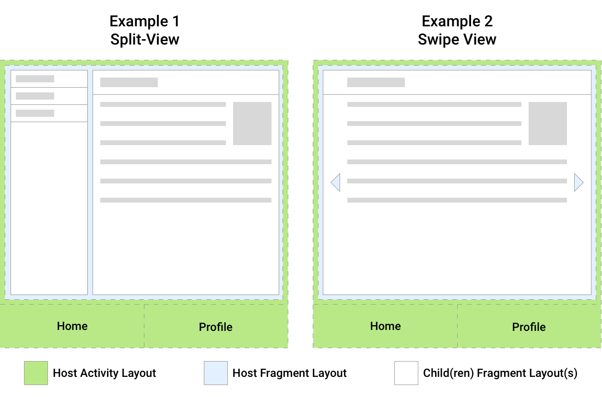

> version：2021/9/
>
> review：

[原文地址](https://developer.android.google.cn/guide/fragments/fragmentmanager)

目录

[TOC]

# Fragment 管理器

> **注意**：我们强烈建议使用 [Navigation 库](https://developer.android.google.cn/guide/navigation)管理应用的导航。该框架遵循使用 Fragment、返回堆栈和 Fragment 管理器的最佳做法。如需详细了解 Navigation，请参阅 [Navigation 组件使用入门](https://developer.android.google.cn/guide/navigation/navigation-getting-started)和[迁移到 Navigation 组件](https://developer.android.google.cn/guide/navigation/navigation-migrate)。

[`FragmentManager`](https://developer.android.google.cn/reference/androidx/fragment/app/FragmentManager) 类负责对应用的 Fragment 执行一些操作，如添加、移除或替换它们，以及将它们添加到返回堆栈。

如果您使用的是 [Jetpack Navigation](https://developer.android.google.cn/guide/navigation) 库，则可能永远不会直接与 `FragmentManager` 交互，因为该库会代表您使用 `FragmentManager`。也就是说，任何使用 Fragment 的应用都在某种程度上使用 `FragmentManager`，因此了解它是什么以及它如何工作非常重要。

本主题介绍如何访问 `FragmentManager`、`FragmentManager` 与 Activity 和 Fragment 相关的角色、如何使用 `FragmentManager` 管理返回堆栈，以及如何为 Fragment 提供数据和依赖项。


## 访问 FragmentManager

**在 Activity 中访问**

每个 [`FragmentActivity`](https://developer.android.google.cn/reference/androidx/fragment/app/FragmentActivity) 及其子类（如 [`AppCompatActivity`](https://developer.android.google.cn/reference/androidx/appcompat/app/AppCompatActivity)）都可以通过 [`getSupportFragmentManager()`](https://developer.android.google.cn/reference/androidx/fragment/app/FragmentActivity#getSupportFragmentManager()) 方法访问 `FragmentManager`。

**在 Fragment 中访问**

Fragment 也能够托管一个或多个子 Fragment。在 Fragment 内，您可以通过 [`getChildFragmentManager()`](https://developer.android.google.cn/reference/androidx/fragment/app/Fragment#getChildFragmentManager()) 获取对管理 Fragment 子级的 `FragmentManager` 的引用。如果您需要访问其宿主 `FragmentManager`，可以使用 [`getParentFragmentManager()`](https://developer.android.google.cn/reference/androidx/fragment/app/Fragment#getParentFragmentManager())。

下面我们来看几个示例，看看 Fragment、其宿主以及与每个 Fragment 关联的 `FragmentManager` 实例之间的关系。



**图 1.** 两个界面布局示例，显示了 Fragment 与其宿主 Activity 之间的关系。

图 1 显示了两个示例，每个示例中都有一个 Activity 宿主。这两个示例中的宿主 Activity 都以 [`BottomNavigationView`](https://developer.android.google.cn/reference/com/google/android/material/bottomnavigation/BottomNavigationView)的形式向用户显示顶级导航，该视图负责以应用中的不同屏幕换出宿主 Fragment，其中每个屏幕都实现为单独的 Fragment。

**示例 1** 中的宿主 Fragment 托管两个子 Fragment，这些 Fragment 构成拆分视图屏幕。

**示例 2** 中的宿主 Fragment 托管一个子 Fragment，该 Fragment 构成[滑动视图](https://developer.android.google.cn/guide/navigation/navigation-swipe-view-2#implement_swipe_views)的显示 Fragment。

基于此设置，您可以将每个宿主视为具有与其关联的 `FragmentManager`，用于管理其子 Fragment。图 2 说明了这一点，并显示了 `supportFragmentManager`、`parentFragmentManager` 和 `childFragmentManager` 之间的属性映射。


**图 2.** 每个宿主都有与其关联的 `FragmentManager`，用于管理其子 Fragment。

需要引用的相应 `FragmentManager` 属性取决于调用点在 Fragment 层次结构中的位置，以及您尝试访问的 Fragment 管理器。

对 `FragmentManager` 进行引用后，您就可以使用它来操纵向用户显示的 Fragment。


### 子 Fragment

一般来说，应用应由应用项目中的一个或少数几个 Activity 组成，其中每个 Activity 表示一组相关的屏幕。Activity 可能会提供一个点来放置顶级导航，并提供一个位置来限定 `ViewModels` 以及 Fragment 之间的其他视图状态的范围。应用中的每个目的地应由一个 Fragment 表示。

如果您想要一次显示多个 Fragment（如在拆分视图中或信息中心内），应使用子 Fragment，它们由目的地 Fragment 及其子 Fragment 管理器进行管理。

子 Fragment 的其他用例可能包括：

- [屏幕滑动](https://developer.android.google.cn/training/animation/screen-slide-2)，其中父 Fragment 中的 `ViewPager2` 管理一系列子 Fragment 视图。
- 一组相关屏幕中的子导航。
- Jetpack Navigation 将子 Fragment 用作各个目的地。一个 Activity 托管一个父 `NavHostFragment`，并在用户浏览应用时以不同的子目的地 Fragment 填充它的空间。


## 使用 FragmentManager

`FragmentManager` 管理 Fragment 返回堆栈。在运行时，`FragmentManager` 可以执行添加或移除 Fragment 等返回堆栈操作来响应用户互动。每一组更改作为一个单元（称为 [`FragmentTransaction`](https://developer.android.google.cn/reference/androidx/fragment/app/FragmentTransaction)）一起提交。如需更深入地了解 Fragment 事务，请参阅 [Fragment 事务指南](https://developer.android.google.cn/guide/fragments/transactions)。

当用户按设备上的“返回”按钮时，或者当您调用 [`FragmentManager.popBackStack()`](https://developer.android.google.cn/reference/androidx/fragment/app/FragmentManager#popBackStack()) 时，最上面的 Fragment 事务会从堆栈中弹出。换句话说，事务是反转的。如果堆栈上没有更多 Fragment 事务，并且您没有使用子 Fragment，则返回事件会向上传递到 Activity。如果您使用子 Fragment，请参阅[有关子 Fragment 和同级 Fragment 的特殊注意事项](https://developer.android.google.cn/guide/fragments/fragmentmanager#considerations)。

当您对事务调用 [`addToBackStack()`](https://developer.android.google.cn/reference/androidx/fragment/app/FragmentTransaction#addToBackStack(java.lang.String)) 时，请注意，事务可以包括任意数量的操作，如添加多个 Fragment、替换多个容器中的 Fragment，等等。弹出返回堆栈时，所有这些操作会作为一项原子化操作反转。如果您在调用 `popBackStack()`之前提交了其他事务，并且您没有对事务使用 `addToBackStack()`，则这些操作不会反转。因此，在一个 `FragmentTransaction` 中，应避免让影响返回堆栈的事务与不影响返回堆栈的事务交织在一起。


## 执行事务

如需在布局容器中显示 Fragment，请使用 `FragmentManager` 创建 `FragmentTransaction`。在事务中，您随后可以对容器执行 [`add()`](https://developer.android.google.cn/reference/androidx/fragment/app/FragmentTransaction#add(int, java.lang.Class, android.os.Bundle)) 或 [`replace()`](https://developer.android.google.cn/reference/androidx/fragment/app/FragmentTransaction#replace(int, java.lang.Class, android.os.Bundle)) 操作。

例如，一个简单的 `FragmentTransaction` 可能如下所示：

```java
FragmentManager fragmentManager = getSupportFragmentManager();
fragmentManager.beginTransaction()
    .replace(R.id.fragment_container, ExampleFragment.class, null)
    .setReorderingAllowed(true)
    .addToBackStack("name") // name can be null
    .commit();
```

在本例中，`ExampleFragment` 会替换当前在由 `R.id.fragment_container` ID 标识的布局容器中的 Fragment（如果有）。将 Fragment 的类提供给 [`replace()`](https://developer.android.google.cn/reference/androidx/fragment/app/FragmentTransaction#replace(int, java.lang.Class, android.os.Bundle)) 方法可让 `FragmentManager` 使用其 [`FragmentFactory`](https://developer.android.google.cn/reference/androidx/fragment/app/FragmentFactory) 处理实例化。如需了解详情，请参阅[提供依赖项](https://developer.android.google.cn/guide/fragments/fragmentmanager#dependencies)。

[`setReorderingAllowed(true)`](https://developer.android.google.cn/reference/androidx/fragment/app/FragmentTransaction#setReorderingAllowed(boolean)) 可优化事务中涉及的 Fragment 的状态变化，以使动画和过渡正常运行。如需详细了解如何使用动画和过渡进行导航，请参阅 [Fragment 事务](https://developer.android.google.cn/guide/fragments/transactions)和[使用动画在 Fragment 之间导航](https://developer.android.google.cn/training/basics/fragments/animate)。

调用 [`addToBackStack()`](https://developer.android.google.cn/reference/androidx/fragment/app/FragmentTransaction#addToBackStack(java.lang.String)) 会将事务提交到返回堆栈。用户稍后可以通过按“返回”按钮反转事务并恢复上一个 Fragment。如果您在一个事务中添加或移除了多个 Fragment，弹出返回堆栈时，所有这些操作都会撤消。在 `addToBackStack()`调用中提供的可选名称使您能够使用 [`popBackStack()`](https://developer.android.google.cn/reference/androidx/fragment/app/FragmentManager#popBackStack(java.lang.String, int)) 弹回到该特定事务。

如果您在执行移除 Fragment 的事务时未调用 `addToBackStack()`，则提交事务时会销毁已移除的 Fragment，用户无法返回到该 Fragment。如果您在移除某个 Fragment 时调用了 `addToBackStack()`，则该 Fragment 只会 `STOPPED`，稍后当用户返回时它会 `RESUMED`。请注意，在这种情况下，其视图会被销毁。如需了解详情，请参阅 [Fragment 生命周期](https://developer.android.google.cn/guide/fragments/lifecycle)。


### 查找现有 Fragment

您可以使用 [`findFragmentById()`](https://developer.android.google.cn/reference/androidx/fragment/app/FragmentManager#findFragmentById(int)) 获取对布局容器中当前 Fragment 的引用。从 XML 扩充时，可使用 `findFragmentById()` 按给定的 ID 查找 Fragment；在 `FragmentTransaction` 中添加时，可使用它按容器 ID 进行查找。示例如下：

```java
FragmentManager fragmentManager = getSupportFragmentManager();
fragmentManager.beginTransaction()
    .replace(R.id.fragment_container, ExampleFragment.class, null)
    .setReorderingAllowed(true)
    .addToBackStack(null)
    .commit();

...

ExampleFragment fragment =
        (ExampleFragment) fragmentManager.findFragmentById(R.id.fragment_container);
```

或者，您也可以为 Fragment 分配一个唯一的标记，并使用 [`findFragmentByTag()`](https://developer.android.google.cn/reference/androidx/fragment/app/FragmentManager#findFragmentByTag(java.lang.String)) 获取引用。您可以在布局中定义的 Fragment 上使用 `android:tag` XML 属性来分配标记，也可以在 `FragmentTransaction` 中的 `add()` 或 `replace()`操作期间分配标记。

```java
FragmentManager fragmentManager = getSupportFragmentManager();
fragmentManager.beginTransaction()
    .replace(R.id.fragment_container, ExampleFragment.class, null, "tag")
    .setReorderingAllowed(true)
    .addToBackStack(null)
    .commit();

...

ExampleFragment fragment = (ExampleFragment) fragmentManager.findFragmentByTag("tag");
```


### 有关子 Fragment 和同级 Fragment 的特殊注意事项

在任何给定的时间，只允许一个 `FragmentManager` 控制 Fragment 返回堆栈。如果应用在屏幕上同时显示多个同级 Fragment，或者应用使用子 Fragment，则必须指定一个 `FragmentManager` 来处理应用的主要导航。

如需在 Fragment 事务内定义主要导航 Fragment，请对事务调用 [`setPrimaryNavigationFragment()`](https://developer.android.google.cn/reference/kotlin/androidx/fragment/app/FragmentTransaction#setPrimaryNavigationFragment(androidx.fragment.app.Fragment)) 方法，并传入一个 Fragment 的实例，该 Fragment 的 `childFragmentManager` 应具有主要控制权。

将导航结构视为一系列层，其中 Activity 作为最外层，封装下面的每一层子 Fragment。每一层都必须有一个主要导航 Fragment。当发生返回事件时，最内层控制导航行为。一旦最内层再也没有可从其弹回的 Fragment 事务，控制权就会回到外面的下一层，此过程会一直重复，直至到达 Activity 为止。

请注意，当同时显示两个或更多 Fragment 时，其中只有一个可以是主要导航 Fragment。如果将某个 Fragment 设为主要导航 Fragment，会移除对先前 Fragment 的指定。在上例中，如果您将详情 fragment 设为主要导航 fragment，就会移除对主 fragment 的指定。


## 支持多个返回堆栈

在某些情况下，您的应用可能需要支持多个返回堆栈。一个常见示例是，您的应用使用底部导航栏。`FragmentManager`可让您通过 `saveBackStack()` 和 `restoreBackStack()` 方法支持多个返回堆栈。这两种方法使您可以通过保存一个返回堆栈并恢复另一个返回堆栈来在返回堆栈之间进行交换。

> **注意**：或者，您也可以使用 [`NavigationUI`](https://developer.android.google.cn/reference/androidx/navigation/ui/NavigationUI) 组件，该组件会自动处理对[底部导航栏](https://developer.android.google.cn/guide/navigation/navigation-ui#bottom_navigation)的多个返回堆栈支持。

`saveBackStack()` 的工作方式类似于使用可选 `name` 参数调用 `popBackStack()`：弹出指定事务以及堆栈上在此之后的所有事务。不同之处在于 `saveBackStack()` [会保存弹出事务中所有 fragment 的状态](https://developer.android.google.cn/guide/fragments/saving-state)。

例如，假设您之前使用 `addToBackStack()` 提交 `FragmentTransaction`，从而将 fragment 添加到返回堆栈：

```java
supportFragmentManager.beginTransaction()
  .replace(R.id.fragment_container, ExampleFragment.class, null)
  // setReorderingAllowed(true) and the optional string argument for
  // addToBackStack() are both required if you want to use saveBackStack().
  .setReorderingAllowed(true)
  .addToBackStack("replacement")
  .commit();
```

在这种情况下，您可以通过调用 `saveState()` 来保存此 fragment 事务和 `ExampleFragment` 的状态：

```java
supportFragmentManager.saveBackStack("replacement");
```

> **注意**：您只能将 `saveBackStack()` 用于调用 `setReorderingAllowed(true)` 的事务，以确保可以将事务还原为单一原子操作。

您可以使用相同的名称参数调用 `restoreBackStack()`，以恢复所有弹出的事务以及所有保存的 fragment 状态：

```java
supportFragmentManager.restoreBackStack("replacement");
```

> **注意**：除非使用 `addToBackStack()` 传递 fragment 事务的可选名称，否则不能使用 `saveBackStack()` 和 `restoreBackStack()`。


## 为 fragment 提供依赖项

添加 Fragment 时，您可以手动实例化 Fragment 并将其添加到 `FragmentTransaction`。

```java
// Instantiate a new instance before adding
ExampleFragment myFragment = new ExampleFragment();
fragmentManager.beginTransaction()
    .add(R.id.fragment_view_container, myFragment)
    .setReorderingAllowed(true)
    .commit();
```

当您提交 Fragment 事务时，您创建的 Fragment 实例就是使用的实例。不过，在[配置更改](https://developer.android.google.cn/guide/topics/resources/runtime-changes)期间，Activity 及其所有 Fragment 都会被销毁，然后使用最适用的 [Android 资源](https://developer.android.google.cn/guide/topics/resources/providing-resources#BestMatch)重新创建。`FragmentManager` 会为您处理所有这些操作。它会重新创建 Fragment 的实例，将其附加到宿主，并重新创建返回堆栈状态。

默认情况下，`FragmentManager` 使用框架提供的 [`FragmentFactory`](https://developer.android.google.cn/reference/androidx/fragment/app/FragmentFactory) 实例化 Fragment 的新实例。此默认工厂使用反射来查找和调用 Fragment 的无参数构造函数。这意味着，您无法使用此默认工厂为 Fragment 提供依赖项。这也意味着，默认情况下，在重新创建过程中，不会使用您首次创建 Fragment 时所用的任何自定义构造函数。

如需为 Fragment 提供依赖项或使用任何自定义构造函数，您必须创建自定义 `FragmentFactory` 子类，然后替换 [`FragmentFactory.instantiate`](https://developer.android.google.cn/reference/androidx/fragment/app/FragmentFactory#instantiate(java.lang.ClassLoader, java.lang.String))。您随后可以将 `FragmentManager` 的默认工厂替换为您的自定义工厂，它随后用于实例化 Fragment。

假设您有一个 `DessertsFragment`，负责显示您家乡受欢迎的甜点。我们假设 `DessertsFragment` 依赖于 `DessertsRepository` 类，该类可为其提供向用户显示正确界面所需的信息。

您可以将 `DessertsFragment` 定义为在其构造函数中需要 `DessertsRepository` 实例。

```java
public class DessertsFragment extends Fragment {
    private DessertsRepository dessertsRepository;

    public DessertsFragment(DessertsRepository dessertsRepository) {
        super();
        this.dessertsRepository = dessertsRepository;
    }

    // Getter omitted.

    ...
}
```

`FragmentFactory` 的简单实现可能与以下代码类似。

```java
public class MyFragmentFactory extends FragmentFactory {
    private DessertsRepository repository;

    public MyFragmentFactory(DessertsRepository repository) {
        super();
        this.repository = repository;
    }

    @NonNull
    @Override
    public Fragment instantiate(@NonNull ClassLoader classLoader, @NonNull String className) {
        Class<? extends Fragment> fragmentClass = loadFragmentClass(classLoader, className);
        if (fragmentClass == DessertsFragment.class) {
            return new DessertsFragment(repository);
        } else {
            return super.instantiate(classLoader, className);
        }
    }
}
```

此示例创建了 `FragmentFactory` 的子类，替换了 `instantiate()` 方法，以便为 `DessertsFragment` 提供自定义 Fragment 创建逻辑。其他 Fragment 类通过 `super.instantiate()` 由 `FragmentFactory` 的默认行为处理。

您随后可以通过在 `FragmentManager` 上设置一个属性，将 `MyFragmentFactory` 指定为要在构造应用的 Fragment 时使用的工厂。您必须在 Activity 的 `super.onCreate()` 之前设置此属性，以确保在重新创建 Fragment 时使用 `MyFragmentFactory`。

```java
public class MealActivity extends AppCompatActivity {
    @Override
    protected void onCreate(@Nullable Bundle savedInstanceState) {
        DessertsRepository repository = DessertsRepository.getInstance();
        getSupportFragmentManager().setFragmentFactory(new MyFragmentFactory(repository));
        super.onCreate(savedInstanceState);
    }
}
```

请注意，在 Activity 中设置 `FragmentFactory` 会替换整个 Activity 的 Fragment 层次结构中的 Fragment 创建。换句话说，您添加的任何子 Fragment 的 `childFragmentManager` 都会使用此处设置的自定义 Fragment 工厂，除非在较低的级别被替换。


### 使用 `FragmentFactory` 进行测试

在一个 Activity 架构中，您应使用 [`FragmentScenario`](https://developer.android.google.cn/reference/androidx/fragment/app/testing/FragmentScenario) 类在隔离的条件下测试 Fragment。由于您无法依赖于 Activity 的自定义 `onCreate` 逻辑，因此可以改为将 `FragmentFactory` 作为参数传入 Fragment 测试，如以下示例所示：

```kotlin
// Inside your test
val dessertRepository = mock(DessertsRepository::class.java)
launchFragment<DessertsFragment>(factory = MyFragmentFactory(dessertRepository)).onFragment {
    // Test Fragment logic
}
```

如需详细了解此测试过程和完整示例，请参阅[测试应用的 Fragment](https://developer.android.google.cn/training/basics/fragments/testing)。


# 总结

1、

## 【精益求精】我还能做（补充）些什么？

1、

