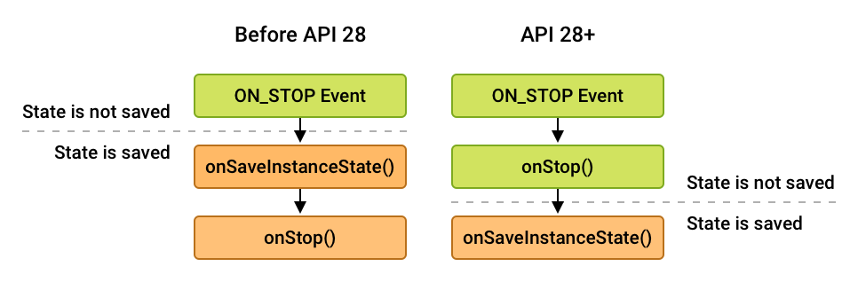

> version：2021/10/1
>
> review：

[原文地址](https://developer.android.google.cn/guide/fragments/lifecycle)

目录

[TOC]

# Fragment生命周期

每个 [`Fragment`](https://developer.android.google.cn/reference/androidx/fragment/app/Fragment) 实例都有自己的生命周期。当用户导航并与您的应用程序交互时，当您的fragment被添加、删除、进入或退出屏幕时，它们会在不同状态的生命周期中进行转换。

为了管理生命周期，`Fragment` 实现了 [`LifecycleOwner`](https://developer.android.google.cn/reference/androidx/lifecycle/LifecycleOwner)，您可以通过 [`getLifecycle()`](https://developer.android.google.cn/reference/androidx/lifecycle/LifecycleOwner#getLifecycle())方法访问 [`Lifecycle`](https://developer.android.google.cn/reference/androidx/lifecycle/Lifecycle)对象。

每个可能的生命周期状态都在Lifecycle.State枚举中表示。

- [`INITIALIZED`](https://developer.android.google.cn/reference/androidx/lifecycle/Lifecycle.State#INITIALIZED)
- [`CREATED`](https://developer.android.google.cn/reference/androidx/lifecycle/Lifecycle.State#CREATED)
- [`STARTED`](https://developer.android.google.cn/reference/androidx/lifecycle/Lifecycle.State#STARTED)
- [`RESUMED`](https://developer.android.google.cn/reference/androidx/lifecycle/Lifecycle.State#RESUMED)
- [`DESTROYED`](https://developer.android.google.cn/reference/androidx/lifecycle/Lifecycle.State#DESTROYED)

要构建基于生命周期的`Fragment` ，您可以从 [使用生命周期感知组件处理生命周期 ](https://developer.android.google.cn/topic/libraries/architecture/lifecycle)获取可使用的技术和类。例如，您可以使用生命周期感知组件在屏幕上显示设备的位置。该组件可以在fragment 变为active 时自动开始监听，当fragment 变为inactive 状态时停止监听。

作为使用 [`LifecycleObserver`](https://developer.android.google.cn/reference/androidx/lifecycle/LifecycleObserver)的替代方法，`Fragment` 类有对应于fragment生命周期中的每个更改的回调方法。其中包括 [`onCreate()`](https://developer.android.google.cn/reference/androidx/fragment/app/Fragment#onCreate(android.os.Bundle)), [`onStart()`](https://developer.android.google.cn/reference/androidx/fragment/app/Fragment#onStart()), [`onResume()`](https://developer.android.google.cn/reference/androidx/fragment/app/Fragment#onResume()), [`onPause()`](https://developer.android.google.cn/reference/androidx/fragment/app/Fragment#onPause()),[`onStop()`](https://developer.android.google.cn/reference/androidx/fragment/app/Fragment#onStop()), 和[`onDestroy()`](https://developer.android.google.cn/reference/androidx/fragment/app/Fragment#onDestroy()).

fragment的view 有一个独立的生命周期，它是独立于fragment生命周期管理的。fragment为其view维护一个 [`LifecycleOwner`](https://developer.android.google.cn/reference/androidx/lifecycle/LifecycleOwner) ，可以使用[`getViewLifecycleOwner()`](https://developer.android.google.cn/reference/androidx/fragment/app/Fragment#getViewLifecycleOwner())或[`getViewLifecycleOwnerLiveData()`](https://developer.android.google.cn/reference/androidx/fragment/app/Fragment#getViewLifecycleOwnerLiveData())访问。访问view的生命周期对于生命周期感知组件只应在fragment的view 存在时执行工作的情况很有用，例如观察只希望显示在屏幕上的 [`LiveData`](https://developer.android.google.cn/topic/libraries/architecture/livedata) 。

本主题详细讨论`Fragment` 的生命周期，解释确定fragment 生命周期状态的一些规则，并展示生命周期状态与fragment 生命周期回调之间的关系。

## Fragments and the fragment manager

当一个fragment 被实例化时，它开始于`INITIALIZED` 状态。要使fragment 在其生命周期的其余部分转换，必须将其添加到 [`FragmentManager`](https://developer.android.google.cn/reference/androidx/fragment/app/FragmentManager)中。`FragmentManager` 负责确定其fragment 应该处于什么状态，然后将它们移动到该状态。

除了fragment 生命周期之外，`FragmentManager` 还负责将fragment 附加到其宿主activity ，并在fragment 不再使用时分离它们。fragment 类有两个回调方法`onAttach()`和 `onDetach()`，您可以重写它们用于当这些事件发生时执行工作。

当fragment 添加到`FragmentManager` 并附加到其宿主activity时，将回调 `onAttach()` 。此时，fragment 是活跃的，`FragmentManager` 正在管理它的生命周期状态。此时，`FragmentManager` 的方法(如findFragmentById())返回这个fragment 。

`onAttach()`总是在任何 [生命周期状态更改](https://developer.android.google.cn/guide/fragments/lifecycle#heading=h.c67h7vfcbez)之前调用。

当fragment 从`FragmentManager` 中移除并与其宿主activity分离时，将回调`onDetach()`。该fragment 不再是活跃的，不能再使用[`findFragmentById()`](https://developer.android.google.cn/reference/androidx/fragment/app/FragmentManager#findFragmentById(int))获取。

`onDetach()`总是在任何[生命周期状态更改](https://developer.android.google.cn/guide/fragments/lifecycle#heading=h.c67h7vfcbez)之后调用。

请注意，这些回调与 [`FragmentTransaction`](https://developer.android.google.cn/reference/androidx/fragment/app/FragmentTransaction) 的方法 [`attach()`](https://developer.android.google.cn/reference/androidx/fragment/app/FragmentTransaction#attach(androidx.fragment.app.Fragment)) 和 [`detach()`](https://developer.android.google.cn/reference/androidx/fragment/app/FragmentTransaction#detach(androidx.fragment.app.Fragment))无关。有关这些方法的更多信息，请参见 [Fragment 事务](https://developer.android.google.cn/guide/fragments/transactions#attach-detach)。

> 警告：避免在`Fragment` 实例从`FragmentManager`中移除后重用它们。当fragment 处理自己的内部状态清理时，您可能会无意中将自己的状态转移到重用实例中。

## Fragment生命周期状态和回调

在确定fragment的生命周期状态时，`FragmentManager` 会考虑以下几点：

- fragment的最大状态由其`FragmentManager`决定。fragment不能超过其`FragmentManager`的状态。
- 作为`FragmentTransaction`的一部分，您可以使用[`setMaxLifecycle()`](https://developer.android.google.cn/reference/androidx/fragment/app/FragmentTransaction#setMaxLifecycle(androidx.fragment.app.Fragment, androidx.lifecycle.Lifecycle.State))在fragment上设置最大生命周期状态。
- 一个fragment的生命周期状态绝不能超过它的父级。例如，父fragment或activity 必须在其子fragment之前启动。同样，子fragment必须在其父fragment或activity 之前停止。

> 警告：避免使用XML的 `<fragment>`标记去添加fragment ，因为`<fragment>`标记允许fragment 超出其`FragmentManager`的状态。相反，始终使用[`FragmentContainerView`](https://developer.android.google.cn/reference/androidx/fragment/app/FragmentContainerView)来在XML中添加片段。

图1.Fragment 生命周期状态及其与fragment的生命周期回调和fragment的view 生命周期的关系。

图1显示了每个fragment的生命周期状态，以及它们与fragment的生命周期回调和fragment的视图生命周期的关系。

当一个fragment 在其生命周期中前进时，它在它的状态中向上和向下移动。例如，添加到回退栈顶部的fragment 从`CREATED` 向上移动到`STARTED` 、`RESUMED`。相反，当一个fragment 从回退栈中弹出时，它向下移动经过这些状态，从`RESUMED` 到`STARTED` ，最后到`DESTROYED`。

### 向上状态转变

当向上移动到它的生命周期状态时，一个fragment 首先为它的新状态调用相关的生命周期回调。一旦这个回调完成，相关的[`Lifecycle.Event`](https://developer.android.google.cn/reference/androidx/lifecycle/Lifecycle.Event)将通过fragment 的生命周期发送给观察者。后面跟着fragment 的view 生命周期，如果它已经被实例化了。

#### Fragment CREATED

当您的fragment 到达`CREATED` 状态时，它已经被添加到`FragmentManager` 中，并且已经调用了[`onAttach()`](https://developer.android.google.cn/reference/androidx/fragment/app/Fragment#onAttach(android.content.Context))方法。

这将是通过fragment 的[`SavedStateRegistry`](https://developer.android.google.cn/reference/androidx/savedstate/SavedStateRegistry)恢复与fragment 相关联的任何已保存状态的适当位置。请注意，此时还没有创建fragment 的view ，任何与fragment 视图相关的状态都应该在视图创建之后才恢复。

此转换调用 [`onCreate()`](https://developer.android.google.cn/reference/androidx/fragment/app/Fragment#onCreate(android.os.Bundle)) 回调。回调还接收一个`savedInstanceState` [`Bundle`](https://developer.android.google.cn/reference/android/os/Bundle)参数，该参数包含 [`onSaveInstanceState()`](https://developer.android.google.cn/reference/androidx/fragment/app/Fragment#onSaveInstanceState(android.os.Bundle))先前保存的任何状态。注意，当第一次创建fragment 时，`savedInstanceState` 有一个`null` 值，但是对于后续的创建，它总是非空的，即使您没有覆盖 `onSaveInstanceState()`。有关详细信息，请参见 [使用片段保存状态](https://developer.android.google.cn/guide/fragments/saving-state) 。

#### Fragment CREATED 和 View INITIALIZED

只有当`Fragment` 提供有效的[`View`](https://developer.android.google.cn/reference/android/view/View)实例时，才会创建fragment的view生命周期。在大多数情况下，您可以使用使用带`@LayoutId`的[fragment构造方法](https://developer.android.google.cn/reference/androidx/fragment/app/Fragment#Fragment(int))，它在适当的时候自动inflate视图。还可以重写 [`onCreateView()`](https://developer.android.google.cn/reference/androidx/fragment/app/Fragment#onCreateView(android.view.LayoutInflater, android.view.ViewGroup, android.os.Bundle))，以编程方式inflate 或创建fragment的视图。

当且仅当您的fragment的view被非空`View`实例化时，该`View`就会在fragment上设置，并可以使用 [`getView()`](https://developer.android.google.cn/reference/androidx/fragment/app/Fragment#getView())获取。然后用与fragment视图相对应的新的`INITIALIZED`[`LifecycleOwner`](https://developer.android.google.cn/reference/androidx/lifecycle/LifecycleOwner) 更新 [`getViewLifecycleOwnerLiveData()`](https://developer.android.google.cn/reference/androidx/fragment/app/Fragment#getViewLifecycleOwnerLiveData()) 。此时还调用 [`onViewCreated()`](https://developer.android.google.cn/reference/androidx/fragment/app/Fragment#onViewCreated(android.view.View, android.os.Bundle))生命周期回调。

这是设置view初始状态、开启观察回调更新fragment视图的LiveData实例以及在fragment视图中的任何 [`RecyclerView`](https://developer.android.google.cn/reference/androidx/recyclerview/widget/RecyclerView) 或 [`ViewPager2`](https://developer.android.google.cn/reference/androidx/viewpager2/widget/ViewPager2) 实例上设置适配器的适当位置。

#### Fragment and View CREATED

在创建了fragment的视图之后，恢复了以前的视图状态(如果有的话)，然后将view的生命周期移到`CREATED` 状态。视图生命周期所有者还向其观察者发出 [`ON_CREATE`](https://developer.android.google.cn/reference/androidx/lifecycle/Lifecycle.Event#ON_CREATE)事件。在这里，您应该恢复与fragment视图相关联的任何附加状态。

此转换还调用 [`onViewStateRestored()`](https://developer.android.google.cn/reference/androidx/fragment/app/Fragment#onViewStateRestored(android.os.Bundle)) 回调。

#### Fragment and View STARTED

强烈建议将具有[生命周期感知的组件](https://developer.android.google.cn/topic/libraries/architecture/lifecycle)绑定到fragment的`STARTED` 状态，因为该状态保证如果创建了fragment，则该fragment的视图是可用的，并且在fragment的子`FragmentManager` 上执行`FragmentTransaction` 是安全的。如果fragment的视图是非空的，则fragment的视图生命周期将在fragment的生命周期被移动到`STARTED` 后立即移动到`STARTED` 。

当fragment 变成状态`STARTED`时，将调用 [`onStart()`](https://developer.android.google.cn/reference/androidx/fragment/app/Fragment#onStart()) 。

> 注意：像 [`ViewPager2`](https://developer.android.google.cn/reference/androidx/viewpager2/widget/ViewPager2) 这样的组件将屏幕外fragments 的最大生命周期设置为`STARTED`。

#### Fragment and View RESUMED

当fragment 可见时，所有 [`Animator`](https://developer.android.google.cn/reference/android/animation/Animator) 效果和 [`Transition`](https://developer.android.google.cn/reference/androidx/transition/Transition) 效果都已经完成，并且该fragment 已为用户交互做好了准备。fragment 的生命周期移动到`RESUMED` 状态，并调用 [`onResume()`](https://developer.android.google.cn/reference/androidx/fragment/app/Fragment#onResume()) 。

转换到`RESUMED` 是指示用户现在能够与您的fragment交互的适当信号。未`RESUMED` 的fragment不应手动设置其视图的焦点，也不应尝试[处理输入方法的可见性](https://developer.android.google.cn/training/keyboard-input/visibility)。

### 向下转变状态

当fragment 向下移动到较低的生命周期状态时，相关的 [`Lifecycle.Event`](https://developer.android.google.cn/reference/androidx/lifecycle/Lifecycle.Event)将通过fragment的视图生命周期(如果实例化)发送给观察者，然后是fragment的生命周期。在发出fragment的生命周期事件之后，该fragment将调用相关的生命周期回调。

#### Fragment and View STARTED

当用户开始离开fragment时，当fragment仍然可见时，fragment及其视图的生命周期将移回`STARTED` 状态，并向他们的观察者发出 [`ON_PAUSE`](https://developer.android.google.cn/reference/androidx/lifecycle/Lifecycle.Event#ON_PAUSE) 事件。然后，该fragment 调用其 [`onPause()`](https://developer.android.google.cn/reference/androidx/fragment/app/Fragment#onPause()) 回调。

#### Fragment and View CREATED

一旦fragment 不再可见，fragment 及其视图的生命周期将被移动到`CREATED`状态，并向其观察者发出 [`ON_STOP`](https://developer.android.google.cn/reference/androidx/lifecycle/Lifecycle.Event#ON_STOP) 事件。这种状态转换不仅由父activity 或被停止的fragment 触发，还通过父activity 或fragment的状态保存来触发。此行为保证在保存fragment的状态之前调用`ON_STOP` 事件。这使得`ON_STOP` 事件成为在子`FragmentManager`上安全执行`FragmentTransaction` 的最后一点。

如图2所示，[`onStop()`](https://developer.android.google.cn/reference/androidx/fragment/app/Fragment#onStop()) 回调的顺序和使用`onSaveInstanceState()`保存状态的顺序根据API级别不同。对于API 28之前的所有API级别，`onSaveInstanceState()` 在`onStop()`之前调用。对于API级别28及更高的级别，调用顺序将反转。

**Figure 2.** 调用`onStop()` 和 `onSaveInstanceState()`的顺序差异.

#### Fragment CREATED and View DESTROYED

在所有退出 [动画和转换](https://developer.android.google.cn/training/basics/fragments/animate) 完成之后，fragment的view被从window中分离出来后，fragment的视图生命周期被移动到`DESTROYED` 状态，并向其观察者发出[`ON_DESTROY`](https://developer.android.google.cn/reference/androidx/lifecycle/Lifecycle.Event#ON_DESTROY)事件。然后，fragment 调用其 [`onDestroyView()`](https://developer.android.google.cn/reference/androidx/fragment/app/Fragment#onDestroyView()) 回调。此时，fragment 的view已经到达其生命周期的末尾， [`getViewLifecycleOwnerLiveData()`](https://developer.android.google.cn/reference/androidx/fragment/app/Fragment#getViewLifecycleOwnerLiveData()) 返回一个空值。

此时，应该删除对fragment view的所有引用，从而允许view被GC。

#### Fragment DESTROYED

如果fragment 被删除，或者`FragmentManager` 被销毁，fragment 的生命周期将被移动到`DESTROYED` 状态，并向它的观察者发送 [`ON_DESTROY`](https://developer.android.google.cn/reference/androidx/lifecycle/Lifecycle.Event#ON_DESTROY) 事件。然后，fragment 调用其[`onDestroy()`](https://developer.android.google.cn/reference/androidx/fragment/app/Fragment#onDestroy())回调。此时，fragment 已经到达其生命周期的末尾。

## 额外资源

有关fragment 生命周期的更多信息，请参见以下附加资源。

### Guides

- [使用生命周期感知组件处理生命周期](https://developer.android.google.cn/topic/libraries/architecture/lifecycle)

### Blogs

- [Fragments: Rebuilding the Internals](https://medium.com/androiddevelopers/fragments-rebuilding-the-internals-61913f8bf48e)

# 总结

1、

## 【精益求精】我还能做（补充）些什么？

1、

