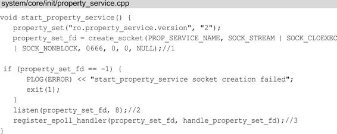
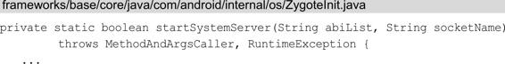
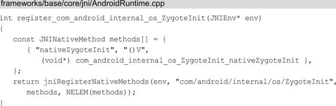
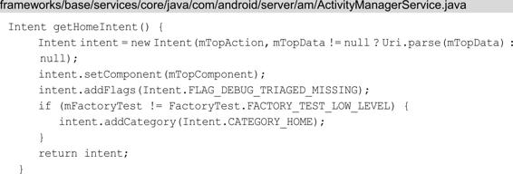

Android 系统启动时都干了什么（Android 是如何从开机到 Launcher 启动的过程）


### 一、计算机是如何启动的

在聊本文的主题之前，先要熟悉一些概念：

计算机的硬件包括：CPU，内存，硬盘，显卡，显示器，键盘鼠标等输入输出设备。

所有的软件（比如：操作系统）都存放在硬盘上。程序执行时需要将程序从硬盘上读取到内存中，然后再加载到CPU中运行。

当我们按下开机键时，此时内存中什么都没有，因此需要借助某种方式，将操作系统加载到内存中，完成这项任务的是**BIOS**。

- 引导阶段

BIOS（Basic Input/Output System  基本输入输出系统）：一般是主板芯片上的一个程序，计算机通电后，第一件事就是读取它。

BIOS程序首先会检查计算机硬件能否满足运行的基本条件，这叫做“**硬件自检**”（Power-On Self-Test）。如果硬件出现问题，主板会发出不同含义的蜂鸣，启动中止。如果没有问题，屏幕就会显示出CPU，内存，硬盘等信息。

硬件自检完成后，BIOS会把控制权转交给下一阶段的启动程序。这时BIOS需要知道，下一阶段的启动程序存放在哪一个设备中。也就是说BIOS需要有一个外部存储设备的排序，排在前面的设备就是优先转交控制权的设备。这种排序叫做**启动排序**，也就是我们平时进入BIOS界面时能看到的Boot Sequence。

如果我们没有进行特殊操作的话，那么BIOS就会按照这个启动顺序将控制权交给下一个存储设备。我们在使用U盘、光盘等装系统时就是在这里将启动顺序改变了，将本来要交给硬盘的控制权交给了U盘或者光盘。

第一个存储设备被激活后，计算机读取该设备的第一个扇区，也就是读取最前面的512个字节。如果这512个字节的最后两个字节是0x55和0xAA，表明这个设备可以用于启动；如果不是，表明设备不能用于启动，控制权于是被交给“启动顺序”中的下一个设备。

这最前面的512个字节，就叫做“主引导记录”（Master boot record，MBR）。MBR是位于磁盘最前面的一段引导代码。它负责磁盘操作系统对磁盘进行读写时分区合法性的判别、分区引导信息的定位，它由磁盘操作系统在对硬盘进行初始化时产生。硬盘的主引导记录MBR是不属于任何一个操作系统的，它先于操作系统调入内存，并发挥作用，然后将控制权转交给主分区内的操作系统，并由主分区信息表来管理硬盘。

MBR只有512字节，放不下太多东西。它的主要作用是告诉计算机到硬盘的哪一个位置去找操作系统。我们找到可用的MBR后，计算机从MBR中读取前面的446个字节的机器码后，不再把控制权转交给某一个分区，而是运行事先安装的“启动管理器”（Boot loader），由用户选择启动哪一个操作系统。

- 加载内核阶段

选择完操作系统后，控制权转交给操作系统，操作系统的内核首先被载入内存。

以 Linux 系统为例，先载入 /boot 目录下面的 kernel。内核加载成功后，第一个运行的程序是 /sbin/init。它根据配置文件（Debian 系统是 /etc/initab ）产生 init 进程。这是 Linux 启动后的第一个进程，pid 进程编号为 1，其他进程都是它的后代。

然后，init 线程加载系统的各个模块，比如：窗口程序和网络程序，直至执行 /bin/login 程序，跳出登录界面，等待用户输入用户名和密码。

至此，全部启动过程完成。

### 二、Android手机的启动过程

#### 1、引导阶段、加载内核阶段

Android 系统虽然也是基于 Linux 系统的，但是由于 Android 属于嵌入式设备，并没有像 PC 那样的 BIOS 程序。 取而代之的是 Bootloader —— 系统启动加载器。它类似于 BIOS，在系统加载前，用以初始化硬件设备，建立内存空间的映像图，为最终调用系统内核准备好环境。在 Android 里没有硬盘，而是 ROM，它类似于硬盘存放操作系统，用户程序等。ROM 跟硬盘一样也会划分为不同的区域，用于放置不同的程序，在 Android 中主要划分为以下几个分区：

- /boot：存放引导程序，包括内核和内存操作程序
- /system：相当于电脑c盘，存放Android系统及系统应用
- /recovery：恢复分区，可以进入该分区进行系统恢复
- /data：用户数据区，包含了用户的数据：联系人、短信、设置、用户安装的程序
- /cache：安卓系统缓存区，保存系统最常访问的数据和应用程序
- /misc：包含一些杂项内容，如系统设置和系统功能启用禁用设置
- /sdcard：用户自己的存储区，可以存放照片，音乐，视频等文件


那么 Bootloader 是如何被加载的呢？跟 PC 启动过程类似，当开机通电时首先会加载 Bootloader，Bootloader 会读取 ROM 找到操作系统并将 Linux 内核加载到 RAM 中。

当 Linux 内核启动后会初始化各种软硬件环境，加载驱动程序，挂载根文件系统，Linux 内核加载的最后阶段会启动执行第一个用户空间进程 init 进程。

此阶段从通电开机后引导到加载Kernel内核后启动init进程。

#### 2、init进程


init 是 Linux 系统中用户空间的第一个进程(pid=1)，Kernel 启动后会调用 /system/core/init/Init.cpp 的 main() 方法。

- Init.main()

首先初始化 Kernel log，创建一块共享的内存空间，加载 /default.prop 文件，解析 init.rc 文件。

##### 2.1、init.rc文件

init.rc 文件是 Android 系统的重要配置文件，位于 /system/core/rootdir/ 目录中。 主要功能是定义了系统启动时需要执行的一系列 action 及执行特定动作、设置环境变量和属性和执行特定的 service。

init.rc 脚本文件配置了一些重要的服务，init 进程通过创建子进程启动这些服务，这里创建的 service 都属于 native 服务，运行在 Linux 空间，通过 socket 向上层提供特定的服务，并以守护进程的方式运行在后台。

通过 init.rc 脚本系统启动了以下几个重要的服务：

- service_manager：启动 binder IPC，管理所有的 Android 系统服务
- mountd：设备安装 Daemon，负责设备安装及状态通知
- debuggerd：启动 debug system，处理调试进程的请求
- rild：启动 radio interface layer daemon 服务，处理电话相关的事件和请求
- media_server：启动 AudioFlinger，MediaPlayerService 和 CameraService，负责多媒体播放相关的功能，包括音视频解码
- surface_flinger：启动 SurfaceFlinger 负责显示输出
- zygote：进程孵化器，启动 Android Java VMRuntime 和启动 system_server，负责 Android 应用进程的孵化工作

在这个阶段你可以在设备的屏幕上看到 “Android” logo 了。

以上工作执行完，init 进程就会进入 loop 状态。

#### 3、service_manager 进程

ServiceManager 是 Binder IPC 通信过程中的守护进程，本身也是一个 Binder 服务。ServiceManager 进程主要是启动 Binder，提供服务的查询和注册。

具体过程详见 Binder：[Android Binder 进程间通讯](https://github.com/jeanboydev/Android-ReadTheFuckingSourceCode/blob/master/android/Android-Binder进程间通讯.md)

#### 4、surface_flinger 进程

SurfaceFlinger 负责图像绘制，是应用 UI 的核心，其功能是合成所有 Surface 并渲染到显示设备。SurfaceFlinger 进程主要是启动 FrameBuffer，初始化显示系统。

#### 5、media_server 进程

MediaServer 进程主要是启动 AudioFlinger 音频服务，CameraService 相机服务。负责处理音频解析播放，相机相关的处理。

#### 6、Zygote 进程

fork 创建进程过程：

Zygote 进程孵化了所有的 Android 应用进程，是 Android Framework 的基础，该进程的启动也标志着 Framework 框架初始化启动的开始。

Zygote 服务进程的主要功能：

- 注册底层功能的 JNI 函数到虚拟机
- 预加载 Java 类和资源
- fork 并启动 system_server 核心进程
- 作为守护进程监听处理“孵化新进程”的请求

当 Zygote 进程启动后, 便会执行到 frameworks/base/cmds/app_process/App_main.cpp 文件的 main() 方法。

```
App_main.main() //设置进程名，并启动 AppRuntime。
AndroidRuntime::start() //创建 Java 虚拟机，注册 JNI 方法，调用 ZygoteInit.main() 方法。
ZygoteInit.main()   //为 Zygote 注册 socket，预加载类和资源，启动 system_server 进程。
```

然后 Zygote 进程会进入 loop 状态，等待下次 fork 进程。

##### 6.1 system_server 进程

system_server 进程 由 Zygote 进程 fork 而来。接下来看下 system_server 启动过程。

```
//首先会调用 ZygoteInit.startSystemServer() 方法
ZygoteInit.startSystemServer()  
//fork 子进程 system_server，进入 system_server 进程。

ZygoteInit.handleSystemServerProcess()  
//设置当前进程名为“system_server”，创建 PathClassLoader 类加载器。

RuntimeInit.zygoteInit()    
//重定向 log 输出，通用的初始化（设置默认异常捕捉方法，时区等），初始化 Zygote -> nativeZygoteInit()。

nativeZygoteInit()  
//方法经过层层调用，会进入 app_main.cpp 中的 onZygoteInit() 方法。

app_main::onZygoteInit()// 启动新 Binder 线程。

applicationInit()   
//方法经过层层调用，会抛出异常 ZygoteInit.MethodAndArgsCaller(m, argv), ZygoteInit.main() 会捕捉该异常。

ZygoteInit.main()   
//开启 DDMS 功能，preload() 加载资源，预加载 OpenGL，调用 SystemServer.main() 方法。

SystemServer.main() 
//先初始化 SystemServer 对象，再调用对象的 run() 方法。

SystemServer.run()  
//准备主线程 looper，加载 android_servers.so 库，该库包含的源码在 frameworks/base/services/ 目录下。
```

system_server 进程启动后将初始化系统上下文（设置主题），创建系统服务管理 SystemServiceManager，然后启动各种系统服务：

```
startBootstrapServices(); // 启动引导服务
//该方法主要启动服务 ActivityManagerService，PowerManagerService，LightsService，DisplayManagerService，PackageManagerService，UserManagerService。
//设置 ActivityManagerService，启动传感器服务。

startCoreServices();      // 启动核心服务
//该方法主要
//启动服务 BatteryService 用于统计电池电量，需要 LightService。
//启动服务 UsageStatsService，用于统计应用使用情况。
//启动服务 WebViewUpdateService。

startOtherServices();     // 启动其他服务
//该方法主要启动服务 InputManagerService，WindowManagerService。
//等待 ServiceManager，SurfaceFlinger启动完成，然后显示启动界面。
//启动服务 StatusBarManagerService，
//准备好 window, power, package, display 服务：
//	- WindowManagerService.systemReady()
//	- PowerManagerService.systemReady()
//	- PackageManagerService.systemReady()
//	- DisplayManagerService.systemReady()
```

所有的服务启动完成后会注册到 ServiceManager。
ActivityManagerService 服务启动完成后，会进入 ActivityManagerService.systemReady()，然后启动 SystemUI，WebViewFactory，Watchdog，最后启动桌面 Launcher App。

最后会进入循环 Looper.loop()。

**ActivityManagerService 启动**

启动桌面 Launcher App 需要等待 ActivityManagerService 启动完成。我们来看下 ActivityManagerService 启动过程。

```
ActivityManagerService(Context) 
//创建名为“ActivityManager”的前台线程，并获取mHandler。
//通过 UiThread 类，创建名为“android.ui”的线程。
//创建前台广播和后台广播接收器。
//创建目录 /data/system。
//创建服务 BatteryStatsService。

ActivityManagerService.start()  //启动电池统计服务，创建 LocalService，并添加到 LocalServices。

ActivityManagerService.startOtherServices() -> installSystemProviders()
//安装所有的系统 Provider。

ActivityManagerService.systemReady()
//恢复最近任务栏的 task。
//启动 WebView，SystemUI，开启 Watchdog，启动桌面 Launcher App。
//发送系统广播。
```

启动桌面 Launcher App，首先会通过 Zygote 进程 fork 一个新进程作为 App 进程，然后创建 Application，创建启动 Activity，最后用户才会看到桌面。

### 三、完整启动过程


# Android系统启动流程

作为本书的第2章，可能你会觉得诧异，为何在书的开始就要介绍Android系统启动呢？这里有必要说明一下，Android系统启动与本书后续很多内容都有关联，比如应用进程启动流程、四大组件原理、AMS、ClassLoader等，而ClassLoader又是热修复和插件化的基础，可见 Android 系统启动是十分重要并且需要首先学习的知识点，这里也建议大家先阅读完本章的内容后再去阅读后面的章节。本章简要介绍Android 系统启动的流程，不会拘泥于源码细节，旨在让读者了解大概的流程。另外，需要提醒大家注意的一点是，阅读本章需要有一定的C/C++基础。

# 2.1 init进程

启动过程init进程是Android系统中用户空间的第一个进程，进程号为1，是Android系统启动流程中一个关键的步骤，作为第一个进程，它被赋予了很多极其重要的工作职责，比如创建 Zygote（孵化器）和属性服务等。init 进程是由多个源文件共同组成的，这些文件位于源码目录system/core/init中。

# 2.1.1 引入init进程

为了讲解init进程，首先要了解Android系统启动流程的前几步，以引入init进程。

1.启动电源以及系统启动

当电源按下时引导芯片代码从预定义的地方（固化在ROM）开始执行。加载引导程序BootLoader到RAM中，然后执行。

2.引导程序BootLoader

引导程序BootLoader是在Android操作系统开始运行前的一个小程序，它的主要作用是把系统OS拉起来并运行。

3.Linux内核启动当内核启动时，设置缓存、被保护存储器、计划列表、加载驱动。在内核完成系统设置后，它首先在系统文件中寻找init.rc文件，并启动init进程。

4.init进程启动

init进程做的工作比较多，主要用来初始化和启动属性服务，也用来启动Zygote进程。从上面的步骤可以看出，当我们按下启动电源时，系统启动后会加载引导程序，引导程序又启动Linux 内核，在Linux 内核加载完成后，第一件事就是要启动init 进程。关于Android系统启动的完整流程会在本章的2.5节进行讲解，这一节的任务就是先了解init进程的启动过程。

## 2.1.2 init进程的入口函数

在Linux内核加载完成后，它首先在系统文件中寻找init.rc文件，并启动init进程，然后查看init进程的入口函数main，代码如下所示：


init的main函数做了很多事情，比较复杂，我们只需关注主要的几点就可以了。在开始的时候创建和挂载启动所需的文件目录，其中挂载了tmpfs、devpts、proc、sysfs和selinuxfs共5种文件系统，这些都是系统运行时目录，顾名思义，只在系统运行时才会存在，系统停止时会消失。

在注释 1 处调用 property_init 函数来对属性进行初始化，并在注释 3 处调用start_property_service 函数启动属性服务，关于属性服务，后面会讲到。在注释 2 处调用signal_handler_init 函数用 于 设 置 子 进 程 信 号 处 理 函 数 ， 它 被 定 义 在system/core/init/signal_handler.cpp中，主要用于防止init进程的子进程成为僵尸进程，为了防止僵尸进程的出现，系统会在子进程暂停和终止的时候发出SIGCHLD信号，而signal_handler_init函数就是用来接收SIGCHLD信号的（其内部只处理进程终止的SIGCHLD信号）。

假设init进程的子进程Zygote终止了，signal_handler_init函数内部会调用handle_signal函数，经过层层的函数调用和处理，最终会找到 Zygote 进程并移除所有的 Zygote 进程的信息，再重启Zygote服务的启动脚本（比如init.zygote64.rc）中带有onrestart选项的服务，关于init.zygote64.rc后面会讲到，至于Zygote进程本身会在注释5处被重启。这里只是拿Zygote进程举个例子，其他init进程子进程的原理也是类似的。

注 释 4 处 用 来 解 析 init.rc 文 件 ， 解 析 init.rc 的 文 件 为system/core/init/init_parse.cpp文件，接下来我们查看init.rc里做了什么。

## 僵尸进程与危害

在UNIX/Linux中，父进程使用fork创建子进程，在子进程终止之后，如果父进程并不知道子进程已经终止了，这时子进程虽然已经退出了，但是在系统进程表中还为它保留了一定的信息（比如进程号、退出状态、运行时间等），这个子进程就被称作僵尸进程。系统进程表是一项有限资源，如果系统进程表被僵尸进程耗尽的话，系统就可能无法创建新的进程了。

## 2.1.3 解析init.rc

init.rc是一个非常重要的配置文件，它是由Android初始化语言（Android Init Language）编写的脚本，这种语言主要包含5种类型语句：Action、Command、Service、Option和Import。init.rc的配置代码如下所示：


这里只截取了一部分代码。on init和on boot是Action类型语句，它的格式如下所示：


为了分析如何创建Zygote，我们主要查看Service类型语句，它的格式如下所示：


需要注意的是，在Android 8.0中对init.rc文件进行了拆分，每个服务对应一个rc文件。我们要分析的 Zygote 启动脚本则在init.zygoteXX.rc 中 定 义 ， 这 里 拿 64 位 处 理 器 为 例 ，init.zygote64.rc的代码如下所示：


根据 Service 类型语句的格式我们来大概分析上面代码的意思。Service 用于通知 init进程创建名为 zygote 的进程，这个进程执行程序的路径为/system/bin/app_process64①，其后面的代码是要传给app_process64 的 参 数 。 class main 指 的 是 Zygote 的 classname 为main②，后面会用到它。关于Zygote启动脚本会在本章的2.2.2节进行详细介绍。（此处标注的①、②，后续内容会引用到。）

## 2.1.4 解析Service类型语句

init.rc中的Action类型语句和Service类型语句都有相应的类来进行解析，Action类型语句采用 ActionParser 来进行解析，Service类型语句采用 ServiceParser 来进行解析，这里因为主要分析Zygote，所以只介绍 ServiceParser。ServiceParser 的实现代码在system/core/init/service.cpp 中 ， 接 下 来 我 们 来 查 看ServiceParser 是如何解析上面提到的Service类型语句的，会用到两个函数：一个是ParseSection，它会解析Service的rc文件，比如上文讲到的init.zygote64.rc，ParseSection函数主要用来搭建Service的架子；另一个是ParseLineSection，用于解析子项。代码如下所示：


注释1处，根据参数，构造出一个Service对象，它的classname为default。在解析完所有数据后，会调用EndSection函数：


EndSection函数中会调用ServiceManager的AddService函数，接着查看AddService函数做了什么：


注释1处的代码将Service对象加入Service链表中。上面的Service解析过程总体来讲就是根据参数创建出Service对象，然后根据选项域的内容填充Service对象，最后将Service对象加入vector类型的Service链表中。

## 2.1.5 init启动Zygote

讲完了解析Service，接下来该讲init是如何启动Service的，在这里主要讲解启动Zygote这个Service。在Zygote 的启动脚本中，我们可知Zygote 的classname 为main。在init.rc中有如下配置代码：


其 中 class_start 是 一 个 COMMAND ， 对 应 的 函 数 为do_class_start。注释1处启动那些classname 为 main 的Service，从2.1.3 节末段的标注②处，我们知道Zygote 的classname就是main，因此class_start main是用来启动Zygote的。do_class_start函数在builtins.cpp中定义，如下所示：


ForEachServiceInClass函数会遍历Service链表，找到classname为main的Zygote，并执行StartIfNotDisabled函数，如下所示：


注释1处，如果Service没有在其对应的rc文件中设置disabled选项 ， 则 会 调 用 Start 函 数 启 动 该 Service ， Zygote 对 应 的init.zygote64.rc中并没有设置disabled选项，因此我们接着来查看Start函数，如下所示：


首先判断Service是否已经运行，如果运行则不再启动，直接返回false。如果程序走到注释1处，说明子进程还没有被启动，就调用fork函数创建子进程，并返回pid值，注释2处如果pid值为0，则说明当前代码逻辑在子进程中运行。注释3处在子进程中调用execve函数，Service子进程就会被启动，并进入该Service的main函数中，如果该Service是Zygote，从 2.1.3 节末段的标注①处我们可知 Zygote 执行 程 序 的 路 径 为 /system/bin/app_process64 ， 对 应 的 文 件 为app_main.cpp，这样就会进入app_main.cpp的main函数中，也就是在Zygote的main函数中，代码如下：


从注释1处的代码可以得知调用runtime的start函数启动Zygote，至此Zygote就启动了。

## 2.1.6 属性服务

Windows 平台上有一个注册表管理器，注册表的内容采用键值对的形式来记录用户、软件的一些使用信息。即使系统或者软件重启，其还是能够根据之前注册表中的记录，进行相应的初始化工作。Android也提供了一个类似的机制，叫作属性服务。

init进程启动时会启动属性服务，并为其分配内存，用来存储这些属性，如果需要这些属性直接读取就可以了，在2.1.2节的开头部分，我们提到在init.cpp的main函数中与属性服务相关的代码有以下两行：


这两行代码用来初始化属性服务配置并启动属性服务。首先我们来学习属性服务配置的初始化和启动。

1.属性服务初始化与启动

property_init函数的具体实现代码如下所示：


__system_property_area_init函数用来初始化属性内存区域。接下来查看start_property_service函数的具体代码：



在注释1处创建非阻塞的Socket。在注释2处调用listen函数对property_set_fd进行监听，这样创建的Socket就成为server，也就是属性服务；listen函数的第二个参数设置为8，意味着属性服务最多可以同时为 8 个试图设置属性的用户提供服务。注释 3 处的代码将property_set_fd放入了epoll中，用epoll来监听property_set_fd：当 property_set_fd 中 有 数 据 到 来 时 ， init 进 程 将 调 用handle_property_set_fd函数进行处理。

在Linux新的内核中，epoll用来替换seleect，epoll是Linux内核为处理大批量文件描述符而做了改进的poll，是Linux下多路复用I/O接口select/poll的增强版本，它能显著提高程序在大量并发连接中只有少量活跃的情况下的系统 CPU 利用率。epoll 内部用于保存事件的数据类型是红黑树，查找速度快，select采用的数组保存信息，查找速度很慢，只有当等待少量文件描述符时，epoll和select的效率才会差不多。

2.服务处理客户端请求

从上面我们得知，属性服务接收到客户端的请求时，会调用handle_property_set_fd函数进行处理：


Android 7.0中只用handle_property_set_fd函数来处理客户端请求，Android 8.0的源码中则增加了注释1处的handle_property_set函数做进一步封装处理，如下所示：


系统属性分为两种类型：一种是普通属性；还有一种是控制属性，控制属性用来执行一些命令，比如开机的动画就使用了这种属性。因此，handle_property_set函数分为了两个处理分支，一部分处理控制属性，另一部分用于处理普通属性，这里只分析处理普通属性。如果注释1处的属性名称以“ctl.”开头，就说明是控制属性，如果客户端权限满足，则会调用handle_control_message函数来修改控制属性。如果是普通属性，则会在客户端权限满足的条件下调用注释3处的property_set函数来对普通属性进行修改，如下所示：


property_set函数主要对普通属性进行修改，首先要判断该属性是否合法，如果合法就在注释1处从属性存储控件中查找该属性，如果属性存在，就更新属性值，否则就添加该属性。另外，还对名称以“ro”“persist”开头的属性进行了相应的处理。

## 2.1.7 init进程启动总结

init进程启动做了很多的工作，总的来说主要做了以下三件事：（1）创建和挂载启动所需的文件目录。

（2）初始化和启动属性服务。

（3）解析init.rc配置文件并启动Zygote进程。

# 2.2 Zygote进程启动过程

在2.1节中我们学习了init进程启动过程，在启动过程中主要做了三件事，其中一件就是创建了Zygote 进程，本节接着学习Zygote 进程启动过程，首先我们要了解Zygote是什么。

## 2.2.1 Zygote概述

在Android系统中，DVM（Dalvik虚拟机）和ART、应用程序进程以及运行系统的关键服务的SystemServer进程都是由Zygote进程来创建的，我们也将它称为孵化器。它通过fock（复制进程）的形式来创建应用程序进程和SystemServer进程，由于Zygote进程在启动时会创建DVM或者ART，因此通过fock而创建的应用程序进程和SystemServer进程可以在内部获取一个DVM或者ART的实例副本。

我们已经知道Zygote进程是在init进程启动时创建的，起初Zygote进程的名称并不是叫“zygote”，而是叫“app_process”，这个名称是在Android.mk中定义的，Zygote进程启动后，Linux系统下的pctrl系统会调用app_process，将其名称换成了“zygote”。

## 2.2.2 Zygote启动脚本

在init.rc文件中采用了Import类型语句来引入Zygote启动脚本，这些启动脚本都是由Android初始化语言（Android Init Language）来编写的：


可以看出init.rc不会直接引入一个固定的文件，而是根据属性ro.zygote的内容来引入不同的文件。从Android 5.0开始，Android开始支持64位程序，Zygote也就有了32位和64位的区别，所以在这里用ro.zygote属性来控制使用不同的Zygote启动脚本，从而也就启动了不同版本的Zygote进程，ro.zygote属性的取值有以下4种：

· init.zygote32.rc

· init.zygote32_64.rc

· init.zygote64.rc

· init.zygote64_32.rc

这些Zygote 启动脚本都放在system/core/rootdir 目录中，为了更好地分析这些Zygote启动脚本，我们先来回顾一下2.1.3节所提到的Android初始化语言的Service类型语句，它的格式如下所示：


了解了Service类型语句的格式，下面分别介绍这些Zygote启动脚本。

1.init.zygote32.rc

表示支持纯32位程序，init.zygote32.rc文件内容如下所示：


根据 Service 类型语句的格式，可以得知 Zygote 进程名称为zygote ， 执 行 程 序 为 app_process ， classname 为 main ， 如 果audioserver、cameraserver、media等进程终止了，就需要进行restart（重启）。

2.init.zygote32_64.rc

表示既支持32位程序也支持64位程序，init.zygote32_64.rc文件的内容如下所示：


脚本中有两个Service类型语句，说明会启动两个Zygote进程，一个名称为zygote，执行程序为 app_process32，作为主模式；另一个名称为 zygote_secondary，执行程序为app_process64，作为辅模式。剩余的init.zygote64.rc和init.zygote64_32.rc与上面讲到的Zygote启动脚本类似，这里就不再赘述了，我们在2.1.3节分析的Zygote启动脚本就是支持64位程序的init.zygote64.rc。

## 2.2.3 Zygote进程启动过程介绍

从 2.1.5 节 中 可 知 init 启 动 Zygote 时 主 要 是 调 用app_main.cpp 的 main 函数中 的 AppRuntime的start方法 来启动Zygote进程的，我们就先从app_main.cpp的main函数开始分析，Zygote进程启动过程的时序图如图2-1所示。


图2-1 Zygote进程启动过程的时序图

Zygote 进程都是通过fock 自身来创建子进程的，这样Zygote 进程以及它的子进程都可以进入app_main.cpp的main函数，因此main函数中为了区分当前运行在哪个进程，会在注释1处判断参数arg中是否包含了“--zygote”，如果包含了则说明main函数是运行在Zygote进程中的并在注释2处将zygote设置为ture。同理在注释3处判断参数arg中是否包含了“--start-system-server”，如果包含了则说明main函数是运行在SystemServer进程中的并在注释4处将startSystemServer设置为true。

在注释5处，如果zygote为true，就说明当前运行在Zygote进程中，就会调用注释6处的AppRuntime的start函数，如下所示：


在注释1处调用startVm函数来创建Java虚拟机，在注释2处调用startReg函数为Java虚拟机注册JNI方法。注释3处的className的值是传进来的参数，它的值为com.android.internal.os.ZygoteInit。在注释4处通过toSlashClassName函数，将className的“.”替换为“/”，替换后的值为 com/android/internal/os/ZygoteInit，并赋值给 slashClassName，接着在注释5处根据slashClassName找到ZygoteInit ， 找 到 了 ZygoteInit 后 顺 理 成 章 地 在 注 释 6 处 找 到ZygoteInit的main方法。最终会在注释7处通过JNI调用ZygoteInit的main方法。这里为何要使用JNI呢？因为ZygoteInit的main方法是由Java语言编写的，当前的运行逻辑在Native中，这就需要通过JNI来调用Java。这样Zygote就从Native层进入了Java框架层。

在我们通过JNI调用ZygoteInit的main方法后，Zygote便进入了Java框架层，此前是没有任何代码进入Java框架层的，换句话说是Zygote开创了Java框架层。该main方法代码如下：


在 注 释 1 处 通 过 registerServerSocket 方 法 来 创 建 一 个Server 端的 Socket，这个 name为“zygote”的Socket用于等待ActivityManagerService请求Zygote来创建新的应用程序进程，关于AMS 将在第 6 章进行介绍。在注释 2 处预加载类和资源。在注释 3处启动SystemServer进程，这样系统的服务也会由SystemServer进程启动起来。在注释4处调用ZygoteServer的runSelectLoop方法来等待AMS请求创建新的应用程序进程。由此得知，ZygoteInit的main方法主要做了4件事：

（1）创建一个Server端的Socket。

（2）预加载类和资源。

（3）启动SystemServer进程。

（4）等待AMS请求创建新的应用程序进程。其中第二件事预加载类和资源这里不做介绍，有兴趣的读者可以查看源码，这里会对其他的主要事件进行分析。

1.registerZygoteSocket

首先我们来查看ZygoteServer的registerZygoteSocket方法做了什么，如下所示：


在注释1处拼接Socket的名称，其中ANDROID_SOCKET_PREFIX的值为 “ANDROID_SOCKET_” ， socketName 的 值 是 传 进 来 的 值 ， 等 于“zygote” ， 因 此 fullSocketName 的 值 为“ANDROID_SOCKET_zygote”。在注释2处将fullSocketName转换为环境变量的值，再在注释3处转换为文件描述符的参数。在注释4处创建文件描述符，并在注释5处传入此前转换的文件操作符参数。在注释6处创建LocalServerSocket，也就是服务器端的Socket，并将文件操作符作为参数传进去。在Zygote进程将SystemServer进程启动后，就会在这个服务器端的Socket上等待AMS请求Zygote进程来创建新的应用程序进程。

2.启动SystemServer进程

接下来查看startSystemServer函数，代码如下所示：


注释1处的代码用来创建args数组，这个数组用来保存启动SystemServer的启动参数，其中可以看出 SystemServer 进程的用户id 和用户组 id 被设置为 1000，并且拥有用户组1001～1010、1018、1021、1032、3001～3010的权限；进程名为system_server；启动的类名为com.android.server.SystemServer。在注释2处将args数组封装成Arguments对象并供注释3处的forkSystemServer函数调用。在注 释3处调用Zygote的 forkSystemServer 方法，其 内部 会调用nativeForkSystemServer 这 个 Native 方 法 ，nativeForkSystemServer方法最终会通过 fork 函数在当前进程创建一个子进程，也就是 SystemServer 进程，如果forkSystemServer方法返回的pid的值为0，就表示当前的代码运行在新创建的子进程中，则执行注释4处的handleSystemServerProcess来处理SystemServer进程，关于SystemServer进程启动会在2.3节进行介绍。

3.runSelectLoop

启动SystemServer进程后，会执行ZygoteServer的runSelectLoop方法，如下所示：


注释 1 处的 mServerSocket 就是我们在 registerZygoteSocket函 数 中 创 建 的 服 务 器 端 Socket ， 调 用mServerSocket.getFileDescriptor（）函数用来获得该Socket的fd字段的值并添加到fd列表fds中。接下来无限循环用来等待AMS请求Zygote进程创建新的应用程序进程。在注释2处通过遍历将fds存储的信息转移到pollFds数组中。在注释3处对pollFds进行遍历，如果i==0，说明服务器端 Socket 与客户端连接上了，换句话说就是，当前 Zygote进程与AMS建立了连接。在注释4处通过acceptCommandPeer方法得到ZygoteConnection类并添加到Socket连接列表peers中，接着将该ZygoteConnection的fd添加到fd列表fds中，以便可以接收到AMS发送过来的请求。如果i的值不等于0，则说明AMS向Zygote进程发送了一个创建应用进程的请求，则在注释5处调用ZygoteConnection的runOnce函数来创建一个新的应用程序进程，并在成功创建后将这个连接从Socket连接列表peers和fd列表fds中清除。

## 2.2.4 Zygote进程启动总结

Zygote进程启动共做了如下几件事：

（1）创建AppRuntime并调用其start方法，启动Zygote进程。

（2）创建Java虚拟机并为Java虚拟机注册JNI方法。

（3）通过JNI调用ZygoteInit的main函数进入Zygote的Java框架层。

（4）通过registerZygoteSocket方法创建服务器端Socket，并通过runSelectLoop方法等待AMS的请求来创建新的应用程序进程。

（5）启动SystemServer进程。

# 2.3 SystemServer

处理过程SystemServer进程主要用于创建系统服务，我们熟知的AMS、WMS和PMS都是由它来创建的，本书后面的章节会介绍AMS和WMS，因此掌握SystemServer进程是如何启动的，它在启动时做了哪些工作是十分必要的。

## 2.3.1 Zygote处理SystemServer进程

在2.2节中讲到了Zygote进程启动了SystemServer进程，本节来学习Zygote是如何处理SystemServer进程的，时序图如图2-2所示。


图2-2 Zygote处理SystemServer进程的时序图在 ZygoteInit.java 的 startSystemServer 方 法 中 启 动 了SystemServer进程，如下所示：




SystemServer 进程复制了 Zygote 进程的地址空间，因此也会得到 Zygote 进程创建的Socket，这个Socket对于SystemServer进程没有用处，因此，需要注释1处的代码来关闭该Socket，接着在注释2处调 用 handleSystemServerProcess 方 法 来 启 动 SystemServer 进 程 。handleSystemServerProcess方法的代码如下所示：


在注释1处创建了PathClassLoader，关于PathClassLoader将在第12章进行介绍。在注释2处调用了ZygoteInit的zygoteInit方法，代码如下所示：


在注释1处调用nativeZygoteInit方法，一看方法的名称就知道调用的是Native层的代码，用来启动Binder线程池，这样SystemServer进程就可以使用Binder与其他进程进行通信了。注释2处是用于进入SystemServer的main方法，现在分别对注释1和注释2的内容进行介绍。

1.启动Binder线程池

nativeZygoteInit是一个Native方法，因此我们先要了解它对应的JNI文件，不了解JNI的可以查看第9章内容，如下所示：



通过 JNI 的 gMethods 数组，可以看出 nativeZygoteInit 方法对 应 的 是 JNI 文 件 AndroidRuntime.cpp 的com_android_internal_os_ZygoteInit_nativeZygoteInit函数：


这里gCurRuntime是AndroidRuntime类型的指针，具体指向的是AndroidRuntime的子类AppRuntime，它在app_main.cpp中定义，我们接着来查看AppRuntime的onZygoteInit方法，代码如下所示：


注释1处的代码用来启动一个Binder线程池，这样SystemServer进程就可以使用Binder与其他进程进行通信了。看到这里我们知道RuntimeInit.java的nativeZygoteInit函数主要是用来启动Binder线程池的。

2.进入SystemServer的main方法

我 们 再 回 到 RuntimeInit.java 的 代 码 ， 在 注 释 2 处 调 用 了RuntimeInit的applicationInit方法，代码如下所示：


在applicationInit方法中主要调用了invokeStaticMain方法：


注 释 1 处 的 className 为com.android.server.SystemServer ， 通 过 反 射 返 回 的 cl 为SystemServer类。在注释2处找到SystemServer中的main方法。在注释3处将找到的main方法传入MethodAndArgsCaller异常中并抛出该异常，捕获MethodAndArgsCaller异常的代码在ZygoteInit.java的main方法中，这个main方法会调用SystemServer的main方法。那么为什么不直接在invokeStaticMain方法中调用SystemServer的main方法呢？原因是这种抛出异常的处理会清除所有的设置过程需要的堆栈帧，并让SystemServer的main方法看起来像是SystemServer进程的入口方法。在Zygote启动了SystemServer进程后，SystemServer进程已经做了很多的准备工作，而这些工作都是在SystemServer的main方法调用之 前 做 的 ， 这 使 得 SystemServer 的 main 方 法 看 起 来 不 像 是SystemServer进程的入口方法，而这种抛出异常交由ZygoteInit.java的 main 方 法 来 处 理 ， 会 让 SystemServer 的 main 方 法 看 起 来 像 是SystemServer进程的入口方法。

下 面 来 查 看 在 ZygoteInit.java 的 main 方 法 中 是 如 何 捕 获MethodAndArgsCaller异常的：


当 捕 获 到 MethodAndArgsCaller 异 常 时 就 会 在 注 释 1 处 调 用MethodAndArgsCaller 的 run 方 法 ， MethodAndArgsCaller 是Zygote.java的静态内部类：


注释1处的mMethod指的就是SystemServer的main方法，调用了mMethod的invoke方法后，SystemServer 的 main 方法就会被动态调用，SystemServer 进程就进入了SystemServer的main方法中。

## 2.3.2 解析SystemServer进程

下面来查看SystemServer的main方法：


main方法中只调用了SystemServer的run方法，如下所示：


在注释 1 处加载了动态库 libandroid_servers.so。接下来在注释 2 处创建SystemServiceManager，它会对系统服务进行创建、启动和生命周期管理。在注释 3 处的startBootstrapServices 方法中用SystemServiceManager 启 动 了 ActivityManagerService 、PowerManagerService、PackageManagerService等服务。在注释4处的startCoreServices 方 法 中 则 启 动 了 DropBoxManagerService 、BatteryService、UsageStatsService和WebViewUpdateService。在注释 5 处的 startOtherServices 方法中启动了 CameraService、AlarmManagerService、VrManagerService等服务。这些服务的父类均为SystemService。从注释3、4、5的方法中可以看出，官方把系统服务分为了三种类型，分别是引导服务、核心服务和其他服务，其中其他服务是一些非紧要和不需要立即启动的服务。这些系统服务总共有100多个，表2-1列出部分系统服务及其作用。


表2-1 部分系统服务及其作用

这 些 系 统 服 务 启 动 逻 辑 是 相 似 的 ， 这 里 以 启 动PowerManagerService来进行举例，代码如下所示：


SystemServiceManager 的 startService 方 法 启 动 了PowerManagerService，startService方法如下所示：


在注释1处将PowerManagerService添加到mServices中，其中mServices是一个存储SystemService类型的ArrayList，这样就完成了PowerManagerService 的 注 册 工 作 。 在 注 释 2 处 调 用PowerManagerService的onStart函数完成启动PowerManagerService。

除了用mSystemServiceManager的startService函数来启动系统服务 外 ， 也 可 以 通 过 如 下 形 式 来 启 动 系 统 服 务 ， 以PackageManagerService为例：


直接调用了PackageManagerService的main方法：


在注释1 处直接创建PackageManagerService 并在注释2 处将PackageManagerService注册到ServiceManager中，ServiceManager用来管理系统中的各种Service，用于系统C/S架构中的Binder通信机制：Client端要使用某个Service，则需要先到ServiceManager查询Service的相关信息，然后根据Service的相关信息与Service所在的Server进程建立通信通路，这样Client端就可以使用Service了。

## 2.3.3 SystemServer进程总结

SystemServer进程被创建后，主要做了如下工作：

（1）启动Binder线程池，这样就可以与其他进程进行通信。

（2）创建SystemServiceManager，其用于对系统的服务进行创建、启动和生命周期管理。

（3）启动各种系统服务。

# 2.4 Launcher启动过程

此前已经学习了Android系统启动流程的init进程、Zygote进程和SystemServer进程，最后我们来学习 Launcher的启动过程。

## 2.4.1 Launcher概述

系统启动的最后一步是启动一个应用程序用来显示系统中已经安装的应用程序，这个应用程序就叫作Launcher。Launcher在启动过程中会请求PackageManagerService返回系统中已经安装的应用程序的信息，并将这些信息封装成一个快捷图标列表显示在系统屏幕上，这样用户可以通过点击这些快捷图标来启动相应的应用程序。通俗来讲Launcher就是Android系统的桌面，它的作用主要有以下两点：

（1）作为Android系统的启动器，用于启动应用程序。

（2）作为Android系统的桌面，用于显示和管理应用程序的快捷图标或者其他桌面组件。

## 2.4.2 Launcher启动过程介绍

SystemServer 进 程 在 启 动 的 过 程 中 会 启 动PackageManagerService，PackageManagerService启动后会将系统中的应用程序安装完成。在此前已经启动的AMS会将Launcher启动起来。Launcher启动过程的时序图如图2-3所示。


图2-3 Launcher启动过程时序图

启动 Launcher 的入口为 AMS 的 systemReady 方法，它在SystemServer 的startOtherServices方法中被调用，如下所示：


与Android 7.1.2源码不同的是，Android 8.0的部分源码引入了Java Lambda表达式，比如注释1处。下面来查看AMS的systemReady方法做了什么：


systemReady 方 法 中 调 用 了 ActivityStackSupervisor 的resumeFocusedStackTopActivityLocked方法：


在 注 释 1 处 调 用 ActivityStack 的resumeTopActivityUncheckedLocked方法，ActivityStack对象是用来描述Activity堆栈的，resumeTopActivityUncheckedLocked方法如下所示：


在注释1处调用了resumeTopActivityInnerLocked方法，如下所示：


resumeTopActivityInnerLocked方法的代码很长，在此仅截取我们 要 分 析 的 关 键 的 部 分 ， 调 用 ActivityStackSupervisor 的resumeHomeStackTask方法，代码如下所示：


在 resumeHomeStackTask 方 法 中 调 用 了 AMS 的startHomeActivityLocked方法，如下所示：


注释1处的mFactoryTest代表系统的运行模式，系统的运行模式分为三种，分别是非工厂模式、低级工厂模式和高级工厂模式，mTopAction 则用来描述第一个被启动 Activity组件的 Action，它的默认值为 Intent.ACTION_MAIN。因此注释 1 处的代码的意思就是mFactoryTest 为 FactoryTest.FACTORY_TEST_LOW_LEVEL （低级工厂模式）并且mTopAction等于null时，直接返回false。注释2处的getHomeIntent方法如下所示：



在 getHomeIntent 方 法 中 创 建 了 Intent ， 并 将 mTopAction 和mTopData传入。mTopAction的值为 Intent.ACTION_MAIN，并且如果系统运行模式不是低级工厂模式，则将 intent 的Category 设置为Intent.CATEGORY_HOME ， 最 后 返 回 该 Intent ， 再 回 到 AMS 的startHomeActivityLocked 方法，假设系统的运行模式不是低级工厂模式，在注释 3 处判断符合Action为Intent.ACTION_MAIN、Category为Intent.CATEGORY_HOME的应用程序是否已经启动，如果没启动则调用注释4处的方法启动该应用程序。这个被启动的应用程序就是Launcher，因为Launcher的AndroidManifest文件中的intent-filter标 签 匹 配 了 Action 为 Intent.ACTION_MAIN ， Category 为Intent.CATEGORY_HOME。

Launcher的AndroidManifest文件如下所示：


可 以 看 到 intent-filter 设 置 了android.intent.category.HOME 属 性 ， 这 样 名 称 为com.android.launcher3.Launcher 的 Activity 就 成 为 了 主Activity。从前面 AMS 的startHomeActivityLocked 方法的注释 4处，我们得知如果 Launcher 没有启动就会调用ActivityStarter的startHomeActivityLocked方法来启动Launcher，如下所示：


在注释1 处将Launcher 放入 HomeStack 中，HomeStack 是在ActivityStackSupervisor中定义的用于存储Launcher的变量。接着调用 startActivityLocked 方 法 来 启 动 Launcher ， 剩 余 的 过 程 会 和Activity 的启动过程类似，本书将在第 4 章介绍该知识点。最终进入Launcher的onCreate方法中，到这里Launcher就完成了启动。

## 2.4.3 Launcher中应用图标显示过程

Launcher 完成启动后会做很多的工作，作为桌面它会显示应用程序图标，这与应用程序开发有所关联，应用程序图标是用户进入应用程序的入口，因此我们有必要了解Launcher是如何显示应用程序图标的。

我们先从Launcher的onCreate方法入手，代码如下所示：


在注释1处获取LauncherAppState的实例，在注释2处调用它的setLauncher 方 法 并 将 Launcher 对 象 传 入 ， LauncherAppState 的setLauncher方法如下所示：


在注释1处会调用LauncherModel的initialize方法：


在initialize方法中会将Callbacks，也就是传入的Launcher，封装成一个弱引用对象。因此我们得知mCallbacks变量指的就是封装成弱引用对象的Launcher，这个mCallbacks③后面会用到它。

再 回 到 Launcher 的 onCreate 方 法 ， 在 注 释 3 处 调 用 了LauncherModel的startLoader方法，如下所示：


在注释1处创建了具有消息循环的线程HandlerThread对象。在注释2处创建了Handler，并且传入HandlerThread的Looper，这里Hander的作用就是向HandlerThread发送消息。在注释3处创建LoaderTask，在注释4处将LoaderTask作为消息发送给HandlerThread。

LoaderTask类实现了Runnable接口，当LoaderTask所描述的消息被处理时，则会调用它的run方法，LoaderTask是LauncherModel的内部类，代码如下所示：


Launcher 是用工作区的形式来显示系统安装的应用程序的快捷图标的，每一个工作区都是用来描述一个抽象桌面的，它由 n 个屏幕组成，每个屏幕又分为 n 个单元格，每个单元格用来显示一个应用程序的快捷图标。在注释 1 处和注释 2 处分别调用 loadWorkspace方法和 bindWorkspace 方 法 来 加 载 和 绑 定 工 作 区 信 息 。 注 释 3 处 的loadAllApps方法用来加载系统已经安装的应用程序信息，代码如下所示：


在注释 1 处会调用 callbacks 的 bindAllApplications 方法，从之前的标注③处我们得知这个callbacks实际是指向Launcher的，下面我们来查看Launcher的bindAllApplications方法：


在注释1处会调用AllAppsContainerView类型的mAppsView对象的setApps 方 法 ， 并 将 包 含 应 用 信 息 的 列 表 apps 传 进 去 ，AllAppsContainerView的setApps方法如下所示：


setApps 方法会将包含应用信息的列表 apps 设置给 mApps，这个 mApps 是 AlphabeticalAppsList 类 型 的 对 象 。 接 着 查 看AllAppsContainerView的onFinishInflate方法如下所示：


onFinishInflate方法会在AllAppsContainerView加载完XML布局时调用，在注释1处得到AllAppsRecyclerView用来显示App列表，并在注释2处将此前的mApps设置进去，在注释3处为AllAppsRecyclerView设置Adapter。这样显示应用程序快捷图标的列表就会显示在屏幕上。

到这里Launcher中应用图标显示过程以及Launcher启动流程就讲解完了，接下来介绍Android系统启动流程。

## 2.5 Android系统启动流程

结合本章前4节的内容，我们可以清晰地总结出Android系统启动流程，这个流程主要有以下几个部分。

1.启动电源以及系统启动

当电源按下时引导芯片代码从预定义的地方（固化在ROM）开始执行。加载引导程序BootLoader到RAM，然后执行。

2.引导程序BootLoader

引导程序BootLoader是在Android操作系统开始运行前的一个小程序，它的主要作用是把系统OS拉起来并运行。

3.Linux内核启动

当内核启动时，设置缓存、被保护存储器、计划列表、加载驱动。当内核完成系统设置时，它首先在系统文件中寻找init.rc文件，并启动init进程。

4.init进程启动初始化和启动属性服务，并且启动Zygote进程。

5.Zygote进程启动创建 Java 虚拟机并为 Java 虚拟机注册 JNI 方法，创建服务器

端 Socket，启动SystemServer进程。

6.SystemServer进程启动启动Binder线程池和SystemServiceManager，并且启动各种系统服务。

7.Launcher启动

被SystemServer进程启动的AMS会启动Launcher，Launcher启动后会将已安装应用的快捷图标显示到界面上。

结合上面的流程，给出Android系统启动流程图，如图2-4所示。


图2-4 Android系统启动流程图

实际上 Android 系统启动流程要比图 2-4 复杂得多，这里只是为了便于理解简化了很多细节。对于Android应用开发来说，这些知识点已经足够了。

# 2.6 本章小结

为了更好地理解 Android 系统启动流程，本章中我们先后学习了init 进程启动过程、Zygote进程启动过程、SystemServer进程处理过程和Launcher启动过程，这些进程的启动过程其实细节很多也很复杂，而本章更注重流程，因此并不会对每一个细节进行深挖，如果想要深挖就需要读者自行阅读源码。另外，本章所讲到的知识会和后面章节有所关联，是全书的基础章节。


# 参考

1、[计算机是如何启动的？](http://www.ruanyifeng.com/blog/2013/02/booting.html)

2、[按下电源键之后，电脑又默默干了很多事](https://daily.zhihu.com/story/8803295)

3、[Android系统启动-综述](http://gityuan.com/2016/02/01/android-booting/)

4、[一篇文章看明白 Android 系统启动时都干了什么](https://blog.csdn.net/freekiteyu/article/details/79175010)

《Android进阶解密》