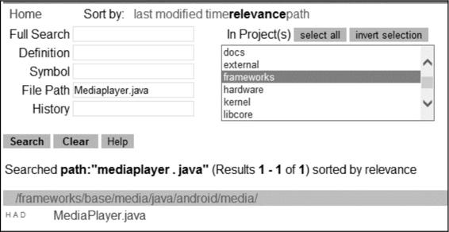
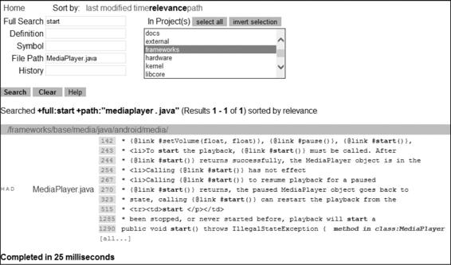

# Android系统架构

本书是系统源码和应用开发相结合的书籍，想要更好地学习系统源码，就要先了解Android系统架构。本章将简单地介绍Android系统架构、系统源码目录和如何阅读源码，带领大家走进 Android 系统源码的世界，并为本书后续的章节做好知识铺垫。另外，本书作为《Android进阶之光》的续作，本章也起到了承上启下的作用。

# 1.1 Android系统架构

Android系统架构分为五层，从上到下依次是应用层、应用框架层、系统运行库层、硬件抽象层和Linux内核层，如图1-1所示。

## 1.应用层（System Apps）

系统内置的应用程序以及非系统级的应用程序都属于应用层，负责与用户进行直接交互，通常都是用Java进行开发的。

## 2.应用框架层（Java API Framework）

应用框架层为开发人员提供了开发应用程序所需要的 API，我们平常开发应用程序都是调用这一层所提供的API，当然也包括系统应用。这一层是由Java代码编写的，可以称为Java Framework。下面来看这一层所提供的主要组件，如表1-1所示。

图1-1 Android系统架构

表1-1 应用框架层提供的组件

## 3.系统运行库层（Native）

从图 1-1 可以看出，系统运行库层分为两部分，分别是 C/C++程序库和 Android 运行时库，下面分别进行介绍。

### 1）C/C++程序库

C/C++程序库能被Android系统中的不同组件所使用，并通过应用程序框架为开发者提供服务，表1-2列出了主要的C/C++程序库。

表1-2 主要的C/C++程序库

### 2）Android运行时库

从图1-1可以看出，运行时库又分为核心库和ART（Android 5.0系统之后，Dalvik虚拟机被ART取代）。核心库提供了Java语言核心库的大多数功能，这样开发者可以使用Java语言来编写Android应用。与JVM相比，Dalvik虚拟机（DVM）是专门为移动设备定制的，允许在有限的内存中同时运行多个虚拟机的实例，并且每一个Dalvik应用作为一个独立的Linux进程执行。独立的进程可以防止在虚拟机崩溃的时候所有程序都被关闭。而替代DVM的ART的机制与DVM不同，DVM中的应用每次运行时，字节码都需要通过即时编译器（Just In Time，JIT）转换为机器码，这会使得应用的运行效率降低。而在ART中，系统在安装应用时会进行一次预编译（Ahead Of Time，AOT），将字节码预先编译成机器码并存储在本地，这样应用每次运行时就不需要执行编译了，运行效率也大大提高。

## 4.硬件抽象层（HAL）

硬件抽象层是位于操作系统内核与硬件电路之间的接口层，其目的在于将硬件抽象化，为了保护硬件厂商的知识产权，它隐藏了特定平台的硬件接口细节，为操作系统提供虚拟硬件平台，使其具有硬件无关性，可在多种平台上进行移植。从软硬件测试的角度来看，软硬件的测试工作都可分别基于硬件抽象层来完成，使得软硬件测试工作的并行进行成为可能。通俗来讲，就是将控制硬件的动作放在硬件抽象层中。

## 5.Linux内核层（Linux Kernel）

Android的核心系统服务基于Linux内核，在此基础上添加了部分Android专用的驱动。系统的安全性、内存管理、进程管理、网络协议栈和驱动模型等都依赖于该内核。了解Android系统的五层架构对分析系统源码有很大的帮助。

# 1.2 Android系统源码目录

学习Android系统源码，需要掌握系统源码目录。可以访问http：//androidxref.com来阅读系统源码，当然，最好是将源码下载下来，下载源码的方式有很多种，这里我推荐使用百度网盘地址http：//pan.baidu.com/s/1ngsZs进行下载，目前其中提供了Android1.6 到Android 8.1.0多个Android版本的源码。

## 1.2.1 整体结构

各个版本的源码目录基本是类似的，如果是编译后的源码目录，会多一个out文件夹，用来存储编译产生的文件。Android 8.0.0的系统根目录结构说明如表1-3所示。

表1-3 系统根目录结构说明

从表1-3可以看出，系统源码分类清晰，内容庞大且复杂，接下来分析packages目录中的内容，也就是应用层部分。

## 1.2.2 应用层部分

应用层位于整个 Android 系统的最上层，开发者开发的应用程序以及系统内置的应用程序都在应用层。源码根目录中的packages目录对应着系统应用层，它的目录结构如表1-4所示。

表1-4 packages目录结构

从目录结构可以发现，packages 目录存放着系统核心应用程序、第三方应用程序和输入法等，这些应用程序都是运行在系统应用层的，因此 packages 目录对应着系统的应用层。

## 1.2.3 应用框架层部分

应用框架层是系统的核心部分，一方面向上提供接口给应用层调用，另一方面向下与C/C++程序库及硬件抽象层等进行衔接。应用框架层的主要实现代码在frameworks/base和frameworks/av目录下，其中frameworks/base目录结构如表1-5所示。

表1-5 frameworks/base目录

## 1.2.4 C/C++程序库部分

系统运行库层（Native）中的C/C++程序库的类型繁多，功能强大，C/C++程序库并不完全在一个目录中，这里给出几个常用且比较重要的 C/C++程序库所在的目录位置，如表 1-6所示。

表1-6 C/C++程序库所在的目录位置讲完C/C++程序库部分，其余的部分在表1-3中已经给出。Android运行时库的代码在art/目录中；硬件抽象层的代码在hardware/目录中，这是手机厂商改动最大的部分，根据手机终端所采用的硬件平台不同会有不同的实现，剩下的目录在这里就不再详细介绍了，有兴趣的读者可以自行研究。

# 1.3 源码阅读

系统源码的阅读有很多种方式，总的来说分为两种：一种是在线阅读；另一种是下载源码到本地用软件工具阅读。下面分别针对这两种阅读方式进行讲解。

## 1.3.1 在线阅读

Android 在 线 阅 读 源 码 的 网 站 有 很 多 ， 比 如http ： //www.grepcode.com 、 http ： //androidxref.com 、https ： //www.androidos.net.cn 等 ， 这 里 推 荐 使 用http：//androidxref.com进行在线阅读，这个网址提供了Android1.6到Android 8.0.0的源码，如图1-2所示。

可以看到图1-2的左侧列出了很多Android版本，单击某个版本进入相应的版本界面，这里以Android 8.0.0版本为例，如图1-3所示。

左边是搜索关键字栏，右边是要搜索的源码目录列表，如果不知道要搜索的关键字具体在哪个目录中，可以单击select all按钮，这样会在所有的目录中进行搜索。下面以搜索MediaPlayer.java为例，MediaPlayer.java在frameworks目录中，因此我们按照图1-4所示进行搜索。

图1-2 AndroidXRef首页

图1-3 Android 8.0.0版本界面

图1-4 搜索MediaPlayer.java单击搜索到的 MediaPlayer.java 选项，就可以查看它的源码。如果我们想搜索MediaPlayer.java的start方法，可以在其源码界面进行搜索，也可以增加搜索关键字进行搜索，如图1-5所示。

图1-5 增加搜索关键字

## 1.3.2 使用Source Insight

下载源码到本地，再用软件工具阅读源码是最好的方式，这样不

受网速影响，效率更高，另外在线阅读的网站都是由第三方提供的，并不是很稳定，可能某一天就访问不了了。本地阅读源码可以采用Android Studio、Eclipse、Sublime和Source Insight等软件，这里推荐使用Source Insight。Source Insight是阅读源码的利器，它是Windows平台下的软件，很多手机开发人员都是采用Source Insight来阅读Android系统源码的。

### 1.新建源码项目

安装Source Insight软件后，首先要新建源码项目。通过选择菜单项Project→New Project，会弹出如图1-6所示的对话框。

图1-6 新建源码项目

这里我们指定源码项目的名称为 Android_8.0.0，然后单击 OK按钮打开 New Project Settings对话框，如图1-7所示。

图1-7 New Project Settings对话框单击图1-7箭头指向的Browse按钮来选择本地系统源码所在的路径，比如我的系统源码路径为 D：/Android/android-8.0.0_r1。选择好加载路径后单击 OK 按钮会打开 Add and Remove Project Files对话框，在这个对话框中可以向项目中添加整个Android系统源码，也可以只把源码部分目录添加到项目中，以后再根据需要添加其他目录。如果向项目添加整个 Android 系统源码，加载时会非常慢，这里我们只 添 加 本 书 相 关 的 源 码 目 录 Frameworks 、 Libcore 、 Packages 、System、Art 和 Libnativehelper，这几个目录基本上可以满足日常的系统源码阅读需求了，如图1-8所示。

图1-8 Add and Remove Project Files对话框单击图1-8中箭头指向的Add Tree按钮，就会将选择的目录源码加载到Android_8.0.0项目中，这个时候会弹出加载进度条，加载完毕后单击对话框的“关闭”按钮就可以了。

### 2.定位文件

Source Insight的定位文件功能十分强大，我们只需要知道源码文件名就可以轻松找到它，比如我们要找 MediaPlayer.java，只要在文件搜索框中输入 MediaPlayer.java 即可，如图1-9所示。

图1-9 定位文件单 击 搜 索 到 的 MediaPlayer.java 选 项 ， 就 可 以 打 开 展 示MediaPlayer.java源码的对话框。

### 3.全局搜索

Source Insight 另一个好用的功能就是全局搜索，默认快捷键为Ctrl+/，或者单击工具栏中类似R的图标，弹出的搜索对话框如图1-10所示。在Search In下拉列表框中可以自定义搜索的范围，比如我们想查找所有Java文件中引用MediaPlayer类的情况，就可以按如图1-10所示进行操作。

图1-10 全局搜索

当然，Source Insight的功能远不止以上几种，相信随着使用次数的增多，你会熟练掌握它的大部分功能，这里就不过多介绍了。

# 1.4 本章小结

本章的内容比较少，主要介绍了 Android 系统架构、系统源码目录和如何阅读源码，并且将系统架构和系统源码进行了关联。关于如何阅读源码这里介绍了两种方法，分别是在线阅读和使用SourceInsight阅读。本章所讲的内容都是深入源码学习的必备知识点，也为本书后续的章节做好了知识铺垫。

# 参考

《Android进阶解密》