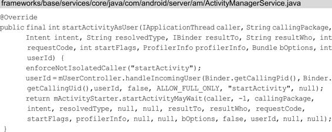

# 理解ActivityManagerService

关联知识：Android系统启动，应用程序进程启动过程，四大组件的工作过程

# AMS家族

AMS处理的逻辑多而复杂，因此AMS并不是“孤军奋战”，而是有一些类和它“共同奋战”，这些类会帮助AMS完成相关逻辑，AMS和这些“共同奋战”的类就称为AMS家族。Android7.0和Android8.0对于AMS相关部分处理有较大的区别，为了更好地理解AMS家族，这里将分别介绍Android7.0和Android8.0的AMS家族。

## Android7.0的AMS家族

ActivityManager是一个和AMS相关联的类，它主要对运行中的Activity进行管理，这些管理工作并不是由ActivityManager来处理的，而是交由AMS来处理的。ActivityManager中的方法会通过ActivityManagerNative（以后简称AMN）的getDefault方法来得到ActivityManagerProxy（以后简称AMP），通过AMP就可以和AMN进行通信，而AMN是一个抽象类，它将功能交由它的子类AMS来处理，因此，AMP就是AMS的代理类。AMS作为系统服务，很多API是不会暴露给ActivityManager的，因此ActivityManager并不算是AMS家族的一份子。

为了讲解AMS家族，这里以Android7.0的Activity启动过程来举例，在Activity的启动过程中会调用Instrumentation的execStartActivity方法，如下所示：


在execStartActivity方法中会调用AMN的getDefault来获取AMS的代理类AMP。接着调用了AMP的startActivity方法，先来查看AMN的getDefault方法做了什么，如下所示：


> 启发：ActivityManager 返回后，并没有直接交给App直接使用，而是通过 Instrumentation 来管理。我们作为服务端在提供 AIDL 接口时，也可以这样把跟服务端交互的Binder封装到一个管理类中，再把管理类提供给业务层使用，而不是直接提供Binder。

在getDefault方法中调用了gDefault的get方法，gDefault是一个Singleton类。在注释1处得到名为“activity”的Service引用，也就是IBinder类型的AMS的引用。在注释2处将它封装成AMP类型对象，并将它保存到gDefault中，此后调用AMN的getDefault方法就会直接获得AMS的代理对象AMP。注释2处的asInterface方法如下所示：


注释1处的descriptor值为android.app.IActivityManager，注释1处的代码主要用来查询本地进程是否有IActivityManager接口的实现，如果有则返回，如果没有就在注释2处将IBinder类型的AMS引用封装成AMP，AMP的构造方法如下所示：


> 使用了静态代理。AMP 和 AMN 都实现了相同的接口 IActivityManager。

在AMP的构造方法中将AMS的引用赋值给变量mRemote，这样在AMP中就可以使用AMS了。其中IActivityManager是一个接口，AMN和AMP都实现了这个接口，用于实现代理模式和Binder通信。再回到Instrumentation的execStartActivity方法，来查看AMP的startActivity方法，AMP是AMN的内部类，代码如下所示：


首先将传入的参数写入到Parcel类型的data中。在注释1处，通过IBinder类型对象mRemote（AMS的引用）向服务器端的AMS发送一个START_ACTIVITY_TRANSACTION类型的进程间通信请求。那么服务器端AMS就会从Binder线程池中读取客户端发来的数据，最终会调用AMN的onTransact方法，如下所示：


在onTransact方法中会调用AMS的startActivity方法，如下所示：


startActivity方法最后会返回startActivityAsUser方法，如下所示：



startActivityAsUser方法最后会返回ActivityStarter的startActivityMayWait方法，这一调用过程已经脱离了本节要讲的AMS家族的范畴，因此这里不做介绍了，具体的调用过程可以查看4.1.2节的内容。在Activity的启动过程中提到了AMP、AMN和AMS，它们共同组成了AMS家族的主要部分，如图6-1所示。AMP是AMN的内部类，它们都实现了IActivityManager接口，这样它们就可以实现代理模式，具体来讲是远程代理：AMP和AMN是运行在两个进程中的，AMP是Client端，AMN则是Server端，而Server端中具体的功能都是由AMN的子类AMS来实现的，因此，AMP就是AMS在Client端的代理类。AMN又实现了Binder类，这样AMP和AMS就可以通过Binder来进行进程间通信。ActivityManager通过AMN的getDefault方法得到AMP，通过AMP就可以和AMS进行通信。除ActivityManager以外，有些想要与AMS进行通信的类也需要通过AMP，如图[Android7.0AMS家族图]所示。


图：Android7.0AMS家族图


图：AMP和AMS进行通信

从图6-2可以看出，除ActivityManager外，在第5章介绍的ContextImpl如果想要和AMS进行通信也需要先经过AMP。

## Android8.0的AMS家族

Android8.0的AMS家族与Android7.0有一些差别，为了更好地理解这些差别，还以Activity启动过程来举例，在Android8.0中，Activity的启动过程中会调用Instrumentation的execStartActivity方法，如下所示：


ActivityManager的getService方法，如下所示：


getService方法调用了IActivityManagerSingleton的get方法，IActivityManagerSingleton是一个Singleton类。在注释1处得到名为“activity”的Service引用（Context.ACTIVITY_SERVICE的值为“activity”），也就是IBinder类型的AMS的引用。接着在注释2处将它转换成IActivityManager类型的对象，这段代码采用的是AIDL，IActivityManager.java类是由AIDL工具在编译时自动生成的，IActivityManager.aidl的文件路径为frameworks/base/core/java/android/app/IActivityManager.aidl。

要实现进程间通信，服务器端也就是AMS只需要继承IActivityManager.Stub类并实现相应的方法就可以了。采用AIDL后就不需要使用AMS的代理类AMP了，因此Android8.0去掉了AMP，代替它的是IActivityManager，它是AMS在本地的代理。我们回到Instrumentation的execStartActivity方法，在注释1处实际上调用的是AMS的execStartActivity方法。我们来查看Android8.0的AMS家族，如图所示。


可以发现Android8.0AMS家族要简单得多，ActivityManager的getService方法会得到IActivityManager，AMS只需要继承IActivityManager.Stub类，就可以和ActivityManager实现进程间通信了。

## AMS的启动过程

要想更好地理解AMS，很有必要了解AMS的启动过程，AMS是在SystemServer进程中启动的，从SystemServer的main方法开始看，如下所示：


main方法只调用了SystemServer的run方法，如下所示：


- 注释1处加载了动态库libandroid_servers.so。
- 注释2处创建SystemServiceManager，它会对系统的服务进行创建、启动和生命周期管理。
- 注释3处的startBootstrapServices方法中用SystemServiceManager启动了ActivityManagerService、PowerManagerService、PackageManagerService等服务。
- 注释4处的startCoreServices方法中启动了DropBoxManagerService、BatteryService、UsageStatsService和WebViewUpdateService。
- 注释5处的startOtherServices方法中启动了CameraService、AlarmManagerService、VrManagerService等服务。

这些服务的父类均为SystemService。从注释3、注释4、注释5处的方法可以看出，官方把系统服务分为了3种类型，分别是引导服务、核心服务和其他服务，其中其他服务是一些非紧要和不需要立即启动的服务。主要查看引导服务AMS是如何启动的，注释3处的startBootstrapServices方法如下所示：


注释1处调用了SystemServiceManager的startService方法，该方法的参数是ActivityManagerService.Lifecycle.class：

```kotlin
    public <T extends SystemService> T startService(Class<T> serviceClass) {
        try {
...
            final T service;
            try {
                Constructor<T> constructor = serviceClass.getConstructor(Context.class);
                service = constructor.newInstance(mContext);
            } catch (InstantiationException ex) {
                ...
            }

            startService(service);
            return service;
        }...
    }

    public void startService(@NonNull final SystemService service) {
        // Check if already started
        String className = service.getClass().getName();
        if (mServiceClassnames.contains(className)) {
            Slog.i(TAG, "Not starting an already started service " + className);
            return;
        }
        mServiceClassnames.add(className);

        // Register it.
        mServices.add(service);	//1

        // Start it.
        long time = SystemClock.elapsedRealtime();
        try {
            service.onStart();	//2
        } catch (RuntimeException ex) {
            ...
        }
    }
```

传入的SystemService类型的service对象的值为ActivityManagerService.Lifecycle.class。

注释1处将service对象添加到ArrayList类型的mServices中来完成注册。

注释2处调用service的onStart方法来启动service对象，这个service对象具体指的是什么呢？我们接着往下看，Lifecycle是AMS的内部类，代码如下所示：


上面的代码需要结合SystemServiceManager的startService方法来分析。注释1处，在Lifecycle的构造方法中创建了AMS实例。当调用SystemService类型的service的onStart方法时，实际上是调用了注释2处AMS的start方法。注释3处的Lifecycle的getService方法返回AMS实例，这样我们就知道SystemServer的startBootstrapServices方法的注释1处mSystemServiceManager.startService（ActivityManagerService.Lifecycle.class）.getService（）实际得到的就是AMS实例，AMS的启动过程就讲到这里。

# AMS与应用程序进程

在2.2.3节中讲到了Zygote的Java框架层中，会创建一个Server端的Socket，这个Socket用来等待AMS请求Zygote来创建新的应用程序进程。要启动一个应用程序，首先要保证这个应用程序所需要的应用程序进程已经存在。在启动应用程序时AMS会检查这个应用程序需要的应用程序进程是否存在，不存在就会请求Zygote进程创建需要的应用程序进程。这里以Service的启动过程为例，来分析AMS与应用程序进程的关系。Service在启动过程中会调用ActiveServices的bringUpServiceLocked方法，如下所示：


在注释1处得到ServiceRecord的processName的值并赋值给procName，其中processName用来描述Service想要在哪个进程运行，默认是当前进程，我们也可以在AndroidManifest文件中设置android：process属性来新开启一个进程运行Service。在注释2处将procName和Service的uid传入到AMS的getProcessRecordLocked方法中，来查询是否存在一个与Service对应的ProcessRecord类型的对象app，ProcessRecord主要用来描述运行的应用程序进程的信息。在注释5处判断Service对应的app为null则说明用来运行Service的应用程序进程不存在，则调用注释6处的AMS的startProcessLocked方法来创建对应的应用程序进程，关于创建应用程序进程请查看第3章的内容，在注释3处判断如果用来运行Service的应用程序进程存在，则调用注释4处的realStartServiceLocked方法来启动Service，具体的过程请查看4.2.2节。总结一下，AMS与应用程序进程的关系主要有以下两点：

- 启动应用程序时AMS会检查这个应用程序需要的应用程序进程是否存在。
- 如果需要的应用程序进程不存在，AMS就会请求Zygote进程创建需要的应用程序进程。

# AMS重要的数据结构

AMS涉及了很多数据结构，这一节我们来分析一下ActivityRecord、TaskRecord和ActivityStack，为什么要学习它们呢？因为它们和应用开发关联较大，是Activity任务栈模型的基础。

## 解析ActivityRecord

ActivityRecord在本书的前几章经常会见到，它内部记录了Activity的所有信息，因此它用来描述一个Activity，它是在启动Activity时被创建的，具体是在ActivityStarter的startActivity方法中被创建的，具体可以查看4.1.2节。ActivityRecord的部分重要成员变量如表6-1所示。


表6-1ActivityRecord的部分重要成员变量从表6-1可以看出ActivityRecord的作用，其内部存储了Activity的所有信息，包括AMS的引用、AndroidManifes节点信息、Activity状态、Activity资源信息和Activity进程相关信息等，需要注意的是其中含有该ActivityRecord所在的TaskRecord，这就将ActivityRecord和TaskRecord关联在一起，它们是Activity任务栈模型的重要成员，我们接着来查看TaskRecord。

## 解析TaskRecord

TaskRecord用来描述一个Activity任务栈，其内部也有很多的成员变量，这里挑出一些重要的成员变量进行介绍，如表6-2所示。


表6-2TaskRecord的部分重要成员变量

续表从表6-2可以发现TaskRecord的作用，其内部存储了任务栈的所有信息，包括任务栈的唯一标识符、任务栈的倾向性、任务栈中的Activity记录和AMS的引用等，需要注意的是其中含有ActivityStack，也就是当前Activity任务栈所归属的ActivityStack，我们接着来查看ActivityStack。

## 解析ActivityStack

ActivityStack是一个管理类，用来管理系统所有Activity，其内部维护了Activity的所有状态、特殊状态的Activity以及和Activity相关的列表等数据。ActivityStack是由ActivityStackSupervisor来进行管理的，而ActivityStackSupervisor在AMS的构造方法中被创建，如下所示：


### 1.ActivityStack的实例类型

在ActivityStackSupervisor中有多种ActivityStack实例，如下所示：


mHomeStack用来存储LauncherApp的所有Activity，mFocusedStack表示当前正在接收输入或启动下一个Activity的所有Activity。mLastFocusedStack表示此前接收输入的所有Activity。通过ActivityStackSupervisor提供了获取上述ActivityStack的方法，比如要获取mFocusedStack，只需要调用ActivityStackSupervisor的getFocusedStack方法就可以了：


### 2.ActivityState

在ActivityStack中通过枚举存储了Activity的所有的状态，如下所示：


通过名称我们可以很轻易知道这些状态所代表的意义。应用ActivityState的场景会有很多，比如下面的代码：


overridePendingTransition方法用于设置Activity的切换动画，在注释1处可以看到只有ActivityState为RESUMED状态或者PAUSING状态时才会调用WMS类型的mWindowManager对象的overridePendingAppTransition方法来切换动画。

### 3.特殊状态的Activity

在ActivityStack中定义了一些特殊状态的Activity，如下所示：


这些特殊的状态都是ActivityRecord类型的，ActivityRecord用来记录一个Activity的所有信息。

### 4.维护的ArrayList

在ActivityStack中维护了很多ArrayList，这些ArrayList中的元素类型主要有ActivityRecord和TaskRecord，如表6-3所示。


表6-3ArrayList中的元素类型及其说明ActivityStack维护了元素类型为TaskRecord的列表，这样ActivityStack和TaskRecord就有了关联，Activity任务栈存储在ActivityStack中。AMS重要的数据结构ActivityRecord、TaskRecord和ActivityStack就讲到这里，要想更多地了解它们请自行阅读源码。

# Activity栈管理

我们平时做应用开发都知道Activty是放入在Activity任务栈中的，有了任务栈，系统和开发者就能够更好地应用和管理Activity，来完成各种业务逻辑。这一节我们来学习和Activity栈管理相关的知识点，不过在此之前先要了解一下Activity任务栈模型。

## Activity任务栈模型

Activity任务栈并不是凭空想象出来的，它是由多种数据结构共同组合而成的，在6.4节我们学习了ActivityRecord、TaskRecord和ActivityStack，它们就是Activity任务栈模型的重要组成部分，如图

6-4所示。


图6-4Activity任务栈模型

ActivityRecord用来记录一个Activity的所有信息，TaskRecord中包含了一个或多个ActivityRecord，TaskRecord用来表示Activity的任务栈，用来管理栈中的ActivityRecord，ActivityStack又包含了一个或多个TaskRecord，它是TaskRecord的管理者。Activity栈管理就是建立在Activity任务栈模型之上的，有了栈管理，我们可以对应用程序进行操作，应用可以复用自身应用中以及其他应用的Activity，节省了资源。比如我们使用一款社交应用，这个应用的联系人详情界面提供了联系人的邮箱，当我们点击邮箱时会跳到发送邮件的界面，如图6-5所示。


图6-5Activity栈管理

社交应用和系统E-mail中的Activity是处于不同应用程序进程的，而有了栈管理，就可以把发送邮件界面放到社交应用中详情界面所在栈的栈顶，来做到跨进程操作。为了更灵活地进行栈管理，Android系统提供了很多配置，包括LaunchMode、Intent的FLAG和taskAffinity等，下面分别对它们进行介绍。

## LaunchMode

LaunchMode大家都不陌生，用于设定Activity的启动方式，无论是哪种启动方式，所启动的Activity都会位于Activity栈的栈顶，主要有以下4种LaunchMode。

- standerd：默认模式，每次启动Activity都会创建一个新的Activity实例。
- singleTop：如果要启动的Activity已经在栈顶，则不会重新创建Activity，同时该Activity的onNewIntent方法会被调用。如果要启动的Activity不在栈顶，则会重新创建该Activity的实例。
- singleTask：如果要启动的Activity已经存在于它想要归属的栈中，那么不会创建该Activity实例，将栈中位于该Activity上的所有的Activity出栈，同时该Activity的onNewIntent方法会被调用。如果要启动的Activity不存在于它想要归属的栈中，并且该栈存在，则会重新创建该Activity的实例。如果要启动的Activity想要归属的栈不存在，则首先要创建一个新栈，然后创建该Activity实例并压入到新栈中。
- singleInstance：和singleTask基本类似，不同的是启动Activity时，首先要创建一个新栈，然后创建该Activity实例并压入新栈中，新栈中只会存在这一个Activity实例。

## Intent的FLAG

在Intent中定义了很多FLAG，其中有几个FLAG也可以设定Activity的启动方式，如果LaunchMode和FLAG设定的Activity的启动方式有冲突，则以FLAG设定的为准。

- FLAG_ACTIVITY_SINGLE_TOP：和LaunchMode中的singleTop效果是一样的。
- FLAG_ACTIVITY_NEW_TASK：和LaunchMode中的singleTask效果是一样的。
- FLAG_ACTIVITY_CLEAR_TOP：在LaunchMode中没有与此对应的模式，如果要启动的Activity已经存在于栈中，则将所有位于它上面的Activity出栈。singleTask默认具有此标记位的效果。除了上述这三个FLAG，还有一些FLAG对我们分析栈管理有些帮助。
- FLAG_ACTIVITY_NO_HISTORY：Activity一旦退出，就不会存在于栈中。同样地，也可以在AndroidManifest.xml中设置android：noHistory。
- FLAG_ACTIVITY_MULTIPLE_TASK：需要和
- FLAG_ACTIVITY_NEW_TASK一同使用才有效果，系统会启动一个新的栈来容纳新启动的Activity。
- FLAG_ACTIVITY_EXCLUDE_FROM_RECENTS：Activity不会被放入到“最近启动的Activity”列表中。
- FLAG_ACTIVITY_BROUGHT_TO_FRONT：这个标志位通常不是由应用程序中的代码设置的，而是LaunchMode为singleTask时，由系统自动加上的。
- FLAG_ACTIVITY_LAUNCHED_FROM_HISTORY：这个标志位通常不是由应用程序中的代码设置的，而是从历史记录中启动的（长按Home键调出）。
- FLAG_ACTIVITY_CLEAR_TASK：需要和FLAG_ACTIVITY_NEW_TASK一同使用才有效果，用于清除与启动的Activity相关栈的所有其他Activity。


图6-6AMS到ActivityStarter的调用过程

接下来通过系统源码来查看FLAG的应用，在4.1.2节中讲过根Activity启动时会调用AMS的startActivity方法，经过层层调用会调用ActivityStarter的startActivityUnchecked方法，如图6-6所示。


在注释1处用于初始化启动Activity的各种配置，在初始化前会重置各种配置再进行配置，这些配置包括ActivityRecord、Intent、TaskRecord和LaunchFlags（Activity启动的FLAG）等。注释2处的computeLaunchingTaskFlags方法用于计算出Activity启动的FLAG，并将计算的值赋值给mLaunchFlags。在注释3处将mLaunchFlags设置给Intent，达到设定Activity的启动方式的目的，接着来查看computeLaunchingTaskFlags方法：


计算启动的FLAG的逻辑比较复杂，这里只截取了一小部分，当注释1处的TaskRecord类型的mInTask为null时，说明Activity要加入的栈不存在，因此，这一小段代码主要解决的问题就是Activity要加入的栈不存在时如何计算出启动的FLAG。在注释2处，ActivityRecord类型的mSourceRecord用于描述“初始Activity”，什么是“初始Activity”呢？比如ActivityA启动了ActivityB，ActivityA就是初始Activity。同时满足注释2和注释3的条件则需要创建一个新栈。在注释4处，如果“初始Activity”所在的栈只允许有一个Activity实例，则也需要创建一个新栈。在注释5处，如果LaunchMode设置了singleTask或singleInstance，则也要创建一个新栈。

## taskAffinity

我们可以在AndroidManifest.xml中设置android：taskAffinity，用来指定Activity希望归属的栈，在默认情况下，同一个应用程序的所有的Activity都有着相同的taskAffinity。taskAffinity在下面两种情况时会产生效果。

1. taskAffinity与FLAG_ACTIVITY_NEW_TASK或者singleTask配合。如果新启动Activity的taskAffinity和栈的taskAffinity相同则加入到该栈中；如果不同，就会创建新栈。
2. taskAffinity与allowTaskReparenting配合。如果allowTaskReparenting为true，说明Activity具有转移的能力。拿此前的邮件为例（图6-5），当社交应用启动了发送邮件的Activity，此时发送邮件的Activity是和社交应用处于同一个栈中的，并且这个栈位于前台。如果发送邮件的Activity的allowTaskReparenting设置为true，此后E-mail应用所在的栈位于前台时，发送邮件的Activity就会由社交应用的栈中转移到与它更亲近的邮件应用（taskAffinity相同）所在的栈中，如图6-7所示。


图6-7任务栈转移

接着通过系统源码来查看taskAffinity的应用。ActivityStackSupervisor的findTaskLocked方法用于找到Activity最匹配的栈，最终会调用ActivityStack的findTaskLocked方法：


这个方法的逻辑比较复杂，这里截取了和taskAffinity相关的部分。在注释1处遍历mTaskHistory列表，列表的元素为TaskRecord，它用于存储没有被销毁的栈。在注释2处得到某一个栈的信息。在注释3处将栈的rootAffinity（初始的taskAffinity）和目标Activity的taskAffinity做对比，如果相同，则将FindTaskResult的matchedByRootAffinity属性设置为true，说明找到了匹配的栈。

# 总结

本章介绍了AMS的家族、AMS的启动、AMS重要的数据结构和Activity栈管理等知识点，关于AMS有很多内容可以学习，本章也只是介绍了和应用开发有所关联的部分，如果想要更多地了解AMS的原理则需要大家自行去阅读源码并做总结。另外本章和前面5章的内容有所关联，如果前面5章你理解并掌握了，那么读完这一章你可能会有更多的发现。


# 参考

《Android进阶解密》