# 根Activity的启动过程

Activity的启动过程分为两种，一种是根Activity的启动过程，另一种是普通Activity的启动过程。根Activity指的是应用程序启动的第一个Activity，因此根Activity的启动过程一般情况下也可以理解为应用程序的启动过程。普通 Activity 指的是除应用程序启动的第一个Activity之外的其他Activity。

根Activity的启动过程比较复杂，下面分为3个部分来讲，分别是Launcher请求AMS过程、AMS到ApplicationThread的调用过程和ActivityThread启动Activity。

## 4.1.1 Launcher请求AMS过程

在【Android系统启动流程.md】中讲过Launcher 启动后会将已安装应用程序的快捷图标显示到桌面上，这些应用程序的快捷图标就是启动根 Activity 的入口，当我们点击某个应用程序的快捷图标时，会通过Launcher请求AMS来启动该应用程序。Launcher 请求AMS的时序图如图所示。

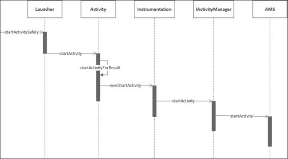

图4-1 Launcher请求AMS的时序图

当我们点击应用程序的快捷图标时 ，会调用Launcher的startActivitySafely方法，如下所示：

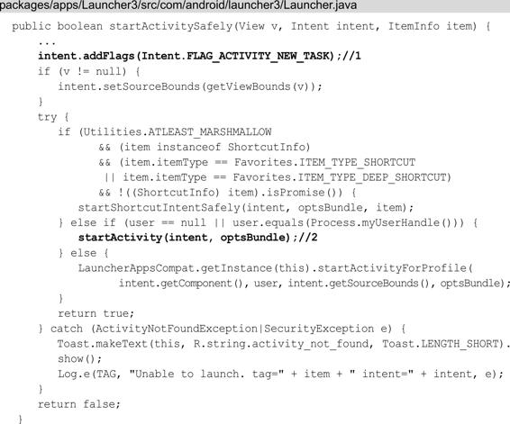

注释1：将 Flag 设置为 Intent.FLAG_ACTIVITY_NEW_TASK，这样根 Activity 会在新的任务栈中启动。

注释2：调用 startActivity 方法，这个 startActivity 方法在Activity中实现，如下所示：

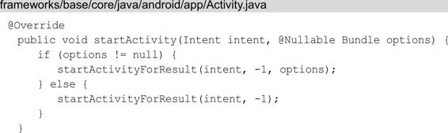

在 startActivity 方法中会调用startActivityForResult 方法，它的第二个参数为-1，表示Launcher不需要知道Activity启动的结果，startActivityForResult方法的代码如下所示：

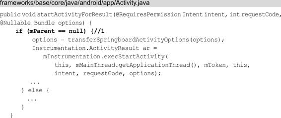

注释1：mParent是Activity类型的，表示当前Activity的父类。因为目前根Activity还没有创建出来，因此，mParent==null成立 。 

接着调用 Instrumentation 的 execStartActivity 方法 ，Instrumentation 主要用来监控应用程序和系统的交互，execStartActivity 方法：

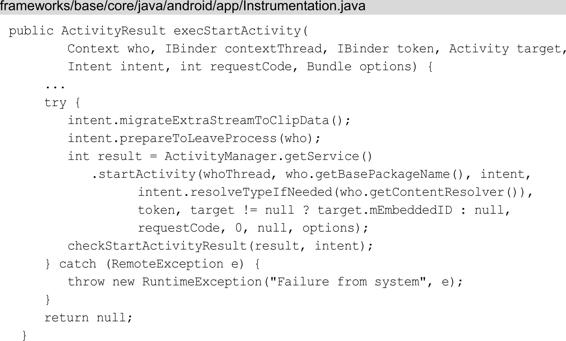

首先调用ActivityManager.getService方法来获取AMS的代理对象，接着调用它的startActivity方法。这里与Android 8.0之前代码的逻辑有些不同，Android 8.0之前是通过ActivityManagerNative 的getDefault 来获取 AMS 的代理对象的，现在这个逻辑封装到了ActivityManager 中而不是 ActivityManagerNative 中。

ActivityManager.getService方法：

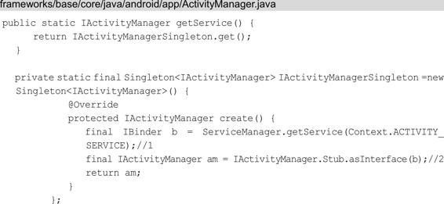

getService 方法调用了 IActivityManagerSingleton 的 get 方法，IActivityManagerSingleton 是一个 Singleton 类。

注释1：得到名为“activity”的Service引用，也就是IBinder类型的AMS的引用。

注释2：将 IBinder 转换成 IActivityManager 类型的对象。

这段代码采用的是AIDL，IActivityManager.java 类是由 AIDL 工具在编译时自动生成的，IActivityManager.aidl 的文件路径为frameworks/base/core/java/android/app/IActivityManager.aidl。要实现进程间通信， 服务器端也就是 AMS 需要继承 IActivityManager.Stub 类并实现相应的方法。 

> 注意 Android 8.0 之前并没有采用AIDL，而是采用了类似AIDL的形式，用AMS的代理对象ActivityManagerProxy来与AMS进行进程间通信，Android 8.0 去除了  ActivityManagerNative 的内部类 ActivityManagerProxy，代替它的是 IActivityManager，它是 AMS 在本地的代理。

回到 Instrumentation 类的 execStartActivity 方法中，从上面得知 **execStartActivity 方法最终调用的是 AMS 的 startActivity 方法**。

## 4.1.2 AMS 到ApplicationThread的调用过程

Launcher请求AMS后，代码逻辑已经进入AMS中，接着是AMS到ApplicationThread的调用流程，时序图如图4-2所示。

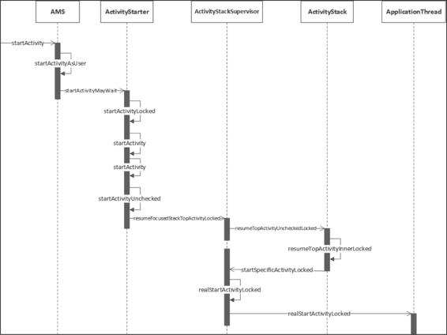

图4-2 AMS到ApplicationThread的调用过程的时序图

AMS的startActivity方法如下所示：

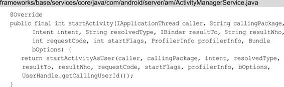

在AMS的startActivity方法中返回了startActivityAsUser方法，可以发现startActivityAsUser方法比startActivity方法多了一个参数UserHandle.getCallingUserId（），这个方法会获得调用者的UserId，AMS根据这个UserId来确定调用者的权限。

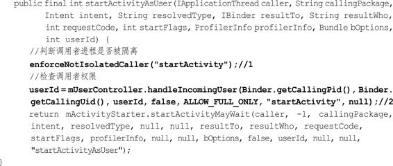

注释1：判断调用者进程是否被隔离，如果被隔离则抛出SecurityException异常。

注释2：检查调用者是否有权限，如果没有权限也会抛出 SecurityException 异常。

最后调用 ActivityStarter 的 startActivityMayWait 方法，startActivityMayWait 方法的参数要比 startActivityAsUser 多几个，需要注意的是倒数第二个参数类型为**TaskRecord，代表启动的Activity所在的栈**。最后一个参数"startActivityAsUser"代表启动的理由。startActivityMayWait 方法的代码如下所示：

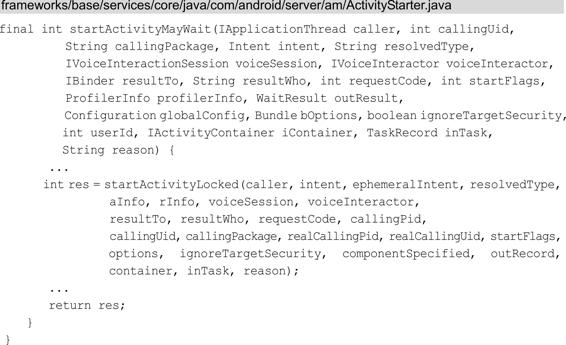

ActivityStarter 是 Android 7.0 中新加入的类，它是加载 Activity 的控制类，会收集所有的逻辑来决定如何将 Intent 和 Flags 转换为 Activity，并将 Activity 和 Task 以及 Stack 相关联。

ActivityStarter 的 startActivityMayWait 方法调用了startActivityLocked 方法：

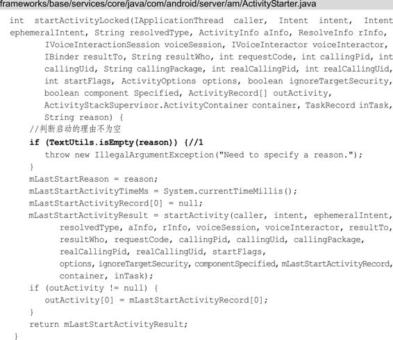

注释1：判断启动的理由不为空，如果为空则抛出 IllegalArgumentException 异常。紧接着又调用了startActivity方法，如下所示：

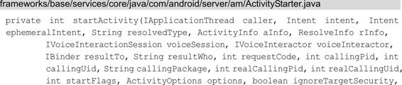

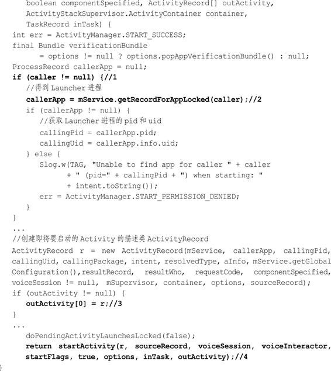

注释1：判断 IApplicationThread 类型的caller是否为null，这个caller是方法调用一路传过来的，指向的是 Launcher 所在的应用程序进程的 ApplicationThread 对象；

注释2：调用AMS的getRecordForAppLocked方法得到的是代表Launcher进程的callerApp对象，它是ProcessRecord类型的，**ProcessRecord用于描述一个应用程序进程。同样地，ActivityRecord 用于描述一个Activity，用来记录一个 Activity 的所有信息**。

接下来创建 ActivityRecord，用于描述将要启动的Activity，并在注释3处将创建的ActivityRecord赋值给ActivityRecord[]类型的outActivity，这个outActivity会作为注释4处的startActivity方法的参数传递下去。

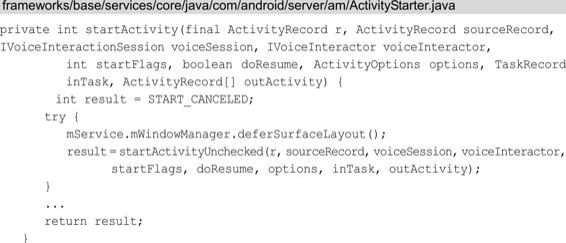

startActivity方法紧接着调用了startActivityUnchecked方法：

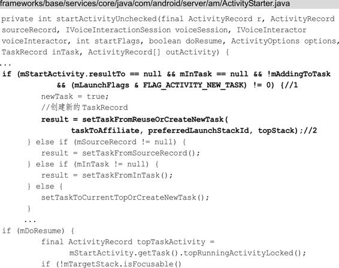

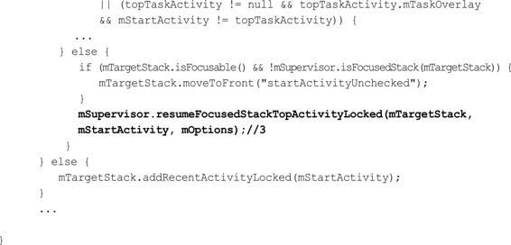

startActivityUnchecked 方法主要处理与栈管理相关的逻辑。

前面提到过，启动根Activity时会将Intent的Flag设置为FLAG_ACTIVITY_NEW_TASK，这样注释1处的条件判断就会满足；

注释2处的setTaskFromReuseOrCreateNewTask方法，其内部会创建一个新的 **TaskRecord，用来描述一个 Activity 任务栈**，也就是说setTaskFromReuseOrCreateNewTask方法内部会创建一个新的Activity任务栈。

> Activity任务栈其实是一个假想的模型，并不真实存在，Activity 任务栈会在【ActivityManagerService.md】介绍。 

注释3：调用 ActivityStackSupervisor 的 resumeFocusedStackTopActivityLocked 方法，如下所示：

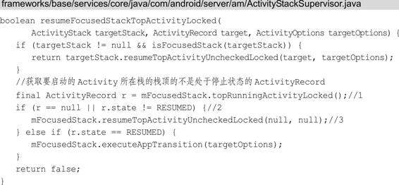

注释1：调用ActivityStack的topRunningActivityLocked方法获取要启动的 Activity 所在栈的栈顶的不是处于停止状态的 ActivityRecord。

注释2：如果 ActivityRecord 为 null，或者要启动的 Activity 的状态不是 RESUMED 状态，就会调用注释 3 处的ActivityStack的resumeTopActivityUncheckedLocked方法，对于即将启动的Activity，注释2处的条件判断是肯定满足的。

查看ActivityStack的resumeTopActivityUncheckedLocked方法：

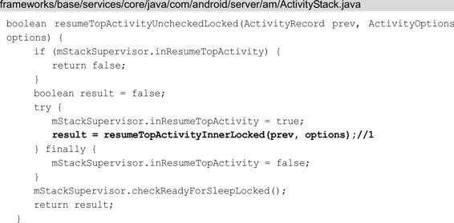

注释1：调用 ActivityStack 的 resumeTopActivityInnerLocked方法：

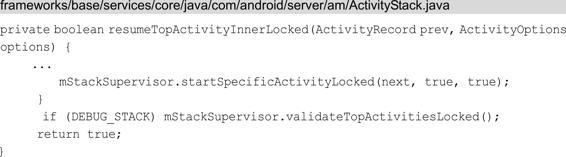

resumeTopActivityInnerLocked 方法调用了 ActivityStackSupervisor 的 startSpecificActivityLocked 方法：

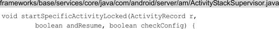

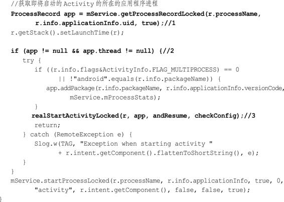

注释1：获取即将启动的Activity所在的应用程序进程；

注释2：判断要启动的Activity所在的应用程序进程如果已经运行的话，就会调用注释3处的realStartActivityLocked方法，这个方法的第二个参数是代表要启动的Activity所在的应用程序进程的ProcessRecord。

> zongwei todo：这里的 ProcessRecord 如果不为 null 的话，那其对应的 正在启动的 Activity 所在的应用程序进程是何时创建的呢？前面并没有提到这一点。
>
> 在此之前，应该是有一个步骤来创建应用程序进程，然后才开始 Activity 的启动流程。
>
> 见：应用程序进程启动过程.md

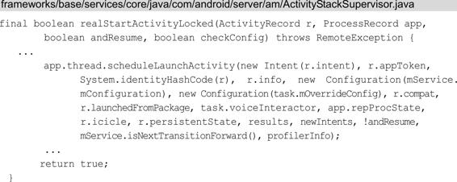

app.thread 指的是 IApplicationThread，它的实现是 ActivityThread 的内部类 ApplicationThread ， 其中 ApplicationThread 继承了IApplicationThread.Stub。

app 是传入的要启动的 Activity 所在的应用程序进程，因此，这段代码就是要在目标应用程序进程启动 Activity。当前代码逻辑运行在 AMS 所在的进程（SystemServer 进程）中，通过 ApplicationThread 来与应用程序进程进行Binder通信，换句话说，ApplicationThread 是 AMS 所在进程（SystemServer进程）和应用程序进程的通信桥梁，如图4-3所示。

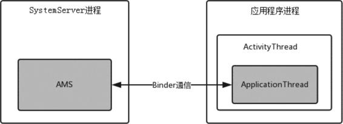

图4-3 AMS与应用程序进程通信

## 4.1.3 ActivityThread启动Activity的过程

通过上一节的分析，我们知道目前的代码逻辑运行在应用程序进程中。先来查看 ActivityThread 启动 Activity 过程的时序图，如图4-4所示。

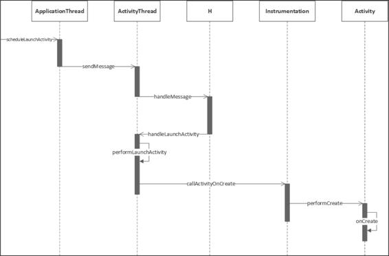

图4-4 ActivityThread启动Activity过程的时序图

接着查看ApplicationThread的scheduleLaunchActivity方法，其中ApplicationThread是ActivityThread 的内部类，在【应用程序进程启动过程.md】中讲过应用程序进程创建后会运行代表主线程的实例ActivityThread，它管理着当前应用程序进程的主线程。ApplicationThread 的 scheduleLaunchActivity 方法：

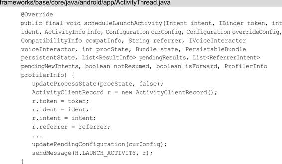

scheduleLaunchActivity 方法将启动 Activity 的参数封装成 ActivityClientRecord，sendMessage 方法向 H 类发送类型为 LAUNCH_ACTIVITY 的消息，并将ActivityClientRecord 传递过去，sendMessage方法有多个重载方法，最终调用的sendMessage方法如下所示：

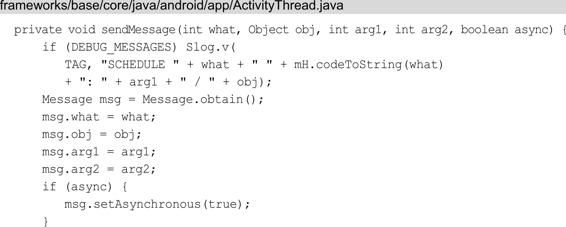

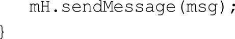

这里 mH 指的是 H，它是 ActivityThread 的内部类并继承自Handler，是应用程序进程中主线程的消息管理类。因为 ApplicationThread 是一个 Binder，它的调用逻辑运行在Binder线程池中，所以这里需要用 H 将代码的逻辑切换到主线程中。H的代码如下所示：

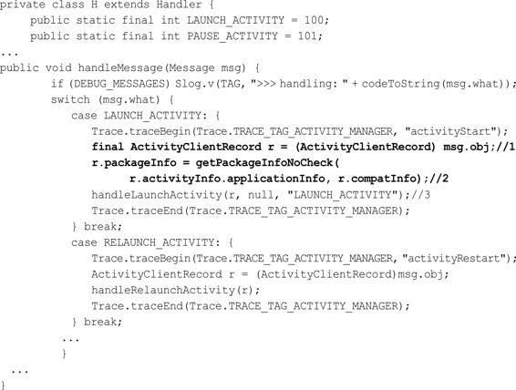

查看 H 的 handleMessage方法中对 LAUNCH_ACTIVITY 的处理：

- 注释1：将传过来的 msg 的成员变量 obj 转换为 ActivityClientRecord。
- 注释2：通过 getPackageInfoNoCheck方法获得 LoadedApk 类型的对象并赋值给 ActivityClientRecord 的成员变量 packageInfo。应用程序进程要启动 Activity 时需要将该 Activity 所属的 APK 加载进来，而 LoadedApk 就是用来描述已加载的 APK 文件的。
- 注释3：调用handleLaunchActivity方法，代码如下所示：

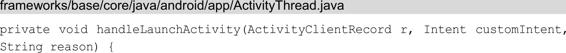

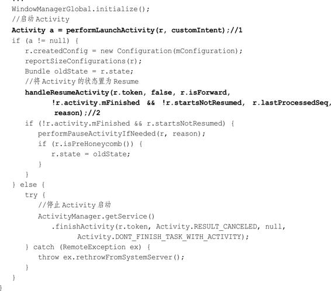

注释1：performLaunchActivity 方法用来启动 Activity；

注释2：将Activity的状态设置为Resume。如果该 Activity 为 null 则会通知 AMS 停止启动 Activity。下面来查看 performLaunchActivity 方法：

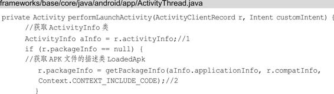

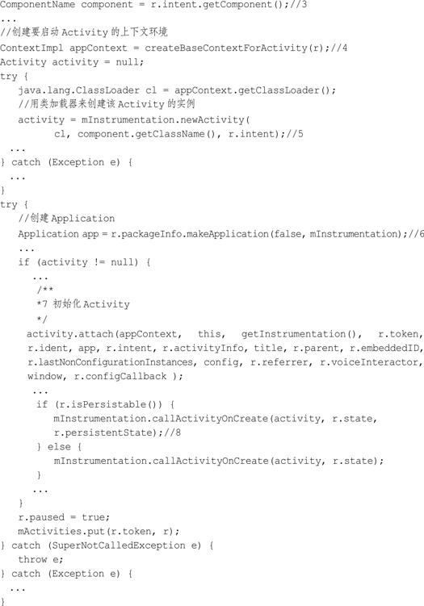

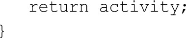

注释1：获取 ActivityInfo，用于存储代码以及 AndroidManifes 设置的 Activity 和 Receiver 节点信息，比如 Activity 的 theme 和 launchMode。

注释2：获取APK文件的描述类 LoadedApk。

注释3：获取要启动的 Activity 的 ComponentName 类，在 ComponentName 类中保存了该 Activity 的包名和类名。

注释4：创建要启动 Activity 的上下文环境。

注释5：根据 ComponentName 中存储的 Activity 类名，用类加载器来创建该 Activity 的实例。

注释6：创建 Application，makeApplication 方法内部会调用 Application 的 onCreate方法。

注释7：调用 Activity 的 attach 方法初始化 Activity，在 attach 方法中会创建 Window 对象（PhoneWindow）并与 Activity 自身进行关联。

注释8：调用 Instrumentation 的 callActivityOnCreate方法来启动 Activity，如下所示：

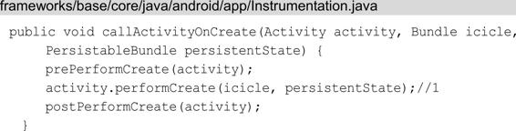

注释1：调用 Activity 的 performCreate方法，代码如下所示：

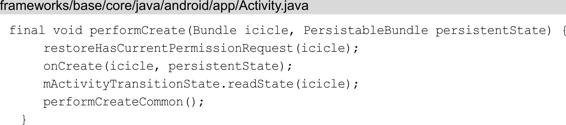

在performCreate方法中会调用 Activity 的 onCreate方法，到这里，根Activity就启动了，即应用程序就启动了。

下面看下根 Activity 启动过程中涉及的进程。

## 4.1.4 根Activity启动过程中涉及的进程

根Activity启动过程中会涉及4个进程，分别是 Launcher进程、AMS所在进程（SystemServer进程）、Zygote进程、应用程序进程。它们之间的关系如图4-5所示。

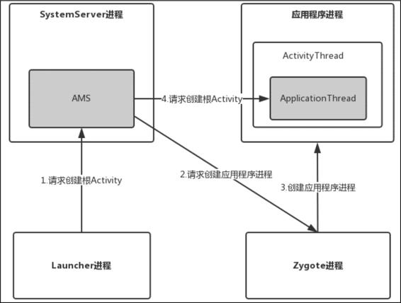

图4-5 根Activity启动过程中涉及的进程之间的关系

图4-5在图4-3基础上进行了修改，首先Launcher进程向AMS请求创建根Activity，AMS会判断根Activity所需的应用程序进程是否存在并启动，如果不存在就会请求Zygote进程创建并启动应用程序进程。应用程序进程启动后，AMS 会启动根Activity。图4-5中步骤2采用的是Socket通信，步骤1和步骤4采用的是Binder通信。图4-5可能并不是很直观，为了更好理解，下面给出这4个进程调用的时序图，如图4-6所示。

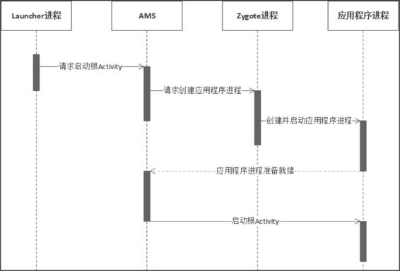

图4-6 根Activity启动过程中进程调用时序图

如果是普通Activity启动过程会涉及几个进程呢？答案是两个，AMS所在进程和应用程序进程。实际上理解了根Activity的启动过程（根Activity的onCreate过程），根Activity和普通Activity其他生命周期状态（比如onStart、onResume等）过程也会很轻松掌握，这些知识点都是触类旁通的。

# 普通Activity的启动过程