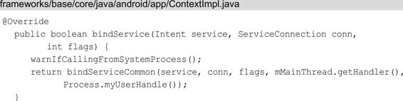

# 4.2 Service的启动过程

Service的启动过程和根Activity启动过程有部分相似的知识点，另外Service启动过程涉及上下文 Context 的知识点，这里只关注流程而不会详细介绍 Context，关于上下文Context 会在第 5 章进行介绍。Service 的启动过程将分为两个部分来进行讲解，分别是ContextImpl到ActivityManageService的调用过程和ActivityThread启动Service。

## 4.2.1 ContextImpl到AMS的调用过程

ContextImpl到AMS的调用过程很简短，如图4-7所示。

图4-7 ContextImpl到AMS的调用过程

要 启 动 Service ， 我 们 会 调 用 startService 方 法 ， 它 在ContextWrapper中实现，代码如下所示：

在 startService 方 法 中 会 调 用 mBase 的 startService 方 法 ，Context类型的mBase对象具体指的是什么呢？在4.1.3节中我们讲过，ActivityThread启动Activity时会调用如下代码创建Activity的上下文环境：

在注释1处创建上下文对象appContext，并传入Activity的attach方法中，将Activity与上下文对象appContext关联起来，这个上下文对 象 appContext 的 具 体 类 型 是 什 么 ？ 我 们 接 着 查 看createBaseContextForActivity方法，代码如下所示：

上下文对象 appContext 的具体类型就是 ContextImpl，在Activity 的 attach 方法中将ContextImpl赋值给ContextWrapper的成员变量mBase，因此，上面提出的问题就得到了解答，mBase具体指向 的 就 是 ContextImpl 。 那 么 ， 紧 接 着 来 查 看 ContextImpl 的startService方法，代码如下所示：

在 startService 方 法 中 会 返 回 startServiceCommon 方 法 ， 在startServiceCommon 方 法 中 会 在 注 释 1 处 调 用 AMS 的 代 理IActivityManager 的 startService 方 法 ， 最 终 调 用 的 是 AMS 的startService方法，这一过程已经在4.1.1节讲过了，这里不再赘述。

## 4.2.2 ActivityThread启动Service

ActivityThread启动Service的时序图如图4-8所示。

图4-8 ActivityThread启动Service的时序图

接着我们来查看AMS的startService方法，如下所示：

注释1处调用mServices的startServiceLocked方法mServices的类型是ActiveServices，ActiveServices的startServiceLocked方法代码如下所示：

注释 1 处的 retrieveServiceLocked 方法会查找是否有与参数service 对 应 的 ServiceRecord ， 如 果 没 有 找 到 ， 就 会 调 用PackageManagerService去获取参数service对应的Service信息，并封装 到 ServiceRecord 中 ， 最 后 将 ServiceRecord 封 装 为ServiceLookupResult 返 回 。 其 中 ServiceRecord 用 于 描 述 一 个Service，和此前讲过的ActivityRecord类似。在注释2处通过注释1处返回的ServiceLookupResult得到参数service对应的ServiceRecord，并传入到注释3处的startServiceInnerLocked方法中：

在 startServiceInnerLocked 方 法 中 又 调 用 了bringUpServiceLocked方法，如下所示：

在 注 释 1 处 得 到 ServiceRecord 的 processName 值 并 赋 给procName，其中processName用来描述Service想要在哪个进程中运行，默认是当前进程，我们也可以在AndroidManifest文件中设置android：process 属性来新开启一个进程运行 Service。在注释 2处 将 procName 和 Service 的 uid 传 入 到 AMS 的getProcessRecordLocked 方法中，查询是否存在一个与Service对应的ProcessRecord类型的对象app，ProcessRecord主要用来描述运行的应用程序进程的信息。在注释5处判断Service对应的app为null则说明用来运行Service的应用程序进程不存在，则调用注释6处的AMS的startProcessLocked方法来创建对应的应用程序进程，关于创建应用程序进程请查看第 3 章的内容，这里只讨论没有设置 android：process属性，即应用程序进程存在的情况。在注释3处判断如果用来运 行 Service 的 应 用 程 序 进 程 存 在 ， 则 调 用 注 释 4 处 的realStartServiceLocked方法来启动Service：

在 realStartServiceLocked 方 法 中 调 用 了 app.thread 的scheduleCreateService 方 法 。 其 中 app.thread 是IApplicationThread 类型的，它的实现是 ActivityThread 的内部类ApplicationThread。ApplicationThread的scheduleCreateService方法如下所示：

scheduleLaunchActivity 方法将启动 Service 的参数封装成ActivityClientRecord ， sendMessage 方 法 向 H 类 发 送 类 型 为CREATE_SERVICE的消息，并将ActivityClientRecord传递过去，这个过 程 和 4.1.3 节 ActivityThread 启 动 Activity 的 过 程 是 类 似 的 。sendMessage方法有多个重载方法，最终调用的sendMessage方法如下所示：

这 里 mH 指 的 是 H ， 它 是 ActivityThread 的 内 部 类 并 继 承 自Handler，是应用程序进程中主线程的消息管理类。我们接着查看H的handleMessage方法：

handleMessage 方法根据消息类型为 CREATE_SERVICE，会调用handleCreateService方法：

在 注 释 1 处 获 取 要 启 动 Service 的 应 用 程 序 的 LoadedApk ，LoadedApk是一个APK文件的描述类。在注释2处通过调用LoadedApk的getClassLoader 方 法 来 获 取 类 加 载 器 。 接 着 在 注 释 3 处 根 据CreateServiceData对象中存储的Service信息，创建Service实例。在注释4处创建Service的上下文环境ContextImpl对象。在注释5处通过Service的attach方法来初始化Service。在注释6处调用Service的onCreate方法，这样Service就启动了。在注释7处将启动的Service加入 到 ActivityThread 的 成 员 变 量 mServices 中 ， 其 中 mServices 是ArrayMap类型。Service的启动过程就讲到这里，接下来我们学习Service的绑定过程。

# 4.3 Service的绑定过程

我们可以通过调用 Context 的 startService 来启动 Service，也可以通过 Context 的bindService来绑定Service，绑定Service的过程要比启动Service的过程复杂一些，建议阅读本节前先阅读上一节Service的启动过程，结合着Service的启动过程会有更好的理解。关于如何绑定 Service 这种基础的问题，这里并不会讲解。Service 的绑定过程将分为两个部分来进行讲解，分别是ContextImpl到AMS的调用过程和Service的绑定过程。

## 4.3.1 ContextImpl到AMS的调用过程

ContextImpl到AMS的调用过程如图4-9所示。

我 们 可 以 用 bindService 方 法 来 绑 定 Service ， 它 在ContextWrapper中实现，代码如下所示：

图4-9 ContextImpl到AMS的调用过程

在 4.2.1 节我们得知 mBase 具体就是指向 ContextImpl 的，接着查看 ContextImpl 的bindService方法：

在bindService方法中，又返回了bindServiceCommon方法，代码如下所示：

在 注 释 1 处 调 用 了 LoadedApk 类 型 的 对 象 mPackageInfo 的getServiceDispatcher方法，它的主要作用是将 ServiceConnection封装为 IServiceConnection 类型的对象 sd，从IServiceConnection的名字我们就能得知它实现了 Binder 机制，这样 Service 的绑定就支持了跨进程。接着在注释2处我们又看见了熟悉的代码，最终会调用AMS的bindService方法。

## 4.3.2 Service的绑定过程

AMS的bindService方法代码如下所示：

bindService 方 法 最 后 会 调 用 ActiveServices 类 型 的 对 象mServices的bindServiceLocked方法：

讲到这里，有必要先介绍几个与Service相关的对象类型，这样有助于对源码进行理解，如下所示。

· ServiceRecord：用于描述一个Service。

· ProcessRecord：一个进程的信息。

· ConnectionRecord：用于描述应用程序进程和Service建立的一次通信。

· AppBindRecord：应用程序进程通过Intent绑定Service时，会通过AppBindRecord来维护 Service 与应用程序进程之间的关联。其内 部 存 储 了 谁 绑 定 的 Service （ ProcessRecord ） 、 被 绑 定 的Service （ AppBindRecord ） 、 绑 定 Service 的 Intent（IntentBindRecord）和所有绑定通信记录的信息（ArraySet＜ConnectionRecord＞）。

· IntentBindRecord：用于描述绑定Service的Intent。

在 注 释 1 处 调 用 了 ServiceRecord 的retrieveAppBindingLocked 方 法 来 获 得 AppBindRecord ，retrieveAppBindingLocked 方法内部创建 IntentBindRecord，并对IntentBindRecord的成员变量进行赋值，后面我们会详细介绍这个关键的方法。

在 注 释 2 处 调 用 bringUpServiceLocked 方 法 ， 在bringUpServiceLocked方法中又调用realStartServiceLocked 方法，最终由 ActivityThread 来调用 Service 的 onCreate 方法启动Service，这也说明了bindService方法内部会启动Service，启动Service这一过程在4.2.2节中已经讲过，这里不再赘述。在注释3 处s.app！=null 表示Service 已经运行，其中s 是ServiceRecord类型对象，app是ProcessRecord类型对象。b.intent.received表示当前应用程序进程已经接收到绑定Service 时返回的Binder，这样应用程序进程就可以通过Binder 来获取要绑定的Service的访问接口。在注释4处 调 用 c.conn 的 connected 方 法 ， 其 中 c.conn 指 的 是IServiceConnection ， 它 的 具 体 实 现 为ServiceDispatcher.InnerConnection ， 其 中 ServiceDispatcher 是LoadedApk的内部类，InnerConnection的connected方法内部会调用H的post方法向主线程发送消息，并且解决当前应用程序进程和Service跨进程通信的问题，在后面会详细介绍这一过程。在注释5处如果当前应用程序进程是第一个与Service进行绑定的，并且Service已经调用过onUnBind方法，则需要调用注释6处的代码。在注释7处如果应用程序进程的Client端没有发送过绑定Service的请求，则会调用注释8处的代码，注释8处和注释6处的代码区别就是最后一个参数rebind为false ， 表 示 不 是 重 新 绑 定 。 接 着 我 们 查 看 注 释 6 处 的requestServiceBindingLocked方法，代码如下所示：

注释1处i.requested表示是否发送过绑定Service的请求，从bindServiceLocked 方 法 的 注 释 5 处 得 知 是 发 送 过 的 ， 因 此 ， ！i.requested 为 false 。 从 bindServiceLocked 方 法 的 注 释 5 处 得 知rebind值为true，那么（！i.requested||rebind）的值为true。i.apps.size（）＞0表示什么呢？其中 i 是 IntentBindRecord 类型的 对 象 ， AMS 会 为 每 个 绑 定 Service 的 Intent 分 配 一 个IntentBindRecord类型对象，代码如下所示：

我们来查看 IntentBindRecord 类，不同的应用程序进程可能使用同一个 Intent 来绑定Service，因此在注释1处会用apps来存储所有用当前Intent绑定Service的应用程序进程。i.apps.size（） ＞ 0表示所有用当前Intent绑定Service的应用程序进程个数大于0，下面来验证i.apps.size（）＞0是否为ture。我们回到bindServiceLocked方法的注释1处，ServiceRecord的retrieveAppBindingLocked方法如下所示：

注释1处创建了IntentBindRecord，注释2处根据ProcessRecord获得IntentBindRecord中存储的AppBindRecord，如果AppBindRecord不为null就返回，如果为null就在注释3处创建 AppBindRecord，并将ProcessRecord 作 为 key ， AppBindRecord 作 为 value 保 存 在IntentBindRecord 的 apps （ i.apps ） 中 。 回 到requestServiceBindingLocked方法的注释1处，结合ServiceRecord的retrieveAppBindingLocked方法，我们得知i.apps.size（）＞0为true ， 这 样 就 会 调 用 注 释 2 处 的 代 码 ， r.app.thread 的 类 型 为IApplicationThread ， 它 的 实 现 我 们 已 经 很 熟 悉 了 ， 是ActivityThread的内部类ApplicationThread，scheduleBindService方法如下所示：

首 先 将 Service 的 信 息 封 装 成 BindServiceData 对 象 ，BindServiceData的成员变量rebind的值为 false，后面会用到它。接着将 BindServiceData 传入到 sendMessage 方法中。sendMessage向H发送消息，我们接着查看H的handleMessage方法：

H 在接收到 BIND_SERVICE 类型消息时，会在 handleMessage 方法中会调用handleBindService方法：

在注释1处获取要绑定的Service。注释2处的BindServiceData的成员变量rebind的值为false，这样会调用注释3处的代码来调用Service的onBind方法，到这里Service处于绑定状态了。如果rebind的值为true就会调用注释5处的Service的onRebind方法，这一点结合前文的bindServiceLocked方法的注释5处，得出的结论就是：如果当前应用程序进程第一个与Service进行绑定，并且Service已经调用过onUnBind 方 法 ， 则 会 调 用 Service 的 onRebind 方 法 。handleBindService方法有两个分支，一个是绑定过Servive的情况，另一个是未绑定的情况，这里分析未绑定的情况，查看注释4处的代码，实际上是调用AMS的publishService方法。讲到这里，先给出这一部分的代码时序图（不包括Service启动过程），如图4-10所示。

接着来查看AMS的publishService方法，代码如下所示：

图4-10 Service的绑定过程前半部分调用关系时序图

在publishService方法中调用了ActiveServices类型的mServices对象的publishServiceLocked方法：

注 释 1 处 的 代 码 在 前 面 介 绍 过 ， c.conn 指 的 是IServiceConnection，它是ServiceConnection在本地的代理，用于解决当前应用程序进程和Service跨进程通信的问题，具体实现为ServiceDispatcher.InnerConnection ， 其 中 ServiceDispatcher 是LoadedApk 的 内 部 类 ， ServiceDispatcher.InnerConnection 的connected方法的代码如下所示：

在注释1处调用了ServiceDispatcher类型的sd对象的connected方法，代码如下所示：

在注释1处调用Handler类型的对象mActivityThread的post方法，mActivityThread实际上指向的是H。因此，通过调用H的post方法将RunConnection 对 象 的 内 容 运 行 在 主 线 程 中 。 RunConnection 是LoadedApk的内部类，定义如下所示：

在RunConnection的run方法中调用了doConnected方法：

在注释1 处调用了ServiceConnection 类型的对象mConnection的onServiceConnected方法，这样在客户端实现了ServiceConnection接口类的onServiceConnected方法就会被执行。至此，Service 的绑定过程就分析完成。最后给出剩余部分的代码时序图，如图 4-11所示。

图4-11 Service的绑定过程剩余部分的代码时序图