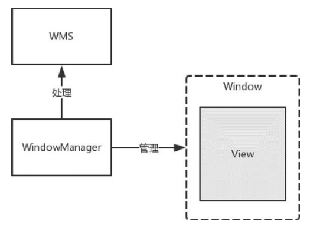
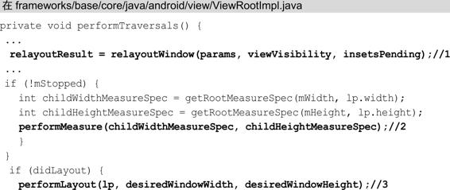

# 概览

从应用开发角度来看，WindowManager 是与 WMS 关联最紧密的类。为了更好地理解WMS，需要先了解WindowManager的相关知识。

本文介绍WindowManager体系、Window的属性和Window的操作。

# Window、WindowManager和WMS

1. Window 是一个抽象类，实现类是 PhoneWindow，它对View进行管理。

2. WindowManager是一个接口类，继承自接口ViewManager，实现类是WindowManagerImpl，用来管理Window。

3. WMS的主要功能是管理Window。如果我们想要对Window（View）进行添加、更新和删除操作就可以使用WindowManager，WindowManager会将具体的工作交由WMS来处理，WindowManager和WMS通过Binder来进行跨进程通信，WMS作为系统服务有很多API是不会暴露给WindowManager的，这一点与ActivityManager和AMS的关系有些类似。

   > WMS会在 `WMS.md` 中详细介绍，本文重点了解Window和WindowManager。

Window、WindowManager和WMS的关系如下：



Window包含了View并对View进行管理，Window用虚线来表示是因为Window是一个抽象概念，用来描述一个窗口 ， 并 不 是 真 实 存 在 的 ， Window 的实体其实也是 View 。WindowManager用来管理Window，而WindowManager所提供的功能最终会由WMS进行处理。

# WindowManager的关联类

下面通过源码分析WindowManager的关联类，以更好地理解Window和WindowManager的关系。

WindowManager 是一个接口，继承自接口 ViewManager，ViewManager 中定义了3个方法，分别用来添加、更新和删除View，如下所示：

```kotlin
public interface ViewManager {
    public void addView(View view, ViewGroup.LayoutParams params);
    public void updateViewLayout(View view, ViewGroup.LayoutParams params);
    public void removeView(View view);
}
```

WindowManager 也继承了这些方法，而这些方法传入的参数都是 View 类型，说明Window是以View的形式存在的。WindowManager在继承ViewManager的同时，又加入了很多功能，包括 Window 的类型和层级相关的常量、内部类以及一些方法，其中有两个方法是根据Window的特性加入的，如下所示：

```kotlin
 	// 使用 Context#getDisplay() 替代
	@Deprecated
    public Display getDefaultDisplay();

    public void removeViewImmediate(View view);
```

- `getDefaultDisplay()` 能够得知这个 WindowManager 实例将Window添加到哪个屏幕上了，换句话说，就是得到WindowManager所管理的屏幕（Display）。
- `removeViewImmediate()` 规定在这个方法返回前要立即执行 `View.onDetachedFromWindow()`，来完成传入的View 的相关销毁工作。

Window 是一个抽象类，实现类是 PhoneWindow。PhoneWindow是何时创建的呢？在 Activity 启动过程中会调用 ActivityThread 的 performLaunchActivity() -> Activity#attach()，PhoneWindow就是在Activity的attach()方法中创建的，如下所示：

```kotlin
    final void attach(Context context, ActivityThread aThread,
            Instrumentation instr, IBinder token, int ident,
            Application application, Intent intent, ActivityInfo info,
            CharSequence title, Activity parent, String id,
            NonConfigurationInstances lastNonConfigurationInstances,
            Configuration config, String referrer, IVoiceInteractor voiceInteractor,
            Window window, ActivityConfigCallback activityConfigCallback, IBinder assistToken,
            IBinder shareableActivityToken) {
        // 分析：创建 PhoneWindow
        mWindow = new PhoneWindow(this, window, activityConfigCallback);
        mWindow.setWindowControllerCallback(mWindowControllerCallback);
        mWindow.setCallback(this);
        mWindow.setOnWindowDismissedCallback(this);
        mWindow.getLayoutInflater().setPrivateFactory(this);
        if (info.softInputMode != WindowManager.LayoutParams.SOFT_INPUT_STATE_UNSPECIFIED) {
            mWindow.setSoftInputMode(info.softInputMode);
        }
        if (info.uiOptions != 0) {
            mWindow.setUiOptions(info.uiOptions);
        }
        
        // 分析：Window#setWindowManager()
        mWindow.setWindowManager(
                (WindowManager)context.getSystemService(Context.WINDOW_SERVICE),
                mToken, mComponent.flattenToString(),
                (info.flags & ActivityInfo.FLAG_HARDWARE_ACCELERATED) != 0);
        if (mParent != null) {
            mWindow.setContainer(mParent.getWindow());
        }
        mWindowManager = mWindow.getWindowManager();

        mWindow.setColorMode(info.colorMode);
        mWindow.setPreferMinimalPostProcessing(
                (info.flags & ActivityInfo.FLAG_PREFER_MINIMAL_POST_PROCESSING) != 0);
        ...
	}
```

上面的代码仅包含了与 Window 有关的部分。

分析：Window#setWindowManager()

```kotlin
    public void setWindowManager(WindowManager wm, IBinder appToken, String appName,
            boolean hardwareAccelerated) {
        mAppToken = appToken;
        mAppName = appName;
        mHardwareAccelerated = hardwareAccelerated;
        if (wm == null) {
            wm = (WindowManager)mContext.getSystemService(Context.WINDOW_SERVICE);
        }
        mWindowManager = ((WindowManagerImpl)wm).createLocalWindowManager(this);
    }
```

如果传入的WindowManager为null，就会在注释1处调用Context的getSystemService方法，并传入服务的名称Context.WINDOW_SERVICE（值为window），具体在ContextImpl中实现，如下所示：

- mContext.getSystemService(Context.WINDOW_SERVICE)

  ```kotlin
  ContextImpl#getSystemService
  	@Override
      public Object getSystemService(String name) {
  ...
          return SystemServiceRegistry.getSystemService(this, name);
      }
  ```

  SystemServiceRegistry#getSystemService()

  ```kotlin
  	static {
          // 用 name、class，注册 WINDOW_SERVICE
          // 并提供 ServiceFetcher（CachedServiceFetcher）用于获取服务
  		registerService(Context.WINDOW_SERVICE, WindowManager.class,
                  new CachedServiceFetcher<WindowManager>() {
              @Override
              public WindowManager createService(ContextImpl ctx) {
                  // 返回 WindowManagerImpl
                  return new WindowManagerImpl(ctx);
              }});
          ...注册其他服务
  	}
  
  	// SYSTEM_SERVICE_FETCHERS：以ServiceName为Key，ServiceFetcher 为Value。
  	// ServiceFetcher：可以获取到系统服务Binder
  	private static final Map<String, ServiceFetcher<?>> SYSTEM_SERVICE_FETCHERS =
              new ArrayMap<String, ServiceFetcher<?>>();
  	
  	// 在 SystemServiceRegistry 的 static 块中使用，用于注册服务
  	// 作用：
  	// 服务名称保存到 SYSTEM_SERVICE_NAMES 中
  	// 
      private static <T> void registerService(@NonNull String serviceName,
              @NonNull Class<T> serviceClass, @NonNull ServiceFetcher<T> serviceFetcher) {
          SYSTEM_SERVICE_NAMES.put(serviceClass, serviceName);
          // SYSTEM_SERVICE_FETCHERS 初始化
          SYSTEM_SERVICE_FETCHERS.put(serviceName, serviceFetcher);
          SYSTEM_SERVICE_CLASS_NAMES.put(serviceName, serviceClass.getSimpleName());
      }
  	
  	// 使用时，通过 SYSTEM_SERVICE_FETCHERS 获取到 ServiceFetcher
  	// 再通过 ServiceFetcher，获取到用 name 指定的服务
  	public static Object getSystemService(ContextImpl ctx, String name) {
          if (name == null) {
              return null;
          }
          final ServiceFetcher<?> fetcher = SYSTEM_SERVICE_FETCHERS.get(name);
          if (fetcher == null) {
  ...
              return null;
          }
  
          final Object ret = fetcher.getService(ctx);
          if (sEnableServiceNotFoundWtf && ret == null) {
              switch (name) {
                  case Context.CONTENT_CAPTURE_MANAGER_SERVICE:
  ...
                      return null;
              }
              return null;
          }
          return ret;
      }
  ```

  结论：mContext.getSystemService(Context.WINDOW_SERVICE)最终返回 `WindowManagerImpl`

- ((WindowManagerImpl)wm).createLocalWindowManager(this)

  ```kotlin
      public WindowManagerImpl createLocalWindowManager(Window parentWindow) {
          return new WindowManagerImpl(mContext, parentWindow, mWindowContextToken);
      }
  ```

  WindowManagerImpl#createLocalWindowManager()：用于创建WindowManagerImpl，并将创建它的 Window 作为参数传了进来，这样 WindowManagerImpl就持有了Window的引用，可以对Window进行操作，比如在Window中添加View，会调用WindowManagerImpl的addView方法，如下所示：

  ```kotlin
  public final class WindowManagerImpl implements WindowManager {
      // WindowManagerGlobal是一个单例，在一个进程中只有一个 WindowManagerGlobal 实例。
      private final WindowManagerGlobal mGlobal = WindowManagerGlobal.getInstance();
      public final Context mContext;
      private final Window mParentWindow;
      
      private WindowManagerImpl(Context context, Window parentWindow,
              @Nullable IBinder windowContextToken) {
          mContext = context;
          // 说明这个WindowManagerImpl 实例会作为哪个Window 的子 Window
          // 这也说明在一个进程中WindowManagerImpl可能会有多个实例
          mParentWindow = parentWindow;
          mWindowContextToken = windowContextToken;
          mWindowMetricsController = new WindowMetricsController(mContext);
      }
      
  	public void addView(@NonNull View view, @NonNull ViewGroup.LayoutParams params) {
          applyTokens(params);
  		// 分析：WindowManagerGlobal.addView
          mGlobal.addView(view, params, mContext.getDisplayNoVerify(), mParentWindow,
                  mContext.getUserId());
      }    
  }    
  ```

  **分析：WindowManagerGlobal.addView**

  最后一个参数 mParentWindow 就是上面提到的 Window，可以看出WindowManagerImpl 虽然是WindowManager 的实现类，但是没有实现什么功能，而是将功能实现委托给了WindowManagerGlobal，这里用到的是桥接模式。


PhoneWindow 继承自Window，Window 通过setWindowManager方法与 WindowManager 发生关联。WindowManager继承自接口 ViewManager，WindowManagerImpl 是 WindowManager 接口的实现类，但是具体的功能都会委托给WindowManagerGlobal来实现。

# Window的属性

前面讲了Window、WindowManager和WMS之间的关系，WMS是Window的最终管理者，Window好比是员工，WMS是老板，为了方便老板管理员工则需要定义一些“协议”，这些“协议”就是Window的属性，它们被定义在WindowManager的内部类LayoutParams中，了解Window的属性能够更好地理解WMS的内部原理。Window的属性有很多种，与应用开发最密切的有3种，分别是：

Type（Window的类型）、Flag（Window的标志）和SoftInputMode（软键盘相关模式）。

下面分别介绍这3种Window的属性。

## Window的类型和显示次序

Window 的类型有很多种，比如应用程序窗口、系统错误窗口、输入法窗口、PopupWindow、Toast、Dialog等。总的来说Window分为三大类型，分别是Application Window （应用程序窗口）、Sub Window（子窗口）、System Window（系统窗口），每个大类型中又包含了很多种类型， 它们都定义在 WindowManager 的静态内部类LayoutParams 中，接下来分别对这三大类型进行讲解。

### 1、应用程序窗口

Activity就是一个典型的应用程序窗口，应用程序窗口包含的类型如下所示：

```kotlin
public static class LayoutParams extends ViewGroup.LayoutParams implements Parcelable {
    // 应用程序窗口类型初始值
	public static final int FIRST_APPLICATION_WINDOW = 1;  
    // 窗口的基础值，其他的窗口值要大于这个值
	public static final int TYPE_BASE_APPLICATION   = 1;
    // 普通的应用程序窗口类型
    public static final int TYPE_APPLICATION        = 2;
    // 应用程序启动窗口类型，用于系统在应用程序窗口启动前显示的窗口
    public static final int TYPE_APPLICATION_STARTING = 3;
    public static final int TYPE_DRAWN_APPLICATION = 4;
    // 应用程序窗口类型结束值，也就是说应用程序窗口的Type值范围为1～99，这个数值的大小涉及窗口的层级，后面会讲到
    public static final int LAST_APPLICATION_WINDOW = 99;
}
```

应用程序窗口共包含了以上几种Type值。

### 2、子窗口

子窗口，顾名思义，它不能独立存在，需要附着在其他窗口才可以，PopupWindow就属于子窗口。子窗口的类型定义如下所示：

```kotlin
// 子窗口类型初始值
public static final int FIRST_SUB_WINDOW = 1000;
public static final int TYPE_APPLICATION_PANEL = FIRST_SUB_WINDOW;
public static final int TYPE_APPLICATION_MEDIA = FIRST_SUB_WINDOW + 1;
public static final int TYPE_APPLICATION_SUB_PANEL = FIRST_SUB_WINDOW + 2;
public static final int TYPE_APPLICATION_ATTACHED_DIALOG = FIRST_SUB_WINDOW + 3;
@UnsupportedAppUsage
public static final int TYPE_APPLICATION_MEDIA_OVERLAY  = FIRST_SUB_WINDOW + 4;
public static final int TYPE_APPLICATION_ABOVE_SUB_PANEL = FIRST_SUB_WINDOW + 5;
// 子窗口类型结束值
public static final int LAST_SUB_WINDOW = 1999;
```

可以看出子窗口的Type值范围为1000～1999。

### 3、系统窗口

Toast、输入法窗口、系统音量条窗口、系统错误窗口都属于系统窗口。系统窗口的类型定义如下所示：

```kotlin
// 系统参考类型初始值
public static final int FIRST_SYSTEM_WINDOW     = 2000;
// 系统状态栏窗口
public static final int TYPE_STATUS_BAR         = FIRST_SYSTEM_WINDOW;
// 搜索条窗口
public static final int TYPE_SEARCH_BAR         = FIRST_SYSTEM_WINDOW+1;
// 通话窗口
@Deprecated
public static final int TYPE_PHONE              = FIRST_SYSTEM_WINDOW+2;
// 系统 ALERT 窗口
@Deprecated
public static final int TYPE_SYSTEM_ALERT       = FIRST_SYSTEM_WINDOW+3;
// 锁屏窗口
public static final int TYPE_KEYGUARD           = FIRST_SYSTEM_WINDOW+4;
// TOAST窗口
@Deprecated
public static final int TYPE_TOAST              = FIRST_SYSTEM_WINDOW+5;	
...
// 系统参考类型结束值
public static final int LAST_SYSTEM_WINDOW      = 2999;
```

系统窗口的类型值有接近40个，这里只列出了一小部分，系统窗口的Type值范围为2000～2999。

### 4、窗口显示次序

1. 当一个进程向WMS申请一个窗口时，WMS会为窗口确定显示次序。为了方便窗口显示次序的管理，手机屏幕可以虚拟地用 X 、 Y 、 Z轴来表示，其中 Z 轴垂直于屏幕，从屏幕内指向屏幕外，这样确定窗口显示次序也就是确定窗口在 Z 轴上的次序，这个次序称为Z-Oder。
2. Type值是Z-Oder排序的依据，我们知道应用程序窗口的Type值范围为1～99，子窗口1000～1999，系统窗口2000～2999，在一般情况下，Type值越大则Z-Oder排序越靠前，就越靠近用户。
3. 当然窗口显示次序的逻辑不会这么简单，情况会比较多，举个常见的情况：当多个窗口的Type值都是TYPE_APPLICATION，这时WMS会结合各种情况给出最终的Z-Oder，这个逻辑不在本文的讨论范围，这里我们只需要知道窗口显示次序的基本规则就可以了。

## Window的标志

Window的标志也就是Flag，用于控制Window的显示，同样被定义在WindowManager的内部类LayoutParams中，一共有20多个，这里列出几个比较常用的标志：

格式：public static final int *FLAG_ALLOW_LOCK_WHILE_SCREEN_ON*     = 0x00000001;

| Flag                              | 描述                                                         |
| --------------------------------- | ------------------------------------------------------------ |
| FLAG_ALLOW_LOCK_WHILE_SCREEN_ON   | 只要窗口可见，就允许在开启状态的屏幕上锁屏                   |
| FLAG_DIM_BEHIND                   |                                                              |
| FLAG_BLUR_BEHIND                  |                                                              |
| FLAG_NOT_FOCUSABLE                | 窗口不能获得输入焦点，设置该标志的同时，FLAG_NOT_TOUCH_MODAL 也会被设置 |
| FLAG_NOT_TOUCHABLE                | 窗口不接收任何触摸事件                                       |
| FLAG_NOT_TOUCH_MODAL              | 将该窗口区域外的触摸事件传递给其他的 Window，而自己只会处理窗口区域内的触摸事件 |
| FLAG_TOUCHABLE_WHEN_WAKING        | @Deprecated                                                  |
| FLAG_KEEP_SCREEN_ON               | 只要窗口可见，屏幕就会一直亮着                               |
| FLAG_LAYOUT_IN_SCREEN             |                                                              |
| FLAG_LAYOUT_NO_LIMITS             | 允许窗口超过屏幕之外                                         |
| FLAG_FULLSCREEN                   | @Deprecated，隐藏所有的屏幕装饰窗口，比如在游戏、播放器中的全屏显示 |
| FLAG_FORCE_NOT_FULLSCREEN         | @Deprecated                                                  |
| FLAG_DITHER                       | @Deprecated                                                  |
| FLAG_SECURE                       |                                                              |
| FLAG_SCALED                       |                                                              |
| FLAG_IGNORE_CHEEK_PRESSES         | 当用户的脸贴近屏幕时（比如打电话），不会去响应此事件         |
| FLAG_LAYOUT_INSET_DECOR           | @Deprecated                                                  |
| FLAG_ALT_FOCUSABLE_IM             |                                                              |
| FLAG_WATCH_OUTSIDE_TOUCH          |                                                              |
| FLAG_SHOW_WHEN_LOCKED             | @Deprecated，窗口可以在锁屏的窗口之上显示                    |
| FLAG_SHOW_WALLPAPER               |                                                              |
| FLAG_TURN_SCREEN_ON               | @Deprecated，窗口显示时，将屏幕常亮                          |
| FLAG_DISMISS_KEYGUARD             | @Deprecated                                                  |
| FLAG_SPLIT_TOUCH                  |                                                              |
| FLAG_HARDWARE_ACCELERATED         |                                                              |
| FLAG_LAYOUT_IN_OVERSCAN           | @Deprecated                                                  |
| FLAG_TRANSLUCENT_STATUS           | @Deprecated                                                  |
| FLAG_TRANSLUCENT_NAVIGATION       | @Deprecated                                                  |
| FLAG_LOCAL_FOCUS_MODE             |                                                              |
| FLAG_SLIPPERY                     | @UnsupportedAppUsage @TestApi                                |
| FLAG_LAYOUT_ATTACHED_IN_DECOR     | @Deprecated                                                  |
| FLAG_DRAWS_SYSTEM_BAR_BACKGROUNDS |                                                              |

设置Window的Flag有3种方法

- 通过Window的addFlags方法：

  ```kotlin
  window.addFlags(WindowManager.LayoutParams.FLAG_FULLSCREEN)
  ```

- 通过Window的setFlags方法：

  ```kotlin
  window.setFlags(WindowManager.LayoutParams.FLAG_FULLSCREEN,WindowManager.LayoutParams.FLAG_FULLSCREEN)
  ```

  Window的addFlags方法内部会调用setFlags方法，因此前两种方法区别不大

- 给LayoutParams设置Flag，并通过WindowManager的addView方法进行添加：

  ```kotlin
  val windowLaParams = WindowManager.LayoutParams()
  windowLaParams.flags = WindowManager.LayoutParams.FLAG_FULLSCREEN
  val windowManager = getSystemService(Context.WINDOW_SERVICE)as WindowManager
  windowManager.addView(view,windowLaParams)
  ```

## 软键盘相关模式

窗口和窗口的叠加是十分常见的场景，但如果其中的窗口是软键盘窗口，可能就会出现一些问题，比如典型的用户登录界面，默认的情况弹出的软键盘窗口可能会盖住输入框下方的按钮，这样用户体验会非常糟糕。为了使软键盘窗口能够按照期望来显示，WindowManager的静态内部类LayoutParams中定义了软键盘相关模式，下面是常用的几个：

| SoftInputMode                    | 描述                                                       |
| -------------------------------- | ---------------------------------------------------------- |
| SOFT_INPUT_STATE_UNSPECIFIED     | 没有指定状态，系统会选择一个合适的状态或依赖于主题的设置   |
| SOFT_INPUT_STATE_UNCHANGED       | 不会改变软键盘状态                                         |
| SOFT_INPUT_STATE_HIDDEN          | 当用户进入该窗口时，软键盘默认隐藏                         |
| SOFT_INPUT_STATE_ALWAYS_HIDDEN   | 当窗口获取获取焦点时，软键盘总是被隐藏                     |
| SOFT_INPUT_STATE_VISIBLE         |                                                            |
| SOFT_INPUT_STATE_ALWAYS_VISIBLE  |                                                            |
| SOFT_INPUT_ADJUST_UNSPECIFIED    |                                                            |
| SOFT_INPUT_ADJUST_RESIZE         | 当软键盘弹出时，窗口会调整大小                             |
| SOFT_INPUT_ADJUST_PAN            | 当软键盘弹出时，窗口不需要调整大小，要确保输入焦点是可见的 |
| SOFT_INPUT_ADJUST_NOTHING        |                                                            |
| SOFT_INPUT_IS_FORWARD_NAVIGATION |                                                            |

这些属性可以通过如下方式设置：

AndroidManifest中 Activity 的属性 `android:windowSoftInputMode` ，或者代码设置：

```kotlin
window.setSoftInputMode(WindowManager.LayoutParams.SOFT_INPUT_MODE_CHANGED)
```

# Window的操作

WindowManager对Window进行管理，说到管理那就离不开对Window的添加、更新和删除操作，它们统称为Window 的操作。对于Window 的操作，最终都是交由WMS来进行处理的。

窗口的操作分为 WindowManager 处理部分，和 WMS 处理部分。Window分为三大类，分别是Application Window（应用程序窗口）、Sub Window（子窗口）和System Window（系统窗口），对于不同类型的窗口添加过程会有所不同，但是对于WMS处理部分，添加的过程基本上是一样的。


本文主要介绍 Window 操作的 WindowManager 处理部分，WMS处理部分在 WMS.md 中。

## 系统窗口的添加过程

Window 分为三大类型，不同类型的 Window 的添加过程也不尽相同，本节介绍系统窗口的添加过程。系统窗口的添加过程会根据不同的系统窗口有所区别，这里以系统窗口StatusBar为例，StatusBar 是 SystemUI 的重要组成部分，具体是指系统状态栏，用于显示时间、电量和信号等信息。

查看 StatusBar 的 addStatusBarWindow方法，这个方法负责为StatusBar添加Window，如下所示：


在注释 1 处用于构建 StatusBar 的视图。在注释 2 处调用了StatusBarWindowManager 的 add 方 法 ， 并将StatusBar 的视图（StatusBarWindowView） 和 StatusBar 的高度传进去，StatusBarWindowManager的add方法如下所示：


创建LayoutParams来配置StatusBar视图的属性，包括Width、Height、Type、Flag、Gravity、SoftInputMode 等。

在注释 1 处，设置了 TYPE_STATUS_BAR，表示StatusBar视图的窗口类型是状态栏。

在注释2处调用了WindowManager的addView方法，addView方法定义在WindowManager的父类接口ViewManager中，而addView方法则是在WindowManagerImpl中实现的，如下所示：


addView 方法的第一个参数的类型为 View，说明窗口也是以View 的形式存在的。addView方法中会调用WindowManagerGlobal的addView方法，如下所示：


在介绍addView方法前我们首先要了解WindowManagerGlobal中维护的和 Window操作相关的3个列表，在窗口的添加、更新和删除过程中都会涉及这3个列表，它们分别是 View 列表（ArrayList＜View＞mViews）、布局参数列表（ArrayList＜WindowManager.LayoutParams＞mParams ） 和 ViewRootImpl 列 表 （ ArrayList＜ViewRootImpl＞mRoots）。

了解了这3个列表后，我们接着分析addView方法：

1. 首先会对参数view、params和display进行检查。
2. 在注释 1 处，如果当前窗口要作为子窗口，就会根据父窗口对子窗口的 WindowManager.LayoutParams 类型的 wparams 对象进行相应调整。
3. 注释 3 处将添加的View保存到View列表中。
4. 注释5处将窗口的参数保存到布局参数列表中。
5. 注释2处创建了ViewRootImp并赋值给root，并在注释4处将root存入到ViewRootImpl列表中。
6. 注释6处将窗口和窗口的参数通过setView方法设置到ViewRootImpl中，可见我们添加窗口这一操作是通过ViewRootImpl来进行的。ViewRootImpl身负了很多职责，主要有以下几点：
   - View树的根并管理View树。
   - 触发View的测量、布局和绘制。
   - 输入事件的中转站。
   - 管理Surface。
   - 负责与WMS进行进程间通信。

了解了 `ViewRootImpl` 的职责后，来看 ViewRootImpl 的 setView 方法：


主要是调用了mWindowSession的addToDisplay方法，mWindowSession是IWindowSession类型的，它是一个Binder对象，用于进行进程间通信，IWindowSession是Client端的代理，它的Server端的实现为Session，此前的代码逻辑都是运行在本地进程的，而 Session 的addToDisplay方法则运行在WMS所在的进程（SystemServer进程）中，如图所示[ViewRootImpl与WMS通信图]。


从上图看出，本地进程的`ViewRootImpl`要想和`WMS`进行通信需要经过`Session`，那么Session为何包含在WMS中呢？往下看Session的addToDisplay方法，如下所示：


在addToDisplay方法中调用了WMS的addWindow方法，并将自身也就是Session作为参数传了进去，每个应用程序进程都会对应一个Session，WMS会用ArrayList来保存这些Session，这就是WMS包含Session的原因。

剩下的工作就交给WMS来处理，在WMS中会为这个添加的窗口分配Surface，并确定窗口显示次序，可见负责显示界面的是画布 Surface，而不是窗口本身。`WMS` 会将它所管理的 `Surface` 交由`SurfaceFlinger`处理，`SurfaceFlinger`会将这些`Surface`混合并绘制到屏幕上。

窗口添加的`WMS`处理部分会在 WMS.md 中介绍，系统窗口StatusBar的添加过程的时序图如图所示。


## Activity的添加过程

无论是哪种窗口，它的添加过程在 WMS 处理部分中基本是类似的，只不过会在权限和窗口显示次序等方面有些不同。但是在WindowManager处理部分会有所不同，这里以最典型的应用程序窗口Activity为例，Activity在启动过程中，如果Activity所在的进程不存在则会创建新的进程，创建新的进程之后就会运行代表主线程的实例 ActivityThread，ActivityThread 管理着当前应用程序进程的线程，这在 Activity 的启动过程中运用得很明显，当界面要与用户进行交互时，会调用ActivityThread的handleResumeActivity方法，如下所示：


1. 注释1处的performResumeActivity方法最终会调用Activity的onResume方法。
2. 注释2处得到ViewManager类型的wm对象
3. 注释3处调用了 ViewManager 的 addView 方法， 而 addView 方法则是在 WindowManagerImpl 中实现的， 此后的过程在上面的系统窗口StatusBar的添加过程中已经讲过，唯一需要注意的是ViewManager的addView方法的第一个参数为DecorView，这说明Acitivty窗口中会包含DecorView。

## Window的更新过程

Window 的更新过程和 Window 的添加过程是类似的。需要调用ViewManager 的updateViewLayout 方法，updateViewLayout 方法在WindowManagerImpl 中实现，WindowManagerImpl的updateViewLayout方法会调用WindowManagerGlobal的updateViewLayout方法，如下所示：


注释1处将更新的参数设置到View中。

注释2处得到要更新的窗口在View列表中的索引

注释3处在ViewRootImpl列表中根据索引得到窗口的ViewRootImpl

注释4和注释5处用于更新布局参数列表

注释6处调用 ViewRootImpl 的 setLayoutParams 方法将更新的参数设置到 ViewRootImpl 中。ViewRootImpl 的 setLayoutParams 方法在最后会调用ViewRootImpl的scheduleTraversals方法，如下所示：


注释1处的Choreographer译为“舞蹈指导”，用于接收显示系统的VSync信号，在下一个帧渲染时控制执行一些操作。Choreographer的postCallback方法用于发起添加回调，这个添加的回调将在下一帧被渲染执行。这个添加的回调指的是注释 1 处的TraversalRunnable类型的mTraversalRunnable，如下所示：


在TraversalRunnable的run方法中调用了doTraversal方法，如下所示：


在 doTraversal 方法中又调用了 performTraversals 方法，performTraversals 方法使得ViewTree开始View的工作流程，如下所示：




1. 注释 1 处的 relayoutWindow 方法内部会调用 IWindowSession的 relayout 方法来更新Window 视图，这一过程最终会调用 WMS 的 relayoutWindow 方法。
2. 在注释 2、3、4 处分别调用performMeasure、performLayout和performDraw方法，它们的内部又会调用View的measure、layout和draw方法，这样就完成了View的工作流程。
3. 在performTraversals方法中更新了Window视图，又执行Window中的View的工作流程，这样就完成了Window的更新。

Window的删除过程在 WMS.md 中介绍。

# 小结

本文学习了 WindowManager 的相关知识点 ， 包括 `WindowManager 的关联类`、`Window的属性`和`Window的操作`，了解了 `Window、WindowManager 和 WMS 之间的关系`，知道了Window的操作分为两大部分并且最终都是由WMS处理的，这是了解WMS基础。


# 参考

《Android进阶解密》