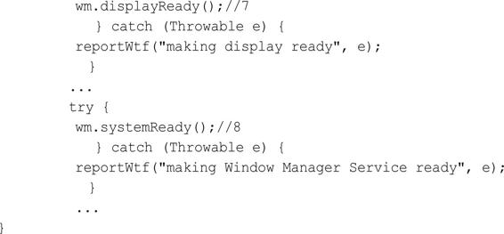
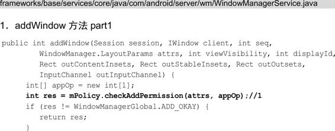

# 预备知识

WindowManager、Window

# 概览

WindowManagerService（WMS）不只是WindowManager的管理者，它还有很多重要的职责，本文将介绍：

1. WMS的职责
2. WMS的创建过程
3. WMS的重要成员
4. Window的添加和删除过程

# WMS的职责

WMS是Android中重要的服务，它是WindowManager的管理者，WMS无论对于应用开发还是Framework开发都是重要的知识点，究其原因是因为WMS有很多职责，每个职责都会涉及重要且复杂的系统，这使得WMS就像一个十字路口的交通灯一样，没有了这个交通灯，十字路口就无法正常通车。

WMS的职责用简洁的语言介绍主要有以下几点。

1. 窗口管理

   WMS是窗口的管理者，它负责窗口的启动、添加和删除，以及管理窗口的大小和层级。

   窗口管理的核心成员有DisplayContent、WindowToken和WindowState。

2. 窗口动画

   窗口间进行切换时，使用窗口动画可以显得更炫一些，窗口动画由WMS的动画子系统来负责，动画子系统的管理者为WindowAnimator。

3. 输入系统的中转站

   通过对窗口的触摸从而产生触摸事件，InputManagerService（IMS）会对触摸事件进行处理，它会寻找一个最合适的窗口来处理触摸反馈信息，WMS是窗口的管理者，它作为输入系统的中转站再合适不过了。

4. Surface管理

   窗口并不具备绘制的功能，因此每个窗口都需要有一块Surface来供自己绘制，为每个窗口分配Surface是由WMS来完成的。

WMS的职责可以简单总结为如图所示：

从WMS的职责可以看出WMS很复杂，与它关联的有窗口管理、窗口动画、输入系统和Surface，它们每一个都是重要且复杂的系统，本文只介绍其中的窗口管理，它和应用开发的关联比较紧密。

# WMS的创建过程

WMS是在SystemServer进程中创建的，SystemServer的main方法，如下所示：

在main方法中只调用了SystemServer的run方法，如下所示：

1. 注释1处加载了动态库libandroid_servers.so。
2. 注释2处创建SystemServiceManager，它会对系统的服务进行创建、启动和生命周期管理。
3. 注释3处的startBootstrapServices方法中用SystemServiceManager启动了ActivityManagerService、PowerManagerService、PackageManagerService等服务。
4. 注释4处的startCoreServices方法中则启动了DropBoxManagerService、BatteryService、UsageStatsService和WebViewUpdateService。
5. 注释5处的startOtherServices方法中启动了CameraService、AlarmManagerService、VrManagerService等服务。这些服务的父类均为SystemService。
6. 从注释3、注释4、注释5处的方法可以看出，官方把系统服务分为了三种类型，分别是引导服务、核心服务和其他服务，其中其他服务是一些非紧要和不需要立即启动的服务，WMS就是其他服务的一种。

下面看在startOtherServices方法中是如何启动WMS的：

startOtherServices方法用于启动其他服务，大概有100个左右，上面的代码只列出了WMS以及和它相关的IMS的启动逻辑，剩余的其他服务的启动逻辑也都大同小异。

1. 注释1、注释2处分别得到Watchdog实例并对它进行初始化，Watchdog用来监控系统的一些关键服务的运行状况。
2. 注释3处创建了IMS，并赋值给IMS类型的inputManager对象。
3. 注释4处执行了WMS的main方法，其内部会创建WMS，需要注意的是main方法其中一个传入的参数就是在注释1处创建的IMS，WMS是输入事件的中转站，其内部包含了IMS引用并不意外。结合上文，可以得知WMS的main方法是运行在SystemServer的run方法中的，换句话说就是运行在“system_server”线程中。
4. 注释5和注释6处分别将WMS和IMS注册到ServiceManager中，这样如果某个客户端想要使用WMS，就需要先去ServiceManager中查询信息，然后根据信息与WMS所在的进程建立通信通路，客户端就可以使用WMS了。
5. 注释7处用来初始化屏幕显示信息
6. 注释8处则用来通知WMS，系统的初始化工作已经完成，其内部调用了WindowManagerPolicy的systemReady方法。

查看注释4处WMS的main方法，如下所示：

1. 注释1处调用了DisplayThread的getHandler方法，用来得到DisplayThread的Handler实例。DisplayThread是一个单例的前台线程，这个线程用来处理需要低延时显示的相关操作，并只能由WindowManager、DisplayManager和InputManager实时执行快速操作。runWithScissors方法中使用了Lambda表达式，等价于如下代码：

   

2. 注释2处创建了WMS的实例，这个过程运行在Runnable的run方法中，而Runnable则传到了DisplayThread对应Handler的runWithScissors方法中，说明WMS的创建是运行在android.display线程中的。需要注意的是，runWithScissors方法的第二个参数传入的是0，后面会提到。

下面查看Handler的runWithScissors方法做了什么：

开头对传入的Runnable和timeout进行判断，如果Runnable为null或者timeout小于0则抛出异常。

注释1处根据每个线程只有一个Looper的原理来判断当前的线程（system_server线程）是否是Handler所指向的线程（android.display线程），如果是则直接执行Runnable的run方法，如果不是则调用BlockingRunnable的postAndWait方法，并将当前线程的Runnable作为参数传进去，BlockingRunnable是Handler的内部类，代码如下所示：

在注释2处将当前的BlockingRunnable添加到Handler的任务队列中。前面runWithScissors方法的第二个参数为0，因此timeout等于0，这样如果mDone为false的话会一直调用注释3处的wait方法使得当前线程（system_server线程）进入等待状态，那么等待的是哪个线程呢？我们往上看，在注释1处执行了传入的Runnable的run方法（运行在android.display线程），执行完毕后在finally代码块中将mDone设置为true，并调用notifyAll方法唤醒处于等待状态的线程，这样就不会继续调用注释3处的wait方法。因此得出结论，system_server线程等待的就是android.display线程，一直到android.display线程执行完毕再执行system_server线程，这是因为android.display线程内部执行了WMS的创建，而WMS的创建优先级要更高。

WMS的创建就讲到这里，最后查看WMS的构造方法：

1. 注释1处用来保存传进来的IMS，这样WMS就持有了IMS的引用。
2. 注释2处通过DisplayManager的getDisplays方法得到Display数组（每个显示设备都有一个Display实例）
3. 接着遍历Display数组，在注释3处的createDisplayContentLocked方法将Display封装成DisplayContent，DisplayContent用来描述一块屏幕。
4. 注释4处得到AMS实例，并赋值给mActivityManager，这样WMS就持有了AMS的引用。
5. 注释5处创建了WindowAnimator，它用于管理所有的窗口动画。
6. 注释6处初始化了窗口管理策略的接口类WindowManagerPolicy（WMP），它用来定义一个窗口策略所要遵循的通用规范。
7. 注释7处将自身也就是WMS通过addMonitor方法添加到Watchdog中，Watchdog用来监控系统的一些关键服务的运行状况（比如传入的WMS的运行状况），这些被监控的服务都会实现Watchdog.Monitor接口。Watchdog每分钟都会对被监控的系统服务进行检查，如果被监控的系统服务出现了死锁，则会杀死Watchdog所在的进程，也就是SystemServer进程。

查看注释6处的initPolicy方法，如下所示：

initPolicy方法和此前讲的WMS的main方法的实现类似，在注释1处执行了WMP的init方法，WMP是一个接口，init方法具体在PhoneWindowManager（PWM）中实现。PWM的init方法运行在android.ui线程中，它的优先级要高于initPolicy方法所在的android.display线程，因此android.display线程要等PWM的init方法执行完毕后，处于等待状态的android.display线程才会被唤醒从而继续执行下面的代码。本文共提到了3个线程，分别是system_server、android.display和android.ui，为了便于理解，下面给出这3个线程之间的关系，如图8-2所示。

从上图可以看出，三个线程之间的关系分为三个步骤来实现：

1. 首先在system_server线程中执行了SystemServer的startOtherServices方法，在startOtherServices方法中会调用WMS的main方法，main方法会创建WMS，创建的过程在android.display线程中实现，创建WMS的优先级更高，因此system_server线程要等WMS创建完成后，处于等待状态的system_server线程才会被唤醒从而继续执行下面的代码。
2. 在WMS的构造方法中会调用WMS的initPolicy方法，在initPolicy方法中又会调用PWM的init方法，PWM的init方法在android.ui线程中运行，它的优先级要高于android.display线程，因此“android.display”线程要等PWM的init方法执行完毕后，处于等待状态的android.display线程才会被唤醒从而继续执行下面的代码。
3. PWM的init方法执行完毕后，android.display线程就完成了WMS的创建，等待的system_server线程被唤醒后继续执行WMS的main方法后的代码逻辑，比如WMS的displayReady方法用来初始化屏幕显示信息（SystemServer的startOtherServices方法的注释7处）。

# WMS的重要成员

要想更好地理解WMS，不但要了解WMS是如何创建的，还要知道WMS的重要成员，这里的重要成员指的是WMS的部分成员变量，如下所示：

上面的代码列出了WMS的部分成员变量，下面分别对它们进行简单介绍。

1. mPolicy:WindowManagerPolicy

   mPolicy是WindowManagerPolicy（WMP）类型的变量。WindowManagerPolicy是窗口管理策略的接口类，用来定义一个窗口策略所要遵循的通用规范，并提供了WindowManager所有的特定的UI行为。它的具体实现类为PhoneWindowManager，这个实现类在WMS创建时被创建。WMP允许定制窗口层级和特殊窗口类型以及关键的调度和布局。

2. mSessions:ArraySet

   mSessions是ArraySet类型的变量，元素类型为Session，它主要用于进程间通信，其他的应用程序进程想要和WMS进程进行通信就需要经过Session，并且每个应用程序进程都会对应一个Session，WMS保存这些Session用来记录所有向WMS提出窗口管理服务的客户端。

3. mWindowMap:WindowHashMap

   mWindowMap是WindowHashMap类型的变量，WindowHashMap继承了HashMap，它限制了HashMap的key值的类型为IBinder，value值的类型为WindowState。WindowState用于保存窗口的信息，在WMS中它用来描述一个窗口。综上得出结论，mWindowMap就是用来保存WMS中各种窗口的集合。

4. mFinishedStarting:ArrayList

   mFinishedStarting是ArrayList类型的变量，元素类型为AppWindowToken，它是WindowToken的子类。要想理解mFinishedStarting的含义，需要先了解WindowToken是什么。WindowToken主要有两个作用：

   - 可以理解为窗口令牌，当应用程序想要向WMS申请新创建一个窗口，则需要向WMS出示有效的WindowToken。AppWindowToken作为WindowToken的子类，主要用来描述应用程序的WindowToken结构，应用程序中每个Activity都对应一个AppWindowToken。

   - WindowToken会将同一个组件（比如同一个Activity）的窗口（WindowState）集合在一起，方便管理。mFinishedStarting就是用于存储已经完成启动的应用程序窗口（比如Activity）的AppWindowToken的列表。除了mFinishedStarting外，还有类似的mFinishedEarlyAnim和mWindowReplacementTimeouts，其中mFinishedEarlyAnim存储了已经完成窗口绘制并且不需要展示任何已保存surface的应用程序窗口的AppWindowToken。mWindowReplacementTimeout存储了等待更换的应用程序窗口的AppWindowToken，如果更换不及时，旧窗口就需要被处理。

5. mResizingWindows:ArrayList

   mResizingWindows是ArrayList类型的变量，元素类型为WindowState。mResizingWindows是用来存储正在调整大小的窗口的列表。与mResizingWindows类似的还有mPendingRemove、mDestroySurface和mDestroyPreservedSurface等，其中mPendingRemove是在内存耗尽时设置的，里面存有需要强制删除的窗口，mDestroySurface里面存有需要被销毁的Surface，mDestroyPreservedSurface里面存有窗口需要保存的等待销毁的Surface，为什么窗口要保存这些Surface？这是因为当窗口经历Surface变化时，窗口需要一直保持旧Surface，直到新Surface的第一帧绘制完成。

6. mAnimator:WindowAnimator

   mAnimator是WindowAnimator类型的变量，用于管理窗口的动画以及特效动画。

7. mH:H

   mH是H类型的变量，系统的Handler类，用于将任务加入到主线程的消息队列中，这样代码逻辑就会在主线程中执行。

8. mInputManager:InputManagerService

   mInputManager是InputManagerService类型的变量，输入系统的管理者。InputManagerService（IMS）会对触摸事件进行处理，它会寻找一个最合适的窗口来处理触摸反馈信息，WMS是窗口的管理者，因此WMS作为输入系统的中转站是再合适不过了。

# Window的添加过程（WMS处理部分）

Window的操作分为两大部分，一部分是WindowManager处理部分，另一部分是WMS处理部分。在 WindowManager.md 中，学习了Window添加过程的WindowManager处理部分，这一节学习Window的添加过程的WMS处理部分。无论是系统窗口还是Activity，它们的Window的添加过程都会调用WMS的addWindow方法，由于这个方法代码逻辑比较多，这里分为3个部分来阅读。

WMS的addWindow返回的是addWindow的各种状态，比如添加Window成功，无效的display等，这些状态被定义在WindowManagerGlobal中。

注释1处根据Window的属性，调用WMP的checkAddPermission方法来检查权限，具体在PhoneWindowManager的checkAddPermission方法中实现，如果没有权限则不会执行后续的代码逻辑。

注释2处通过displayId来获得窗口要添加到哪个DisplayContent上，如果没有找到DisplayContent，则返回WindowManagerGlobal.ADD_INVALID_DISPLAY这一状态，其中DisplayContent用来描述一块屏幕。

注释3处，type代表一个窗口的类型，它的数值介于FIRST_SUB_WINDOW和LAST_SUB_WINDOW之间（1000～1999），这个数值定义在WindowManager中，说明这个窗口是一个子窗口。

注释4处，attrs.token是IBinder类型的对象，windowForClientLocked方法内部会根据attrs.token作为key值从mWindowMap中得到该子窗口的父窗口。接着对父窗口进判断，如果父窗口为null或者type的取值范围不正确则会返回错误的状态。

**addWindow方法part2**

1. 注释1处通过displayContent的getWindowToken方法得到WindowToken。
2. 注释2处，如果有父窗口就将父窗口的type值赋值给rootType，如果没有将当前窗口的type值赋值给rootType。接下来如果WindowToken为null，则根据rootType或者type的值进行区分判断，如果rootType值等于TYPE_INPUT_METHOD、TYPE_WALLPAPER等值时，则返回状态值WindowManagerGlobal.ADD_BAD_APP_TOKEN，说明rootType值等于TYPE_INPUT_METHOD、TYPE_WALLPAPER等值时是不允许WindowToken为null的。
3. 通过多次的条件判断筛选，最后会在注释3处隐式创建WindowToken，这说明当我们添加窗口时可以不向WMS提供WindowToken，前提是rootType和type的值不为前面条件判断筛选的值。WindowToken隐式和显式的创建肯定是要加以区分的，注释3处的第4个参数为false就代表这个WindowToken是隐式创建的。接下来的代码逻辑就是WindowToken不为null的情况，根据rootType和type的值进行判断，比如在注释4处判断如果窗口为应用程序窗口，在注释5处将WindowToken转换为专门针对应用程序窗口的AppWindowToken，然后根据AppWindowToken的值进行后续的判断。

**addWindow方法part3**

1. 注释1处创建了WindowState，它存有窗口的所有的状态信息，在WMS中它代表一个窗口。在创建WindowState传入的参数中，this指的是WMS，client指的是IWindow，IWindow会将WMS中窗口管理的操作回调给ViewRootImpl，token指的是WindowToken。
2. 在注释2和注释3处分别判断请求添加窗口的客户端是否已经死亡、窗口的DisplayContent是否为null，如果是则不会再执行下面的代码逻辑。
3. 注释4处调用了WMP的adjustWindowParamsLw方法，该方法在PhoneWindowManager中实现，此方法会根据窗口的type对窗口的LayoutParams的一些成员变量进行修改。
4. 注释5处调用WMP的prepareAddWindowLw方法，用于准备将窗口添加到系统中。
5. 注释6处将WindowState添加到mWindowMap中。
6. 注释7处将WindowState添加到该WindowState对应的WindowToken中（实际是保存在WindowToken的父类WindowContainer中），这样WindowToken就包含了同一个组件的WindowState。

**addWindow方法总结**

addWindow方法分了3个部分来进行讲解，主要就是做了下面4件事：

1. 对所要添加的窗口进行检查，如果窗口不满足一些条件，就不会再执行下面的代码逻辑。
2. WindowToken相关的处理，比如有的窗口类型需要提供WindowToken，没有提供的话就不会执行下面的代码逻辑，有的窗口类型则需要由WMS隐式创建WindowToken。
3. WindowState的创建和相关处理，将WindowToken和WindowState相关联。
4. 创建和配置DisplayContent，完成窗口添加到系统前的准备工作。

# Window的删除过程

和Window的创建和更新过程一样，要删除Window需要先调用WindowManagerImpl的removeView方法，在removeView方法中又会调用WindowManagerGlobal的removeView方法。为了表述得更易于理解，本节将`要删除的Window（View）简称为V`。WindowManagerGlobal的removeView方法如下所示：

在注释1处找到要V在View列表中的索引，在注释2处调用了removeViewLocked方法并将这个索引传进去，如下所示：

在注释1处根据传入的索引在ViewRootImpl列表中获得V的ViewRootImpl。

在注释2处得到InputMethodManager实例，如果InputMethodManager实例不为null，则在注释3处调用InputMethodManager的windowDismissed方法来结束V的输入法相关的逻辑。

在注释4处调用ViewRootImpl的die方法，如下所示：

在注释1处如果immediate为ture（需要立即执行），并且mIsInTraversal值为false则执行注释2处的代码，mIsInTraversal在执行ViewRootImpl的performTraversals方法时会被设置为true，在performTraversals方法执行完时被设置为false，因此注释1处可以理解为die方法需要立即执行并且此时ViewRootImpl不再执行performTraversals方法。在注释2处的doDie方法如下所示：

1. 在注释1处用于检查执行doDie方法的线程的正确性，在注释1处的内部会判断执行doDie方法线程是否是创建V的原始线程，如果不是就会抛出异常，这是因为只有创建V的原始线程才能够操作V。
2. 注释2到注释3处的代码用于防止doDie方法被重复调用。
3. 注释4处V有子View就会调用注释5处的dispatchDetachedFromWindow方法来销毁View。
4. 注释6处如果V有子View并且不是第一次被添加，就会执行后面的代码逻辑。
5. 注释7处的WindowManagerGlobal的doRemoveView方法，如下所示：

在WindowManagerGlobal中维护了和Window操作相关的三个列表，doRemoveView方法会从这三个列表中清除V对应的元素。在注释1处找到V对应的ViewRootImpl在ViewRootImpl列表中的索引，接着根据这个索引从ViewRootImpl列表、布局参数列表和View列表中删除与V对应的元素。

接着回到ViewRootImpl的doDie方法，查看注释5处的dispatchDetachedFromWindow方法做了什么：

在dispatchDetachedFromWindow方法中主要调用了IWindowSession的remove方法，IWindowSession在Server端的实现为Session。Session的remove方法如下所示：

接着查看WMS的removeWindow方法：

在注释1处用于获取Window对应的WindowState，WindowState用于保存窗口的信息，在WMS中它用来描述一个窗口。

注释2处调用WindowState的removeIfPossible方法，如下所示：

又会调用removeIfPossible方法，如下所示：

removeIfPossible方法和它的名字一样，并不是直接执行删除操作的，而是进行多个条件判断过滤，满足其中一个条件就会return，推迟删除操作。比如V正在运行一个动画，这时就得推迟删除操作，直到动画完成。通过这些条件判断过滤就会执行注释1处的removeImmediately方法：

1. removeImmediately方法如同它的名字一样，用于立即进行删除操作。
2. 注释1处的mRemoved为true意味着正在执行删除Window操作，在注释1到注释2处之间的代码用于防止重复删除操作。
3. 注释3处如果当前要删除的Window是StatusBar或者NavigationBar就会将这个Window从对应的控制器中删除。
4. 注释4处将V对应的Session从WMS的ArraySet＜Session＞mSessions中删除并清除Session对应的SurfaceSession资源（SurfaceSession是SurfaceFlinger的一个连接，通过这个连接可以创建1个或者多个Surface并渲染到屏幕上）。
5. 注释5处调用了WMS的postWindowRemoveCleanupLocked方法用于对V进行一些集中的清理工作。

Window的删除过程就讲到这里，虽然删除的操作逻辑比较复杂，但是可以简单地总结为以下4点：

1. 检查删除线程的正确性，如果不正确就抛出异常。
2. 从ViewRootImpl列表、布局参数列表和View列表中删除与V对应的元素。
3. 判断是否可以直接执行删除操作，如果不能就推迟删除操作。
4. 执行删除操作，清理和释放与V相关的一切资源。

# 总结

本文介绍了WMS的职责以及Window的添加和删除过程等知识点，从WMS的职责可以看出WMS很复杂，与它关联的有窗口管理、窗口动画、输入系统和Surface，它们每一个都是重要且复杂的系统。

本文只介绍了其中的窗口管理，它和应用开发的关联比较紧密，其他WMS关联的系统还需要学习。

# 参考

《Android进阶解密》