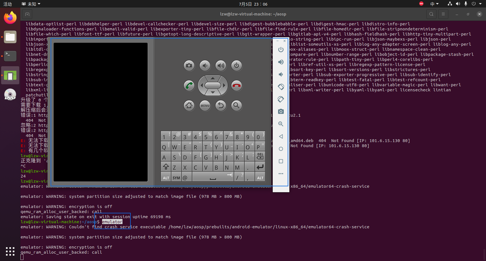
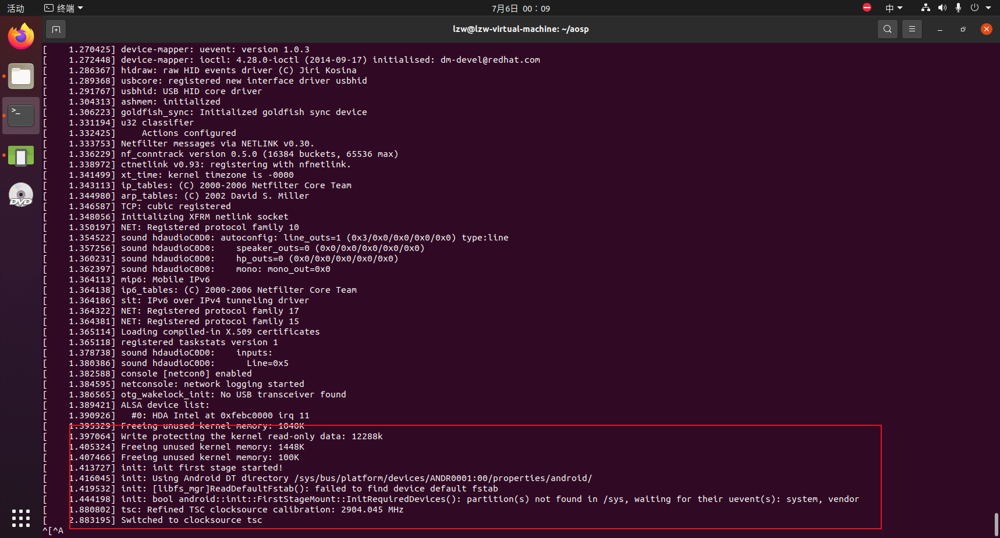
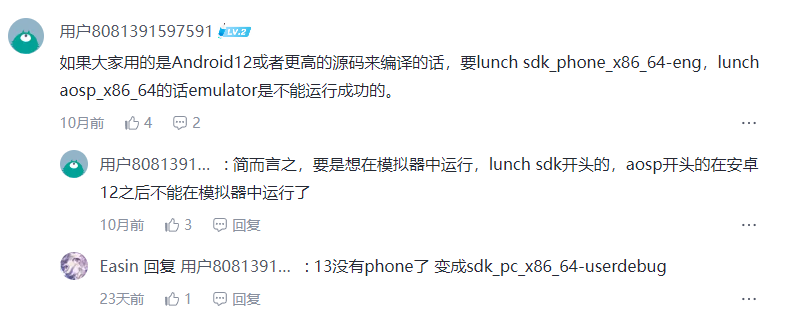

[AOSP官方CodeLab](https://source.android.google.cn/docs/setup/start?hl=zh-cn)

# 下载源码

## 初始化仓库并同步远程代码

```kotlin
mkdir aosp 
cd asop
#初始化仓库,-b 指示分支，这里使用 android10
// 通过这行，可以切换分支，切换后要repo sync一下
repo init -u https://mirrors.tuna.tsinghua.edu.cn/git/AOSP/platform/manifest -b android-10.0.0_r41 

#同步远程代码 
repo sync
```


# build流程

```kotlin
// 初始化
source build/envsetup.sh
// 选择版本
lunch aosp_x86_64-eng
// 编译
make -j12
// 打开模拟器
emulator
```

## 步骤1：初始化

进入源码目录初始化编译环境

目录：你的源码目录中，我的在aosp/build/envsetup.sh。

```kotlin
source build/envsetup.sh
```

## 步骤2：lunch目标版本

查看可选版本：`lunch`

```kotlin
lzw@lzw-virtual-machine:~/aosp$ lunch

You're building on Linux

Lunch menu... pick a combo:
     1. aosp_arm-eng
// 在下面输入序号或者名称都可以，比如 1 或者 aosp_arm-eng
Which would you like? [aosp_arm-eng]
```

选完确定后输出如下：

```kotlin
Which would you like? [aosp_arm-eng] aosp_car_x86_64-userdebug

============================================
PLATFORM_VERSION_CODENAME=REL
PLATFORM_VERSION=10
TARGET_PRODUCT=aosp_car_x86_64
TARGET_BUILD_VARIANT=userdebug
TARGET_BUILD_TYPE=release
TARGET_ARCH=x86_64
TARGET_ARCH_VARIANT=x86_64
TARGET_2ND_ARCH=x86
TARGET_2ND_ARCH_VARIANT=x86_64
HOST_ARCH=x86_64
HOST_2ND_ARCH=x86
HOST_OS=linux
HOST_OS_EXTRA=Linux-5.15.0-97-generic-x86_64-Ubuntu-20.04.6-LTS
HOST_CROSS_OS=windows
HOST_CROSS_ARCH=x86
HOST_CROSS_2ND_ARCH=x86_64
HOST_BUILD_TYPE=release
BUILD_ID=QQ3A.200805.001
OUT_DIR=out
============================================
```

## 步骤3：编译

make -j12

## 步骤4：启动模拟器

```kotlin
emulator
```

拓展：

```kotlin
// 可选，打印出日志
emulator -verbose -show-kernel -shell

// -partition-size 3000 分区大小设置
emulator -partition-size 3000
```


# 成功编译&启动模拟器的版本

```kotlin
repo init -u https://mirrors.tuna.tsinghua.edu.cn/git/AOSP/platform/manifest -b android-10.0.0_r41

lunch aosp_x86_64-eng
```


# 问题记录

###### 问题

编译Android13时，emulator打开模拟器一直是黑屏

```kotlin
emulator: WARNING: Couldn't find crash service executable /home/lzw/aosp/prebuilts/android-emulator/linux-x86_64/emulator64-crash-service

emulator: WARNING: system partition size adjusted to match image file (978 MB > 800 MB)

emulator: WARNING: encryption is off
qemu_ram_alloc_user_backed: call
```



解决：emulator: WARNING: system partition size adjusted to match image file (978 MB > 800 MB)

```kotlin
emulator -partition-size 3000
```

结果：

命令：emulator -verbose -show-kernel -shell

作用：显示启动时的详细日志

```kotlin
[    1.405162] Freeing unused kernel memory: 1448K
[    1.407117] Freeing unused kernel memory: 100K
[    1.413100] init: init first stage started!
[    1.415277] init: Using Android DT directory /sys/bus/platform/devices/ANDR0001:00/properties/android/
[    1.418990] init: [libfs_mgr]ReadDefaultFstab(): failed to find device default fstab
[    1.433399] init: bool android::init::FirstStageMount::InitRequiredDevices(): partition(s) not found in /sys, waiting for their uevent(s): system, vendor
[    2.854131] Switched to clocksource tsc
```



解决：还没有解决掉。这个是编译Android13时遇到的问题，后来换成了Android10编译成功了。

下面是看到的解决方案，还没有验证过。




## 问题

You have tried to change the API from what has been previously released in an SDK.  Please fix the errors listed above.

解决：

```kotlin
make clean
// 可能会没有这个文件，就不用管这行
rm framework/base/api/curent.txt
make update-api
lunch full-eng
make -j8
```


# 参考

[[视频教程]写给应用开发的 Android Framework 教程——玩转 AOSP 篇之极速上手](https://juejin.cn/post/7202634945171537977#heading-8)
