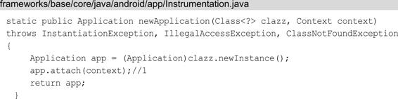
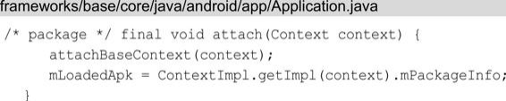

# 理解上下文Context

关联章节： 第4章 四大组件的工作过程

Context 也就是上下文对象，是 Android 常用的类，但是对于Context，很多人都停留在会用的阶段，本章将带领大家从源码角度来分析Context，从而更加深入地理解它。Android中的四大组件都会涉及Context，因此我们在第4章经常会看到Context的身影，比如启动 Service 会调用 ContextWrapper 以及 ContextImpl 的 startService 方 法 ， ContextWrapper 以 及ContextImpl就是Context的关联类，理解这些Context的关联类可以更好地理解第4章的内容，本章内容和第4章的内容相辅相成，并且有一些重复的内容，对于重复的内容，本章不会赘述，建议先阅读第4章的内容再来阅读本章内容，阅读完本章后回过头重新阅读第4章的内容，这样你会有更多的发现。

# 5.1 Context的关联类

Context意为上下文，是一个应用程序环境信息的接口。在开发中我们经常使用Context，它的使用场景总的来说分为两大类，它们分别是：

· 使用Context调用方法，比如启动Activity、访问资源、调用系统级服务等。

· 调用方法时传入Context，比如弹出Toast、创建Dialog等。Activity、Service和Application都间接地继承自Context，因此我们可以计算出一个应用程序进程中有多少个Context，这个数量等于Activity和Service的总个数加1，1指的是Application的数量。Context 是一个抽象类，它的内部定义了很多方法以及静态常量，它的具体实现类为ContextImpl。和 Context 相关联的类，除了ContextImpl ， 还 有 ContextWrapper 、 ContextThemeWrapper 和Activity等，如图5-1所示。

图5-1 Context的关联类

从图 5-1 中我们可以看出，ContextImpl 和 ContextWrapper 继承自 Context，ContextWrapper 内部包含 Context 类型的 mBase 对象，mBase 具体指向 ContextImpl。ContextImpl 提供了很多功能，但是外界需要使用并拓展ContextImpl 的功能，因此设计上使用了装饰模式，ContextWrapper是装饰类，它对ContextImpl进行包装，ContextWrapper主要是起了方法传递的作用，ContextWrapper中几乎所 有 的 方 法 都 是 调 用 ContextImpl 的 相 应 方 法 来 实 现 的 。ContextThemeWrapper 、 Service 和 Application 都 继 承 自ContextWrapper，这样它们都可以通过mBase来使用Context的方法，同时它们也是装饰类，在ContextWrapper的基础上又添加了不同的功能。ContextThemeWrapper 中包含和主题相关的方法（比如getTheme方法），因此，需要主题的Activity继承ContextThemeWrapper，而不需要主题的Service继承ContextWrapper。

Context的关联类采用了装饰模式，主要有以下的优点：

· 使用者（比如Service）能够更方便地使用Context。

· 如果ContextImpl发生了变化，它的装饰类ContextWrapper不需要做任何修改。

· ContextImpl的实现不会暴露给使用者，使用者也不必关心ContextImpl的实现。

· 通过组合而非继承的方式，拓展ContextImpl的功能，在运行时选择不同的装饰类，实现不同的功能。

为了更好地理解Context的关联类的设计理念，就需要理解Application、Activity、Service的Context的创建过程，下面分别对它们进行介绍。

# 5.2 Application Context的创建过程

我们通过调用getApplicationContext来获取应用程序全局的Application Context，那么Application Context是如何创建的呢？在 一 个 应 用 程 序 启 动 完 成 后 ， 应 用 程 序 就 会 有 一 个 全 局 的Application Context，那么我们就从应用程序启动过程开始着手。Application Context的创建过程的时序图如图5-2所示。

图5-2 Application Context的创建过程的时序图

ActivityThread 类作为应用程序进程的主线程管理类，它会调用它的内部类ApplicationThread的scheduleLaunchActivity方法来启动Activity，如下所示：

在ApplicationThread的scheduleLaunchActivity方法中向H类发送LAUNCH_ACTIVITY类型的消息，目的是将启动Activity的逻辑放在主线程的消息队列中，这样启动Activity的逻辑会在主线程中执行。我们接着查看H类的handleMessage方法对LAUNCH_ACTIVITY类型的消息的处理：

H继承自Handler，是ActivityThread的内部类。在注释1处通过getPackageInfoNoCheck方法获得 LoadedApk 类型的对象，并将该对象赋值给 ActivityClientRecord 的成员变量packageInfo，其中LoadedApk 用 来 描 述 已 加 载 的 APK 文 件 。 在 注 释 2 处 调 用 了ActivityThread的handleLaunchActivity方法，如下所示：

在 handleLaunchActivity 方 法 中 调 用 了 ActivityThread 的performLaunchActivity方法：

在 performLaunchActivity 方法中有很多重要的逻辑，这里只保留 了 和 Application Context 相 关 的 逻 辑 ， 想 要 了 解 更 多performLaunchActivity 方 法 中 的 逻 辑 请 查 看 4.1.3 节 的 内 容 。ActivityClientRecord的成员变量packageInfo是LoadedApk类型的，我们接着来查看LoadedApk的makeApplication方法，如下所示：

在注释1处如果mApplication不为null则返回mApplication，这里假设是第一次启动应用程序，因此mApplication为null。在注释2处通过ContextImpl的createAppContext方法来创建 ContextImpl。注释 3处 的 代 码 用 来 创 建 Application ， 在 Instrumentation 的newApplication方法中传入了ClassLoader类型的对象以及注释2处创建的ContextImpl。在注释4处将Application赋值给ContextImpl的Context类型的成员变量mOuterContext，这样ContextImpl中也包含了Application的引用。在注释5处将Application赋值给LoadedApk的成员变量 mApplication，这个 mApplication 是 Application 类型的对象，它用来代表Application Context，在Application Context的获取过程中我们会再次提到mApplication。下面来查看注释3处的Application是如何创建的，Instrumentation的newApplication方法如下所示：

Instrumentation中有两个newApplication重载方法，最终会调用上面这个重载方法。注释1 处通过反射来创建Application，并调用了Application 的attach 方法，将ContextImpl传进去，最后返回该Application，Application的attach方法如下所示：

在 attach 方 法 中 调 用 了 attachBaseContext 方 法 ， 它 在Application的父类ContextWrapper中实现，代码如下所示：

这个 base 一路传递过来指的是 ContextImpl，它是 Context 的实现类，将 ContextImpl赋值给ContextWrapper的Context类型的成员变量mBase，这样在ContextWrapper中就可以使用Context的方法，而Application继承自ContextWrapper，同样可以使用Context的方法。Application 的 attach 方法的作用就是使 Application 可以使用Context 的方法，这样Application 才可 以用 来代 表ApplicationContext。

Application Context的创建过程就讲到这里，接下来我们来学习Application Context的获取过程。

# 5.3 Application Context的获取过程

当我们熟知了Application Context的创建过程之后，那么它的获取过程会非常好理解。我们通过调用getApplicationContext方法来获得 Application Context ， getApplicationContext 方 法 在ContextWrapper中实现，如下所示：

mBase 指 的 是 ContextImpl ， 我 们 来 查 看 ContextImpl 的getApplicationContext方法：

如果LoadedApk类型的mPackageInfo不为null，则调用LoadedApk的getApplication方法，否则调用AvtivityThread的getApplication方法。由于应用程序这时已经启动，因此LoadedApk不会为null，则会调用LoadedApk的getApplication方法，如下所示：

这里的mApplication我们应该很熟悉，它在上文LoadedApk的makeApplication 方 法 的 注 释 5 处 被 赋 值 。 这 样 我 们 通 过getApplicationContext方法就获取到了Application Context。

# 5.4 Activity的Context创建过程

想要在Activity中使用Context提供的方法，务必要先创建Context。Activity的Context会在Activity的启动过程中被创建，在4.1.3节中讲到了ActivityThread启动Activity的过程，我们就从这里开始分析。Activity的Context创建过程的时序图如图5-3所示。

图5-3 Activity的Context创建过程的时序图

ActivityThread是应用程序进程的主线程管理类，它的内部类ApplicationThread 会 调 用 scheduleLaunchActivity 方 法 来 启 动Activity，scheduleLaunchActivity方法如下所示：

scheduleLaunchActivity 方法将启动 Activity 的参数封装成ActivityClientRecord ， sendMessage 方 法 向 H 类 发 送 类 型 为LAUNCH_ACTIVITY 的消 息，并将ActivityClientRecord 传递 过去。sendMessage方法的目的是将启动Activity的逻辑放在主线程的消息队列中，这样启动 Activity 的逻辑就会在主线程中执行。H 类的handleMessage 方法会对 LAUNCH_ACTIVITY类型的消息进行处理，其中 调 用 了 ActivityThread 的 handleLaunchActivity 方 法 ， 而 在handleLaunchActivity 方 法 中 又 调 用 了 ActivityThread 的performLaunchActivity方法，这一过程在5.2节已经讲过了，我们直接来查看ActivityThread的performLaunchActivity方法：

在performLaunchActivity方法中有很多重要的逻辑，这里只保留了Activity的Context相关的逻辑。在注释2处用来创建Activity的实例 。 在 注 释 1 处 通 过 createBaseContextForActivity 方 法 来 创 建Activity的ContextImpl，并将ContextImpl传入注释4处的activity的attach方法中。在注释3处调用了ContextImpl的setOuterContext方法，将此前创建的Activity实例赋值给ContextImpl的成员变量mOuterContext，这样ContextImpl也可以访问Activity的变量和方法。在注释5处m.Instrumentation的callActivityOnCreate方法中会调 用 Activity 的 onCreate 方 法 。 我 们 查 看 注 释 1 处 的createBaseContextForActivity方法：

在createBaseContextForActivity方法中会调用ContextImpl的createActivityContext 方 法 来 创 建 ContextImpl 。 我 们 回 到ActivityThread 的 performLaunchActivity 方 法 ， 查 看 注 释 4 处 的Activity的attach方法，如下所示：

在注释2处创建PhoneWindow，它代表应用程序窗口。PhoneWindow在运行中会间接触发很多事件，比如点击、菜单弹出、屏幕焦点变化等事件，这些事件需要转发给与PhoneWindow关联的Actvity，转发操作通过Window.Callback接口实现，Actvity实现了这个接口。在注释3处 将 当 前 Activity 通 过 Window 的 setCallback 方 法 传 递 给PhoneWindow。在注释4处为PhoneWindow设置WindowManager，在注释5处获取WindowManager并赋值给Activity的成员变量mWindowManager，这 样 在 Activity 中 就 可 以 通 过 getWindowManager 方 法 来 获 取WindowManager 。 注 释 1 处 的 attachBaseContext 方 法 在ContextThemeWrapper中实现，如下所示：

attachBaseContext 方法接着调用 ContextThemeWrapper 的父类ContextWrapper 的attachBaseContext方法：

注 释 1 处 的 base 指 的 是 一 路 传 递 过 来 的 Activity 的ContextImpl，将它赋值给ContextWrapper 的成员变量 mBase。这样ContextWrapper 的功能就可以交由 ContextImpl来处理，举个例子，如下所示：

当我们调用ContextWrapper的getTheme方法时，其实就是调用了ContextImpl的getTheme方法。Activity的Context创建过程就讲到这里。总结一下，在启动Activity的过程中创建ContextImpl，并赋值给ContextWrapper的成员变量mBase。Activity继承自ContextWrapper的子类ContextThemeWrapper，这样在Activity中就可以使用Context中定义的方法了。

# 5.5 Service的Context创建过程

Service的Context创建过程与Activity的Context创建过程类似，是在Service的启动过程中被创建的。Service的Context创建过程的时序图可以参考图5-3，这里就不再给出。在 4.2.2 节中讲到了ActivityThread 启动 Service 的过程，我们从这里开始分析。ActivityThread 的 内 部 类 ApplicationThread 会 调 用scheduleCreateService方法来启动Service，如下所示：

sendMessage方法向H类发送CREATE_SERVICE类型的消息，H类的handleMessage方法会对 CREATE_SERVICE 类型的消息进行处理，其中调用了 ActivityThread 的handleCreateService方法：

在注释 1 处通过 ContextImpl 的 createAppContext 方法创建了 ContextImpl，并将该ContextImpl传入注释2处service的attach方法中：

在注释1处调用了ContextWrapper的attachBaseContext方法，如下所示：

注释1处的base一路传递过来的是ContextImpl，将ContextImpl赋值 给 ContextWrapper 的 Context 类 型 的 成 员 变 量 mBase ， 这 样 在ContextWrapper中就可以使用Context的方法，而Service继承自ContextWrapper，同样可以使用Context的方法。

# 5.6 本章小结

本章首先讲到了Context的关联类，又讲解了Application、Activity和Service的Context创建的过程，结合这些创建过程可以更好地理解Context的关联类的设计理念。同时本章的内容也会帮助读者更好地理解第 4 章的内容，建议阅读本章内容后，回过头阅读第 4章的内容。

# 参考

《Android进阶解密》