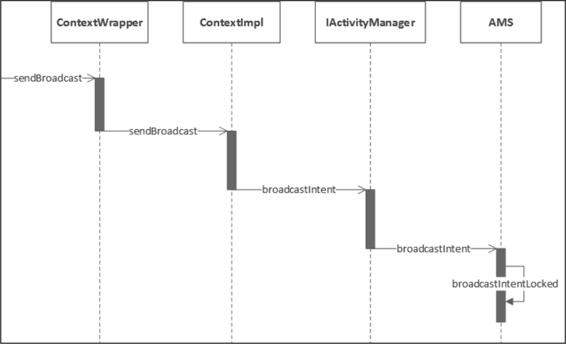
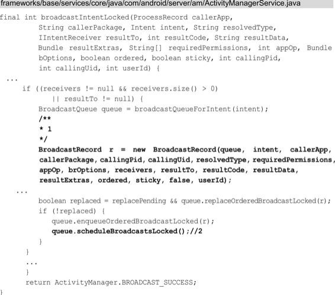
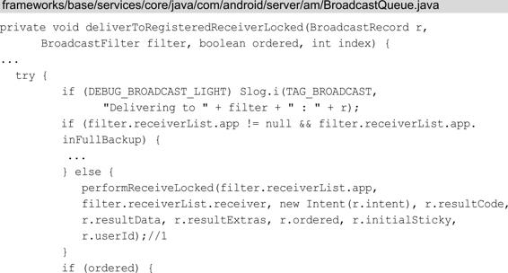
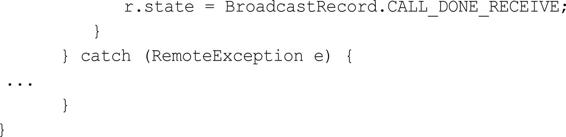
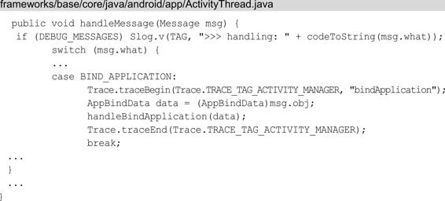

# 四大组件的工作过程

关联章节： 第2章 Android系统启动；第3章 应用程序进程启动

过程在前面的两章中我们学习了系统的启动过程和应用进程的启动过程，应用进程启动后接着就该启动应用程序了，也就是启动根Activity。而Activity是四大组件之一，因此本章我们就来学习四大组件的工作过程。四大组件是应用开发最常接触的，包括 Activity、Service、BroadcastReceiver 和 ContentProvider。本章不会介绍四大组件的含义以及如何使用，而是更加深入地介绍它们的工作过程，比如Service的启动过程。比起前面两章，本章的内容更是资深工程师所必须掌握的知识点之一。本章内容以前面两章的内容（系统的启动过程和应用进程的启动过程）为基础，同时又和插件化技术有所关联，想要理解插件化的原理就必须了解四大组件的工作过程，但最主要的是本章内容是整个 Android 知识体系的核心内容之一，对于理解和掌握整个Android知识体系起着重大的作用。

本章和前面两章一样不会拘泥于源码细节，而是注重流程，正确的阅读“姿势”就是阅读前先要查看时序图了解大概的流程，再阅读具体的代码流程，看完代码流程后再回顾一下时序图。需要注意的是，本书的源码基于Android 8.0，本章所讲的四大组件的工作过程会和Android 7.0以及之前的版本有些区别。

# 4.1 根Activity的启动过程

见：Activity的启动过程.md

# 4.2 Service的启动过程

见：Service的启动过程.md

# 4.3 Service的绑定过程

见：Service的启动过程.md

# 4.4 广播的注册、发送和接收过程

广播作为四大组件之一，使用频率远没有 Activity 高，但是广播的工作过程还是十分有必要了解的。本节主要从三个方面讲解广播工作过程，分别是广播的注册、发送和接收，这些过程和本章前3节重叠的部分，这一节不会再赘述，而是一笔带过，建议阅读本节前先阅读本章前面3节的内容。

## 4.4.1 广播的注册过程

广播的注册通俗来讲就是广播接收者注册自己感兴趣的广播，广播的注册分为两种，分别是静态注册和动态注册，静态注册在应用安装时由PackageManagerService来完成注册过程，关于这一过程本节不做介绍，这里只介绍广播的动态注册，时序图如图4-12所示。

图4-12 广播的动态注册过程时序图

要想动态注册广播，需要调用registerReceiver方法，它在ContextWrapper中实现，代码如下所示：

这 里 mBase 具 体 指 向 就 是 ContextImpl ， ContextImpl 的registerReceiver 方 法 有 很 多 重 载 的 方 法 最 终 会 调 用registerReceiverInternal方法：

在注释1处判断如果LoadedApk类型的mPackageInfo不等于null，并且context不等于null就调用注释2处的代码，通过mPackageInfo的getReceiverDispatcher方法获取rd对象，否则就调用注释 3 处的代码来创建 rd 对象。注释 2 和注释 3 处的代码的目的都是要获取IIntentReceiver类型的rd对象，IIntentReceiver是一个Binder接口 ， 用 于 广 播 的 跨 进 程 的 通 信 ， 它 在LoadedApk.ReceiverDispatcher.InnerReceiver中实现，如下所示：

回 到 registerReceiverInternal 方 法 ， 在 注 释 4 处 调 用 了IActivityManager 的 registerReceiver 方 法 ， 最 终 会 调 用 AMS 的registerReceiver方法，并将IIntentReceiver类型的rd传进去，这里之所以不直接传入BroadcastReceiver而是传入IIntentReceiver，是因为注册广播是一个跨进程过程，需要具有跨进程的通信功能的IIntentReceiver。registerReceiver方法内容比较多，这里分为两个部分来进行讲解，先来查看registerReceiver方法的part1，如下所示：

1.registerReceiver方法的part1

在注释1处通过getRecordForAppLocked方法得到ProcessRecord类型的callerApp对象，它用于描述请求AMS注册广播接收者的Activity所在的应用程序进程。在注释2处根据传入的IntentFilter类型filter得到actions列表，根据actions列表和userIds（userIds可以理解为应用程序的uid）得到所有的粘性广播的intent，并在注释3处传入到stickyIntents中。接下来从stickyIntents中找到匹配传入的参数filter 的 粘 性 广 播 的 intent ， 在 注 释 4 处 将 这 些 intent 存 入 到allSticky列表中，从这里可以看出粘性广播是存储在AMS中的。

2.registerReceiver方法的part2

接下来查看AMS的registerReceiver方法的剩余内容，如下所示：

在注释1处获取ReceiverList列表，如果为空则在注释2处创建，ReceiverList继承自ArrayList，用来存储广播接收者。在注释 3 处创 建 BroadcastFilter 并 传 入 此 前 创 建 的 ReceiverList ，BroadcastFilter用来描述注册的广播接收者，并在注释4处通过add方法将自身添加到 ReceiverList 中。在注释 5 处将 BroadcastFilter添加到 IntentResolver 类型的mReceiverResolver中，这样当AMS接收到广播时就可以从mReceiverResolver中找到对应的广播接收者了，从而达到了注册广播的目的。

## 4.4.2 广播的发送和接收过程

广播的发送和接收过程分为两个部分来进行讲解，分别是ContextImpl到AMS的调用过程和AMS到BroadcastReceiver的调用过程。

### 4.4.2.1 ContextImpl到AMS的调用过程

广播可以发送多种类型，包括无序广播（普通广播）、有序广播和粘性广播，这里以无序广播为例来讲解广播的发送过程。要发送无序广播需要调用sendBroadcast方法，它同样在ContextWrapper中实现，按照惯例先给出 ContextImpl到AMS的调用过程的时序图，如图4-13所示。

图4-13 ContextImpl到AMS的调用过程的时序图

先来查看ContextWrapper的sendBroadcast方法，如下所示：

接着来看ContextImpl中的sendBroadcast方法，如下所示：

又是熟悉的代码，最终会调用AMS的broadcastIntent方法：

我们先来查看注释1处的verifyBroadcastLocked方法：

verifyBroadcastLocked 方法主要验证广播是否合法，在注释 1处验证 intent 是否不为null并且有文件描述符。注释2处获得intent中的flag。注释3处如果系统正在启动过程中，判断如果flag设置为FLAG_RECEIVER_REGISTERED_ONLY_BEFORE_BOOT（启动检查时只接受动态注册的广播接收者）则不做处理，如果不是则在注释4处判断如果flag没有设置为 FLAG_RECEIVER_REGISTERED_ONLY（只接受动态注册的广播接收者）则会抛出异常。我们再回到broadcastIntent方法，在注释2处调用了broadcastIntentLocked方法，代码如下所示：

这里省略了很多代码，前面的工作主要是将动态注册的广播接收者和静态注册的广播接收者按照优先级高低不同存储在不同的列表中，再将这两个列表合并到receivers列表中，这样 receivers 列表包含了所有的广播接收者（无序广播和有序广播）。在注释 1 处创建BroadcastRecord 对象并将 receivers 传进去，在注释 2 处调用BroadcastQueue 的scheduleBroadcastsLocked方法。

### 4.4.2.2 AMS 到BroadcastReceiver的调用过程

AMS到BroadcastReceiver的调用过程的时序图如图4-14所示。

图4-14 AMS到BroadcastReceiver的调用过程的时序图

BroadcastQueue的scheduleBroadcastsLocked方法的代码如下所示：

在 注 释 1 处 向 BroadcastHandler 类 型 的 mHandler 对 象 发 送 了BROADCAST_INTENT_MSG类型的消息，这个消息在BroadcastHandler的handleMessage方法中进行处理，如下所示：

在handleMessage方法中调用了processNextBroadcast方法，方法对无序广播和有序广播分别进行处理，旨在将广播发送给广播接收者，下面给出processNextBroadcast方法中对无序广播的处理部分：

从前面BroadcastHandler方法中我们得知传入的参数fromMsg的值为true，因此在注释1处将mBroadcastsScheduled设置为flase，表示对于此前发来的BROADCAST_INTENT_MSG类型的消息已经处理了。注释2处的mParallelBroadcasts列表用来存储无序广播，通过while循环将mParallelBroadcasts 列表中的无序广播发送给对应的广播接收者。在 注 释 3 处 获 取 每 一 个 mParallelBroadcasts 列 表 中 存 储 的BroadcastRecord类型的r对象。在注释4处将这些r对象描述的广播发送给对应的广播接收者，deliverToRegisteredReceiverLocked方法如下所示：

这里省去了大部分的代码，这些代码是用来检查广播发送者和广播接收者的权限的。如果通过了权限的检查，则会调用注释1处的performReceiveLocked方法：

在注释1和注释2处的代码表示如果广播接收者所在的应用程序进程存在并且正在运行，则执行注释3处的代码，表示用广播接收者所在的 应 用 程 序 进 程 来 接 收 广 播 ， 这 里 app.thread 指 的 是ApplicationThread ， 我 们 来 查 看 ApplicationThread 的scheduleRegisteredReceiver 方法，代码如下所示：

在 scheduleRegisteredReceiver 方 法 中 调 用 了IIntentReceiver 类型的对象 receiver 的performReceive方法，IIntentReceiver在前面提到过，用于广播的跨进程的通信，它的具体实现为LoadedApk.ReceiverDispatcher.InnerReceiver，代码如下所示：

IIntentReceiver 和 IActivityManager 一样，都使用了 AIDL来实现进程间通信。InnerReceiver继承自IIntentReceiver.Stub，是Binder通信的服务器端，IIntentReceiver则是Binder 通信的客户端 、 InnerReceiver 在 本 地 的 代 理 ， 它 的 具 体 的 实 现 就 是InnerReceiver。在InnerReceiver的performReceive方法的注释1处调用了ReceiverDispatcher类型的rd对象的performReceive方法，如下所示：

在注释1处将广播的intent等信息封装为Args对象，在注释2处调用 mActivityThread 的 post 方 法 并 传 入 了 Args 对 象 。 这 个mActivityThread是一个Handler对象，具体指向的就是H，注释2处的代码就是将Args对象的getRunnable方法通过H发送到线程的消息队列中，Args的getRunnable方法如下所示：

在 注释1 处执行 了BroadcastReceiver类型的receiver 对 象的onReceive方法，这样注册的广播接收者就收到了广播并得到了intent。

# 4.5 Content Provider的启动过程

Content Provider作为四大组件之一，即内容提供者，在通常情况下并没有其他的组件使用频繁，主要用于进程内和进程间的数据共享。Content Provider的启动过程分为两个部分来进行讲解，分别是query方法到AMS的调用过程和AMS启动Content Provider的过程。

## 4.5.1 query方法到AMS的调用过程

为了便于理解Content Provider的启动过程，首先列出一段使用Content Provider的代码，如下所示：

在 ContentProviderActivity 中，我们在 GameProvider 中插入了一条数据，可见要想插入一条数据，或者说使用ContentProvider，需要先调用getContentResolver方法，如下所示：这里的 mBase 已经是 我 们 的 老 朋 友 了 ， 指 的 是 ContextImpl ， ContextImpl 的getContentResolver方法如下所示：

getContentResolver方法中返回了ApplicationContentResolver类 型 的 mContentResolver 对 象 ， ApplicationContentResolver 是ContextImpl 中 的 静 态 内 部 类 ， 继 承 自 ContentResolver ， 它 在ContextImpl 的 构 造 方 法 中 被 创 建 ， 这 说 明 当 我 们 调 用ContentResolver 的 insert 、 query 、 update 等 方 法 时 就 会 启 动Content Provider。这里以 query 方法来进行举例，query 方法在ApplicationContentResolver的父类ContentResolver中实现，有3个重载方法，最终会调用如下的query方法：

在 注 释 1 处 通 过 acquireUnstableProvider 方 法 返 回IContentProvider 类型的unstableProvider对象，在注释2处调用unstableProvider 的 query 方 法 。 IContentProvider 是ContentProvider 在本地的代理，具体的实现为 ContentProvider，我们查看 ContentProvider的acquireUnstableProvider方法做了什么，如下所示：

在 注 释 1 处 检 查 uri 的 scheme 是 否 等 于 “content”（SCHEME_CONTENT的值为“content”），如果不是则返回null。在注释2处调用了acquireUnstableProvider方法，这是个抽象方法，它在ContentResolver 的 子 类 ApplicationContentResolver 中 实 现 ，ApplicationContentResolver是ContextImpl的静态内部类，如下所示：

在 acquireUnstableProvider 方法中返回了 ActivityThread 类型的 mMainThread 对象的acquireProvider方法：

注 释 1 处 的 acquireExistingProvider 方 法 内 部 会 检 查ActivityThread 的 全 局 变 量 mProviderMap 中 是 否 有 目 标ContentProvider 存在，有则返回，没有就会在注释 2 处调用IActivityManager的getContentProvider 方法 ，最终 会 调用 AMS的getContentProvider方法。注释 3 处的 installProvider 方法用来安装 ContentProvider，并将注释 2 处返回的ContentProvider 相关的数据存储在 mProviderMap 中，起到缓存的作用，这样使用相同的Content Provider 时 ， 就 不 需 要 每 次 都 要 调 用 AMS 的getContentProvider 方法了。接着查看AMS的getContentProvider方法，代码如下所示：

getContentProvider方法返回了getContentProviderImpl方法：

getContentProviderImpl方法的代码很多，这里只截取了关键的部 分 。 在 注 释 1 处 通 过 getProcessRecordLocked 方 法 来 获 取 目 标ContentProvider的应用程序进程信息，这些信息用ProcessRecord类型的proc来表示，如果该应用程序进程已经启动就会调用注释2处的代码，否则就会调用注释3处的startProcessLocked方法来启动进程。此前 我 们 都 假 设 应 用 程 序 进 程 已 经 启 动 的 情 况 ， 这 里 假 设ContentProvider的应用程序进程还没有启动，应用程序进程启动最终会调用 ActivityThread 的 main 方法，不了解的读者请查看本书第2 章的内容。ActivityThread的main方法如下所示：

在注释1处通过prepareMainLooper方法在ThreadLocal中获取Looper ， 并 在 注 释 3 处 开 启 消 息 循 环 。 在 注 释 2 处 创 建 了ActivityThread，紧接着调用了它的attach方法：

注释1处得到IActivityManager，在注释2处调用IActivityManage的 attachApplication 方 法 ， 并 将 ApplicationThread 类 型 的mAppThread 对象传进去，最终调用的是 AMS 的attachApplication方法。query方法到AMS的调用过程（省略应用程序进程启动过程）的时序图如图4-15所示。

图4-15 query方法到AMS的调用过程的时序图

## 4.5.2 AMS启动Content Provider的过程

AMS启动Content Provider的时序图如图4-16所示。

我们接着来查看AMS的attachApplication方法，如下所示：

图4-16 AMS启动Content Provider的过程的时序图

在attachApplication方法中又调用了attachApplicationLocked方法：

在 attachApplicationLocked 方 法 中 调 用 了 thread 的bindApplication 方法，thread 是IApplicationThread类型的，这里和IActivityManager一样采用了AIDL，实现bindApplication方法的不再 是 Android 7.0 的 ApplicationThreadProxy 类 ， 而 是ApplicationThread类，它是ActivityThread的内部类，如下所示：

在bindApplication方法中最后调用sendMessage方法向H发送BIND_APPLICATION类型消息，H的handleMessage方法如下所示：

我们接着查看handleBindApplication方法：

handleBindApplication 方法的代码很长，这里截取了主要的部分。在注释 1 处创建了ContextImpl。在注释2处通过反射创建Instrumentation并在注释3处初始化Instrumentation。在注释4处创建Application并且在注释6处调用Application的onCreate方法，这意味着Content Provider 所在的应用程序已经启动，在应用程序启动之前，在注释 5 处调用installContentProviders方法来启动ContentProvider，代码如下所示：

在注释1处遍历当前应用程序进程的ProviderInfo列表，得到每个Content Provider 的 ProviderInfo （ 存 储 Content Provider 的 信息），并在注释2处调用installProvider方法来启动这些ContentProvider。在注释3处通过AMS的publishContentProviders方法将这些Content Provider存储在AMS的mProviderMap中，这个mProviderMap在前 面 提 到 过 ， 起 到 缓 存 的 作 用 ， 防 止 每 次 使 用 相 同 的 ContentProvider时都会调用AMS的getContentProvider方法。下面来查看installProvider 方 法 是 如 何 启 动 Content Provider 的 ，installProvider方法如下所示：

在注释1处通过反射来创建ContentProvider类型的localProvider对象，并在注释2处调用了它的attachInfo方法：

在attachInfo方法中调用了onCreate方法，它是一个抽象方法，这样Content Provider就启动完毕。当然这只是Content Provider启动过程的一个分支，即应用程序进程没有启动的情况，还有一个分支是应用程序进程已经启动的情况，这就需要读者自行阅读源码了。

# 4.6 本章小结

本章的内容比较多，介绍了Android 8.0四大组件的启动过程，与Android 7.0主要区别是，与 AMS 进行进程间通信时采用的 AIDL 技术 去 掉 了 此 前 一 直 沿 用 的 ActivityManagerProxy 和ApplicationThreadProxy等代理类。四大组件的启动流程都大同小异，掌握了其中的一个，其他的也就很容易掌握，因为这些知识点都是触类旁通的。另外本章内容和第3章的内容有较大的关联，阅读本章能够更好地理解为什么要学习第3章应用程序进程启动这一知识点。另外本章经常用到上下文 Context 的知识点，这些知识点会在下一章进行介绍。

# 参考

《Android进阶解密》