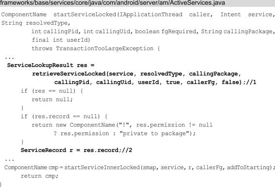

# 四大组件的工作过程

关联章节： 第2章 Android系统启动；第3章 应用程序进程启动

过程在前面的两章中我们学习了系统的启动过程和应用进程的启动过程，应用进程启动后接着就该启动应用程序了，也就是启动根Activity。而Activity是四大组件之一，因此本章我们就来学习四大组件的工作过程。四大组件是应用开发最常接触的，包括 Activity、Service、BroadcastReceiver 和 ContentProvider。本章不会介绍四大组件的含义以及如何使用，而是更加深入地介绍它们的工作过程，比如Service的启动过程。比起前面两章，本章的内容更是资深工程师所必须掌握的知识点之一。本章内容以前面两章的内容（系统的启动过程和应用进程的启动过程）为基础，同时又和插件化技术有所关联，想要理解插件化的原理就必须了解四大组件的工作过程，但最主要的是本章内容是整个 Android 知识体系的核心内容之一，对于理解和掌握整个Android知识体系起着重大的作用。

本章和前面两章一样不会拘泥于源码细节，而是注重流程，正确的阅读“姿势”就是阅读前先要查看时序图了解大概的流程，再阅读具体的代码流程，看完代码流程后再回顾一下时序图。需要注意的是，本书的源码基于Android 8.0，本章所讲的四大组件的工作过程会和Android 7.0以及之前的版本有些区别。

# 4.1 根Activity的启动过程

Activity的启动过程分为两种，一种是根Activity的启动过程，另一种是普通Activity的启动过程。根Activity指的是应用程序启动的第一个Activity，因此根Activity的启动过程一般情况下也可以理解为应用程序的启动过程。普通 Activity 指的是除应用程序启动的第一个Activity之外的其他Activity。这里介绍的是根Activity的启动过程，它和普通Activity的启动过程是有重叠部分的，只不过根Activity 的启动过程一般情况下指的就是应用程序的启动过程，更具有指导性意义。想要了解普通 Activity 的启动过程，读者可以参考根Activity的启动过程，自行去阅读源码。根Activity的启动过程比较复杂，因此这里分为3个部分来讲，分别是Launcher请求AMS过程、AMS到ApplicationThread的调用过程和ActivityThread启动Activity。

## 4.1.1 Launcher请求AMS过程

在2.4.3 节中讲过Launcher 启动后会将已安装应用程序的快捷图标显示到桌面上，这些应用程序的快捷图标就是启动根 Activity 的入口，当我们点击某个应用程序的快捷图标时，就会通过Launcher请求AMS来启动该应用程序。Launcher请求AMS的时序图如图4-1所示。

图4-1 Launcher请求AMS的时序图

当 我们点 击应用 程序的 快 捷图 标时 ，就会 调用Launcher的startActivitySafely方法，如下所示：

在 注 释 1 处 将 Flag 设 置 为Intent.FLAG_ACTIVITY_NEW_TASK①，这样根 Activity会在新的任务栈 中 启 动 。 在 注 释 2 处 会 调 用 startActivity 方 法 ， 这 个startActivity 方法在Activity中实现，如下所示：

在startActivity 方法中会调用startActivityForResult 方法，它的第二个参数为-1，表示Launcher不需要知道Activity启动的结果，startActivityForResult方法的代码如下所示：

注释1处的mParent是Activity类型的，表示当前Activity的父类。因为目前根Activity还没有创建出来，因此，mParent==null成立 。 接 着 调 用 Instrumentation 的 execStartActivity 方 法 ，Instrumentation 主 要 用 来 监 控 应 用 程 序 和 系 统 的 交 互 ，execStartActivity 方法的代码如下所示：

首先调用ActivityManager的getService方法来获取AMS的代理对象，接着调用它的startActivity方法。这里与Android 8.0之前代码的逻辑有些不同，Android 8.0之前是通过ActivityManagerNative 的getDefault 来获取 AMS 的代理对象的，现在这个逻辑封装到了ActivityManager 中而不是 ActivityManagerNative 中。首先我们来查看 ActivityManager 的getService方法做了什么：

getService 方法调用了 IActivityManagerSingleton 的 get 方法，我们接着往下看，IActivityManagerSingleton是一个Singleton类。在注释1处得到名为“activity”的Service引用，也就是IBinder类型的AMS的引用。接着在注释2处将它转换成IActivityManager类型的对象，这段代码采用的是AIDL，IActivityManager.java 类是由AIDL 工具在编译时自动生成的，IActivityManager.aidl 的文件路径为frameworks/base/core/java/android/app/IActivityManager.aidl。要 实 现 进 程 间 通 信 ， 服 务 器 端 也 就 是 AMS 只 需 要 继 承IActivityManager.Stub 类 并 实 现 相 应 的 方 法 就 可 以 了 。 注 意Android 8.0 之前并没有采用AIDL，而是采用了类似AIDL的形式，用AMS的代理对象ActivityManagerProxy来与AMS进行进程间通信，Android 8.0 去 除 了 ActivityManagerNative 的 内 部 类ActivityManagerProxy，代替它的是 IActivityManager，它是 AMS在本地的代理。回到 Instrumentation 类的execStartActivity 方法中，从上面得知 execStartActivity 方法最终调用的是 AMS 的startActivity方法。

## 4.1.2 AMS 到ApplicationThread的调用过程

Launcher请求AMS后，代码逻辑已经进入AMS中，接着是AMS到ApplicationThread的调用流程，时序图如图4-2所示。

图4-2 AMS到ApplicationThread的调用过程的时序图

AMS的startActivity方法如下所示：

在AMS的startActivity方法中返回了startActivityAsUser方法，可以发现startActivityAsUser方法比startActivity方法多了一个参数UserHandle.getCallingUserId（），这个方法会获得调用者的UserId，AMS根据这个UserId来确定调用者的权限。

在注释1处判断调用者进程是否被隔离，如果被隔离则抛出SecurityException异常，在注释2处检查调用者是否有权限，如果没有 权 限 也 会 抛 出 SecurityException 异 常 。 最 后 调 用 了ActivityStarter 的 startActivityLocked 方 法 ，startActivityLocked 方法的参数要比startActivityAsUser多几个，需要注意的是倒数第二个参数类型为TaskRecord，代表启动的Activity所在的栈。最后一个参数"startActivityAsUser"代表启动的理由。startActivityLocked方法的代码如下所示：

ActivityStarter 是 Android 7.0 中 新 加 入 的 类 ， 它 是 加 载Activity的控制类，会收集所有的逻辑来决定如何将Intent和Flags转换 为 Activity ， 并 将 Activity 和 Task 以 及 Stack 相 关 联 。ActivityStarter 的 startActivityMayWait 方 法 调 用 了startActivityLocked方法，如下所示：

在 注 释 1 处 判 断 启 动 的 理 由 不 为 空 ， 如 果 为 空 则 抛 出IllegalArgumentException异常。紧接着又调用了startActivity方法，如下所示：

ActivityStarter 的 startActivity 方法逻辑比较多，这里列出部分我们需要关心的代码。在注释1处判断IApplicationThread类型的caller是否为null，这个caller是方法调用一路传过来的，指向的是Launcher所在的应用程序进程的ApplicationThread对象，在注释2处调用AMS的getRecordForAppLocked方法得到的是代表Launcher进程的callerApp对象，它是ProcessRecord类型的，ProcessRecord用于描述一 个 应 用 程 序 进 程 。 同 样 地 ， ActivityRecord 用 于 描 述 一 个Activity ， 用 来 记 录 一 个 Activity 的 所 有 信 息 。 接 下 来 创 建ActivityRecord，用于描述将要启动的Activity，并在注释3处将创建的ActivityRecord赋值给ActivityRecord[]类型的outActivity，这个outActivity会作为注释4处的startActivity方法的参数传递下去。

startActivity方法紧接着调用了startActivityUnchecked方法：

startActivityUnchecked 方法主要处理与栈管理相关的逻辑。在标注①处我们得知，启动根Activity时会将Intent的Flag设置为FLAG_ACTIVITY_NEW_TASK，这样注释1处的条件判断就会满足，接着执行注释2处的setTaskFromReuseOrCreateNewTask方法，其内部会创建一个新的 TaskRecord，用来描述一个 Activity 任务栈，也就是说setTaskFromReuseOrCreateNewTask方法内部会创建一个新的Activity任务栈。Activity任务栈其实是一个假想的模型，并不真实存在，关于 Activity 任 务 栈 会 在 第 6 章 进 行 介 绍 。 在 注 释 3 处 会 调 用ActivityStackSupervisor 的 resumeFocusedStackTopActivityLocked方法，如下所示：

在注释1处调用ActivityStack的topRunningActivityLocked方法获 取 要 启 动 的 Activity 所 在 栈 的 栈 顶 的 不 是 处 于 停 止 状 态 的ActivityRecord。在注释2处，如果ActivityRecord不为 null，或者要启动的 Activity 的状态不是 RESUMED 状态，就会调用注释 3 处的ActivityStack的resumeTopActivityUncheckedLocked方法，对于即将启动的Activity，注释2处的条件判断是肯定满足的，我们来查看ActivityStack的resumeTopActivityUncheckedLocked方法，如下所示：

紧 接 着 查 看 注 释 1 处 ActivityStack 的resumeTopActivityInnerLocked方法：

resumeTopActivityInnerLocked 方法代码非常多，我们只需要关注调用了ActivityStackSupervisor的startSpecificActivityLocked方法即可，代码如下所示：

在注释1处获取即将启动的Activity所在的应用程序进程，在注释2处判断要启动的Activity所在的应用程序进程如果已经运行的话，就会调用注释3处的realStartActivityLocked方法，这个方法的第二个参数是代表要启动的Activity所在的应用程序进程的ProcessRecord。

这里的 app.thread 指的是 IApplicationThread，它的实现是ActivityThread 的 内 部 类 ApplicationThread ， 其 中ApplicationThread继承了IApplicationThread.Stub。app指的是传入的要启动的 Activity 所在的应用程序进程，因此，这段代码指的就是要在目标应用程序进程启动 Activity。当前代码逻辑运行在 AMS所在的进程（SystemServer 进程）中，通过ApplicationThread来与应用程序进程进行Binder通信，换句话说，ApplicationThread是AMS所在进程（SystemServer进程）和应用程序进程的通信桥梁，如图4-3所示。

图4-3 AMS与应用程序进程通信

## 4.1.3 ActivityThread启动Activity的过程

通过 4.1.2 节的知识，我们知道目前的代码逻辑运行在应用程序进程中。先来查看ActivityThread启动Activity过程的时序图，如图4-4所示。

图4-4 ActivityThread启动Activity过程的时序图

接着查看ApplicationThread的scheduleLaunchActivity方法，其中ApplicationThread是ActivityThread 的内部类，在3.2.2 节中讲过应用程序进程创建后会运行代表主线程的实例ActivityThread，它管 理 着 当 前 应 用 程 序 进 程 的 主 线 程 。 ApplicationThread 的scheduleLaunchActivity方法如下所示：

scheduleLaunchActivity 方法将启动 Activity 的参数封装成ActivityClientRecord ， sendMessage 方 法 向 H 类 发 送 类 型 为LAUNCH_ACTIVITY 的消 息，并将ActivityClientRecord 传递 过去，sendMessage方法有多个重载方法，最终调用的sendMessage方法如下所示：

这 里 mH 指 的 是 H ， 它 是 ActivityThread 的 内 部 类 并 继 承 自Handler ， 是 应 用 程 序 进 程 中 主 线 程 的 消 息 管 理 类 。 因 为ApplicationThread是一个Binder，它的调用逻辑运行在Binder线程池中，所以这里需要用H将代码的逻辑切换到主线程中。H的代码如下所示：

查看H的handleMessage方法中对LAUNCH_ACTIVITY的处理，在注释1 处 将 传 过 来 的 msg 的 成 员 变 量 obj 转 换 为ActivityClientRecord。在注释 2 处通过getPackageInfoNoCheck方法获得LoadedApk类型的对象并赋值给ActivityClientRecord 的成员变量packageInfo。应用程序进程要启动Activity时需要将该Activity所属的APK加载进来，而LoadedApk就是用来描述已加载的APK文件的。在注释3处调用handleLaunchActivity方法，代码如下所示：

注释 1 处的 performLaunchActivity 方法用来启动 Activity，注释 2 处的代码用来将Activity的状态设置为Resume。如果该Activity 为 null 则 会 通 知 AMS 停 止 启 动 Activity 。 下 面 来 查 看performLaunchActivity方法做了什么：

注 释 1 处 用 来 获 取 ActivityInfo ， 用 于 存 储 代 码 以 及AndroidManifes设置的Activity和Receiver节点信息，比如Activity的theme和launchMode。在注释2处获取APK文件的描述类 LoadedApk。在注释 3 处获取要启动的 Activity 的 ComponentName 类，在ComponentName 类中保存了该Activity 的包名和类名。注释4 处用来创建要启动Activity的上下文环境。注释5处根据ComponentName中存储的Activity类名，用类加载器来创建该 Activity 的实例。注释 6处 用 来 创 建 Application ， makeApplication 方 法 内 部 会 调 用Application的onCreate方法。注释7处调用Activity的attach方法初始化Activity，在attach方法中会创建Window对象（PhoneWindow）并与 Activity 自 身 进 行 关 联 。 在 注 释 8 处 调 用 Instrumentation 的callActivityOnCreate方法来启动Activity，如下所示：

注释1处调用了Activity的performCreate方法，代码如下所示：

在performCreate方法中会调用Activity的onCreate方法，讲到这里，根Activity就启动了，即应用程序就启动了。根Activity启动过程就讲到这里，下面我们来学习根Activity启动过程中涉及的进程。

## 4.1.4 根Activity启动过程中涉及的进程

根Activity启动过程中会涉及4个进程，分别是Zygote进程、Launcher进程、AMS所在进程（SystemServer进程）、应用程序进程。它们之间的关系如图4-5所示。

图4-5 根Activity启动过程中涉及的进程之间的关系

图4-5在图4-3基础上进行了修改，首先Launcher进程向AMS请求创建根Activity，AMS会判断根Activity所需的应用程序进程是否存在并启动，如果不存在就会请求Zygote进程创建应用程序进程。应用程序进程启动后，AMS 会请求创建应用程序进程并启动根Activity。图4-5中步骤2采用的是Socket通信，步骤1和步骤4采用的是Binder通信。图4-5可能并不是很直观，为了更好理解，下面给出这4个进程调用的时序图，如图4-6所示。

图4-6 根Activity启动过程中进程调用时序图

如果是普通Activity启动过程会涉及几个进程呢？答案是两个，AMS所在进程和应用程序进程。实际上理解了根Activity的启动过程（根Activity的onCreate过程），根Activity和普通Activity其他生命周期状态（比如onStart、onResume等）过程也会很轻松掌握，这些知识点都是触类旁通的，想要具体了解这些知识点的读者可以自行阅读源码，由于篇幅有限这里就不再介绍了。

# 4.2 Service的启动过程

Service的启动过程和根Activity启动过程有部分相似的知识点，另外Service启动过程涉及上下文 Context 的知识点，这里只关注流程而不会详细介绍 Context，关于上下文Context 会在第 5 章进行介绍。Service 的启动过程将分为两个部分来进行讲解，分别是ContextImpl到ActivityManageService的调用过程和ActivityThread启动Service。

## 4.2.1 ContextImpl到AMS的调用过程

ContextImpl到AMS的调用过程很简短，如图4-7所示。

图4-7 ContextImpl到AMS的调用过程

要 启 动 Service ， 我 们 会 调 用 startService 方 法 ， 它 在ContextWrapper中实现，代码如下所示：

在 startService 方 法 中 会 调 用 mBase 的 startService 方 法 ，Context类型的mBase对象具体指的是什么呢？在4.1.3节中我们讲过，ActivityThread启动Activity时会调用如下代码创建Activity的上下文环境：

在注释1处创建上下文对象appContext，并传入Activity的attach方法中，将Activity与上下文对象appContext关联起来，这个上下文对 象 appContext 的 具 体 类 型 是 什 么 ？ 我 们 接 着 查 看createBaseContextForActivity方法，代码如下所示：

上下文对象 appContext 的具体类型就是 ContextImpl，在Activity 的 attach 方法中将ContextImpl赋值给ContextWrapper的成员变量mBase，因此，上面提出的问题就得到了解答，mBase具体指向 的 就 是 ContextImpl 。 那 么 ， 紧 接 着 来 查 看 ContextImpl 的startService方法，代码如下所示：

在 startService 方 法 中 会 返 回 startServiceCommon 方 法 ， 在startServiceCommon 方 法 中 会 在 注 释 1 处 调 用 AMS 的 代 理IActivityManager 的 startService 方 法 ， 最 终 调 用 的 是 AMS 的startService方法，这一过程已经在4.1.1节讲过了，这里不再赘述。

## 4.2.2 ActivityThread启动Service

ActivityThread启动Service的时序图如图4-8所示。

图4-8 ActivityThread启动Service的时序图

接着我们来查看AMS的startService方法，如下所示：

注释1处调用mServices的startServiceLocked方法mServices的类型是ActiveServices，ActiveServices的startServiceLocked方法代码如下所示：

注释 1 处的 retrieveServiceLocked 方法会查找是否有与参数service 对 应 的 ServiceRecord ， 如 果 没 有 找 到 ， 就 会 调 用PackageManagerService去获取参数service对应的Service信息，并封装 到 ServiceRecord 中 ， 最 后 将 ServiceRecord 封 装 为ServiceLookupResult 返 回 。 其 中 ServiceRecord 用 于 描 述 一 个Service，和此前讲过的ActivityRecord类似。在注释2处通过注释1处返回的ServiceLookupResult得到参数service对应的ServiceRecord，并传入到注释3处的startServiceInnerLocked方法中：

在 startServiceInnerLocked 方 法 中 又 调 用 了bringUpServiceLocked方法，如下所示：

在 注 释 1 处 得 到 ServiceRecord 的 processName 值 并 赋 给procName，其中processName用来描述Service想要在哪个进程中运行，默认是当前进程，我们也可以在AndroidManifest文件中设置android：process 属性来新开启一个进程运行 Service。在注释 2处 将 procName 和 Service 的 uid 传 入 到 AMS 的getProcessRecordLocked 方法中，查询是否存在一个与Service对应的ProcessRecord类型的对象app，ProcessRecord主要用来描述运行的应用程序进程的信息。在注释5处判断Service对应的app为null则说明用来运行Service的应用程序进程不存在，则调用注释6处的AMS的startProcessLocked方法来创建对应的应用程序进程，关于创建应用程序进程请查看第 3 章的内容，这里只讨论没有设置 android：process属性，即应用程序进程存在的情况。在注释3处判断如果用来运 行 Service 的 应 用 程 序 进 程 存 在 ， 则 调 用 注 释 4 处 的realStartServiceLocked方法来启动Service：

在 realStartServiceLocked 方 法 中 调 用 了 app.thread 的scheduleCreateService 方 法 。 其 中 app.thread 是IApplicationThread 类型的，它的实现是 ActivityThread 的内部类ApplicationThread。ApplicationThread的scheduleCreateService方法如下所示：

scheduleLaunchActivity 方法将启动 Service 的参数封装成ActivityClientRecord ， sendMessage 方 法 向 H 类 发 送 类 型 为CREATE_SERVICE的消息，并将ActivityClientRecord传递过去，这个过 程 和 4.1.3 节 ActivityThread 启 动 Activity 的 过 程 是 类 似 的 。sendMessage方法有多个重载方法，最终调用的sendMessage方法如下所示：

这 里 mH 指 的 是 H ， 它 是 ActivityThread 的 内 部 类 并 继 承 自Handler，是应用程序进程中主线程的消息管理类。我们接着查看H的handleMessage方法：

handleMessage 方法根据消息类型为 CREATE_SERVICE，会调用handleCreateService方法：

在 注 释 1 处 获 取 要 启 动 Service 的 应 用 程 序 的 LoadedApk ，LoadedApk是一个APK文件的描述类。在注释2处通过调用LoadedApk的getClassLoader 方 法 来 获 取 类 加 载 器 。 接 着 在 注 释 3 处 根 据CreateServiceData对象中存储的Service信息，创建Service实例。在注释4处创建Service的上下文环境ContextImpl对象。在注释5处通过Service的attach方法来初始化Service。在注释6处调用Service的onCreate方法，这样Service就启动了。在注释7处将启动的Service加入 到 ActivityThread 的 成 员 变 量 mServices 中 ， 其 中 mServices 是ArrayMap类型。Service的启动过程就讲到这里，接下来我们学习Service的绑定过程。

# 4.3 Service的绑定过程

我们可以通过调用 Context 的 startService 来启动 Service，也可以通过 Context 的bindService来绑定Service，绑定Service的过程要比启动Service的过程复杂一些，建议阅读本节前先阅读上一节Service的启动过程，结合着Service的启动过程会有更好的理解。关于如何绑定 Service 这种基础的问题，这里并不会讲解。Service 的绑定过程将分为两个部分来进行讲解，分别是ContextImpl到AMS的调用过程和Service的绑定过程。

## 4.3.1 ContextImpl到AMS的调用过程

ContextImpl到AMS的调用过程如图4-9所示。

我 们 可 以 用 bindService 方 法 来 绑 定 Service ， 它 在ContextWrapper中实现，代码如下所示：

图4-9 ContextImpl到AMS的调用过程

在 4.2.1 节我们得知 mBase 具体就是指向 ContextImpl 的，接着查看 ContextImpl 的bindService方法：

在bindService方法中，又返回了bindServiceCommon方法，代码如下所示：

在 注 释 1 处 调 用 了 LoadedApk 类 型 的 对 象 mPackageInfo 的getServiceDispatcher方法，它的主要作用是将 ServiceConnection封装为 IServiceConnection 类型的对象 sd，从IServiceConnection的名字我们就能得知它实现了 Binder 机制，这样 Service 的绑定就支持了跨进程。接着在注释2处我们又看见了熟悉的代码，最终会调用AMS的bindService方法。

## 4.3.2 Service的绑定过程

AMS的bindService方法代码如下所示：

bindService 方 法 最 后 会 调 用 ActiveServices 类 型 的 对 象mServices的bindServiceLocked方法：

讲到这里，有必要先介绍几个与Service相关的对象类型，这样有助于对源码进行理解，如下所示。

· ServiceRecord：用于描述一个Service。

· ProcessRecord：一个进程的信息。

· ConnectionRecord：用于描述应用程序进程和Service建立的一次通信。

· AppBindRecord：应用程序进程通过Intent绑定Service时，会通过AppBindRecord来维护 Service 与应用程序进程之间的关联。其内 部 存 储 了 谁 绑 定 的 Service （ ProcessRecord ） 、 被 绑 定 的Service （ AppBindRecord ） 、 绑 定 Service 的 Intent（IntentBindRecord）和所有绑定通信记录的信息（ArraySet＜ConnectionRecord＞）。

· IntentBindRecord：用于描述绑定Service的Intent。

在 注 释 1 处 调 用 了 ServiceRecord 的retrieveAppBindingLocked 方 法 来 获 得 AppBindRecord ，retrieveAppBindingLocked 方法内部创建 IntentBindRecord，并对IntentBindRecord的成员变量进行赋值，后面我们会详细介绍这个关键的方法。

在 注 释 2 处 调 用 bringUpServiceLocked 方 法 ， 在bringUpServiceLocked方法中又调用realStartServiceLocked 方法，最终由 ActivityThread 来调用 Service 的 onCreate 方法启动Service，这也说明了bindService方法内部会启动Service，启动Service这一过程在4.2.2节中已经讲过，这里不再赘述。在注释3 处s.app！=null 表示Service 已经运行，其中s 是ServiceRecord类型对象，app是ProcessRecord类型对象。b.intent.received表示当前应用程序进程已经接收到绑定Service 时返回的Binder，这样应用程序进程就可以通过Binder 来获取要绑定的Service的访问接口。在注释4处 调 用 c.conn 的 connected 方 法 ， 其 中 c.conn 指 的 是IServiceConnection ， 它 的 具 体 实 现 为ServiceDispatcher.InnerConnection ， 其 中 ServiceDispatcher 是LoadedApk的内部类，InnerConnection的connected方法内部会调用H的post方法向主线程发送消息，并且解决当前应用程序进程和Service跨进程通信的问题，在后面会详细介绍这一过程。在注释5处如果当前应用程序进程是第一个与Service进行绑定的，并且Service已经调用过onUnBind方法，则需要调用注释6处的代码。在注释7处如果应用程序进程的Client端没有发送过绑定Service的请求，则会调用注释8处的代码，注释8处和注释6处的代码区别就是最后一个参数rebind为false ， 表 示 不 是 重 新 绑 定 。 接 着 我 们 查 看 注 释 6 处 的requestServiceBindingLocked方法，代码如下所示：

注释1处i.requested表示是否发送过绑定Service的请求，从bindServiceLocked 方 法 的 注 释 5 处 得 知 是 发 送 过 的 ， 因 此 ， ！i.requested 为 false 。 从 bindServiceLocked 方 法 的 注 释 5 处 得 知rebind值为true，那么（！i.requested||rebind）的值为true。i.apps.size（）＞0表示什么呢？其中 i 是 IntentBindRecord 类型的 对 象 ， AMS 会 为 每 个 绑 定 Service 的 Intent 分 配 一 个IntentBindRecord类型对象，代码如下所示：

我们来查看 IntentBindRecord 类，不同的应用程序进程可能使用同一个 Intent 来绑定Service，因此在注释1处会用apps来存储所有用当前Intent绑定Service的应用程序进程。i.apps.size（） ＞ 0表示所有用当前Intent绑定Service的应用程序进程个数大于0，下面来验证i.apps.size（）＞0是否为ture。我们回到bindServiceLocked方法的注释1处，ServiceRecord的retrieveAppBindingLocked方法如下所示：

注释1处创建了IntentBindRecord，注释2处根据ProcessRecord获得IntentBindRecord中存储的AppBindRecord，如果AppBindRecord不为null就返回，如果为null就在注释3处创建 AppBindRecord，并将ProcessRecord 作 为 key ， AppBindRecord 作 为 value 保 存 在IntentBindRecord 的 apps （ i.apps ） 中 。 回 到requestServiceBindingLocked方法的注释1处，结合ServiceRecord的retrieveAppBindingLocked方法，我们得知i.apps.size（）＞0为true ， 这 样 就 会 调 用 注 释 2 处 的 代 码 ， r.app.thread 的 类 型 为IApplicationThread ， 它 的 实 现 我 们 已 经 很 熟 悉 了 ， 是ActivityThread的内部类ApplicationThread，scheduleBindService方法如下所示：

首 先 将 Service 的 信 息 封 装 成 BindServiceData 对 象 ，BindServiceData的成员变量rebind的值为 false，后面会用到它。接着将 BindServiceData 传入到 sendMessage 方法中。sendMessage向H发送消息，我们接着查看H的handleMessage方法：

H 在接收到 BIND_SERVICE 类型消息时，会在 handleMessage 方法中会调用handleBindService方法：

在注释1处获取要绑定的Service。注释2处的BindServiceData的成员变量rebind的值为false，这样会调用注释3处的代码来调用Service的onBind方法，到这里Service处于绑定状态了。如果rebind的值为true就会调用注释5处的Service的onRebind方法，这一点结合前文的bindServiceLocked方法的注释5处，得出的结论就是：如果当前应用程序进程第一个与Service进行绑定，并且Service已经调用过onUnBind 方 法 ， 则 会 调 用 Service 的 onRebind 方 法 。handleBindService方法有两个分支，一个是绑定过Servive的情况，另一个是未绑定的情况，这里分析未绑定的情况，查看注释4处的代码，实际上是调用AMS的publishService方法。讲到这里，先给出这一部分的代码时序图（不包括Service启动过程），如图4-10所示。

接着来查看AMS的publishService方法，代码如下所示：

图4-10 Service的绑定过程前半部分调用关系时序图

在publishService方法中调用了ActiveServices类型的mServices对象的publishServiceLocked方法：

注 释 1 处 的 代 码 在 前 面 介 绍 过 ， c.conn 指 的 是IServiceConnection，它是ServiceConnection在本地的代理，用于解决当前应用程序进程和Service跨进程通信的问题，具体实现为ServiceDispatcher.InnerConnection ， 其 中 ServiceDispatcher 是LoadedApk 的 内 部 类 ， ServiceDispatcher.InnerConnection 的connected方法的代码如下所示：

在注释1处调用了ServiceDispatcher类型的sd对象的connected方法，代码如下所示：

在注释1处调用Handler类型的对象mActivityThread的post方法，mActivityThread实际上指向的是H。因此，通过调用H的post方法将RunConnection 对 象 的 内 容 运 行 在 主 线 程 中 。 RunConnection 是LoadedApk的内部类，定义如下所示：

在RunConnection的run方法中调用了doConnected方法：

在注释1 处调用了ServiceConnection 类型的对象mConnection的onServiceConnected方法，这样在客户端实现了ServiceConnection接口类的onServiceConnected方法就会被执行。至此，Service 的绑定过程就分析完成。最后给出剩余部分的代码时序图，如图 4-11所示。

图4-11 Service的绑定过程剩余部分的代码时序图

# 4.4 广播的注册、发送和接收过程

广播作为四大组件之一，使用频率远没有 Activity 高，但是广播的工作过程还是十分有必要了解的。本节主要从三个方面讲解广播工作过程，分别是广播的注册、发送和接收，这些过程和本章前3节重叠的部分，这一节不会再赘述，而是一笔带过，建议阅读本节前先阅读本章前面3节的内容。

## 4.4.1 广播的注册过程

广播的注册通俗来讲就是广播接收者注册自己感兴趣的广播，广播的注册分为两种，分别是静态注册和动态注册，静态注册在应用安装时由PackageManagerService来完成注册过程，关于这一过程本节不做介绍，这里只介绍广播的动态注册，时序图如图4-12所示。

图4-12 广播的动态注册过程时序图

要想动态注册广播，需要调用registerReceiver方法，它在ContextWrapper中实现，代码如下所示：

这 里 mBase 具 体 指 向 就 是 ContextImpl ， ContextImpl 的registerReceiver 方 法 有 很 多 重 载 的 方 法 最 终 会 调 用registerReceiverInternal方法：

在注释1处判断如果LoadedApk类型的mPackageInfo不等于null，并且context不等于null就调用注释2处的代码，通过mPackageInfo的getReceiverDispatcher方法获取rd对象，否则就调用注释 3 处的代码来创建 rd 对象。注释 2 和注释 3 处的代码的目的都是要获取IIntentReceiver类型的rd对象，IIntentReceiver是一个Binder接口 ， 用 于 广 播 的 跨 进 程 的 通 信 ， 它 在LoadedApk.ReceiverDispatcher.InnerReceiver中实现，如下所示：

回 到 registerReceiverInternal 方 法 ， 在 注 释 4 处 调 用 了IActivityManager 的 registerReceiver 方 法 ， 最 终 会 调 用 AMS 的registerReceiver方法，并将IIntentReceiver类型的rd传进去，这里之所以不直接传入BroadcastReceiver而是传入IIntentReceiver，是因为注册广播是一个跨进程过程，需要具有跨进程的通信功能的IIntentReceiver。registerReceiver方法内容比较多，这里分为两个部分来进行讲解，先来查看registerReceiver方法的part1，如下所示：

1.registerReceiver方法的part1

在注释1处通过getRecordForAppLocked方法得到ProcessRecord类型的callerApp对象，它用于描述请求AMS注册广播接收者的Activity所在的应用程序进程。在注释2处根据传入的IntentFilter类型filter得到actions列表，根据actions列表和userIds（userIds可以理解为应用程序的uid）得到所有的粘性广播的intent，并在注释3处传入到stickyIntents中。接下来从stickyIntents中找到匹配传入的参数filter 的 粘 性 广 播 的 intent ， 在 注 释 4 处 将 这 些 intent 存 入 到allSticky列表中，从这里可以看出粘性广播是存储在AMS中的。

2.registerReceiver方法的part2

接下来查看AMS的registerReceiver方法的剩余内容，如下所示：

在注释1处获取ReceiverList列表，如果为空则在注释2处创建，ReceiverList继承自ArrayList，用来存储广播接收者。在注释 3 处创 建 BroadcastFilter 并 传 入 此 前 创 建 的 ReceiverList ，BroadcastFilter用来描述注册的广播接收者，并在注释4处通过add方法将自身添加到 ReceiverList 中。在注释 5 处将 BroadcastFilter添加到 IntentResolver 类型的mReceiverResolver中，这样当AMS接收到广播时就可以从mReceiverResolver中找到对应的广播接收者了，从而达到了注册广播的目的。

## 4.4.2 广播的发送和接收过程

广播的发送和接收过程分为两个部分来进行讲解，分别是ContextImpl到AMS的调用过程和AMS到BroadcastReceiver的调用过程。

### 4.4.2.1 ContextImpl到AMS的调用过程

广播可以发送多种类型，包括无序广播（普通广播）、有序广播和粘性广播，这里以无序广播为例来讲解广播的发送过程。要发送无序广播需要调用sendBroadcast方法，它同样在ContextWrapper中实现，按照惯例先给出 ContextImpl到AMS的调用过程的时序图，如图4-13所示。

图4-13 ContextImpl到AMS的调用过程的时序图

先来查看ContextWrapper的sendBroadcast方法，如下所示：

接着来看ContextImpl中的sendBroadcast方法，如下所示：

又是熟悉的代码，最终会调用AMS的broadcastIntent方法：

我们先来查看注释1处的verifyBroadcastLocked方法：

verifyBroadcastLocked 方法主要验证广播是否合法，在注释 1处验证 intent 是否不为null并且有文件描述符。注释2处获得intent中的flag。注释3处如果系统正在启动过程中，判断如果flag设置为FLAG_RECEIVER_REGISTERED_ONLY_BEFORE_BOOT（启动检查时只接受动态注册的广播接收者）则不做处理，如果不是则在注释4处判断如果flag没有设置为 FLAG_RECEIVER_REGISTERED_ONLY（只接受动态注册的广播接收者）则会抛出异常。我们再回到broadcastIntent方法，在注释2处调用了broadcastIntentLocked方法，代码如下所示：

这里省略了很多代码，前面的工作主要是将动态注册的广播接收者和静态注册的广播接收者按照优先级高低不同存储在不同的列表中，再将这两个列表合并到receivers列表中，这样 receivers 列表包含了所有的广播接收者（无序广播和有序广播）。在注释 1 处创建BroadcastRecord 对象并将 receivers 传进去，在注释 2 处调用BroadcastQueue 的scheduleBroadcastsLocked方法。

### 4.4.2.2 AMS 到BroadcastReceiver的调用过程

AMS到BroadcastReceiver的调用过程的时序图如图4-14所示。

图4-14 AMS到BroadcastReceiver的调用过程的时序图

BroadcastQueue的scheduleBroadcastsLocked方法的代码如下所示：

在 注 释 1 处 向 BroadcastHandler 类 型 的 mHandler 对 象 发 送 了BROADCAST_INTENT_MSG类型的消息，这个消息在BroadcastHandler的handleMessage方法中进行处理，如下所示：

在handleMessage方法中调用了processNextBroadcast方法，方法对无序广播和有序广播分别进行处理，旨在将广播发送给广播接收者，下面给出processNextBroadcast方法中对无序广播的处理部分：

从前面BroadcastHandler方法中我们得知传入的参数fromMsg的值为true，因此在注释1处将mBroadcastsScheduled设置为flase，表示对于此前发来的BROADCAST_INTENT_MSG类型的消息已经处理了。注释2处的mParallelBroadcasts列表用来存储无序广播，通过while循环将mParallelBroadcasts 列表中的无序广播发送给对应的广播接收者。在 注 释 3 处 获 取 每 一 个 mParallelBroadcasts 列 表 中 存 储 的BroadcastRecord类型的r对象。在注释4处将这些r对象描述的广播发送给对应的广播接收者，deliverToRegisteredReceiverLocked方法如下所示：

这里省去了大部分的代码，这些代码是用来检查广播发送者和广播接收者的权限的。如果通过了权限的检查，则会调用注释1处的performReceiveLocked方法：

在注释1和注释2处的代码表示如果广播接收者所在的应用程序进程存在并且正在运行，则执行注释3处的代码，表示用广播接收者所在的 应 用 程 序 进 程 来 接 收 广 播 ， 这 里 app.thread 指 的 是ApplicationThread ， 我 们 来 查 看 ApplicationThread 的scheduleRegisteredReceiver 方法，代码如下所示：

在 scheduleRegisteredReceiver 方 法 中 调 用 了IIntentReceiver 类型的对象 receiver 的performReceive方法，IIntentReceiver在前面提到过，用于广播的跨进程的通信，它的具体实现为LoadedApk.ReceiverDispatcher.InnerReceiver，代码如下所示：

IIntentReceiver 和 IActivityManager 一样，都使用了 AIDL来实现进程间通信。InnerReceiver继承自IIntentReceiver.Stub，是Binder通信的服务器端，IIntentReceiver则是Binder 通信的客户端 、 InnerReceiver 在 本 地 的 代 理 ， 它 的 具 体 的 实 现 就 是InnerReceiver。在InnerReceiver的performReceive方法的注释1处调用了ReceiverDispatcher类型的rd对象的performReceive方法，如下所示：

在注释1处将广播的intent等信息封装为Args对象，在注释2处调用 mActivityThread 的 post 方 法 并 传 入 了 Args 对 象 。 这 个mActivityThread是一个Handler对象，具体指向的就是H，注释2处的代码就是将Args对象的getRunnable方法通过H发送到线程的消息队列中，Args的getRunnable方法如下所示：

在 注释1 处执行 了BroadcastReceiver类型的receiver 对 象的onReceive方法，这样注册的广播接收者就收到了广播并得到了intent。

# 4.5 Content Provider的启动过程

Content Provider作为四大组件之一，即内容提供者，在通常情况下并没有其他的组件使用频繁，主要用于进程内和进程间的数据共享。Content Provider的启动过程分为两个部分来进行讲解，分别是query方法到AMS的调用过程和AMS启动Content Provider的过程。

## 4.5.1 query方法到AMS的调用过程

为了便于理解Content Provider的启动过程，首先列出一段使用Content Provider的代码，如下所示：

在 ContentProviderActivity 中，我们在 GameProvider 中插入了一条数据，可见要想插入一条数据，或者说使用ContentProvider，需要先调用getContentResolver方法，如下所示：这里的 mBase 已经是 我 们 的 老 朋 友 了 ， 指 的 是 ContextImpl ， ContextImpl 的getContentResolver方法如下所示：

getContentResolver方法中返回了ApplicationContentResolver类 型 的 mContentResolver 对 象 ， ApplicationContentResolver 是ContextImpl 中 的 静 态 内 部 类 ， 继 承 自 ContentResolver ， 它 在ContextImpl 的 构 造 方 法 中 被 创 建 ， 这 说 明 当 我 们 调 用ContentResolver 的 insert 、 query 、 update 等 方 法 时 就 会 启 动Content Provider。这里以 query 方法来进行举例，query 方法在ApplicationContentResolver的父类ContentResolver中实现，有3个重载方法，最终会调用如下的query方法：

在 注 释 1 处 通 过 acquireUnstableProvider 方 法 返 回IContentProvider 类型的unstableProvider对象，在注释2处调用unstableProvider 的 query 方 法 。 IContentProvider 是ContentProvider 在本地的代理，具体的实现为 ContentProvider，我们查看 ContentProvider的acquireUnstableProvider方法做了什么，如下所示：

在 注 释 1 处 检 查 uri 的 scheme 是 否 等 于 “content”（SCHEME_CONTENT的值为“content”），如果不是则返回null。在注释2处调用了acquireUnstableProvider方法，这是个抽象方法，它在ContentResolver 的 子 类 ApplicationContentResolver 中 实 现 ，ApplicationContentResolver是ContextImpl的静态内部类，如下所示：

在 acquireUnstableProvider 方法中返回了 ActivityThread 类型的 mMainThread 对象的acquireProvider方法：

注 释 1 处 的 acquireExistingProvider 方 法 内 部 会 检 查ActivityThread 的 全 局 变 量 mProviderMap 中 是 否 有 目 标ContentProvider 存在，有则返回，没有就会在注释 2 处调用IActivityManager的getContentProvider 方法 ，最终 会 调用 AMS的getContentProvider方法。注释 3 处的 installProvider 方法用来安装 ContentProvider，并将注释 2 处返回的ContentProvider 相关的数据存储在 mProviderMap 中，起到缓存的作用，这样使用相同的Content Provider 时 ， 就 不 需 要 每 次 都 要 调 用 AMS 的getContentProvider 方法了。接着查看AMS的getContentProvider方法，代码如下所示：

getContentProvider方法返回了getContentProviderImpl方法：

getContentProviderImpl方法的代码很多，这里只截取了关键的部 分 。 在 注 释 1 处 通 过 getProcessRecordLocked 方 法 来 获 取 目 标ContentProvider的应用程序进程信息，这些信息用ProcessRecord类型的proc来表示，如果该应用程序进程已经启动就会调用注释2处的代码，否则就会调用注释3处的startProcessLocked方法来启动进程。此前 我 们 都 假 设 应 用 程 序 进 程 已 经 启 动 的 情 况 ， 这 里 假 设ContentProvider的应用程序进程还没有启动，应用程序进程启动最终会调用 ActivityThread 的 main 方法，不了解的读者请查看本书第2 章的内容。ActivityThread的main方法如下所示：

在注释1处通过prepareMainLooper方法在ThreadLocal中获取Looper ， 并 在 注 释 3 处 开 启 消 息 循 环 。 在 注 释 2 处 创 建 了ActivityThread，紧接着调用了它的attach方法：

注释1处得到IActivityManager，在注释2处调用IActivityManage的 attachApplication 方 法 ， 并 将 ApplicationThread 类 型 的mAppThread 对象传进去，最终调用的是 AMS 的attachApplication方法。query方法到AMS的调用过程（省略应用程序进程启动过程）的时序图如图4-15所示。

图4-15 query方法到AMS的调用过程的时序图

## 4.5.2 AMS启动Content Provider的过程

AMS启动Content Provider的时序图如图4-16所示。

我们接着来查看AMS的attachApplication方法，如下所示：

图4-16 AMS启动Content Provider的过程的时序图

在attachApplication方法中又调用了attachApplicationLocked方法：

在 attachApplicationLocked 方 法 中 调 用 了 thread 的bindApplication 方法，thread 是IApplicationThread类型的，这里和IActivityManager一样采用了AIDL，实现bindApplication方法的不再 是 Android 7.0 的 ApplicationThreadProxy 类 ， 而 是ApplicationThread类，它是ActivityThread的内部类，如下所示：

在bindApplication方法中最后调用sendMessage方法向H发送BIND_APPLICATION类型消息，H的handleMessage方法如下所示：

我们接着查看handleBindApplication方法：

handleBindApplication 方法的代码很长，这里截取了主要的部分。在注释 1 处创建了ContextImpl。在注释2处通过反射创建Instrumentation并在注释3处初始化Instrumentation。在注释4处创建Application并且在注释6处调用Application的onCreate方法，这意味着Content Provider 所在的应用程序已经启动，在应用程序启动之前，在注释 5 处调用installContentProviders方法来启动ContentProvider，代码如下所示：

在注释1处遍历当前应用程序进程的ProviderInfo列表，得到每个Content Provider 的 ProviderInfo （ 存 储 Content Provider 的 信息），并在注释2处调用installProvider方法来启动这些ContentProvider。在注释3处通过AMS的publishContentProviders方法将这些Content Provider存储在AMS的mProviderMap中，这个mProviderMap在前 面 提 到 过 ， 起 到 缓 存 的 作 用 ， 防 止 每 次 使 用 相 同 的 ContentProvider时都会调用AMS的getContentProvider方法。下面来查看installProvider 方 法 是 如 何 启 动 Content Provider 的 ，installProvider方法如下所示：

在注释1处通过反射来创建ContentProvider类型的localProvider对象，并在注释2处调用了它的attachInfo方法：

在attachInfo方法中调用了onCreate方法，它是一个抽象方法，这样Content Provider就启动完毕。当然这只是Content Provider启动过程的一个分支，即应用程序进程没有启动的情况，还有一个分支是应用程序进程已经启动的情况，这就需要读者自行阅读源码了。

# 4.6 本章小结

本章的内容比较多，介绍了Android 8.0四大组件的启动过程，与Android 7.0主要区别是，与 AMS 进行进程间通信时采用的 AIDL 技术 去 掉 了 此 前 一 直 沿 用 的 ActivityManagerProxy 和ApplicationThreadProxy等代理类。四大组件的启动流程都大同小异，掌握了其中的一个，其他的也就很容易掌握，因为这些知识点都是触类旁通的。另外本章内容和第3章的内容有较大的关联，阅读本章能够更好地理解为什么要学习第3章应用程序进程启动这一知识点。另外本章经常用到上下文 Context 的知识点，这些知识点会在下一章进行介绍。

# 参考

《Android进阶解密》