# 应用程序进程启动过程

关联章节：第2章Android系统启动

第2章我们学习了Android系统的启动流程，系统启动后，我们比较关心应用程序是如何启动的，启动一个应用程序首先要保证该应用程序的进程已经被启动，本章我们就来学习应用程序进程启动过程。需要注意，是“应用程序进程启动过程”，不是“应用程序启动过程”，关于应用程序启动过程（根Activity启动过程）将在第4章进行讲解。

# 3.1应用程序进程简介

要想启动一个应用程序，首先要保证这个应用程序所需要的应用程序进程已经启动。AMS在启动应用程序时会检查这个应用程序需要的应用程序进程是否存在，不存在就会请求Zygote进程启动需要的应用程序进程。在2.2节中，我们知道在Zygote的Java框架层中会创建一个Server端的Socket，这个Socket用来等待AMS请求Zygote来创建新的应用程序进程。Zygote进程通过fock自身创建应用程序进程，这样应用程序进程就会获得Zygote进程在启动时创建的虚拟机实例。当然，在应用程序进程创建过程中除了获取虚拟机实例外，还创建了Binder线程池和消息循环，这样运行在应用进程中的应用程序就可以方便地使用Binder进行进程间通信以及处理消息了。3.2应用程序进程启动过程介绍应用程序进程创建过程的步骤比较多，这里分为两个部分来讲解，分别是AMS发送启动应用程序进程请求，以及Zygote接收请求并创建应用程序进程。

## 3.2.1AMS发送启动应用程序进程请求

这里先给出AMS发送启动应用程序进程请求过程的时序图，然后对每一个步骤进行详细分析，如图3-1所示。

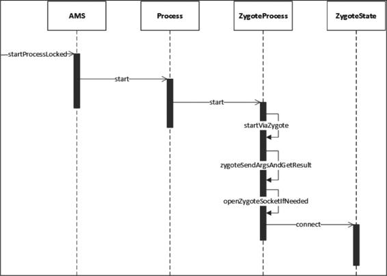

图3-1AMS发送启动应用程序进程请求过程的时序图

AMS如果想要启动应用程序进程，就需要向Zygote进程发送创建应用程序进程的请求，AMS会通过调用startProcessLocked方法向Zygote进程发送请求，如下所示：

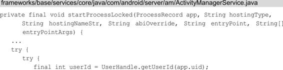

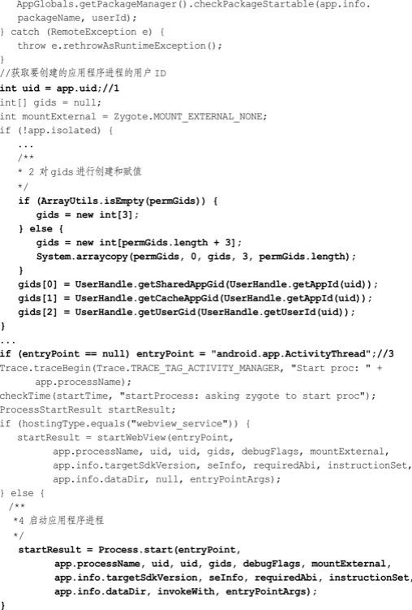

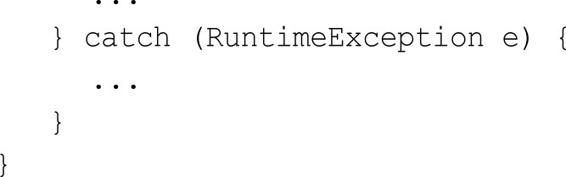

在注释1处得到创建应用程序进程的用户ID，在注释2处对用户组ID（gids）进行创建和赋值。在注释3处如果entryPoint为null，则赋值为android.app.ActivityThread，这个值就是应用程序进程主线程的类名。在注释4处调用Process的start方法，将此前得到的应用程序进程用户ID和用户组ID传进去，第一个参数entryPoint我们得知是android.app.ActivityThread，后面章节还会介绍它。接下来查看Process的start方法，如下所示：

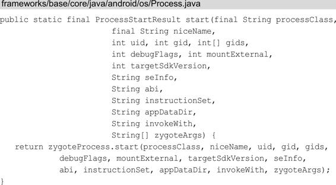

在Process的start方法中只调用了ZygoteProcess的start方法，其中ZygoteProcess类用于保持与Zygote进程的通信状态。该start方法如下所示：

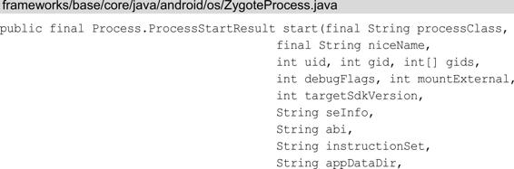

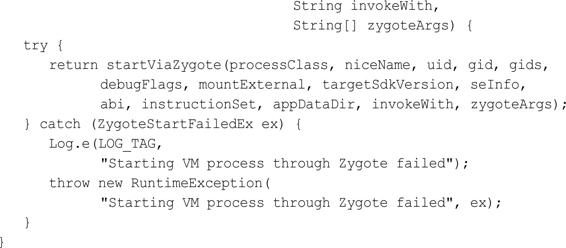

ZygoteProcess的start方法调用了startViaZygote方法，如下所示：

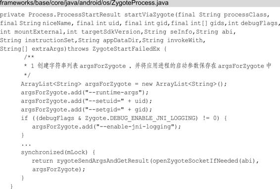

在注释1处创建了字符串列表argsForZygote，并将启动应用进程的启动参数保存在argsForZygote中，方法的最后会调用zygoteSendArgsAndGetResult方法，需要注意的是，zygoteSendArgsAndGetResult方法的第一个参数中调用了openZygoteSocketIfNeeded方法①，而第二个参数是保存应用进程的启动参数的argsForZygote。zygoteSendArgsAndGetResult方法如下所示：

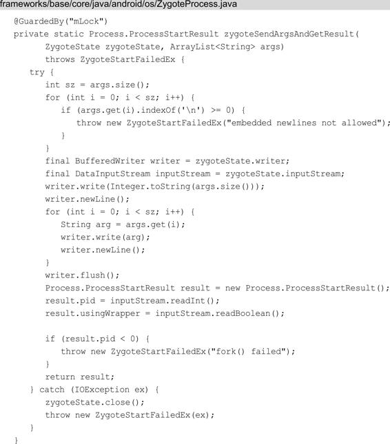

zygoteSendArgsAndGetResult方法的主要作用就是将传入的应用进程的启动参数argsForZygote写入ZygoteState中，ZygoteState是ZygoteProcess的静态内部类，用于表示与Zygote进程通信的状态。结合前面的标注①我们知道ZygoteState其实是由openZygoteSocketIfNeeded方法返回的，那么我们接着来看openZygoteSocketIfNeeded方法做了什么，代码如下所示：

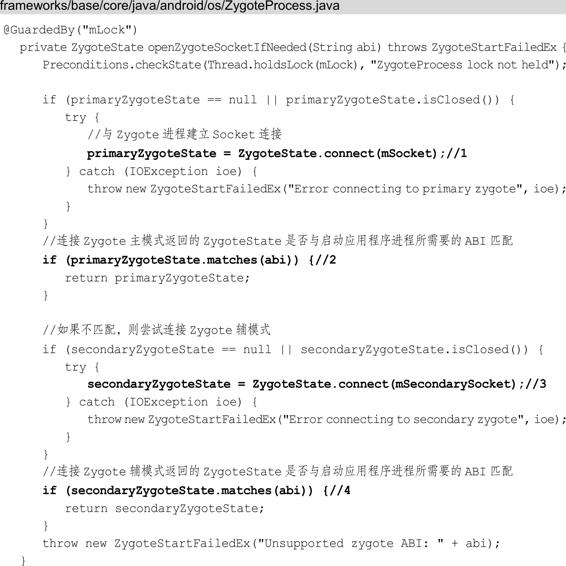

在2.2节讲到Zygote进程启动过程时我们得知，在Zygote的main方法中会创建name为“zygote”的Server端Socket。在注释1处会调用ZygoteState的connect方法与名称为ZYGOTE_SOCKET的Socket建立连接，这里ZYGOTE_SOCKET的值为“zygote”，也就是说，在注释1处与Zygote进程建立Socket连接，并返回ZygoteState类型的primaryZygoteState对象，在注释2处如果primaryZygoteState与启动应用程序进程所需的ABI不匹配，则会在注释3处连接name为“zygote_secondary”的Socket。在2.2.2节中讲到过Zygote的启动脚本有4种，如果采用的是init.zygote32_64.rc或者init.zygote64_32.rc，则name为“zygote”的为主模式，name为“zygote_secondary”的为辅模式，那么注释2和注释3处的意思简单来说就是，如果连接Zygote主模式返回的ZygoteState与启动应用程序进程所需的ABI不匹配，则连接Zygote辅模式。如果在注释4处连接Zygote辅模式返回的ZygoteState与启动应用程序进程所需的ABI也不匹配，则抛出ZygoteStartFailedEx异常。

## 3.2.2Zygote接收请求并创建应用程序进程

Zygote接收请求并创建应用程序进程的时序图如图3-2所示。

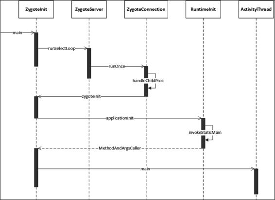

图3-2Zygote接收请求并创建应用程序进程的时序图

Socket连接成功并匹配ABI后会返回ZygoteState类型对象，我们在分析zygoteSendArgsAndGetResult方法中讲过，会将应用进程的启动参数argsForZygote写入ZygoteState中，这样Zygote进程就会收到一个创建新的应用程序进程的请求，我们回到ZygoteInit的main方法，如下所示：

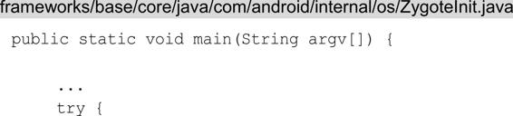

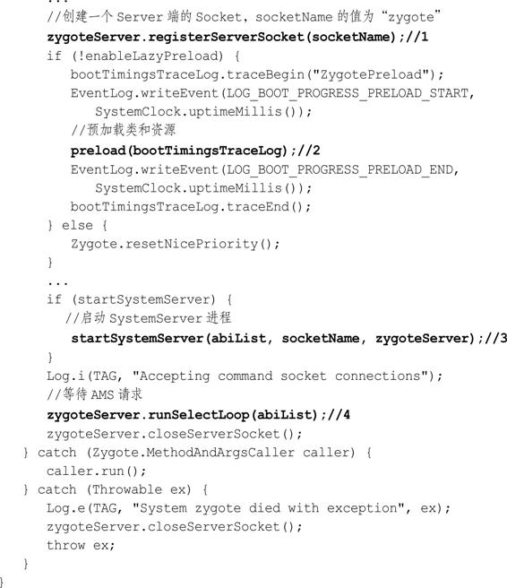

这些内容在2.2.3节中讲过，但为了更好地理解本节内容，这里再讲一遍。在注释1处通过registerZygoteSocket方法创建了一个Server端的Socket，这个name为“zygote”的Socket用来等待AMS请求Zygote，以创建新的应用程序进程，关于AMS后面的章节会进行介绍。在注释2处预加载类和资源。在注释3处启动SystemServer进程，这样系统的服务也会由SystemServer进程启动起来。在注释4处调用ZygoteServer的runSelectLoop方法来等待AMS请求创建新的应用程序进程。下面来查看ZygoteServer的runSelectLoop方法：

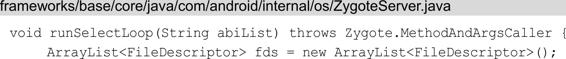

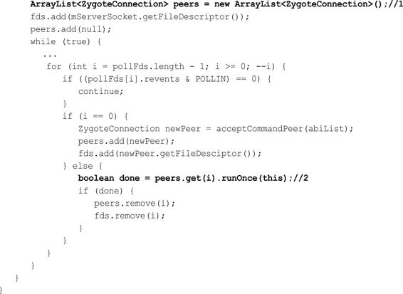

当有AMS的请求数据到来时，会调用注释2处的代码，结合注释1处的代码，我们得知注释2处的代码其实是调用ZygoteConnection的runOnce方法来处理请求数据的：

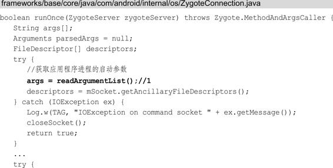

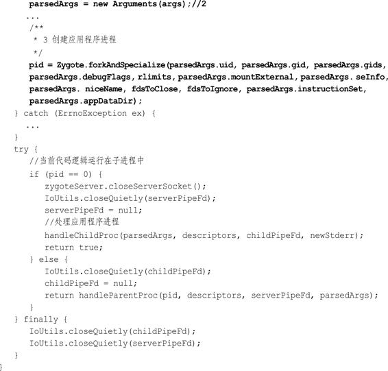

在注释1处调用readArgumentList方法来获取应用程序进程的启动参数，并在注释2处将readArgumentList方法返回的字符串数组args封装到Arguments类型的parsedArgs对象中。在注释3处调用Zygote的forkAndSpecialize方法来创建应用程序进程，参数为parsedArgs中存储的应用进程启动参数，返回值为pid。forkAndSpecialize方法主要是通过fork当前进程来创建一个子进程的，如果pid等于0，则说明当前代码逻辑运行在新创建的子进程（应用程序进程）中，这时就会调用handleChildProc方法来处理应用程序进程，如下所示：

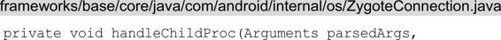

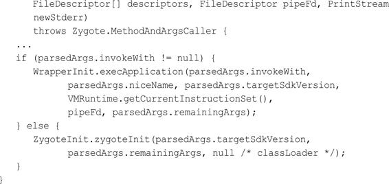

handleChildProc方法中调用了ZygoteInit的zygoteInit方法，如下所示：

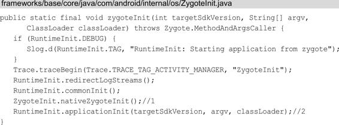

在注释1处会在新创建的应用程序进程中创建Binder线程池，这将在3.3节详细介绍。在注释2处调用了RuntimeInit的applicationInit方法：

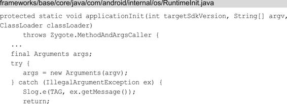

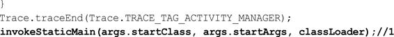

在applicationInit方法中会在注释1处调用invokeStaticMain方法，需要注意的是，第一个参数args.startClass，它指的就是本章开头提到的参数android.app.ActivityThread。接下来我们查看invokeStaticMain方法，如下所示：

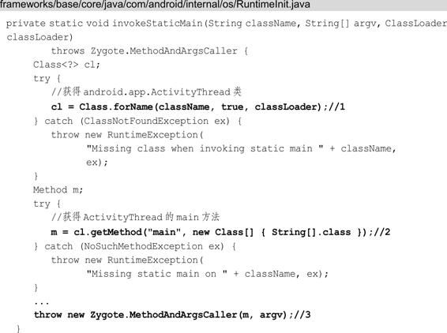

可以看到在注释1处通过反射获得了android.app.ActivityThread类，接下来在注释2处获得了ActivityThread的main方法，并将main方法传入注释3处的Zygote中的MethodAndArgsCaller类的构造方法中。在注释3处抛出的MethodAndArgsCaller异常会被Zygote的main方法捕获，至于这里为何采用了抛出异常而不是直接调用ActivityThread的main方法，原理和本书2.3.1节Zygote处理SystemServer进程是一样的，这种抛出异常的处理会清除所有的设置过程需要的堆栈帧，并让ActivityThread的main方法看起来像是应用程序进程的入口方法。下面来查看ZygoteInit.java的main方法是如何捕获MethodAndArgsCaller异常的，如下所示：

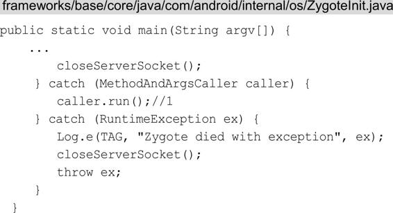

当捕获到MethodAndArgsCaller异常时，就会在注释1处调用MethodAndArgsCaller的run方法，MethodAndArgsCaller是Zygote.java的静态内部类：

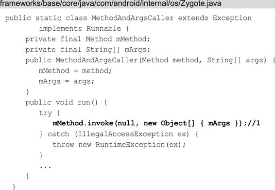

注释1处的mMethod指的就是ActivityThread的main方法，调用了mMethod的invoke方法后，ActivityThread的main方法就会被动态调用，应用程序进程就进入了ActivityThread的main方法中。讲到这里，应用程序进程就创建完成了并且运行了主线程的管理类ActivityThread。

# 3.3Binder线程池启动

过程在3.2.2节中学习了Zygote接收请求并创建应用程序进程，其中有一个遗留的知识点就是，在应用程序进程创建过程中会启动Binder线程池。我们查看ZygoteInit类的zygoteInit方法，如下所示：

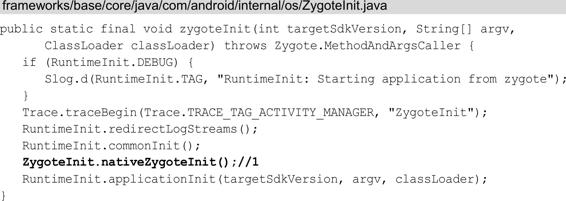

在注释1处会在新创建的应用程序进程中创建Binder线程池，下面来查看nativeZygoteInit方法：

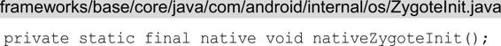

很明显nativeZygoteInit是一个JNI方法，它对应的函数是什么呢？在AndroidRuntime.cpp的JNINativeMethod数组中我们得知它对应的函数是com_android_internal_os_ZygoteInit_nativeZygoteInit，如下所示：

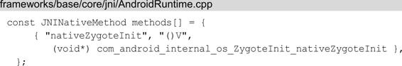

接着来查看com_android_internal_os_ZygoteInit_nativeZygoteInit函数：

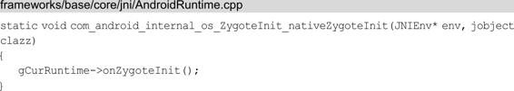

gCurRuntime是AndroidRuntime类型的指针，它是在AndroidRuntime初始化时就创建的，如下所示：

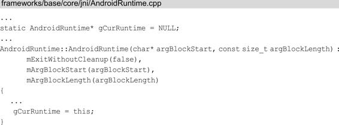

AppRuntime继承自AndroidRuntime，AppRuntime创建时就会调用AndroidRuntime的构造函数，gCurRuntime就会被初始化，它指向的是AppRuntime，我们来查看AppRuntime的onZygoteInit函数，AppRuntime在app_main.cpp中实现，如下所示：

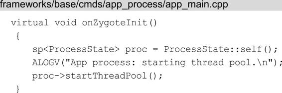

最后一行会调用ProcessState的startThreadPool函数来启动Binder线程池：

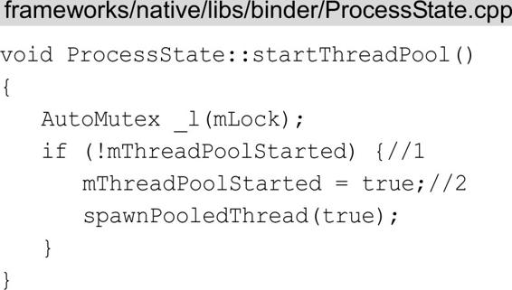

支持Binder通信的进程中都有一个ProcessState类，它里面有一个mThreadPoolStarted变量，用来表示Binder线程池是否已经被启动过，默认值为false。在每次调用startThreadPool函数时都会在注释1处先检查这个标记，从而确保Binder线程池只会被启动一次。如果Binder线程池未被启动，则在注释2处设置mThreadPoolStarted为true，并调用spawnPooledThread函数来创建线程池中的第一个线程，也就是线程池的主线程，如下所示：

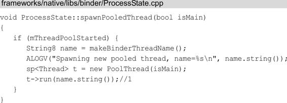

可以看到Binder线程为一个PoolThread。在注释1处调PoolThread的run函数来启动一个新的线程。下面来查看PoolThread类做了什么：

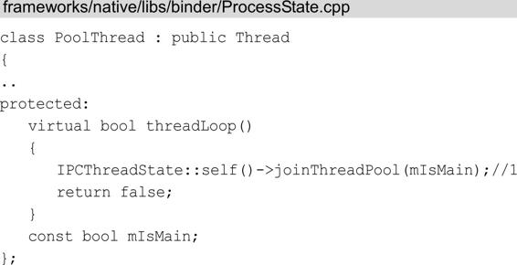

PoolThread类继承了Thread类。在注释1处调用IPCThreadState的joinThreadPool函数，将当前线程注册到Binder驱动程序中，这样我们创建的线程就加入了Binder线程池中，新创建的应用程序进程就支持Binder进程间通信了，我们只需要创建当前进程的Binder对象，并将它注册到ServiceManager中就可以实现Binder进程间通信，而不必关心进程间是如何通过Binder进行通信的。

# 3.4消息循环创建过程

在3.2.2节中学习了Zygote接收请求并创建应用程序进程，还有一个遗留的知识点就是，应用程序进程启动后会创建消息循环。首先我们回到RuntimeInit的invokeStaticMain方法，代码如下所示：

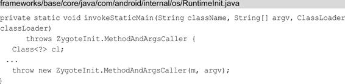

invokeStaticMain方法在3.2节已经讲过，这里不再赘述，主要是看最后一行，会抛出一个MethodAndArgsCaller异常，这个异常会被ZygoteInit的main方法捕获，如下所示：

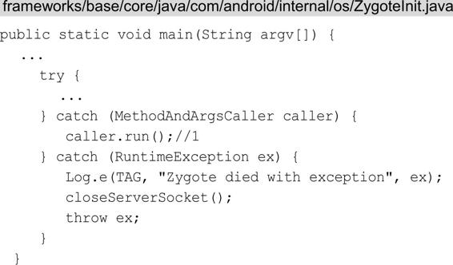

在注释1处捕获到MethodAndArgsCaller时会执行caller的run方法，如下所示：

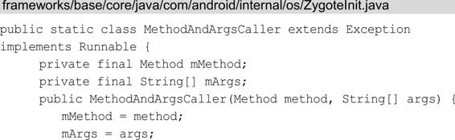

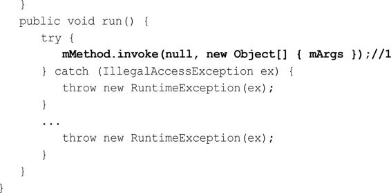

根据3.2.2节我们得知，mMethod指的就是ActivityThread的main方法，mArgs指的是应用程序进程的启动参数。在注释1处调用ActivityThread的main方法，代码如下所示：

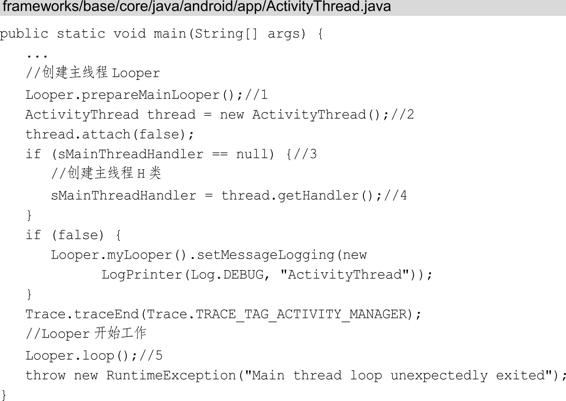

ActivityThread类用于管理当前应用程序进程的主线程，在注释1处创建主线程的消息循环Looper，在注释2处创建ActivityThread。在注释3处判断Handler类型的sMainThreadHandler是否为null，如果为null则在注释4处获取H类并赋值给sMainThreadHandler，这个H类继承自Handler，是ActivityThread的内部类，用于处理主线程的消息循环，在第4章、第5章我们将会经常提到它。在注释5处调用Looper的loop方法，使得Looper开始处理消息。可以看出，系统在应用程序进程启动完成后，就会创建一个消息循环，这样运行在应用程序进程中的应用程序可以方便地使用消息处理机制。

# 小结

本章的内容不多却十分重要，开发人员了解自己所开发的应用的进程是如何创建的是十分必要的。本章以第2章为基础，同时又是第4章的基础，起着承上启下的作用。在3.3和3.4节我们学习了Binder线程池和消息循环是如何创建的，它们是进程和线程间通信的重要手段，其中3.4节讲到的H类，更是第4章、第5章将会经常提到的类。

# 参考

《Android进阶解密》