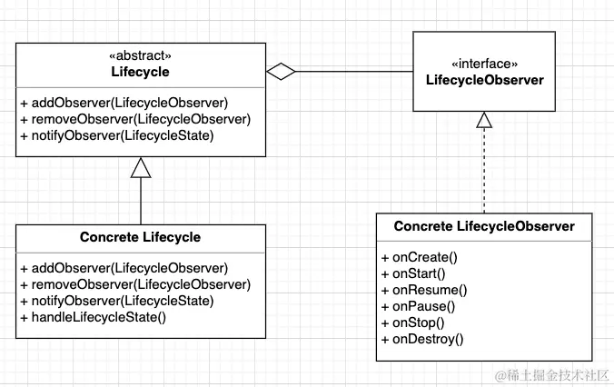
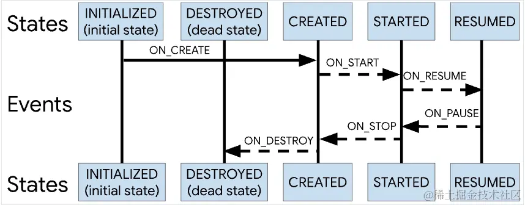
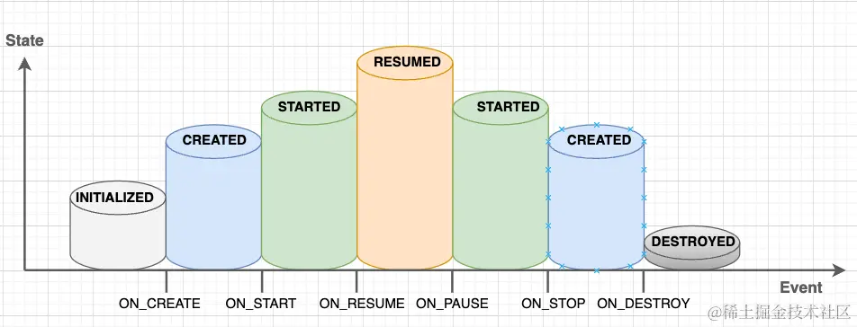
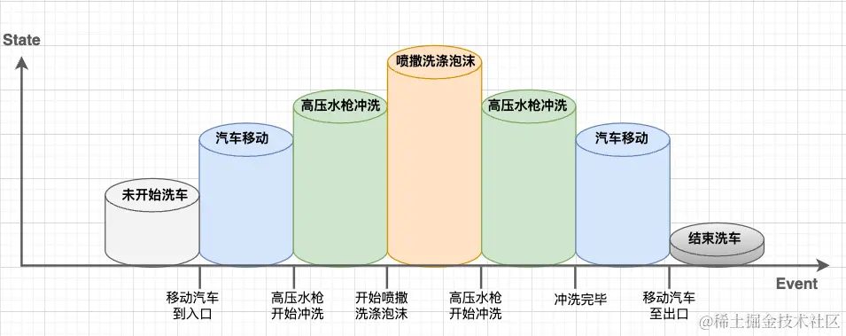
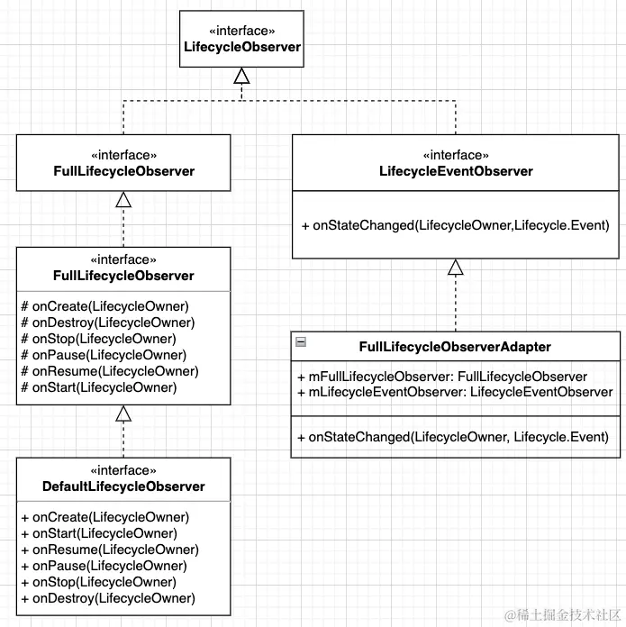

> 源码分析基于：2.6.1

# 前言

我们都知道 `Activity` 与 `Fragment` 都是有生命周期的，例如：`onCreate()`、`onStop()` 这些回调方法就代表着其生命周期状态。我们开发者所做的一些操作都应该合理的控制在生命周期内，比如：当我们在某个 `Activity` 中注册了广播接收器，那么在其 `onDestory()` 前要记得注销掉，避免出现内存泄漏。

生命周期的存在，帮助我们更加方便地管理这些任务。但是，在日常开发中光凭 `Activity` 与 `Fragment` 可不够，我们通常还会使用一些组件来帮助我们实现需求，而这些组件就不像 `Activity` 与 `Fragment` 一样可以很方便地感知到生命周期了。

假设当前有这么一个需求：

> 开发一个简易的视频播放器组件以供项目使用，要求在进入页面后注册播放器并加载资源，一旦播放器所处的页面不可见或者不位于前台时就暂停播放，等到页面可见或者又恢复到前台时再继续播放，最后在页面销毁时则注销掉播放器。

试想一下：如果现在让你来实现该需求？你会怎么去实现呢？

实现这样的需求，我们的播放器组件就需要获取到所处页面的生命周期状态，在 `onCreate()` 中进行注册，`onResume()` 开始播放，`onStop()` 暂停播放，`onDestroy()` 注销播放器。

最简单的方法：提供方法，暴露给使用方，供其自己调用控制。

```kotlin
class VideoPlayerComponent(private val context: Context) {

    /**
     * 注册，加载资源
     */
    fun register() {
        loadResource(context)
    }

    /**
     * 注销，释放资源
     */
    fun unRegister() {
        releaseResource()
    }

    /**
     * 开始播放当前视频资源
     */
    fun startPlay() {
        startPlayVideo()
    }

    /**
     * 暂停播放
     */
    fun stopPlay() {
        stopPlayVideo()
    }
}
```

然后，我们的使用方MainActivity，主动在其相对应的生命周期状态进行控制调用相对应的方法。

```kotlin
class MainActivity : AppCompatActivity() {
    private lateinit var videoPlayerComponent: VideoPlayerComponent

    override fun onCreate(savedInstanceState: Bundle?) {
        super.onCreate(savedInstanceState)
        setContentView(R.layout.activity_main)
	videoPlayerComponent = VideoPlayerComponent(this)
        videoPlayerComponent.register(this)
    }

    override fun onResume() {
        super.onResume()
        videoPlayerComponent.startPlay()
    }

    override fun onPause() {
        super.onPause()
        videoPlayerComponent.stopPlay()
    }

    override fun onDestroy() {
        videoPlayerComponent.unRegister()
        super.onDestroy()
    }

}
```

虽然实现了需求，但显然这不是最优雅的实现方式。一旦使用方忘记在 `onDestroy()` 进行注销播放器，就容易造成内存泄漏，而**忘记注销**显然是一件很容易发生的事情。

回想初衷，之所以将方法暴露给使用方来调用，就是因为我们的组件自身无法感知到使用者的生命周期。所以，一旦我们的组件自身可以感知到使用者的生命周期状态的话，我们就不需要将这些方法暴露出去了。

那么问题来了，组件如何才能感知到生命周期呢？

答：`Lifecycle` !

## Lifecycle 使用案例

直接上案例，借助 `Lifecycle` 我们改进一下我们的播放器组件

```kotlin
class VideoPlayerComponent(private val context: Context) : DefaultLifecycleObserver {

    override fun onCreate(owner: LifecycleOwner) {
        super.onCreate(owner)
        register(context)
    }

    override fun onResume(owner: LifecycleOwner) {
        super.onResume(owner)
        startPlay()
    }

    override fun onPause(owner: LifecycleOwner) {
        super.onPause(owner)
        stopPlay()
    }

    override fun onDestroy(owner: LifecycleOwner) {
        super.onDestroy(owner)
        unRegister()
    }

    /**
     * 注册，加载资源
     */
    private fun register(context: Context) {
        loadResource(context)
    }

    /**
     * 注销，释放资源
     */
    private fun unRegister() {
        releaseResource()
    }

    /**
     * 开始播放当前视频资源
     */
    private fun startPlay() {
        startPlayVideo()
    }

    /**
     * 暂停播放
     */
    private fun stopPlay() {
        stopPlayVideo()
    }
}
```

改进完成后，我们的调用方MainActivity只需要一行代码即可。

```kotlin
class MainActivity : AppCompatActivity() {

    override fun onCreate(savedInstanceState: Bundle?) {
        super.onCreate(savedInstanceState)
        setContentView(R.layout.activity_main)
        
        lifecycle.addObserver(VideoPlayerComponent(this))
    }
}
```

这样是不是就优雅多了。

那这 `Lifecycle` 又是怎么感知到生命周期的呢？让我们这就带着问题，出发探一探它的实现方式与源码！

# 如果让你来做，你会怎么做

在查看源码前，让我们试着思考一下，如果让你来实现 `Jetpack Lifecycle` 这样的功能，你会怎么做呢？该从何入手呢？

我们的目的是不通过回调方法即可获取到生命周期，这其实就是解耦，实现解耦的一种很好方法就是利用观察者模式。

利用观察者模式，我们就可以这么设计



被观察者对象就是生命周期，而观察者对象则是需要知晓生命周期的对象，例如：我们的三方组件。

接着我们就具体探探源码，看一看Google是如何实现的吧。

# Google 实现方式

## Lifecycle

[lifecycle](https://developer.android.com/topic/libraries/architecture/lifecycle) 是 Google 推出的用于响应 `Activity` 和 `Fragment` 生命周期改变的库，允许其他对象去订阅这些状态。

### 基本使用

我们可以调用 `addObserver` 去注册一个监听者

```java
getLifecycle().addObserver(new PersonOne());
```

而 `PersonOne` 则需要实现 `LifecycleObserver` 接口，具体的回调方法则通过注解的形式：

```java
public class PersonOne implements LifecycleObserver {
    private static final String TAG = "PersonOne";

    @OnLifecycleEvent(Lifecycle.Event.ON_START)
    public void onStart() {
        Log.d(TAG, "onStart");
    }
}
```

这样当 Activity 执行到 onStart 方法时，就会调用 PersonOne#onStart 方法。

### 实现原理

> 一个代表着Android生命周期的抽象类，也就是我们的抽象被观察者对象。

```kotlin
public abstract class Lifecycle {

    public abstract void addObserver(@NonNull LifecycleObserver observer);

    public abstract void removeObserver(@NonNull LifecycleObserver observer);

    public enum Event {
        ON_CREATE,
        ON_START,
        ON_RESUME,
        ON_PAUSE,
        ON_STOP,
        ON_DESTROY,
        ON_ANY;
    }

    public enum State {
        DESTROYED,
        INITIALIZED,
        CREATED,
        STARTED,
        RESUMED;
    }

}
```

`Lifecycle` 使用 Event 和 State 来管理生命周期状态的变化，同时定义了抽象方法 `addObserver(LifecycleObserver)` 与`removeObserver(LifecycleObserver)` 方法用于添加与删除生命周期观察者。

#### Event

生命周期变化的事件。当 `Activity | Fragment` 的 `onCreate()`、`onDestroy()`等方法调用时，会分发对应的事件。

#### State

当前生命周期的状态

那这 `State` 又是什么呢？何为状态？他们之间又是什么关系呢？

#### Event 与 State 之间的关系

关于 `Event` 与 `State` 之间的关系，Google官方给出了这么一张两者关系图



乍一看，可能第一感觉不是那么直观，我整理了一下



- `INITIALIZED`：在 `ON_CREATE` 事件触发前。
- `CREATED`：在 `ON_CREATE` 事件触发后以及 `ON_START` 事件触发前；或者在 `ON_STOP` 事件触发后以及 `ON_DESTROY` 事件触发前。
- `STARTED`：在 `ON_START` 事件触发后以及 `ON_RESUME` 事件触发前；或者在 `ON_PAUSE` 事件触发后以及 `ON_STOP` 事件触发前。
- `RESUMED`：在 `ON_RESUME` 事件触发后以及 `ON_PAUSE` 事件触发前。
- `DESTROYED`：在 `ON_DESTROY` 事件触发之后。

`Event` 代表生命周期发生变化那个瞬间点，而 `State` 则表示生命周期的一个阶段。这两者结合的好处就是让我们可以更加直观的感受生命周期，从而可以根据当前所处的生命周期状态来做出更加合理的操作行为。

例如，在`LiveData`的生命周期绑定观察者源码中，就会判断当前被观察者对象的生命周期状态，如果当前是`DESTROYED`状态，则直接移除当前观察者对象。同时，根据被观察者对象当前的生命周期状态是否 `>= STARTED`来判断当前被观察者对象是否是活跃的。

```kotlin
class LifecycleBoundObserver extends ObserverWrapper implements LifecycleEventObserver {
   ......

   @Override
   boolean shouldBeActive() {
      //根据观察者对象当前的生命周期状态是否 >= STARTED 来判断当前观察者对象是否是活跃的。
      return mOwner.getLifecycle().getCurrentState().isAtLeast(STARTED);
   }

  @Override
  public void onStateChanged(@NonNull LifecycleOwner source,
          @NonNull Lifecycle.Event event) {
      //根据当前观察者对象的生命周期状态，如果是DESTROYED，直接移除当前观察者
      Lifecycle.State currentState = mOwner.getLifecycle().getCurrentState();
      if (currentState == DESTROYED) {
          removeObserver(mObserver);
          return;
      }
      ......
  }
  ......

}
```

其实 `Event` 与 `State` 这两者之间的联系，在我们生活中也是处处可见，例如：自动洗车。



想必现在你对 `Event` 与 `State` 之间的关系有了更好的理解了吧。

## LifecycleObserver

> 生命周期观察者，也就是我们的抽象观察者对象。

```kotlin
public interface LifecycleObserver {
}
```

所以，如果我们想成为观察生命周期的观察者的话，就需要实现该接口，也就是成为具体观察者对象。

换句话说，就是如果你想成为观察者对象来观察生命周期的话，那就必须实现 `LifecycleObserver` 接口。

例如Google官方提供的 `DefaultLifecycleObserver`、 `LifecycleEventObserver` 。



## LifecycleOwner

生命周期的持有者，`LifecycleOwner` 用于提供 `Lifecycle`，`LifecycleObserver` 监听 `Lifecycle` 的状态变化，`Lifecycle` 则是 `Activity` 或 `Fragment` 生命周期状态的抽象。

```kotlin
public interface LifecycleOwner {
    @NonNull
    Lifecycle getLifecycle();
}
```

 `Activity | Fragment` 都实现了 `LifecycleOwner` 接口。

具体实现：`Fragment` 实现 `LifecycleOwner` 接口。

```kotlin
public class Fragment implements ComponentCallbacks, OnCreateContextMenuListener, LifecycleOwner,
        ViewModelStoreOwner, HasDefaultViewModelProviderFactory, SavedStateRegistryOwner,
        ActivityResultCaller {

    public Lifecycle getLifecycle() {
        return mLifecycleRegistry;
    }
......

}
```

具体实现：`Activity` 实现 `LifecycleOwner` 接口。

```kotlin
public class ComponentActivity extends androidx.core.app.ComponentActivity implements
        ContextAware,
        LifecycleOwner,
        ViewModelStoreOwner,
        HasDefaultViewModelProviderFactory,
        SavedStateRegistryOwner,
        OnBackPressedDispatcherOwner,
        ActivityResultRegistryOwner,
        ActivityResultCaller {

@NonNull
    @Override
    public Lifecycle getLifecycle() {
        return mLifecycleRegistry;
    }

......

}
```

这样，`Activity | Fragment` 就都是生命周期持有者了。

疑问？在上方 `Activity | Fragment` 的类中，`getLifecycle()` 方法中都是返回 `mLifecycleRegistry`，那这个 `mLifecycleRegistry` 又是什么玩意呢？

## LifecycleRegistry

> 是 `Lifecycle` 的一个具体实现类。

`LifecycleRegistry` 负责管理生命周期观察者对象，并将最新的生命周期事件与状态及时通知给对应的生命周期观察者对象。

### 主要流程

#### 添加与删除观察者对象

```kotlin
//用户保存生命周期观察者对象
private FastSafeIterableMap<LifecycleObserver, ObserverWithState> mObserverMap = new FastSafeIterableMap<>();

@Override
public void addObserver(@NonNull LifecycleObserver observer) {
    enforceMainThreadIfNeeded("addObserver");
    State initialState = mState == DESTROYED ? DESTROYED : INITIALIZED;
    //将生命周期观察者对象包装成带生命周期状态的观察者对象
    ObserverWithState statefulObserver = new ObserverWithState(observer, initialState);
    ObserverWithState previous = mObserverMap.putIfAbsent(observer, statefulObserver);
    ... 省略代码 ...
}

@Override
public void removeObserver(@NonNull LifecycleObserver observer) {
    mObserverMap.remove(observer);
}
```

可以从上述代码中发现，LifecycleRegistry 还对生命周期观察者对象进行了包装，使其带有生命周期状态。

```kotlin
static class ObserverWithState {
    //生命周期状态
    State mState;
    //生命周期观察者对象
    LifecycleEventObserver mLifecycleObserver;

    ObserverWithState(LifecycleObserver observer, State initialState) {
        //这里确保observer为LifecycleEventObserver类型
        mLifecycleObserver = Lifecycling.lifecycleEventObserver(observer);
        //并初始化了状态
        mState = initialState;
    }

    //分发事件
    void dispatchEvent(LifecycleOwner owner, Event event) {
        //根据 Event 得出当前最新的 State 状态
        State newState = event.getTargetState();
        mState = min(mState, newState);
        //触发观察者对象的 onStateChanged() 方法
        mLifecycleObserver.onStateChanged(owner, event);
        //更新状态
        mState = newState;
    }
}
```

#### 通知生命周期事件

将最新的生命周期事件通知给对应的观察者对象。

```kotlin
public void handleLifecycleEvent(@NonNull Lifecycle.Event event) {
    ... 省略代码 ...
    ObserverWithState observer = mObserverMap.entrySet().getValue();
    observer.dispatchEvent(lifecycleOwner, event);
		
    ... 省略代码 ...
    mLifecycleObserver.onStateChanged(owner, event);
}
```

那 `handleLifecycleEvent()` 方法在什么时候被调用呢？

相信看到下方这个代码，你就明白了。

```kotlin
public class FragmentActivity extends ComponentActivity {
   ......

   final LifecycleRegistry mFragmentLifecycleRegistry = new LifecycleRegistry(this);

   @Override
   protected void onCreate(@Nullable Bundle savedInstanceState) {
       mFragmentLifecycleRegistry.handleLifecycleEvent(Lifecycle.Event.ON_CREATE);
   }

   @Override
   protected void onDestroy() {
       mFragmentLifecycleRegistry.handleLifecycleEvent(Lifecycle.Event.ON_DESTROY);
   }

   @Override
   protected void onPause() {
       mFragmentLifecycleRegistry.handleLifecycleEvent(Lifecycle.Event.ON_PAUSE);
   }

   @Override
   protected void onStop() {
       mFragmentLifecycleRegistry.handleLifecycleEvent(Lifecycle.Event.ON_STOP);
   }
   ......
}
```

在 `Activity | Fragment` 的 `onCreate()`、`onStart()`、`onPause()`等生命周期方法中，调用`LifecycleRegistry` 的 `handleLifecycleEvent()` 方法，从而将生命周期事件通知给观察者对象。

#### 小结

`Lifecycle` 通过观察者设计模式，将**生命周期感知对象**与**生命周期提供者**充分解耦，不再需要通过回调方法来感知生命周期的状态，使代码变得更加的精简。

核心原理：Activity（LifecycleOwner）持有 Lifecycle（LifecycleRegister），当执行 Activity 的生命周期方法时，将生命周期事件通过 Lifecycle 通知给 Observer。Observer 也是由 Lifecycle 进行添加、删除、管理的。

虽然不通过 `Lifecycle`，我们的组件也是可以获取到生命周期的，但是 `Lifecycle` 的意义就是提供了统一的调用接口，让我们的组件可以更加方便的感知到生命周期。Google以此推出了更多的生命周期感知型组件，例如：`ViewModel`、`LiveData`。

### 实现细节分析

#### addObserver

`addObserver()` 是添加 `Observer` 的方法，源码如下：

```java
@Override                                                                         
public void addObserver(@NonNull LifecycleObserver observer) {
	enforceMainThreadIfNeeded("addObserver");
    // 如果不是 DESTROYED，则从 INITIALIZED 开始分发
    State initialState = mState == DESTROYED ? DESTROYED : INITIALIZED;
    // ObserverWithState 用于分发事件给 observer
    ObserverWithState statefulObserver = new ObserverWithState(observer, initialState);   
    ObserverWithState previous = mObserverMap.putIfAbsent(observer, statefulObserver);                                                                                
    if (previous != null) { 
        // 唯一性
        return;                                                                   
    }                                                                                     
    LifecycleOwner lifecycleOwner = mLifecycleOwner.get();                       
    if (lifecycleOwner == null) {  
        // mLifecycleOwner 为弱引用
        // it is null we should be destroyed. Fallback quickly                   
        return;                                                                   
    }                                                                           
    
    // isReentrance 表示是否在分发事件时新添加了 observer
    // 举个例子：在 observer 在 onStart() 中又调用了 addObserver()
    boolean isReentrance = mAddingObserverCounter != 0 || mHandlingEvent; 
    // 计算需要分发的状态
    // 4.1
    State targetState = calculateTargetState(observer);                           
    mAddingObserverCounter++; 
    // 将事件逐步分发到 targetState
    while ((statefulObserver.mState.compareTo(targetState) < 0                   
            && mObserverMap.contains(observer))) {
        // 如果 statefulObserver.state 小于 targetState
        pushParentState(statefulObserver.mState);
        // 如果 state 为 STARTED，则 upFrom(state) 则为 ON_RESUME
        final Event event = Event.upFrom(statefulObserver.mState);
        if (event == null) {
            throw new IllegalStateException("no event up from " + statefulObserver.mState);
        }        
        statefulObserver.dispatchEvent(lifecycleOwner, event); 
        popParentState();                                                         
        // mState / subling may have been changed recalculate                     
        targetState = calculateTargetState(observer);                             
    }                                                                                 
    if (!isReentrance) {                                                         
        // we do sync only on the top level.
        // 当前为重入，则不进行同步
        sync();                                                                   
    }                                                                             
    mAddingObserverCounter--;                                                     
}

public static Event upFrom(@NonNull State state) {
    switch (state) {
        case INITIALIZED:
            return ON_CREATE;
        case CREATED:
            return ON_START;
        case STARTED:
            return ON_RESUME;
        default:
            return null;
    }
}                                                                   
```

##### calculateTargetState

```java
private State calculateTargetState(LifecycleObserver observer) {
    // 获取上一个添加的 observer
    Entry<LifecycleObserver, ObserverWithState> previous = mObserverMap.ceil(observer);       
    State siblingState = previous != null ? previous.getValue().mState : null;
    // mParentStates 是个 List，它的添加和删除分别由 pushParentState() 和 popParentState()，它们是成对出现的，在 dispatchEvent 的前后
    // 在这种 case 下，会存在 parentState：在 dispatchEvent 时，又调用了 addObserver()，即上面说的 isReentrance
    State parentState = !mParentStates.isEmpty() ? mParentStates.get(mParentStates.size() - 1)
            : null;
    // 这里的计算是获取更合适的状态
    // 考虑以下这种 case：某个 observer 在 onStart() 中再调用 addObserver，那这个 observer 理应使用 STARTED 状态分发，而当前状态即 mState 可能是 RESUMED，再在 sync() 中进行同步
    return min(min(mState, siblingState), parentState);                           
}
```

`addObserver()` 主要考虑了 Reentrance 的情况，即在 `observer` 的事件分发中，又添加了新的 `observer` 的情况。

#### handleLifecycleEvent

`LifecycleRegistry` 是 `Lifecycle` 的实现类，看下 `handleLifecycleEvent` 的实现：

```java
public void handleLifecycleEvent(@NonNull Lifecycle.Event event) {    
	enforceMainThreadIfNeeded("handleLifecycleEvent");                           
    moveToState(event.getTargetState());                     
}              

private void moveToState(State next) {                                
    if (mState == next) {                                             
        return;                                                       
    }                                                                 
    mState = next;                                                    
    if (mHandlingEvent || mAddingObserverCounter != 0) {
        // 正在处理事件中或者正在处理添加 Observer 中
        mNewEventOccurred = true;                                     
        // we will figure out what to do on upper level.              
        return;                                                       
    }
    // 标记正在处理事件
    mHandlingEvent = true;
    // 同步状态
    sync();                                                           
    mHandlingEvent = false;                                           
}

// happens only on the top of stack (never in reentrance),                       
// so it doesn't have to take in account parents                                 
private void sync() {
    // 使用弱应用持有 LifecycleOwner，也是为了防止 Activity/Fragment 内存泄漏
    LifecycleOwner lifecycleOwner = mLifecycleOwner.get();                       
    
    if (lifecycleOwner == null) {
        throw new IllegalStateException("LifecycleOwner of this LifecycleRegistry is already" + "garbage collected. It is too late to change lifecycle state.");   
        return;                                                                  
    }                                                                                         
    while (!isSynced()) {
        // 如果还没完成同步
        mNewEventOccurred = false;                                               
        // no need to check eldest for nullability, because isSynced does it for us.
        // 使用 eldest(start) 判断是否需要回退 
        // 使用 newest(end) 判断是否需要前进，刚添加的 observer 一般为初始化状态
        if (mState.compareTo(mObserverMap.eldest().getValue().mState) < 0) {
            // 最先添加的 observer 的状态大于当前状态，回退
            // 3.1
            backwardPass(lifecycleOwner);                                       
        }                                                                                     
        Entry<LifecycleObserver, ObserverWithState> newest = mObserverMap.newest();           
        if (!mNewEventOccurred && newest != null                                 
                && mState.compareTo(newest.getValue().mState) > 0) {
            // 最新添加的 observer 如果状态一致，则可以乐观地表示在它之前添加的 observer 状态也是一致的
            // mNewEventOccurred 表示有新的事件发生，则放弃这次同步，延迟到下一次
            // 3.2
            forwardPass(lifecycleOwner);                                         
        }                                                                         
    }                                                                             
    mNewEventOccurred = false;                                                   
}

private boolean isSynced() {                                                     
    if (mObserverMap.size() == 0) {                                               
        return true;                                                             
    }
    // eldest 最先添加的，newest 最新添加的
    State eldestObserverState = mObserverMap.eldest().getValue().mState;         
    State newestObserverState = mObserverMap.newest().getValue().mState;
    // 判断状态是否一致
    return eldestObserverState == newestObserverState && mState == newestObserverState; 
}
```

使用 `sync()` 同步状态，这里分为两种情况，一种是需要回退状态（backward），另外一种则是需要前进（forward），其中 `backward` 代码如下：

##### backward

```java
private void backwardPass(LifecycleOwner lifecycleOwner) {
    // 使用 eldest(start) 判断是否需要回退 
    // 降序迭代，end -> start
    Iterator<Entry<LifecycleObserver, ObserverWithState>> descendingIterator =  
            mObserverMap.descendingIterator();                                   
    while (descendingIterator.hasNext() && !mNewEventOccurred) {
        // mNewEventOccurred 判断是否有新事件分发
        Entry<LifecycleObserver, ObserverWithState> entry = descendingIterator.next(); 
        ObserverWithState observer = entry.getValue();                           
        while ((observer.mState.compareTo(mState) > 0 && !mNewEventOccurred       
                && mObserverMap.contains(entry.getKey()))) {
            // 回退
            // 举个例子：observer.state 为 RESUMED
            // mState 为 CREATED
            // downEvent(observer.state) 为 ON_PAUSE
            Event event = Event.downFrom(observer.mState);
            // getStateAfter(event) 为 STARTED
            // 最终：RESUMED -> STARTED，在下一次同步中再同步为 CREATED
            // pushParentState 和 popParentState 则是将 state 暂存在 List 中，这个作用我们会在 addObserver 中讲
            pushParentState(getStateAfter(event));
            // 分发事件
            observer.dispatchEvent(lifecycleOwner, event);                       
            popParentState();                                                     
        }                                                                         
    }                                                                             
}
	// Event#downFrom
    public static Event downFrom(@NonNull State state) {
        switch (state) {
            case CREATED:
                return ON_DESTROY;
            case STARTED:
                return ON_STOP;
            case RESUMED:
                return ON_PAUSE;
            default:
                return null;
        }
    }

	// ObserverWithState.java
    void dispatchEvent(LifecycleOwner owner, Event event) {
        State newState = event.getTargetState();
        mState = min(mState, newState);
        mLifecycleObserver.onStateChanged(owner, event);
        mState = newState;
    }
```

总结下 `backwardPass()` 的逻辑：将较大的状态逐步回退。为什么说是逐步呢？比如 `observer.state` 是 `RESUMED`，当前状态是 `CREATED`，那这里会分两次回退，分别为：`RESUMED -> STARTED` 和 `STARTED -> CREATED`

`forwardPass()` 逻辑类似，则不分析了。

# ComponentActivity 示例分析

通过前面的分析已经知道了生命周期事件是通过 handleLifecycleEvent 方法从 Activity 中通知到 Lifecycle 再到 Observer的。

下面以 ComponentActivity 为例，看看 handleLifecycleEvent方法 又是如何被调用到的。

```java
private LifecycleRegistry mLifecycleRegistry = new LifecycleRegistry(this);

@CallSuper                                                   
@Override                                                    
protected void onSaveInstanceState(Bundle outState) {
    // 这里需要注意，onSaveInstanceState 状态设置为 CREATED
    mLifecycleRegistry.markState(Lifecycle.State.CREATED);   
    super.onSaveInstanceState(outState);                     
}                                                            

@Override                         
public Lifecycle getLifecycle() { 
    return mLifecycleRegistry;    
}

@Override                                                        
@SuppressWarnings("RestrictedApi")                               
protected void onCreate(@Nullable Bundle savedInstanceState) {   
    super.onCreate(savedInstanceState);     
    // 2.2
    ReportFragment.injectIfNeededIn(this);                       
}
```

可以看到代码非常简洁，那它又是怎么去实现的呢？可以看到在 `onCreate` 中会调用 `ReportFragment.injectIfNeededIn`

## ReportFragment

### injectIfNeededIn()

实现监听 Activity 生命周期回调。

```java
    public static void injectIfNeededIn(Activity activity) {
        if (Build.VERSION.SDK_INT >= 29) {
            // On API 29+, we can register for the correct Lifecycle callbacks directly
            LifecycleCallbacks.registerIn(activity);
        }
        // Prior to API 29 and to maintain compatibility with older versions of
        // ProcessLifecycleOwner (which may not be updated when lifecycle-runtime is updated and
        // need to support activities that don't extend from FragmentActivity from support lib),
        // use a framework fragment to get the correct timing of Lifecycle events
        android.app.FragmentManager manager = activity.getFragmentManager();
        if (manager.findFragmentByTag(REPORT_FRAGMENT_TAG) == null) {
            manager.beginTransaction().add(new ReportFragment(), REPORT_FRAGMENT_TAG).commit();
            // Hopefully, we are the first to make a transaction.
            manager.executePendingTransactions();
        }
    }
```

那 ReportFragment 是怎么知道 Activity 的生命周期的呢？

可以看到在 SDK_INT >= 29 版本以上和以下实现是有区别的，先来看 SDK_INT >= 29 的实现：

### SDK_INT >= 29

从下面可以看到是基于 Application.ActivityLifecycleCallbacks 接口实现的，在 29 以及以上，系统已经提供了 Activity 生命周期回调，通过实现此接口，就可以知道 Activity 当前的生命周期了。

```kotlin
open class ReportFragment() : android.app.Fragment() {
 
internal class LifecycleCallbacks : Application.ActivityLifecycleCallbacks {
...
        override fun onActivityPostCreated(
            activity: Activity,
            savedInstanceState: Bundle?
        ) {
            dispatch(activity, Lifecycle.Event.ON_CREATE)
        }
...
        companion object {
            @JvmStatic
            fun registerIn(activity: Activity) {
                activity.registerActivityLifecycleCallbacks(LifecycleCallbacks())
            }
        }
    }
}
```

这样，当 LifecycleCallbacks 中回调生命周期方法后，ReportFragment 则会转交给 Lifecycle，继而分发到 Observer。

```kotlin
        @JvmStatic
        internal fun dispatch(activity: Activity, event: Lifecycle.Event) {
            if (activity is LifecycleRegistryOwner) {
                activity.lifecycle.handleLifecycleEvent(event)
                return
            }
            if (activity is LifecycleOwner) {
                val lifecycle = (activity as LifecycleOwner).lifecycle
                if (lifecycle is LifecycleRegistry) {
                    lifecycle.handleLifecycleEvent(event)
                }
            }
        }
```

### SDK_INT < 29

通过添加一个 `ReportFragment` 到 Activity 中，从而实现监听生命周期的目的，跟 >=29 的区别就是 >=29 的版本是不会添加 ReportFragment 到 Activity 中的。如果有阅读过 Glide 源码的同学，应该会看到类似的实现：通过添加一个透明的 `Fragment` 来监听 `Activity` 的生命周期。

```kotlin
android.app.FragmentManager manager = activity.getFragmentManager();
        if (manager.findFragmentByTag(REPORT_FRAGMENT_TAG) == null) {
            manager.beginTransaction().add(new ReportFragment(), REPORT_FRAGMENT_TAG).commit();
            // Hopefully, we are the first to make a transaction.
            manager.executePendingTransactions();
        }
```

```java
    @Override
    public void onActivityCreated(Bundle savedInstanceState) {
        super.onActivityCreated(savedInstanceState);
        dispatchCreate(mProcessListener);
        dispatch(Lifecycle.Event.ON_CREATE);
    }
...
    private void dispatch(@NonNull Lifecycle.Event event) {
        if (Build.VERSION.SDK_INT < 29) {
            // Only dispatch events from ReportFragment on API levels prior
            // to API 29. On API 29+, this is handled by the ActivityLifecycleCallbacks
            // added in ReportFragment.injectIfNeededIn
            dispatch(getActivity(), event);
        }
    }
    
    static void dispatch(@NonNull Activity activity, @NonNull Lifecycle.Event event) {
        if (activity instanceof LifecycleRegistryOwner) {
            // 3
            ((LifecycleRegistryOwner) activity).getLifecycle().handleLifecycleEvent(event);
            return;
        }

        if (activity instanceof LifecycleOwner) {
            Lifecycle lifecycle = ((LifecycleOwner) activity).getLifecycle();
            if (lifecycle instanceof LifecycleRegistry) {
                ((LifecycleRegistry) lifecycle).handleLifecycleEvent(event);
            }
        }
    }
```

在 `Activity` 的各种生命周期回调方法中，调用 `handleLifecycleEvent()` 分发 `Lifecycle.Event`

## 小结

到此，我们知道除了 Activity 在生命周期方法中直接调用 handleLifecycleEvent 方法将生命周期事件通知给 LifecycleObserver 外，还可以通过下面 2 种方式完成通知：

1、>=29时，实现系统提供的 Application.ActivityLifecycleCallbacks 接口，并添加到 Activity 中

2、将 ReportFragment 添加到 Activity 中，并在 ReportFragment 的回调方法中实现

# ProcessLifecycleOwner

`ProcessLifecycleOwner` 提供应用进程的生命周期。跟 `Activity` 和 `Fragment` 的生命周期不一样的是：

- `ON_CREATE` 只会分发一次
- `ON_DESTROY` 则不会被分发
- `ON_START` 和 `ON_RESUME` 在第一个 `Activity` 的时候分发
- `ON_PAUSE` 和 `ON_STOP` 则在最后一个 `Activity` 的时候**延迟**分发，用于防止因为配置改变，而导致 `Activity` 重建

下面我们来分析下 `ProcessLifecycleOwner` 的源码，首先看下 `init()`：

```java
// 单例
private static final ProcessLifecycleOwner sInstance = new ProcessLifecycleOwner();

static void init(Context context) {
    // 调用 attach
    sInstance.attach(context);      
}                                   

void attach(Context context) {                                                   
    mHandler = new Handler();
    // 同样是使用 LifecycleRegistry 来处理
    // 先分发 ON_CREATE，而且只会分发一次
    mRegistry.handleLifecycleEvent(Lifecycle.Event.ON_CREATE);                   
    Application app = (Application) context.getApplicationContext();
    app.registerActivityLifecycleCallbacks(new EmptyActivityLifecycleCallbacks() {      
        public void onActivityPreCreated(@NonNull Activity activity,
                @Nullable Bundle savedInstanceState) {
            activity.registerActivityLifecycleCallbacks(new EmptyActivityLifecycleCallbacks() {
                @Override
                public void onActivityPostStarted(@NonNull Activity activity) {
                    activityStarted();
                }
                @Override
                public void onActivityPostResumed(@NonNull Activity activity) {
                    activityResumed();
                }
            });
        }
        
        @Override                                                                 
        public void onActivityCreated(Activity activity, Bundle savedInstanceState) {   
 			if (Build.VERSION.SDK_INT < 29) {
                ReportFragment.get(activity).setProcessListener(mInitializationListener);
            } 
        }                                                                               
                                                                                        
        @Override                                                                       
        public void onActivityPaused(Activity activity) {                               
            activityPaused();                                                           
        }                                                                               
                                                                                        
        @Override                                                                       
        public void onActivityStopped(Activity activity) {                              
            activityStopped();                                                          
        }                                                                               
    });                                                                                 
}

ActivityInitializationListener mInitializationListener =      
        new ActivityInitializationListener() {                
            @Override                                         
            public void onCreate() {                          
            }                                                 
                                                              
            @Override                                         
            public void onStart() {                           
                activityStarted();                            
            }                                                 
                                                              
            @Override                                         
            public void onResume() {                          
                activityResumed();                            
            }                                                 
        };
                                
// ground truth counters                         
private int mStartedCounter = 0;                 
private int mResumedCounter = 0;                 
                                                 
private boolean mPauseSent = true;               
private boolean mStopSent = true;                

void activityStarted() {
    // 计数
    mStartedCounter++;                                            
    if (mStartedCounter == 1 && mStopSent) {
        // 第一次调用，分发 ON_START
        // mStopSent 为 true 的情况：
        // 1. 默认为 true
        // 2. dispatchStopIfNeeded 中设置
        // 防止因为配置改变，Activity 创建而导致重新分发
        mRegistry.handleLifecycleEvent(Lifecycle.Event.ON_START); 
        mStopSent = false;                                        
    }                                                             
}

 void activityResumed() {                                               
     mResumedCounter++;                                                 
     if (mResumedCounter == 1) {                                        
         if (mPauseSent) {
             // 第一次调用分发 ON_RESUME
             mRegistry.handleLifecycleEvent(Lifecycle.Event.ON_RESUME); 
             mPauseSent = false;                                        
         } else { 
             // 配置改变，Activity 创建，删除延迟的 pause runnable
             mHandler.removeCallbacks(mDelayedPauseRunnable);           
         }                                                              
     }                                                                  
 }
```

上面是初始事件分发流程，下面我们来看下 `ON_PAUSE` 和 `ON_STOP` 的分发：

```java
@VisibleForTesting                               
static final long TIMEOUT_MS = 700; //mls 

// 在 onActivityPaused 中调用
void activityPaused() {
    // 计数
    mResumedCounter--;                                              
    if (mResumedCounter == 0) {
        // 延迟分发
        mHandler.postDelayed(mDelayedPauseRunnable, TIMEOUT_MS);    
    }                                                               
}
 
private Runnable mDelayedPauseRunnable = new Runnable() { 
    @Override                                             
    public void run() { 
        // 延迟分发
        dispatchPauseIfNeeded();                          
        dispatchStopIfNeeded();                           
    }                                                     
};                                                        

void activityStopped() { 
    // 计数
    mStartedCounter--;                                              
    dispatchStopIfNeeded();                                         
}                                                                   
                                                                    
void dispatchPauseIfNeeded() {
    if (mResumedCounter == 0) {
        // 计数
        mPauseSent = true;
        // 分发 ON_PAUSE
        mRegistry.handleLifecycleEvent(Lifecycle.Event.ON_PAUSE);   
    }                                                               
}                                                                   
                                                                    
void dispatchStopIfNeeded() {                                       
    if (mStartedCounter == 0 && mPauseSent) {
        // 计数为 0，同时已经分发了 ON_PAUSE
        // 分发 ON_STOP
        mRegistry.handleLifecycleEvent(Lifecycle.Event.ON_STOP);    
        mStopSent = true;                                           
    }                                                               
}
```

到这里，我们已经将 `ProcessLifecycleOwner` 的流程分析完了，那 `ProcessLifecycleOwner.init()` 是在那里调用的呢？

其实是用了一种比较巧妙的方法，在 `lifecycle-process` 这个包下的 `AndroidManifest.xml` 文件中，可以看到有如下配置：

```xml
<application>
        <provider
            android:name="androidx.lifecycle.ProcessLifecycleOwnerInitializer"
            android:authorities="${applicationId}.lifecycle-process"
            android:exported="false"
            android:multiprocess="true" />
</application>
```

其中 `ProcessLifecycleOwnerInitializer` 是一个 `ContentProvider` 即利用 `ContentProvider` 来实现自动初始化

> ContentProvider 的 `onCreate` 方法会在应用启动时候调用
>
> Implement this to initialize your content provider on startup. This method is called for all registered content providers on the application main thread at application launch time. It must not perform lengthy operations, or application startup will be delayed.

```java
@Override                                     
public boolean onCreate() {                   
    LifecycleDispatcher.init(getContext());   
    ProcessLifecycleOwner.init(getContext()); 
    return true;                              
}
```

可以看到这里调用了两个初始化方法，其中 `ProcessLifecycleOwner.init()` 我们已经分析了，再看看 `LifecycleDispatcher.init()`

```java
static void init(Context context) {                                                 
    if (sInitialized.getAndSet(true)) {                                             
        return;                                                                     
    }                                                                               
    ((Application) context.getApplicationContext())                                 
            .registerActivityLifecycleCallbacks(new DispatcherActivityCallback());  
}                                                                                   
                                                                                    
@SuppressWarnings("WeakerAccess")                                                   
@VisibleForTesting                                                                  
static class DispatcherActivityCallback extends EmptyActivityLifecycleCallbacks {   
                                                                                    
    @Override                                                                       
    public void onActivityCreated(Activity activity, Bundle savedInstanceState) {   
        ReportFragment.injectIfNeededIn(activity);                                  
    }                                                                               
                                                                                    
    @Override                                                                       
    public void onActivityStopped(Activity activity) {                              
    }                                                                               
                                                                                    
    @Override                                                                       
    public void onActivitySaveInstanceState(Activity activity, Bundle outState) {   
    }                                                                               
}
```

初始化的逻辑比较简单，即在 `Activity` 创建时，调用 `ReportFragment.injectIfneededIn()` ，其实我们在 `Activity` 的 `Lifecycle` 处理中，也见到这个方法：

```
// ComponentActivity.java
@Override                                                        
@SuppressWarnings("RestrictedApi")                               
protected void onCreate(@Nullable Bundle savedInstanceState) {   
    super.onCreate(savedInstanceState);                          
    ReportFragment.injectIfNeededIn(this);                       
}

// ReportFragment.java
public static void injectIfNeededIn(Activity activity) {                                 
    // ProcessLifecycleOwner should always correctly work and some activities may not extend  
    // FragmentActivity from support lib, so we use framework fragments for activities   
    android.app.FragmentManager manager = activity.getFragmentManager();                 
    if (manager.findFragmentByTag(REPORT_FRAGMENT_TAG) == null) {
        // 重复添加判断
        manager.beginTransaction().add(new ReportFragment(), REPORT_FRAGMENT_TAG).commit();   
        // Hopefully, we are the first to make a transaction.                             
        manager.executePendingTransactions();                                             
    }                                                                                     
}
```

这里可以理解为双重保障吧，可能存在不继承 `ComponentActivity` 的 `Activity`。

### 小结

分析了 `Lifecycle` 的整个流程，可以发现其实逻辑还是比较简单的，实现上也是参考了其他开源库的做法，比如 `ReportFragment` 通过添加一个透明的 `Fragment` 去感知 `Activity` 的生命周期，`Glide` 也是这么做的。还有使用 `ContentProvider` 去实现在 `Application` 创建时自动初始化，也是一个不错的想法。

`Lifecycle` 的源码比我一开始想象的复杂，不是在于它的逻辑，而是在 `sync()` 这一块，通过 `Listener` 执行状态回调是一个非常常见的做法，但是有很多需要考虑的 case，举个例子，在分发回调时，有新的状态发生，那么应该怎么去处理。或者，在回调方法中，又添加了新的 `Listener`，那应该怎么处理。

学习源码，不仅仅是学习实现原理，还可以学习一个健壮的库是如何处理各种场景下的 case 的。


# 参考

1、[我尝试以最简单的方式帮你梳理 Lifecycle](https://juejin.cn/post/7176901382702628924)
