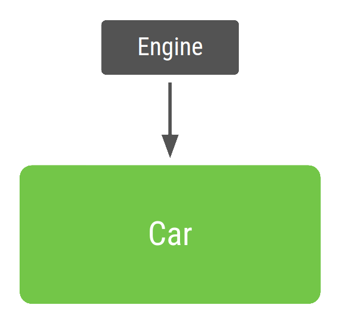

# Android 中的依赖项注入

依赖项注入 (DI) 是一种广泛用于编程的技术，非常适用于 Android 开发。遵循 DI 的原则可以为构造良好的应用架构奠定基础。

实现依赖项注入可带来以下优势：

- 重用代码
- 易于重构
- 易于测试

## 依赖项注入基础知识

在专门介绍 Android 中的依赖项注入之前，先简要介绍一下依赖项注入的工作原理。

### 什么是依赖项注入？

类通常需要引用其他类。例如，`Car` 类可能需要引用 `Engine` 类。这些必需的类称为依赖项，在此示例中，`Car` 类必须拥有 `Engine` 类的一个实例才能运行。

类可通过以下三种方式获取所需的对象：

1. 类构造其所需的依赖项。在不使用依赖项注入的情况下，下面的示例中，`Car` 将创建并初始化自己的 `Engine` 实例。

   ```kotlin
   class Car {
       private val engine = Engine()
       fun start() {
           engine.start()
       }
   }
   fun main(args: Array)
   ```

   

   这可能会有问题，原因如下：

   - `Car` 和 `Engine` 密切相关 - `Car` 的实例使用一种类型的 `Engine`，并且无法轻松使用子类或替代实现。如果 `Car` 要构造自己的 `Engine`，你必须创建两种类型的 `Car`，而不是直接将同一 `Car` 重用于 `Gas` 和 `Electric` 类型的引擎。
   - 对 `Engine` 的强依赖使得测试更加困难。`Car` 使用 `Engine` 的真实实例，因此你无法使用[测试替身](https://en.wikipedia.org/wiki/Test_double)针对不同的测试用例修改 `Engine`。

2. 从其他地方抓取。某些 Android API（如 `Context` getter 和 `getSystemService()`）便是如此获取对象的。

3. 以参数形式提供。应用可以在构造类时提供这些依赖项，或者将这些依赖项传入需要各个依赖项的函数。在上面的示例中，`Car` 构造函数将接收 `Engine` 作为参数。

第三种方式就是依赖项注入！使用这种方法，可以获取并提供类的依赖项，而不必让类实例自行获取。

如果使用依赖项注入，代码是什么样子的呢？`Car` 的每个实例在其构造函数中接收 `Engine` 对象作为参数，而不是在初始化时构造自己的 `Engine` 对象：

```kotlin
class Car(private val engine: Engine) {
    fun start() {
        engine.start()
    }
}

fun main(args: Array)
```



`main` 函数会使用 `Car`。由于 `Car` 依赖于 `Engine`，因此应用会创建 `Engine` 的实例，然后使用它构造 `Car` 的实例。这种基于 DI 的方法具有以下优势：

- 重用 `Car`。你可以将 `Engine` 的不同实现传入 `Car`。例如，你可以定义一个想让 `Car` 使用的新的 `Engine` 子类并将其命名为 `ElectricEngine`。如果你使用 DI，只需传入更新后的 `ElectricEngine` 子类的实例，`Car` 仍可正常使用，无需任何进一步更改。
- 轻松测试 `Car`。你可以传入测试替身以测试不同场景。例如，你可以创建一个名为 `FakeEngine` 的 `Engine` 测试替身，并针对不同的测试进行配置。

Android 中实现依赖项注入的方式主要有两种：

- **构造函数注入**。这就是上面描述的方式。你将某个类的依赖项传入其构造函数。
- **字段注入（或 setter 注入）**。某些 Android 框架类（如 activity 和 fragment）由系统实例化，因此无法进行构造函数注入。使用字段注入时，依赖项将在创建类后实例化。代码如下所示：

```kotlin
class Car {
    lateinit var engine: Engine

    fun start() {
        engine.start()
    }
}

fun main(args: Array)
```

**注意**：依赖项注入以[控制反转](https://en.wikipedia.org/wiki/Inversion_of_control)原则为基础，根据该原则，通用代码控制着特定代码的执行。

### 自动依赖项注入

在上一个示例中，你未依赖于库自行创建、提供并管理了不同类的依赖项。这称为手动依赖项注入或人工依赖项注入。在 `Car` 示例中，只有一个依赖项，但依赖项和类越多，手动依赖项注入就越繁琐。手动依赖项注入还会带来多个问题：

- 对于大型应用，获取所有依赖项并正确连接它们可能需要大量样板代码。在多层架构中，要为顶层创建一个对象，必须提供下层的所有依赖项。例如，要制造一辆真车，可能需要引擎、变速器、底盘以及其他部件；而要制造引擎，则需要汽缸和火花塞。
- 如果你无法在传入依赖项之前构造依赖项（例如，当使用延迟初始化或将对象作用域限定为应用流时），则需要编写并维护用于管理内存中依赖项生命周期的自定义容器（或依赖关系图）。

有一些库通过自动执行创建和提供依赖项的过程解决此问题。它们归为两类：

- 基于反射的解决方案，可在运行时连接依赖项。
- 静态解决方案，可在编译时生成连接依赖项的代码。

[Dagger](https://dagger.dev/) 是适用于 Java、Kotlin 和 Android 的热门依赖项注入库，由 Google 进行维护。Dagger 会为你创建和管理依赖关系图，方便你在应用中使用 DI。它提供了完全静态和编译时依赖项，解决了基于反射的解决方案（如 [Guice](https://en.wikipedia.org/wiki/Google_Guice)）的诸多开发和性能问题。

## 依赖项注入的替代方法

依赖项注入的替代方法是使用[服务定位器](https://en.wikipedia.org/wiki/Service_locator_pattern)。服务定位器设计模式还改进了类与具体依赖项的分离。你可以创建一个名为服务定位器的类，该类可创建和存储依赖项，然后按需提供这些依赖项。

```kotlin
object ServiceLocator {
    fun getEngine(): Engine = Engine()
}

class Car {
    private val engine = ServiceLocator.getEngine()

    fun start() {
        engine.start()
    }
}

fun main(args: Array
```

服务定位器模式与依赖项注入在元素使用方式上有所不同。使用服务定位器模式，类可以控制并请求注入对象；使用依赖项注入，应用可以控制并主动注入所需对象。

与依赖项注入相比：

- 服务定位器所需的依赖项集合使得代码更难测试，因为所有测试都必须与同一全局服务定位器进行交互。
- 依赖项在类实现中编码，而不是在 API surface 中编码。因此，很难从外部了解类需要什么。所以，更改 `Car` 或服务定位器中可用的依赖项可能会导致引用失败，从而导致运行时或测试失败。
- 如果你想将作用域限定为除了整个应用的生命周期之外的任何区间，就会更难管理对象的生命周期。

## 在 Android 应用中使用 Hilt

[Hilt](https://developer.android.google.cn/training/dependency-injection/hilt-android?hl=zh-cn) 是推荐用于在 Android 中实现依赖项注入的 Jetpack 库。Hilt 定义了一种在应用中实现 DI 的标准方法，它会为项目中的每个 Android 类提供容器并自动为你管理其生命周期。

Hilt 在热门 DI 库 [Dagger](https://developer.android.google.cn/training/dependency-injection/dagger-basics?hl=zh-cn) 的基础上构建而成，因而能够受益于 Dagger 提供的编译时正确性、运行时性能、可伸缩性和 Android Studio 支持。

如需详细了解 Hilt，请参阅[使用 Hilt 实现依赖项注入](https://developer.android.google.cn/training/dependency-injection/hilt-android?hl=zh-cn)。

## 总结

依赖项注入会为你的应用提供以下优势：

- 重用类以及分离依赖项：更容易换掉依赖项的实现。由于控制反转，代码重用得以改进，并且类不再控制其依赖项的创建方式，而是支持任何配置。
- 易于重构：依赖项成为 API Surface 的可验证部分，因此可以在创建对象时或编译时进行检查，而不是作为实现详情隐藏。
- 易于测试：类不管理其依赖项，因此在测试时，你可以传入不同的实现以测试所有不同用例。

如需充分了解依赖项注入的优势，你应该按照[手动依赖项注入](https://developer.android.google.cn/training/dependency-injection/manual?hl=zh-cn)中的说明在应用中手动试用。

## 

# 手动依赖项注入

[Android 推荐应用架构](https://developer.android.google.cn/jetpack/docs/guide?hl=zh-cn#recommended-app-arch)建议将代码划分为多个类，以从分离关注点这一原则（其中，层次结构的每个类都具有一项已定义的职责）中受益。这就需要将更多更小的类连接在一起，以实现彼此之间的依赖关系。

**图 1.** Android 应用的应用图表模型

各个类之间的依赖关系可以表示为图表，其中每个类都连接到其所依赖的类。所有类及其依赖关系的表示法便构成了应用图表。在图 1 中，你可以看到应用图表的抽象呈现。 当 A 类 (`ViewModel`) 依赖于 B 类 (`Repository`) 时，有一条从 A 指向 B 的直线表示该依赖关系。

依赖项注入有助于建立这些连接，并使你可以更换实现以进行测试。例如，在测试依赖于代码库的 `ViewModel` 时，你可以通过伪造或模拟传递 `Repository` 的不同实现，以测试不同的情形。

## 手动依赖项注入的基础知识

本部分介绍如何在实际 Android 应用场景中应用手动依赖项注入。本部分详细介绍了如何开始在应用中使用依赖项注入的迭代方法。该方法会不断改进，直至达到与 Dagger 自动为你生成的场景相似的程度。如需详细了解 Dagger，请参阅 [Dagger 基础知识](https://developer.android.google.cn/training/dependency-injection/dagger-basics?hl=zh-cn)。

将**流程**视为应用中与某项功能相对应的一组屏幕。登录、注册和签出都是流程的示例。

在介绍典型 Android 应用的登录流程时，`LoginActivity` 依赖于 `LoginViewModel`，而后者又依赖于 `UserRepository`。然后，`UserRepository` 依赖于 `UserLocalDataSource` 和 `UserRemoteDataSource`，后者又依赖于 [`Retrofit`](https://square.github.io/retrofit/) 服务。


`LoginActivity` 是登录流程的入口点，用户与 activity 进行交互。因此，`LoginActivity` 需要创建 `LoginViewModel`及其所有依赖项。

该流程的 `Repository` 和 `DataSource` 类如下所示：

```kotlin
class UserRepository(
    private val localDataSource: UserLocalDataSource,
    private val remoteDataSource: UserRemoteDataSource
) { ... }

class UserLocalDataSource { ... }
class UserRemoteDataSource(
    private val loginService: LoginRetrofitService
) { ... }
```

`LoginActivity` 如下所示：

```kotlin
class LoginActivity: Activity() {

    private lateinit var loginViewModel: LoginViewModel

    override fun onCreate(savedInstanceState: Bundle?) {
        super.onCreate(savedInstanceState)

        // In order to satisfy the dependencies of LoginViewModel, you have to also
        // satisfy the dependencies of all of its dependencies recursively.
        // First, create retrofit which is the dependency of UserRemoteDataSource
        val retrofit = Retrofit.Builder()
            .baseUrl("https://example.com")
            .build()
            .create(LoginService::class.java)

        // Then, satisfy the dependencies of UserRepository
        val remoteDataSource = UserRemoteDataSource(retrofit)
        val localDataSource = UserLocalDataSource()

        // Now you can create an instance of UserRepository that LoginViewModel needs
        val userRepository = UserRepository(localDataSource, remoteDataSource)

        // Lastly, create an instance of LoginViewModel with userRepository
        loginViewModel = LoginViewModel(userRepository)
    }
}
```

这种方法存在以下问题：

1. 有大量样板代码。如需在代码的另一部分中创建另一个 `LoginViewModel` 实例，则需要使用重复代码。
2. 必须按顺序声明依赖项。必须在 `LoginViewModel` 之前实例化 `UserRepository` 才能创建它。
3. 很难重复使用对象。如需在多项功能中重复使用 `UserRepository`，必须使其遵循[单例模式](https://en.wikipedia.org/wiki/Singleton_pattern)。单例模式使测试变得更加困难，因为所有测试共享相同的单例实例。

## 使用容器管理依赖项

如需解决重复使用对象的问题，你可以创建自己的依赖项容器类，用于获取依赖项。此容器提供的所有实例可以是公共实例。在该示例中，由于你仅需要 `UserRepository` 的一个实例，你可以将其依赖项设为私有，并且可以在将来需要提供依赖项时将其公开：

```kotlin
// Container of objects shared across the whole app
class AppContainer {

    // Since you want to expose userRepository out of the container, you need to satisfy
    // its dependencies as you did before
    private val retrofit = Retrofit.Builder()
                            .baseUrl("https://example.com")
                            .build()
                            .create(LoginService::class.java)

    private val remoteDataSource = UserRemoteDataSource(retrofit)
    private val localDataSource = UserLocalDataSource()

    // userRepository is not private; it'll be exposed
    val userRepository = UserRepository(localDataSource, remoteDataSource)
}
```

由于这些依赖项在整个应用中使用，因此需要将它们放置在所有 activity 都可以使用的通用位置：[`Application`](https://developer.android.google.cn/reference/android/app/Application?hl=zh-cn) 类。创建一个包含 `AppContainer` 实例的自定义 `Application` 类。

```kotlin
// Custom Application class that needs to be specified
// in the AndroidManifest.xml file
class MyApplication : Application() {

    // Instance of AppContainer that will be used by all the Activities of the app
    val appContainer = AppContainer()
}
```

**注意**：`AppContainer` 只是一个常规类，在放置在 `Application` 类中的应用之间共享唯一实例。但是，`AppContainer` 并未遵循[单例](https://en.wikipedia.org/wiki/Singleton_pattern)模式；在 Kotlin 中，它不是 `object`，并且在 Java 中，无法通过典型的 `Singleton.getInstance()` 方法访问它。

现在，你可以从应用中获取 `AppContainer` 的实例并获取共享 `UserRepository` 实例：

```kotlin
class LoginActivity: Activity() {

    private lateinit var loginViewModel: LoginViewModel

    override fun onCreate(savedInstanceState: Bundle?) {
        super.onCreate(savedInstanceState)

        // Gets userRepository from the instance of AppContainer in Application
        val appContainer = (application as MyApplication).appContainer
        loginViewModel = LoginViewModel(appContainer.userRepository)
    }
}
```

这样一来，你就没有单例 `UserRepository`。相反，你可以在所有 activity 中共享 `AppContainer`，其包含图表中的对象并创建其他类可以使用的对象实例。

如果需要在应用的更多位置使用 `LoginViewModel`，则具有一个可创建 `LoginViewModel` 实例的集中位置是有必要的。你可以将 `LoginViewModel` 的创建移至容器，并为该类型的新对象提供工厂。`LoginViewModelFactory` 的代码如下所示：

```kotlin
// Definition of a Factory interface with a function to create objects of a type
interface Factory<T> {
    fun create(): T
}

// Factory for LoginViewModel.
// Since LoginViewModel depends on UserRepository, in order to create instances of
// LoginViewModel, you need an instance of UserRepository that you pass as a parameter.
class LoginViewModelFactory(private val userRepository: UserRepository) : Factory
```

你可以在 `AppContainer` 中添加 `LoginViewModelFactory` 并让 `LoginActivity` 使用它：

```kotlin
// AppContainer can now provide instances of LoginViewModel with LoginViewModelFactory
class AppContainer {
    ...
    val userRepository = UserRepository(localDataSource, remoteDataSource)

    val loginViewModelFactory = LoginViewModelFactory(userRepository)
}

class LoginActivity: Activity() {

    private lateinit var loginViewModel: LoginViewModel

    override fun onCreate(savedInstanceState: Bundle?) {
        super.onCreate(savedInstanceState)

        // Gets LoginViewModelFactory from the application instance of AppContainer
        // to create a new LoginViewModel instance
        val appContainer = (application as MyApplication).appContainer
        loginViewModel = appContainer.loginViewModelFactory.create()
    }
}
```

此方法比前一种方法更好，但仍需考虑一些挑战：

1. 你必须自行管理 `AppContainer`，手动为所有依赖项创建实例。
2. 仍然有大量样板代码。你需要手动创建工厂或参数，具体取决于是否要重复使用某个对象。

## 管理应用流程中的依赖项

如需在项目中添加更多功能，`AppContainer` 会变得非常复杂。当应用变大并且可以引入不同功能流程时，还会出现更多问题：

1. 当你具有不同的流程时，你可能希望对象仅位于该流程的作用域内。例如，在创建 `LoginUserData` 时（可能包含仅在登录流程中使用的用户名和密码），你不希望保留来自其他用户的旧登录流程中的数据。你需要为每个新流程创建一个新实例。你可以通过在 `AppContainer` 内部创建 `FlowContainer` 对象实现这一目标，如下面的代码示例所示。
2. 对应用图表和流程容器进行优化可能也非常困难。你需要注意删除不需要的实例，具体取决于你所处的流程。

假设你的登录流程由一个 activity (`LoginActivity`) 和多个 fragment（`LoginUsernameFragment` 和 `LoginPasswordFragment`）组成。这些视图需要：

1. 访问需要共享的同一 `LoginUserData` 实例，直至登录流程完成。
2. 当该流程再次开始时，创建一个新的 `LoginUserData` 实例。

你可以使用登录流程容器实现这一目标。此容器需要在登录流程开始时创建，并在流程结束时将其从内存中移除。

我们将 `LoginContainer` 添加到示例代码中。你希望能够在应用中创建多个 `LoginContainer` 实例，因此，请不要将其设为单例，而应使其成为具有登录流程需要从 `AppContainer` 中获取的依赖项的类。

```kotlin
class LoginContainer(val userRepository: UserRepository) {

    val loginData = LoginUserData()

    val loginViewModelFactory = LoginViewModelFactory(userRepository)
}

// AppContainer contains LoginContainer now
class AppContainer {
    ...
    val userRepository = UserRepository(localDataSource, remoteDataSource)

    // LoginContainer will be null when the user is NOT in the login flow
    var loginContainer: LoginContainer? = null
}
```

拥有某个流程专用的容器后，必须决定何时创建和删除容器实例。由于你的登录流程在 activity (`LoginActivity`) 中是独立的，因此该 activity 是管理该容器生命周期的 activity。`LoginActivity` 可以在 `onCreate()` 中创建实例并在 `onDestroy()` 中将其删除。

```kotlin
class LoginActivity: Activity() {

    private lateinit var loginViewModel: LoginViewModel
    private lateinit var loginData: LoginUserData
    private lateinit var appContainer: AppContainer


    override fun onCreate(savedInstanceState: Bundle?) {
        super.onCreate(savedInstanceState)
        appContainer = (application as MyApplication).appContainer

        // Login flow has started. Populate loginContainer in AppContainer
        appContainer.loginContainer = LoginContainer(appContainer.userRepository)

        loginViewModel = appContainer.loginContainer.loginViewModelFactory.create()
        loginData = appContainer.loginContainer.loginData
    }

    override fun onDestroy() {
        // Login flow is finishing
        // Removing the instance of loginContainer in the AppContainer
        appContainer.loginContainer = null
        super.onDestroy()
    }
}
```

与 `LoginActivity` 一样，登录 fragment 可以从 `AppContainer` 访问 `LoginContainer` 并使用共享的 `LoginUserData` 实例。

因为在这种情况下，你需要处理视图生命周期逻辑，因此使用[生命周期观察](https://developer.android.google.cn/topic/libraries/architecture/lifecycle?hl=zh-cn)较为合理。

**注意**：如果你需要使容器在出现配置更改后继续存在，请遵循[保存界面状态指南](https://developer.android.google.cn/topic/libraries/architecture/saving-states?hl=zh-cn)。你需要按照处理进程终止的相同方式进行处理；否则，应用可能会在内存较小的设备上丢失状态。

## 总结

依赖项注入对于创建可扩展且可测试的 Android 应用而言是一项适合的技术。将容器作为在应用的不同部分共享各个类实例的一种方式，以及使用工厂创建各个类实例的集中位置。

当应用变大时，你会发现你编写了大量样板代码（例如工厂），这可能容易出错。你还必须自行管理容器的作用域和生命周期，优化并舍弃不再需要的容器以释放内存。如果操作不当，可能会导致应用出现微小错误和内存泄露。

在 [Dagger 部分](https://developer.android.google.cn/training/dependency-injection/dagger-basics?hl=zh-cn)中，你将学习如何使用 Dagger 自动执行该过程，并生成与手动编写相同的代码。


# 使用 Hilt 实现依赖项注入

Hilt 是 Android 的依赖项注入库，可减少在项目中执行手动依赖项注入的样板代码。执行[手动依赖项注入](https://developer.android.google.cn/training/dependency-injection/manual?hl=zh-cn)要求你手动构造每个类及其依赖项，并借助容器重复使用和管理依赖项。

Hilt 通过为项目中的每个 Android 类提供容器并自动管理其生命周期，提供了一种在应用中使用 DI（依赖项注入）的标准方法。Hilt 在热门 DI 库 [Dagger](https://developer.android.google.cn/training/dependency-injection/dagger-basics?hl=zh-cn) 的基础上构建而成，因而能够受益于 Dagger 的编译时正确性、运行时性能、可伸缩性和 [Android Studio 支持](https://medium.com/androiddevelopers/dagger-navigation-support-in-android-studio-49aa5d149ec9)。如需了解详情，请参阅 [Hilt 和 Dagger](https://developer.android.google.cn/training/dependency-injection/hilt-android?hl=zh-cn#hilt-and-dagger)。

本指南介绍了 Hilt 的基本概念及其生成的容器，还演示了如何开始在现有应用中使用 Hilt。

## 添加依赖项

项目级 `build.gradle` 中添加插件：

```kotlin
plugins {
  ...
  id("com.google.dagger.hilt.android") version "2.44" apply false
}
```

在 `app/build.gradle` 文件中添加以下依赖项：

```kotlin
plugins {
  id 'kotlin-kapt'
  id("com.google.dagger.hilt.android")
}

android {
  ...
}

dependencies {
  implementation("com.google.dagger:hilt-android:2.44")
  kapt("com.google.dagger:hilt-android-compiler:2.44")
}

// Allow references to generated code
kapt {
  correctErrorTypes = true
}
```

**注意**：同时使用 Hilt 和[数据绑定](https://developer.android.google.cn/topic/libraries/data-binding?hl=zh-cn)的项目需要 Android Studio 4.0 或更高版本。

Hilt 使用 [Java 8 功能](https://developer.android.google.cn/studio/write/java8-support?hl=zh-cn)。如需在项目中启用 Java 8，请将以下代码添加到 `app/build.gradle` 文件中：

```kotlin
android {
  ...
  compileOptions {
    sourceCompatibility = JavaVersion.VERSION_1_8
    targetCompatibility = JavaVersion.VERSION_1_8
  }
}
```

## Hilt application class

所有使用 Hilt 的应用都必须包含一个带有 `@HiltAndroidApp` 注解的 [`Application`](https://developer.android.google.cn/reference/android/app/Application?hl=zh-cn) 类。

`@HiltAndroidApp` 会触发 Hilt 的代码生成操作，生成的代码包括应用的一个基类，该基类充当应用级依赖项容器。

```kotlin
@HiltAndroidApp
class ExampleApplication : Application() { ... }
```

生成的这一 Hilt 组件会附加到 `Application` 对象的生命周期，并为其提供依赖项。此外，它也是应用的父组件，这意味着，其他组件可以访问它提供的依赖项。

## 将依赖项注入 Android 类

在 `Application` 类中设置了 Hilt 且有了应用级组件后，Hilt 可以为带有 `@AndroidEntryPoint` 注解的其他 Android 类提供依赖项：

```kotlin
@AndroidEntryPoint
class ExampleActivity : AppCompatActivity() { ... }
```

Hilt 目前支持以下 Android 类：

- `Application`（通过使用 `@HiltAndroidApp`）
- `ViewModel`（通过使用 `@HiltViewModel`）
- `Activity`
- `Fragment`
- `View`
- `Service`
- `BroadcastReceiver`

如果使用 `@AndroidEntryPoint` 为某个 Android 类添加注解，则还必须为依赖于该类的 Android 类添加注解。例如，如果给某个 fragment 添加了注解，则还必须为使用该 fragment 的所有 activity 添加注解。

> **注意**：在 Hilt 对 Android 类的支持方面适用以下几项例外情况：
>
> Hilt 仅支持扩展 [`ComponentActivity`](https://developer.android.google.cn/reference/kotlin/androidx/activity/ComponentActivity?hl=zh-cn) 的 activity，如 [`AppCompatActivity`](https://developer.android.google.cn/reference/kotlin/androidx/appcompat/app/AppCompatActivity?hl=zh-cn)。
>
> Hilt 仅支持扩展 `androidx.Fragment` 的 Fragment。
>
> Hilt support 中的 fragment。

`@AndroidEntryPoint` 会为项目中的每个 Android 类生成一个单独的 Hilt 组件。这些组件可以从它们各自的父类接收依赖项，在【组件层次结构】一节详细描述。

如需从组件获取依赖项，请使用 `@Inject` 注解执行字段注入：

```kotlin
@AndroidEntryPoint
class ExampleActivity : AppCompatActivity() {

  @Inject lateinit var analytics: AnalyticsAdapter
  ...
}
```

**注意**：由 Hilt 注入的字段不能为私有字段。尝试使用 Hilt 注入私有字段会导致编译错误。

使用 Hilt 注入的类可以有同样使用注入的基类。如果基类是抽象类，基类可以不用 `@AndroidEntryPoint` 注解。

## 定义 Hilt 绑定

为了执行字段注入，Hilt 需要知道如何从相应组件提供必要依赖项的实例。“绑定”包含将某个类型的实例作为依赖项提供所需的信息。

向 Hilt 提供绑定信息的一种方法是构造函数注入。在某个类的构造函数中使用 `@Inject` 注解，以告知 Hilt 如何提供该类的实例：

```kotlin
class AnalyticsAdapter @Inject constructor(
  private val service: AnalyticsService
) { ... }
```

在一个类的代码中，带有注解的构造函数的参数即是该类的依赖项。在本例中，`AnalyticsService` 是 `AnalyticsAdapter` 的一个依赖项。因此，Hilt 还必须知道如何提供 `AnalyticsService` 的实例。

> **注意**：在构建时，Hilt 会为 Android 类生成 [Dagger](https://developer.android.google.cn/training/dependency-injection/dagger-basics?hl=zh-cn) 组件。然后，Dagger 会走查你的代码，并执行以下步骤：
>
> 构建并验证依赖关系图，确保没有未满足的依赖关系且没有依赖循环。
>
> 生成它在运行时用来创建实际对象及其依赖项的类。

## Hilt modules

有时，类型不能通过构造函数注入。发生这种情况可能有多种原因。例如，你不能通过构造函数注入接口。此外，你也不能通过构造函数注入不归你所有的类型，如来自外部库的类。在这些情况下，你可以使用 Hilt 模块向 Hilt 提供绑定信息。

Hilt 模块是一个带有 `@Module` 注解的类。与 [Dagger 模块](https://developer.android.google.cn/training/dependency-injection/dagger-android?hl=zh-cn#dagger-modules)一样，它会告知 Hilt 如何提供某些类型的实例。与 Dagger 模块不同的是，你必须使用 `@InstallIn` 为 Hilt 模块添加注解，以告知 Hilt 每个模块将用在或安装在哪个 Android 类中。

**注意**：Hilt modules 与 [Gradle 模块](https://developer.android.google.cn/studio/projects?hl=zh-cn#ApplicationModules)不同。

你在 Hilt 模块中提供的依赖项可以在生成的所有与 Hilt 模块安装到的 Android 类关联的组件中使用。

**注意**：由于 Hilt 的代码生成操作需要访问使用 Hilt 的所有 Gradle 模块，因此编译 `Application` 类的 Gradle 模块还需要在其传递依赖项中包含你的所有 Hilt 模块和通过构造函数注入的类。

### 使用 @Binds 注入接口实例

以 `AnalyticsService` 为例。如果 `AnalyticsService` 是一个接口，则你无法通过构造函数注入它，而应向 Hilt 提供绑定信息，方法是在 Hilt 模块内创建一个带有 `@Binds` 注解的抽象函数。

`@Binds` 注解会告知 Hilt 在需要提供接口的实例时要使用哪种实现。

带有注解的函数会向 Hilt 提供以下信息：

- 函数返回类型会告知 Hilt 该函数提供哪个接口的实例。
- 函数参数会告知 Hilt 要提供哪种实现。

```kotlin
interface AnalyticsService {
  fun analyticsMethods()
}

// Constructor-injected, because Hilt needs to know how to
// provide instances of AnalyticsServiceImpl, too.
class AnalyticsServiceImpl @Inject constructor(
  ...
) : AnalyticsService { ... }

@Module
@InstallIn(ActivityComponent::class)
abstract class AnalyticsModule {

  @Binds
  abstract fun bindAnalyticsService(
    analyticsServiceImpl: AnalyticsServiceImpl
  ): AnalyticsService
}
```

Hilt modules AnalyticsModule` 带有 `@InstallIn(ActivityComponent.class)` 注解，因为你希望 Hilt 将该依赖项注入 `ExampleActivity`。此注解意味着，`AnalyticsModule 中的所有依赖项都可以在应用的所有 activity 中使用。

### 使用 @Provides 注入实例

接口不是无法通过构造函数注入类型的唯一一种情况。如果某个类不归你所有（因为它来自外部库，如 [Retrofit](https://square.github.io/retrofit/)、[`OkHttpClient`](https://square.github.io/okhttp/) 或 [Room 数据库](https://developer.android.google.cn/topic/libraries/architecture/room?hl=zh-cn)等类），或者必须使用[构建器模式](https://en.wikipedia.org/wiki/Builder_pattern)创建实例，也无法通过构造函数注入。

接着前面的例子来讲。如果 `AnalyticsService` 类不直接归你所有，你可以告知 Hilt 如何提供此类型的实例，方法是在 Hilt modules 中创建一个函数，并使用 `@Provides` 为该函数添加注解。

带有注解的函数会向 Hilt 提供以下信息：

- 函数返回类型会告知 Hilt 函数提供哪个类型的实例。
- 函数参数会告知 Hilt 相应类型的依赖项。
- 函数主体会告知 Hilt 如何提供相应类型的实例。每当需要提供该类型的实例时，Hilt 都会执行函数主体。

```kotlin
@Module
@InstallIn(ActivityComponent::class)
object AnalyticsModule {

  @Provides
  fun provideAnalyticsService(
    // Potential dependencies of this type
  ): AnalyticsService {
      return Retrofit.Builder()
               .baseUrl("https://example.com")
               .build()
               .create(AnalyticsService::class.java)
  }
}
```

### 为同一类型提供多个绑定

如果你需要让 Hilt 以依赖项的形式提供同一类型的不同实现，必须向 Hilt 提供多个绑定。你可以使用限定符为同一类型定义多个绑定。

限定符是一种注解，当为某个类型定义了多个绑定时，你可以使用它来标识该类型的特定绑定。

仍然接着前面的例子来讲。如果需要拦截对 `AnalyticsService` 的调用，你可以使用带有[拦截器](https://square.github.io/okhttp/interceptors/)的 `OkHttpClient`对象。对于其他服务，你可能需要以不同的方式拦截调用。在这种情况下，你需要告知 Hilt 如何提供两种不同的 `OkHttpClient` 实现。

首先，定义要用于为 `@Binds` 或 `@Provides` 方法添加注解的限定符：

```kotlin
@Qualifier
@Retention(AnnotationRetention.BINARY)
annotation class AuthInterceptorOkHttpClient

@Qualifier
@Retention(AnnotationRetention.BINARY)
annotation class OtherInterceptorOkHttpClient
```

然后，Hilt 需要知道如何提供与每个限定符对应的类型的实例。在这种情况下，可以使用带有 `@Provides` 的 Hilt 模块。这两种方法具有相同的返回类型，但限定符将它们标记为两个不同的绑定：

```kotlin
@Module
@InstallIn(SingletonComponent::class)
object NetworkModule {

  @AuthInterceptorOkHttpClient
  @Provides
  fun provideAuthInterceptorOkHttpClient(
    authInterceptor: AuthInterceptor
  ): OkHttpClient {
      return OkHttpClient.Builder()
               .addInterceptor(authInterceptor)
               .build()
  }

  @OtherInterceptorOkHttpClient
  @Provides
  fun provideOtherInterceptorOkHttpClient(
    otherInterceptor: OtherInterceptor
  ): OkHttpClient {
      return OkHttpClient.Builder()
               .addInterceptor(otherInterceptor)
               .build()
  }
}
```

你可以通过使用相应的限定符为字段或参数添加注解来注入所需的特定类型：

```kotlin
// As a dependency of another class.
@Module
@InstallIn(ActivityComponent::class)
object AnalyticsModule {

  @Provides
  fun provideAnalyticsService(
    @AuthInterceptorOkHttpClient okHttpClient: OkHttpClient
  ): AnalyticsService {
      return Retrofit.Builder()
               .baseUrl("https://example.com")
               .client(okHttpClient)
               .build()
               .create(AnalyticsService::class.java)
  }
}

// As a dependency of a constructor-injected class.
class ExampleServiceImpl @Inject constructor(
  @AuthInterceptorOkHttpClient private val okHttpClient: OkHttpClient
) : ...

// At field injection.
@AndroidEntryPoint
class ExampleActivity: AppCompatActivity() {

  @AuthInterceptorOkHttpClient
  @Inject lateinit var okHttpClient: OkHttpClient
}
```

最佳实践是，如果你向某个类型添加限定符，应向提供该依赖项的所有可能的方式添加限定符。让基本实现或通用实现不带限定符容易出错，并且可能会导致 Hilt 注入错误的依赖项。

### Hilt 中的预定义限定符

Hilt 提供了一些预定义的限定符。例如，如果需要来自应用或 activity 的 `Context` 类，Hilt 提供了 `@ApplicationContext` 和 `@ActivityContext` 限定符。

假设本例中的 `AnalyticsAdapter` 类需要 activity 的上下文。以下代码演示了如何向 `AnalyticsAdapter` 提供 activity 上下文：

```kotlin
class AnalyticsAdapter @Inject constructor(
    @ActivityContext private val context: Context,
    private val service: AnalyticsService
) { ... }
```

## 为 Android 类生成的组件

对于你可以从中执行字段注入的每个 Android 类，都有一个关联的 Hilt 组件，你可以在 `@InstallIn` 注解中引用该组件。每个 Hilt 组件负责将其绑定注入相应的 Android 类。

前面的示例演示了如何在 Hilt 模块中使用 `ActivityComponent`。

Hilt 提供了以下组件：

| Hilt 组件                   | 注入器面向的对象                           |
| :-------------------------- | :----------------------------------------- |
| `SingletonComponent`        | `Application`                              |
| `ActivityRetainedComponent` | 不适用                                     |
| `ViewModelComponent`        | `ViewModel`                                |
| `ActivityComponent`         | `Activity`                                 |
| `FragmentComponent`         | `Fragment`                                 |
| `ViewComponent`             | `View`                                     |
| `ViewWithFragmentComponent` | 带有 `@WithFragmentBindings` 注解的 `View` |
| `ServiceComponent`          | `Service`                                  |

**注意**：Hilt 不会为广播接收器生成组件，因为 Hilt 直接从 `SingletonComponent` 注入广播接收器。

### 组件生命周期

Hilt 会按照相应 Android 类的生命周期自动创建和销毁生成的组件类的实例。

| 生成的组件                  | 创建时机                 | 销毁时机                |
| :-------------------------- | :----------------------- | :---------------------- |
| `SingletonComponent`        | `Application#onCreate()` | `Application` destroyed |
| `ActivityRetainedComponent` | `Activity#onCreate()`    | `Activity#onDestroy()`  |
| `ViewModelComponent`        | `ViewModel` created      | `ViewModel` destroyed   |
| `ActivityComponent`         | `Activity#onCreate()`    | `Activity#onDestroy()`  |
| `FragmentComponent`         | `Fragment#onAttach()`    | `Fragment#onDestroy()`  |
| `ViewComponent`             | `View#super()`           | `View` destroyed        |
| `ViewWithFragmentComponent` | `View#super()`           | `View` destroyed        |
| `ServiceComponent`          | `Service#onCreate()`     | `Service#onDestroy()`   |

**注意**：`ActivityRetainedComponent` 在配置更改后仍然存在，因此它在第一次调用 `Activity#onCreate()` 时创建，在最后一次调用 `Activity#onDestroy()` 时销毁。

### 组件作用域

默认情况下，Hilt 中的所有绑定都未限定作用域。这意味着，每当应用请求绑定时，Hilt 都会创建所需类型的一个新实例。

在本例中，每当 Hilt 提供 `AnalyticsAdapter` 作为其他类型的依赖项或通过字段注入提供它（如在 `ExampleActivity`中）时，Hilt 都会提供 `AnalyticsAdapter` 的一个新实例。

不过，Hilt 也允许将绑定的作用域限定为特定组件。Hilt 只为绑定作用域限定到的组件的每个实例创建一次限定作用域的绑定，对该绑定的所有请求共享同一实例。

下表列出了生成的每个组件的作用域注解：

| Android 类                                 | 生成的组件                  | 作用域                    |
| :----------------------------------------- | :-------------------------- | :------------------------ |
| `Application`                              | `SingletonComponent`        | `@Singleton`              |
| `Activity`                                 | `ActivityRetainedComponent` | `@ActivityRetainedScoped` |
| `ViewModel`                                | `ViewModelComponent`        | `@ViewModelScoped`        |
| `Activity`                                 | `ActivityComponent`         | `@ActivityScoped`         |
| `Fragment`                                 | `FragmentComponent`         | `@FragmentScoped`         |
| `View`                                     | `ViewComponent`             | `@ViewScoped`             |
| 带有 `@WithFragmentBindings` 注解的 `View` | `ViewWithFragmentComponent` | `@ViewScoped`             |
| `Service`                                  | `ServiceComponent`          | `@ServiceScoped`          |

在本例中，如果你使用 `@ActivityScoped` 将 `AnalyticsAdapter` 的作用域限定为 `ActivityComponent`，Hilt 会在相应 activity 的整个生命周期内提供 `AnalyticsAdapter` 的同一实例：

```kotlin
@ActivityScoped
class AnalyticsAdapter @Inject constructor(
  private val service: AnalyticsService
) { ... }
```

> **注意**：将绑定的作用域限定为某个组件的成本可能很高，因为提供的对象在该组件被销毁之前一直保留在内存中。请在应用中尽量少用限定作用域的绑定。如果绑定的内部状态要求在某一作用域内使用同一实例，绑定需要同步，或者绑定的创建成本很高，那么将绑定的作用域限定为某个组件是一种恰当的做法。

假设 `AnalyticsService` 的内部状态要求每次都使用同一实例 - 不只是在 `ExampleActivity` 中，而是在应用中的任何位置。在这种情况下，将 `AnalyticsService` 的作用域限定为 `SingletonComponent` 是一种恰当的做法。结果是，每当组件需要提供 `AnalyticsService` 的实例时，都会提供同一实例。

以下示例演示了如何将绑定的作用域限定为 Hilt 模块中的某个组件。绑定的作用域必须与其安装到的组件的作用域一致，因此在本例中，你必须将 `AnalyticsService` 安装在 `SingletonComponent` 中，而不是安装在 `ActivityComponent`中：

```kotlin
// If AnalyticsService is an interface.
@Module
@InstallIn(SingletonComponent::class)
abstract class AnalyticsModule {

  @Singleton
  @Binds
  abstract fun bindAnalyticsService(
    analyticsServiceImpl: AnalyticsServiceImpl
  ): AnalyticsService
}

// If you don't own AnalyticsService.
@Module
@InstallIn(SingletonComponent::class)
object AnalyticsModule {

  @Singleton
  @Provides
  fun provideAnalyticsService(): AnalyticsService {
      return Retrofit.Builder()
               .baseUrl("https://example.com")
               .build()
               .create(AnalyticsService::class.java)
  }
}
```

如需详细了解 Hilt 组件作用域，请参阅 [Android 和 Hilt 中的作用域限定](https://medium.com/androiddevelopers/scoping-in-android-and-hilt-c2e5222317c0)。

> **注意**：如需详细了解使用 `@ActivityRetainedScoped` 或 `@ViewModelScoped` 限定作用域的区别，请参阅 [Hilt 和 Jetpack 集成文档](https://developer.android.google.cn/training/dependency-injection/hilt-jetpack?hl=zh-cn#viewmodelscoped)中的 `@ViewModelScoped` 部分。

### 组件层次结构

将模块安装到组件后，其绑定就可以用作该组件中其他绑定的依赖项，也可以用作组件层次结构中该组件下的任何子组件中其他绑定的依赖项：

**图 1.** Hilt 生成的组件的层次结构。

> **注意**：默认情况下，如果你在视图中执行字段注入，`ViewComponent` 可以使用 `ActivityComponent` 中定义的绑定。如果你还需要使用 `FragmentComponent` 中定义的绑定并且视图是 fragment 的一部分，应将 `@WithFragmentBindings` 注解和 `@AndroidEntryPoint` 一起使用。

### 组件默认绑定

每个 Hilt 组件都附带一组默认绑定，Hilt 可以将其作为依赖项注入你自己的自定义绑定。请注意，这些绑定对应于常规 activity 和 fragment 类型，而不对应于任何特定子类。这是因为，Hilt 会使用单个 activity 组件定义来注入所有 activity。每个 activity 都有此组件的不同实例。

| Android 组件                | 默认绑定                                      |
| :-------------------------- | :-------------------------------------------- |
| `SingletonComponent`        | `Application`                                 |
| `ActivityRetainedComponent` | `Application`                                 |
| `ViewModelComponent`        | `SavedStateHandle`                            |
| `ActivityComponent`         | `Application`、`Activity`                     |
| `FragmentComponent`         | `Application`、`Activity` 和 `Fragment`       |
| `ViewComponent`             | `Application`、`Activity` 和 `View`           |
| `ViewWithFragmentComponent` | `Application`、`Activity`、`Fragment`、`View` |
| `ServiceComponent`          | `Application`、`Service`                      |

还可以使用 `@ApplicationContext` 获得应用上下文绑定。例如：

```kotlin
class AnalyticsServiceImpl @Inject constructor(
  @ApplicationContext context: Context
) : AnalyticsService { ... }

// The Application binding is available without qualifiers.
class AnalyticsServiceImpl @Inject constructor(
  application: Application
) : AnalyticsService { ... }
```

此外，还可以使用 `@ActivityContext` 获得 activity 上下文绑定。例如：

```kotlin
class AnalyticsAdapter @Inject constructor(
  @ActivityContext context: Context
) { ... }

// The Activity binding is available without qualifiers.
class AnalyticsAdapter @Inject constructor(
  activity: FragmentActivity
) { ... }
```

## 在 Hilt 不支持的类中注入依赖项

Hilt 支持最常见的 Android 类。不过，你可能需要在 Hilt 不支持的类中执行字段注入。

在这些情况下，你可以使用 `@EntryPoint` 注解创建入口点。入口点是由 Hilt 管理的代码与并非由 Hilt 管理的代码之间的边界。它是代码首次进入 Hilt 所管理对象的图的位置。入口点允许 Hilt 使用并非由 Hilt 管理的代码提供依赖关系图中的依赖项。

例如，Hilt 并不直接支持 [content provider](https://developer.android.google.cn/guide/topics/providers/content-providers?hl=zh-cn)。如果你希望 content provider 使用 Hilt 来获取某些依赖项，需要为所需的每个绑定类型定义一个带有 `@EntryPoint` 注解的接口并添加限定符。然后，添加 `@InstallIn` 以指定要在其中安装入口点的组件，如下所示：

```kotlin
class ExampleContentProvider : ContentProvider() {

  @EntryPoint
  @InstallIn(SingletonComponent::class)
  interface ExampleContentProviderEntryPoint {
    fun analyticsService(): AnalyticsService
  }

  ...
}
```

如需访问入口点，请使用来自 `EntryPointAccessors` 的适当静态方法。参数应该是组件实例或充当组件持有者的 `@AndroidEntryPoint` 对象。确保你以参数形式传递的组件和 `EntryPointAccessors` 静态方法都与 `@EntryPoint` 接口上的 `@InstallIn` 注解中的 Android 类匹配：

```kotlin
class ExampleContentProvider: ContentProvider() {
    ...

  override fun query(...): Cursor {
    val appContext = context?.applicationContext ?: throw IllegalStateException()
    val hiltEntryPoint =
      EntryPointAccessors.fromApplication(appContext, ExampleContentProviderEntryPoint::class.java)

    val analyticsService = hiltEntryPoint.analyticsService()
    ...
  }
}
```

在本例中，你必须使用 `ApplicationContext` 检索入口点，因为入口点安装在 `SingletonComponent` 中。如果你要检索的绑定位于 `ActivityComponent` 中，应改用 `ActivityContext`。

## Hilt 和 Dagger

Hilt 在依赖项注入库 [Dagger](https://dagger.dev/) 的基础上构建而成，提供了一种将 Dagger 纳入 Android 应用的标准方法。

关于 Dagger，Hilt 的目标如下：

- 简化 Android 应用的 Dagger 相关基础架构。
- 创建一组标准的组件和作用域，以简化设置、提高可读性以及在应用之间共享代码。
- 提供一种简单的方法来为各种 build 类型（如测试、调试或发布）配置不同的绑定。

由于 Android 操作系统会实例化它自己的许多框架类，因此在 Android 应用中使用 Dagger 要求你编写大量的样板。Hilt 可减少在 Android 应用中使用 Dagger 所涉及的样板代码。Hilt 会自动生成并提供以下各项：

- **用于将 Android 框架类与 Dagger 集成的组件** - 你不必手动创建。
- **作用域注解** - 与 Hilt 自动生成的组件一起使用。
- **预定义的绑定** - 表示 Android 类，如 `Application` 或 `Activity`。
- **预定义的限定符** - 表示 `@ApplicationContext` 和 `@ActivityContext`。

Dagger 和 Hilt 代码可以共存于同一代码库中。不过，在大多数情况下，最好使用 Hilt 管理你在 Android 上对 Dagger 的所有使用。如需将使用 Dagger 的项目迁移到 Hilt，请参阅[迁移指南](https://dagger.dev/hilt/migration-guide)和[“将 Dagger 应用迁移到 Hilt”Codelab](https://developers.google.cn/codelabs/codelabs/android-dagger-to-hilt?hl=zh-cn)。

## 拓展资源

### Codelab

- [在 Android 应用中使用 Hilt](https://developers.google.cn/codelabs/codelabs/android-hilt/?hl=zh-cn)
- [将 Dagger 应用迁移到 Hilt](https://developers.google.cn/codelabs/codelabs/android-dagger-to-hilt/?hl=zh-cn)

### 博客

- [使用 Hilt 在 Android 上实现依赖项注入](https://medium.com/androiddevelopers/dependency-injection-on-android-with-hilt-67b6031e62d)
- [Android 和 Hilt 中的作用域限定](https://medium.com/androiddevelopers/scoping-in-android-and-hilt-c2e5222317c0)
- [向 Hilt 层次结构添加组件](https://medium.com/androiddevelopers/hilt-adding-components-to-the-hierarchy-96f207d6d92d)
- [将 Google I/O 大会应用迁移到 Hilt](https://medium.com/androiddevelopers/migrating-the-google-i-o-app-to-hilt-f3edf03affe5)


# 将 Hilt 和其他 Jetpack 库一起使用

Hilt 包含可用于从其他 Jetpack 库提供类的扩展。Hilt 目前支持以下 Jetpack 组件：

- `ViewModel`
- 导航
- Compose
- WorkManager

## 使用 Hilt 注入 ViewModel 对象

提供 [`ViewModel`](https://developer.android.google.cn/topic/libraries/architecture/viewmodel?hl=zh-cn)，方法是为其添加 `@HiltViewModel` 注解，并在 `ViewModel` 对象的构造函数中使用 `@Inject` 注解。

```kotlin
@HiltViewModel
class ExampleViewModel @Inject constructor(
  private val savedStateHandle: SavedStateHandle,
  private val repository: ExampleRepository
) : ViewModel() {
  ...
}
```

然后，带有 `@AndroidEntryPoint` 注解的 activity 或 fragment 可以使用 `ViewModelProvider` 或 `by viewModels()`[KTX 扩展](https://developer.android.google.cn/kotlin/ktx?hl=zh-cn) 获取 `ViewModel` 实例：

```kotlin
@AndroidEntryPoint
class ExampleActivity : AppCompatActivity() {
  private val exampleViewModel: ExampleViewModel by viewModels()
  ...
}
```

**注意**：如需将 Dagger 的辅助注入与 ViewModel 搭配使用，请参阅以下 [GitHub 问题](https://github.com/google/dagger/issues/2287)。

### @ViewModelScoped

所有 Hilt ViewModel 都由 `ViewModelComponent` 提供，后者遵循与 `ViewModel` 相同的生命周期，因此可以在配置更改后继续存在。如需将依赖项的作用域限定为 `ViewModel`，请使用 `@ViewModelScoped` 注解。

使用 `@ViewModelScoped` 类型后，系统会在注入 `ViewModel` 的所有依赖项中提供限定了作用域的类型的单个实例。请求限定了作用域的类型的 ViewModel 的其他实例会收到其他实例。

如果需要在不同 ViewModel 之间共享单个实例，则应使用 `@ActivityRetainedScoped` 或 `@Singleton` 限定其作用域。

## 与 Jetpack Navigation 库集成

请将下面这些额外的依赖项添加到 Gradle 文件中：

app/build.gradle

```kotlin
dependencies {
    ...
    implementation("androidx.hilt:hilt-navigation-fragment:1.0.0")
}
```

如果 `ViewModel` 的[作用域限定为导航图](https://developer.android.google.cn/guide/navigation/navigation-programmatic?hl=zh-cn#share_ui-related_data_between_destinations_with_viewmodel)，请使用 `hiltNavGraphViewModels` 函数，该函数可与带有 `@AndroidEntryPoint` 注解的 fragment 搭配使用。

```kotlin
val viewModel: ExampleViewModel by hiltNavGraphViewModels(R.id.my_graph)
```

## 与 Jetpack Compose 集成

如需了解 Hilt 如何与 Jetpack Compose 集成，请参阅 [Compose 和其他库](https://developer.android.google.cn/jetpack/compose/libraries?hl=zh-cn#hilt)的“Hilt”部分。

## 使用 Hilt 注入 WorkManager

将下面这些额外的依赖项添加到 Gradle 文件中。请注意，除了库之外，您还需要添加一个额外的注释处理器，它在 Hilt 注释处理器的基础上运行：

app/build.gradle

```kotlin
dependencies {
    implementation("androidx.hilt:hilt-work:1.0.0")
    // When using Kotlin.
    kapt("androidx.hilt:hilt-compiler:1.0.0")
    // When using Java.
    annotationProcessor("androidx.hilt:hilt-compiler:1.0.0")
}
```

注入一个 [`Worker`](https://developer.android.google.cn/reference/kotlin/androidx/work/Worker?hl=zh-cn)，方法是在类中使用 `@HiltWorker` 注解，并在 `Worker` 对象的构造函数中使用 `@AssistedInject`。您只能在 `Worker` 对象中使用 `@Singleton` 或未限定作用域的绑定。您还必须使用 `@Assisted`为 `Context` 和 `WorkerParameters` 依赖项添加注解：

```kotlin
@HiltWorker
class ExampleWorker @AssistedInject constructor(
  @Assisted appContext: Context,
  @Assisted workerParams: WorkerParameters,
  workerDependency: WorkerDependency
) : Worker(appContext, workerParams) { ... }
```

然后，让 [`Application`](https://developer.android.google.cn/reference/android/app/Application?hl=zh-cn) 类实现 `Configuration.Provider` 接口，注入 `HiltWorkFactory` 的实例，并将其传入 `WorkManager` 配置，如下所示：

```kotlin
@HiltAndroidApp
class ExampleApplication : Application(), Configuration.Provider {

  @Inject lateinit var workerFactory: HiltWorkerFactory

  override fun getWorkManagerConfiguration() =
      Configuration.Builder()
            .setWorkerFactory(workerFactory)
            .build()
}
```

**注意**：由于这会自定义 `WorkManager` 配置，因此您还必须按照 [WorkManager 文档](https://developer.android.google.cn/topic/libraries/architecture/workmanager/advanced/custom-configuration?hl=zh-cn)中指定的方法，从 `AndroidManifest.xml`文件中移除默认的初始化程序。

> **警告**：`WorkManager` 版本 `2.6.0-alpha01` 或更高版本使用 `androidx.startup` 初始化程序。如需使用 Hilt 在此版本中正确配置 `WorkManager`，请查看 [`WorkManager` 版本说明](https://developer.android.google.cn/jetpack/androidx/releases/work?hl=zh-cn#2.6.0-alpha01)。

# Hilt 和 Dagger 注解备忘单

通过此备忘单，您可以快速了解不同 Hilt 和 Dagger 注解的功能及其使用方法。备忘单也有[可以下载的 PDF 格式版本](https://developer.android.google.cn/static/images/training/dependency-injection/hilt-annotations.pdf?hl=zh-cn)。

[](https://developer.android.google.cn/static/images/training/dependency-injection/hilt-cheatsheet.png?hl=zh-cn)


# 拓展

## ~~在多模块应用中使用 Hilt~~

[官方文档：在多模块应用中使用 Hilt](https://developer.android.google.cn/training/dependency-injection/hilt-multi-module?hl=zh-cn)

> 这一节涉及到的是 Google Play 中的内容，国内的应用应该很少用到——我目前接触的项目都不涉及。
>
> 这种情况用 Hilt 来实现真是复杂，感觉太难维护了，不如直接在类中创建或者创建一个Manager类来提供依赖。
>
> 实际项目遇到此场景再看，估计是遇不到吧。

## Dagger

[官方：Dagger基础知识](https://developer.android.google.cn/training/dependency-injection/dagger-basics?hl=zh-cn)

# 参考

[官方：依赖项注入](https://developer.android.google.cn/training/dependency-injection?hl=zh-cn)