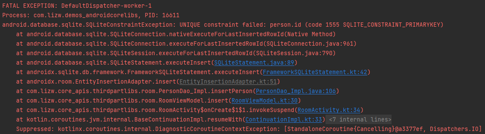

> Created/Updated：
>
> Review：

[官方：将数据保存到本地数据库](https://developer.android.google.cn/training/data-storage/room?hl=zh_cn&authuser=0)

# Room

## 背景

Android 中是用 SQLite 数据库来实现数据库持久化保存数据的。由于 Android 原生提供的 API 难以操作 SQLite 数据库，代码量大，且编写起来容易出错，于是市面上开源了许多框架，如 GreenDAO 、ORMLite 等等。Google 也在 Jetpack 中提供了一种数据库组件，即 Room，让开发者能够**更简单高效地进行数据库开发**。

## Room 介绍

使用 **[Android Jetpack](https://developer.android.google.cn/jetpack?authuser=0&hl=zh-cn) 的 Room 库**可以将数据保存到本地数据库。

处理大量结构化数据的应用可极大地受益于在本地保留这些数据。最常见的使用场景是缓存相关的数据，这样一来，当设备无法访问网络时，用户仍然可以在离线状态下浏览该内容。

Room 持久性库**在 SQLite 上提供了一个抽象层**，以便在充分利用 SQLite 的强大功能的同时，能够流畅地访问数据库。具体来说，Room 具有以下优势：

- 提供针对 SQL 查询的编译时验证。
- 提供方便注解，可最大限度减少重复和容易出错的样板代码。
- 简化了数据库迁移路径。

出于这些方面的考虑，**官方强烈建议我们使用 Room**，而不是[直接使用 SQLite API](https://developer.android.google.cn/training/data-storage/sqlite?authuser=0&hl=zh-cn)。

> 最佳实践：涉及到数据库时，使用 Room，而不是直接用 SQLite。

# 开始使用

## 添加依赖

将以下依赖项添加到应用的 `build.gradle` 文件：

```groovy
dependencies {
    def room_version = "2.6.1"

    implementation "androidx.room:room-runtime:$room_version"
    annotationProcessor "androidx.room:room-compiler:$room_version"

    // To use Kotlin annotation processing tool (kapt)
    kapt "androidx.room:room-compiler:$room_version"
    // To use Kotlin Symbol Processing (KSP)
    ksp "androidx.room:room-compiler:$room_version"
    

    // optional - RxJava2 support for Room
    implementation "androidx.room:room-rxjava2:$room_version"

    // optional - RxJava3 support for Room
    implementation "androidx.room:room-rxjava3:$room_version"

    // optional - Guava support for Room, including Optional and ListenableFuture
    implementation "androidx.room:room-guava:$room_version"

    // optional - Test helpers
    testImplementation "androidx.room:room-testing:$room_version"

    // optional - Paging 3 Integration
    implementation "androidx.room:room-paging:$room_version"
}
```

## 主要组件

Room 包含三个主要组件：

- [数据库类](https://developer.android.google.cn/reference/kotlin/androidx/room/Database?authuser=0&hl=zh-cn)，用于保存数据库并作为应用持久性数据底层连接的主要访问点。
- [数据实体（Entity）](https://developer.android.google.cn/training/data-storage/room/defining-data?authuser=0&hl=zh-cn)，对应数据库中的**一张表**。在 Java 中对应一个实体类，实体类中的属性对应数据库中的字段。
- [数据访问对象 (DAO)](https://developer.android.google.cn/training/data-storage/room/accessing-data?authuser=0&hl=zh-cn)，数据访问对象（Data Access Objects）。可以通过 Dao 插入、删除、更新、查询数据。

数据库类为应用提供与该数据库关联的 DAO 的实例。反过来，应用可以使用 DAO 从数据库中检索数据，作为关联的数据实体对象的实例。此外，应用还可以使用定义的数据实体更新相应表中的行，或者创建新行供插入。图 1 说明了 Room 的不同组件之间的关系。


**图 1.** Room 库架构的示意图。

## 使用步骤示例

下面介绍具有单个数据实体和单个 DAO 的 Room 数据库实现示例。

### 步骤一：定义数据实体（Entity）

以下代码定义了一个 `User` 数据实体。`User` 的**每个实例都代表**应用数据库中 `user` **表中的一行**。

```kotlin
@Entity
data class User(
    @PrimaryKey val uid: Int,
    @ColumnInfo(name = "first_name") val firstName: String?,
    @ColumnInfo(name = "last_name") val lastName: String?
)
```

> 如需详细了解 Room 中的数据实体，请参阅[使用 Room 实体定义数据](https://developer.android.google.cn/training/data-storage/room/defining-data?authuser=0&hl=zh-cn)。

### 步骤二：定义数据访问对象 (DAO)

以下代码定义了一个名为 `UserDao` 的 DAO。`UserDao` 提供了与 `user` 表中的数据交互的方法。

```kotlin
@Dao
interface UserDao {
    @Query("SELECT * FROM user")
    fun getAll(): List<User>

    @Query("SELECT * FROM user WHERE uid IN (:userIds)")
    fun loadAllByIds(userIds: IntArray): List<User>

    @Query("SELECT * FROM user WHERE first_name LIKE :first AND " +
           "last_name LIKE :last LIMIT 1")
    fun findByName(first: String, last: String): User

    @Insert
    fun insertAll(vararg users: User)

    @Delete
    fun delete(user: User)
}
```

> 如需详细了解 DAO，请参阅[使用 Room DAO 访问数据](https://developer.android.google.cn/training/data-storage/room/accessing-data?authuser=0&hl=zh-cn)。

### 步骤三：定义数据库类

以下代码定义了用于保存数据库的 `AppDatabase` 类。 `AppDatabase` 定义数据库配置，并作为应用对持久性数据的主要访问点。数据库类必须满足以下条件：

- 该类必须带有 [`@Database`](https://developer.android.google.cn/reference/kotlin/androidx/room/Database?authuser=0&hl=zh-cn) 注解，该注解包含所有与数据库关联的数据实体的 [`entities`](https://developer.android.google.cn/reference/kotlin/androidx/room/Database?authuser=0&hl=zh-cn#entities) 数组。
- 该类必须是一个抽象类，用于扩展 [`RoomDatabase`](https://developer.android.google.cn/reference/kotlin/androidx/room/RoomDatabase?authuser=0&hl=zh-cn)。
- 对于与数据库关联的每个 DAO 类，数据库类必须**定义一个具有零参数的抽象方法**，并返回 DAO 类的实例。

```kotlin
@Database(entities = [User::class], version = 1)
abstract class AppDatabase : RoomDatabase() {
    abstract fun userDao(): UserDao
}
```

**注意**：如果应用**在单个进程中运行，在实例化 `AppDatabase` 对象时应遵循单例设计模式**。每个 `RoomDatabase` 实例的成本相当高，而应用几乎不需要在单个进程中访问多个实例。

如果应用在多个进程中运行，请在数据库构建器中调用 `enableMultiInstanceInvalidation()`。这样，如果您在每个进程中都有一个 `AppDatabase` 实例，可以在一个进程中使共享数据库文件失效，并且这种失效会自动传播到其他进程中 `AppDatabase` 的实例。

### 步骤四：在代码中使用

定义数据实体、DAO 和数据库对象后，可以使用以下代码创建数据库实例：

```kotlin
val db = Room.databaseBuilder(
            applicationContext,
            AppDatabase::class.java, "database-name"
        ).build()
```

然后，可以使用 `AppDatabase` 中的抽象方法获取 DAO 的实例，进而可以使用 DAO 实例中的方法与数据库进行交互：

```kotlin
val userDao = db.userDao()
val users: List<User> = userDao.getAll()
```

### 步骤五：运行前配置

需要指定在 build 时是否生成数据库相关的信息文件——schema（后面scheme一节会介绍此文件）。

**方案一：不需要生成。**

给 RoomDatabase 设置 exportSchema = false。

```kotlin
@Database(entities = {Person.class}, version = 1, exportSchema = false)
abstract public class PersonDataBase extends RoomDatabase {
    abstract PersonDao mPersonDao();
}
```

**方案二：生成。**

在你的 APP 或者 module 的 `build.gradle` 中添加以下注解信息：

```groovy
android {
    ...
    defaultConfig {
        ...
        //指定room.schemaLocation生成的文件路径
        javaCompileOptions {
            annotationProcessorOptions {
                arguments = ["room.schemaLocation":
                             "$projectDir/schemas".toString()]
            }
        }
    }
}
```

如果没有指定，build会报错如下：

> Schema export directory was not provided to the annotation processor so Room cannot export the schema. You can either provide `room.schemaLocation` annotation processor argument by applying the Room Gradle plugin (id 'androidx.room') OR set exportSchema to false.


# 完整示例

下面是一个使用 Room 的完整示例。其中包含 Person 数据实体，PersonDao，数据库类。

## 添加依赖

```kotlin
    def room_version = "2.6.1"

    implementation "androidx.room:room-runtime:$room_version"
    annotationProcessor "androidx.room:room-compiler:$room_version"
```

## 数据实体：Person

```kotlin
@Entity(tableName = "person")
data class Person(
    @ColumnInfo(name = "name", typeAffinity = ColumnInfo.TEXT)
    var name: String,

    @ColumnInfo(name = "grade", typeAffinity = ColumnInfo.REAL)
    var grade: Double,

    @ColumnInfo(name = "isMan", typeAffinity = ColumnInfo.INTEGER)
    var isMan: Boolean,

    @Ignore
    var extraInfo: String? = null
) {
    @PrimaryKey(autoGenerate = true)
    @ColumnInfo(name = "id", typeAffinity = ColumnInfo.INTEGER)
    var mId: Int = 0

    override fun toString(): String {
        return "Person(mId=$mId, name=$name', grade=$grade, isMan=$isMan, extraInfo=$extraInfo)"
    }
}
```

其中各注解：

- @Entity：修饰类，将该实体类与数据库表对应起来，其中 tableName 参数值表示对应的表名；
- @PrimaryKey：修饰属性，表示将该字段作为表中的主键，autoGenerate = true表示自动生成;
- @ColumnInfo：修饰属性，将该属性与数据库表中字段对应，name参数表示数据库表中的字段名，typeAffinity 表示字段类型；
- @Ignore：修饰方法和属性，用来告诉 Room 忽略该字段或方法，由于 Room 只能识别 Entity 实体类的一个构造方法，所以如果实体类中需要有多个构造方法的时候，其余的需要使用@Ignore修饰。

## 数据访问对象：PersonDao

创建一个 Dao 接口，需要使用 @Dao 注解修饰，项目 build 之后，Room 会生成对应的 Impl 类。

```kotlin
@Dao
interface PersonDao {
    companion object {
        const val tableName = "person"
    }
    
    @Insert
    fun insertPerson(person: Person)

    @Delete
    fun deletePerson(person: Person)

    @Query("DELETE FROM $tableName WHERE id=:id")
    fun deletePerson(id: Int)

    @Update
    fun updatePerson(person: Person)

    @Query("SELECT * FROM $tableName")
    fun queryPersons(): List<Person>?

    @Query("SELECT * FROM $tableName  WHERE id = :id")
    fun queryPerson(id: Int): Person?
}
```

在Dao工具类中定义出所有的数据库操作，并且使用对应的注解修饰：

- @Insert：插入数据；
- @Delete：删除数据；
- @Update：更新数据；
- @Query：查找数据，此注解需要传入 SQL 语句作为参数，SQL 语句用来限定查询的条件，注意如果是按条件删除数据等操作，也可以使用此注解来修饰。

## 数据库类：PersonDataBase

创建 RoomDatabase 类，此类主要是用来创建数据库：

```kotlin
@Database(entities = [Person::class], version = 1)
abstract class PersonDataBase : RoomDatabase() {
    abstract fun getPersonDao(): PersonDao

    companion object {
        private const val DATABASE_NAME = "person.db"
        private lateinit var mPersonDataBase: PersonDataBase

        fun getInstance(context: Context): PersonDataBase {
            if (::mPersonDataBase.isInitialized.not()) {
                mPersonDataBase = databaseBuilder(
                    context.applicationContext,
                    PersonDataBase::class.java,
                    DATABASE_NAME
                ).build()
            }
            return mPersonDataBase
        }
    }
}
```

PersonDatabase是一个抽象类，其中核心有两个方法：

1. 第一个就是获取 PersonDatabase 实例，一般情况下，整个项目中有一个PersonDatabase实例即可，所以我们通常使用单例模式。
2. 第二个就是获取其对应的Dao工具类。

创建Database类的时候，需要继承自RoomDatabase类，并使用 @Database 注解，其中entities参数值是一数组，对应此数据库中的所有表，version表示数据库版本号。

使用 Room.databaseBuilder 初始化 Database 对象时，需要注意传入的 Context 是整个应用程序的 Context。

## 配置是否导出schema文件

见：上面【使用步骤示例-步骤五-运行前配置】

## 使用

接下来就可以使用 Room 进行数据库的增删改查了

### Room + ViewModel + Activity

有了前面的数据库相关类后，我们就可以在业务侧开始使用了。下面的例子采用 ViewModel + Activity 实现，Activity 不直接与数据库层打交道。

**RoomViewModel**

创建 RoomDatabase 实例的时候，需要用到 Application 的 Context，所以我们可以使用 ViewModel 的子类 AndroidViewModel，其正好提供了Application 的Context。如果使用普通的 ViewModel 的话，也需要传入 Application Context 给 ViewModel，否则由于 ViewModel的特性，传入 Context 会造成内存泄漏。

```kotlin
class RoomViewModel(private var applicationContext: Application) : ViewModel() {
    companion object {
        val Factory: ViewModelProvider.Factory = viewModelFactory {
            initializer {
                RoomViewModel(this[APPLICATION_KEY] as Application)
            }
        }
    }

    private val personDataBase: PersonDataBase = PersonDataBase.getInstance(applicationContext)
    private val personDao = personDataBase.getPersonDao()

    fun migration() {
        PersonDataBase.migration(applicationContext)
    }

    fun insert(person: Person) = personDao.insertPerson(person)

    fun delete(person: Person) = personDao.deletePerson(person)

    fun deleteById(id: Int) = personDao.deletePerson(id)

    fun update(person: Person) = personDao.updatePerson(person)

    fun queryById(id: Int): Person? = personDao.queryPerson(id)

    fun query(): List<Person>? = personDao.queryPersons()
}
```

**RoomActivity**

由于数据库操作是耗时操作，所以 Room 强制要求所有的增删改查都不能在主线程中执行，下面使用Kotlin的协程来实现：

```kotlin
class RoomActivity : AppCompatActivity() {
    companion object {
        private const val TAG = "RoomActivity"
    }

    private val binding by lazy { ActivityRoomBinding.inflate(layoutInflater) }

    private val viewModel: RoomViewModel by viewModels { RoomViewModel.Factory }

    private var i = 0
    private var person: Person? = null

    override fun onCreate(savedInstanceState: Bundle?) {
        super.onCreate(savedInstanceState)
        setContentView(binding.root)

        binding.btnInsert.setOnClickListener {
            lifecycleScope.launch(Dispatchers.IO) {
                i++
                person = Person(i, i.toString() + "", i.toDouble(), i % 2 == 0)
                viewModel.insert(person!!)
            }
        }
        binding.btnDelete.setOnClickListener {
            lifecycleScope.launch(Dispatchers.IO) {
                viewModel.delete(Person(1, "1", 1.0, true))
            }
        }
        binding.btnDeleteById.setOnClickListener {
            lifecycleScope.launch(Dispatchers.IO) {
                viewModel.deleteById(3)
            }
        }
        binding.btnUpdate.setOnClickListener {
            lifecycleScope.launch(Dispatchers.IO) {
                viewModel.update(Person(1, "1", 1.0, true))
            }
        }
        binding.btnQuery.setOnClickListener {
            lifecycleScope.launch(Dispatchers.IO) {
                val persons: List<Person>? = viewModel.query()
                if (!persons.isNullOrEmpty()) {
                    for (p in persons) {
                        Log.e(TAG, "query all: $p")
                    }
                }
            }
        }
        binding.btnQueryById.setOnClickListener {
            lifecycleScope.launch(Dispatchers.IO) {
                val person: Person? = viewModel.queryById(2)
                if (person != null) {
                    Log.e(TAG, "queryById: $person")
                }
            }
        }
        binding.btnMigration.setOnClickListener { viewModel.migration() }
    }

}
```

**activity_room.xml：**

```xml
<?xml version="1.0" encoding="utf-8"?>
<LinearLayout xmlns:android="http://schemas.android.com/apk/res/android"
    android:layout_width="match_parent"
    android:layout_height="match_parent"
    android:orientation="vertical">

    <Button
        android:id="@+id/btn_insert"
        android:layout_width="match_parent"
        android:layout_height="wrap_content"
        android:text="insert" />

    <Button
        android:id="@+id/btn_delete_by_id"
        android:layout_width="match_parent"
        android:layout_height="wrap_content"
        android:text="delete_by_id" />

    <Button
        android:id="@+id/btn_delete"
        android:layout_width="match_parent"
        android:layout_height="wrap_content"
        android:text="delete" />

    <Button
        android:id="@+id/btn_update"
        android:layout_width="match_parent"
        android:layout_height="wrap_content"
        android:text="update" />

    <Button
        android:id="@+id/btn_query"
        android:layout_width="match_parent"
        android:layout_height="wrap_content"
        android:text="query" />

    <Button
        android:id="@+id/btn_query_by_id"
        android:layout_width="match_parent"
        android:layout_height="wrap_content"
        android:text="query_by_id" />

    <Button
        android:id="@+id/btn_migration"
        android:layout_width="match_parent"
        android:layout_height="wrap_content"
        android:text="migration" />
</LinearLayout>
```


按照上面的代码 build 后，不出意外会报错，按下面方式处理：

## 错误处理

### build 报错

1、Cannot find implementation for xxx.PersonDataBase. **PersonDataBase_Impl does not exist**

将

```bash
annotationProcessor "androidx.room:room-compiler:$version_room"
```

改为：

```bash
kapt "androidx.room:room-compiler:$version_room"
```

或者

```kotlin
ksp "androidx.room:room-compiler:$version_room"
```

### 运行错误

1、Cannot access database on the main thread since it may potentially lock the UI for a long period of time.

调用 Dao 方法时，要在子线程中。

2、（重要）上面的例子中，如果我们点击了两次 insert() 方法，会报错：

android.database.sqlite.SQLiteConstraintException: UNIQUE constraint failed: person.id (code 1555 SQLITE_CONSTRAINT_PRIMARYKEY)



**错误原因**

这个错误提示意味着在插入一条数据时，由于违反了 UNIQUE 约束，因此操作失败了。具体来说，是因为该记录的 id 已经在数据库中存在，而又试图通过插入来创建一个新的 id 相同的记录，因此发生了 UNIQUE 约束违反的错误。

在 SQLite 中，UNIQUE 约束是指对某个列设置唯一性约束，即该列中的所有值必须唯一。在 Room 中，此类唯一性约束通常通过在 Entity 类中使用 @Entity 注解的 indices 属性或者使用 @Unique 注解来定义。

**解决方法**

具体处理此类错误的方法取决于业务逻辑。有几种可能的解决方案：

1. 忽略重复的插入请求：如果业务逻辑不要求保留旧数据，那么可以考虑忽略插入请求。在 Room 中，可以使用 @Insert(onConflict = OnConflictStrategy.IGNORE) 注解来实现。

2. 更新已有记录：如果业务逻辑要求更新已有记录，可以使用 @Insert(onConflict = OnConflictStrategy.REPLACE) 注解来实现。这将会尝试执行插入操作，如果遇到冲突，则会用新的数据替换旧的记录。

3. 抛出异常并进行处理：如果希望在数据重复时抛出异常并进行处理，可以使用 @Insert(onConflict = OnConflictStrategy.FAIL) 注解来实现。然后，可以在捕捉到异常时进行相应的处理。
4. 如果你需要插入新数据，但想避免UNIQUE约束失败，可以先执行查询操作来检查记录是否已存在，然后根据结果决定是否执行插入操作。


# Room 注解

## @Insert

### OnConflictStrategy

@Insert(onConflict = OnConflictStrategy.REPLACE)

当重复插入两条**唯一键**数据时，默认会报错。

解决方式就是指定重复插入时的处理策略

#### 冲突策略介绍

OnConflictStrategy.REPLACE：更新已有记录

OnConflictStrategy.IGNORE：忽略重复的插入请求

OnConflictStrategy.FAIL：抛出异常并进行处理

其他。。。


# 数据库升级

在需求迭代过程中，可能会对数据库表结构加一些新的字段，遇到这种情况，就需要将数据库版本号进行升级，Room提供了Migration类，用以实现数据库升级。

## 升级过程

升级前，版本1：

```kotlin
@Database(entities = [Person::class], version = 1)
abstract class PersonDataBase : RoomDatabase() {
    
    companion object {
        fun getInstance(context: Context): PersonDataBase {
            if (::mPersonDataBase.isInitialized.not()) {
                mPersonDataBase = databaseBuilder(
                    context.applicationContext,
                    PersonDataBase::class.java,
                    DATABASE_NAME
                ).build()
            }
            return mPersonDataBase
        }
    }
}
```

升级后，版本2：

```kotlin
@Database(entities = [Person::class], version = 2)
abstract class PersonDataBase : RoomDatabase() {
    companion object {
        private val mMigration1_2: Migration = object : Migration(1, 2) {
            override fun migrate(db: SupportSQLiteDatabase) {
                Log.d("PersonDataBase", "升级")
            }
        }

        fun getInstance(context: Context): PersonDataBase {
            if (::mPersonDataBase.isInitialized.not()) {
                mPersonDataBase = databaseBuilder(
                    context.applicationContext,
                    PersonDataBase::class.java,
                    DATABASE_NAME
                )
                    .addMigrations(mMigration1_2)
                    .build()
            }
            return mPersonDataBase
        }
    }
}
```

1. 版本号：改为2
2. 增加 Migration 实现类：在初始化 Database 的时候，调用 addMigrations(mMigration1_2) 设置。

触发升级：数据库版本号修改后，重新安装，调用 databaseBuilder.build 后会触发 Migration 的 migrate 方法。

## Migration

Migration类的构造方法接收两个参数：startVersion、endVersion。startVersion表示当前数据库版本（旧版本），endVersion为新版本，创建Migration对象：

```java
    private static Migration mMigration1_2 = new Migration(1, 2) {
        @Override
        public void migrate(@NonNull SupportSQLiteDatabase database) {
            Log.d("PersonDataBase", "升级");
        }
    };
```

如上述代码，如果从版本1升级到版本2，就在创建Migration对象的时候两个参数分别传入1和2。

**migrate方法**：在此方法中，可以通过 database 的 execSQL() 方法，传入对应的SQL语句，即可对数据库进行升级管理，如复制一个完全一样的表等等。

**跨版本升级**：如果数据库版本号从1升级到3，系统会优先匹配1-3的Migration，如果没有的话就会依次执行 1-2，2-3。

如果**升级数据库但没有匹配到对应的Margation，程序就会奔溃**，我们可以在初始化Database对象的时候，加入fallbackToDestructiveMigration() 语句处理：

fallbackToDestructiveMigration() 作用：重建数据库，之前的数据库数据会被清空，**谨慎使用！**

> 表示Room启动时将检测version是否发生增加，如果有，那么将找到自定义Migration去执行特定的操作。如果没有自定义Migration， 因为设置了fallbackToDestructiveMigration()，将会删除数据库并重建，所有数据丢失。

```java
mPersonDataBase = Room.databaseBuilder(
                        context.getApplicationContext(),
                        PersonDataBase.class,
                        DATABASE_NAME
                )
                        .addMigrations(mMigration1_2)
                        .fallbackToDestructiveMigration()
                        .build();
```


# schema文件

如果想查看数据库内容，Room 提供了 Schema 文件，其中包含了数据库的所有基本信息，我们需要在项目的build.gradle文件中进行如下配置，为其指定文件的导出位置：

```scheme
android {

    defaultConfig {

        javaCompileOptions{
            annotationProcessorOptions{
                arguments=["room.schemaLocation":"$projectDir/ schemas".toString()]
            }
        }
    }
 }
```

最终生成的文件如下：其中包含了数据库版本号，所有的表信息等等。

```scheme
{
  "formatVersion": 1,
  "database": {
    "version": 1,
    "identityHash": "868952efc8c86b0e287ea8aee79327c5",
    "entities": [
      {
        "tableName": "person",
        "createSql": "CREATE TABLE IF NOT EXISTS `${TABLE_NAME}` (`id` INTEGER PRIMARY KEY AUTOINCREMENT NOT NULL, `name` TEXT, `grade` REAL, `isMan` INTEGER)",
        "fields": [
          {
            "fieldPath": "mId",
            "columnName": "id",
            "affinity": "INTEGER",
            "notNull": true
          },
          {
            "fieldPath": "name",
            "columnName": "name",
            "affinity": "TEXT",
            "notNull": false
          },
          {
            "fieldPath": "grade",
            "columnName": "grade",
            "affinity": "REAL",
            "notNull": false
          },
          {
            "fieldPath": "isMan",
            "columnName": "isMan",
            "affinity": "INTEGER",
            "notNull": false
          }
        ],
        "primaryKey": {
          "columnNames": [
            "id"
          ],
          "autoGenerate": true
        },
        "indices": [],
        "foreignKeys": []
      }
    ],
    "views": [],
    "setupQueries": [
      "CREATE TABLE IF NOT EXISTS room_master_table (id INTEGER PRIMARY KEY,identity_hash TEXT)",
      "INSERT OR REPLACE INTO room_master_table (id,identity_hash) VALUES(42, '868952efc8c86b0e287ea8aee79327c5')"
    ]
  }
}
```


# 拓展

### Codelab

- 带 View 的 Android Room [(Java)](https://developer.android.google.cn/codelabs/android-room-with-a-view?authuser=0&hl=zh-cn) [(Kotlin)](https://developer.android.google.cn/codelabs/android-room-with-a-view-kotlin?authuser=0&hl=zh-cn)

### 博客

- [有关 Room 的 7 个专家技巧](https://medium.com/androiddevelopers/7-pro-tips-for-room-fbadea4bfbd1)
- [从 SQLite 逐步迁移到 Room](https://medium.com/androiddevelopers/incrementally-migrate-from-sqlite-to-room-66c2f655b377)


# 参考

[官方：将数据保存到本地数据库](https://developer.android.google.cn/training/data-storage/room?hl=zh_cn&authuser=0)
