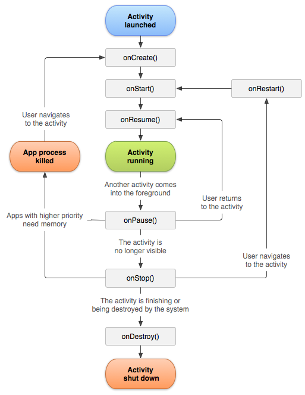
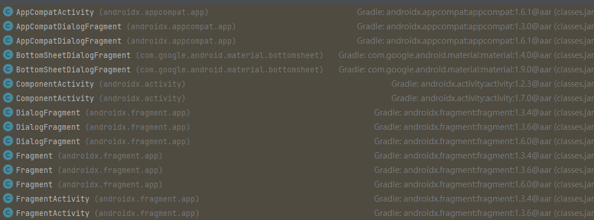
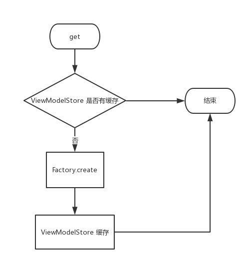

> 源码分析基于：2.3.0


# 使用

## 添加依赖

```kotlin
    val lifecycle_version = "2.7.0"
    // ViewModel
    implementation("androidx.lifecycle:lifecycle-viewmodel-ktx:$lifecycle_version")

    val activity_version = "1.9.0"
    implementation("androidx.activity:activity-ktx:$activity_version")
```

| 库名                                       | 作用                   |      |
| ------------------------------------------ | ---------------------- | ---- |
| androidx.lifecycle:lifecycle-viewmodel-ktx | 提供 lifecycleScope 等 |      |
| androidx.activity:activity-ktx             | 提供 viewModelScope 等 |      |
|                                            |                        |      |

# ViewModel 简介

[`ViewModel`](https://developer.android.google.cn/reference/androidx/lifecycle/ViewModel?hl=zh-cn) 类是一种[业务逻辑或屏幕级状态容器](https://developer.android.google.cn/topic/architecture/ui-layer/stateholders?hl=zh-cn)。用于将状态公开给界面，以及封装相关的业务逻辑。 主要优点是，可以缓存状态，并在配置更改后持久保留相应状态。这意味着在 activity 之间导航时或进行配置更改后（例如旋转屏幕时），界面无需重新提取数据。

## ViewModel 的优势

用于替代在界面中保存数据的普通类。在 activity 或 Navigation 目的地之间跳转时，这可能会造成问题。此时，如果不利用[保存实例状态机制](https://developer.android.google.cn/topic/libraries/architecture/saving-states?hl=zh-cn#onsaveinstancestate)存储相应数据，系统便会销毁相应数据。ViewModel 提供了一个便捷的数据持久性 API，可以解决此问题。

ViewModel 类的主要优势有两个方面：

- 可以持久保留界面状态。
- 可以封装业务逻辑。

ViewModel旨在以注重生命周期的方式存储和管理界面相关的数据(配合它里面的livedata)。

1.1 将Activity的UI处理和数据处理分离，分开管理，解耦且高效。

1.2 ViewModel在屏幕旋转等系统配置更改后被继续保留，避免再次请求数据，浪费网络资源。重建该 Activity时，它接收的ViewModel实例与之前的Activity持有的ViewModel相同。

只有当Activity真正销毁时，框架才会调用getViewModelStore().clear()清除所有的ViewModel。

1.3 避免页面销毁后，数据返回后刷新界面导致crash，例如页面发起请求后，数据还没返回就关闭activity，数据返回后，刷新界面，因view不存在而crash。

1.4 两个Fragment可以使用其Activity的ViewModel来处理通信。

1.5 和onSaveInstanceState()对比，onSaveInstanceState()仅适合可以序列化再反序列化的少量数据，而不适合数量可能较大的数据，如用户列表或位图。

1.6 ViewModelScope，为应用中的每个ViewModel定义了ViewModelScope。如果ViewModel已清除，则在此范围内启动的协程都会自动取消。

### 持久性

ViewModel 允许数据在 ViewModel 保有的状态和 ViewModel 触发的操作结束后持久存在。这种缓存意味着在常见的配置更改（例如屏幕旋转）完成后，您无需重新提取数据。

#### 作用域

实例化 ViewModel 时，您会向其传递实现 [`ViewModelStoreOwner`](https://developer.android.google.cn/reference/kotlin/androidx/lifecycle/ViewModelStoreOwner?hl=zh-cn) 接口的对象。它可能是 Navigation 目的地、Navigation 图表、activity、fragment 或实现接口的任何其他类型。然后，ViewModel 的作用域将限定为 `ViewModelStoreOwner` 的 [Lifecycle](https://developer.android.google.cn/reference/androidx/lifecycle/Lifecycle?hl=zh-cn)。它会一直保留在内存中，直到其 `ViewModelStoreOwner` 永久消失。

有一系列类是 `ViewModelStoreOwner` 接口的直接或间接子类。直接子类为 [`ComponentActivity`](https://developer.android.google.cn/reference/androidx/activity/ComponentActivity?hl=zh-cn)、[`Fragment`](https://developer.android.google.cn/reference/androidx/fragment/app/Fragment?hl=zh-cn) 和 [`NavBackStackEntry`](https://developer.android.google.cn/reference/androidx/navigation/NavBackStackEntry?hl=zh-cn)。如需查看间接子类的完整列表，请参阅 [`ViewModelStoreOwner` 参考文档](https://developer.android.google.cn/reference/kotlin/androidx/lifecycle/ViewModelStoreOwner?hl=zh-cn)。

当 ViewModel 的作用域 fragment 或 activity 被销毁时，异步工作会在作用域限定到该 fragment 或 activity 的 ViewModel 中继续进行。这是持久性的关键。

如需了解详情，请参阅下文有关 [ViewModel 生命周期](https://developer.android.google.cn/topic/libraries/architecture/viewmodel?hl=zh-cn#lifecycle)的部分。

#### SavedStateHandle

借助 [SavedStateHandle](https://developer.android.google.cn/topic/libraries/architecture/viewmodel/viewmodel-savedstate?hl=zh-cn)，您不仅可以在更改配置后持久保留数据，还可以在进程重新创建过程中持久保留数据。也就是说，即使用户关闭应用，稍后又将其打开，您的界面状态也可以保持不变。

### 对业务逻辑的访问权限

尽管绝大多数[业务逻辑](https://developer.android.google.cn/topic/architecture/ui-layer/stateholders?hl=zh-cn#business-logic)都存在于数据层中，但界面层也可以包含业务逻辑。当您合并多个代码库中的数据以创建屏幕界面状态时，或特定类型的数据不需要数据层时，情况就是如此。

ViewModel 是在界面层处理业务逻辑的正确位置。当需要应用业务逻辑来修改应用数据时，ViewModel 还负责处理事件并将其委托给层次结构中的其他层。

## Jetpack Compose

使用 Jetpack Compose 时，ViewModel 是向可组合项公开屏幕界面状态的主要方式。在混合应用中，activity 和 fragment 仅用于托管可组合函数。这与以往的方法不同；过去，创建包含 activity 和 fragment 且可重复使用的界面部分没有这么简单和直观，因此这类部分在作为界面控制器时会更加活跃。

将 ViewModel 与 Compose 一起使用时，最重要的注意事项是，您无法将 ViewModel 的作用域限定为可组合项。这是因为可组合项不属于 `ViewModelStoreOwner`。组合中同一可组合项的两个实例，或者在同一 `ViewModelStoreOwner` 下访问同一 ViewModel 类型的两个不同的可组合项，将会收到相同的 ViewModel 实例，而这通常并不是预期的行为。

如需在 Compose 中利用 ViewModel 的[优势](https://developer.android.google.cn/topic/libraries/architecture/viewmodel?hl=zh-cn#viewmodel-benefits)，请在 fragment 或 activity 中托管每个屏幕，或者使用 Compose Navigation，并在尽可能靠近 Navigation 目的地的可组合函数中使用 ViewModel。这是因为，您可以将 ViewModel 的作用域限定为 Navigation 目的地、Navigation 图表、activity 和 fragment。

如需了解详情，请参阅有关 Jetpack Compose 的[状态提升](https://developer.android.google.cn/jetpack/compose/state-hoisting?hl=zh-cn#viewmodels-as-state-owner)指南。

## 实现 ViewModel

以下是用户掷骰子屏幕的 ViewModel 实现示例。

**重要提示**：在此示例中，获取和保存用户列表的责任在于 ViewModel，而不直接在于 activity 或 fragment。

```kotlin
data class DiceUiState(
    val firstDieValue: Int? = null,
    val secondDieValue: Int? = null,
    val numberOfRolls: Int = 0,
)

class DiceRollViewModel : ViewModel() {

    // Expose screen UI state
    private val _uiState = MutableStateFlow(DiceUiState())
    val uiState: StateFlow<DiceUiState> = _uiState.asStateFlow()

    // Handle business logic
    fun rollDice() {
        _uiState.update { currentState ->
            currentState.copy(
                firstDieValue = Random.nextInt(from = 1, until = 7),
                secondDieValue = Random.nextInt(from = 1, until = 7),
                numberOfRolls = currentState.numberOfRolls + 1,
            )
        }
    }
}
```

然后，您可以从 activity 访问 ViewModel，如下所示：

[Kotlin](https://developer.android.google.cn/topic/libraries/architecture/viewmodel?hl=zh-cn#kotlin)[Java](https://developer.android.google.cn/topic/libraries/architecture/viewmodel?hl=zh-cn#java)[Jetpack Compose](https://developer.android.google.cn/topic/libraries/architecture/viewmodel?hl=zh-cn#jetpack-compose)

```kotlin
import androidx.activity.viewModels

class DiceRollActivity : AppCompatActivity() {

    override fun onCreate(savedInstanceState: Bundle?) {
        // Create a ViewModel the first time the system calls an activity's onCreate() method.
        // Re-created activities receive the same DiceRollViewModel instance created by the first activity.

        // Use the 'by viewModels()' Kotlin property delegate
        // from the activity-ktx artifact
        val viewModel: DiceRollViewModel by viewModels()
        lifecycleScope.launch {
            repeatOnLifecycle(Lifecycle.State.STARTED) {
                viewModel.uiState.collect {
                    // Update UI elements
                }
            }
        }
    }
}
```

**注意**：[`ViewModel`](https://developer.android.google.cn/reference/androidx/lifecycle/ViewModel?hl=zh-cn) 通常不应引用视图、[`Lifecycle`](https://developer.android.google.cn/reference/androidx/lifecycle/Lifecycle?hl=zh-cn) 或可能存储对 activity 上下文的引用的任何类。由于 ViewModel 的生命周期大于界面的生命周期，因此在 ViewModel 中保留与生命周期相关的 API 可能会导致内存泄漏。

**注意**：如需将 [`ViewModel`](https://developer.android.google.cn/reference/androidx/lifecycle/ViewModel?hl=zh-cn) 导入 Android 项目，请参阅 [Lifecycle 版本说明](https://developer.android.google.cn/jetpack/androidx/releases/lifecycle?hl=zh-cn#declaring_dependencies)中关于声明依赖项的说明。

### 将协程与 ViewModel 一起使用

`ViewModel` 支持 Kotlin 协程。它能够像持久保留界面状态一样持久保留异步工作。

如需了解详情，请参阅[将 Kotlin 协程与 Android 架构组件一起使用](https://developer.android.google.cn/topic/libraries/architecture/coroutines?hl=zh-cn)。

## ViewModel 的生命周期

[`ViewModel`](https://developer.android.google.cn/reference/androidx/lifecycle/ViewModel?hl=zh-cn) 的生命周期与其作用域直接关联。`ViewModel` 会一直保留在内存中，直到其作用域 [`ViewModelStoreOwner`](https://developer.android.google.cn/reference/kotlin/androidx/lifecycle/ViewModelStoreOwner?hl=zh-cn) 消失。以下上下文中可能会发生这种情况：

- 对于 activity，是在 activity 完成时。
- 对于 fragment，是在 fragment 分离时。
- 对于 Navigation 条目，是在 Navigation 条目从返回堆栈中移除时。

这使得 ViewModels 成为了存储在配置更改后仍然存在的数据的绝佳解决方案。

图 1 说明了 activity 经历屏幕旋转而后结束时所处的各种生命周期状态。该图还在关联的 activity 生命周期的旁边显示了 [`ViewModel`](https://developer.android.google.cn/reference/androidx/lifecycle/ViewModel?hl=zh-cn) 的生命周期。此图表说明了 activity 的各种状态。这些基本状态同样适用于 fragment 的生命周期。


您通常在系统首次调用 activity 对象的 [`onCreate()`](https://developer.android.google.cn/reference/android/app/Activity?hl=zh-cn#onCreate(android.os.Bundle)) 方法时请求 [`ViewModel`](https://developer.android.google.cn/reference/androidx/lifecycle/ViewModel?hl=zh-cn)。系统可能会在 activity 的整个生命周期内多次调用 [`onCreate()`](https://developer.android.google.cn/reference/android/app/Activity?hl=zh-cn#onCreate(android.os.Bundle))，如在旋转设备屏幕时。[`ViewModel`](https://developer.android.google.cn/reference/androidx/lifecycle/ViewModel?hl=zh-cn) 存在的时间范围是从您首次请求 [`ViewModel`](https://developer.android.google.cn/reference/androidx/lifecycle/ViewModel?hl=zh-cn) 直到 activity 完成并销毁。

### 清除 ViewModel 依赖项

当 `ViewModelStoreOwner` 在 ViewModel 的生命周期内销毁 ViewModel 时，ViewModel 会调用 [`onCleared`](https://developer.android.google.cn/reference/androidx/lifecycle/ViewModel?hl=zh-cn#onCleared()) 方法。这样，您就可以清理遵循 ViewModel 生命周期的任何工作或依赖项。

以下示例展示了 [`viewModelScope`](https://developer.android.google.cn/topic/libraries/architecture/coroutines?hl=zh-cn#viewmodelscope) 的替代方法。 `viewModelScope` 是一个内置 [`CoroutineScope`](https://kotlinlang.org/api/kotlinx.coroutines/kotlinx-coroutines-core/kotlinx.coroutines/-coroutine-scope/)，会自动遵循 ViewModel 的生命周期。ViewModel 使用 viewModelScope 触发与业务相关的操作。如果您想使用自定义作用域（而不是 `viewModelScope`）使[测试更简单](https://developer.android.google.cn/kotlin/coroutines/test?hl=zh-cn)，ViewModel 可以在其构造函数中接收 `CoroutineScope` 作为依赖项。如果 `ViewModelStoreOwner` 在 ViewModel 的生命周期结束时清除 ViewModel，ViewModel 也会取消 `CoroutineScope`。

```kotlin
class MyViewModel(
    private val coroutineScope: CoroutineScope =
        CoroutineScope(SupervisorJob() + Dispatchers.Main.immediate)
) : ViewModel() {

    // Other ViewModel logic ...

    override fun onCleared() {
        coroutineScope.cancel()
    }
}
```

从 Lifecycle [版本 2.5](https://developer.android.google.cn/jetpack/androidx/releases/lifecycle?hl=zh-cn#version_25_2) 及更高版本开始，您可以将一个或多个 `Closeable` 对象传递给在清除 ViewModel 实例时自动关闭的 ViewModel 构造函数。

```kotlin
class CloseableCoroutineScope(
    context: CoroutineContext = SupervisorJob() + Dispatchers.Main.immediate
) : Closeable, CoroutineScope {
    override val coroutineContext: CoroutineContext = context
    override fun close() {
        coroutineContext.cancel()
   }
}

class MyViewModel(
    private val coroutineScope: CoroutineScope = CloseableCoroutineScope()
) : ViewModel(coroutineScope) {
    // Other ViewModel logic ...
}
```

## 最佳实践

以下是实现 ViewModel 时应遵循的一些重要的最佳实践：

- 由于 [ViewModel 的作用域](https://developer.android.google.cn/topic/libraries/architecture/viewmodel?hl=zh-cn#lifecycle)，请使用 ViewModel 作为屏幕级状态容器的实现细节。请勿将它们用条状标签组或表单等可重复使用的界面组件的状态容器。否则，当您在同一 ViewModelStoreOwner 下将同一界面组件用于不同用途时，您会获取相同的 ViewModel 实例。
- ViewModel 不应该知道界面实现细节。请尽可能对 ViewModel API 公开的方法和界面状态字段使用通用名称。这样一来，ViewModel 便可以适应任何类型的界面：手机、可折叠设备、平板电脑甚至 Chromebook！
- 由于 ViewModel 的生命周期可能比 `ViewModelStoreOwner` 更长，因此 ViewModel 不应保留任何对与生命周期相关的 API（例如 `Context` 或 `Resources`）的引用，以免发生内存泄漏。
- 请勿将 ViewModel 传递给其他类、函数或其他界面组件。由于平台会管理它们，因此您应该使其尽可能靠近平台。应该靠近您的 activity、fragment 或屏幕级可组合函数。这样可以防止较低级别的组件访问超出其需求的数据和逻辑。

## 更多信息

随着数据变得越来越复杂，您可能会选择使用单独的类加载数据。[`ViewModel`](https://developer.android.google.cn/reference/androidx/lifecycle/ViewModel?hl=zh-cn) 的用途是封装界面控制器的数据，以使数据在配置更改后仍然存在。如需了解如何在配置更改后加载、保留和管理数据，请参阅[保存的界面状态](https://developer.android.google.cn/topic/libraries/architecture/saving-states?hl=zh-cn)。

[Android 应用架构指南](https://developer.android.google.cn/topic/libraries/architecture/guide?hl=zh-cn#fetching_data)建议构建存储库类来处理这些功能。

## 其他资源

如需详细了解 `ViewModel` 类，请参阅以下资源。

### 文档

- [界面层](https://developer.android.google.cn/topic/architecture/ui-layer?hl=zh-cn)
- [用户界面事件](https://developer.android.google.cn/topic/architecture/ui-layer/events?hl=zh-cn)
- [状态容器和界面状态](https://developer.android.google.cn/topic/architecture/ui-layer/stateholders?hl=zh-cn)
- [状态生成](https://developer.android.google.cn/topic/architecture/ui-layer/state-production?hl=zh-cn)
- [数据层](https://developer.android.google.cn/topic/architecture/data-layer?hl=zh-cn)


# 创建具有依赖项的 ViewModel **[Android Jetpack](https://developer.android.google.cn/jetpack?hl=zh-cn) 的一部分。**


按照[依赖项注入](https://developer.android.google.cn/dependency-injection?hl=zh-cn)的最佳实践，ViewModel 可以在其构造函数中将依赖项作为参数。这大多是[网域](https://developer.android.google.cn/topic/architecture/domain-layer?hl=zh-cn)层或[数据](https://developer.android.google.cn/topic/architecture/data-layer?hl=zh-cn)层中的类型。由于框架提供 ViewModel，因此需要一种特殊机制来创建 ViewModel 的实例。该机制是 `ViewModelProvider.Factory` 接口。只有**此接口的实现才能在适当的作用域内实例化 ViewModel**。

**注意：**如果 ViewModel 不接受任何依赖项，或只将 [SavedStateHandle 类型作为依赖项](https://developer.android.google.cn/topic/libraries/architecture/viewmodel-savedstate?hl=zh-cn)，您便无需为框架提供工厂来实例化该 ViewModel 类型。

**注意：**[如果在注入 ViewModel 时使用 Hilt](https://developer.android.google.cn/training/dependency-injection/hilt-jetpack?hl=zh-cn#viewmodels) 作为依赖项注入解决方案，您便无需手动定义 ViewModel 工厂。Hilt 会生成一个工厂，它知道如何在编译时为您创建所有带有 `@HiltViewModel` 注解的 ViewModel。调用常规 ViewModel API 时，带有 `@AndroidEntryPoint` 注解的类可以直接访问 Hilt 生成的工厂。

## 包含 CreationExtras 的 ViewModel

如果 ViewModel 类在其构造函数中接收依赖项，请提供用于实现 [`ViewModelProvider.Factory`](https://developer.android.google.cn/reference/androidx/lifecycle/ViewModelProvider.Factory?hl=zh-cn) 接口的工厂。替换 [`create(Class, CreationExtras)`](https://developer.android.google.cn/reference/androidx/lifecycle/ViewModelProvider.Factory?hl=zh-cn#create(java.lang.Class,androidx.lifecycle.viewmodel.CreationExtras)) 函数以提供 ViewModel 的新实例。

借助 [`CreationExtras`](https://developer.android.google.cn/reference/androidx/lifecycle/viewmodel/CreationExtras?hl=zh-cn)，您可以访问有助于实例化 ViewModel 的相关信息。下面列出了可以通过 extra 访问的键：

| 键                                                           | 功能                                                         |
| :----------------------------------------------------------- | :----------------------------------------------------------- |
| [`ViewModelProvider.NewInstanceFactory.VIEW_MODEL_KEY`](https://developer.android.google.cn/reference/androidx/lifecycle/ViewModelProvider.NewInstanceFactory.Companion?hl=zh-cn#VIEW_MODEL_KEY()) | 提供对您传递给 `ViewModelProvider.get()` 的自定义键的访问权限。 |
| [`ViewModelProvider.AndroidViewModelFactory.APPLICATION_KEY`](https://developer.android.google.cn/reference/androidx/lifecycle/ViewModelProvider.AndroidViewModelFactory.Companion?hl=zh-cn#APPLICATION_KEY()) | 提供对 `Application` 类实例的访问权限。                      |
| [`SavedStateHandleSupport.DEFAULT_ARGS_KEY`](https://developer.android.google.cn/reference/kotlin/androidx/lifecycle/package-summary?hl=zh-cn#DEFAULT_ARGS_KEY()) | 提供对您在构造 `SavedStateHandle` 时应使用的参数 bundle 的访问权限。 |
| [`SavedStateHandleSupport.SAVED_STATE_REGISTRY_OWNER_KEY`](https://developer.android.google.cn/reference/kotlin/androidx/lifecycle/package-summary?hl=zh-cn#SAVED_STATE_REGISTRY_OWNER_KEY()) | 提供对用于构造 `ViewModel` 的 `SavedStateRegistryOwner` 的访问权限。 |
| [`SavedStateHandleSupport.VIEW_MODEL_STORE_OWNER_KEY`](https://developer.android.google.cn/reference/kotlin/androidx/lifecycle/package-summary?hl=zh-cn#VIEW_MODEL_STORE_OWNER_KEY()) | 提供对用于构造 `ViewModel` 的 `ViewModelStoreOwner` 的访问权限。 |

如需创建 [`SavedStateHandle`](https://developer.android.google.cn/topic/libraries/architecture/viewmodel-savedstate?hl=zh-cn) 的新实例，请使用 [`CreationExtras.createSavedStateHandle()`](https://developer.android.google.cn/reference/androidx/lifecycle/SavedStateHandleSupport?hl=zh-cn#(androidx.lifecycle.viewmodel.CreationExtras).createSavedStateHandle()) 函数并将其传递给 ViewModel。

以下示例说明了如何提供 ViewModel 的实例，该实例会将作用域限定为 `Application` 类的[存储库](https://developer.android.google.cn/topic/architecture/data-layer?hl=zh-cn#architecture)和 `SavedStateHandle` 作为依赖项：

```kotlin
    import androidx.lifecycle.SavedStateHandle
    import androidx.lifecycle.ViewModel
    import androidx.lifecycle.ViewModelProvider
    import androidx.lifecycle.ViewModelProvider.AndroidViewModelFactory.Companion.APPLICATION_KEY
    import androidx.lifecycle.createSavedStateHandle
    import androidx.lifecycle.viewmodel.CreationExtras

    class MyViewModel(
        private val myRepository: MyRepository,
        private val savedStateHandle: SavedStateHandle
    ) : ViewModel() {

        // ViewModel logic
        // ...

        // Define ViewModel factory in a companion object
        companion object {

            val Factory: ViewModelProvider.Factory = object : ViewModelProvider.Factory {
                @Suppress("UNCHECKED_CAST")
                override fun <T : ViewModel> create(
                    modelClass: Class<T>,
                    extras: CreationExtras
                ): T {
                    // Get the Application object from extras
                    val application = checkNotNull(extras[APPLICATION_KEY])
                    // Create a SavedStateHandle for this ViewModel from extras
                    val savedStateHandle = extras.createSavedStateHandle()

                    return MyViewModel(
                        (application as MyApplication).myRepository,
                        savedStateHandle
                    ) as T
                }
            }
        }
    }
```

**注意：**最好将 ViewModel 工厂放置在其 ViewModel 文件中，以便获得更好的上下文、可读性并使其更容易被发现。多个 ViewModel 共用依赖项时，可以使用同一个 ViewModel 工厂，正如[架构蓝图](https://github.com/android/architecture-samples/blob/views/app/src/main/java/com/example/android/architecture/blueprints/todoapp/ViewModelFactory.kt)示例所示。

然后，您可以在检索 ViewModel 的实例时使用此工厂：

[Kotlin](https://developer.android.google.cn/topic/libraries/architecture/viewmodel/viewmodel-factories?hl=zh-cn#kotlin)[Java](https://developer.android.google.cn/topic/libraries/architecture/viewmodel/viewmodel-factories?hl=zh-cn#java)[Jetpack Compose](https://developer.android.google.cn/topic/libraries/architecture/viewmodel/viewmodel-factories?hl=zh-cn#jetpack-compose)

```kotlin
import androidx.activity.viewModels

class MyActivity : AppCompatActivity() {

    private val viewModel: MyViewModel by viewModels { MyViewModel.Factory }

    // Rest of Activity code
}
```

或者，使用 ViewModel 工厂 DSL 借助更惯用的 Kotlin API 创建工厂：

```kotlin
import androidx.lifecycle.SavedStateHandle
import androidx.lifecycle.ViewModel
import androidx.lifecycle.ViewModelProvider
import androidx.lifecycle.ViewModelProvider.AndroidViewModelFactory.Companion.APPLICATION_KEY
import androidx.lifecycle.createSavedStateHandle
import androidx.lifecycle.viewmodel.initializer
import androidx.lifecycle.viewmodel.viewModelFactory

class MyViewModel(
    private val myRepository: MyRepository,
    private val savedStateHandle: SavedStateHandle
) : ViewModel() {
    // ViewModel logic

    // Define ViewModel factory in a companion object
    companion object {
        val Factory: ViewModelProvider.Factory = viewModelFactory {
            initializer {
                val savedStateHandle = createSavedStateHandle()
                val myRepository = (this[APPLICATION_KEY] as MyApplication).myRepository
                MyViewModel(
                    myRepository = myRepository,
                    savedStateHandle = savedStateHandle
                )
            }
        }
    }
}
```

## 2.5.0 之前的 ViewModel 版本的工厂

如果您使用的是 2.5.0 之前的 ViewModel 版本，则需要从扩展 [`ViewModelProvider.Factory`](https://developer.android.google.cn/reference/androidx/lifecycle/ViewModelProvider.Factory?hl=zh-cn) 的一部分类提供工厂并实现 `create(Class<T>)` 函数。根据 ViewModel 所需的依赖项，还需要从另一个类扩展：

- [`AndroidViewModelFactory`](https://developer.android.google.cn/reference/androidx/lifecycle/ViewModelProvider.AndroidViewModelFactory?hl=zh-cn)（如果需要 `Application` 类）。
- [`AbstractSavedStateViewModelFactory`](https://developer.android.google.cn/reference/androidx/lifecycle/AbstractSavedStateViewModelFactory?hl=zh-cn)（如果需要将 [`SavedStateHandle`](https://developer.android.google.cn/reference/androidx/lifecycle/SavedStateHandle?hl=zh-cn#getStateFlow(kotlin.String,kotlin.Any)) 作为依赖项进行传递）。

如果不需要 `Application` 或 `SavedStateHandle`，则只需从 `ViewModelProvider.Factory` 进行扩展。

以下示例对 ViewModel 使用 [`AbstractSavedStateViewModelFactory`](https://developer.android.google.cn/reference/androidx/lifecycle/AbstractSavedStateViewModelFactory?hl=zh-cn)，因为该 ViewModel 会将仓库和 [`SavedStateHandle`](https://developer.android.google.cn/reference/androidx/lifecycle/SavedStateHandle?hl=zh-cn#getStateFlow(kotlin.String,kotlin.Any)) 类型作为依赖项：

[Kotlin](https://developer.android.google.cn/topic/libraries/architecture/viewmodel/viewmodel-factories?hl=zh-cn#kotlin)[Java](https://developer.android.google.cn/topic/libraries/architecture/viewmodel/viewmodel-factories?hl=zh-cn#java)

```kotlin
class MyViewModel(
private val myRepository: MyRepository,
private val savedStateHandle: SavedStateHandle
) : ViewModel() {

// ViewModel logic ...

// Define ViewModel factory in a companion object
companion object {
    fun provideFactory(
        myRepository: MyRepository,
        owner: SavedStateRegistryOwner,
        defaultArgs: Bundle? = null,
    ): AbstractSavedStateViewModelFactory =
        object : AbstractSavedStateViewModelFactory(owner, defaultArgs) {
            @Suppress("UNCHECKED_CAST")
            override fun <T : ViewModel> create(
                key: String,
                modelClass: Class<T>,
                handle: SavedStateHandle
            ): T {
                return MyViewModel(myRepository, handle) as T
            }
        }
    }
}
```

**警告：**如果您使用的是 2.5.0 之前的 `ViewModel` 版本，则或许能够替换签名中含有 `CreationExtras` 的 create 函数。请勿替换该函数，而应替换具有 `key, modelClass` 和 `savedStateHandle` 参数的 `create` 函数。

然后，您可以使用工厂检索 ViewModel：

```kotlin
import androidx.activity.viewModels

class MyActivity : AppCompatActivity() {

    private val viewModel: MyViewModel by viewModels {
        MyViewModel.provideFactory((application as MyApplication).myRepository, this)
    }

    // Rest of Activity code
}
```

# ViewModel 作用域 API **[Android Jetpack](https://developer.android.google.cn/jetpack?hl=zh-cn) 的一部分。**

作用域是有效使用 ViewModel 的关键。每个 ViewModel 的作用域都限定为一个实现 [`ViewModelStoreOwner`](https://developer.android.google.cn/reference/androidx/lifecycle/ViewModelStoreOwner?hl=zh-cn) 接口的对象。有多个 API 可帮助您更轻松地管理 ViewModel 的作用域。本文档简要介绍了您应该了解的一些关键技术。

**注意**：如需详细了解作用域和 ViewModel 生命周期，请参阅 [ViewModel 概览](https://developer.android.google.cn/topic/libraries/architecture/viewmodel?hl=zh-cn#scope)。

借助 `ViewModelProvider.get()` 方法，您可以获取作用域限定为任何 `ViewModelStoreOwner` 的 ViewModel 实例。对于 Kotlin 用户，我们针对最常见的用例提供了不同的扩展函数。所有 Kotlin 扩展函数实现从本质上讲都会使用 ViewModelProvider API。

## ViewModel 的作用域限定为最近的 ViewModelStoreOwner

您可以将 ViewModel 的作用域限定为 Navigation 图的 activity、fragment 或目的地。借助 Activity 库、Fragment 库和 Navigation 库提供的 [`viewModels()`](https://developer.android.google.cn/reference/kotlin/androidx/activity/package-summary?hl=zh-cn#(androidx.activity.ComponentActivity)) 扩展函数，以及 Compose 中的 `viewModel()` 函数，您可以获取作用域限定为最近的 `ViewModelStoreOwner` 的 ViewModel 实例。

[View](https://developer.android.google.cn/topic/libraries/architecture/viewmodel/viewmodel-apis?hl=zh-cn#view-kotlin)[观看次数](https://developer.android.google.cn/topic/libraries/architecture/viewmodel/viewmodel-apis?hl=zh-cn#观看次数-java)[Compose](https://developer.android.google.cn/topic/libraries/architecture/viewmodel/viewmodel-apis?hl=zh-cn#compose)

```kotlin
import androidx.activity.viewModels

class MyActivity : AppCompatActivity() {
    // ViewModel API available in activity.activity-ktx
    // The ViewModel is scoped to `this` Activity
    val viewModel: MyViewModel by viewModels()
}

import androidx.fragment.app.viewModels

class MyFragment : Fragment() {
    // ViewModel API available in fragment.fragment-ktx
    // The ViewModel is scoped to `this` Fragment
    val viewModel: MyViewModel by viewModels()
}
```

**注意：**如果您使用的是 Hilt 和 Jetpack Compose，请将 `viewModel()` 调用替换为 `hiltViewModel()`（如 [Compose + Hilt 文档](https://developer.android.google.cn/jetpack/compose/libraries?hl=zh-cn#hilt)中所述）。

## ViewModel 的作用域限定为任何 ViewModelStoreOwner

View 系统中的 `ComponentActivity.viewModels()` 函数和 `Fragment.viewModels()` 函数以及 Compose 中的 `viewModel()` 函数接受可选的 `ownerProducer` 参数，可用于指定 ViewModel 实例的作用域限定为哪个 `ViewModelStoreOwner`。以下示例展示了如何获取作用域限定为父 fragment 的 ViewModel 实例：

[观看次数](https://developer.android.google.cn/topic/libraries/architecture/viewmodel/viewmodel-apis?hl=zh-cn#观看次数-kotlin)[观看次数](https://developer.android.google.cn/topic/libraries/architecture/viewmodel/viewmodel-apis?hl=zh-cn#观看次数-java)[Compose](https://developer.android.google.cn/topic/libraries/architecture/viewmodel/viewmodel-apis?hl=zh-cn#compose)

```kotlin
import androidx.fragment.app.viewModels

class MyFragment : Fragment() {

    // ViewModel API available in fragment.fragment-ktx
    // The ViewModel is scoped to the parent of `this` Fragment
    val viewModel: SharedViewModel by viewModels(
        ownerProducer = { requireParentFragment() }
    )
}
```

从 fragment 获取作用域限定为 activity 的 ViewModel 是一种常见用例。为此，可以使用 [`activityViewModels()`](https://developer.android.google.cn/reference/kotlin/androidx/fragment/app/package-summary?hl=zh-cn#(androidx.fragment.app.Fragment).activityViewModels(kotlin.Function0,kotlin.Function0)) View 扩展函数。如果您没有使用 View 和 Kotlin，可以使用与上文相同的 API 并传递正确的所有者。

[观看次数](https://developer.android.google.cn/topic/libraries/architecture/viewmodel/viewmodel-apis?hl=zh-cn#观看次数-kotlin)[观看次数](https://developer.android.google.cn/topic/libraries/architecture/viewmodel/viewmodel-apis?hl=zh-cn#观看次数-java)[Compose](https://developer.android.google.cn/topic/libraries/architecture/viewmodel/viewmodel-apis?hl=zh-cn#compose)

```kotlin
import androidx.fragment.app.activityViewModels

class MyFragment : Fragment() {

    // ViewModel API available in fragment.fragment-ktx
    // The ViewModel is scoped to the host Activity
    val viewModel: SharedViewModel by activityViewModels()
}
```

**注意**：如果您使用的是 Hilt 和 Jetpack Compose，请将 `viewModel()` 调用替换为 `hiltViewModel()`（如 [Compose + Hilt 文档](https://developer.android.google.cn/jetpack/compose/libraries?hl=zh-cn#hilt)中所述）。

## ViewModel 的作用域限定为 Navigation 图

Navigation 图也是 ViewModel Store Owner。如果您使用的是 [Navigation Fragment](https://developer.android.google.cn/guide/navigation?hl=zh-cn) 或 [Navigation Compose](https://developer.android.google.cn/jetpack/compose/navigation?hl=zh-cn)，可以使用 [`navGraphViewModels(graphId)`](https://developer.android.google.cn/reference/kotlin/androidx/navigation/package-summary?hl=zh-cn#(androidx.fragment.app.Fragment).navGraphViewModels(kotlin.Int,kotlin.Function0,kotlin.Function0)) View 扩展函数获取作用域限定为某个 Navigation 图的 ViewModel 实例。

[观看次数](https://developer.android.google.cn/topic/libraries/architecture/viewmodel/viewmodel-apis?hl=zh-cn#观看次数-kotlin)[观看次数](https://developer.android.google.cn/topic/libraries/architecture/viewmodel/viewmodel-apis?hl=zh-cn#观看次数-java)[Compose](https://developer.android.google.cn/topic/libraries/architecture/viewmodel/viewmodel-apis?hl=zh-cn#compose)

```kotlin
import androidx.navigation.navGraphViewModels

class MyFragment : Fragment() {

    // ViewModel API available in navigation.navigation-fragment
    // The ViewModel is scoped to the `nav_graph` Navigation graph
    val viewModel: SharedViewModel by navGraphViewModels(R.id.nav_graph)

    // Equivalent navGraphViewModels code using the viewModels API
    val viewModel: SharedViewModel by viewModels(
        { findNavController().getBackStackEntry(R.id.nav_graph) }
    )
}
```

如果除了 Jetpack Navigation 之外，您还使用 Hilt，则可以使用 [`hiltNavGraphViewModels(graphId)`](https://developer.android.google.cn/reference/kotlin/androidx/hilt/navigation/fragment/package-summary?hl=zh-cn#hiltnavgraphviewmodels) API，如下所示。

[观看次数](https://developer.android.google.cn/topic/libraries/architecture/viewmodel/viewmodel-apis?hl=zh-cn#观看次数-kotlin)[观看次数](https://developer.android.google.cn/topic/libraries/architecture/viewmodel/viewmodel-apis?hl=zh-cn#观看次数-java)[Compose](https://developer.android.google.cn/topic/libraries/architecture/viewmodel/viewmodel-apis?hl=zh-cn#compose)

```kotlin
import androidx.hilt.navigation.fragment.hiltNavGraphViewModels

class MyFragment : Fragment() {

    // ViewModel API available in hilt.hilt-navigation-fragment
    // The ViewModel is scoped to the `nav_graph` Navigation graph
    // and is provided using the Hilt-generated ViewModel factory
    val viewModel: SharedViewModel by hiltNavGraphViewModels(R.id.nav_graph)
}
```


# ViewModel 的已保存状态模块 **[Android Jetpack](https://developer.android.google.cn/jetpack?hl=zh-cn) 的一部分。**


[保存界面状态](https://developer.android.google.cn/topic/libraries/architecture/saving-states?hl=zh-cn#use_onsaveinstancestate_as_backup_to_handle_system-initiated_process_death)这篇文章提到过，[`ViewModel`](https://developer.android.google.cn/reference/androidx/lifecycle/ViewModel?hl=zh-cn) 对象可以处理配置更改，因此您无需担心旋转时或其他情况下的状态。但是，如果需要处理系统发起的进程终止，则可以使用 `SavedStateHandle` API 作为备用方式。

界面状态通常会在 `ViewModel` 对象（而非 activity）中存储或引用，因此，使用 `onSaveInstanceState()` 或 `rememberSaveable` 时需要[已保存的状态模块](https://developer.android.google.cn/jetpack/androidx/releases/savedstate?hl=zh-cn)可以为您处理的某个样板文件。

使用此模块时，`ViewModel` 对象会通过其构造函数接收 [`SavedStateHandle`](https://developer.android.google.cn/reference/androidx/lifecycle/SavedStateHandle?hl=zh-cn) 对象。此对象是一个键值对映射，用于向已保存状态写入对象以及从其中检索对象。这些值会在进程被系统终止后继续保留，并通过同一对象保持可用状态。

保存的状态与您的任务堆栈相关联。如果任务堆栈消失，保存的状态也会消失。强制停止应用、从“最近用过”菜单中移除应用或重新启动设备时，可能会发生这种情况。在这种情况下，任务堆栈会消失，并且您无法恢复保存的状态中的信息。在[用户发起的界面状态解除](https://developer.android.google.cn/topic/libraries/architecture/saving-states?hl=zh-cn#ui-dismissal-system)情景中，不会恢复保存的状态。在[系统发起的界面状态解除](https://developer.android.google.cn/topic/libraries/architecture/saving-states?hl=zh-cn#ui-dismissal-system)情景中，则会恢复。

**要点**：通常，保存的实例状态中存储的数据是临时状态，根据用户的输入或导航而定。这方面的例子包括：列表的滚动位置、用户想详细了解的项目的 ID、正在进行的用户偏好设置选择或文本字段的输入。

**重要提示**：要使用的 API 取决于状态存储的位置及其所需的逻辑。对于[业务逻辑](https://developer.android.google.cn/topic/architecture/ui-layer/stateholders?hl=zh-cn#logic)中使用的状态，请将其存储在 ViewModel 中，并使用 `SavedStateHandle` 保存。对于[界面逻辑](https://developer.android.google.cn/topic/architecture/ui-layer/stateholders?hl=zh-cn#logic)中使用的状态，请使用 View 系统中的 `onSaveInstanceState` API 或 Compose 中的 `rememberSaveable`。

**注意**：状态必须简单轻省。对于复杂或大型数据，应使用[本地持久性存储](https://developer.android.google.cn/topic/libraries/architecture/saving-states?hl=zh-cn#local)。

## 初始设置

从 [Fragment 1.2.0](https://developer.android.google.cn/jetpack/androidx/releases/fragment?hl=zh-cn#1.2.0) 或其传递依赖项 [Activity 1.1.0](https://developer.android.google.cn/jetpack/androidx/releases/activity?hl=zh-cn#1.1.0) 开始，您可以接受 `SavedStateHandle` 作为 `ViewModel` 的构造函数参数。

[Kotlin](https://developer.android.google.cn/topic/libraries/architecture/viewmodel/viewmodel-savedstate?hl=zh-cn#kotlin)[Java](https://developer.android.google.cn/topic/libraries/architecture/viewmodel/viewmodel-savedstate?hl=zh-cn#java)

```kotlin
class SavedStateViewModel(private val state: SavedStateHandle) : ViewModel() { ... }
```

然后，您可以检索 `ViewModel` 的实例，而无需任何其他配置。默认 `ViewModel` 工厂会向您的 `ViewModel` 提供相应的 `SavedStateHandle`。

[Kotlin](https://developer.android.google.cn/topic/libraries/architecture/viewmodel/viewmodel-savedstate?hl=zh-cn#kotlin)[Java](https://developer.android.google.cn/topic/libraries/architecture/viewmodel/viewmodel-savedstate?hl=zh-cn#java)

```kotlin
class MainFragment : Fragment() {
    val vm: SavedStateViewModel by viewModels()

    ...
}
```

提供自定义 [`ViewModelProvider.Factory`](https://developer.android.google.cn/reference/androidx/lifecycle/ViewModelProvider.Factory?hl=zh-cn) 实例时，您可以通过扩展 [`AbstractSavedStateViewModelFactory`](https://developer.android.google.cn/reference/androidx/lifecycle/AbstractSavedStateViewModelFactory?hl=zh-cn) 启用 `SavedStateHandle`。

**注意**：在使用早期版本的 Fragment 库时，您可以按照 [Lifecycle 版本说明](https://developer.android.google.cn/jetpack/androidx/releases/lifecycle?hl=zh-cn#declaring_dependencies)中关于声明依赖项的说明，添加 `lifecycle-viewmodel-savedstate` 的依赖项并使用 [`SavedStateViewModelFactory`](https://developer.android.google.cn/reference/androidx/lifecycle/SavedStateViewModelFactory?hl=zh-cn) 作为工厂。

## 使用 SavedStateHandle

`SavedStateHandle` 类是一个键值对映射，用于通过 [`set()`](https://developer.android.google.cn/reference/androidx/lifecycle/SavedStateHandle?hl=zh-cn#set(kotlin.String,kotlin.Any)) 和 [`get()`](https://developer.android.google.cn/reference/androidx/lifecycle/SavedStateHandle?hl=zh-cn#get(kotlin.String)) 方法向已保存的状态写入数据以及从中检索数据。

通过使用 `SavedStateHandle`，查询值会在进程终止后保留下来，从而确保用户在重新创建前后看到同一组过滤后的数据，而无需 activity 或 fragment 手动保存、恢复该值并将其重新转给 `ViewModel`。

**注意**：仅当 `Activity` 停止时，`SavedStateHandle` 才会保存写入其中的数据。在 `Activity` 停止时对 `SavedStateHandle` 的写入，只有在 `Activity` 收到 `onStop` 后，又再次收到 `onStart` 时，才会被保存。

此外，`SavedStateHandle` 还包含其他您与键值对映射互动时可能会用到的方法：

- [`contains(String key)`](https://developer.android.google.cn/reference/androidx/lifecycle/SavedStateHandle?hl=zh-cn#contains(kotlin.String)) - 检查是否存在给定键的值。
- [`remove(String key)`](https://developer.android.google.cn/reference/androidx/lifecycle/SavedStateHandle?hl=zh-cn#remove(kotlin.String)) - 移除给定键的值。
- [`keys()`](https://developer.android.google.cn/reference/androidx/lifecycle/SavedStateHandle?hl=zh-cn#keys()) - 返回 `SavedStateHandle` 中包含的所有键。

此外，您还可以使用可观察数据存储器从 `SavedStateHandle` 检索值。支持的类型包括：

- [`LiveData`](https://developer.android.google.cn/reference/androidx/lifecycle/LiveData?hl=zh-cn)。
- [`StateFlow`](https://developer.android.google.cn/kotlin/flow/stateflow-and-sharedflow?hl=zh-cn)。
- [Compose 的状态 API](https://developer.android.google.cn/jetpack/compose/state?hl=zh-cn)。

**警告**：在与可观察数据存储器进行此类集成后，更方便显示具有由[保存的实例状态](https://developer.android.google.cn/topic/libraries/architecture/saving-states?hl=zh-cn#onsaveinstancestate)保留的状态的界面。但是，这些集成还会使用与基本 `get()` 和 `set()` 方法相同的机制保存和恢复。对关联的 activity 或 fragment 调用 [`onSaveInstanceState`](https://developer.android.google.cn/reference/android/app/Activity?hl=zh-cn#onSaveInstanceState(android.os.Bundle, android.os.PersistableBundle)) 时，系统会保存 `SavedStateHandle`。这意味着，虽然您可以在应用处于后台时通过 `SavedStateHandle` 继续更新可观察数据存储器，但如果应用再次在前台运行之前应用进程被终止，则所有状态更新都可能会丢失。

### LiveData

使用 [`getLiveData()`](https://developer.android.google.cn/reference/androidx/lifecycle/SavedStateHandle?hl=zh-cn#getLiveData(kotlin.String,kotlin.Any)) 从封装在 [`LiveData`](https://developer.android.google.cn/reference/androidx/lifecycle/LiveData?hl=zh-cn) 可观察对象中的 `SavedStateHandle` 检索值。当键的值更新时，`LiveData` 会收到新值。通常，该值是因用户互动而设置的，例如输入查询以过滤一系列数据。然后，您可以使用这个更新后的值[转换 `LiveData`](https://developer.android.google.cn/topic/libraries/architecture/livedata?hl=zh-cn#transform_livedata)。

[Kotlin](https://developer.android.google.cn/topic/libraries/architecture/viewmodel/viewmodel-savedstate?hl=zh-cn#kotlin)[Java](https://developer.android.google.cn/topic/libraries/architecture/viewmodel/viewmodel-savedstate?hl=zh-cn#java)

```kotlin
class SavedStateViewModel(private val savedStateHandle: SavedStateHandle) : ViewModel() {
    val filteredData: LiveData<List<String>> =
        savedStateHandle.getLiveData<String>("query").switchMap { query ->
        repository.getFilteredData(query)
    }

    fun setQuery(query: String) {
        savedStateHandle["query"] = query
    }
}
```

### StateFlow

**注意**：我们在 Lifecycle 版本 2.5.0 中添加了对 `StateFlow` 的支持

使用 [`getStateFlow()`](https://developer.android.google.cn/reference/androidx/lifecycle/SavedStateHandle?hl=zh-cn#getStateFlow(kotlin.String,kotlin.Any)) 从封装在 [`StateFlow`](https://developer.android.google.cn/kotlin/flow/stateflow-and-sharedflow?hl=zh-cn) 可观察对象中的 `SavedStateHandle` 检索值。当您更新该键的值时，`StateFlow` 会收到新值。通常，您可能会因用户互动而设置该值，例如输入查询来过滤数据列表。然后，您可以使用其他 [Flow 运算符](https://developer.android.google.cn/kotlin/flow?hl=zh-cn#modify)转换此更新的值。

[Kotlin](https://developer.android.google.cn/topic/libraries/architecture/viewmodel/viewmodel-savedstate?hl=zh-cn#kotlin)

```kotlin
class SavedStateViewModel(private val savedStateHandle: SavedStateHandle) : ViewModel() {
    val filteredData: StateFlow<List<String>> =
        savedStateHandle.getStateFlow<String>("query")
            .flatMapLatest { query ->
                repository.getFilteredData(query)
            }

    fun setQuery(query: String) {
        savedStateHandle["query"] = query
    }
}
```

### 实验性 Compose 的状态支持

**注意**：我们在 Lifecycle 版本 2.5.0 中添加了对实验性 Compose 状态的支持

`lifecycle-viewmodel-compose` 工件提供了实验性 [`saveable`](https://developer.android.google.cn/reference/kotlin/androidx/lifecycle/viewmodel/compose/package-summary?hl=zh-cn#(androidx.lifecycle.SavedStateHandle).saveable(kotlin.String,androidx.compose.runtime.saveable.Saver,kotlin.Function0)) API，支持 `SavedStateHandle` 与 Compose 的 [`Saver`](https://developer.android.google.cn/jetpack/compose/state?hl=zh-cn#restore-ui-state) 之间的互操作性，因此，通过具有自定义 `Saver` 的 [`rememberSaveable`](https://developer.android.google.cn/jetpack/compose/state?hl=zh-cn#restore-ui-state) 保存的任何 `State` 也可以与 `SavedStateHandle` 保存。

[Kotlin](https://developer.android.google.cn/topic/libraries/architecture/viewmodel/viewmodel-savedstate?hl=zh-cn#kotlin)

```kotlin
class SavedStateViewModel(private val savedStateHandle: SavedStateHandle) : ViewModel() {

    var filteredData: List<String> by savedStateHandle.saveable {
        mutableStateOf(emptyList())
    }

    fun setQuery(query: String) {
        withMutableSnapshot {
            filteredData += query
        }
    }
}
```

## 支持的类型

保留在 `SavedStateHandle` 中的数据将作为 [`Bundle`](https://developer.android.google.cn/reference/android/os/Bundle?hl=zh-cn) 与 activity 或 fragment 的 [`savedInstanceState`](https://developer.android.google.cn/topic/libraries/architecture/saving-states?hl=zh-cn) 的其余部分一起保存和恢复。

### 直接支持的类型

默认情况下，您可以对 `SavedStateHandle` 调用 `set()` 和 `get()`，以处理与 `Bundle` 相同的数据类型，如下所示。

| **类型/类支持**           | **数组支持**     |
| ------------------------- | ---------------- |
| `double`                  | `double[]`       |
| `int`                     | `int[]`          |
| `long`                    | `long[]`         |
| `String`                  | `String[]`       |
| `byte`                    | `byte[]`         |
| `char`                    | `char[]`         |
| `CharSequence`            | `CharSequence[]` |
| `float`                   | `float[]`        |
| `Parcelable`              | `Parcelable[]`   |
| `Serializable`            | `Serializable[]` |
| `short`                   | `short[]`        |
| `SparseArray`             |                  |
| `Binder`                  |                  |
| `Bundle`                  |                  |
| `ArrayList`               |                  |
| `Size (only in API 21+)`  |                  |
| `SizeF (only in API 21+)` |                  |

如果该类没有扩展上述列表中的任何一项，则应考虑通过添加 [`@Parcelize`](https://developer.android.google.cn/kotlin/parcelize?hl=zh-cn) Kotlin 注解或直接实现 [`Parcelable`](https://developer.android.google.cn/reference/android/os/Parcelable?hl=zh-cn) 来使该类变为 Parcelable 类。

### 保存非 Parcelable 类

如果某个类未实现 `Parcelable` 或 `Serializable` 且不能修改为实现这些接口之一，则无法直接将该类的实例保存到 `SavedStateHandle` 中。

从 [Lifecycle 2.3.0-alpha03](https://developer.android.google.cn/jetpack/androidx/releases/lifecycle?hl=zh-cn#2.3.0-alpha03) 开始，`SavedStateHandle` 允许您保存任何对象，具体方法是：使用 [`setSavedStateProvider()`](https://developer.android.google.cn/reference/androidx/lifecycle/SavedStateHandle?hl=zh-cn#setSavedStateProvider(kotlin.String,androidx.savedstate.SavedStateRegistry.SavedStateProvider)) 方法提供您自己的逻辑用于将对象作为 [`Bundle`](https://developer.android.google.cn/reference/android/os/Bundle?hl=zh-cn) 来保存和恢复。[`SavedStateRegistry.SavedStateProvider`](https://developer.android.google.cn/reference/androidx/savedstate/SavedStateRegistry.SavedStateProvider?hl=zh-cn) 是一个接口，用于定义单个 [`saveState()`](https://developer.android.google.cn/reference/androidx/savedstate/SavedStateRegistry.SavedStateProvider?hl=zh-cn#saveState()) 方法来返回包含您希望保存的状态的 `Bundle`。当 `SavedStateHandle` 准备好保存其状态后，它会调用 `saveState()` 以从 `SavedStateProvider` 检索 `Bundle`，并为关联的键保存 `Bundle`。

设想一个示例应用，该应用通过 [`ACTION_IMAGE_CAPTURE`](https://developer.android.google.cn/reference/android/provider/MediaStore?hl=zh-cn#ACTION_IMAGE_CAPTURE) Intent 向相机应用请求图片，并传递一个临时文件，以供相机存储图片。`TempFileViewModel` 封装了创建该临时文件的逻辑。

[Kotlin](https://developer.android.google.cn/topic/libraries/architecture/viewmodel/viewmodel-savedstate?hl=zh-cn#kotlin)[Java](https://developer.android.google.cn/topic/libraries/architecture/viewmodel/viewmodel-savedstate?hl=zh-cn#java)

```kotlin
class TempFileViewModel : ViewModel() {
    private var tempFile: File? = null

    fun createOrGetTempFile(): File {
        return tempFile ?: File.createTempFile("temp", null).also {
            tempFile = it
        }
    }
}
```

为确保临时文件在 activity 的进程终止随后又恢复后不会丢失，`TempFileViewModel` 可以使用 `SavedStateHandle` 保留其数据。如需允许 `TempFileViewModel` 保存其数据，请实现 `SavedStateProvider`，并在 `ViewModel` 的 `SavedStateHandle` 上将其设置为提供程序：

[Kotlin](https://developer.android.google.cn/topic/libraries/architecture/viewmodel/viewmodel-savedstate?hl=zh-cn#kotlin)[Java](https://developer.android.google.cn/topic/libraries/architecture/viewmodel/viewmodel-savedstate?hl=zh-cn#java)

```kotlin
private fun File.saveTempFile() = bundleOf("path", absolutePath)

class TempFileViewModel(savedStateHandle: SavedStateHandle) : ViewModel() {
    private var tempFile: File? = null
    init {
        savedStateHandle.setSavedStateProvider("temp_file") { // saveState()
            if (tempFile != null) {
                tempFile.saveTempFile()
            } else {
                Bundle()
            }
        }
    }

    fun createOrGetTempFile(): File {
        return tempFile ?: File.createTempFile("temp", null).also {
            tempFile = it
        }
    }
}
```

如需在用户返回时恢复 `File` 数据，请从 `SavedStateHandle` 中检索 `temp_file` `Bundle`。这正是 `saveTempFile()` 提供的包含绝对路径的 `Bundle`。该绝对路径随后可用于实例化新的 `File`。

[Kotlin](https://developer.android.google.cn/topic/libraries/architecture/viewmodel/viewmodel-savedstate?hl=zh-cn#kotlin)[Java](https://developer.android.google.cn/topic/libraries/architecture/viewmodel/viewmodel-savedstate?hl=zh-cn#java)

```kotlin
private fun File.saveTempFile() = bundleOf("path", absolutePath)

private fun Bundle.restoreTempFile() = if (containsKey("path")) {
    File(getString("path"))
} else {
    null
}

class TempFileViewModel(savedStateHandle: SavedStateHandle) : ViewModel() {
    private var tempFile: File? = null
    init {
        val tempFileBundle = savedStateHandle.get<Bundle>("temp_file")
        if (tempFileBundle != null) {
            tempFile = tempFileBundle.restoreTempFile()
        }
        savedStateHandle.setSavedStateProvider("temp_file") { // saveState()
            if (tempFile != null) {
                tempFile.saveTempFile()
            } else {
                Bundle()
            }
        }
    }

    fun createOrGetTempFile(): File {
      return tempFile ?: File.createTempFile("temp", null).also {
          tempFile = it
      }
    }
}
```

## 测试中的 SavedStateHandle

如需测试将 `SavedStateHandle` 作为依赖项的 `ViewModel`，请使用所需的测试值创建一个 `SavedStateHandle` 新实例，并将其传递给要测试的 `ViewModel` 实例。

[Kotlin](https://developer.android.google.cn/topic/libraries/architecture/viewmodel/viewmodel-savedstate?hl=zh-cn#kotlin)

```kotlin
class MyViewModelTest {

    private lateinit var viewModel: MyViewModel

    @Before
    fun setup() {
        val savedState = SavedStateHandle(mapOf("someIdArg" to testId))
        viewModel = MyViewModel(savedState = savedState)
    }
}
```

## 其他资源

如需详细了解 `ViewModel` 的已保存状态模块，请参阅以下资源。

### Codelab

- [Android 生命周期感知型组件 Codelab](https://developers.google.cn/codelabs/codelabs/android-lifecycles/?hl=zh-cn#6)


# ViewModel API 备忘单

通过此备忘单，您可以快速查看 Jetpack 中提供的不同 ViewModel API，包括包含这些 API 的工件、返回的 ViewModel 实例的范围，以及展示如何使用这些 API 的示例。

[](https://developer.android.google.cn/static/images/topic/libraries/architecture/viewmodel-apis-cheatsheet.png?hl=zh-cn)


# ViewModel原理解析

> The [`ViewModel`](https://developer.android.com/reference/android/arch/lifecycle/ViewModel.html) class is designed to store and manage UI-related data in a lifecycle conscious way.

简而言之，就是<u>在生命周期中管理数据</u>。说到生命周期，我们都知道 Android 中 `Activity` 和 `Fragment` 都有各自对应的生命周期，比如 `Activity`，它的生命周期如下图：



## 从没有ViewModel的时候开始

通常我们会在 `onCreate()` 初始化数据，在 `onResume()` 中展示数据，`onDestroy()` 中释放数据，类似下面这些伪代码：

```java
onCreate() {
    initData();
}

onResume() {
    displayData()
}

onDestory() {
    recycleData();
}
```

如果没有在 `onDestory()` 中及时释放某些资源，可能会导致内存泄漏，这是第一个问题。

第二个问题，Android 系统可能会在内存不足的情况下，回收了 `Activity`，导致 `Activity` 重建时数据会丢失，对于这种情况，Android 提供了 `onSaveInstanceState` 来保存数据，在 `onRestoreInstanceState` 和 `onCreate` 中获取。类似下面这些伪代码：

```
onSaveInstanceState(Bundle outState) {
 	outState.putData();   
}

onRestoreInstanceState(Bundle outState) {
    outState.getData();
}

onCreate(Bundle savedInstanceState) {
    if (savedInstanceState != null) {
        savedInstanceState.getData();
    }
}
```

这种方式除了重复的胶水代码以外，还存在 `Bundle` 存储只适用于支持序列化（Serializable 和 Parcelable）的少量数据，当然除了使用 Android SDK 提供的这种方案以外，我们也可以自己实现类似的方案，类似以下伪代码：

```
// Data Repository
Map<String,Data> map;

getData(String id) {
    if (map.get(id) == null){
        Data data = createData();
        map.put(id,data);
    }
    return map.get(id);
}

removeData(String id) {
    map.removeByKey(id);
}

// Activity
onCreate() {
    getData(this);
}

onDestory() {
    if (!isChangingConfigurations){
            removeData(this);
    }
}
```

看了上面解决思路后，我们再来看看 Google 提供的 `ViewModel`，它是如何解决上面提到的两个问题的。首先看下，`ViewModel`的典型用法，来源于官方文档：

## ViewModel使用

首先定义一个 `MyViewModel` 继承于 `ViewModel`，这里使用 `LiveData` 作为数据源。

```java
public class MyViewModel extends ViewModel {
    private MutableLiveData<List<User>> users;

    public LiveData<List<User>> getUsers(){
        if (users == null) {
            users = new MutableLiveData<>();
            loadUsers();
        }
        return users;
    }

    private void loadUsers() {
        // Do an asynchronous operation to fetch users.
    }
}
```

定义好 `ViewModel` 之后，我们在 `Activity` 中使用它：

```java
public class MainActivity extends AppCompatActivity {

    @Override
    protected void onCreate(Bundle savedInstanceState) {
        super.onCreate(savedInstanceState);
        setContentView(R.layout.activity_main);
		
     	// 1
        ViewModelProvider provider = new ViewModelProvider(this,          ViewModelProvider.AndroidViewModelFactory.getInstance(getApplication()));
        // 2
        MyViewModel model = provider.get(MyViewModel.class);
        model.getUsers().observe(this, new Observer<List<User>>() {
            @Override
            public void onChanged(List<User> users) {
                // update UI
            }
        });
    }
}
```

## 1、new ViewModelProvider

### 构造方法

需要将当前 `Activity` 或 `Fragment` 作为参数，这也是 `ViewModel` 将数据与生命周期结合起来的地方。那具体也是如何实现的呢？

```java
    public ViewModelProvider(@NonNull ViewModelStoreOwner owner) {
        this(owner.getViewModelStore(), owner instanceof HasDefaultViewModelProviderFactory
                ? ((HasDefaultViewModelProviderFactory) owner).getDefaultViewModelProviderFactory()
                : NewInstanceFactory.getInstance());
    }

    public ViewModelProvider(@NonNull ViewModelStoreOwner owner, @NonNull Factory factory) {
        // 3 getViewModelStore
        this(owner.getViewModelStore(), factory);
    }

    public ViewModelProvider(@NonNull ViewModelStore store, @NonNull Factory factory) {
        mFactory = factory;
        mViewModelStore = store;
    }
```

通过构造方法的调用链，可以看到最终都是调用了第三个构造方法。

- ViewModelStoreOwner接口：ComponentActivity和Fragment实现了这个接口，所以我们在Activity或者Fragment中使用ViewModelProvider传入的this就可以了。

  ```kotlin
      public class ComponentActivity extends androidx.core.app.ComponentActivity implements
          ViewModelStoreOwner,
          HasDefaultViewModelProviderFactory,
  	}
  ```

- ViewModelStore：ViewModelStore 通过内部的一个HashMap集合来存储 ViewModel 对象。

- ComponentActivity 持有一个 ViewModelStore，可以通过 ViewModelStoreOwner 中的 getViewModelStore() 方法获取。

- Factory：是一个接口，用来创建ViewModel的

### 1.1、ViewModelStoreOwner接口

以下的Activity/Fragment都实现了此接口。



### 1.2、Factory

`factory` 是 `ViewModel` 的工厂类，这里默认使用 `AndroidViewModelFactory` 最后返回 `ViewModelProvider`实例。

ViewModelProvider中提供了两个Factory的实现类，区别在于有无Application参数。都是通过反射的方式来实例化。

```java
public class ViewModelProvider {
	// 译：Factory的实现类负责modelClass（即ViewModel）的实例化
    public interface Factory {
        @NonNull
        <T extends ViewModel> T create(@NonNull Class<T> modelClass);
    }
    
    public static class NewInstanceFactory implements Factory {

        private static NewInstanceFactory sInstance;

        @NonNull
        static NewInstanceFactory getInstance() {
            if (sInstance == null) {
                sInstance = new NewInstanceFactory();
            }
            return sInstance;
        }

        @SuppressWarnings("ClassNewInstance")
        @NonNull
        @Override
        public <T extends ViewModel> T create(@NonNull Class<T> modelClass) {
            //noinspection TryWithIdenticalCatches
            try {
                return modelClass.newInstance();
            } catch (InstantiationException e) {...}
        }
    }
    
    public static class AndroidViewModelFactory extends ViewModelProvider.NewInstanceFactory {

        private static AndroidViewModelFactory sInstance;

        @NonNull
        public static AndroidViewModelFactory getInstance(@NonNull Application application) {
            if (sInstance == null) {
                sInstance = new AndroidViewModelFactory(application);
            }
            return sInstance;
        }

        private Application mApplication;

        public AndroidViewModelFactory(@NonNull Application application) {
            mApplication = application;
        }

        @NonNull
        @Override
        public <T extends ViewModel> T create(@NonNull Class<T> modelClass) {
            if (AndroidViewModel.class.isAssignableFrom(modelClass)) {
                //noinspection TryWithIdenticalCatches
                try {
                    return modelClass.getConstructor(Application.class).newInstance(mApplication);
                } catch (NoSuchMethodException e) {...}
            }
            return super.create(modelClass);
        }
    }
}
```

## 2、ViewModelProvider.get()

ViewModelProvider获取ViewModel

```java
public class ViewModelProvider {
	private final ViewModelStore mViewModelStore;
    
	public <T extends ViewModel> T get(@NonNull Class<T> modelClass) {
        String canonicalName = modelClass.getCanonicalName();
        if (canonicalName == null) {
            throw new IllegalArgumentException("Local and anonymous classes can not be ViewModels");
        }
        return get(DEFAULT_KEY + ":" + canonicalName, modelClass);
    }
    
    public <T extends ViewModel> T get(@NonNull String key, @NonNull Class<T> modelClass) {
        // 2.1
        ViewModel viewModel = mViewModelStore.get(key);

        if (modelClass.isInstance(viewModel)) {
            // 2.2
            if (mFactory instanceof OnRequeryFactory) {
                ((OnRequeryFactory) mFactory).onRequery(viewModel);
            }
            return (T) viewModel;
        } else {
            //noinspection StatementWithEmptyBody
            if (viewModel != null) {
                // TODO: log a warning.
            }
        }
        if (mFactory instanceof KeyedFactory) {
            viewModel = ((KeyedFactory) mFactory).create(key, modelClass);
        } else {
            viewModel = mFactory.create(modelClass);
        }
        mViewModelStore.put(key, viewModel);
        return (T) viewModel;
    }
}
```

调用get方法后，会调用第二个get方法，传递key（DEFAULT_KEY + ":" + canonicalName）给第二个get方法

1. ViewModelStore.get()：ViewModelStore是真正负责存储ViewModel的。

   根据提供的key从ViewModelStore中获取一个ViewModel对象。如果这个获取到的ViewModel对象实例存在，那么就将其返回；如果该ViewModel对象不存在，就通过Factory创建一个ViewModel对象，并将其存储到ViewModelStore中，并将这个新创建的ViewModel对象返回。

2. 这里面存在三个Factory：Factory，KeyedFactory和OnrequeryFactory，keyedFactory和Factory相比就是create方法中多了一个key参数。

   ViewModelStore获取到ViewModel时，会判断当前mFactory是否是OnRequeryFactory类型的，是的话会回调onRequery方法。那么OnRequeryFactory回调onRequery有什么用呢？其实ViewModel不仅可以因为配置改变可以恢复Activity数据，也能恢复因为系统资源紧张而回收掉的Activity数据，只不过后者需要依靠SaveStateHandler。

   - OnRequeryFactory，KeyedFactory

     也是 `ViewModel` 的工厂类，在创建ViewModel的时候会传入参数key。

     ```kotlin
         static class OnRequeryFactory {
             void onRequery(@NonNull ViewModel viewModel) {
             }
         }
     
         abstract static class KeyedFactory extends OnRequeryFactory implements Factory {
     
             @NonNull
             public abstract <T extends ViewModel> T create(@NonNull String key,
                     @NonNull Class<T> modelClass);
     
             @NonNull
             @Override
             public <T extends ViewModel> T create(@NonNull Class<T> modelClass) {
                 throw new UnsupportedOperationException("create(String, Class<?>) must be called on "
                         + "implementaions of KeyedFactory");
             }
         }
     ```

总结：ViewModelProvider获取ViewModel流程



- 首先创建ViewModelProvider传入ViewModelStoreOwner和Factory 
- 调用ViewModelProvider的get方法，从ViewModelStore中获取ViewModel，有则直接返回，没有就创建后返回。

Factor 的实现可以通过反射来实现，比如默认的 `AndroidViewModelFactory` 会优先调用使用 `Application` 作为参数的构造方法，来创建实例。所以，如果自定义的 `ViewModel` 构造方法有其他参数，就需要自定义 `Factor`

## 3、ViewModelStore

 `ViewModelStore` 是 `Activity` 重建时还能拥有之前数据的保障。

```java
public class ViewModelStore {
    private final HashMap<String, ViewModel> mMap = new HashMap<>();

    final void put(String key, ViewModel viewModel) {
        ViewModel oldViewModel = mMap.put(key, viewModel);
        if (oldViewModel != null) {
            oldViewModel.onCleared();
        }
    }

    final ViewModel get(String key) {
        return mMap.get(key);
    }

    Set<String> keys() {
        return new HashSet<>(mMap.keySet());
    }

    /**
     *  Clears internal storage and notifies ViewModels that they are no longer used.
     */
    public final void clear() {
        for (ViewModel vm : mMap.values()) {
            vm.clear();
        }
        mMap.clear();
    }
}
```

`ViewModelStore` 的源码很短，就是使用 `HashMap` 作为数据载体。既然有使用，那就需要清理操作，有个 `clear` 用于清除 `HashMap` 中的缓存数据。我们首先看下 `ViewModelProvider` 中的 `mViewModelStore` 是在哪里赋值的：

```java
public ViewModelProvider(@NonNull ViewModelStoreOwner owner, @NonNull Factory factory) { 
    // 4
    this(owner.getViewModelStore(), factory);                                  
}                                                                                     
public ViewModelProvider(@NonNull ViewModelStore store, @NonNull Factory factory) {      
    mFactory = factory;                                                         
    this.mViewModelStore = store;                                               
}
```

通过 `ViewModelStoreOwner.getViewModelStore` 获取 `ViewModelStore` 实例对象，而 `ViewModelStoreOwner` 实际就是我们调用 `new ViewModelProvider` 中传递进来的的 `FragmentActivity` 和 `Fragment`。

## 4、owner.getViewModelStore()

看一下ComponentActivity的实现：

```java
    private ViewModelStore mViewModelStore;

	@Override
    public ViewModelStore getViewModelStore() {
        if (getApplication() == null) {
            throw new IllegalStateException("Your activity is not yet attached to the "
                    + "Application instance. You can't request ViewModel before onCreate call.");
        }
        ensureViewModelStore();
        return mViewModelStore;
    }

    void ensureViewModelStore() {
        if (mViewModelStore == null) {
            NonConfigurationInstances nc =
                    (NonConfigurationInstances) getLastNonConfigurationInstance();
            if (nc != null) {
                // Restore the ViewModelStore from NonConfigurationInstances
                mViewModelStore = nc.viewModelStore;
            }
            if (mViewModelStore == null) {
                mViewModelStore = new ViewModelStore();
            }
        }
    }
```

通过new ViewModelStore()进行实例化，并持有mViewModelStore对象。

getViewModelStore()通过两种方法获取到ViewModelStore

1. 从NonConfigurationInstances中获取；

   NonConfigurationInstances 用来包装不受配置更改影响的数据。Activity的NonConfigurationInstances在系统配置改变时保存了ViewModelStore和fragments等

2. new一个出来。

## 5 数据保持与恢复

前面的代码能够完成创建、保存 ViewModel 到 ViewModelStore 中。

### ViewModelStore的保存

#### ActivityThread # handleRelaunchActivity

系统配置发生改变时，AMS会调用ActivityThread的handleRelaunchActivity，并且通过当前Activity对应的ActivityRecord构建一个ActivityClientRecord传递过来

Activity的生命周期方法是在ActivityThread中执行的

```java
private void handleRelaunchActivity(ActivityClientRecord tmp) {
    ...
    //注意最后一个参数getNonConfigInstance为true，如果是正常退出Activity的走到onDestory的该参数为false
    handleDestroyActivity(r.token, false, configChanges, true);
    ...
    handleLaunchActivity(r, currentIntent, "handleRelaunchActivity");
}

private void handleDestroyActivity(IBinder token, boolean finishing,
        int configChanges, boolean getNonConfigInstance) {
    ActivityClientRecord r = performDestroyActivity(token, finishing,
                configChanges, getNonConfigInstance);
}
```

#### ActivityThread #performDestroyActivity

```java
ActivityClientRecord performDestroyActivity(IBinder token, boolean finishing,
            int configChanges, boolean getNonConfigInstance, String reason) {
             ....
             
            //注意此时ActivityClientRecord并未从mActivities中移除，只有执行完Destroy才会移除
            ActivityClientRecord r = mActivities.get(token);
            performPauseActivityIfNeeded(r, "destroy");

            if (!r.stopped) {
                  //执行Activity的onStop()方法
                callActivityOnStop(r, false /* saveState */, "destroy");
            }
            /此时为true，正常退出的为false
            if (getNonConfigInstance) {
                try {
                    //调用对应Activity的retainNonConfigurationInstances方法
                    //返回值NonConfigurationInstance赋给ActivityClientRecord内的lastNonConfigurationInstances持有
                    r.lastNonConfigurationInstances
                            = r.activity.retainNonConfigurationInstances();
                } catch (Exception e) {
                    if (!mInstrumentation.onException(r.activity, e)) {
                      ...
                    }
                }
            }
           
          /最终回调到onDestroy方法
          mInstrumentation.callActivityOnDestroy(r.activity);
          ...
    }
```

Activity的retainNonConfigurationInstances 调用了onRetainNonConfigurationInstance

#### ComponentActivity # onRetainNonConfigurationInstance()

```java
public final Object onRetainNonConfigurationInstance() {
        // Maintain backward compatibility.
        Object custom = onRetainCustomNonConfigurationInstance();

        ViewModelStore viewModelStore = mViewModelStore;
        if (viewModelStore == null) {
            // No one called getViewModelStore()，从lastNonConfigurationInstance取出viewModelStore
            NonConfigurationInstances nc =
                    (NonConfigurationInstances) getLastNonConfigurationInstance();
            if (nc != null) {
                viewModelStore = nc.viewModelStore;
            }
        }

        if (viewModelStore == null && custom == null) {
            return null;
        }
        
        //创建一个NonConfigurationInstances，将此时的mViewModelStore设置进去
        NonConfigurationInstances nci = new NonConfigurationInstances();
        nci.custom = custom;
        nci.viewModelStore = viewModelStore;
        return nci;
    }
```

在调用onDestory()方法前，会创建一个NonConfigurationInstances对象，将viewModelStore存储在NonConfigurationInstances，然后将NonConfigurationInstances存储在ActivityClientrecord中。

> 在`ComponentActivity` 中会通过 `onRetainNonConfigurationInstance` 和 `getLastNonConfigurationInstance` 去保持 `Activity` 因为屏幕旋转等配置发生改变而导致重建时，数据的唯一性。

恢复则使用 **4** 中的getViewModelStore()方法获取ViewModelStore，进而恢复数据。

### ViewModelStore的恢复

ViewModel是从ViewModelStore中获取

ViewModelStore是通过ViewModelStoreOwner.getViewModelStore方法获取

ComponentActivity实现了ViewModelStoreOwner接口和HasDefaultViewModelProviderFactory

ViewModelStore 从 NonConfigurationInstance 中恢复。

#### ActivityThread #performLaunchActivity

```java
private Activity performLaunchActivity(ActivityClientRecord r, Intent customIntent) {
...
    activity.attach(appContext, this, getInstrumentation(), r.token,
                        r.ident, app, r.intent, r.activityInfo, title, r.parent,
                        r.embeddedID, r.lastNonConfigurationInstances, config,
                        r.referrer, r.voiceInteractor, window, r.configCallback,
                        r.assistToken);
}
...
```

1. ActivityThread的handleLaunchActivity最终会调用 performLaunchActivity，最终调用到activity.attach，传入了lastNonConfigurationInstances
2. 这样对于新的Activity来说，获取到的就是之前Activity的NonConfigurationInstance，其中的ViewModelStore也是之前的，ViewModel自然也是之前的。这样就保证了在系统配置改变时，ViewModel不变了。

### 总结

1. 系统配置改变时，构建一个NonConfigurationInstance，将ViewModelStore保持到NonConfigurationInstance，再将NonConfigurationInstance保存到ActivityClientrecord的lastNonConfigurationInstances
2. 恢复时，将ActivityClientrecord的lastNonConfigurationInstances传递给新的Activity，再通过getViewModelStore()获取时就能从新的Activity的lastNonConfigurationInstances获取ViewModelStore，进而获取之前的ViewModel。

## Activity正常销毁

```java
public ComponentActivity() {
    getLifecycle().addObserver(new LifecycleEventObserver() {
            @Override
            public void onStateChanged(@NonNull LifecycleOwner source,
                    @NonNull Lifecycle.Event event) {
                if (event == Lifecycle.Event.ON_DESTROY) {
                    // Clear out the available context
                    mContextAwareHelper.clearAvailableContext();
                    // And clear the ViewModelStore
                    if (!isChangingConfigurations()) {
                        getViewModelStore().clear();
                    }
                }
            }
        });
    }
```

Activity正常销毁时，会通过getViewModelStore().clear()清理所有的ViewModel。

## 小结

现在我们来比较下自定义实现的方案和 `ViewModel` ，可以发现其实核心思想是共通的，首先我们需要一个保存于 `Activity` 和 `Fragment` 生命周期之外的存储空间，在 `ViewModel` 中是 `ViewModelStore`，其次我们需要在 `Activity` 和 `Fragment`对应的生命周期中，去初始化和清理这个 `ViewModelStore`。


涉及到的类：

ViewModel，Factory，ViewModelStore，ComponentActivity，ViewModelProvider。

Factory：实例化ViewModel

ViewModelStore：存储ViewModel

ComponentActivity：持有一个ViewModelStore。实现了ViewModelStoreOwner接口，用于获取ViewModelStore。在`onRetainNonConfigurationInstance` 方法中保留ViewModelStore，使用`getLastNonConfigurationInstance`获取上次保留的ViewModelStore。

ViewModelProvider：用于操作ViewModel，Factory，ViewModelStore，ComponentActivity这四者。构造方法从ComponentActivity中获取ViewModelStore；get方法用于从ViewModelStore中获取ViewModel，若不存在，则通过Factory创建。


# 参考

[官方：ViewModel 概览](https://developer.android.google.cn/topic/libraries/architecture/viewmodel?hl=zh-cn)

[ViewModel原理](https://juejin.cn/post/6972129920734478350)
