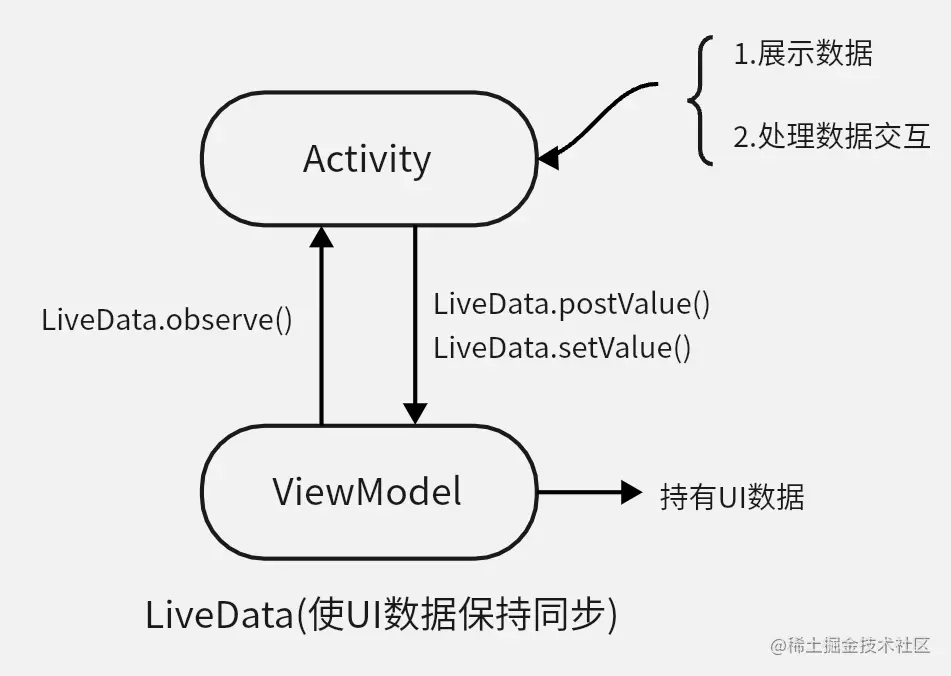
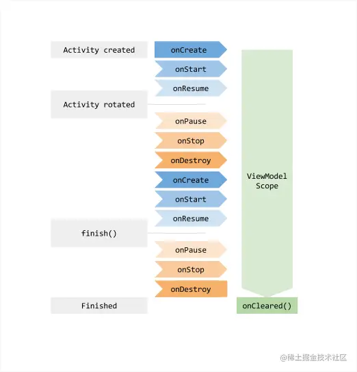
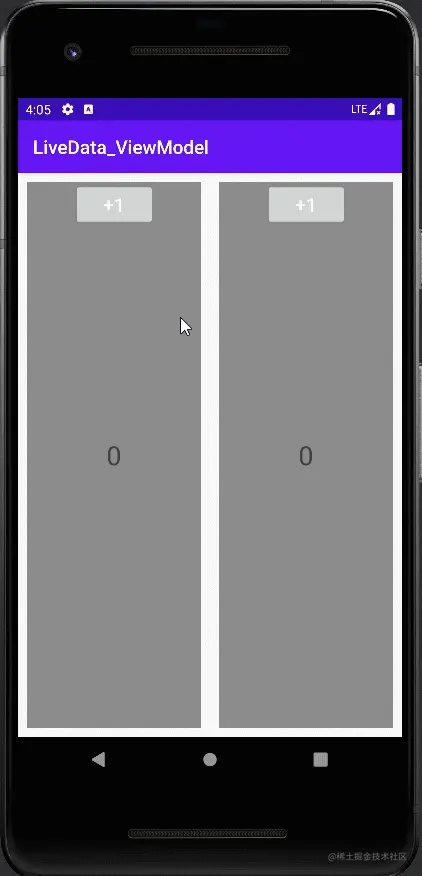

# LiveData和ViewModel的关系



# LiveData

**LiveData**是一种**可观察的数据存储器类**(响应式编程)。当LiveData发送变化时，UI（观察者）会收到通知，然后 UI 可以使用新数据重新绘制自己。LiveData可以很容易地使屏幕上发生的事情与数据保持同步（这是响应式编程的核心）。
另外，与常规的可观察类不同，LiveData 最重要的是**具有生命周期感知能力**，它了解观察者的生命周期，如**Activity**和**Fragment。**

## 使用 LiveData 具有以下优势

- **UI与数据状态匹配**

  - LiveData 遵循观察者模式。当底层数据发生变化时，LiveData 会通知`Observer`对象，在这些 `Observer`对象中可以更新界面。

- **提高代码的稳定性**

  代码稳定性在整个应用程序生命周期中增加：

  - 活动停止时不会发生崩溃。如果应用程序组件处于非活动状态，则这些更改不受影响。因此，您在更新数据时无需担心应用程序组件的生命周期。对于后台堆栈中的活动，它不会接受任何LiveData事件
  - 内存泄漏会减少，观察者会绑定到Lifecycle对象，并在其关联的生命周期遭到销毁后进行自我清理
  - 取消订阅任何观察者时无需担心
  - 如果由于配置更改（如设备旋转）而重新创建了 Activity 或 Fragment，它会立即接收最新的可用数据。

- **不再需要手动处理生命周期**

  界面组件只是观察相关数据，不会停止或恢复观察。LiveData 将自动管理所有这些操作，因为它在观察时可以感知相关的生命周期状态变化。

- **数据始终保持最新状态**

  如果生命周期变为非活跃状态，它会在再次变为活跃状态时接收最新的数据。例如，曾经在后台的 Activity 会在返回前台后立即接收最新的数据。

- **共享资源**

  像单例模式一样，我们也可以扩展我们的LiveData对象来包装系统服务，以便它们可以在我们的应用程序中共享。一旦LiveData对象连接到系统服务，任何需要资源的观察者可以轻松地观看LiveData对象。

## 在以下情况中，不要使用LiveData

- 您需要在信息上使用大量运算符，尽管LiveData提供了诸如转换之类的工具，但只有Map和switchMap可以帮助您
- 您没有与信息的UI交互
- 您有一次性的异步操作
- 您不必将缓存的信息保存到UI中

# 如何使用LiveData

通常会在 ViewModel 中创建 LiveData 对象，保证app配置变更时，数据不会丢失；

然后在 Activity/Fragment 的 onCreate 中注册 LiveData 监听（因为在 onStart 和 onResume 中进行监听可能会有冗余调用）。

## 基础使用流程

1.在 ViewModel 中，创建一个 LiveData  实例来保存数据

```kotlin
class MainViewModel : ViewModel() {
    var mycount: MutableLiveData<Int> = MutableLiveData()
}
```

2.在Activity或者Fragment中获取到ViewModel，通过ViewModel获取到对应的LiveData

```kotlin
class MainActivity : AppCompatActivity() {
    lateinit var viewModel: MainViewModel
    override fun onCreate(savedInstanceState: Bundle?) {
        ...
        /**记住绝对不可以直接去创建ViewModel实例
        一定要通过ViewModelProvider(ViewModelStoreOwner)构造函数来获取。
        因为每次旋转屏幕都会重新调用onCreate()方法，如果每次都创建新的实例的话就无法保存数据了。
        用上述方法后，onCreate方法被再次调用,
        它会返回一个与MainActivity相关联的预先存在的ViewModel，这就是保存数据的原因。
        */
        viewModel = ViewModelProvider(this@MainActivity,ViewModelProvider.
                        NewInstanceFactory()).get(MainViewModel::class.java)
    }
}
```

3.给LiveData添加观察者监听，用来监听LiveData中的数据变化，在Observer的onChanged中使用监听回调数据

```kotlin
/**
 *  订阅 ViewModel,mycount是一个LiveData类型 可以观察
 * */        
viewModel.mycount.observe(this@MainActivity) {
    countTv.text = viewModel.mycount.value.toString()
}
// LiveData onchange会自动感应生命周期 不需要手动
//        viewModel.mycount.observe(this, object : Observer<Int> {
//            override fun onChanged(t: Int?) {
//
//            }
//        })
```

## 进阶用法

**Transformations.map**

> 现在有一个场景：我们通过网络请求，获得了一个User类数据（LiveData），但是，我们只想把User.name暴露给外部观察者，这样我们就可以通过Transformations.map来转化LiveData的数据类型，从而来实现上述场景。这个函数常用于对数据的封装。

```kotlin
//实体类
data class User(var name: String)
...
//Transformations.map接收两个参数，第一个参数是用于转换的LiveData原始对象，第二个参数是转换函数。
private val userLiveData: MutableLiveData<User> = MutableLiveData()
    val userNames: LiveData<String> = Transformations
        .map(userLiveData) { user ->
            user.name
}
```

**Transformations.switchMap**

> switchMap是根据传入的LiveData的值，然后判断这个值，然后再去切换或者构建新的LiveData。比如我们有些数据需要依赖其他数据进行查询，就可以使用switchMap。
>
> 例如，有一个学生，他有两门课程的成绩，但是在UI组件中，我们一次只能显示一门课的成绩，在这个需要判断展示哪门课程成绩的需求下，我们就可以使用switchMap。

```kotlin
data class Student
    (var englishScore: Double, var mathScore: Double, val scoreTAG: Boolean)

.....
class SwitchMapViewModel:ViewModel {
    var studentLiveData = MutableLiveData<Student>()
    val transformationsLiveData = Transformations.switchMap(studentLiveData) {
        if (it.scoreTAG) {
            MutableLiveData(it.englishScore)
        } else {
            MutableLiveData(it.mathScore)
        }
    }
}

//使用时：
var student = Student()
person.englishScore = 88.2
person.mathScore = 91.3
//判断显示哪个成绩
person.condition = true
switchMapViewModel.conditionLiveData.postValue(person)
```

**MediatorLiveData**

> MediatorLiveData继承于MutableLiveData，在MutableLiveData的基础上，增加了合并多个LiveData数据源的功能。其实就是通过addSource()这个方法去监听多个LiveData。
>
> 例如：现在有一个存在本地的dbLiveData，还有一个网络请求来的LiveData，我们需要将上面两个结果结合之后展示给用户。
>
> 第一种做法是在Activity中分别注册这两个LiveData的观察者，当数据发生变化时去更新UI，但使用MediatorLiveData可以简化这个操作。

```kotlin
class MediatorLiveDataViewModel : ViewModel() {
    var liveDataA = MutableLiveData<String>()
    var liveDataB = MutableLiveData<String>()

    var mediatorLiveData = MediatorLiveData<String>()
    
    init {
        mediatorLiveData.addSource(liveDataA) {
            Log.d("This is livedataA", it)
            mediatorLiveData.postValue(it)
        }

        mediatorLiveData.addSource(liveDataB) {
            Log.d("This is livedataB", it)
            mediatorLiveData.postValue(it)
        }
    }
}
```

## 解释

虽然一直在提LiveData，但是用的时候却是MutableLiveData，这两个有什么关系呢？几个区别分别是：

> - MutableLiveData的父类是LiveData
> - LiveData在实体类里可以通知指定某个字段的数据更新
> - MutableLiveData则是完全是整个实体类或者数据类型变化后才通知，不会细节到某个字段。

## 原理探究

探究 LiveData 的原理可以从下面几个角度入手：

- LiveData的工作原理
- LiveData的observe方法源码分析
- LifecycleBoundObserver源码分析
- activeStateChanged源码分析（用于粘性事件）
- postValue和setValue
- considerNotify判断是否发送数据分析
- 粘性事件的分析

相信从以上几个角度去分析LiveData会有不小的收获

> 原理在 LiveData解析.md 中。

# ViewModel

## 官方简介

**ViewModel类旨在以注重生命周期的方式存储和管理界面相关的数据。ViewModel类让数据可在发生屏幕旋转等配置更改后继续留存。**

## 生命周期



ViewModel的生命周期会比创建它的Activity、Fragment的生命周期都要长。所以ViewModel中的数据会一直存活在Activity/Fragment中。

## 基础使用流程

1.构造数据对象

> 自定义ViewModel类，继承ViewModel，然后在自定义的ViewModel类中添加需要的数据对象

```kotlin
class MainViewModel : ViewModel() {
    ...
}
```

2.获取数据

> 有两种常见的ViewModel创建方式，第一种是在activity或fragment种直接基于 ViewModelProvider 获取。第二种是通过ViewModelFactory 创建

```kotlin
//第一种 ViewModelProvider直接获取
ViewModelProvider(this@MainActivity).get(MainViewModel::class.java)

//第二种 通过 ViewModelFactory 创建
class TestViewModelFactory(private val param: Int) : ViewModelProvider.Factory {
    override fun <T : ViewModel> create(modelClass: Class<T>): T {
        return TestViewModel(param) as T
    }
}

ViewModelProvider(this@MainActivity,TestViewModelFactory(0)).get(TestViewModel::class.java)
```

## ViewModel常见的使用场景

- 使用ViewModel，在横竖屏切换后，Activity重建，数据仍可以保存
- 同一个Activity下，Fragment之间的数据共享
- 与LiveData配合实现代码的解耦

## ViewModel和onSaveInstanceState的区别

onSaveInstanceState，是用来保存UI状态的，可以使用它保存你所想保存的东西，在Activity被杀死之前，它一般在onStop或者onPause之前触发。虽然ViewModel被设计为应用除了onSaveInstanceState的另一个选项，但是还是有一些明显的区别。由于资源限制，ViewModel无法在进程关闭后继续存在，但onSaveInstance包含执行此任务。ViewModel**是存储数据的绝佳选择，而onSaveInstanceState bundles不是用于该目的的合适选项。**

ViewModel用于存储尽可能多的UI数据。因此，在配置更改期间**不需重新加载或重新生成**该数据。

如果该进程被框架关闭，onSaveInstanceState应该存储恢复UI状态所需的最少数据量。例如，可以将所有用户的数据存放在ViewModel中，而仅将用户的数据库ID存储在onSaveInstanceState中。

## ViewModel和Context

ViewModel不应该包含对Activity、Fragment或context的引用，此外，ViewModel不应包含对UI控制器（如View）的引用，因为这将创建对Context的间接引用。当您旋转Activity被销毁的屏幕时，您有一个ViewModel包含对已销毁Activity的引用，这就是内存泄漏。因此，如果需要使用上下文，则必须使用应用程序上下文 **（AndroidViewModel）**。

# 案例

## 案例一：计数器 — 两个Activity共享一个ViewModel

效果图：

 

虽然这个案例比较简单，但是可以帮助更快的熟悉LiveData和ViewModel

想要实现效果图的话需要从下面几步来写（只讲解核心代码，具体代码请自己查看仓库）：

**第一步：创建ViewModel**

```kotlin
import androidx.lifecycle.LiveData
import androidx.lifecycle.MutableLiveData
import androidx.lifecycle.ViewModel

class MainViewModel : ViewModel() {
    private var _mycount: MutableLiveData<Int> = MutableLiveData()
    //只暴露不可变的LiveData给外部
    val mycount: LiveData<Int> get() = _mycount
    init {
        //初始化
        _mycount.value = 0
    }
    /**
     * mycount.value若为空就赋值为0，不为空则加一
     * */
    fun add() {
        _mycount.value = _mycount.value?.plus(1)
    }
    /**
     * mycount.value若为空就赋值为0，不为空则减一，可以为负数
     * */
    fun reduce() {
        _mycount.value = _mycount.value?.minus(1)
    }
    /**
     * 随机参数
     * */
    fun random() {
        val random = (0..100).random()
        _mycount.value = random
    }
    /**
     * 清除数据
     * */
    fun clear() {
        _mycount.value = 0
    }
}
```

**第二步：标记ViewModel的作用域**

因为，我们是两个Activity共享一个ViewModel，所以需要标记ViewModel的作用域

```kotlin
import androidx.lifecycle.*

/**
 * 用于标记viewmodel的作用域
 */
@Retention(AnnotationRetention.RUNTIME)
@Target(AnnotationTarget.FIELD)
annotation
class VMScope(val scopeName: String) {}

private val vMStores = HashMap<String, VMStore>()

fun LifecycleOwner.injectViewModel() {
    //根据作用域创建商店
    this::class.java.declaredFields.forEach { field ->
        field.getAnnotation(VMScope::class.java)?.also { scope ->
            val element = scope.scopeName
            var store: VMStore
            if (vMStores.keys.contains(element)) {
                store = vMStores[element]!!
            } else {
                store = VMStore()
                vMStores[element] = store
            }
            val clazz = field.type as Class<ViewModel>
            val vm = ViewModelProvider(store, ViewModelProvider.NewInstanceFactory()).get(clazz)
            field.set(this, vm)
        }
    }
}

    override val viewModelStore: ViewModelStore
        get() = if (vmStore == null) {
            vmStore = ViewModelStore()
            vmStore!!
        } else {
            vmStore!!
        }
}
```

**第三步：在Activity中使用(都是部分代码)**

```kotlin
class MainActivity : AppCompatActivity() {
    @VMScope("count") //设置作用域
    lateinit var viewModel: MainViewModel

    override fun onCreate(savedInstanceState: Bundle?) {
        super.onCreate(savedInstanceState)
        setContentView(R.layout.activity_main)
        injectViewModel()
        initEvent()
    }

    private fun initEvent() {
        val cardReduce: CardView = findViewById(R.id.card_reduce)
        .....
        cardReduce.setOnClickListener {
            //调用自定义ViewModel中的方法
            viewModel.reduce()
        }
        
        .....
        
        /**
         *  订阅 ViewModel,mycount是一个LiveData类型 可以观察
         * */
        viewModel.mycount.observe(this@MainActivity) {
            countTv.text = viewModel.mycount.value.toString()
        }
}
    
在第二个Activity中也是类似...
```

这样就可以实现效果图啦🏀

## 案例二：同一个Activity下的两个Fragment共享一个ViewModel

话不多说，先上效果图

 

这个效果就很简单了，在同一个Activity下，有两个Fragment，这两个Fragment共享一个ViewModel

这个案例主要是想带大家了解一下ViewModel在Fragment中的使用

**第一步：依旧是创建ViewModel**

```kotlin
class BlankViewModel : ViewModel() {
    private val numberLiveData = MutableLiveData<Int>()

    private var i = 0
    fun getLiveData(): LiveData<Int> {
        return numberLiveData
    }

    fun addOne(){
        i++
        numberLiveData.value = i
    }
}
```

非常简单的一个ViewModel

**第二步：在Fragment中使用**

```kotlin
//左Fragment
class LeftFragment : Fragment() {
    
    private val viewModel:BlankViewModel by activityViewModels()
    override fun onCreateView(
        inflater: LayoutInflater, container: ViewGroup?,
        savedInstanceState: Bundle?
    ): View? {
        return inflater.inflate(R.layout.fragment_left, container, false)
    }

    override fun onViewCreated(view: View, savedInstanceState: Bundle?) {
        super.onViewCreated(view, savedInstanceState)
        //对+1按钮监听
        left_button.setOnClickListener {
            viewModel.addOne()
        }
        activity?.let {it ->
            viewModel.getLiveData().observe(it){
                left_text.text = it.toString()
            }
        }
    }
}

//右Fragment
class RightFragment : Fragment() {
    private val viewModel: BlankViewModel by activityViewModels()
    
    override fun onCreateView(
        inflater: LayoutInflater, container: ViewGroup?,
        savedInstanceState: Bundle?
    ): View? {
        return inflater.inflate(R.layout.fragment_right, container, false)
    }

    override fun onViewCreated(view: View, savedInstanceState: Bundle?) {
        super.onViewCreated(view, savedInstanceState)
        right_button.setOnClickListener {
            viewModel.addOne()
        }
        activity?.let { it ->
            viewModel.getLiveData().observe(it) {
                right_text.text = it.toString()
            }
        }
    }
}
```

这样，这个简单的案例就实现了。


# 参考

[学会使用LiveData和ViewModel，我相信会让你在写业务时变得轻松🌞](https://juejin.cn/post/7111600906465968165)
