> 说明：本文基于 2.9.0 版本。最新版本：[WorkManager 版本页面](https://developer.android.com/jetpack/androidx/releases/work?hl=zh-cn)
>
> 官方文档中有一部分内容涉及到了低版本的使用，毕竟是官方文档，考虑的面要更广一些。
>
> 但我认为在实践中，基于最新的版本就可以了，所以**本文删减了低版本的使用说明，以除冗余**。如果项目中有涉及到低版本使用或者版本升级需要适配的，再查阅官方文档即可。
>
> 另外，本文所有代码示例都是 kotlin 的，移除了 Java 相关的内容，WorkManager 中有些使用 Java 和 kotlin 存在差异，如果想看 Java 版，再查阅官方文档。


# WorkManager 背景与概览

## 持久性工作介绍

持久性的工作是指当应用重启和系统重启后任然保持执行的工作。[WorkManager](https://developer.android.google.cn/reference/androidx/work/WorkManager?hl=zh-cn) 是适用于持久性工作的推荐解决方案。 由于大多数后台处理操作都是通过持久性工作完成的，因此 WorkManager 通常也是后台处理的主要推荐 API。

## 持久性工作的类型

WorkManager 可处理三种类型的持久性工作：

- **立即执行**：必须立即开始且很快就完成的任务，可以加急。
- **长时间运行的任务**：运行时间可能较长（可能超过 10 分钟）的任务。
- **可延期执行**：延期开始并且可以定期运行的预定任务。

图 1 大致表明了不同类型的持久性工作彼此之间的关系。

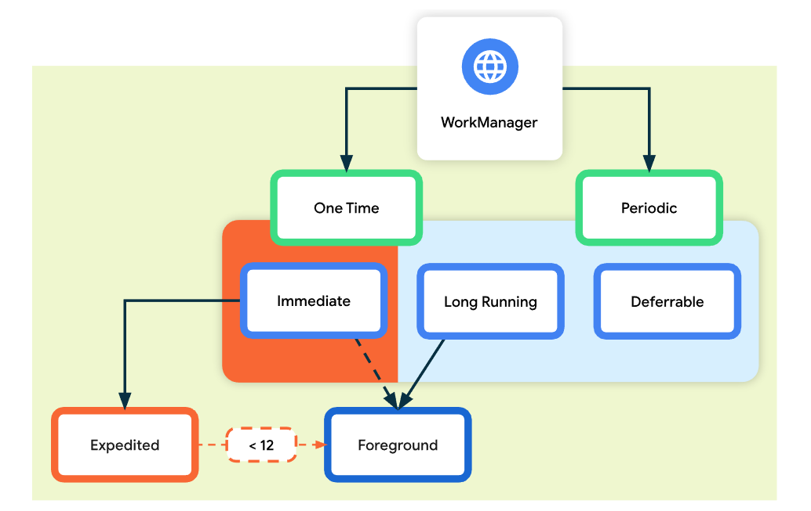

**图 1**：持久性工作的类型。

下表大致列出了各种工作类型。

| 类型       | 周期         | 查找方式                                                     |
| :--------- | :----------- | :----------------------------------------------------------- |
| 即时       | 一次         | `OneTimeWorkRequest` 和 `Worker`。如需加急工作，请对 OneTimeWorkRequest 调用 `setExpedited()`。 |
| 长时间运行 | 一次性或定期 | 任意 `WorkRequest` 或 `Worker`。在 worker 中调用 `setForeground()` 来处理通知。 |
| 可延期     | 一次性或定期 | `PeriodicWorkRequest` 和`Worker`。                           |

如需详细了解如何设置 WorkManager，请参阅[定义您的 WorkRequest](https://developer.android.google.cn/topic/libraries/architecture/workmanager/how-to/define-work?hl=zh-cn#work-constraints) 指南。

# WorkManager介绍

WorkManager 是一个后台任务调度与管理库。是 Google 推出的组件, 用于解决**应用在退出或者设备重启后仍需要运行任务**的问题。

## 适用场景

### 什么时候应该使用？

需要保证工作的可靠性时。

WorkManager 适用于需要**可靠运行**的工作，即使用户离开屏幕、退出应用或重启设备也不影响工作的执行。例如：

- 向后端服务发送日志或分析数据。
- 定期将应用数据与服务器同步。

### 什么时候不该使用？

WorkManager **不适用于那些可在应用进程结束时安全终止的进程内后台工作。**它也不是对所有需要立即执行的工作都适用的通用解决方案。查看[后台处理指南](https://developer.android.google.cn/guide/background?hl=zh-cn)，了解哪种解决方案符合您的需求。


## WorkManager 功能列表

除了具备更为简单且一致的 API 之外，WorkManager 还具备许多其他关键优势：

### 工作约束（Work constraints）

使用[工作约束](https://developer.android.google.cn/topic/libraries/architecture/workmanager/how-to/define-work?hl=zh-cn#work-constraints)明确定义工作运行的最佳条件。例如，仅在设备采用不按流量计费的网络连接时、当设备处于空闲状态或者有足够的电量时运行。

### 强大的调度

WorkManager 允许您使用灵活的调度窗口[调度工作](https://developer.android.google.cn/topic/libraries/architecture/workmanager/how-to/define-work?hl=zh-cn)，以运行[一次性](https://developer.android.google.cn/reference/androidx/work/OneTimeWorkRequest?hl=zh-cn)或[重复](https://developer.android.google.cn/reference/androidx/work/PeriodicWorkRequest?hl=zh-cn)工作。您还可以对工作进行标记或命名，以便调度唯一的、可替换的工作以及监控或取消工作组。

已调度的工作存储在内部托管的 SQLite 数据库中，由 WorkManager 负责确保该工作持续进行，并在设备重启后重新调度。

此外，WorkManager 遵循[低电耗模式](https://developer.android.google.cn/training/monitoring-device-state/doze-standby?hl=zh-cn)等省电功能和最佳做法，因此您在这方面无需担心。

### 加急工作

可以使用 WorkManager 调度需在后台立即执行的工作。应该使用 [Expedited work](https://developer.android.google.cn/topic/libraries/architecture/workmanager/how-to/define-work#expedited) 来处理对用户很重要且会在几分钟内完成的任务。

### 灵活的重试政策

有时工作会失败。WorkManager 提供了[灵活的重试政策](https://developer.android.google.cn/topic/libraries/architecture/workmanager/how-to/define-work?hl=zh-cn#retries_backoff)，包括可配置的[指数退避政策](https://developer.android.google.cn/reference/androidx/work/BackoffPolicy?hl=zh-cn)。

### 工作链

复杂的工作，可以使用直观的接口[将各个工作任务串联起来](https://developer.android.google.cn/topic/libraries/architecture/workmanager/how-to/chain-work?hl=zh-cn)，这样就可以控制哪些部分顺序运行，哪些部分并行运行。

```kotlin
val continuation = WorkManager.getInstance(context)
    .beginUniqueWork(
        Constants.IMAGE_MANIPULATION_WORK_NAME,
        ExistingWorkPolicy.REPLACE,
        OneTimeWorkRequest.from(CleanupWorker::class.java)
    ).then(OneTimeWorkRequest.from(WaterColorFilterWorker::class.java))
    .then(OneTimeWorkRequest.from(GrayScaleFilterWorker::class.java))
    .then(OneTimeWorkRequest.from(BlurEffectFilterWorker::class.java))
    .then(
        if (save) {
            workRequest<SaveImageToGalleryWorker>(tag = Constants.TAG_OUTPUT)
        } else /* upload */ {
            workRequest<UploadWorker>(tag = Constants.TAG_OUTPUT)
        }
    )
```

对于每项工作任务，可以[定义工作的输入和输出数据](https://developer.android.google.cn/topic/libraries/architecture/workmanager/how-to/define-work?hl=zh-cn#input_output)。将工作串联在一起时，WorkManager 会自动将输出数据从一个工作任务传递给下一个工作任务。

### 内置线程互操作性

WorkManager [无缝集成](https://developer.android.google.cn/topic/libraries/architecture/workmanager/advanced/threading?hl=zh-cn) [Coroutines](https://developer.android.google.cn/topic/libraries/architecture/workmanager/advanced/coroutineworker?hl=zh-cn) 和 [RxJava](https://developer.android.google.cn/topic/libraries/architecture/workmanager/advanced/rxworker?hl=zh-cn)，可以[插入自己的异步 API](https://developer.android.google.cn/topic/libraries/architecture/workmanager/advanced/listenableworker?hl=zh-cn)，非常灵活。

> **注意**：尽管 Coroutines 和 WorkManager 分别是针对于不同用例推荐的解决方案，但它们二者并不是互斥的关系。可以在通过 WorkManager 调度的工作中使用协程。

## 与其他 API 的关系

虽然协程是某些用例的推荐解决方案，但不适用于持久性工作。请务必注意，协程是一个并发框架，而 WorkManager 是一个持久性工作库。同样，AlarmManager 仅适合用于时钟或日历。

| API              | 推荐对象                   | 与 WorkManager 的关系                                        |
| :--------------- | :------------------------- | :----------------------------------------------------------- |
| **Coroutines**   | 所有不需要持久的异步工作。 | 协程是在 Kotlin 中退出主线程的标准方式。不过，它们在应用关闭后会释放内存。对于持久性工作，请使用 WorkManager。 |
| **AlarmManager** | 仅限闹钟。                 | 与 WorkManager 不同，AlarmManager 会使设备从低电耗模式中唤醒。因此，它在电源和资源管理方面来讲并不高效。**AlarmManager 仅适合用于精确闹钟或通知**（例如日历活动）场景，而不适用于后台工作。 |

### 替换已废弃的 API

WorkManager API 是推荐用来替代所有旧版 Android 后台调度 API（包括 [`FirebaseJobDispatcher`](https://developer.android.google.cn/topic/libraries/architecture/workmanager/migrating-fb?hl=zh-cn)、[`GcmNetworkManager`](https://developer.android.google.cn/topic/libraries/architecture/workmanager/migrating-gcm?hl=zh-cn) 和 [`JobScheduler`](https://developer.android.google.cn/reference/android/app/job/JobScheduler?hl=zh-cn)）的。

> **注意** ：`yourFirebaseJobDispatcher` 和 `GcmNetworkManager` API 调用在搭载 Android Marshmallow (6.0) 及更高版本的设备上不再有效。如需迁移指导，请按照 [`FirebaseJobDispatcher`](https://developer.android.google.cn/topic/libraries/architecture/workmanager/migrating-fb?hl=zh-cn) 和 [`GcmNetworkManager`](https://developer.android.google.cn/topic/libraries/architecture/workmanager/migrating-gcm?hl=zh-cn) 的迁移指南操作。此外，请参阅[统一 Android 上的后台任务调度](https://developer.android.google.cn/topic/libraries/architecture/workmanager/migrating-gcm?hl=zh-cn)公告，详细了解其弃用情况。

## 拓展

#### 视频

- [Workmanager - MAD 技巧](https://www.youtube.com/playlist?list=PLWz5rJ2EKKc_J88-h0PhCO_aV0HIAs9Qk&hl=zh-cn)（系列视频）
- [使用 WorkManager](https://www.youtube.com/watch?v=83a4rYXsDs0&hl=zh-cn)（2018 年 Android 开发者峰会）
- [WorkManager：深入探索高级知识](https://www.youtube.com/watch?v=Bz0z694SrEE&hl=zh-cn)（2019 年 Android 开发者峰会）

#### 博客

- [WorkManager 简介](https://medium.com/androiddevelopers/introducing-workmanager-2083bcfc4712)


# WorkManager 开始使用

## 步骤0：添加依赖

将以下依赖项添加到应用的 `build.gradle` 文件中：

```groovy
dependencies {
    def work_version = "2.9.0"

    // (Java only)
    implementation "androidx.work:work-runtime:$work_version"

    // Kotlin + coroutines
    implementation "androidx.work:work-runtime-ktx:$work_version"

    // optional - RxJava2 support
    implementation "androidx.work:work-rxjava2:$work_version"

    // optional - GCMNetworkManager support
    implementation "androidx.work:work-gcm:$work_version"

    // optional - Test helpers
    androidTestImplementation "androidx.work:work-testing:$work_version"

    // optional - Multiprocess support
    implementation "androidx.work:work-multiprocess:$work_version"
}
```

> 获取最新版本：[WorkManager 版本页面](https://developer.android.com/jetpack/androidx/releases/work?hl=zh-cn)

## 步骤1：定义工作

工作使用 `Worker` 类定义。`doWork()` 方法在 WorkManager 提供的后台线程上异步运行。

继承 `Worker` 类并实现 `doWork()` 方法。例如，如需创建上传图像的 `Worker`，可以执行以下操作：

```kotlin
class UploadWorker(appContext: Context, workerParams: WorkerParameters):
       Worker(appContext, workerParams) {
   override fun doWork(): Result {

       // Do the work here--in this case, upload the images.
       uploadImages()

       // 通过 Result 返回工作执行结果
       return Result.success()
   }
}
```

`doWork()` 的返回值 `Result` 会通知 WorkManager 工作执行结果，以及工作失败时是否应重试工作。

- `Result.success()`：工作成功完成。
- `Result.failure()`：工作失败。
- `Result.retry()`：工作失败，应根据其[重试政策](https://developer.android.com/topic/libraries/architecture/workmanager/how-to/define-work?hl=zh-cn#retries_backoff)在其他时间尝试。

如果想要使用 Kotlin 协程可以使用 `CoroutineWorker`

## 步骤2：创建 WorkRequest

`Worker` 定义工作单元，`WorkRequest`（及其子类）则定义工作运行方式(例如: `Worker`运行所需要满足的约束条件, 为`Worker`传递数据, `Worker`调度信息配置等)和时间。

WorkManager提供了两种 WorkRequest 的实现：

- OneTimeWorkRequest(一次性工作)：仅运行[一次](https://developer.android.com/topic/libraries/architecture/workmanager/how-to/define-work?hl=zh-cn#constraints)
- PeriodicWorkRequest(定期工作)：在某段时间内[定期运行](https://developer.android.com/topic/libraries/architecture/workmanager/how-to/define-work?hl=zh-cn#schedule_periodic_work)

不论选择哪种方式调度工作，请始终使用 `WorkRequest`。

在最简单的情况下，可以使用 `OneTimeWorkRequest`，如下所示：

```kotlin
val uploadWorkRequest: WorkRequest =
   OneTimeWorkRequestBuilder<UploadWorker>()
       .build()
```

下面的示例，传入了参数和约束条件等，这些后面会说明：

```kotlin
// 传递给Worker的参数
val data = Data.Builder().putString(DownloadWorker.KEY_NAME, downloadContent).build()
// Worker执行的约束条件
val constraints = Constraints.Builder().setRequiredNetworkType(NetworkType.CONNECTED).build()
// 创建WorkRequest
OneTimeWorkRequestBuilder<DownloadWorker>()
    .addTag(DownloadWorker.TAG)
    .setInputData(data)
    .setConstraints(constraints)
    .build()
```

## 步骤3：将 WorkRequest 提交给系统

需要使用 `enqueue()` 方法将 `WorkRequest` 提交到 `WorkManager` 执行。

```kotlin
WorkManager
    .getInstance(myContext)
    .enqueue(uploadWorkRequest)
```

执行 Worker 的确切时间取决于 `WorkRequest` 中使用的约束和系统优化方式。WorkManager 能够在满足约束的情况下提供最佳行为。

WorkManager 用于管理 Work。例如加入任务，取消任务，以及监听任务的执行。

## 拓展

### 示例

- [WorkManagerSample](https://github.com/android/architecture-components-samples/tree/main/WorkManagerSample)，一个简单的图像处理应用。
- [Sunflower](https://github.com/android/sunflower)，一款演示版应用，演示包括 WorkManager 在内的各种架构组件的最佳做法。

### Codelab

- 使用 WorkManager [(Kotlin)](https://codelabs.developers.google.com/codelabs/android-workmanager/?hl=zh-cn#0) 
- [高级 WorkManager (Kotlin)](https://codelabs.developers.google.com/codelabs/android-adv-workmanager/?hl=zh-cn#0)

### 博客

- [WorkManager 简介](https://medium.com/androiddevelopers/introducing-workmanager-2083bcfc4712)
- [WorkManager 基础知识](https://medium.com/androiddevelopers/workmanager-basics-beba51e94048)
- [WorkManager 和 Kotlin](https://medium.com/androiddevelopers/workmanager-meets-kotlin-b9ad02f7405e)
- [WorkManager 周期](https://medium.com/androiddevelopers/workmanager-periodicity-ff35185ff006)
- [自定义 WorkManager - 基础知识](https://medium.com/androiddevelopers/customizing-workmanager-fundamentals-fdaa17c46dd2)
- [使用 Dagger 自定义 WorkManager](https://medium.com/androiddevelopers/customizing-workmanager-with-dagger-1029688c0978)


# WorkRequest 使用详解

**开始使用**一节中，介绍了 WorkManager 的整体使用流程，下面介绍 WorkRequest 的详细使用。

本节，将了解如何定义和自定义 `WorkRequest` 对象来处理常见用例，例如：

- 调度一次性工作和重复性工作
- 设置工作约束条件，例如要求连接到 Wi-Fi 网络或正在充电
- 确保至少延迟一定时间再执行工作
- 设置重试和退避策略
- 将输入数据传递给工作
- 使用标记将相关工作分组在一起

## 概览

WorkRequest 对象中包含 WorkManager 调度和运行工作所需的所有信息。其中包括运行工作必须满足的约束、调度信息（例如延迟或重复间隔）、重试配置，并且可能包含输入数据（如果工作需要）。

`WorkRequest` 本身是抽象基类。该类有两个派生实现，可用于创建 `OneTimeWorkRequest` 和 `PeriodicWorkRequest` 请求。

- `OneTimeWorkRequest` 适用于调度非重复性工作
- `PeriodicWorkRequest` 则更适合调度以一定间隔重复执行的工作。

## 调度一次性工作

对于无需额外配置的简单工作，请使用静态方法 `from`：

```kotlin
val myWorkRequest = OneTimeWorkRequest.from(MyWork::class.java)
```

对于更复杂的工作，可以使用构建器：

```kotlin
val uploadWorkRequest: WorkRequest =
   OneTimeWorkRequestBuilder<MyWork>()
       // Additional configuration
       .build()
```

## 调度加急工作

加急工作使 WorkManager 能够执行重要工作，同时使系统能够更好地控制对资源的访问权限。

加急工作具有以下特征：

- **重要性**：加急工作适用于对用户很重要或由用户启动的任务。
- **速度**：加急工作最适合那些立即启动并在几分钟内完成的简短任务。
- **配额**：限制前台执行时间的系统级配额决定了加急作业是否可以启动。
- **电源管理**：[电源管理限制](https://developer.android.com/topic/performance/power/power-details?hl=zh-cn)（如省电模式和低电耗模式）不太可能影响加急工作。
- **延迟时间**：系统立即执行加急工作，前提是系统的当前工作负载允许执行此操作。这意味着这些工作对延迟时间较为敏感，不能安排到以后执行。

在用户想要发送消息或附加的图片时，可能会在聊天应用内使用加急工作。同样，处理付款或订阅流程的应用也可能需要使用加急工作。这是因为这些任务对用户很重要，会在后台快速执行，需要立即开始，并且即使用户关闭应用也应继续执行。

### 配额

系统必须先为加急作业分配执行时间，然后才能运行。执行时间并非无限制，相反，每个应用都会获得执行时间配额。当您的应用使用其执行时间并达到分配的配额时，在配额刷新之前，您无法再执行加急工作。这样，Android 可以更有效地在应用之间平衡资源。

应用可用的执行时间取决于[待机分桶](https://developer.android.com/topic/performance/appstandby?hl=zh-cn)和进程重要性。

您可以确定在执行配额不允许立即运行加急作业时会出现什么情况。

**注意**：**当应用在前台运行时，配额不会限制加急工作的执行。**仅当应用在后台运行或移至后台时，执行时间配额才适用。因此，应加急想在后台继续的工作。当应用在前台运行时，可以继续使用 `setForeground()`。

## 执行加急工作

可以调用 `setExpedited()` 来声明 `WorkRequest` 应该使用加急作业，以尽可能快的速度运行。以下代码段展示了如何使用 `setExpedited()` 的示例：

```kotlin
val request = OneTimeWorkRequestBuilder<SyncWorker>()
    .setExpedited(OutOfQuotaPolicy.RUN_AS_NON_EXPEDITED_WORK_REQUEST)
    .build()

WorkManager.getInstance(context).enqueue(request)
```

在此示例中，我们初始化 `OneTimeWorkRequest` 的实例并对其调用 `setExpedited()`。然后，此请求就会变成加急工作。如果配额允许，它将立即开始在后台运行。如果配额已用尽，则 `OutOfQuotaPolicy` 参数会指示相应请求应作为正常的、非加急工作运行。

### 配额政策

可以控制当应用达到其执行配额时加急工作会发生什么情况。如需继续，您可以传递 `setExpedited()`：

- `OutOfQuotaPolicy.RUN_AS_NON_EXPEDITED_WORK_REQUEST`，这会导致作业作为普通工作请求运行。
- `OutOfQuotaPolicy.DROP_WORK_REQUEST`，这会在配额不足时导致请求取消。

### 向后兼容性和前台服务

为了保持加急作业的向后兼容性，WorkManager 可能会在 Android 12 之前版本的平台上运行前台服务。前台服务可以向用户显示通知。

在 Android 12 之前，Worker 中的 `getForegroundInfoAsync()` 和 `getForegroundInfo()` 方法可让 WorkManager 在您调用 `setExpedited()` 时显示通知。

如果想要请求将任务作为加急作业运行，任何 `ListenableWorker` 都必须实现 `getForegroundInfo` 方法。

> **注意**：如果未实现对应的 `getForegroundInfo` 方法，那么在旧版平台上调用 `setExpedited` 时，可能会导致运行时崩溃。

以 Android 12 或更高版本为目标平台时，前台服务仍可通过相应的 `setForeground` 方法使用。

> **注意**：`setForeground()` 可能会在 Android 12 上抛出运行时异常，并且在[启动受到限制](https://developer.android.com/guide/components/foreground-services?hl=zh-cn#background-start-restrictions)时可能会抛出异常。

###  Worker

 Worker 不知道自身所执行的工作是否已加急。不过，在某些版本的 Android 上，如果 `WorkRequest` 被加急， Worker 可以显示通知。

为此，WorkManager 提供了 `getForegroundInfoAsync()` 方法，**必须实现该方法**，让 WorkManager 在必要时显示通知，以便启动 `ForegroundService`。

### CoroutineWorker

如果使用 `CoroutineWorker`，则必须实现 `getForegroundInfo()`。然后，在 `doWork()` 内将其传递给 `setForeground()`。这样做会在 Android 12 之前的版本中创建通知。

请参考以下示例：

```kotlin
  class ExpeditedWorker(appContext: Context, workerParams: WorkerParameters):
   CoroutineWorker(appContext, workerParams) {

   override suspend fun getForegroundInfo(): ForegroundInfo {
       return ForegroundInfo(
           NOTIFICATION_ID, createNotification()
       )
   }

   override suspend fun doWork(): Result {
       TODO()
   }

    private fun createNotification() : Notification {
       TODO()
    }

}
```

> **注意**： 您应将 `setForeground()` 封装在 `try/catch` 块中，以捕获潜在的 `IllegalStateException`。如果您的应用此时无法在前台运行，便可能会发生这类异常。在 Android 12 及更高版本中，您可以使用更详细的 `ForegroundServiceStartNotAllowedException`。

### 延迟加急工作

系统会尝试在调用指定的加急作业后，尽快执行该作业。不过，与其他类型的作业一样，系统可能会延迟启动新的加急工作，如在以下情况下：

- **负载**：系统负载过高，当有过多作业已在运行或者当系统内存不足时，就会发生这种情况。
- **配额**：已超出加急作业配额限制。加急工作使用基于应用待机存储分区的配额系统，并限制滚动时间窗口中的最大执行时间。用于加急工作的配额比用于其他类型的后台作业的配额更为严格。

### 示例应用

使用加急工作的完整示例，[WorkManagerSample](https://github.com/android/architecture-components-samples/blob/android-s/WorkManagerSample/lib/src/main/java/com/example/background/ImageOperations.kt)。


## 调度定期工作

您的应用有时可能需要定期运行某些工作。例如，您可能要定期备份数据、定期下载应用中的新鲜内容或者定期上传日志到服务器。

使用 `PeriodicWorkRequest` 创建定期执行的 `WorkRequest` 对象的方法如下：

```kotlin
val saveRequest =
       PeriodicWorkRequestBuilder<SaveImageToFileWorker>(1, TimeUnit.HOURS)
    // Additional configuration
           .build()
```

在此示例中，工作的运行时间间隔定为一小时。

时间间隔定义为两次重复执行之间的最短时间。 Worker 的确切执行时间取决于在 WorkRequest 对象中设置的约束以及系统执行的优化。

**注意**：可以定义的最短重复间隔是 15 分钟（与 [JobScheduler API](https://developer.android.com/reference/android/app/job/JobScheduler?hl=zh-cn) 相同）。

### 灵活的运行间隔

如果您的工作的性质致使其对运行时间敏感，您可以将 `PeriodicWorkRequest` 配置为在每个时间间隔的**灵活时间段**内运行，如图 1 所示。


**图 1.** 此图显示了可在灵活时间段内运行工作的的重复间隔。

如需定义具有灵活时间段的定期工作，请在创建 `PeriodicWorkRequest` 时传递 `flexInterval` 以及 `repeatInterval`。灵活时间段从 `repeatInterval - flexInterval` 开始，一直到间隔结束。

以下是可在每小时的最后 15 分钟内运行的定期工作的示例。

```kotlin
val myUploadWork = PeriodicWorkRequestBuilder<SaveImageToFileWorker>(
       1, TimeUnit.HOURS, // repeatInterval (the period cycle)
       15, TimeUnit.MINUTES) // flexInterval
    .build()
```

重复间隔必须大于或等于 `PeriodicWorkRequest.MIN_PERIODIC_INTERVAL_MILLIS`，而灵活间隔必须大于或等于 `PeriodicWorkRequest.MIN_PERIODIC_FLEX_MILLIS`。

### 约束对定期工作的影响

您可以对定期工作设置[约束](https://developer.android.com/develop/background-work/background-tasks/persistent/getting-started/define-work?hl=zh-cn#work-constraints)。例如，您可以为工作请求添加约束，以便工作仅在用户设备充电时运行。在这种情况下，除非满足约束条件，否则即使过了定义的重复间隔，`PeriodicWorkRequest` 也不会运行。这可能会导致工作在某次运行时出现延迟，甚至会因在相应间隔内未满足条件而被跳过。

## 工作约束

[约束](https://developer.android.com/reference/androidx/work/Constraints?hl=zh-cn)可确保将工作延迟到满足最佳条件时运行。以下约束适用于 WorkManager。

| **NetworkType**      | 约束运行工作所需的[网络类型](https://developer.android.com/reference/androidx/work/NetworkType?hl=zh-cn)。例如 Wi-Fi (`UNMETERED`)。 |
| -------------------- | ------------------------------------------------------------ |
| **BatteryNotLow**    | 如果设置为 true，那么当设备处于“电量不足模式”时，工作不会运行。 |
| **RequiresCharging** | 如果设置为 true，那么工作只能在设备充电时运行。              |
| **DeviceIdle**       | 如果设置为 true，则要求用户的设备必须处于空闲状态，才能运行工作。在运行批量操作时，此约束会非常有用；若是不用此约束，批量操作可能会降低用户设备上正在积极运行的其他应用的性能。 |
| **StorageNotLow**    | 如果设置为 true，那么当用户设备上的存储空间不足时，工作不会运行。 |

如需创建一组约束并将其与某项工作相关联，请使用一个 `Contraints.Builder()` 创建 `Constraints` 实例，并将该实例分配给 `WorkRequest.Builder()`。

例如，以下代码会构建一个工作请求，该工作请求仅在用户设备正在充电且连接到 Wi-Fi 网络时才会运行：

```kotlin
val constraints = Constraints.Builder()
   .setRequiredNetworkType(NetworkType.UNMETERED)
   .setRequiresCharging(true)
   .build()

val myWorkRequest: WorkRequest =
   OneTimeWorkRequestBuilder<MyWork>()
       .setConstraints(constraints)
       .build()
```

如果指定了多个约束，工作将仅在满足所有约束时才会运行。

如果在工作运行时不再满足某个约束，WorkManager 将停止 Worker。系统将在满足所有约束后重试工作。

## 延迟工作

如果工作没有约束，或者当工作加入队列时所有约束都得到了满足，那么系统可能会选择立即运行该工作。如果不希望工作立即运行，可以将工作指定为在经过一段最短初始延迟时间后再启动。

下面举例说明了如何将工作设置为在加入队列后至少经过 10 分钟后再运行。

```kotlin
val myWorkRequest = OneTimeWorkRequestBuilder<MyWork>()
   .setInitialDelay(10, TimeUnit.MINUTES)
   .build()
```

该示例说明了如何为 `OneTimeWorkRequest` 设置初始延迟时间，您也可以为 `PeriodicWorkRequest` 设置初始延迟时间。在这种情况下，定期工作只有首次运行时会延迟。

**注意**：执行 Worker 的确切时间还取决于 WorkRequest 中使用的约束和系统优化方式。WorkManager 经过设计，能够在满足这些约束的情况下提供可能的最佳行为。

## 重试和退避政策

如果您需要让 WorkManager 重试工作，可以从 Worker 返回 `Result.retry()`。然后，系统将根据[退避延迟时间](https://developer.android.com/reference/androidx/work/WorkRequest?hl=zh-cn#DEFAULT_BACKOFF_DELAY_MILLIS)和[退避政策](https://developer.android.com/reference/androidx/work/BackoffPolicy?hl=zh-cn)重新调度工作。

- 退避延迟时间指定了首次尝试后重试工作前的最短等待时间。此值不能超过 10 秒（或 [MIN_BACKOFF_MILLIS](https://developer.android.com/reference/androidx/work/WorkRequest?hl=zh-cn#MIN_BACKOFF_MILLIS)）。
- 退避政策定义了在后续重试过程中，退避延迟时间随时间以怎样的方式增长。WorkManager 支持 2 个退避政策，即 `LINEAR` 和 `EXPONENTIAL`。

每个工作请求都有退避政策和退避延迟时间。默认政策为 `EXPONENTIAL`，延迟时间为 30 秒，但您可以在工作请求配置中替换此设置。

以下是自定义退避延迟时间和政策的示例。

```kotlin
val myWorkRequest = OneTimeWorkRequestBuilder<MyWork>()
   .setBackoffCriteria(
       BackoffPolicy.LINEAR,
       OneTimeWorkRequest.MIN_BACKOFF_MILLIS,
       TimeUnit.MILLISECONDS)
   .build()
```

在本示例中，最短退避延迟时间设置为允许的最小值，即 10 秒。由于政策为 `LINEAR`，每次尝试重试时，重试间隔都会增加约 10 秒。例如，第一次运行以 `Result.retry()` 结束并在 10 秒后重试；然后，如果工作在后续尝试后继续返回 `Result.retry()`，那么接下来会在 20 秒、30 秒、40 秒后重试，以此类推。如果退避政策设置为 `EXPONENTIAL`，那么重试时长序列将接近 20、40、80 秒，以此类推。

**注意** ：退避延迟时间不精确，两次重试之间可能会有几秒钟的差异，但绝不会小于配置中指定的初始退避延迟时间。

## 标记工作

每个工作请求都有一个[唯一标识符](https://developer.android.com/reference/androidx/work/WorkRequest?hl=zh-cn#getId())，该标识符可用于在以后标识该工作，以便[取消](https://developer.android.com/topic/libraries/architecture/workmanager/how-to/managing-work?hl=zh-cn#cancelling)工作或[观察其进度](https://developer.android.com/topic/libraries/architecture/workmanager/how-to/states-and-observation?hl=zh-cn#observing)。

如果有一组在逻辑上相关的工作，对这些工作项进行标记可能也会很有帮助。通过标记，您一起处理一组工作请求。

例如，`WorkManager.cancelAllWorkByTag(String)` 会取消带有特定标记的所有工作请求，`WorkManager.getWorkInfosByTag(String)` 会返回一个 WorkInfo 对象列表，该列表可用于确定当前工作状态。

以下代码展示了如何向工作添加“cleanup”标记：

```kotlin
val myWorkRequest = OneTimeWorkRequestBuilder<MyWork>()
   .addTag("cleanup")
   .build()
```

最后，可以向单个工作请求添加多个标记。这些标记在内部以一组字符串的形式进行存储。可以使用 [WorkInfo.getTags()](https://developer.android.com/reference/androidx/work/WorkInfo?hl=zh-cn#getTags()) 获取与 `WorkRequest` 关联的标记集。

从 `Worker` 类中，您可以通过 [ListenableWorker.getTags()](https://developer.android.com/reference/androidx/work/ListenableWorker?hl=zh-cn#getTags()) 检索其标记集。

## 分配输入数据

您的工作可能需要输入数据才能正常运行。例如，处理图片上传的工作可能需要使用待上传图片的 URI 作为输入数据。

输入值以键值对的形式存储在 `Data` 对象中，并且可以在工作请求中设置。WorkManager 会在执行工作时将输入 `Data` 传递给工作。`Worker` 类可通过调用 `Worker.getInputData()` 访问输入参数。以下代码展示了如何创建需要输入数据的 `Worker` 实例，以及如何在工作请求中发送该实例。

```kotlin
// Define the Worker requiring input
class UploadWork(appContext: Context, workerParams: WorkerParameters)
   : Worker(appContext, workerParams) {

   override fun doWork(): Result {
       val imageUriInput =
           inputData.getString("IMAGE_URI") ?: return Result.failure()

       uploadFile(imageUriInput)
       return Result.success()
   }
   ...
}

// Create a WorkRequest for your Worker and sending it input
val myUploadWork = OneTimeWorkRequestBuilder<UploadWork>()
   .setInputData(workDataOf(
       "IMAGE_URI" to "http://..."
   ))
   .build()
```

同样，可使用 `Data` 类输出返回值。如需详细了解输入和输出数据，请参阅[输入参数和返回值](https://developer.android.com/topic/libraries/architecture/workmanager/advanced?hl=zh-cn#params)部分。


# 工作状态

工作在其整个生命周期内经历了一系列 [`State`](https://developer.android.google.cn/reference/androidx/work/WorkInfo.State?hl=zh-cn) 更改。

## 一次性工作的状态

对于 [`one-time`](https://developer.android.google.cn/topic/libraries/architecture/workmanager/how-to/define-work?hl=zh-cn#schedule_one-time_work) 工作请求，工作的初始状态为 [`ENQUEUED`](https://developer.android.google.cn/reference/androidx/work/WorkInfo.State?hl=zh-cn#ENQUEUED)。

在 `ENQUEUED` 状态下，工作会在满足其 [`Constraints`](https://developer.android.google.cn/reference/androidx/work/Constraints?hl=zh-cn) 和初始延迟计时要求后立即运行。接下来，该工作会转为 [`RUNNING`](https://developer.android.google.cn/reference/androidx/work/WorkInfo.State?hl=zh-cn#RUNNING) 状态，然后可能会根据工作的结果转为 [`SUCCEEDED`](https://developer.android.google.cn/reference/androidx/work/WorkInfo.State?hl=zh-cn#SUCCEEDED)、[`FAILED`](https://developer.android.google.cn/reference/androidx/work/WorkInfo.State?hl=zh-cn#FAILED) 状态；或者，如果结果是 [`retry`](https://developer.android.google.cn/reference/androidx/work/ListenableWorker.Result?hl=zh-cn#retry())，它可能会回到 `ENQUEUED` 状态。在此过程中，随时都可以取消工作，取消后工作将进入 [`CANCELLED`](https://developer.android.google.cn/reference/androidx/work/WorkInfo.State?hl=zh-cn#CANCELLED) 状态。

图 1 展示了一次性工作的生命周期，事件可能会进入另一个状态。

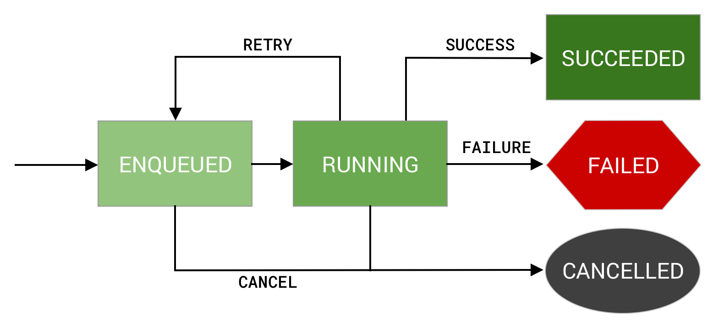

**图 1.** 一次性工作的状态图。

`SUCCEEDED`、`FAILED` 和 `CANCELLED` 均表示此工作的终止状态。如果您的工作处于上述任何状态，[`WorkInfo.State.isFinished()`](https://developer.android.google.cn/reference/androidx/work/WorkInfo.State?hl=zh-cn#isFinished()) 都将返回 true。

## 定期工作的状态

成功和失败状态仅适用于一次性工作和[链式工作](https://developer.android.google.cn/topic/libraries/architecture/workmanager/how-to/chain-work?hl=zh-cn)。[定期工作](https://developer.android.google.cn/topic/libraries/architecture/workmanager/how-to/define-work?hl=zh-cn#schedule_periodic_work)只有一个终止状态 `CANCELLED`。这是因为定期工作永远不会结束。每次运行后，无论结果如何，系统都会重新对其进行调度。图 2 描述了定期工作的精简状态图。

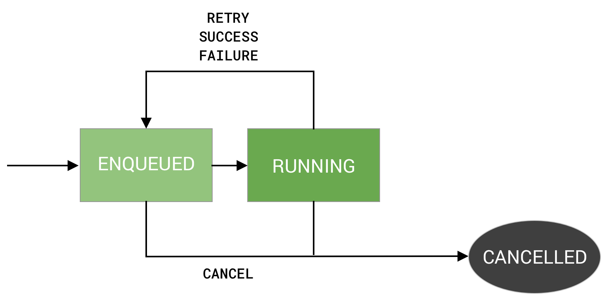

**图 2.** 定期工作的状态图。

## BLOCKED 状态

还有一种最终状态 `BLOCKED`。此状态适用于一系列已编排的工作，或者说工作链。[链接工作](https://developer.android.google.cn/topic/libraries/architecture/workmanager/how-to/chain-work?hl=zh-cn)中介绍了工作链及其状态图。


# 管理工作

本节介绍**如何管理和监控工作的进度**。

[定义 `Worker`](https://developer.android.google.cn/topic/libraries/architecture/workmanager/basics?hl=zh-cn#define_the_work) 和 [`WorkRequest`](https://developer.android.google.cn/topic/libraries/architecture/workmanager/how-to/define-work?hl=zh-cn) 后，最后一步是将工作加入队列。将工作加入队列的最简单方法是调用 WorkManager `enqueue()` 方法，然后传递要运行的 `WorkRequest`。

```kotlin
val myWork: WorkRequest = // ... OneTime or PeriodicWork
WorkManager.getInstance(requireContext()).enqueue(myWork)
```

在将工作加入队列时请小心谨慎，以避免重复。例如，应用可能会每 24 小时尝试将其日志上传到后端服务。如果不谨慎，即使作业只需运行一次，您最终也可能会多次将同一作业加入队列。为了实现此目标，您可以将工作调度为[唯一工作](https://developer.android.google.cn/develop/background-work/background-tasks/persistent/how-to/manage-work?hl=zh-cn#unique-work)。

## 唯一工作

唯一工作是一个很实用的概念，可确保同一时刻只有一个具有特定名称的工作实例。与 ID 不同的是，唯一名称是人类可读的，由开发者指定，而不是由 WorkManager 自动生成。与[标记](https://developer.android.google.cn/topic/libraries/architecture/workmanager/how-to/define-work?hl=zh-cn#tag)不同，唯一名称仅与一个工作实例相关联。

唯一工作既可用于一次性工作，也可用于定期工作。可以通过调用以下方法之一创建唯一工作序列，具体取决于您是调度重复工作还是一次性工作。

- [`WorkManager.enqueueUniqueWork()`](https://developer.android.google.cn/reference/androidx/work/WorkManager?hl=zh-cn#enqueueUniqueWork(java.lang.String, androidx.work.ExistingWorkPolicy, androidx.work.OneTimeWorkRequest))（用于一次性工作）
- [`WorkManager.enqueueUniquePeriodicWork()`](https://developer.android.google.cn/reference/androidx/work/WorkManager?hl=zh-cn#enqueueUniquePeriodicWork(java.lang.String, androidx.work.ExistingPeriodicWorkPolicy, androidx.work.PeriodicWorkRequest))（用于定期工作）

这两种方法都接受 3 个参数：

- uniqueWorkName - 用于唯一标识工作请求的 `String`。
- existingWorkPolicy - 此 `enum` 可告知 WorkManager：如果已有使用该名称且尚未完成的唯一工作链，应执行什么操作。
- work - 要调度的 `WorkRequest`。

借助唯一工作，可以解决前面提到的重复调度问题。

```kotlin
val sendLogsWorkRequest =
       PeriodicWorkRequestBuilder<SendLogsWorker>(24, TimeUnit.HOURS)
           .setConstraints(Constraints.Builder()
               .setRequiresCharging(true)
               .build()
            )
           .build()
WorkManager.getInstance(this).enqueueUniquePeriodicWork(
           "sendLogs",
           ExistingPeriodicWorkPolicy.KEEP,
           sendLogsWorkRequest
)
```

现在，如果上述代码在 sendLogs 作业已处于队列中的情况下运行，系统会保留现有的作业，并且不会添加新的作业。

当需要逐步构建一个长任务链时，也可以利用唯一工作序列。例如，照片编辑应用可能允许用户撤消一长串操作。其中的每一项撤消操作可能都需要一些时间来完成，但必须按正确的顺序执行。在这种情况下，应用可以创建一个“撤消”链，并根据需要将每个撤消操作附加到该链上。如需了解详情，请参阅[链接工作](https://developer.android.google.cn/topic/libraries/architecture/workmanager/how-to/chain-work?hl=zh-cn)。

### 冲突解决政策（existingWorkPolicy ）

调度唯一工作时，必须告知 WorkManager 在发生冲突时要执行的操作。可以通过在将工作加入队列时传递一个枚举来实现此目的。

对于一次性工作，需要提供一个 [`ExistingWorkPolicy`](https://developer.android.google.cn/reference/androidx/work/ExistingWorkPolicy?hl=zh-cn)，它支持用于处理冲突的 4 个选项。

- [`REPLACE`](https://developer.android.google.cn/reference/androidx/work/ExistingWorkPolicy?hl=zh-cn#REPLACE)：用新工作替换现有工作。此选项将取消现有工作。
- [`KEEP`](https://developer.android.google.cn/reference/androidx/work/ExistingWorkPolicy?hl=zh-cn#KEEP)：保留现有工作，并忽略新工作。
- [`APPEND`](https://developer.android.google.cn/reference/androidx/work/ExistingWorkPolicy?hl=zh-cn#APPEND)：将新工作附加到现有工作的末尾。此政策将导致您的新工作[链接](https://developer.android.google.cn/topic/libraries/architecture/workmanager/how-to/chain-work?hl=zh-cn)到现有工作，在现有工作完成后运行。

现有工作将成为新工作的先决条件。如果现有工作变为 `CANCELLED` 或 `FAILED` 状态，新工作也会变为 `CANCELLED` 或 `FAILED`。如果您希望无论现有工作的状态如何都运行新工作，请改用 `APPEND_OR_REPLACE`。

- [`APPEND_OR_REPLACE`](https://developer.android.google.cn/reference/androidx/work/ExistingWorkPolicy?hl=zh-cn#APPEND) 函数类似于 `APPEND`，不过它并不依赖于**先决条件**工作状态。即使现有工作变为 `CANCELLED` 或 `FAILED` 状态，新工作仍会运行。

对于定期工作，需要提供一个 [`ExistingPeriodicWorkPolicy`](https://developer.android.google.cn/reference/androidx/work/ExistingPeriodicWorkPolicy?hl=zh-cn)，它支持 `REPLACE` 和 `KEEP` 这两个选项。这些选项的功能与其对应的 ExistingWorkPolicy 功能相同。

## 观察工作

在将工作加入队列后，可以随时按其 `name`、`id` 或与其关联的 `tag` 在 WorkManager 中进行查询，以检查其状态。

```kotlin
// by id
workManager.getWorkInfoById(syncWorker.id) // ListenableFuture<WorkInfo>

// by name
workManager.getWorkInfosForUniqueWork("sync") // ListenableFuture<List<WorkInfo>>

// by tag
workManager.getWorkInfosByTag("syncTag") // ListenableFuture<List<WorkInfo>>
```

该查询会返回 [`WorkInfo`](https://developer.android.google.cn/reference/androidx/work/WorkInfo?hl=zh-cn) 对象的 [`ListenableFuture`](https://guava.dev/releases/23.1-android/api/docs/com/google/common/util/concurrent/ListenableFuture.html)，该值包含工作的 [`id`](https://developer.android.google.cn/reference/androidx/work/WorkInfo?hl=zh-cn#getId())、其标记、其当前的 [`State`](https://developer.android.google.cn/reference/androidx/work/WorkInfo.State?hl=zh-cn) 以及通过 [`Result.success(outputData)`](https://developer.android.google.cn/reference/androidx/work/ListenableWorker.Result?hl=zh-cn#success(androidx.work.Data)) 设置的任何输出数据。

利用每个方法的 [`LiveData`](https://developer.android.google.cn/topic/libraries/architecture/livedata?hl=zh-cn) 变种，可以注册监听器来观察 `WorkInfo` 的变化。例如，如果想要在某项工作成功完成后向用户显示消息，可以进行如下设置：

```kotlin
workManager.getWorkInfoByIdLiveData(syncWorker.id)
               .observe(viewLifecycleOwner) { workInfo ->
   if(workInfo?.state == WorkInfo.State.SUCCEEDED) {
       Snackbar.make(requireView(), 
      R.string.work_completed, Snackbar.LENGTH_SHORT)
           .show()
   }
}
```

### 复杂的工作查询

WorkQuery 支持按工作的标记、状态和唯一工作名称的组合查询已加入队列的作业。

以下示例说明了如何查找带有“syncTag”标记、处于 `FAILED` 或 `CANCELLED` 状态，且唯一工作名称为“preProcess”或“sync”的所有工作。

```kotlin
val workQuery = WorkQuery.Builder
       .fromTags(listOf("syncTag"))
       .addStates(listOf(WorkInfo.State.FAILED, WorkInfo.State.CANCELLED))
       .addUniqueWorkNames(listOf("preProcess", "sync")
    )
   .build()

val workInfos: ListenableFuture<List<WorkInfo>> = workManager.getWorkInfos(workQuery)
```

`WorkQuery` 中的每个组件（标记、状态或名称）与其他组件都是 `AND` 逻辑关系。组件中的每个值都是 `OR` 逻辑关系。例如：`(name1 OR name2 OR ...) AND (tag1 OR tag2 OR ...) AND (state1 OR state2 OR ...)`。

`WorkQuery` 也适用于等效的 LiveData 方法 [`getWorkInfosLiveData()`](https://developer.android.google.cn/reference/androidx/work/WorkManager?hl=zh-cn#getWorkInfosLiveData(androidx.work.WorkQuery))。

## 取消和停止工作

如果不再需要运行先前加入队列的工作，可以按工作的 `name`、`id` 或与其关联的 `tag` 取消工作。

```kotlin
// by id
workManager.cancelWorkById(syncWorker.id)

// by name
workManager.cancelUniqueWork("sync")

// by tag，取消具有给定标记的所有工作。
workManager.cancelAllWorkByTag("syncTag")
```

WorkManager 会在后台检查工作的 [`State`](https://developer.android.google.cn/reference/androidx/work/WorkInfo.State?hl=zh-cn)。如果工作已经[完成](https://developer.android.google.cn/reference/androidx/work/WorkInfo.State?hl=zh-cn#isFinished())，系统不会执行任何操作。否则，工作的状态会更改为 [`CANCELLED`](https://developer.android.google.cn/reference/androidx/work/WorkInfo.State?hl=zh-cn#CANCELLED)，之后就不会运行这个工作。任何[依赖于此工作](https://developer.android.google.cn/topic/libraries/architecture/workmanager/how-to/chain-work?hl=zh-cn)的 [`WorkRequest`](https://developer.android.google.cn/reference/androidx/work/WorkRequest?hl=zh-cn) 作业也将变为 `CANCELLED`。

cancel 后将会触发**工作停止**的回调，下面介绍。

## 停止正在运行的Worker

正在运行的 `Worker` 可能会由于以下几种原因而停止运行：

- 您明确要求取消它（例如，通过调用 `WorkManager.cancelWorkById(UUID)` 取消）。
- 如果是[唯一工作](https://developer.android.google.cn/develop/background-work/background-tasks/persistent/how-to/manage-work?hl=zh-cn#unique-work)，您明确地将 [`ExistingWorkPolicy`](https://developer.android.google.cn/reference/androidx/work/ExistingWorkPolicy?hl=zh-cn) 为 [`REPLACE`](https://developer.android.google.cn/reference/androidx/work/ExistingWorkPolicy?hl=zh-cn#REPLACE) 的新 `WorkRequest` 加入到了队列中。旧的 `WorkRequest` 会立即被视为已取消。
- 您的工作约束条件已不再满足。
- 系统出于某种原因指示您的应用停止工作。如果超过 10 分钟的执行期限，可能会发生这种情况。该工作会调度为在稍后重试。

在这些情况下，Worker会停止。

应该配合取消正在进行的任何工作，并释放 Worker 保留的所有资源。例如，此时应该关闭所打开的数据库和文件句柄。有两种机制用于了解 Worker 何时停止。

### onStopped() 回调

在 Worker 停止后，WorkManager 会立即调用 [`ListenableWorker.onStopped()`](https://developer.android.google.cn/reference/androidx/work/ListenableWorker?hl=zh-cn#onStopped())。目前，[`RUNNING`](https://developer.android.google.cn/reference/androidx/work/WorkInfo.State?hl=zh-cn#RUNNING) 可收到此调用。替换此方法可执行清理操作，关闭可能保留的所有资源。

#### isStopped() 属性

可以主动调用 [`ListenableWorker.isStopped()`](https://developer.android.google.cn/reference/androidx/work/ListenableWorker?hl=zh-cn#isStopped()) 方法来检查 Worker 是否已停止。如果在 Worker 中执行长时间运行的操作或重复操作，应该经常检查此属性，并将其用作尽快停止工作的信号。

**注意**：WorkManager 会忽略已收到 onStop 信号的 Worker 所设置的 [`Result`](https://developer.android.google.cn/reference/androidx/work/ListenableWorker.Result?hl=zh-cn)，因为 Worker 已被视为停止。


# 创建工作连-链接工作

可以使用 WorkManager 创建工作链并将其加入队列。工作链用于指定多个依存任务并定义这些任务的运行顺序。**当需要以特定顺序运行多个任务时，此功能很有用。**

使用工作链步骤

1. 使用 [`WorkManager.beginWith(OneTimeWorkRequest)`](https://developer.android.google.cn/reference/androidx/work/WorkManager?hl=zh-cn#beginWith(androidx.work.OneTimeWorkRequest)) 或 [`WorkManager.beginWith(List)`](https://developer.android.google.cn/reference/androidx/work/WorkManager?hl=zh-cn#beginWith(java.util.List)) 创建工作链，并返回 [`WorkContinuation`](https://developer.android.google.cn/reference/androidx/work/WorkContinuation?hl=zh-cn) 实例。
2. 使用 `WorkContinuation` 的 [`then(OneTimeWorkRequest)`](https://developer.android.google.cn/reference/androidx/work/WorkContinuation?hl=zh-cn#then(androidx.work.OneTimeWorkRequest)) 或 [`then(List)`](https://developer.android.google.cn/reference/androidx/work/WorkContinuation?hl=zh-cn#then(java.util.List)) 方法添加 `OneTimeWorkRequest` 实例。每次调用 `WorkContinuation.then(...)` 都会返回一个新的 `WorkContinuation` 实例。如果添加了 `OneTimeWorkRequest` 实例的 `List`，这些请求可能会并行运行。
3. 最后，使用 [`WorkContinuation.enqueue()`](https://developer.android.google.cn/reference/androidx/work/WorkContinuation?hl=zh-cn#enqueue()) 方法对 `WorkContinuation` 工作链执行 `enqueue()` 操作。

示例。

```kotlin
WorkManager.getInstance(myContext)
   // Candidates to run in parallel
   .beginWith(listOf(plantName1, plantName2, plantName3))
   // Dependent work (only runs after all previous work in chain)
   .then(cache)
   .then(upload)
   // Call enqueue to kick things off
   .enqueue()
```

在本例中，有 3 个不同的 Worker 作业配置为运行（可能并行运行）。然后这些 Worker 的结果将联接起来，并传递给正在缓存的 Worker 作业。最后，该作业的输出将传递到上传 Worker ，由上传 Worker 将结果上传到远程服务器。

## 输入合并器

当链接 `OneTimeWorkRequest` 实例时，父级工作请求的输出将作为子级的输入传入。因此，在上面的示例中，`plantName1`、`plantName2` 和 `plantName3` 的输出将作为 `cache` 请求的输入传入。

为了管理来自多个父级工作请求的输入，WorkManager 使用 [`InputMerger`](https://developer.android.google.cn/reference/androidx/work/InputMerger?hl=zh-cn)。

WorkManager 提供两种不同类型的 `InputMerger`：

- [`OverwritingInputMerger`](https://developer.android.google.cn/reference/androidx/work/OverwritingInputMerger?hl=zh-cn) 会尝试将所有输入中的所有键添加到输出中。如果发生冲突，它会覆盖先前设置的键。
- [`ArrayCreatingInputMerger`](https://developer.android.google.cn/reference/androidx/work/ArrayCreatingInputMerger?hl=zh-cn) 会尝试合并输入，并在必要时创建数组。

如果您有更具体的用例，则可以创建 `InputMerger` 的子类来编写自己的用例。

### OverwritingInputMerger

`OverwritingInputMerger` 是默认的合并方法。如果合并过程中存在键冲突，键的最新值将覆盖生成的输出数据中的所有先前版本。

例如，如果每种植物的输入都有一个与其各自变量名称（`"plantName1"`、`"plantName2"` 和 `"plantName3"`）匹配的键，传递给 `cache`  Worker 的数据将具有三个键值对。

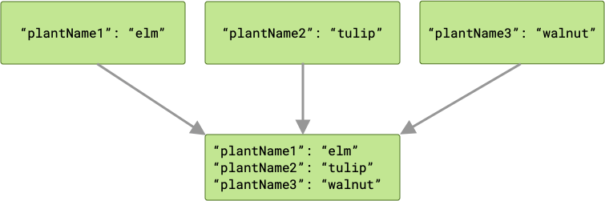

如果存在冲突，那么最后一个 Worker 将在争用中“取胜”，其值将传递给 `cache`。

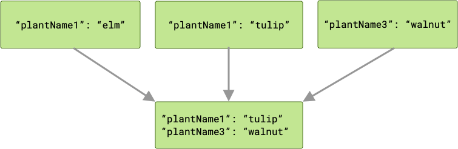

由于工作请求是并行运行的，因此无法保证其运行顺序。在上面的示例中，`plantName1` 可以保留值 `"tulip"` 或 `"elm"`，具体取决于最后写入的是哪个值。如果有可能存在键冲突，并且您需要在合并器中保留所有输出数据，那么 `ArrayCreatingInputMerger` 可能是更好的选择。

### ArrayCreatingInputMerger

对于上面的示例，假设我们要保留所有植物名称 Worker 的输出，则应使用 `ArrayCreatingInputMerger`。

```kotlin
val cache: OneTimeWorkRequest = OneTimeWorkRequestBuilder<PlantWorker>()
   .setInputMerger(ArrayCreatingInputMerger::class)
   .setConstraints(constraints)
   .build()
```

`ArrayCreatingInputMerger` 将每个键与数组配对。如果每个键都是唯一的，您会得到一系列一元数组。

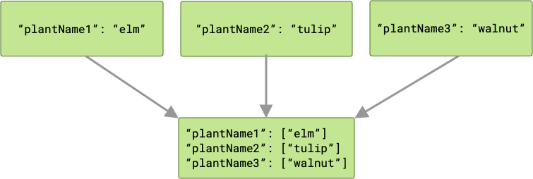

如果存在任何键冲突，那么所有对应的值会分组到一个数组中。

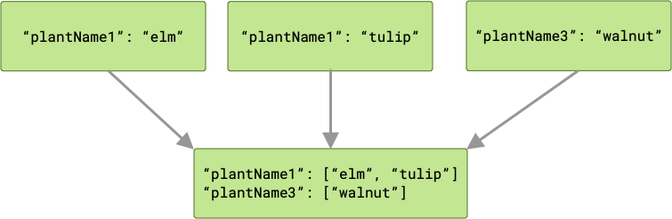

## 链接和工作状态

只要工作成功完成（即，返回 `Result.success()`），`OneTimeWorkRequest` 链便会按顺序执行。运行时，工作请求可能会失败或被取消，这会对依存工作请求产生下游影响。

当第一个 `OneTimeWorkRequest` 被加入工作请求链队列时，所有后续工作请求会被屏蔽，直到第一个工作请求的工作完成为止。

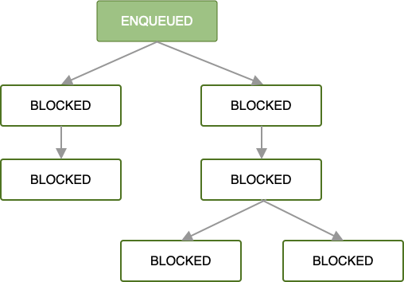

在加入队列且满足所有工作约束后，第一个工作请求开始运行。如果工作在根 `OneTimeWorkRequest` 或 `List<OneTimeWorkRequest>` 中成功完成（即返回 `Result.success()`），系统会将下一组依存工作请求加入队列。

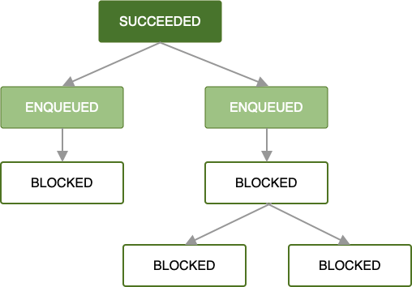

只要每个工作请求都成功完成，工作请求链中的剩余工作请求就会遵循相同的运行模式，直到链中的所有工作都完成为止。这是最简单的用例，通常也是首选用例，但处理错误状态同样重要。

如果在 Worker 处理工作请求时出现错误，可以根据[您定义的退避政策](https://developer.android.google.cn/topic/libraries/architecture/workmanager/how-to/define-work?hl=zh-cn#retries_backoff)来重试该请求。重试请求链中的某个请求意味着，系统将使用提供给该请求的输入数据仅对该请求进行重试。并行运行的所有其他作业均不会受到影响。

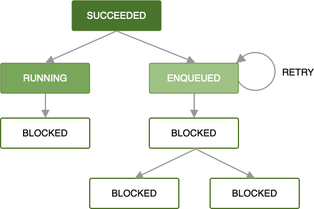

如需详细了解如何定义自定义重试策略，请参阅【WorkManager使用详解-重试和退避政策】一节。

如果该重试政策未定义或已用尽，或者您以其他方式已达到 `OneTimeWorkRequest` 返回 `Result.failure()` 的某种状态，该工作请求和所有依存工作请求都会被标记为 `FAILED.`

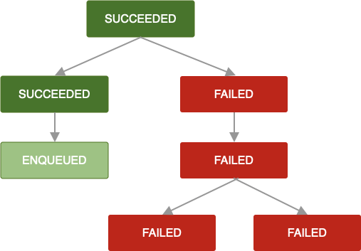

`OneTimeWorkRequest` 被取消时遵循相同的逻辑。任何依存工作请求也会被标记为 `CANCELLED`，并且无法执行其工作。

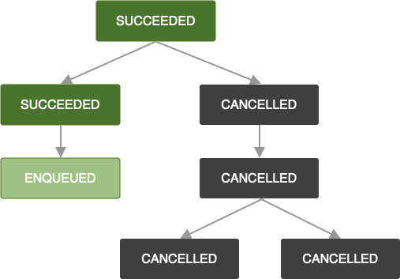

请注意，如果要向已失败或已取消工作请求的链附加更多工作请求，新附加的工作请求也会分别标记为 `FAILED` 或 `CANCELLED`。如果您想扩展现有链的工作，请参阅 [ExistingWorkPolicy](https://developer.android.google.cn/reference/androidx/work/ExistingWorkPolicy?hl=zh-cn) 中的 `APPEND_OR_REPLACE`。

创建工作请求链时，依存工作请求应定义重试政策，以确保始终及时完成工作。失败的工作请求可能会导致链不完整和/或出现意外状态。


# 支持长时间运行的 worker

WorkManager 为长时间运行的 worker 提供内置支持。在这种情况下，WorkManager 可以向操作系统提供一个信号，指示在此项工作执行期间应尽可能让进程保持活跃状态。这些 worker 可以运行超过 10 分钟。这一新功能的示例用例包括批量上传或下载（不可分块）、在本地进行的机器学习模型处理，或者对应用的用户很重要的任务。

在后台，WorkManager 会代表您管理和运行前台服务以执行 [`WorkRequest`](https://developer.android.google.cn/reference/androidx/work/WorkRequest?hl=zh-cn)，同时还会显示可配置的通知。

[`ListenableWorker`](https://developer.android.google.cn/reference/androidx/work/ListenableWorker?hl=zh-cn) 现在支持 [`setForegroundAsync()`](https://developer.android.google.cn/reference/androidx/work/ListenableWorker?hl=zh-cn#setProgressAsync(androidx.work.Data)) API，而 [`CoroutineWorker`](https://developer.android.google.cn/reference/kotlin/androidx/work/CoroutineWorker?hl=zh-cn) 则支持挂起 [`setForeground()`](https://developer.android.google.cn/reference/kotlin/androidx/work/CoroutineWorker?hl=zh-cn#setforeground) API。这些 API 允许开发者指定此 `WorkRequest` 是“重要的”（从用户的角度来看）或“长时间运行的”任务。

从 `2.3.0-alpha03` 开始，WorkManager 还允许您创建 [`PendingIntent`](https://developer.android.google.cn/reference/android/app/PendingIntent?hl=zh-cn)，此 Intent 可用于取消 worker，而不必使用 [`createCancelPendingIntent()`](https://developer.android.google.cn/reference/androidx/work/WorkManager?hl=zh-cn#createCancelPendingIntent(java.util.UUID)) API 注册新的 Android 组件。此方法与 `setForegroundAsync()` 或 `setForeground()` API 一起使用时特别有用，可用于添加一个取消 `Worker` 的通知操作。

## 创建和管理长时间运行的 worker

Kotlin 开发者应使用 [`CoroutineWorker`](https://developer.android.google.cn/reference/kotlin/androidx/work/CoroutineWorker?hl=zh-cn)。您可以不使用 `setForegroundAsync()`，而使用该方法的挂起版本 [`setForeground()`](https://developer.android.google.cn/reference/kotlin/androidx/work/CoroutineWorker?hl=zh-cn#setforeground)。

下面是一个简单的示例，说明了一个下载文件的长时间运行 worker。此 worker 会跟踪进度，以更新持续显示下载进度的 `Notification`。

```kotlin
class DownloadWorker(context: Context, parameters: WorkerParameters) :
   CoroutineWorker(context, parameters) {

   private val notificationManager =
       context.getSystemService(Context.NOTIFICATION_SERVICE) as
               NotificationManager

   override suspend fun doWork(): Result {
       val inputUrl = inputData.getString(KEY_INPUT_URL)
                      ?: return Result.failure()
       val outputFile = inputData.getString(KEY_OUTPUT_FILE_NAME)
                      ?: return Result.failure()
       // Mark the Worker as important
       val progress = "Starting Download"
       setForeground(createForegroundInfo(progress))
       download(inputUrl, outputFile)
       return Result.success()
   }

   private fun download(inputUrl: String, outputFile: String) {
       // Downloads a file and updates bytes read
       // Calls setForeground() periodically when it needs to update
       // the ongoing Notification
   }
   // Creates an instance of ForegroundInfo which can be used to update the
   // ongoing notification.
   private fun createForegroundInfo(progress: String): ForegroundInfo {
       val id = applicationContext.getString(R.string.notification_channel_id)
       val title = applicationContext.getString(R.string.notification_title)
       val cancel = applicationContext.getString(R.string.cancel_download)
       // This PendingIntent can be used to cancel the worker
       val intent = WorkManager.getInstance(applicationContext)
               .createCancelPendingIntent(getId())

       // Create a Notification channel if necessary
       if (Build.VERSION.SDK_INT >= Build.VERSION_CODES.O) {
           createChannel()
       }

       val notification = NotificationCompat.Builder(applicationContext, id)
           .setContentTitle(title)
           .setTicker(title)
           .setContentText(progress)
           .setSmallIcon(R.drawable.ic_work_notification)
           .setOngoing(true)
           // Add the cancel action to the notification which can
           // be used to cancel the worker
           .addAction(android.R.drawable.ic_delete, cancel, intent)
           .build()

       return ForegroundInfo(notificationId, notification)
   }

   @RequiresApi(Build.VERSION_CODES.O)
   private fun createChannel() {
       // Create a Notification channel
   }

   companion object {
       const val KEY_INPUT_URL = "KEY_INPUT_URL"
       const val KEY_OUTPUT_FILE_NAME = "KEY_OUTPUT_FILE_NAME"
   }
}
```

## 将前台服务类型添加到长时间运行的 worker

**注意** ：根据应用的目标 API 级别以及服务所执行的工作类型，可能需要声明前台服务类型。无论您以哪个 Android 版本为目标平台，声明前台服务类型都是最佳做法。如需了解详情，请参阅[前台服务文档](https://developer.android.google.cn/guide/components/foreground-services?hl=zh-cn#types)。

如果应用以 Android 14（API 级别 34）或更高版本为目标平台，必须为所有长时间运行的 worker 指定[前台服务类型](https://developer.android.google.cn/develop/background-work/services/fg-service-types?hl=zh-cn)。如果应用以 Android 10（API 级别 29）或更高版本为目标平台，并且包含需要位置信息访问权限的长时间运行的 worker，请指明该 worker 使用[前台服务类型 `location`](https://developer.android.google.cn/develop/background-work/services/fg-service-types?hl=zh-cn#location)。

如果您的应用以 Android 11（API 级别 30）或更高版本为目标平台，并且包含需要访问摄像头或麦克风的长时间运行的 worker，请分别声明 [`camera`](https://developer.android.google.cn/develop/background-work/services/fg-service-types?hl=zh-cn#camera) 或 [`microphone`](https://developer.android.google.cn/develop/background-work/services/fg-service-types?hl=zh-cn#microphone) 前台服务类型。

如需添加这些前台服务类型，请完成以下各部分中介绍的步骤。

### 在应用清单中声明前台服务类型

在应用的清单中声明 worker 的前台服务类型。在以下示例中，worker 需要位置信息和麦克风访问权限：

AndroidManifest.xml

```xml
<service
   android:name="androidx.work.impl.foreground.SystemForegroundService"
   android:foregroundServiceType="location|microphone"
   tools:node="merge" />
```

**注意** ：[清单合并工具](https://developer.android.google.cn/studio/build/manage-manifests?hl=zh-cn#merge-manifests)将上述代码段中的 `<service>` 元素声明与 WorkManager 的 `SystemForegroundService` 在其自己的清单中定义的声明合并在一起。

### 在运行时指定前台服务类型

调用 `setForeground()` 或 `setForegroundAsync()` 时，请务必指定[前台服务类型](https://developer.android.google.cn/develop/background-work/services/fg-service-types?hl=zh-cn)。

**注意** ：从 Android 14（API 级别 34）开始，当调用 `setForeground()` 或 `setForegroundAsync()` 时，系统会根据服务类型检查是否存在特定的前提条件。如需了解详情，请参阅[前台服务指南](https://developer.android.google.cn/guide/components/foreground-services?hl=zh-cn#fgs-prerequisites)。

MyLocationAndMicrophoneWorker

```kotlin
private fun createForegroundInfo(progress: String): ForegroundInfo {
   // ...
   return ForegroundInfo(NOTIFICATION_ID, notification,
           FOREGROUND_SERVICE_TYPE_LOCATION or
FOREGROUND_SERVICE_TYPE_MICROPHONE) }
```


# 观察 Worker 的中间进度

WorkManager 为设置和观察 Worker 的中间进度添加了一流的支持。如果应用在前台运行时， Worker 保持运行状态，那么也可以使用返回 [`WorkInfo`](https://developer.android.google.cn/reference/androidx/work/WorkInfo?hl=zh-cn) 的 [`LiveData`](https://developer.android.google.cn/reference/androidx/lifecycle/LiveData?hl=zh-cn) 的 API 向用户显示此信息。

[`ListenableWorker`](https://developer.android.google.cn/reference/androidx/work/ListenableWorker?hl=zh-cn) 现在支持 [`setProgressAsync()`](https://developer.android.google.cn/reference/androidx/work/ListenableWorker?hl=zh-cn#setProgressAsync(androidx.work.Data)) API，此类 API 允许保留中间进度。借助这些 API，开发者能够设置可通过界面观察到的中间进度。进度由 [`Data`](https://developer.android.google.cn/reference/androidx/work/Data?hl=zh-cn) 类型表示，这是一个可序列化的属性容器（类似于 [`input` 和 `output`](https://developer.android.google.cn/topic/libraries/architecture/workmanager/advanced?hl=zh-cn#params)，并且受到相同的限制）。

只有在 `ListenableWorker` 运行时才能观察到和更新进度信息。如果尝试在 `ListenableWorker` 完成执行后在其中设置进度，则将会被忽略。还可以使用 [`getWorkInfoBy…()` 或 `getWorkInfoBy…LiveData()`](https://developer.android.google.cn/reference/androidx/work/WorkManager?hl=zh-cn#getWorkInfoById(java.util.UUID)) 方法来观察进度信息。这两个方法会返回 [`WorkInfo`](https://developer.android.google.cn/reference/androidx/work/WorkInfo?hl=zh-cn) 的实例，后者有一个返回 `Data` 的新 [`getProgress()`](https://developer.android.google.cn/reference/androidx/work/WorkInfo?hl=zh-cn#getProgress()) 方法。

## 更新进度

在 Kotlin 中，可以使用 [`CoroutineWorker`](https://developer.android.google.cn/reference/kotlin/androidx/work/CoroutineWorker?hl=zh-cn) 对象的 [`setProgress()`](https://developer.android.google.cn/reference/kotlin/androidx/work/CoroutineWorker?hl=zh-cn#setprogress) 扩展函数来更新进度信息。

> 对于使用 [`ListenableWorker`](https://developer.android.google.cn/reference/androidx/work/ListenableWorker?hl=zh-cn) 或 [`Worker`](https://developer.android.google.cn/reference/androidx/work/Worker?hl=zh-cn) 的 Java 开发者，[`setProgressAsync()`](https://developer.android.google.cn/reference/androidx/work/ListenableWorker?hl=zh-cn#setProgressAsync(androidx.work.Data)) API 会返回 `ListenableFuture<Void>`；更新进度是异步过程，因为更新过程涉及将进度信息存储在数据库中。

此示例展示了一个简单的 `ProgressWorker`。`Worker` 在启动时将进度设置为 0，在完成后将进度值更新为 100。

```kotlin
import android.content.Context
import androidx.work.CoroutineWorker
import androidx.work.Data
import androidx.work.WorkerParameters
import kotlinx.coroutines.delay

class ProgressWorker(context: Context, parameters: WorkerParameters) :
    CoroutineWorker(context, parameters) {

    companion object {
        const val Progress = "Progress"
        private const val delayDuration = 1L
    }

    override suspend fun doWork(): Result {
        val firstUpdate = workDataOf(Progress to 0)
        val lastUpdate = workDataOf(Progress to 100)
        setProgress(firstUpdate)
        delay(delayDuration)
        setProgress(lastUpdate)
        return Result.success()
    }
}
```

## 观察进度

观察进度信息也很简单。可以使用 [`getWorkInfoBy…()` 或 `getWorkInfoBy…LiveData()`](https://developer.android.google.cn/reference/androidx/work/WorkManager?hl=zh-cn#getWorkInfoById(java.util.UUID)) 方法，并引用 [`WorkInfo`](https://developer.android.google.cn/reference/androidx/work/WorkInfo?hl=zh-cn)。

以下是使用 `getWorkInfoByIdLiveData` API 的示例。

```kotlin
WorkManager.getInstance(applicationContext)
    // requestId is the WorkRequest id
    .getWorkInfoByIdLiveData(requestId)
    .observe(observer, Observer { workInfo: WorkInfo? ->
            if (workInfo != null) {
                val progress = workInfo.progress
                val value = progress.getInt(Progress, 0)
                // Do something with progress information
            }
    })
```


# 更新已加入队列的工作

在 [`WorkRequest`](https://developer.android.google.cn/reference/androidx/work/WorkRequest?hl=zh-cn) 加入队列后可以通过[`updateWork()`](https://developer.android.google.cn/reference/androidx/work/WorkManager?hl=zh-cn#updateWork(androidx.work.WorkRequest)) 进行更新，以即时的更改 `WorkRequest` 的某些方面，而不需要手动取消并将新的加入队列。

对于频繁更改限制条件或需要实时更新 worker 的大型应用，通常会用到。

## 避免取消工作

通常，应避免取消现有 WorkRequest 并将新的 WorkRequest 加入队列。这样做可能会导致应用重复某些任务，并且可能需要编写大量额外的代码。

请考虑以下示例，了解取消 WorkRequest 可能导致问题的原因：

- **后端请求**：如果在 [`Worker`](https://developer.android.google.cn/reference/androidx/work/Worker?hl=zh-cn) 计算要发送到服务器的载荷时取消它，新的 `Worker` 需要重新开始并重新计算费用可能较高的载荷。
- **调度**：如果取消 [`PeriodicWorkRequest`](https://developer.android.google.cn/reference/androidx/work/PeriodicWorkRequest?hl=zh-cn) 并希望新的 `PeriodicWorkRequest` 按相同的时间表执行，则需要计算时间偏移，以确保新的执行时间与上一个工作请求保持一致。

借助 `updateWork()` API，可以更新工作请求的约束条件和其他参数，而无需取消新请求并将其加入队列。

### 何时取消工作

在某些情况下，应直接取消 `WorkRequest`，而不是调用 `updateWork()`。比如，想更改已加入队列的工作的基本性质时。

**注意** ：无法使用 `updateWork()` 更改 `WorkRequest` 中的 `Worker` 类型。例如，如果已将 `OneTimeWorkRequest` 加入队列，并且希望它定期运行，则必须取消该请求并安排新的 `PeriodicWorkRequest`。

### 何时更新 work

假设有一款照片应用，它每天都会对用户照片进行备份。为此，它已将 `PeriodicWorkRequest` 加入队列。`WorkRequest` 具有约束条件，要求设备需要充电并连接到 WLAN。

不过，用户每天仅使用快速充电器为设备充电 20 分钟。在这种情况下，应用可能需要更新 `WorkRequest` 以放宽充电约束条件，这样一来，即使设备未充满电，应用也可以上传照片。

在这种情况下，可以使用 `updateWork()` 方法来更新工作请求的约束条件。

## 如何更新 work

`updateWork()` 方法提供了一种更新现有的 `WorkRequest` 的简单方法，而不必取消并加入新的 work 到队列。

如需使用“更新已加入队列的工作”，请按以下步骤操作：

1. **获取已加入队列的工作的现有 ID**：获取要更新的 WorkRequest 的 ID。如需检索此 ID，可以使用任何 [`getWorkInfo`](https://developer.android.google.cn/reference/androidx/work/WorkManager?hl=zh-cn#getWorkInfosByTag(java.lang.String)) API，也可以手动保留初始 WorkRequest 中的 ID 以供日后使用公共属性 [`WorkRequest.id`](https://developer.android.google.cn/reference/androidx/work/WorkRequest?hl=zh-cn#id()) 检索，然后再将其加入队列。
2. **创建新的 WorkRequest**：创建一个新的 `WorkRequest`，并使用 `WorkRequest.Builder.setID()` 将其 ID 设置为与现有 `WorkRequest` 的 ID 匹配。
3. **设置约束条件**：使用 `WorkRequest.Builder.setConstraints()` 传递 WorkManager 新的约束条件。
4. **调用 updateWork**：将新的 WorkRequest 传递给 `updateWork()`。

### 更新工作示例

以下示例，演示了如何使用 `updateWork()` 方法更改用于上传照片的 `WorkRequest` 的电池电量限制：

```Kotlin
suspend fun updatePhotoUploadWork() {
    // Get instance of WorkManager.
    val workManager = WorkManager.getInstance(context)

    // Retrieve the work request ID. In this example, the work being updated is unique
    // work so we can retrieve the ID using the unique work name.
    val photoUploadWorkInfoList = workManager.getWorkInfosForUniqueWork(
        PHOTO_UPLOAD_WORK_NAME
    ).await()

    val existingWorkRequestId = photoUploadWorkInfoList.firstOrNull()?.id ?: return

    // Update the constraints of the WorkRequest to not require a charging device.
    val newConstraints = Constraints.Builder()
        // Add other constraints as required here.
        .setRequiresCharging(false)
        .build()

    // Create new WorkRequest from existing Worker, new constraints, and the id of the old WorkRequest.
    val updatedWorkRequest: WorkRequest =
        OneTimeWorkRequestBuilder<MyWorker>()
            .setConstraints(newConstraints)
            .setId(existingWorkRequestId)
            .build()

    // Pass the new WorkRequest to updateWork().
    workManager.updateWork(updatedWorkRequest)
}
```

### 处理结果

`updateWork()` 会返回 `ListenableFuture<UpdateResult>`。给定的 `UpdateResult` 可以是多个值中的一个，用于说明 WorkManager 能否应用您的更改。它还会指明能够应用更改的时间。

如需了解详情，请参阅 [`updateWork()`](https://developer.android.google.cn/reference/androidx/work/WorkManager.UpdateResult?hl=zh-cn) [和](https://developer.android.google.cn/reference/androidx/work/WorkManager.UpdateResult?hl=zh-cn) [`UpdateResult`](https://developer.android.google.cn/reference/androidx/work/WorkManager.UpdateResult?hl=zh-cn) [参考文档](https://developer.android.google.cn/reference/androidx/work/WorkManager.UpdateResult?hl=zh-cn)。

## 用 generations 追踪工作

每次更新 `WorkRequest` 时，其 *generation* 都会增加 1。这样，就可以准确跟踪当前已加入队列的 `WorkRequest`。在观察、跟踪和测试工作请求时，Generations 可以提供更多的控制。

如需获取 `WorkRequest` 的 generation，请按以下步骤操作：

1. WorkInfo：调用 WorkManager.getWorkInfoById() 以检索与 WorkRequest 对应的 WorkInfo 实例。

   - 您可以调用会返回 `WorkInfo` 的多种方法之一。如需了解详情，请参阅 [WorkManager 参考文档](https://developer.android.google.cn/reference/androidx/work/WorkManager?hl=zh-cn#getWorkInfoById(java.util.UUID))。

2. getGeneration：对 WorkInfo 实例调用 `getGeneration()`。返回的 Int 对应于 WorkRequest 

   的 generation。

   - 请注意，这里没有生成字段或属性，只有 `WorkInfo.getGeneration()` 方法。

示例：检索 `WorkRequest` 的 generation。

```Kotlin
// Get instance of WorkManager.
val workManager = WorkManager.getInstance(context)

// Retrieve WorkInfo instance.
val workInfo = workManager.getWorkInfoById(oldWorkRequestId)

// Call getGeneration to retrieve the generation.
val generation = workInfo.getGeneration()
```

**注意**： `updateWork()` 返回的 `UpdateResult` 不包含 `WorkRequest` 的 generation。

## 工作更新政策

以前，推荐使用 [`ExistingPeriodicWorkPolicy.REPLACE`](https://developer.android.google.cn/reference/androidx/work/ExistingPeriodicWorkPolicy?hl=zh-cn#REPLACE) 政策将 `PeriodicWorkRequest` 加入队列来更新定期工作。如果存在具有相同唯一 `id` 的待处理 `PeriodicWorkRequest`，则新的工作请求将取消并删除它。此政策现已*弃用*，取而代之的是使用 [`ExistingPeriodicWorkPolicy.UPDATE`](https://developer.android.google.cn/reference/androidx/work/ExistingPeriodicWorkPolicy?hl=zh-cn#UPDATE) 的工作流。

例如，将 [`enqueueUniquePeriodicWork`](https://developer.android.google.cn/reference/androidx/work/WorkManager?hl=zh-cn#enqueueUniquePeriodicWork(java.lang.String,androidx.work.ExistingPeriodicWorkPolicy,androidx.work.PeriodicWorkRequest)) 与 `PeriodicWorkRequest` 搭配使用时，您可以使用 `ExistingPeriodicWorkPolicy.UPDATE` 政策初始化新的 `PeriodicWorkRequest`。如果存在具有相同唯一名称的待处理 `PeriodicWorkRequest`，WorkManager 会将其更新为新规范。按照此工作流操作后，无需使用 `updateWork()`。

**注意** ：`OneTimeWorkRequest` 没有类似的更新政策。这是因为可以将 [`enqueueUniqueWork`](https://developer.android.google.cn/reference/androidx/work/WorkManager?hl=zh-cn#enqueueUniqueWork(java.lang.String,androidx.work.ExistingWorkPolicy,androidx.work.OneTimeWorkRequest)) 方法与 [`APPEND`](https://developer.android.google.cn/reference/androidx/work/ExistingWorkPolicy?hl=zh-cn#APPEND) 或 [`APPEND_OR_REPLACE`](https://developer.android.google.cn/reference/androidx/work/ExistingWorkPolicy?hl=zh-cn#APPEND_OR_REPLACE) 政策搭配使用。这样做会创建一个同名的 worker 链。因此，WorkManager 无法为其有效地支持 `UPDATE` 政策，因为无法确定应该更新链中的哪些 worker。


# WorkManager 中的线程处理

前面提到 WorkManager 可以在后台异步执行工作，这可以满足大多数应用的需求。关于更高级的用例（例如正确处理正在停止的工作），还需了解 WorkManager 中的线程处理和并发机制。

WorkManager 提供了四种不同类型的工作基元：

- [`Worker`](https://developer.android.google.cn/reference/androidx/work/Worker?hl=zh-cn) 是最简单的实现。WorkManager 会在后台线程中自动运行该 Worker。
- [`CoroutineWorker`](https://developer.android.google.cn/reference/kotlin/androidx/work/CoroutineWorker?hl=zh-cn) 是为 Kotlin 用户建议的实现。`CoroutineWorker` 实例公开了后台工作的一个挂起函数。默认情况下，这些实例运行默认的 `Dispatcher`，但您可以进行自定义。请参阅 [CoroutineWorker 中的线程处理](https://developer.android.google.cn/topic/libraries/architecture/workmanager/advanced/coroutineworker?hl=zh-cn)，详细了解 `CoroutineWorker` 实例中的线程处理。
- [`RxWorker`](https://developer.android.google.cn/reference/androidx/work/RxWorker?hl=zh-cn) 是为 RxJava 用户建议的实现。如果有很多现有异步代码是用 RxJava 写的，则应使用 RxWorker。与所有 RxJava 概念一样，您可以自由选择所需的线程处理策略。请参阅 [RxWorker 中的线程处理](https://developer.android.google.cn/topic/libraries/architecture/workmanager/advanced/rxworker?hl=zh-cn)，详细了解 `RxWorker` 实例中的线程处理。
- [`ListenableWorker`](https://developer.android.google.cn/reference/androidx/work/ListenableWorker?hl=zh-cn) 是 `Worker`、`CoroutineWorker` 和 `RxWorker` 的基类。这个类专为需要与基于回调的异步 API（例如 `FusedLocationProviderClient`）进行交互并且不使用 RxJava 的 Java 开发者而设计。请参阅 [ListenableWorker 中的线程处理](https://developer.android.google.cn/topic/libraries/architecture/workmanager/advanced/listenableworker?hl=zh-cn)，详细了解 `ListenableWorker` 实例中的线程处理。

## 在 Worker 中进行线程处理

当使用 [`Worker`](https://developer.android.google.cn/reference/androidx/work/Worker?hl=zh-cn) 时，WorkManager 会自动在后台线程中调用 [`Worker.doWork()`](https://developer.android.google.cn/reference/androidx/work/Worker?hl=zh-cn#doWork())。该后台线程来自于 WorkManager 的 [`Configuration`](https://developer.android.google.cn/reference/androidx/work/Configuration?hl=zh-cn) 中指定的 `Executor`。默认情况下，WorkManager 会设置 `Executor`，但也可以自定义。例如，可以在应用中共享现有的后台 Executor，也可以创建单线程 `Executor` 以确保所有后台工作都按顺序执行，甚至可以指定一个自定义 `Executor`。如需自定义 `Executor`，请确保手动初始化 WorkManager。

在手动配置 WorkManager 时，可以按以下方式指定 `Executor`：

```kotlin
WorkManager.initialize(
    context,
    Configuration.Builder()
         // Uses a fixed thread pool of size 8 threads.
        .setExecutor(Executors.newFixedThreadPool(8))
        .build())
```

下面是一个简单的 `Worker` 示例，其会下载网页内容 100 次：

```kotlin
class DownloadWorker(context: Context, params: WorkerParameters) : Worker(context, params) {

    override fun doWork(): ListenableWorker.Result {
        repeat(100) {
            try {
                downloadSynchronously("https://www.google.com")
            } catch (e: IOException) {
                return ListenableWorker.Result.failure()
            }
        }

        return ListenableWorker.Result.success()
    }
}
```

请注意，[`Worker.doWork()`](https://developer.android.google.cn/reference/androidx/work/Worker?hl=zh-cn#doWork()) 是同步调用 - 您应以阻塞方式完成整个后台工作，并在方法退出时完成工作。如果您在 `doWork()` 中调用异步 API 并返回 [`Result`](https://developer.android.google.cn/reference/androidx/work/ListenableWorker.Result?hl=zh-cn)，那么回调可能无法正常运行。如果您遇到这种情况，请考虑使用 [`ListenableWorker`](https://developer.android.google.cn/reference/androidx/work/ListenableWorker?hl=zh-cn)（请参阅[在 ListenableWorker 中进行线程处理](https://developer.android.google.cn/topic/libraries/architecture/workmanager/advanced/listenableworker?hl=zh-cn)）。

如果当前正在运行的 `Worker` [因任何原因而停止](https://developer.android.google.cn/topic/libraries/architecture/workmanager/how-to/managing-work?hl=zh-cn#cancelling)，它就会收到对 [`Worker.onStopped()`](https://developer.android.google.cn/reference/androidx/work/ListenableWorker?hl=zh-cn#onStopped()) 的调用。在必要的情况下，只需重写此方法或调用 [`Worker.isStopped()`](https://developer.android.google.cn/reference/androidx/work/ListenableWorker?hl=zh-cn#isStopped())，即可对代码进行检查处理并释放资源。当上述示例中的 `Worker` 被停止时，内容的下载可能才完成了一半；但即使该 Worker 被停止，下载也会继续。如需优化此行为，您可以执行以下操作：

```kotlin
class DownloadWorker(context: Context, params: WorkerParameters) : Worker(context, params) {

    override fun doWork(): ListenableWorker.Result {
        repeat(100) {
            if (isStopped) {
                break
            }

            try {
                downloadSynchronously("https://www.google.com")
            } catch (e: IOException) {
                return ListenableWorker.Result.failure()
            }

        }

        return ListenableWorker.Result.success()
    }
}
```

`Worker` 停止后，从 `Worker.doWork()` 返回什么已不重要；`Result` 将被忽略。

## CoroutineWorker 中的线程处理

提供了对协程的支持。如要开始使用，先将 [`work-runtime-ktx` 包含到您的 gradle 文件中](https://developer.android.google.cn/jetpack/androidx/releases/work?hl=zh-cn#declaring_dependencies)。不要继承 [`Worker`](https://developer.android.google.cn/reference/androidx/work/Worker?hl=zh-cn)，而应继承 [`CoroutineWorker`](https://developer.android.google.cn/reference/kotlin/androidx/work/CoroutineWorker?hl=zh-cn)，后者包含 `doWork()` 的挂起版本。

例如，如果要构建简单的 `CoroutineWorker` 来执行某些网络操作，需要执行以下操作：

```kotlin
class CoroutineDownloadWorker(
    context: Context,
    params: WorkerParameters
) : CoroutineWorker(context, params) {

    override suspend fun doWork(): Result {
        val data = downloadSynchronously("https://www.google.com")
        saveData(data)
        return Result.success()
    }
}
```

请注意，[`CoroutineWorker.doWork()`](https://developer.android.google.cn/reference/kotlin/androidx/work/CoroutineWorker?hl=zh-cn#doWork()) 是一个“挂起”函数。此代码不同于 `Worker`，不会在 [`Configuration`](https://developer.android.google.cn/reference/androidx/work/Configuration?hl=zh-cn) 中指定的 `Executor` 中运行，而是默认为 `Dispatchers.Default`。可以提供 `CoroutineContext` 来自定义。

在上面的示例中，如果想在 `Dispatchers.IO` 上完成此操作，如下所示：

```kotlin
class CoroutineDownloadWorker(
    context: Context,
    params: WorkerParameters
) : CoroutineWorker(context, params) {

    override suspend fun doWork(): Result {
        withContext(Dispatchers.IO) {
            val data = downloadSynchronously("https://www.google.com")
            saveData(data)
            return Result.success()
        }
    }
}
```

`CoroutineWorker` 通过取消协程并传播取消信号来自动处理停工情况。无需执行任何特殊操作来处理[停工情况](https://developer.android.google.cn/topic/libraries/architecture/workmanager/how-to/managing-work?hl=zh-cn#cancelling)。

### 在其他进程中运行 CoroutineWorker

可以使用 [`RemoteCoroutineWorker`](https://developer.android.google.cn/reference/kotlin/androidx/work/multiprocess/RemoteCoroutineWorker?hl=zh-cn)（`ListenableWorker` 的实现）将 Worker 绑定到特定进程。

`RemoteCoroutineWorker` 会使用在构建 WorkRequest 时的 input data 中提供的两个额外参数绑定到特定进程：`ARGUMENT_CLASS_NAME` 和 `ARGUMENT_PACKAGE_NAME`。

以下示例演示了如何构建绑定到特定进程的工作请求：

```kotlin
val PACKAGE_NAME = "com.example.background.multiprocess"

val serviceName = RemoteWorkerService::class.java.name
val componentName = ComponentName(PACKAGE_NAME, serviceName)

val data: Data = Data.Builder()
   .putString(ARGUMENT_PACKAGE_NAME, componentName.packageName)
   .putString(ARGUMENT_CLASS_NAME, componentName.className)
   .build()

return OneTimeWorkRequest.Builder(ExampleRemoteCoroutineWorker::class.java)
   .setInputData(data)
   .build()
```

对于每个 `RemoteWorkerService`，还需要在 `AndroidManifest.xml` 文件中添加服务定义：

```xml
<manifest ... >
    <service
            android:name="androidx.work.multiprocess.RemoteWorkerService"
            android:exported="false"
            android:process=":worker1" />

        <service
            android:name=".RemoteWorkerService2"
            android:exported="false"
            android:process=":worker2" />
    ...
</manifest>
```

##### 示例

- [WorkManagerMultiProcessSample](https://github.com/android/architecture-components-samples/tree/main/WorkManagerMultiprocessSample)


## RxWorker 中的线程处理

首先需要在 gradle 添加依赖 [`work-runtime` 之外，还应包含 `work-rxjava3` 依赖项](https://developer.android.google.cn/jetpack/androidx/releases/work?hl=zh-cn#declaring_dependencies)。或者根据情况使用支持 rxjava2 的 `work-rxjava2` 依赖项。

然后，应该继承 `RxWorker`，而不是继承 `Worker`。最后替换 [`RxWorker.createWork()`](https://developer.android.google.cn/reference/androidx/work/RxWorker?hl=zh-cn#createWork()) 方法以返回 `Single<Result>`，用于表示代码执行结果的 [`Result`](https://developer.android.google.cn/reference/androidx/work/ListenableWorker.Result?hl=zh-cn)，如下所示：

```kotlin
class RxDownloadWorker(
        context: Context,
        params: WorkerParameters
) : RxWorker(context, params) {
    override fun createWork(): Single<Result> {
        return Observable.range(0, 100)
                .flatMap { download("https://www.example.com") }
                .toList()
                .map { Result.success() }
    }
}
```

请注意，`RxWorker.createWork()` 在主线程上调用，但默认情况下会在后台线程上订阅返回值。可以重写 [`RxWorker.getBackgroundScheduler()`](https://developer.android.google.cn/reference/androidx/work/RxWorker?hl=zh-cn#getBackgroundScheduler()) 来更改订阅线程。

当 `RxWorker` 调用 `onStopped()` 时，系统会处理订阅，因此无需以任何特殊方式处理[停工情况](https://developer.android.google.cn/topic/libraries/architecture/workmanager/how-to/managing-work?hl=zh-cn#cancelling)。


## ListenableWorker 中的线程处理

在某些情况下，如果需要提供自定义线程处理策略。例如，您可能需要处理基于回调的异步操作。 WorkManager 通过 [`ListenableWorker`](https://developer.android.google.cn/reference/androidx/work/ListenableWorker?hl=zh-cn) 支持此用例。`ListenableWorker` 是最基本的 Worker  API；[`Worker`](https://developer.android.google.cn/reference/androidx/work/Worker?hl=zh-cn)、[`CoroutineWorker`](https://developer.android.google.cn/reference/kotlin/androidx/work/CoroutineWorker?hl=zh-cn) 和 [`RxWorker`](https://developer.android.google.cn/reference/androidx/work/RxWorker?hl=zh-cn) 均派生自此类。`ListenableWorker` 只会发出信号来表明应该开始和停止工作，而线程处理则完全由您来完成。启动工作信号在主线程上调用，因此请务必手动转到您选择的后台线程。

抽象方法 [`ListenableWorker.startWork()`](https://developer.android.google.cn/reference/androidx/work/ListenableWorker?hl=zh-cn#startWork()) 会返回 [`Result`](https://developer.android.google.cn/reference/androidx/work/ListenableWorker.Result?hl=zh-cn) 的 `ListenableFuture`。`ListenableFuture` 是一个轻量级接口：它是一个 `Future`，用于提供附加监听器和传播异常的功能。在 `startWork` 方法中，应返回 `ListenableFuture`，在操作完成后，需要使用操作的 `Result` 对其进行设置。可以通过以下两种方式之一创建 `ListenableFuture` 实例：

1. 如果您使用的是 Guava，请使用 `ListeningExecutorService`。
2. 否则，请将 [`councurrent-futures`](https://developer.android.google.cn/jetpack/androidx/releases/concurrent?hl=zh-cn#declaring_dependencies) 包含在 Gradle 文件中并使用 [`CallbackToFutureAdapter`](https://developer.android.google.cn/reference/androidx/concurrent/futures/CallbackToFutureAdapter?hl=zh-cn)。

如果您想基于异步回调执行某些工作，可以采用如下方式：

```kotlin
class CallbackWorker(
        context: Context,
        params: WorkerParameters
) : ListenableWorker(context, params) {
    override fun startWork(): ListenableFuture<Result> {
        return CallbackToFutureAdapter.getFuture { completer ->
            val callback = object : Callback {
                var successes = 0

                override fun onFailure(call: Call, e: IOException) {
                    completer.setException(e)
                }

                override fun onResponse(call: Call, response: Response) {
                    successes++
                    if (successes == 100) {
                        completer.set(Result.success())
                    }
                }
            }

            repeat(100) {
                downloadAsynchronously("https://example.com", callback)
            }

            callback
        }
    }
}
```

如果您的工作[停止](https://developer.android.google.cn/topic/libraries/architecture/workmanager/how-to/managing-work?hl=zh-cn#cancelling)，会发生什么情况？ 如果预计工作将停止，系统总是会取消 `ListenableWorker` 的 `ListenableFuture`。使用 `CallbackToFutureAdapter` 时，您只需添加取消监听器，如下所示：

```kotlin
class CallbackWorker(
        context: Context,
        params: WorkerParameters
) : ListenableWorker(context, params) {
    override fun startWork(): ListenableFuture<Result> {
        return CallbackToFutureAdapter.getFuture { completer ->
            val callback = object : Callback {
                var successes = 0

                override fun onFailure(call: Call, e: IOException) {
                    completer.setException(e)
                }

                override fun onResponse(call: Call, response: Response) {
                    ++successes
                    if (successes == 100) {
                        completer.set(Result.success())
                    }
                }
            }

 completer.addCancellationListener(cancelDownloadsRunnable, executor)

            repeat(100) {
                downloadAsynchronously("https://example.com", callback)
            }

            callback
        }
    }
}
```

### 在其他进程中运行 ListenableWorker

您还可以使用 [`RemoteListenableWorker`](https://developer.android.google.cn/reference/kotlin/androidx/work/multiprocess/RemoteListenableWorker?hl=zh-cn)（`ListenableWorker` 的实现）将 Worker 绑定到特定进程。

`RemoteListenableWorker` 会使用您在构建工作请求时于输入数据中提供的两个额外参数绑定到特定进程：`ARGUMENT_CLASS_NAME` 和 `ARGUMENT_PACKAGE_NAME`。

以下示例演示了如何构建绑定到特定进程的工作请求：

```kotlin
val PACKAGE_NAME = "com.example.background.multiprocess"

val serviceName = RemoteWorkerService::class.java.name
val componentName = ComponentName(PACKAGE_NAME, serviceName)

val data: Data = Data.Builder()
   .putString(ARGUMENT_PACKAGE_NAME, componentName.packageName)
   .putString(ARGUMENT_CLASS_NAME, componentName.className)
   .build()

return OneTimeWorkRequest.Builder(ExampleRemoteListenableWorker::class.java)
   .setInputData(data)
   .build()
```

对于每个 `RemoteWorkerService`，您还需要在 `AndroidManifest.xml` 文件中添加服务定义：

```xml
<manifest ... >
    <service
            android:name="androidx.work.multiprocess.RemoteWorkerService"
            android:exported="false"
            android:process=":worker1" />

        <service
            android:name=".RemoteWorkerService2"
            android:exported="false"
            android:process=":worker2" />
    ...
</manifest>
```

#### 示例

- [WorkManagerMultiProcessSample](https://github.com/android/architecture-components-samples/tree/main/WorkManagerMultiprocessSample)


# 自定义 WorkManager 配置和初始化

默认情况下，当应用启动时，WorkManager 使用适合大多数应用的合理选项自动进行配置。如果需要进一步控制 WorkManager 管理和调度工作的方式，可以通过自行初始化 WorkManager 来自定义 WorkManager 配置。

## 按需初始化

通过按需初始化，可以仅在需要 WorkManager 时创建该组件，而不必每次应用启动时都创建。这样做可将 WorkManager 从关键启动路径中移出，从而提高应用启动性能。如需使用按需初始化，请执行以下操作：

### 移除默认初始化程序

如需提供自己的配置，必须先移除默认初始化程序（`androidx.startup节点`）。在 [`AndroidManifest.xml`](https://developer.android.google.cn/guide/topics/manifest/manifest-intro?hl=zh-cn) 中使用合并规则 `tools:node="remove"`。

如果不想在应用中使用应用启动功能，则可以将其彻底移除。

```xml
 <!-- If you want to disable android.startup completely. -->
 <provider
    android:name="androidx.startup.InitializationProvider"
    android:authorities="${applicationId}.androidx-startup"
    tools:node="remove">
 </provider>
```

否则，仅移除 `WorkManagerInitializer` 节点即可。

```xml
 <provider
    android:name="androidx.startup.InitializationProvider"
    android:authorities="${applicationId}.androidx-startup"
    android:exported="false"
    tools:node="merge">
    <!-- If you are using androidx.startup to initialize other components -->
    <meta-data
        android:name="androidx.work.WorkManagerInitializer"
        android:value="androidx.startup"
        tools:node="remove" />
 </provider>
```

如需详细了解如何在清单中使用合并规则，请参阅有关[合并多个清单文件](https://developer.android.google.cn/studio/build/manage-manifests?hl=zh-cn#merge-manifests)的文档。

### 实现 Configuration.Provider

在 `Application` 类实现 [`Configuration.Provider`](https://developer.android.google.cn/reference/androidx/work/Configuration.Provider?hl=zh-cn) 接口，并提供 [`Configuration.Provider.getWorkManagerConfiguration`](https://developer.android.google.cn/reference/androidx/work/Configuration.Provider?hl=zh-cn#getWorkManagerConfiguration()) 实现。当需要使用 WorkManager 时，请务必调用 [`WorkManager.getInstance(Context)`](https://developer.android.google.cn/reference/androidx/work/WorkManager?hl=zh-cn#getInstance(android.content.Context)) 方法。WorkManager 会调用应用的自定义 `getWorkManagerConfiguration()` 方法来发现其 `Configuration`。（您无需自行调用 `WorkManager.initialize`。）

**注意**：如果您在初始化 WorkManager 之前调用已弃用的无参数 `WorkManager.getInstance()` 方法，该方法将抛出异常。即使您不自定义 WorkManager，也应始终使用 `WorkManager.getInstance(Context)` 方法。

以下示例展示了自定义 `getWorkManagerConfiguration()` 实现：

```kotlin
class MyApplication() : Application(), Configuration.Provider {
     override fun getWorkManagerConfiguration() =
           Configuration.Builder()
                .setMinimumLoggingLevel(android.util.Log.INFO)
                .build()
}
```

**注意** ：先必须[移除默认初始化程序](https://developer.android.google.cn/topic/libraries/architecture/workmanager/advanced/custom-configuration?hl=zh-cn#remove-default)，自定义的 `getWorkManagerConfiguration()` 实现才能生效。


# 最佳实践

介绍一些关于设置行为良好的后台任务的最佳实践。旨在减少电池消耗，但也可以通过其他方式提高设备性能，例如减少网络使用。

## 选择最佳约束条件并组合任务

为了尽可能减少任务在设备上造成的负载，请务必[指定最佳约束条件](https://developer.android.google.cn/develop/background-work/background-tasks/persistent/getting-started/define-work?hl=zh-cn#work-constraints)。举个例子，如果您想确保应用不会耗尽电量，最好指定 `RequiresCharging` 约束条件。此约束条件告知系统，除非电池电量实际增加，否则不要运行作业。同样，使用 Wi-Fi 所需的功耗通常低于移动流量，因此，如果您的任务需要网络连接，但可以等到不按流量计费的网络可用时，最好设置 [`NetworkType.UNMETERED`](https://developer.android.google.cn/reference/androidx/work/NetworkType?hl=zh-cn#UNMETERED) 限制条件。

此外，如果有多个可能处于同一约束条件的类似任务，通常最好将它们组合到单个任务中，以便设备仅被唤醒一次。例如，假设您的应用有三个不同的数据集需要与云端存储空间同步。与安排三个不同的任务（每个数据集对应一个任务）不同，通常最好只安排单个“同步数据”任务，定义适当的约束，然后让该任务在运行时完成所有待处理的数据同步。

也就是说，您不应该尝试将不相关的任务组合为一项综合性任务。只需确保为每个任务提供适当的约束条件即可。例如，如果任务优先级较低，请务必指定任务应在设备空闲和充电时运行。这样，即使多次唤醒设备，也不会破坏用户体验或影响电池续航时间。

## 仅当任务具有时效性时，才将其标记为加急任务

如果任务特别紧急，可以[将其标记为加急](https://developer.android.google.cn/develop/background-work/background-tasks/persistent/getting-started/define-work?hl=zh-cn#expedited)。这样做可以通过多种方式确定任务的优先级。例如，系统会尽可能立即运行这些任务，并且电源管理限制不太可能影响加急任务。

出于这些原因，应该谨慎地*仅*在需要时将任务标记为加急任务。由于加急任务可能会覆盖某些系统效率，因此加急任务可能会比未标记时消耗的电量更多。

只有当任务具有时效性时，才应标记为加急任务；如果执行任务需要更长时间，用户体验将会受到影响。例如，如果您的应用运行任务来处理高优先级 FCM 消息，则最好将该任务标记为加急任务。但是，您不应仅仅为了替换系统优化而将任务标记为加急。

## 查看您的任务停止的原因

如果任务在完成前停止，可以通过调用 [`WorkInfo.getStopReason()`](https://developer.android.google.cn/reference/androidx/work/WorkInfo?hl=zh-cn#getStopReason()) 检查任务停止的原因。这么做之所以重要，原因有很多。首先，你肯定希望完成任务。找出任务停止的原因有助于避免类似情况。此外，系统可能会因过度使用系统资源的行为而停止任务。您一定不想让自己的应用成为坏人，在不必要的情况下耗用电池或网络。

例如，如果您的任务经常因 [`STOP_REASON_TIMEOUT`](https://developer.android.google.cn/reference/androidx/work/WorkInfo?hl=zh-cn#STOP_REASON_TIMEOUT()) 原因而停止，则可能存在极端情况，有时会导致任务花费的时间比预期长得多。

建议使用分析引擎来跟踪应用的任务是否已停止以及停止原因。

**重要提示**： 在 Android 14 或更高版本中，如果应用的任务超时太频繁，系统可以[将应用放入“受限的待机”分桶](https://developer.android.google.cn/about/versions/14/behavior-changes-all?hl=zh-cn#triggers-to-restricted-bucket)。

> 参考：[优化任务调度 API 的电池用量](https://developer.android.google.cn/develop/background-work/background-tasks/optimize-battery?hl=zh-cn)


# WorkManager 如何管理后台工作

WorkManager内部会根据设备的API级别自动选择底层作业的调度服务。下面上一张官方图，图中清晰说明了WorkManager在各个版本的API时选择的调度服务.目前最低可支持API 14


## 和直接在应用中使用线程的区别

首先WorkManager的作用并不是取代线程在Android中的工作。 [Google在官方的文档专门为后台任务做出了定义](https://link.juejin.cn?target=https%3A%2F%2Fdeveloper.android.com%2Fguide%2Fbackground%23ThreadPool)

Google 将后台任务具体分为了四种`Immediate Tasks`, `Exact Task`, `Expedited Task`, `Deferred Task`


### Immediate Task

当任务需要在用户操作APP时就完成，则可归类为Imeediate Task。推荐在APP中使用Kotlin协程或Java的线程来执行任务

### Exact Task

当任务需要在精确的时间运行时,则可归类为Exact Task。推荐使用 AlarmManager

### Expedited Task & Deferred Task

除以上情景之外, 如果任务需要尽可能快开始时,则可归类为Expedited Task, 如果不需要则归类为Deferred Task. 推荐使用WorkManager

使用`setExpedited()`来申明Worker为加急任务。对应上面的Expedited Task. 需要同时重写Worker中的`getForegroundInfoAsync`方法

```kotlin
OneTimeWorkRequestBuilder<T>().apply {
    setInputData(inputData)
    setExpedited(OutOfQuotaPolicy.RUN_AS_NON_EXPEDITED_WORK_REQUEST)
}.build()
```


# 完整示例

下面是一个。。。例子。


## 创建Worker模拟任务执行

```kotlin
class DownloadWorker : CoroutineWorker {

    private lateinit var mNotificationBuilder: NotificationCompat.Builder

    constructor(appContext: Context, params: WorkerParameters) : super(appContext, params)

    //Worker执行任务
    override suspend fun doWork(): Result {
        val data = fakeDownload()
        showSuccessNotification()
        val outData = Data.Builder().putString(OUTPUT_KEY, data).build()
        return Result.success(outData)
    }

    //创建ForegroundInfo Worker将会作为前台服务运行
    override suspend fun getForegroundInfo(): ForegroundInfo {
        val context = applicationContext
        return ForegroundInfo(
            START_DOWNLOAD_NOTIFICATION_ID,
            createNotification(context) {
                setContentTitle("Start Download")
                setSmallIcon(R.drawable.ic_launcher_foreground)
                setContentText("Start Download ${inputData.getString(INPUT_KEY)}")
                priority = NotificationCompat.PRIORITY_DEFAULT
                val cancel = WorkManager.getInstance(context).createCancelPendingIntent(id)
                //设置cancelWork按钮
                addAction(R.drawable.icon_cancel, "Cancel", cancel)
                mNotificationBuilder = this
            }
        )
    }

    private suspend fun fakeDownload(): String {
        Log.i(TAG, "Thread:${Thread.currentThread().name}")
        for (i in 0..100) {
            delay(100L)
            mNotificationBuilder.setContentText("Start Download ${inputData.getString(INPUT_KEY)} $i%")
            notifyNotification(applicationContext, START_DOWNLOAD_NOTIFICATION_ID, mNotificationBuilder.build())
        }
        Log.i(TAG, "Download Succeed")
        return "Download Succeed"
    }

    private fun showSuccessNotification() {
        notifyNotification(applicationContext, DOWNLOAD_SUCCEED_NOTIFICATION_ID) {
            setContentTitle("Download Succeed")
            setSmallIcon(R.drawable.ic_launcher_foreground)
            setContentText("Download ${inputData.getString(INPUT_KEY)} Succeed")
            priority = NotificationCompat.PRIORITY_DEFAULT
            setAutoCancel(true)
            val intent = Intent(applicationContext, MainActivity::class.java)
            val pendingIntent = PendingIntent.getActivity(applicationContext, 0, intent, PendingIntent.FLAG_IMMUTABLE)
            setContentIntent(pendingIntent)
        }
    }

}
```

## 创建WorkRequest

创建WorkRequest 设置执行条件,参数传递, 并加入任务队列

```kotlin
private fun enqueueDownloadWork() {
    val downloadContent = "复仇者联盟"
    val constraints = Constraints.Builder().setRequiredNetworkType(NetworkType.CONNECTED).build()
    val data = Data.Builder().putString(DownloadWorker.INPUT_KEY, downloadContent).build()
    mWorkManager.beginUniqueWork(
        DownloadWorker.TAG,
        ExistingWorkPolicy.REPLACE,
        OneTimeWorkRequestBuilder<DownloadWorker>()
            .addTag(DownloadWorker.TAG)
            .setInputData(data)
            .setConstraints(constraints)
            .setExpedited(OutOfQuotaPolicy.RUN_AS_NON_EXPEDITED_WORK_REQUEST)//
            .build()
    ).enqueue()
}
```

## 监听任务执行情况

通过先前加入任务时设置的TAG监听Worker的执行情况

```kotlin
mWorkManager.getWorkInfosByTagLiveData(DownloadWorker.TAG)
    .observe(this) {
        if (it.isNotEmpty()) {
            val workInfo = it[0]
            when(workInfo.state) {
                WorkInfo.State.SUCCEEDED -> {
                    mBinding.download.setText("重新下载")
                    mBinding.tips.visibility = View.VISIBLE
                    mBinding.tips.text = workInfo.outputData.getString(DownloadWorker.OUTPUT_KEY)
                    mBinding.download.setOnClickListener {
                        enqueueDownloadWork()
                    }
                }
                WorkInfo.State.BLOCKED,
                WorkInfo.State.ENQUEUED,
                WorkInfo.State.RUNNING, -> {
                    mBinding.tips.text = "正在下载"
                    mBinding.download.text = "取消下载"
                    mBinding.download.setOnClickListener {
                        mWorkManager.cancelUniqueWork(DownloadWorker.TAG)
                    }
                }
                WorkInfo.State.CANCELLED -> {
                    mBinding.tips.visibility = View.GONE
                    mBinding.download.text = "开始下载"
                    mBinding.download.setOnClickListener {
                        enqueueDownloadWork()
                    }
                }
            }
        }
    }
```

## demo地址


# 参考

1、[官方：WorkManager文档](https://developer.android.com/develop/background-work/background-tasks/persistent?hl=zh-cn)

2、[官方：WorkManager版本](https://developer.android.google.cn/jetpack/androidx/releases/work?hl=zh-cn)

3、[Android WorkManager入门与实践](https://juejin.cn/post/7032920470328442910)