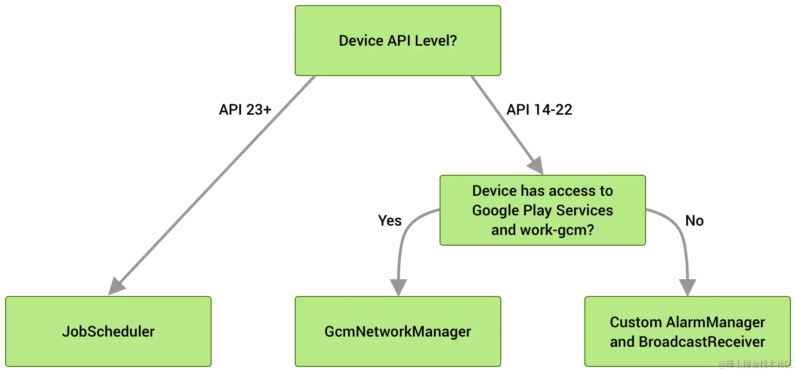
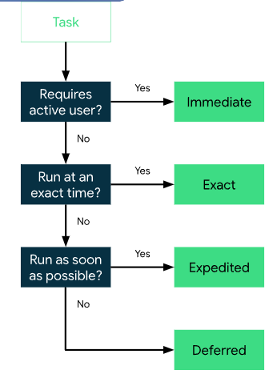

[官网：WorkManager](https://developer.android.google.cn/jetpack/androidx/releases/work?hl=zh-cn)

[官网：WorkManager 使用入门](https://developer.android.google.cn/develop/background-work/background-tasks/persistent/getting-started?hl=zh-cn)

# 一、WorkManager介绍

WorkManager是Google推出的组件, 用于解决**应用在退出或者设备重启后仍需要需要运行任务**的问题.

## 适用场景

什么时候应该选择使用 WorkManager 呢？


## 如何管理后台工作

WorkManager内部会根据设备的API级别自动选择底层作业的调度服务. 下面上一张官方图, 图中清晰说明了WorkManager在各个版本的API时选择的调度服务.目前最低可支持API 14



## 和直接在应用中使用线程的区别

首先WorkManager的作用并不是取代线程在Android中的工作。 [Google在官方的文档专门为后台任务做出了定义](https://link.juejin.cn?target=https%3A%2F%2Fdeveloper.android.com%2Fguide%2Fbackground%23ThreadPool)

Google 将后台任务具体分为了四种`Immediate Tasks`, `Exact Task`, `Expedited Task`, `Deferred Task`



### Immediate Task

当任务需要在用户操作APP时就完成,则可归类为Imeediate Task. 推荐在APP中使用Kotlin协程或Java的线程来执行任务

### Exact Task

当任务需要在精确的时间运行时,则可归类为Exact Task. 推荐使用AlarmManager

### Expedited Task & Deferred Task

除以上情景之外, 如果任务需要尽可能快开始时,则可归类为Expedited Task, 如果不需要则归类为Deferred Task. 推荐使用WorkManager

从WorkManager 2.7.0版本开始可以使用`setExpedited()`来申明Worker为加急任务. 对应上面的Expedited Task. 需要同时重写Worker中的`getForegroundInfoAsync`方法

```kotlin
OneTimeWorkRequestBuilder<T>().apply {
    setInputData(inputData)
    setExpedited(OutOfQuotaPolicy.RUN_AS_NON_EXPEDITED_WORK_REQUEST)
}.build()
```


# 二. WorkManager使用

## 添加依赖

```kotlin
dependencies {
    def work_version = "2.9.0"

    // (Java only)
    implementation "androidx.work:work-runtime:$work_version"

    // Kotlin + coroutines
    implementation "androidx.work:work-runtime-ktx:$work_version"

    // optional - RxJava2 support
    implementation "androidx.work:work-rxjava2:$work_version"

    // optional - GCMNetworkManager support
    implementation "androidx.work:work-gcm:$work_version"

    // optional - Test helpers
    androidTestImplementation "androidx.work:work-testing:$work_version"

    // optional - Multiprocess support
    implementation "androidx.work:work-multiprocess:$work_version"
}
```

## Worker & CoroutineWorker

Worker类作用为定义任务所执行的工作. 继承Worker类在`doWork()`方法中编写所需要执行的任务(如果想要使用Kotlin协程可以使用`CoroutineWorker`

`doWork()`方法返回值通知WorkManager任务执行的结果

- `Result.success()` 任务执行成功
- `Result.failure()` 任务执行失败
- `Result.retry()` 任务需重新执行

```java
@WorkerThread
public abstract @NonNull Result doWork();
```

## WorkRequests

WorkRequest类作用为定义工作`Worker`的运行方式(例如: `Worker`运行所需要满足的约束条件, 为`Worker`传递数据, `Worker`调度信息配置等). WorkManager提供了两种WorkRequest的实现

- OneTimeWorkRequest(一次性工作)
- PeriodicWorkRequest(定期工作)

```kotlin
// 传递给Worker的参数
val data = Data.Builder().putString(DownloadWorker.KEY_NAME, downloadContent).build()
// Worker执行的约束条件
val constraints = Constraints.Builder().setRequiredNetworkType(NetworkType.CONNECTED).build()
// 创建WorkRequest
OneTimeWorkRequestBuilder<DownloadWorker>()
    .addTag(DownloadWorker.TAG)
    .setInputData(data)
    .setConstraints(constraints)
    .build()
```

## WorkManager

WorkManager作用为管理Work. 例如加入任务,取消任务,以及监听任务的执行

加入任务

```kotlin
mWorkManager.beginUniqueWork(
    DownloadWorker.TAG,
    ExistingWorkPolicy.REPLACE,
    OneTimeWorkRequestBuilder<DownloadWorker>()
        .addTag(DownloadWorker.TAG)
        .setInputData(data)
        .setConstraints(constraints)
        //此设置需要在Worker中重写getForegroundInfo
        .setExpedited(OutOfQuotaPolicy.RUN_AS_NON_EXPEDITED_WORK_REQUEST)
        .build()
).enqueue()
```

监听Worker的执行

```kotlin
mWorkManager.getWorkInfosByTagLiveData(DownloadWorker.TAG)
    .observe(this) {
        if (it.isNotEmpty()) {
            val workInfo = it[0]
            when(workInfo.state) {
                WorkInfo.State.SUCCEEDED,
                WorkInfo.State.BLOCKED,
                WorkInfo.State.ENQUEUED,
                WorkInfo.State.RUNNING,
                WorkInfo.State.CANCELLED
            }
        }
    }
```

获取到的任务结果为`List<WorkInfo>`, List[0]代表当前最新

# 三. 示例

下面是一个。。。例子。


## 创建Worker模拟任务执行

```kotlin
class DownloadWorker : CoroutineWorker {

    private lateinit var mNotificationBuilder: NotificationCompat.Builder

    constructor(appContext: Context, params: WorkerParameters) : super(appContext, params)

    //Worker执行任务
    override suspend fun doWork(): Result {
        val data = fakeDownload()
        showSuccessNotification()
        val outData = Data.Builder().putString(OUTPUT_KEY, data).build()
        return Result.success(outData)
    }

    //创建ForegroundInfo Worker将会作为前台服务运行
    override suspend fun getForegroundInfo(): ForegroundInfo {
        val context = applicationContext
        return ForegroundInfo(
            START_DOWNLOAD_NOTIFICATION_ID,
            createNotification(context) {
                setContentTitle("Start Download")
                setSmallIcon(R.drawable.ic_launcher_foreground)
                setContentText("Start Download ${inputData.getString(INPUT_KEY)}")
                priority = NotificationCompat.PRIORITY_DEFAULT
                val cancel = WorkManager.getInstance(context).createCancelPendingIntent(id)
                //设置cancelWork按钮
                addAction(R.drawable.icon_cancel, "Cancel", cancel)
                mNotificationBuilder = this
            }
        )
    }

    private suspend fun fakeDownload(): String {
        Log.i(TAG, "Thread:${Thread.currentThread().name}")
        for (i in 0..100) {
            delay(100L)
            mNotificationBuilder.setContentText("Start Download ${inputData.getString(INPUT_KEY)} $i%")
            notifyNotification(applicationContext, START_DOWNLOAD_NOTIFICATION_ID, mNotificationBuilder.build())
        }
        Log.i(TAG, "Download Succeed")
        return "Download Succeed"
    }

    private fun showSuccessNotification() {
        notifyNotification(applicationContext, DOWNLOAD_SUCCEED_NOTIFICATION_ID) {
            setContentTitle("Download Succeed")
            setSmallIcon(R.drawable.ic_launcher_foreground)
            setContentText("Download ${inputData.getString(INPUT_KEY)} Succeed")
            priority = NotificationCompat.PRIORITY_DEFAULT
            setAutoCancel(true)
            val intent = Intent(applicationContext, MainActivity::class.java)
            val pendingIntent = PendingIntent.getActivity(applicationContext, 0, intent, PendingIntent.FLAG_IMMUTABLE)
            setContentIntent(pendingIntent)
        }
    }

}
```

## 创建WorkRequest

创建WorkRequest 设置执行条件,参数传递, 并加入任务队列

```kotlin
private fun enqueueDownloadWork() {
    val downloadContent = "复仇者联盟"
    val constraints = Constraints.Builder().setRequiredNetworkType(NetworkType.CONNECTED).build()
    val data = Data.Builder().putString(DownloadWorker.INPUT_KEY, downloadContent).build()
    mWorkManager.beginUniqueWork(
        DownloadWorker.TAG,
        ExistingWorkPolicy.REPLACE,
        OneTimeWorkRequestBuilder<DownloadWorker>()
            .addTag(DownloadWorker.TAG)
            .setInputData(data)
            .setConstraints(constraints)
            .setExpedited(OutOfQuotaPolicy.RUN_AS_NON_EXPEDITED_WORK_REQUEST)//
            .build()
    ).enqueue()
}
```

## 监听任务执行情况

通过先前加入任务时设置的TAG监听Worker的执行情况

```kotlin
mWorkManager.getWorkInfosByTagLiveData(DownloadWorker.TAG)
    .observe(this) {
        if (it.isNotEmpty()) {
            val workInfo = it[0]
            when(workInfo.state) {
                WorkInfo.State.SUCCEEDED -> {
                    mBinding.download.setText("重新下载")
                    mBinding.tips.visibility = View.VISIBLE
                    mBinding.tips.text = workInfo.outputData.getString(DownloadWorker.OUTPUT_KEY)
                    mBinding.download.setOnClickListener {
                        enqueueDownloadWork()
                    }
                }
                WorkInfo.State.BLOCKED,
                WorkInfo.State.ENQUEUED,
                WorkInfo.State.RUNNING, -> {
                    mBinding.tips.text = "正在下载"
                    mBinding.download.text = "取消下载"
                    mBinding.download.setOnClickListener {
                        mWorkManager.cancelUniqueWork(DownloadWorker.TAG)
                    }
                }
                WorkInfo.State.CANCELLED -> {
                    mBinding.tips.visibility = View.GONE
                    mBinding.download.text = "开始下载"
                    mBinding.download.setOnClickListener {
                        enqueueDownloadWork()
                    }
                }
            }
        }
    }
```

## demo地址


# 参考

1、[Android WorkManager入门与实践](https://juejin.cn/post/7032920470328442910)